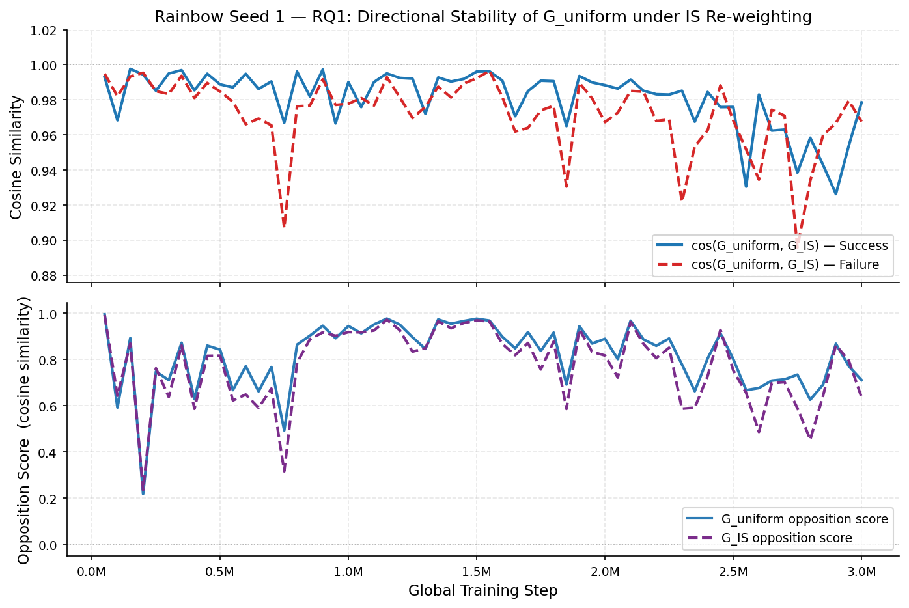
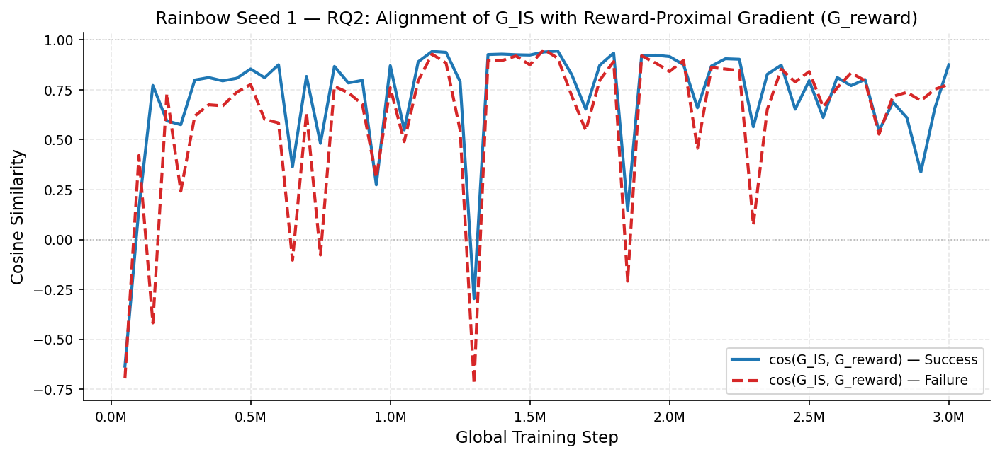
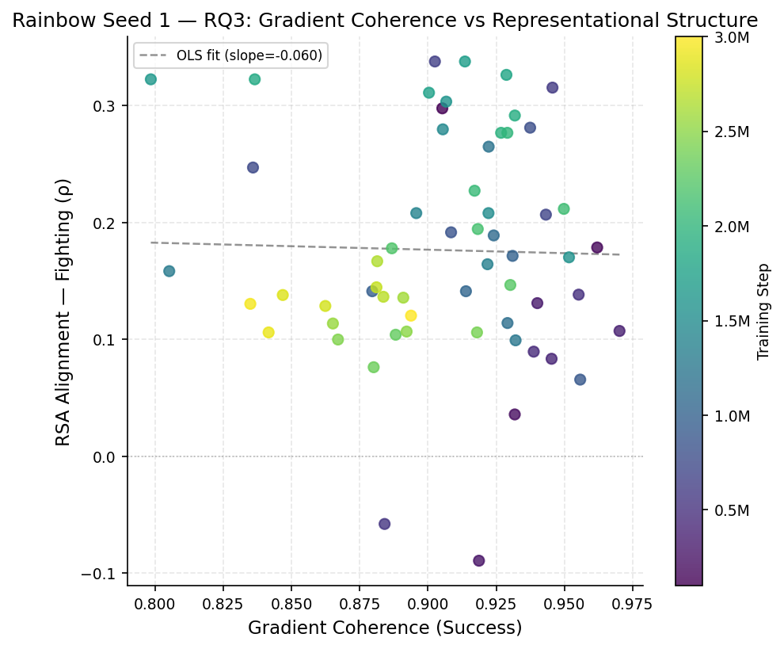
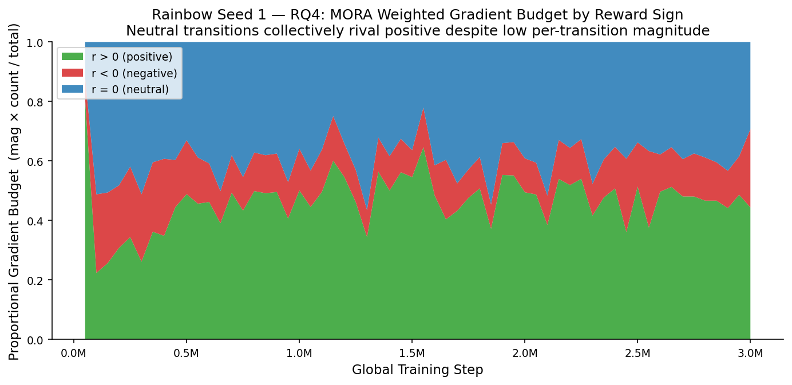
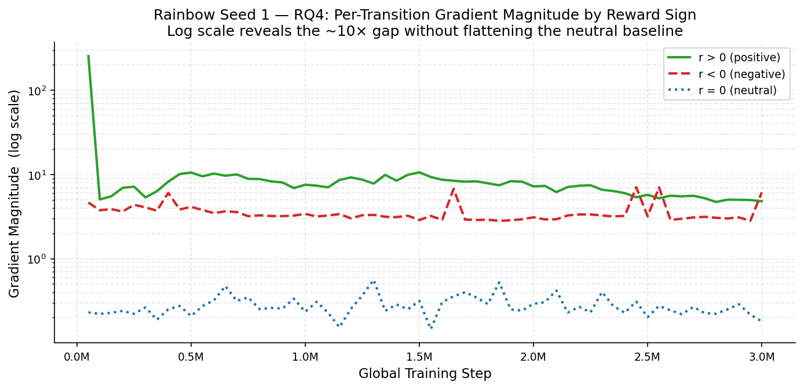
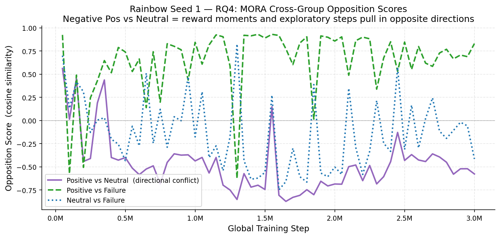

# Training & Analysis Report

**Environment:** `Crafter`  
**Seed:** 1  
**Total episodes:** 13,211  
**Experiment root:** `rainbow_experiment_root\seed_1`  
**Generated:** 2026-04-09 11:36

## Summary

| Checkpoint | Episodes | Opp. Score | Coh. (S) | Coh. (F) | Grad Mag (S) | Grad Mag (F) | Act. Sep. | Act. Cos. Dist. | RSA (ρ) |
|---|---:|---:|---:|---:|---:|---:|---:|---:|---:|
| collect_sapling @ ep149 | 149 | 0.9971 | 0.9353 | 0.9622 | 0.0858 | 0.0920 | 0.0372 | 0.0000 | — |
| collect_wood @ ep149 | 149 | 0.9857 | 0.9443 | 0.9484 | 0.0841 | 0.0946 | 0.1094 | 0.0001 | — |
| collect_drink @ ep161 | 161 | 0.9692 | 0.8622 | 0.8379 | 0.0532 | 0.0627 | 0.0762 | 0.0001 | — |
| place_plant @ ep280 | 280 | -0.6702 | 0.9513 | 0.8693 | 0.1166 | 0.0877 | 1.1027 | 0.0134 | — |
| Step 50,000 | 292 | 0.9945 | 0.8955 | 0.8174 | 0.1686 | 0.1918 | 0.2686 | 0.0002 | — |
| eat_cow @ ep319 | 319 | 0.9333 | 0.6700 | 0.4425 | 0.0946 | 0.1187 | 0.2138 | 0.0004 | — |
| defeat_zombie @ ep354 | 354 | 0.9321 | 0.9516 | 0.8687 | 0.3157 | 0.1872 | 2.0510 | 0.0221 | — |
| Step 100,000 | 566 | 0.5922 | 0.9053 | 0.9326 | 0.0742 | 0.0759 | 0.2093 | 0.0006 | — |
| make_wood_sword @ ep609 | 609 | 0.9448 | 0.9802 | 0.9745 | 0.1908 | 0.1756 | 0.3048 | 0.0011 | — |
| place_table @ ep609 | 609 | 0.9402 | 0.9695 | 0.9778 | 0.1898 | 0.1773 | 0.2968 | 0.0011 | — |
| Step 150,000 | 827 | 0.8922 | 0.9620 | 0.9301 | 0.2667 | 0.1994 | 0.5210 | 0.0034 | — |
| defeat_skeleton @ ep1066 | 1,066 | 0.6639 | 0.9793 | 0.9074 | 0.2913 | 0.2000 | 1.1444 | 0.0140 | — |
| Step 200,000 | 1,092 | 0.2184 | 0.9318 | 0.9223 | 0.1737 | 0.1852 | 1.2225 | 0.0180 | — |
| Step 250,000 | 1,353 | 0.7477 | 0.9187 | 0.8667 | 0.1808 | 0.1953 | 1.1233 | 0.0158 | — |
| Step 300,000 | 1,623 | 0.7108 | 0.9401 | 0.9372 | 0.2027 | 0.1561 | 0.5629 | 0.0053 | — |
| Step 350,000 | 1,901 | 0.8719 | 0.9702 | 0.9790 | 0.3466 | 0.3105 | 0.5596 | 0.0061 | — |
| Step 400,000 | 2,177 | 0.6280 | 0.9453 | 0.8592 | 0.1700 | 0.1862 | 0.7199 | 0.0120 | — |
| Step 450,000 | 2,444 | 0.8596 | 0.9388 | 0.8616 | 0.2788 | 0.2845 | 0.9859 | 0.0224 | — |
| wake_up @ ep2474 | 2,474 | 0.6658 | 0.9695 | 0.9102 | 0.3157 | 0.2492 | 0.8938 | 0.0204 | — |
| Step 500,000 | 2,709 | 0.8423 | 0.9552 | 0.9243 | 0.3102 | 0.3488 | 0.8791 | 0.0223 | — |
| Step 550,000 | 2,971 | 0.6674 | 0.8841 | 0.9053 | 0.2714 | 0.2829 | 0.6172 | 0.0115 | — |
| make_wood_pickaxe @ ep3219 | 3,219 | 0.8500 | 0.9489 | 0.8830 | 0.3416 | 0.3105 | 0.6450 | 0.0130 | — |
| Step 600,000 | 3,229 | 0.7705 | 0.9456 | 0.8326 | 0.2700 | 0.2141 | 0.5581 | 0.0097 | — |
| Step 650,000 | 3,482 | 0.6620 | 0.9026 | 0.9069 | 0.2822 | 0.2436 | 0.3388 | 0.0040 | — |
| Step 700,000 | 3,724 | 0.7672 | 0.9432 | 0.8758 | 0.3139 | 0.2252 | 0.4006 | 0.0056 | — |
| Step 750,000 | 3,952 | 0.4932 | 0.8359 | 0.7847 | 0.1805 | 0.1308 | 0.3199 | 0.0045 | — |
| Step 800,000 | 4,181 | 0.8639 | 0.9375 | 0.8419 | 0.2676 | 0.2219 | 0.3720 | 0.0061 | — |
| Step 850,000 | 4,403 | 0.9028 | 0.9085 | 0.9045 | 0.2542 | 0.2777 | 0.3052 | 0.0048 | — |
| Step 900,000 | 4,624 | 0.9456 | 0.9558 | 0.8561 | 0.3104 | 0.2435 | 0.3509 | 0.0061 | — |
| Step 950,000 | 4,845 | 0.8917 | 0.8796 | 0.8658 | 0.1907 | 0.2522 | 0.3543 | 0.0066 | — |
| Step 1,000,000 | 5,064 | 0.9445 | 0.9310 | 0.8407 | 0.2422 | 0.2169 | 0.3222 | 0.0055 | — |
| Step 1,050,000 | 5,284 | 0.9130 | 0.9139 | 0.8799 | 0.2170 | 0.2578 | 0.3061 | 0.0053 | — |
| Step 1,100,000 | 5,508 | 0.9513 | 0.9241 | 0.8135 | 0.2470 | 0.1993 | 0.2928 | 0.0048 | — |
| collect_stone @ ep5586 | 5,586 | 0.9477 | 0.9264 | 0.8524 | 0.2865 | 0.2419 | 0.3520 | 0.0070 | — |
| Step 1,150,000 | 5,720 | 0.9766 | 0.9292 | 0.8970 | 0.3895 | 0.4141 | 0.3031 | 0.0052 | — |
| Step 1,200,000 | 5,935 | 0.9507 | 0.9223 | 0.8174 | 0.2761 | 0.2546 | 0.2896 | 0.0046 | — |
| Step 1,250,000 | 6,153 | 0.8961 | 0.9321 | 0.7888 | 0.2478 | 0.1701 | 0.3312 | 0.0058 | — |
| Step 1,300,000 | 6,367 | 0.8454 | 0.8052 | 0.8119 | 0.1842 | 0.2321 | 0.3268 | 0.0057 | — |
| Step 1,350,000 | 6,580 | 0.9729 | 0.9218 | 0.9133 | 0.3981 | 0.3911 | 0.3275 | 0.0051 | — |
| Step 1,400,000 | 6,788 | 0.9544 | 0.8957 | 0.8473 | 0.2638 | 0.2545 | 0.2837 | 0.0041 | — |
| Step 1,450,000 | 6,988 | 0.9662 | 0.9055 | 0.8802 | 0.3554 | 0.3958 | 0.3270 | 0.0051 | — |
| Step 1,500,000 | 7,192 | 0.9760 | 0.9222 | 0.8570 | 0.3480 | 0.2979 | 0.2818 | 0.0039 | — |
| Step 1,550,000 | 7,400 | 0.9679 | 0.9517 | 0.9144 | 0.5452 | 0.6742 | 0.4050 | 0.0082 | — |
| collect_coal @ ep7562 | 7,562 | 0.9291 | 0.8852 | 0.7989 | 0.2063 | 0.1905 | 0.4445 | 0.0091 | — |
| Step 1,600,000 | 7,610 | 0.8983 | 0.9067 | 0.8243 | 0.2476 | 0.2836 | 0.4501 | 0.0095 | — |
| Step 1,650,000 | 7,816 | 0.8480 | 0.7985 | 0.8036 | 0.2036 | 0.2152 | 0.3575 | 0.0059 | — |
| Step 1,700,000 | 8,021 | 0.9182 | 0.9136 | 0.7670 | 0.2514 | 0.1885 | 0.3615 | 0.0068 | — |
| Step 1,750,000 | 8,227 | 0.8368 | 0.9004 | 0.7622 | 0.2171 | 0.2252 | 0.4355 | 0.0094 | — |
| Step 1,800,000 | 8,431 | 0.9159 | 0.9288 | 0.8211 | 0.2780 | 0.2517 | 0.3779 | 0.0067 | — |
| Step 1,850,000 | 8,642 | 0.6916 | 0.8366 | 0.7036 | 0.1649 | 0.1585 | 0.4679 | 0.0108 | — |
| Step 1,900,000 | 8,843 | 0.9437 | 0.9318 | 0.8413 | 0.3329 | 0.3294 | 0.4131 | 0.0084 | — |
| Step 1,950,000 | 9,051 | 0.8686 | 0.9268 | 0.8202 | 0.2939 | 0.3220 | 0.5327 | 0.0135 | — |
| Step 2,000,000 | 9,252 | 0.8893 | 0.9291 | 0.8368 | 0.2696 | 0.2367 | 0.5446 | 0.0137 | — |
| Step 2,050,000 | 9,457 | 0.8016 | 0.9171 | 0.8346 | 0.2612 | 0.2757 | 0.5439 | 0.0138 | — |
| Step 2,100,000 | 9,664 | 0.9673 | 0.9498 | 0.8774 | 0.3530 | 0.3189 | 0.4765 | 0.0097 | — |
| place_stone @ ep9824 | 9,824 | 0.9499 | 0.9287 | 0.9019 | 0.3467 | 0.3880 | 0.5052 | 0.0109 | — |
| Step 2,150,000 | 9,872 | 0.8865 | 0.9183 | 0.8319 | 0.3468 | 0.4151 | 0.4750 | 0.0097 | — |
| place_furnace @ ep9900 | 9,900 | 0.8315 | 0.8971 | 0.7422 | 0.2669 | 0.2681 | 0.6011 | 0.0149 | — |
| Step 2,200,000 | 10,071 | 0.8591 | 0.8868 | 0.8032 | 0.2836 | 0.2936 | 0.5189 | 0.0104 | — |
| make_stone_pickaxe @ ep10087 | 10,087 | 0.8620 | 0.8954 | 0.7726 | 0.2693 | 0.2646 | 0.5183 | 0.0108 | — |
| Step 2,250,000 | 10,269 | 0.8907 | 0.9302 | 0.8172 | 0.3048 | 0.3002 | 0.6781 | 0.0170 | — |
| make_stone_sword @ ep10348 | 10,348 | 0.8604 | 0.9441 | 0.7986 | 0.3463 | 0.2661 | 0.6509 | 0.0149 | — |
| Step 2,300,000 | 10,470 | 0.7784 | 0.8882 | 0.7013 | 0.2493 | 0.1885 | 0.6486 | 0.0153 | — |
| Step 2,350,000 | 10,676 | 0.6627 | 0.8801 | 0.7911 | 0.2179 | 0.2597 | 0.9854 | 0.0309 | — |
| Step 2,400,000 | 10,871 | 0.8039 | 0.9180 | 0.8226 | 0.2594 | 0.2505 | 1.0247 | 0.0318 | — |
| Step 2,450,000 | 11,071 | 0.9126 | 0.8671 | 0.8284 | 0.3347 | 0.4996 | 0.9050 | 0.0226 | — |
| Step 2,500,000 | 11,261 | 0.8014 | 0.8922 | 0.8077 | 0.2741 | 0.2687 | 1.1847 | 0.0390 | — |
| Step 2,550,000 | 11,459 | 0.6672 | 0.8652 | 0.7966 | 0.2118 | 0.2678 | 0.9383 | 0.0236 | — |
| Step 2,600,000 | 11,653 | 0.6763 | 0.8910 | 0.7787 | 0.2600 | 0.1969 | 1.0955 | 0.0321 | — |
| collect_iron @ ep11796 | 11,796 | 0.8276 | 0.8737 | 0.7986 | 0.2919 | 0.4010 | 1.1549 | 0.0399 | — |
| Step 2,650,000 | 11,840 | 0.7085 | 0.8814 | 0.7250 | 0.2555 | 0.3908 | 1.1446 | 0.0366 | — |
| Step 2,700,000 | 12,033 | 0.7140 | 0.8837 | 0.7482 | 0.2405 | 0.3666 | 1.1901 | 0.0393 | — |
| Step 2,750,000 | 12,230 | 0.7342 | 0.8812 | 0.7283 | 0.2336 | 0.1896 | 1.2797 | 0.0456 | — |
| Step 2,800,000 | 12,431 | 0.6258 | 0.8624 | 0.7073 | 0.1918 | 0.1921 | 1.0769 | 0.0354 | — |
| Step 2,850,000 | 12,628 | 0.6913 | 0.8468 | 0.7152 | 0.1794 | 0.2337 | 1.2728 | 0.0516 | — |
| Step 2,900,000 | 12,824 | 0.8677 | 0.8416 | 0.7399 | 0.1862 | 0.2773 | 0.8858 | 0.0254 | — |
| Step 2,950,000 | 13,018 | 0.7711 | 0.8349 | 0.6845 | 0.1782 | 0.3449 | 1.1141 | 0.0405 | — |
| Step 3,000,000 | 13,211 | 0.7108 | 0.8938 | 0.6368 | 0.1797 | 0.2467 | 1.0319 | 0.0328 | — |

---

## Longitudinal Analysis

### RQ1 — Directional Stability: cos(G_uniform, G_IS) and Opposition Score

*Top panel: cosine similarity between G_uniform and G_IS for success/failure groups (expected ~0.97–1.0 throughout). Bottom panel: opposition score under both weightings — G_IS tracks G_uniform closely, confirming IS re-weighting does not substantially redirect gradient direction.*

### RQ2 — PER Directional Influence: cos(G_IS, G_reward)

*Alignment between the IS-weighted gradient and the reward-proximal gradient proxy. High values indicate PER tends to up-weight reward-proximal transitions; variance across training reflects inconsistency of this alignment.*

### RQ3 — Coherence vs Representational Structure (Scatter)

*Each point is one periodic checkpoint. Colour encodes training stage (early=dark, late=bright). A positive slope would support the RQ3 prediction that high gradient coherence predicts better semantic structure. Weak/absent correlation is itself informative.*

### RQ4 — MORA: Weighted Gradient Budget by Reward Sign

*Proportional gradient contribution = gradient_magnitude × n_transitions, normalised to sum to 1. Resolves the scale problem: despite ~5–10× higher per-transition magnitude, positive transitions do not overwhelmingly dominate because neutral transitions vastly outnumber them.*

### RQ4 — MORA: Per-Transition Gradient Magnitude (Log Scale)

*Log y-axis makes the 5–10× gap between positive and neutral per-transition magnitudes readable without flattening the neutral baseline. Negative transitions sit in between.*

### RQ4 — MORA: Cross-Group Opposition Scores

*Three pairwise comparisons: Positive vs Neutral (directional conflict — persistently negative means reward moments and exploratory steps push the network in opposite directions); Positive vs Failure; Neutral vs Failure.*

---

## collect_sapling_ep149_lower0.000_upper0.000

### Metrics

| Metric | Value |
|---|---|
| Opposition Score | 0.9971 |
| Coherence (Success) | 0.9353 |
| Coherence (Failure) | 0.9622 |
| Gradient Magnitude (Success) | 0.0858 |
| Gradient Magnitude (Failure) | 0.0920 |
| Activation Separation | 0.0372 |
| Cosine Distance | 0.0000 |
| Clusters | 1,627 |
| Noise Fraction | 0.1850 |
| RSA Alignment (ρ) | — |
| RSA Stimuli (4) | Place Plant, Sapling, Wake Up, Wood |

### Gradient Variant Analysis (RQ1 / RQ2)

| Variant | Opp. Score | Coh. (S) | Coh. (F) | Grad Mag (S) | Grad Mag (F) |
|---|---:|---:|---:|---:|---:|
| G_uniform | 0.9971 | 0.9353 | 0.9622 | 0.0858 | 0.0920 |
| G_IS (β=0.401) | 0.9975 | 0.9427 | 0.9657 | 0.0832 | 0.0888 |

| Directional Alignment | Success | Failure |
|---|---:|---:|
| cos(G_uniform, G_IS) | 0.9992 | 0.9994 |
| cos(G_IS, G_reward)  | 0.9316 | 0.9462 |

### Moment of Reward (Rainbow)

| Subgroup | N transitions | Grad Mag | Coherence |
|---|---:|---:|---:|
| Positive (r > 0) | 215 | 36.5412 | 0.9852 |
| Neutral  (r = 0) | 42,268 | 0.0874 | 0.9828 |
| Negative (r < 0) | 1,305 | 3.0782 | 0.6954 |

| Comparison | Opp. Score |
|---|---:|
| Pos vs Neutral   | -0.7538 |
| Pos vs Negative  | -0.4529 |
| Neutral vs Neg.  | 0.0378 |
| Pos vs Failure   | -0.7984 |
| Neutral vs Fail. | 0.5699 |
| Neg. vs Failure  | 0.7922 |

---

## collect_wood_ep149_lower0.000_upper0.000

### Metrics

| Metric | Value |
|---|---|
| Opposition Score | 0.9857 |
| Coherence (Success) | 0.9443 |
| Coherence (Failure) | 0.9484 |
| Gradient Magnitude (Success) | 0.0841 |
| Gradient Magnitude (Failure) | 0.0946 |
| Activation Separation | 0.1094 |
| Cosine Distance | 0.0001 |
| Clusters | 1,672 |
| Noise Fraction | 0.1937 |
| RSA Alignment (ρ) | — |
| RSA Stimuli (3) | Drink, Wake Up, Wood |

### Gradient Variant Analysis (RQ1 / RQ2)

| Variant | Opp. Score | Coh. (S) | Coh. (F) | Grad Mag (S) | Grad Mag (F) |
|---|---:|---:|---:|---:|---:|
| G_uniform | 0.9857 | 0.9443 | 0.9484 | 0.0841 | 0.0946 |
| G_IS (β=0.401) | 0.9875 | 0.9504 | 0.9525 | 0.0809 | 0.0904 |

| Directional Alignment | Success | Failure |
|---|---:|---:|
| cos(G_uniform, G_IS) | 0.9991 | 0.9995 |
| cos(G_IS, G_reward)  | 0.9253 | 0.9498 |

### Moment of Reward (Rainbow)

| Subgroup | N transitions | Grad Mag | Coherence |
|---|---:|---:|---:|
| Positive (r > 0) | 229 | 38.1751 | 0.9885 |
| Neutral  (r = 0) | 42,921 | 0.0854 | 0.9807 |
| Negative (r < 0) | 1,306 | 3.1121 | 0.9160 |

| Comparison | Opp. Score |
|---|---:|
| Pos vs Neutral   | -0.7514 |
| Pos vs Negative  | -0.4502 |
| Neutral vs Neg.  | 0.0148 |
| Pos vs Failure   | -0.8101 |
| Neutral vs Fail. | 0.5789 |
| Neg. vs Failure  | 0.7735 |

---

## collect_drink_ep161_lower0.000_upper0.000

### Metrics

| Metric | Value |
|---|---|
| Opposition Score | 0.9692 |
| Coherence (Success) | 0.8622 |
| Coherence (Failure) | 0.8379 |
| Gradient Magnitude (Success) | 0.0532 |
| Gradient Magnitude (Failure) | 0.0627 |
| Activation Separation | 0.0762 |
| Cosine Distance | 0.0001 |
| Clusters | 1,692 |
| Noise Fraction | 0.1851 |
| RSA Alignment (ρ) | — |
| RSA Stimuli (3) | Place Plant, Sapling, Wake Up |

### Gradient Variant Analysis (RQ1 / RQ2)

| Variant | Opp. Score | Coh. (S) | Coh. (F) | Grad Mag (S) | Grad Mag (F) |
|---|---:|---:|---:|---:|---:|
| G_uniform | 0.9692 | 0.8622 | 0.8379 | 0.0532 | 0.0627 |
| G_IS (β=0.401) | 0.9761 | 0.8931 | 0.8607 | 0.0504 | 0.0587 |

| Directional Alignment | Success | Failure |
|---|---:|---:|
| cos(G_uniform, G_IS) | 0.9956 | 0.9979 |
| cos(G_IS, G_reward)  | 0.8834 | 0.9290 |

### Moment of Reward (Rainbow)

| Subgroup | N transitions | Grad Mag | Coherence |
|---|---:|---:|---:|
| Positive (r > 0) | 207 | 42.5984 | 0.8836 |
| Neutral  (r = 0) | 42,242 | 0.0536 | 0.9741 |
| Negative (r < 0) | 1,299 | 3.6347 | 0.9953 |

| Comparison | Opp. Score |
|---|---:|
| Pos vs Neutral   | -0.5321 |
| Pos vs Negative  | -0.6992 |
| Neutral vs Neg.  | -0.0159 |
| Pos vs Failure   | -0.7226 |
| Neutral vs Fail. | 0.0152 |
| Neg. vs Failure  | 0.9655 |

---

## place_plant_ep280_lower0.000_upper1.900

### Metrics

| Metric | Value |
|---|---|
| Opposition Score | -0.6702 |
| Coherence (Success) | 0.9513 |
| Coherence (Failure) | 0.8693 |
| Gradient Magnitude (Success) | 0.1166 |
| Gradient Magnitude (Failure) | 0.0877 |
| Activation Separation | 1.1027 |
| Cosine Distance | 0.0134 |
| Clusters | 1,553 |
| Noise Fraction | 0.1371 |
| RSA Alignment (ρ) | — |
| RSA Stimuli (7) | Drink, Eat Cow, Place Plant, Sapling, Wake Up, Wood, Zombie |

### Gradient Variant Analysis (RQ1 / RQ2)

| Variant | Opp. Score | Coh. (S) | Coh. (F) | Grad Mag (S) | Grad Mag (F) |
|---|---:|---:|---:|---:|---:|
| G_uniform | -0.6702 | 0.9513 | 0.8693 | 0.1166 | 0.0877 |
| G_IS (β=0.406) | -0.7391 | 0.9255 | 0.9413 | 0.0759 | 0.0970 |

| Directional Alignment | Success | Failure |
|---|---:|---:|
| cos(G_uniform, G_IS) | 0.9909 | 0.9899 |
| cos(G_IS, G_reward)  | 0.8869 | 0.9794 |

### Moment of Reward (Rainbow)

| Subgroup | N transitions | Grad Mag | Coherence |
|---|---:|---:|---:|
| Positive (r > 0) | 702 | 12.5057 | 0.6711 |
| Neutral  (r = 0) | 48,559 | 0.1065 | 0.9687 |
| Negative (r < 0) | 1,342 | 4.5359 | 0.9973 |

| Comparison | Opp. Score |
|---|---:|
| Pos vs Neutral   | 0.5932 |
| Pos vs Negative  | -0.6324 |
| Neutral vs Neg.  | -0.8967 |
| Pos vs Failure   | -0.5267 |
| Neutral vs Fail. | -0.6873 |
| Neg. vs Failure  | 0.6472 |

---

## ep292_lower0.000_upper0.000

### Metrics

| Metric | Value |
|---|---|
| Opposition Score | 0.9945 |
| Coherence (Success) | 0.8955 |
| Coherence (Failure) | 0.8174 |
| Gradient Magnitude (Success) | 0.1686 |
| Gradient Magnitude (Failure) | 0.1918 |
| Activation Separation | 0.2686 |
| Cosine Distance | 0.0002 |
| Clusters | 2,225 |
| Noise Fraction | 0.1320 |
| RSA Alignment (ρ) | — |
| RSA Stimuli (6) | Drink, Eat Cow, Place Plant, Sapling, Wake Up, Wood |

### Gradient Variant Analysis (RQ1 / RQ2)

| Variant | Opp. Score | Coh. (S) | Coh. (F) | Grad Mag (S) | Grad Mag (F) |
|---|---:|---:|---:|---:|---:|
| G_uniform | 0.9945 | 0.8955 | 0.8174 | 0.1686 | 0.1918 |
| G_IS (β=0.406) | 0.9916 | 0.8593 | 0.7281 | 0.1009 | 0.1146 |

| Directional Alignment | Success | Failure |
|---|---:|---:|
| cos(G_uniform, G_IS) | 0.9930 | 0.9949 |
| cos(G_IS, G_reward)  | -0.6349 | -0.6960 |

### Moment of Reward (Rainbow)

| Subgroup | N transitions | Grad Mag | Coherence |
|---|---:|---:|---:|
| Positive (r > 0) | 261 | 255.5565 | 0.8946 |
| Neutral  (r = 0) | 42,616 | 0.2303 | 0.9715 |
| Negative (r < 0) | 1,324 | 4.6499 | 0.8937 |

| Comparison | Opp. Score |
|---|---:|
| Pos vs Neutral   | 0.5612 |
| Pos vs Negative  | -0.7751 |
| Neutral vs Neg.  | -0.8956 |
| Pos vs Failure   | 0.9237 |
| Neutral vs Fail. | 0.7002 |
| Neg. vs Failure  | -0.8730 |

---

## eat_cow_ep319_lower0.000_upper0.000

### Metrics

| Metric | Value |
|---|---|
| Opposition Score | 0.9333 |
| Coherence (Success) | 0.6700 |
| Coherence (Failure) | 0.4425 |
| Gradient Magnitude (Success) | 0.0946 |
| Gradient Magnitude (Failure) | 0.1187 |
| Activation Separation | 0.2138 |
| Cosine Distance | 0.0004 |
| Clusters | 2,272 |
| Noise Fraction | 0.1299 |
| RSA Alignment (ρ) | — |
| RSA Stimuli (5) | Drink, Sapling, Skeleton, Wake Up, Wood |

### Gradient Variant Analysis (RQ1 / RQ2)

| Variant | Opp. Score | Coh. (S) | Coh. (F) | Grad Mag (S) | Grad Mag (F) |
|---|---:|---:|---:|---:|---:|
| G_uniform | 0.9333 | 0.6700 | 0.4425 | 0.0946 | 0.1187 |
| G_IS (β=0.407) | 0.9331 | 0.5909 | 0.4094 | 0.0635 | 0.0865 |

| Directional Alignment | Success | Failure |
|---|---:|---:|
| cos(G_uniform, G_IS) | 0.9527 | 0.9568 |
| cos(G_IS, G_reward)  | 0.4925 | 0.4560 |

### Moment of Reward (Rainbow)

| Subgroup | N transitions | Grad Mag | Coherence |
|---|---:|---:|---:|
| Positive (r > 0) | 367 | 168.7328 | 0.8504 |
| Neutral  (r = 0) | 45,758 | 0.0803 | 0.7701 |
| Negative (r < 0) | 1,364 | 4.9073 | 0.9864 |

| Comparison | Opp. Score |
|---|---:|
| Pos vs Neutral   | -0.0859 |
| Pos vs Negative  | -0.8205 |
| Neutral vs Neg.  | -0.2637 |
| Pos vs Failure   | 0.1319 |
| Neutral vs Fail. | -0.1928 |
| Neg. vs Failure  | 0.2532 |

---

## defeat_zombie_ep354_lower0.000_upper2.900

### Metrics

| Metric | Value |
|---|---|
| Opposition Score | 0.9321 |
| Coherence (Success) | 0.9516 |
| Coherence (Failure) | 0.8687 |
| Gradient Magnitude (Success) | 0.3157 |
| Gradient Magnitude (Failure) | 0.1872 |
| Activation Separation | 2.0510 |
| Cosine Distance | 0.0221 |
| Clusters | 2,206 |
| Noise Fraction | 0.1431 |
| RSA Alignment (ρ) | — |
| RSA Stimuli (8) | Drink, Eat Cow, Place Plant, Sapling, Skeleton, Wake Up, Wood, Zombie |

### Gradient Variant Analysis (RQ1 / RQ2)

| Variant | Opp. Score | Coh. (S) | Coh. (F) | Grad Mag (S) | Grad Mag (F) |
|---|---:|---:|---:|---:|---:|
| G_uniform | 0.9321 | 0.9516 | 0.8687 | 0.3157 | 0.1872 |
| G_IS (β=0.408) | 0.9194 | 0.9450 | 0.8540 | 0.2138 | 0.1219 |

| Directional Alignment | Success | Failure |
|---|---:|---:|
| cos(G_uniform, G_IS) | 0.9995 | 0.9969 |
| cos(G_IS, G_reward)  | 0.5964 | -0.1940 |

| Weight-Delta Alignment | Success | Failure |
|---|---:|---:|
| cos(G_uniform, Δθ) | 0.0601 | 0.0482 |
| cos(G_IS, Δθ)      | 0.0600 | 0.0461 |
| cos(G_reward, Δθ)  | 0.0240 | -0.0072 |

### Moment of Reward (Rainbow)

| Subgroup | N transitions | Grad Mag | Coherence |
|---|---:|---:|---:|
| Positive (r > 0) | 952 | 2.4617 | 0.9030 |
| Neutral  (r = 0) | 44,528 | 0.2585 | 0.9785 |
| Negative (r < 0) | 1,401 | 3.7168 | 0.7659 |

| Comparison | Opp. Score |
|---|---:|
| Pos vs Neutral   | 0.0823 |
| Pos vs Negative  | -0.1829 |
| Neutral vs Neg.  | -0.8519 |
| Pos vs Failure   | -0.2152 |
| Neutral vs Fail. | 0.6917 |
| Neg. vs Failure  | -0.3662 |

---

## ep566_lower1.900_upper1.900

### Metrics

| Metric | Value |
|---|---|
| Opposition Score | 0.5922 |
| Coherence (Success) | 0.9053 |
| Coherence (Failure) | 0.9326 |
| Gradient Magnitude (Success) | 0.0742 |
| Gradient Magnitude (Failure) | 0.0759 |
| Activation Separation | 0.2093 |
| Cosine Distance | 0.0006 |
| Clusters | 1,735 |
| Noise Fraction | 0.1582 |
| RSA Alignment (ρ) | — |
| RSA Stimuli (8) | Drink, Eat Cow, Place Plant, Sapling, Skeleton, Wake Up, Wood, Zombie |

### Gradient Variant Analysis (RQ1 / RQ2)

| Variant | Opp. Score | Coh. (S) | Coh. (F) | Grad Mag (S) | Grad Mag (F) |
|---|---:|---:|---:|---:|---:|
| G_uniform | 0.5922 | 0.9053 | 0.9326 | 0.0742 | 0.0759 |
| G_IS (β=0.416) | 0.6435 | 0.8988 | 0.9296 | 0.0487 | 0.0596 |

| Directional Alignment | Success | Failure |
|---|---:|---:|
| cos(G_uniform, G_IS) | 0.9684 | 0.9821 |
| cos(G_IS, G_reward)  | 0.1563 | 0.4205 |

| Weight-Delta Alignment | Success | Failure |
|---|---:|---:|
| cos(G_uniform, Δθ) | 0.0353 | 0.0146 |
| cos(G_IS, Δθ)      | 0.0319 | 0.0079 |
| cos(G_reward, Δθ)  | -0.0015 | -0.0345 |

### Moment of Reward (Rainbow)

| Subgroup | N transitions | Grad Mag | Coherence |
|---|---:|---:|---:|
| Positive (r > 0) | 857 | 5.0582 | 0.8730 |
| Neutral  (r = 0) | 45,154 | 0.2207 | 0.9954 |
| Negative (r < 0) | 1,367 | 3.7653 | 0.9949 |

| Comparison | Opp. Score |
|---|---:|
| Pos vs Neutral   | 0.0140 |
| Pos vs Negative  | -0.5895 |
| Neutral vs Neg.  | -0.4606 |
| Pos vs Failure   | -0.5741 |
| Neutral vs Fail. | 0.1312 |
| Neg. vs Failure  | 0.3245 |

---

## make_wood_sword_ep609_lower1.900_upper2.900

### Metrics

| Metric | Value |
|---|---|
| Opposition Score | 0.9448 |
| Coherence (Success) | 0.9802 |
| Coherence (Failure) | 0.9745 |
| Gradient Magnitude (Success) | 0.1908 |
| Gradient Magnitude (Failure) | 0.1756 |
| Activation Separation | 0.3048 |
| Cosine Distance | 0.0011 |
| Clusters | 1,954 |
| Noise Fraction | 0.1373 |
| RSA Alignment (ρ) | — |
| RSA Stimuli (9) | Drink, Eat Cow, Place Plant, Sapling, Skeleton, Table, Wake Up, Wood, Zombie |

### Gradient Variant Analysis (RQ1 / RQ2)

| Variant | Opp. Score | Coh. (S) | Coh. (F) | Grad Mag (S) | Grad Mag (F) |
|---|---:|---:|---:|---:|---:|
| G_uniform | 0.9448 | 0.9802 | 0.9745 | 0.1908 | 0.1756 |
| G_IS (β=0.418) | 0.9453 | 0.9801 | 0.9735 | 0.1390 | 0.1353 |

| Directional Alignment | Success | Failure |
|---|---:|---:|
| cos(G_uniform, G_IS) | 0.9905 | 0.9896 |
| cos(G_IS, G_reward)  | 0.7113 | 0.2053 |

### Moment of Reward (Rainbow)

| Subgroup | N transitions | Grad Mag | Coherence |
|---|---:|---:|---:|
| Positive (r > 0) | 911 | 3.3243 | 0.9692 |
| Neutral  (r = 0) | 46,204 | 0.1611 | 0.9917 |
| Negative (r < 0) | 1,389 | 3.8728 | 0.9958 |

| Comparison | Opp. Score |
|---|---:|
| Pos vs Neutral   | 0.4235 |
| Pos vs Negative  | -0.5742 |
| Neutral vs Neg.  | -0.8624 |
| Pos vs Failure   | -0.2176 |
| Neutral vs Fail. | -0.2291 |
| Neg. vs Failure  | 0.2132 |

---

## place_table_ep609_lower1.900_upper2.900

### Metrics

| Metric | Value |
|---|---|
| Opposition Score | 0.9402 |
| Coherence (Success) | 0.9695 |
| Coherence (Failure) | 0.9778 |
| Gradient Magnitude (Success) | 0.1898 |
| Gradient Magnitude (Failure) | 0.1773 |
| Activation Separation | 0.2968 |
| Cosine Distance | 0.0011 |
| Clusters | 1,960 |
| Noise Fraction | 0.1434 |
| RSA Alignment (ρ) | — |
| RSA Stimuli (9) | Drink, Eat Cow, Place Plant, Sapling, Skeleton, Table, Wake Up, Wood, Zombie |

### Gradient Variant Analysis (RQ1 / RQ2)

| Variant | Opp. Score | Coh. (S) | Coh. (F) | Grad Mag (S) | Grad Mag (F) |
|---|---:|---:|---:|---:|---:|
| G_uniform | 0.9402 | 0.9695 | 0.9778 | 0.1898 | 0.1773 |
| G_IS (β=0.418) | 0.9410 | 0.9688 | 0.9775 | 0.1383 | 0.1367 |

| Directional Alignment | Success | Failure |
|---|---:|---:|
| cos(G_uniform, G_IS) | 0.9906 | 0.9898 |
| cos(G_IS, G_reward)  | 0.7028 | 0.1926 |

### Moment of Reward (Rainbow)

| Subgroup | N transitions | Grad Mag | Coherence |
|---|---:|---:|---:|
| Positive (r > 0) | 914 | 3.3761 | 0.9696 |
| Neutral  (r = 0) | 46,286 | 0.1594 | 0.9867 |
| Negative (r < 0) | 1,389 | 3.8499 | 0.9959 |

| Comparison | Opp. Score |
|---|---:|
| Pos vs Neutral   | 0.4177 |
| Pos vs Negative  | -0.5814 |
| Neutral vs Neg.  | -0.8542 |
| Pos vs Failure   | -0.1928 |
| Neutral vs Fail. | -0.2376 |
| Neg. vs Failure  | 0.2154 |

---

## ep827_lower2.900_upper3.000

### Metrics

| Metric | Value |
|---|---|
| Opposition Score | 0.8922 |
| Coherence (Success) | 0.9620 |
| Coherence (Failure) | 0.9301 |
| Gradient Magnitude (Success) | 0.2667 |
| Gradient Magnitude (Failure) | 0.1994 |
| Activation Separation | 0.5210 |
| Cosine Distance | 0.0034 |
| Clusters | 2,208 |
| Noise Fraction | 0.1608 |
| RSA Alignment (ρ) | — |
| RSA Stimuli (8) | Drink, Eat Cow, Place Plant, Sapling, Skeleton, Wake Up, Wood, Zombie |

### Gradient Variant Analysis (RQ1 / RQ2)

| Variant | Opp. Score | Coh. (S) | Coh. (F) | Grad Mag (S) | Grad Mag (F) |
|---|---:|---:|---:|---:|---:|
| G_uniform | 0.8922 | 0.9620 | 0.9301 | 0.2667 | 0.1994 |
| G_IS (β=0.426) | 0.8686 | 0.9555 | 0.9260 | 0.1796 | 0.1355 |

| Directional Alignment | Success | Failure |
|---|---:|---:|
| cos(G_uniform, G_IS) | 0.9977 | 0.9933 |
| cos(G_IS, G_reward)  | 0.7717 | -0.4179 |

| Weight-Delta Alignment | Success | Failure |
|---|---:|---:|
| cos(G_uniform, Δθ) | 0.0158 | 0.0314 |
| cos(G_IS, Δθ)      | 0.0187 | 0.0346 |
| cos(G_reward, Δθ)  | -0.0237 | -0.0237 |

### Moment of Reward (Rainbow)

| Subgroup | N transitions | Grad Mag | Coherence |
|---|---:|---:|---:|
| Positive (r > 0) | 1,028 | 5.5126 | 0.9865 |
| Neutral  (r = 0) | 49,090 | 0.2280 | 0.9946 |
| Negative (r < 0) | 1,352 | 3.8815 | 0.9939 |

| Comparison | Opp. Score |
|---|---:|
| Pos vs Neutral   | 0.4522 |
| Pos vs Negative  | -0.6313 |
| Neutral vs Neg.  | -0.8582 |
| Pos vs Failure   | 0.4896 |
| Neutral vs Fail. | 0.4174 |
| Neg. vs Failure  | -0.3112 |

---

## defeat_skeleton_ep1066_lower2.000_upper3.900

### Metrics

| Metric | Value |
|---|---|
| Opposition Score | 0.6639 |
| Coherence (Success) | 0.9793 |
| Coherence (Failure) | 0.9074 |
| Gradient Magnitude (Success) | 0.2913 |
| Gradient Magnitude (Failure) | 0.2000 |
| Activation Separation | 1.1444 |
| Cosine Distance | 0.0140 |
| Clusters | 2,203 |
| Noise Fraction | 0.1356 |
| RSA Alignment (ρ) | — |
| RSA Stimuli (8) | Drink, Eat Cow, Place Plant, Sapling, Skeleton, Wake Up, Wood, Zombie |

### Gradient Variant Analysis (RQ1 / RQ2)

| Variant | Opp. Score | Coh. (S) | Coh. (F) | Grad Mag (S) | Grad Mag (F) |
|---|---:|---:|---:|---:|---:|
| G_uniform | 0.6639 | 0.9793 | 0.9074 | 0.2913 | 0.2000 |
| G_IS (β=0.435) | 0.5947 | 0.9752 | 0.9025 | 0.1934 | 0.1412 |

| Directional Alignment | Success | Failure |
|---|---:|---:|
| cos(G_uniform, G_IS) | 0.9983 | 0.9883 |
| cos(G_IS, G_reward)  | 0.8099 | 0.0200 |

| Weight-Delta Alignment | Success | Failure |
|---|---:|---:|
| cos(G_uniform, Δθ) | 0.0012 | 0.0232 |
| cos(G_IS, Δθ)      | 0.0013 | 0.0223 |
| cos(G_reward, Δθ)  | -0.0215 | -0.0145 |

### Moment of Reward (Rainbow)

| Subgroup | N transitions | Grad Mag | Coherence |
|---|---:|---:|---:|
| Positive (r > 0) | 1,054 | 7.4959 | 0.9911 |
| Neutral  (r = 0) | 45,078 | 0.2258 | 0.9912 |
| Negative (r < 0) | 1,322 | 3.8818 | 0.9935 |

| Comparison | Opp. Score |
|---|---:|
| Pos vs Neutral   | 0.2014 |
| Pos vs Negative  | -0.5127 |
| Neutral vs Neg.  | -0.6653 |
| Pos vs Failure   | 0.3768 |
| Neutral vs Fail. | 0.1182 |
| Neg. vs Failure  | 0.1420 |

---

## ep1092_lower1.900_upper3.900

### Metrics

| Metric | Value |
|---|---|
| Opposition Score | 0.2184 |
| Coherence (Success) | 0.9318 |
| Coherence (Failure) | 0.9223 |
| Gradient Magnitude (Success) | 0.1737 |
| Gradient Magnitude (Failure) | 0.1852 |
| Activation Separation | 1.2225 |
| Cosine Distance | 0.0180 |
| Clusters | 2,250 |
| Noise Fraction | 0.1429 |
| RSA Alignment (ρ) | — |
| RSA Stimuli (8) | Drink, Eat Cow, Place Plant, Sapling, Skeleton, Wake Up, Wood, Zombie |

### Gradient Variant Analysis (RQ1 / RQ2)

| Variant | Opp. Score | Coh. (S) | Coh. (F) | Grad Mag (S) | Grad Mag (F) |
|---|---:|---:|---:|---:|---:|
| G_uniform | 0.2184 | 0.9318 | 0.9223 | 0.1737 | 0.1852 |
| G_IS (β=0.436) | 0.2352 | 0.9213 | 0.9264 | 0.1156 | 0.1436 |

| Directional Alignment | Success | Failure |
|---|---:|---:|
| cos(G_uniform, G_IS) | 0.9944 | 0.9955 |
| cos(G_IS, G_reward)  | 0.5943 | 0.7305 |

| Weight-Delta Alignment | Success | Failure |
|---|---:|---:|
| cos(G_uniform, Δθ) | -0.0495 | -0.0272 |
| cos(G_IS, Δθ)      | -0.0520 | -0.0251 |
| cos(G_reward, Δθ)  | -0.0208 | -0.0164 |

### Moment of Reward (Rainbow)

| Subgroup | N transitions | Grad Mag | Coherence |
|---|---:|---:|---:|
| Positive (r > 0) | 1,018 | 6.9477 | 0.9921 |
| Neutral  (r = 0) | 46,268 | 0.2400 | 0.9924 |
| Negative (r < 0) | 1,333 | 3.6361 | 0.9943 |

| Comparison | Opp. Score |
|---|---:|
| Pos vs Neutral   | -0.4425 |
| Pos vs Negative  | -0.5461 |
| Neutral vs Neg.  | -0.2198 |
| Pos vs Failure   | -0.5064 |
| Neutral vs Fail. | 0.3102 |
| Neg. vs Failure  | 0.5973 |

---

## ep1353_lower2.000_upper3.900

### Metrics

| Metric | Value |
|---|---|
| Opposition Score | 0.7477 |
| Coherence (Success) | 0.9187 |
| Coherence (Failure) | 0.8667 |
| Gradient Magnitude (Success) | 0.1808 |
| Gradient Magnitude (Failure) | 0.1953 |
| Activation Separation | 1.1233 |
| Cosine Distance | 0.0158 |
| Clusters | 2,367 |
| Noise Fraction | 0.1692 |
| RSA Alignment (ρ) | — |
| RSA Stimuli (9) | Drink, Eat Cow, Place Plant, Sapling, Skeleton, Table, Wake Up, Wood, Zombie |

### Gradient Variant Analysis (RQ1 / RQ2)

| Variant | Opp. Score | Coh. (S) | Coh. (F) | Grad Mag (S) | Grad Mag (F) |
|---|---:|---:|---:|---:|---:|
| G_uniform | 0.7477 | 0.9187 | 0.8667 | 0.1808 | 0.1953 |
| G_IS (β=0.446) | 0.7615 | 0.8946 | 0.8689 | 0.1202 | 0.1485 |

| Directional Alignment | Success | Failure |
|---|---:|---:|
| cos(G_uniform, G_IS) | 0.9852 | 0.9850 |
| cos(G_IS, G_reward)  | 0.5752 | 0.2419 |

| Weight-Delta Alignment | Success | Failure |
|---|---:|---:|
| cos(G_uniform, Δθ) | -0.0002 | 0.0142 |
| cos(G_IS, Δθ)      | 0.0020 | 0.0132 |
| cos(G_reward, Δθ)  | -0.0203 | -0.0176 |

### Moment of Reward (Rainbow)

| Subgroup | N transitions | Grad Mag | Coherence |
|---|---:|---:|---:|
| Positive (r > 0) | 1,191 | 7.1748 | 0.9868 |
| Neutral  (r = 0) | 47,173 | 0.2212 | 0.9670 |
| Negative (r < 0) | 1,350 | 4.3668 | 0.9928 |

| Comparison | Opp. Score |
|---|---:|
| Pos vs Neutral   | -0.4108 |
| Pos vs Negative  | -0.5021 |
| Neutral vs Neg.  | -0.1168 |
| Pos vs Failure   | 0.2443 |
| Neutral vs Fail. | -0.1288 |
| Neg. vs Failure  | 0.4569 |

---

## ep1623_lower2.000_upper3.900

### Metrics

| Metric | Value |
|---|---|
| Opposition Score | 0.7108 |
| Coherence (Success) | 0.9401 |
| Coherence (Failure) | 0.9372 |
| Gradient Magnitude (Success) | 0.2027 |
| Gradient Magnitude (Failure) | 0.1561 |
| Activation Separation | 0.5629 |
| Cosine Distance | 0.0053 |
| Clusters | 2,117 |
| Noise Fraction | 0.1410 |
| RSA Alignment (ρ) | — |
| RSA Stimuli (8) | Drink, Eat Cow, Place Plant, Sapling, Skeleton, Wake Up, Wood, Zombie |

### Gradient Variant Analysis (RQ1 / RQ2)

| Variant | Opp. Score | Coh. (S) | Coh. (F) | Grad Mag (S) | Grad Mag (F) |
|---|---:|---:|---:|---:|---:|
| G_uniform | 0.7108 | 0.9401 | 0.9372 | 0.2027 | 0.1561 |
| G_IS (β=0.456) | 0.6379 | 0.9267 | 0.9242 | 0.1265 | 0.1047 |

| Directional Alignment | Success | Failure |
|---|---:|---:|
| cos(G_uniform, G_IS) | 0.9950 | 0.9833 |
| cos(G_IS, G_reward)  | 0.7987 | 0.6183 |

| Weight-Delta Alignment | Success | Failure |
|---|---:|---:|
| cos(G_uniform, Δθ) | 0.0145 | 0.0273 |
| cos(G_IS, Δθ)      | 0.0147 | 0.0269 |
| cos(G_reward, Δθ)  | 0.0008 | 0.0089 |

### Moment of Reward (Rainbow)

| Subgroup | N transitions | Grad Mag | Coherence |
|---|---:|---:|---:|
| Positive (r > 0) | 1,182 | 5.3426 | 0.9674 |
| Neutral  (r = 0) | 46,893 | 0.2642 | 0.9866 |
| Negative (r < 0) | 1,346 | 4.0763 | 0.9890 |

| Comparison | Opp. Score |
|---|---:|
| Pos vs Neutral   | 0.1888 |
| Pos vs Negative  | -0.4779 |
| Neutral vs Neg.  | -0.7085 |
| Pos vs Failure   | 0.4284 |
| Neutral vs Fail. | 0.0039 |
| Neg. vs Failure  | 0.1944 |

---

## ep1901_lower2.000_upper3.900

### Metrics

| Metric | Value |
|---|---|
| Opposition Score | 0.8719 |
| Coherence (Success) | 0.9702 |
| Coherence (Failure) | 0.9790 |
| Gradient Magnitude (Success) | 0.3466 |
| Gradient Magnitude (Failure) | 0.3105 |
| Activation Separation | 0.5596 |
| Cosine Distance | 0.0061 |
| Clusters | 2,017 |
| Noise Fraction | 0.1505 |
| RSA Alignment (ρ) | — |
| RSA Stimuli (8) | Drink, Eat Cow, Place Plant, Sapling, Skeleton, Wake Up, Wood, Zombie |

### Gradient Variant Analysis (RQ1 / RQ2)

| Variant | Opp. Score | Coh. (S) | Coh. (F) | Grad Mag (S) | Grad Mag (F) |
|---|---:|---:|---:|---:|---:|
| G_uniform | 0.8719 | 0.9702 | 0.9790 | 0.3466 | 0.3105 |
| G_IS (β=0.466) | 0.8600 | 0.9666 | 0.9752 | 0.2321 | 0.2164 |

| Directional Alignment | Success | Failure |
|---|---:|---:|
| cos(G_uniform, G_IS) | 0.9969 | 0.9937 |
| cos(G_IS, G_reward)  | 0.8111 | 0.6749 |

| Weight-Delta Alignment | Success | Failure |
|---|---:|---:|
| cos(G_uniform, Δθ) | 0.0098 | 0.0137 |
| cos(G_IS, Δθ)      | 0.0095 | 0.0133 |
| cos(G_reward, Δθ)  | -0.0016 | 0.0002 |

### Moment of Reward (Rainbow)

| Subgroup | N transitions | Grad Mag | Coherence |
|---|---:|---:|---:|
| Positive (r > 0) | 1,256 | 6.3307 | 0.9731 |
| Neutral  (r = 0) | 47,251 | 0.1883 | 0.9840 |
| Negative (r < 0) | 1,382 | 3.7154 | 0.9869 |

| Comparison | Opp. Score |
|---|---:|
| Pos vs Neutral   | 0.4370 |
| Pos vs Negative  | -0.3123 |
| Neutral vs Neg.  | -0.7584 |
| Pos vs Failure   | 0.6465 |
| Neutral vs Fail. | 0.0301 |
| Neg. vs Failure  | 0.3579 |

---

## ep2177_lower3.000_upper4.900

### Metrics

| Metric | Value |
|---|---|
| Opposition Score | 0.6280 |
| Coherence (Success) | 0.9453 |
| Coherence (Failure) | 0.8592 |
| Gradient Magnitude (Success) | 0.1700 |
| Gradient Magnitude (Failure) | 0.1862 |
| Activation Separation | 0.7199 |
| Cosine Distance | 0.0120 |
| Clusters | 2,156 |
| Noise Fraction | 0.1713 |
| RSA Alignment (ρ) | — |
| RSA Stimuli (8) | Drink, Eat Cow, Place Plant, Sapling, Skeleton, Wake Up, Wood, Zombie |

### Gradient Variant Analysis (RQ1 / RQ2)

| Variant | Opp. Score | Coh. (S) | Coh. (F) | Grad Mag (S) | Grad Mag (F) |
|---|---:|---:|---:|---:|---:|
| G_uniform | 0.6280 | 0.9453 | 0.8592 | 0.1700 | 0.1862 |
| G_IS (β=0.477) | 0.5865 | 0.9278 | 0.8778 | 0.1059 | 0.1336 |

| Directional Alignment | Success | Failure |
|---|---:|---:|
| cos(G_uniform, G_IS) | 0.9854 | 0.9811 |
| cos(G_IS, G_reward)  | 0.7945 | 0.6696 |

| Weight-Delta Alignment | Success | Failure |
|---|---:|---:|
| cos(G_uniform, Δθ) | -0.0065 | -0.0076 |
| cos(G_IS, Δθ)      | -0.0093 | -0.0088 |
| cos(G_reward, Δθ)  | 0.0019 | -0.0001 |

### Moment of Reward (Rainbow)

| Subgroup | N transitions | Grad Mag | Coherence |
|---|---:|---:|---:|
| Positive (r > 0) | 1,319 | 8.2298 | 0.9917 |
| Neutral  (r = 0) | 48,936 | 0.2505 | 0.9933 |
| Negative (r < 0) | 1,335 | 6.0494 | 0.6603 |

| Comparison | Opp. Score |
|---|---:|
| Pos vs Neutral   | -0.3998 |
| Pos vs Negative  | 0.0693 |
| Neutral vs Neg.  | -0.4308 |
| Pos vs Failure   | 0.5153 |
| Neutral vs Fail. | -0.2013 |
| Neg. vs Failure  | 0.0339 |

---

## ep2444_lower3.000_upper4.900

### Metrics

| Metric | Value |
|---|---|
| Opposition Score | 0.8596 |
| Coherence (Success) | 0.9388 |
| Coherence (Failure) | 0.8616 |
| Gradient Magnitude (Success) | 0.2788 |
| Gradient Magnitude (Failure) | 0.2845 |
| Activation Separation | 0.9859 |
| Cosine Distance | 0.0224 |
| Clusters | 2,180 |
| Noise Fraction | 0.1639 |
| RSA Alignment (ρ) | — |
| RSA Stimuli (9) | Drink, Eat Cow, Place Plant, Sapling, Skeleton, Table, Wake Up, Wood, Zombie |

### Gradient Variant Analysis (RQ1 / RQ2)

| Variant | Opp. Score | Coh. (S) | Coh. (F) | Grad Mag (S) | Grad Mag (F) |
|---|---:|---:|---:|---:|---:|
| G_uniform | 0.8596 | 0.9388 | 0.8616 | 0.2788 | 0.2845 |
| G_IS (β=0.487) | 0.8153 | 0.9252 | 0.8461 | 0.1710 | 0.1798 |

| Directional Alignment | Success | Failure |
|---|---:|---:|
| cos(G_uniform, G_IS) | 0.9949 | 0.9897 |
| cos(G_IS, G_reward)  | 0.8075 | 0.7373 |

| Weight-Delta Alignment | Success | Failure |
|---|---:|---:|
| cos(G_uniform, Δθ) | 0.0104 | 0.0122 |
| cos(G_IS, Δθ)      | 0.0093 | 0.0106 |
| cos(G_reward, Δθ)  | -0.0007 | -0.0036 |

### Moment of Reward (Rainbow)

| Subgroup | N transitions | Grad Mag | Coherence |
|---|---:|---:|---:|
| Positive (r > 0) | 1,465 | 10.1427 | 0.9886 |
| Neutral  (r = 0) | 48,275 | 0.2749 | 0.9839 |
| Negative (r < 0) | 1,382 | 3.8460 | 0.9771 |

| Comparison | Opp. Score |
|---|---:|
| Pos vs Neutral   | -0.4279 |
| Pos vs Negative  | -0.2207 |
| Neutral vs Neg.  | -0.3749 |
| Pos vs Failure   | 0.7878 |
| Neutral vs Fail. | -0.2560 |
| Neg. vs Failure  | 0.0447 |

---

## wake_up_ep2474_lower3.000_upper4.900

### Metrics

| Metric | Value |
|---|---|
| Opposition Score | 0.6658 |
| Coherence (Success) | 0.9695 |
| Coherence (Failure) | 0.9102 |
| Gradient Magnitude (Success) | 0.3157 |
| Gradient Magnitude (Failure) | 0.2492 |
| Activation Separation | 0.8938 |
| Cosine Distance | 0.0204 |
| Clusters | 2,262 |
| Noise Fraction | 0.1835 |
| RSA Alignment (ρ) | — |
| RSA Stimuli (8) | Drink, Eat Cow, Place Plant, Sapling, Skeleton, Wake Up, Wood, Zombie |

### Gradient Variant Analysis (RQ1 / RQ2)

| Variant | Opp. Score | Coh. (S) | Coh. (F) | Grad Mag (S) | Grad Mag (F) |
|---|---:|---:|---:|---:|---:|
| G_uniform | 0.6658 | 0.9695 | 0.9102 | 0.3157 | 0.2492 |
| G_IS (β=0.488) | 0.5710 | 0.9636 | 0.9015 | 0.1982 | 0.1643 |

| Directional Alignment | Success | Failure |
|---|---:|---:|
| cos(G_uniform, G_IS) | 0.9986 | 0.9869 |
| cos(G_IS, G_reward)  | 0.8365 | 0.7336 |

### Moment of Reward (Rainbow)

| Subgroup | N transitions | Grad Mag | Coherence |
|---|---:|---:|---:|
| Positive (r > 0) | 1,425 | 10.0496 | 0.9893 |
| Neutral  (r = 0) | 47,523 | 0.2924 | 0.9894 |
| Negative (r < 0) | 1,398 | 3.2266 | 0.9747 |

| Comparison | Opp. Score |
|---|---:|
| Pos vs Neutral   | -0.3051 |
| Pos vs Negative  | -0.1730 |
| Neutral vs Neg.  | -0.6491 |
| Pos vs Failure   | 0.7316 |
| Neutral vs Fail. | -0.2041 |
| Neg. vs Failure  | 0.1285 |

---

## ep2709_lower3.900_upper4.900

### Metrics

| Metric | Value |
|---|---|
| Opposition Score | 0.8423 |
| Coherence (Success) | 0.9552 |
| Coherence (Failure) | 0.9243 |
| Gradient Magnitude (Success) | 0.3102 |
| Gradient Magnitude (Failure) | 0.3488 |
| Activation Separation | 0.8791 |
| Cosine Distance | 0.0223 |
| Clusters | 2,178 |
| Noise Fraction | 0.1979 |
| RSA Alignment (ρ) | — |
| RSA Stimuli (9) | Drink, Eat Cow, Place Plant, Sapling, Skeleton, Table, Wake Up, Wood, Zombie |

### Gradient Variant Analysis (RQ1 / RQ2)

| Variant | Opp. Score | Coh. (S) | Coh. (F) | Grad Mag (S) | Grad Mag (F) |
|---|---:|---:|---:|---:|---:|
| G_uniform | 0.8423 | 0.9552 | 0.9243 | 0.3102 | 0.3488 |
| G_IS (β=0.497) | 0.8163 | 0.9506 | 0.9199 | 0.1938 | 0.2329 |

| Directional Alignment | Success | Failure |
|---|---:|---:|
| cos(G_uniform, G_IS) | 0.9888 | 0.9847 |
| cos(G_IS, G_reward)  | 0.8542 | 0.7762 |

| Weight-Delta Alignment | Success | Failure |
|---|---:|---:|
| cos(G_uniform, Δθ) | -0.0014 | 0.0032 |
| cos(G_IS, Δθ)      | -0.0014 | 0.0040 |
| cos(G_reward, Δθ)  | -0.0046 | -0.0047 |

### Moment of Reward (Rainbow)

| Subgroup | N transitions | Grad Mag | Coherence |
|---|---:|---:|---:|
| Positive (r > 0) | 1,443 | 10.5624 | 0.9827 |
| Neutral  (r = 0) | 49,547 | 0.2084 | 0.9784 |
| Negative (r < 0) | 1,370 | 4.1325 | 0.9812 |

| Comparison | Opp. Score |
|---|---:|
| Pos vs Neutral   | -0.4007 |
| Pos vs Negative  | -0.1903 |
| Neutral vs Neg.  | -0.2912 |
| Pos vs Failure   | 0.7399 |
| Neutral vs Fail. | -0.4335 |
| Neg. vs Failure  | 0.3722 |

---

## ep2971_lower3.900_upper4.900

### Metrics

| Metric | Value |
|---|---|
| Opposition Score | 0.6674 |
| Coherence (Success) | 0.8841 |
| Coherence (Failure) | 0.9053 |
| Gradient Magnitude (Success) | 0.2714 |
| Gradient Magnitude (Failure) | 0.2829 |
| Activation Separation | 0.6172 |
| Cosine Distance | 0.0115 |
| Clusters | 1,990 |
| Noise Fraction | 0.2211 |
| RSA Alignment (ρ) | — |
| RSA Stimuli (10) | Drink, Eat Cow, Place Plant, Sapling, Skeleton, Table, Wake Up, Wood, Wood Pickaxe, Zombie |

### Gradient Variant Analysis (RQ1 / RQ2)

| Variant | Opp. Score | Coh. (S) | Coh. (F) | Grad Mag (S) | Grad Mag (F) |
|---|---:|---:|---:|---:|---:|
| G_uniform | 0.6674 | 0.8841 | 0.9053 | 0.2714 | 0.2829 |
| G_IS (β=0.507) | 0.6225 | 0.8696 | 0.8980 | 0.1660 | 0.1969 |

| Directional Alignment | Success | Failure |
|---|---:|---:|
| cos(G_uniform, G_IS) | 0.9871 | 0.9789 |
| cos(G_IS, G_reward)  | 0.8105 | 0.6014 |

| Weight-Delta Alignment | Success | Failure |
|---|---:|---:|
| cos(G_uniform, Δθ) | -0.0032 | 0.0019 |
| cos(G_IS, Δθ)      | -0.0046 | 0.0015 |
| cos(G_reward, Δθ)  | -0.0035 | -0.0037 |

### Moment of Reward (Rainbow)

| Subgroup | N transitions | Grad Mag | Coherence |
|---|---:|---:|---:|
| Positive (r > 0) | 1,602 | 9.5135 | 0.9857 |
| Neutral  (r = 0) | 47,382 | 0.2741 | 0.9811 |
| Negative (r < 0) | 1,367 | 3.7914 | 0.9782 |

| Comparison | Opp. Score |
|---|---:|
| Pos vs Neutral   | -0.5143 |
| Pos vs Negative  | -0.1785 |
| Neutral vs Neg.  | -0.1911 |
| Pos vs Failure   | 0.5282 |
| Neutral vs Fail. | -0.0622 |
| Neg. vs Failure  | 0.4276 |

---

## make_wood_pickaxe_ep3219_lower4.900_upper5.900

### Metrics

| Metric | Value |
|---|---|
| Opposition Score | 0.8500 |
| Coherence (Success) | 0.9489 |
| Coherence (Failure) | 0.8830 |
| Gradient Magnitude (Success) | 0.3416 |
| Gradient Magnitude (Failure) | 0.3105 |
| Activation Separation | 0.6450 |
| Cosine Distance | 0.0130 |
| Clusters | 2,032 |
| Noise Fraction | 0.2195 |
| RSA Alignment (ρ) | — |
| RSA Stimuli (11) | Drink, Eat Cow, Place Plant, Sapling, Skeleton, Table, Wake Up, Wood, Wood Pickaxe, Wood Sword, Zombie |

### Gradient Variant Analysis (RQ1 / RQ2)

| Variant | Opp. Score | Coh. (S) | Coh. (F) | Grad Mag (S) | Grad Mag (F) |
|---|---:|---:|---:|---:|---:|
| G_uniform | 0.8500 | 0.9489 | 0.8830 | 0.3416 | 0.3105 |
| G_IS (β=0.516) | 0.7870 | 0.9380 | 0.8559 | 0.2002 | 0.1827 |

| Directional Alignment | Success | Failure |
|---|---:|---:|
| cos(G_uniform, G_IS) | 0.9966 | 0.9864 |
| cos(G_IS, G_reward)  | 0.8615 | 0.7652 |

| Weight-Delta Alignment | Success | Failure |
|---|---:|---:|
| cos(G_uniform, Δθ) | 0.0089 | 0.0067 |
| cos(G_IS, Δθ)      | 0.0090 | 0.0063 |
| cos(G_reward, Δθ)  | 0.0034 | -0.0017 |

### Moment of Reward (Rainbow)

| Subgroup | N transitions | Grad Mag | Coherence |
|---|---:|---:|---:|
| Positive (r > 0) | 1,886 | 9.6465 | 0.9902 |
| Neutral  (r = 0) | 49,518 | 0.2932 | 0.9793 |
| Negative (r < 0) | 1,419 | 3.4380 | 0.9744 |

| Comparison | Opp. Score |
|---|---:|
| Pos vs Neutral   | -0.3190 |
| Pos vs Negative  | -0.1995 |
| Neutral vs Neg.  | -0.4546 |
| Pos vs Failure   | 0.8071 |
| Neutral vs Fail. | -0.0855 |
| Neg. vs Failure  | 0.0221 |

---

## ep3229_lower4.000_upper5.900

### Metrics

| Metric | Value |
|---|---|
| Opposition Score | 0.7705 |
| Coherence (Success) | 0.9456 |
| Coherence (Failure) | 0.8326 |
| Gradient Magnitude (Success) | 0.2700 |
| Gradient Magnitude (Failure) | 0.2141 |
| Activation Separation | 0.5581 |
| Cosine Distance | 0.0097 |
| Clusters | 2,111 |
| Noise Fraction | 0.1915 |
| RSA Alignment (ρ) | — |
| RSA Stimuli (10) | Drink, Eat Cow, Place Plant, Sapling, Skeleton, Table, Wake Up, Wood, Wood Sword, Zombie |

### Gradient Variant Analysis (RQ1 / RQ2)

| Variant | Opp. Score | Coh. (S) | Coh. (F) | Grad Mag (S) | Grad Mag (F) |
|---|---:|---:|---:|---:|---:|
| G_uniform | 0.7705 | 0.9456 | 0.8326 | 0.2700 | 0.2141 |
| G_IS (β=0.517) | 0.6483 | 0.9288 | 0.8175 | 0.1525 | 0.1233 |

| Directional Alignment | Success | Failure |
|---|---:|---:|
| cos(G_uniform, G_IS) | 0.9948 | 0.9661 |
| cos(G_IS, G_reward)  | 0.8751 | 0.5838 |

| Weight-Delta Alignment | Success | Failure |
|---|---:|---:|
| cos(G_uniform, Δθ) | 0.0028 | 0.0030 |
| cos(G_IS, Δθ)      | 0.0014 | 0.0007 |
| cos(G_reward, Δθ)  | 0.0029 | -0.0007 |

### Moment of Reward (Rainbow)

| Subgroup | N transitions | Grad Mag | Coherence |
|---|---:|---:|---:|
| Positive (r > 0) | 1,728 | 10.2695 | 0.9888 |
| Neutral  (r = 0) | 48,938 | 0.3208 | 0.9869 |
| Negative (r < 0) | 1,433 | 3.4803 | 0.9712 |

| Comparison | Opp. Score |
|---|---:|
| Pos vs Neutral   | -0.5845 |
| Pos vs Negative  | -0.1279 |
| Neutral vs Neg.  | -0.4237 |
| Pos vs Failure   | 0.6637 |
| Neutral vs Fail. | -0.2743 |
| Neg. vs Failure  | 0.1501 |

---

## ep3482_lower4.900_upper5.900

### Metrics

| Metric | Value |
|---|---|
| Opposition Score | 0.6620 |
| Coherence (Success) | 0.9026 |
| Coherence (Failure) | 0.9069 |
| Gradient Magnitude (Success) | 0.2822 |
| Gradient Magnitude (Failure) | 0.2436 |
| Activation Separation | 0.3388 |
| Cosine Distance | 0.0040 |
| Clusters | 2,274 |
| Noise Fraction | 0.1982 |
| RSA Alignment (ρ) | — |
| RSA Stimuli (11) | Drink, Eat Cow, Place Plant, Sapling, Skeleton, Table, Wake Up, Wood, Wood Pickaxe, Wood Sword, Zombie |

### Gradient Variant Analysis (RQ1 / RQ2)

| Variant | Opp. Score | Coh. (S) | Coh. (F) | Grad Mag (S) | Grad Mag (F) |
|---|---:|---:|---:|---:|---:|
| G_uniform | 0.6620 | 0.9026 | 0.9069 | 0.2822 | 0.2436 |
| G_IS (β=0.527) | 0.5910 | 0.8789 | 0.9076 | 0.1591 | 0.1574 |

| Directional Alignment | Success | Failure |
|---|---:|---:|
| cos(G_uniform, G_IS) | 0.9862 | 0.9693 |
| cos(G_IS, G_reward)  | 0.3647 | -0.1038 |

| Weight-Delta Alignment | Success | Failure |
|---|---:|---:|
| cos(G_uniform, Δθ) | 0.0020 | 0.0099 |
| cos(G_IS, Δθ)      | 0.0025 | 0.0099 |
| cos(G_reward, Δθ)  | -0.0060 | -0.0006 |

### Moment of Reward (Rainbow)

| Subgroup | N transitions | Grad Mag | Coherence |
|---|---:|---:|---:|
| Positive (r > 0) | 1,966 | 9.6833 | 0.9864 |
| Neutral  (r = 0) | 51,698 | 0.4734 | 0.9920 |
| Negative (r < 0) | 1,438 | 3.6559 | 0.9754 |

| Comparison | Opp. Score |
|---|---:|
| Pos vs Neutral   | -0.5240 |
| Pos vs Negative  | -0.1548 |
| Neutral vs Neg.  | -0.3157 |
| Pos vs Failure   | 0.1384 |
| Neutral vs Fail. | 0.5103 |
| Neg. vs Failure  | 0.1444 |

---

## ep3724_lower4.900_upper6.000

### Metrics

| Metric | Value |
|---|---|
| Opposition Score | 0.7672 |
| Coherence (Success) | 0.9432 |
| Coherence (Failure) | 0.8758 |
| Gradient Magnitude (Success) | 0.3139 |
| Gradient Magnitude (Failure) | 0.2252 |
| Activation Separation | 0.4006 |
| Cosine Distance | 0.0056 |
| Clusters | 2,271 |
| Noise Fraction | 0.2156 |
| RSA Alignment (ρ) | — |
| RSA Stimuli (11) | Drink, Eat Cow, Place Plant, Sapling, Skeleton, Table, Wake Up, Wood, Wood Pickaxe, Wood Sword, Zombie |

### Gradient Variant Analysis (RQ1 / RQ2)

| Variant | Opp. Score | Coh. (S) | Coh. (F) | Grad Mag (S) | Grad Mag (F) |
|---|---:|---:|---:|---:|---:|
| G_uniform | 0.7672 | 0.9432 | 0.8758 | 0.3139 | 0.2252 |
| G_IS (β=0.537) | 0.6740 | 0.9282 | 0.8570 | 0.1776 | 0.1331 |

| Directional Alignment | Success | Failure |
|---|---:|---:|
| cos(G_uniform, G_IS) | 0.9905 | 0.9655 |
| cos(G_IS, G_reward)  | 0.8167 | 0.6350 |

| Weight-Delta Alignment | Success | Failure |
|---|---:|---:|
| cos(G_uniform, Δθ) | 0.0021 | 0.0093 |
| cos(G_IS, Δθ)      | 0.0020 | 0.0096 |
| cos(G_reward, Δθ)  | 0.0025 | 0.0078 |

### Moment of Reward (Rainbow)

| Subgroup | N transitions | Grad Mag | Coherence |
|---|---:|---:|---:|
| Positive (r > 0) | 2,080 | 10.0301 | 0.9874 |
| Neutral  (r = 0) | 51,132 | 0.3152 | 0.9859 |
| Negative (r < 0) | 1,487 | 3.5839 | 0.9704 |

| Comparison | Opp. Score |
|---|---:|
| Pos vs Neutral   | -0.4895 |
| Pos vs Negative  | -0.0655 |
| Neutral vs Neg.  | -0.4318 |
| Pos vs Failure   | 0.7414 |
| Neutral vs Fail. | -0.2457 |
| Neg. vs Failure  | 0.2267 |

---

## ep3952_lower5.000_upper6.900

### Metrics

| Metric | Value |
|---|---|
| Opposition Score | 0.4932 |
| Coherence (Success) | 0.8359 |
| Coherence (Failure) | 0.7847 |
| Gradient Magnitude (Success) | 0.1805 |
| Gradient Magnitude (Failure) | 0.1308 |
| Activation Separation | 0.3199 |
| Cosine Distance | 0.0045 |
| Clusters | 2,411 |
| Noise Fraction | 0.2172 |
| RSA Alignment (ρ) | — |
| RSA Stimuli (11) | Drink, Eat Cow, Place Plant, Sapling, Skeleton, Table, Wake Up, Wood, Wood Pickaxe, Wood Sword, Zombie |

### Gradient Variant Analysis (RQ1 / RQ2)

| Variant | Opp. Score | Coh. (S) | Coh. (F) | Grad Mag (S) | Grad Mag (F) |
|---|---:|---:|---:|---:|---:|
| G_uniform | 0.4932 | 0.8359 | 0.7847 | 0.1805 | 0.1308 |
| G_IS (β=0.547) | 0.3165 | 0.7809 | 0.7497 | 0.0968 | 0.0885 |

| Directional Alignment | Success | Failure |
|---|---:|---:|
| cos(G_uniform, G_IS) | 0.9670 | 0.9070 |
| cos(G_IS, G_reward)  | 0.4817 | -0.0777 |

| Weight-Delta Alignment | Success | Failure |
|---|---:|---:|
| cos(G_uniform, Δθ) | -0.0175 | 0.0023 |
| cos(G_IS, Δθ)      | -0.0158 | 0.0089 |
| cos(G_reward, Δθ)  | -0.0165 | -0.0080 |

### Moment of Reward (Rainbow)

| Subgroup | N transitions | Grad Mag | Coherence |
|---|---:|---:|---:|
| Positive (r > 0) | 2,184 | 8.8903 | 0.9875 |
| Neutral  (r = 0) | 58,626 | 0.3479 | 0.9848 |
| Negative (r < 0) | 1,582 | 3.2011 | 0.9590 |

| Comparison | Opp. Score |
|---|---:|
| Pos vs Neutral   | -0.6836 |
| Pos vs Negative  | -0.0856 |
| Neutral vs Neg.  | -0.3507 |
| Pos vs Failure   | 0.1978 |
| Neutral vs Fail. | 0.1204 |
| Neg. vs Failure  | 0.2226 |

---

## ep4181_lower5.900_upper6.900

### Metrics

| Metric | Value |
|---|---|
| Opposition Score | 0.8639 |
| Coherence (Success) | 0.9375 |
| Coherence (Failure) | 0.8419 |
| Gradient Magnitude (Success) | 0.2676 |
| Gradient Magnitude (Failure) | 0.2219 |
| Activation Separation | 0.3720 |
| Cosine Distance | 0.0061 |
| Clusters | 2,367 |
| Noise Fraction | 0.2377 |
| RSA Alignment (ρ) | — |
| RSA Stimuli (10) | Drink, Eat Cow, Place Plant, Sapling, Skeleton, Table, Wake Up, Wood, Wood Sword, Zombie |

### Gradient Variant Analysis (RQ1 / RQ2)

| Variant | Opp. Score | Coh. (S) | Coh. (F) | Grad Mag (S) | Grad Mag (F) |
|---|---:|---:|---:|---:|---:|
| G_uniform | 0.8639 | 0.9375 | 0.8419 | 0.2676 | 0.2219 |
| G_IS (β=0.557) | 0.7855 | 0.9175 | 0.8131 | 0.1460 | 0.1227 |

| Directional Alignment | Success | Failure |
|---|---:|---:|
| cos(G_uniform, G_IS) | 0.9961 | 0.9763 |
| cos(G_IS, G_reward)  | 0.8669 | 0.7671 |

| Weight-Delta Alignment | Success | Failure |
|---|---:|---:|
| cos(G_uniform, Δθ) | -0.0139 | -0.0067 |
| cos(G_IS, Δθ)      | -0.0157 | -0.0065 |
| cos(G_reward, Δθ)  | -0.0117 | -0.0103 |

### Moment of Reward (Rainbow)

| Subgroup | N transitions | Grad Mag | Coherence |
|---|---:|---:|---:|
| Positive (r > 0) | 2,292 | 8.8403 | 0.9853 |
| Neutral  (r = 0) | 60,040 | 0.2519 | 0.9872 |
| Negative (r < 0) | 1,609 | 3.2767 | 0.9594 |

| Comparison | Opp. Score |
|---|---:|
| Pos vs Neutral   | -0.4524 |
| Pos vs Negative  | -0.1443 |
| Neutral vs Neg.  | -0.2659 |
| Pos vs Failure   | 0.8282 |
| Neutral vs Fail. | -0.2886 |
| Neg. vs Failure  | 0.1434 |

---

## ep4403_lower5.900_upper6.900

### Metrics

| Metric | Value |
|---|---|
| Opposition Score | 0.9028 |
| Coherence (Success) | 0.9085 |
| Coherence (Failure) | 0.9045 |
| Gradient Magnitude (Success) | 0.2542 |
| Gradient Magnitude (Failure) | 0.2777 |
| Activation Separation | 0.3052 |
| Cosine Distance | 0.0048 |
| Clusters | 2,010 |
| Noise Fraction | 0.2598 |
| RSA Alignment (ρ) | — |
| RSA Stimuli (11) | Drink, Eat Cow, Place Plant, Sapling, Skeleton, Table, Wake Up, Wood, Wood Pickaxe, Wood Sword, Zombie |

### Gradient Variant Analysis (RQ1 / RQ2)

| Variant | Opp. Score | Coh. (S) | Coh. (F) | Grad Mag (S) | Grad Mag (F) |
|---|---:|---:|---:|---:|---:|
| G_uniform | 0.9028 | 0.9085 | 0.9045 | 0.2542 | 0.2777 |
| G_IS (β=0.567) | 0.8869 | 0.8937 | 0.8979 | 0.1506 | 0.1741 |

| Directional Alignment | Success | Failure |
|---|---:|---:|
| cos(G_uniform, G_IS) | 0.9819 | 0.9767 |
| cos(G_IS, G_reward)  | 0.7841 | 0.7351 |

| Weight-Delta Alignment | Success | Failure |
|---|---:|---:|
| cos(G_uniform, Δθ) | -0.0121 | -0.0082 |
| cos(G_IS, Δθ)      | -0.0099 | -0.0049 |
| cos(G_reward, Δθ)  | -0.0081 | -0.0068 |

### Moment of Reward (Rainbow)

| Subgroup | N transitions | Grad Mag | Coherence |
|---|---:|---:|---:|
| Positive (r > 0) | 2,322 | 8.2937 | 0.9890 |
| Neutral  (r = 0) | 57,294 | 0.2605 | 0.9770 |
| Negative (r < 0) | 1,557 | 3.2132 | 0.9685 |

| Comparison | Opp. Score |
|---|---:|
| Pos vs Neutral   | -0.3600 |
| Pos vs Negative  | -0.1612 |
| Neutral vs Neg.  | -0.0096 |
| Pos vs Failure   | 0.8005 |
| Neutral vs Fail. | 0.0400 |
| Neg. vs Failure  | 0.1622 |

---

## ep4624_lower6.000_upper7.000

### Metrics

| Metric | Value |
|---|---|
| Opposition Score | 0.9456 |
| Coherence (Success) | 0.9558 |
| Coherence (Failure) | 0.8561 |
| Gradient Magnitude (Success) | 0.3104 |
| Gradient Magnitude (Failure) | 0.2435 |
| Activation Separation | 0.3509 |
| Cosine Distance | 0.0061 |
| Clusters | 1,777 |
| Noise Fraction | 0.2993 |
| RSA Alignment (ρ) | — |
| RSA Stimuli (11) | Drink, Eat Cow, Place Plant, Sapling, Skeleton, Table, Wake Up, Wood, Wood Pickaxe, Wood Sword, Zombie |

### Gradient Variant Analysis (RQ1 / RQ2)

| Variant | Opp. Score | Coh. (S) | Coh. (F) | Grad Mag (S) | Grad Mag (F) |
|---|---:|---:|---:|---:|---:|
| G_uniform | 0.9456 | 0.9558 | 0.8561 | 0.3104 | 0.2435 |
| G_IS (β=0.577) | 0.9172 | 0.9464 | 0.8010 | 0.1705 | 0.1250 |

| Directional Alignment | Success | Failure |
|---|---:|---:|
| cos(G_uniform, G_IS) | 0.9973 | 0.9917 |
| cos(G_IS, G_reward)  | 0.7970 | 0.6775 |

| Weight-Delta Alignment | Success | Failure |
|---|---:|---:|
| cos(G_uniform, Δθ) | 0.0043 | 0.0059 |
| cos(G_IS, Δθ)      | 0.0039 | 0.0056 |
| cos(G_reward, Δθ)  | 0.0005 | 0.0004 |

### Moment of Reward (Rainbow)

| Subgroup | N transitions | Grad Mag | Coherence |
|---|---:|---:|---:|
| Positive (r > 0) | 2,350 | 8.0586 | 0.9888 |
| Neutral  (r = 0) | 56,166 | 0.2555 | 0.9854 |
| Negative (r < 0) | 1,543 | 3.2079 | 0.9718 |

| Comparison | Opp. Score |
|---|---:|
| Pos vs Neutral   | -0.3740 |
| Pos vs Negative  | -0.1702 |
| Neutral vs Neg.  | -0.4961 |
| Pos vs Failure   | 0.7630 |
| Neutral vs Fail. | -0.0030 |
| Neg. vs Failure  | -0.2095 |

---

## ep4845_lower6.000_upper7.000

### Metrics

| Metric | Value |
|---|---|
| Opposition Score | 0.8917 |
| Coherence (Success) | 0.8796 |
| Coherence (Failure) | 0.8658 |
| Gradient Magnitude (Success) | 0.1907 |
| Gradient Magnitude (Failure) | 0.2522 |
| Activation Separation | 0.3543 |
| Cosine Distance | 0.0066 |
| Clusters | 1,930 |
| Noise Fraction | 0.2525 |
| RSA Alignment (ρ) | — |
| RSA Stimuli (11) | Drink, Eat Cow, Place Plant, Sapling, Skeleton, Table, Wake Up, Wood, Wood Pickaxe, Wood Sword, Zombie |

### Gradient Variant Analysis (RQ1 / RQ2)

| Variant | Opp. Score | Coh. (S) | Coh. (F) | Grad Mag (S) | Grad Mag (F) |
|---|---:|---:|---:|---:|---:|
| G_uniform | 0.8917 | 0.8796 | 0.8658 | 0.1907 | 0.2522 |
| G_IS (β=0.587) | 0.9024 | 0.8787 | 0.8766 | 0.1171 | 0.1641 |

| Directional Alignment | Success | Failure |
|---|---:|---:|
| cos(G_uniform, G_IS) | 0.9666 | 0.9771 |
| cos(G_IS, G_reward)  | 0.2740 | 0.3102 |

| Weight-Delta Alignment | Success | Failure |
|---|---:|---:|
| cos(G_uniform, Δθ) | -0.0004 | 0.0100 |
| cos(G_IS, Δθ)      | 0.0037 | 0.0130 |
| cos(G_reward, Δθ)  | -0.0105 | -0.0039 |

### Moment of Reward (Rainbow)

| Subgroup | N transitions | Grad Mag | Coherence |
|---|---:|---:|---:|
| Positive (r > 0) | 2,434 | 6.9046 | 0.9863 |
| Neutral  (r = 0) | 58,205 | 0.3351 | 0.9790 |
| Negative (r < 0) | 1,558 | 3.2522 | 0.9572 |

| Comparison | Opp. Score |
|---|---:|
| Pos vs Neutral   | -0.3708 |
| Pos vs Negative  | -0.1145 |
| Neutral vs Neg.  | 0.0746 |
| Pos vs Failure   | 0.4358 |
| Neutral vs Fail. | 0.4726 |
| Neg. vs Failure  | 0.3945 |

---

## ep5064_lower6.000_upper7.000

### Metrics

| Metric | Value |
|---|---|
| Opposition Score | 0.9445 |
| Coherence (Success) | 0.9310 |
| Coherence (Failure) | 0.8407 |
| Gradient Magnitude (Success) | 0.2422 |
| Gradient Magnitude (Failure) | 0.2169 |
| Activation Separation | 0.3222 |
| Cosine Distance | 0.0055 |
| Clusters | 1,790 |
| Noise Fraction | 0.2679 |
| RSA Alignment (ρ) | — |
| RSA Stimuli (11) | Drink, Eat Cow, Place Plant, Sapling, Skeleton, Table, Wake Up, Wood, Wood Pickaxe, Wood Sword, Zombie |

### Gradient Variant Analysis (RQ1 / RQ2)

| Variant | Opp. Score | Coh. (S) | Coh. (F) | Grad Mag (S) | Grad Mag (F) |
|---|---:|---:|---:|---:|---:|
| G_uniform | 0.9445 | 0.9310 | 0.8407 | 0.2422 | 0.2169 |
| G_IS (β=0.597) | 0.9184 | 0.9178 | 0.8265 | 0.1321 | 0.1204 |

| Directional Alignment | Success | Failure |
|---|---:|---:|
| cos(G_uniform, G_IS) | 0.9901 | 0.9778 |
| cos(G_IS, G_reward)  | 0.8704 | 0.7602 |

| Weight-Delta Alignment | Success | Failure |
|---|---:|---:|
| cos(G_uniform, Δθ) | -0.0181 | -0.0185 |
| cos(G_IS, Δθ)      | -0.0179 | -0.0177 |
| cos(G_reward, Δθ)  | -0.0081 | -0.0059 |

### Moment of Reward (Rainbow)

| Subgroup | N transitions | Grad Mag | Coherence |
|---|---:|---:|---:|
| Positive (r > 0) | 2,385 | 7.5585 | 0.9894 |
| Neutral  (r = 0) | 55,130 | 0.2345 | 0.9853 |
| Negative (r < 0) | 1,485 | 3.4061 | 0.9645 |

| Comparison | Opp. Score |
|---|---:|
| Pos vs Neutral   | -0.4365 |
| Pos vs Negative  | -0.0562 |
| Neutral vs Neg.  | -0.1502 |
| Pos vs Failure   | 0.8437 |
| Neutral vs Fail. | -0.1771 |
| Neg. vs Failure  | 0.0677 |

---

## ep5284_lower6.000_upper7.900

### Metrics

| Metric | Value |
|---|---|
| Opposition Score | 0.9130 |
| Coherence (Success) | 0.9139 |
| Coherence (Failure) | 0.8799 |
| Gradient Magnitude (Success) | 0.2170 |
| Gradient Magnitude (Failure) | 0.2578 |
| Activation Separation | 0.3061 |
| Cosine Distance | 0.0053 |
| Clusters | 1,914 |
| Noise Fraction | 0.2383 |
| RSA Alignment (ρ) | — |
| RSA Stimuli (11) | Drink, Eat Cow, Place Plant, Sapling, Skeleton, Table, Wake Up, Wood, Wood Pickaxe, Wood Sword, Zombie |

### Gradient Variant Analysis (RQ1 / RQ2)

| Variant | Opp. Score | Coh. (S) | Coh. (F) | Grad Mag (S) | Grad Mag (F) |
|---|---:|---:|---:|---:|---:|
| G_uniform | 0.9130 | 0.9139 | 0.8799 | 0.2170 | 0.2578 |
| G_IS (β=0.607) | 0.9171 | 0.9020 | 0.8821 | 0.1248 | 0.1594 |

| Directional Alignment | Success | Failure |
|---|---:|---:|
| cos(G_uniform, G_IS) | 0.9759 | 0.9810 |
| cos(G_IS, G_reward)  | 0.5490 | 0.4900 |

| Weight-Delta Alignment | Success | Failure |
|---|---:|---:|
| cos(G_uniform, Δθ) | -0.0022 | 0.0001 |
| cos(G_IS, Δθ)      | -0.0020 | 0.0008 |
| cos(G_reward, Δθ)  | -0.0051 | -0.0070 |

### Moment of Reward (Rainbow)

| Subgroup | N transitions | Grad Mag | Coherence |
|---|---:|---:|---:|
| Positive (r > 0) | 2,424 | 7.3733 | 0.9849 |
| Neutral  (r = 0) | 56,546 | 0.3073 | 0.9797 |
| Negative (r < 0) | 1,550 | 3.1710 | 0.9671 |

| Comparison | Opp. Score |
|---|---:|
| Pos vs Neutral   | -0.3988 |
| Pos vs Negative  | -0.0172 |
| Neutral vs Neg.  | 0.1028 |
| Pos vs Failure   | 0.6079 |
| Neutral vs Fail. | 0.3099 |
| Neg. vs Failure  | 0.4107 |

---

## ep5508_lower6.000_upper7.900

### Metrics

| Metric | Value |
|---|---|
| Opposition Score | 0.9513 |
| Coherence (Success) | 0.9241 |
| Coherence (Failure) | 0.8135 |
| Gradient Magnitude (Success) | 0.2470 |
| Gradient Magnitude (Failure) | 0.1993 |
| Activation Separation | 0.2928 |
| Cosine Distance | 0.0048 |
| Clusters | 1,986 |
| Noise Fraction | 0.2632 |
| RSA Alignment (ρ) | — |
| RSA Stimuli (12) | Drink, Eat Cow, Place Plant, Sapling, Skeleton, Stone, Table, Wake Up, Wood, Wood Pickaxe, Wood Sword, Zombie |

### Gradient Variant Analysis (RQ1 / RQ2)

| Variant | Opp. Score | Coh. (S) | Coh. (F) | Grad Mag (S) | Grad Mag (F) |
|---|---:|---:|---:|---:|---:|
| G_uniform | 0.9513 | 0.9241 | 0.8135 | 0.2470 | 0.1993 |
| G_IS (β=0.617) | 0.9251 | 0.9108 | 0.7789 | 0.1271 | 0.1024 |

| Directional Alignment | Success | Failure |
|---|---:|---:|
| cos(G_uniform, G_IS) | 0.9902 | 0.9768 |
| cos(G_IS, G_reward)  | 0.8900 | 0.7956 |

| Weight-Delta Alignment | Success | Failure |
|---|---:|---:|
| cos(G_uniform, Δθ) | 0.0012 | 0.0013 |
| cos(G_IS, Δθ)      | 0.0003 | 0.0001 |
| cos(G_reward, Δθ)  | -0.0009 | -0.0030 |

### Moment of Reward (Rainbow)

| Subgroup | N transitions | Grad Mag | Coherence |
|---|---:|---:|---:|
| Positive (r > 0) | 2,432 | 7.0474 | 0.9828 |
| Neutral  (r = 0) | 54,846 | 0.2284 | 0.9805 |
| Negative (r < 0) | 1,504 | 3.2601 | 0.9708 |

| Comparison | Opp. Score |
|---|---:|
| Pos vs Neutral   | -0.5668 |
| Pos vs Negative  | -0.1139 |
| Neutral vs Neg.  | -0.2527 |
| Pos vs Failure   | 0.8154 |
| Neutral vs Fail. | -0.4010 |
| Neg. vs Failure  | 0.0335 |

---

## collect_stone_ep5586_lower6.000_upper7.900

### Metrics

| Metric | Value |
|---|---|
| Opposition Score | 0.9477 |
| Coherence (Success) | 0.9264 |
| Coherence (Failure) | 0.8524 |
| Gradient Magnitude (Success) | 0.2865 |
| Gradient Magnitude (Failure) | 0.2419 |
| Activation Separation | 0.3520 |
| Cosine Distance | 0.0070 |
| Clusters | 2,406 |
| Noise Fraction | 0.2214 |
| RSA Alignment (ρ) | — |
| RSA Stimuli (13) | Drink, Eat Cow, Eat Plant, Place Plant, Sapling, Skeleton, Stone, Table, Wake Up, Wood, Wood Pickaxe, Wood Sword, Zombie |

### Gradient Variant Analysis (RQ1 / RQ2)

| Variant | Opp. Score | Coh. (S) | Coh. (F) | Grad Mag (S) | Grad Mag (F) |
|---|---:|---:|---:|---:|---:|
| G_uniform | 0.9477 | 0.9264 | 0.8524 | 0.2865 | 0.2419 |
| G_IS (β=0.621) | 0.9243 | 0.9106 | 0.8156 | 0.1474 | 0.1230 |

| Directional Alignment | Success | Failure |
|---|---:|---:|
| cos(G_uniform, G_IS) | 0.9961 | 0.9910 |
| cos(G_IS, G_reward)  | 0.8868 | 0.8807 |

| Weight-Delta Alignment | Success | Failure |
|---|---:|---:|
| cos(G_uniform, Δθ) | -0.0022 | -0.0045 |
| cos(G_IS, Δθ)      | -0.0003 | -0.0031 |
| cos(G_reward, Δθ)  | -0.0076 | -0.0062 |

### Moment of Reward (Rainbow)

| Subgroup | N transitions | Grad Mag | Coherence |
|---|---:|---:|---:|
| Positive (r > 0) | 2,498 | 7.2722 | 0.9855 |
| Neutral  (r = 0) | 60,051 | 0.2294 | 0.9781 |
| Negative (r < 0) | 1,626 | 7.4289 | 0.6216 |

| Comparison | Opp. Score |
|---|---:|
| Pos vs Neutral   | -0.4225 |
| Pos vs Negative  | 0.1505 |
| Neutral vs Neg.  | 0.0712 |
| Pos vs Failure   | 0.8914 |
| Neutral vs Fail. | -0.2208 |
| Neg. vs Failure  | 0.3275 |

---

## ep5720_lower6.900_upper7.900

### Metrics

| Metric | Value |
|---|---|
| Opposition Score | 0.9766 |
| Coherence (Success) | 0.9292 |
| Coherence (Failure) | 0.8970 |
| Gradient Magnitude (Success) | 0.3895 |
| Gradient Magnitude (Failure) | 0.4141 |
| Activation Separation | 0.3031 |
| Cosine Distance | 0.0052 |
| Clusters | 2,200 |
| Noise Fraction | 0.2287 |
| RSA Alignment (ρ) | — |
| RSA Stimuli (13) | Coal, Drink, Eat Cow, Place Plant, Sapling, Skeleton, Stone, Table, Wake Up, Wood, Wood Pickaxe, Wood Sword, Zombie |

### Gradient Variant Analysis (RQ1 / RQ2)

| Variant | Opp. Score | Coh. (S) | Coh. (F) | Grad Mag (S) | Grad Mag (F) |
|---|---:|---:|---:|---:|---:|
| G_uniform | 0.9766 | 0.9292 | 0.8970 | 0.3895 | 0.4141 |
| G_IS (β=0.628) | 0.9717 | 0.9147 | 0.8867 | 0.2240 | 0.2415 |

| Directional Alignment | Success | Failure |
|---|---:|---:|
| cos(G_uniform, G_IS) | 0.9951 | 0.9929 |
| cos(G_IS, G_reward)  | 0.9420 | 0.9283 |

| Weight-Delta Alignment | Success | Failure |
|---|---:|---:|
| cos(G_uniform, Δθ) | -0.0008 | 0.0006 |
| cos(G_IS, Δθ)      | 0.0004 | 0.0022 |
| cos(G_reward, Δθ)  | -0.0021 | -0.0005 |

### Moment of Reward (Rainbow)

| Subgroup | N transitions | Grad Mag | Coherence |
|---|---:|---:|---:|
| Positive (r > 0) | 2,555 | 8.6186 | 0.9812 |
| Neutral  (r = 0) | 59,487 | 0.1535 | 0.9626 |
| Negative (r < 0) | 1,625 | 3.3888 | 0.9717 |

| Comparison | Opp. Score |
|---|---:|
| Pos vs Neutral   | -0.3993 |
| Pos vs Negative  | -0.1356 |
| Neutral vs Neg.  | -0.0062 |
| Pos vs Failure   | 0.9236 |
| Neutral vs Fail. | -0.2739 |
| Neg. vs Failure  | 0.0898 |

---

## ep5935_lower6.900_upper7.900

### Metrics

| Metric | Value |
|---|---|
| Opposition Score | 0.9507 |
| Coherence (Success) | 0.9223 |
| Coherence (Failure) | 0.8174 |
| Gradient Magnitude (Success) | 0.2761 |
| Gradient Magnitude (Failure) | 0.2546 |
| Activation Separation | 0.2896 |
| Cosine Distance | 0.0046 |
| Clusters | 2,229 |
| Noise Fraction | 0.2377 |
| RSA Alignment (ρ) | — |
| RSA Stimuli (13) | Drink, Eat Cow, Place Plant, Sapling, Skeleton, Stone, Stone Sword, Table, Wake Up, Wood, Wood Pickaxe, Wood Sword, Zombie |

### Gradient Variant Analysis (RQ1 / RQ2)

| Variant | Opp. Score | Coh. (S) | Coh. (F) | Grad Mag (S) | Grad Mag (F) |
|---|---:|---:|---:|---:|---:|
| G_uniform | 0.9507 | 0.9223 | 0.8174 | 0.2761 | 0.2546 |
| G_IS (β=0.638) | 0.9267 | 0.9015 | 0.7894 | 0.1431 | 0.1338 |

| Directional Alignment | Success | Failure |
|---|---:|---:|
| cos(G_uniform, G_IS) | 0.9925 | 0.9815 |
| cos(G_IS, G_reward)  | 0.9372 | 0.8831 |

| Weight-Delta Alignment | Success | Failure |
|---|---:|---:|
| cos(G_uniform, Δθ) | 0.0131 | 0.0114 |
| cos(G_IS, Δθ)      | 0.0122 | 0.0095 |
| cos(G_reward, Δθ)  | 0.0160 | 0.0154 |

### Moment of Reward (Rainbow)

| Subgroup | N transitions | Grad Mag | Coherence |
|---|---:|---:|---:|
| Positive (r > 0) | 2,544 | 9.2438 | 0.9834 |
| Neutral  (r = 0) | 58,259 | 0.2539 | 0.9851 |
| Negative (r < 0) | 1,609 | 3.0180 | 0.9662 |

| Comparison | Opp. Score |
|---|---:|
| Pos vs Neutral   | -0.6980 |
| Pos vs Negative  | -0.0321 |
| Neutral vs Neg.  | -0.2328 |
| Pos vs Failure   | 0.9038 |
| Neutral vs Fail. | -0.5421 |
| Neg. vs Failure  | 0.0906 |

---

## ep6153_lower6.900_upper7.900

### Metrics

| Metric | Value |
|---|---|
| Opposition Score | 0.8961 |
| Coherence (Success) | 0.9321 |
| Coherence (Failure) | 0.7888 |
| Gradient Magnitude (Success) | 0.2478 |
| Gradient Magnitude (Failure) | 0.1701 |
| Activation Separation | 0.3312 |
| Cosine Distance | 0.0058 |
| Clusters | 2,190 |
| Noise Fraction | 0.2432 |
| RSA Alignment (ρ) | — |
| RSA Stimuli (13) | Coal, Drink, Eat Cow, Place Plant, Sapling, Skeleton, Stone, Table, Wake Up, Wood, Wood Pickaxe, Wood Sword, Zombie |

### Gradient Variant Analysis (RQ1 / RQ2)

| Variant | Opp. Score | Coh. (S) | Coh. (F) | Grad Mag (S) | Grad Mag (F) |
|---|---:|---:|---:|---:|---:|
| G_uniform | 0.8961 | 0.9321 | 0.7888 | 0.2478 | 0.1701 |
| G_IS (β=0.648) | 0.8336 | 0.9150 | 0.7566 | 0.1231 | 0.0834 |

| Directional Alignment | Success | Failure |
|---|---:|---:|
| cos(G_uniform, G_IS) | 0.9921 | 0.9696 |
| cos(G_IS, G_reward)  | 0.7913 | 0.5469 |

| Weight-Delta Alignment | Success | Failure |
|---|---:|---:|
| cos(G_uniform, Δθ) | 0.0111 | 0.0145 |
| cos(G_IS, Δθ)      | 0.0125 | 0.0165 |
| cos(G_reward, Δθ)  | 0.0032 | 0.0014 |

### Moment of Reward (Rainbow)

| Subgroup | N transitions | Grad Mag | Coherence |
|---|---:|---:|---:|
| Positive (r > 0) | 2,454 | 8.6926 | 0.9841 |
| Neutral  (r = 0) | 54,521 | 0.3650 | 0.9873 |
| Negative (r < 0) | 1,525 | 3.2850 | 0.9670 |

| Comparison | Opp. Score |
|---|---:|
| Pos vs Neutral   | -0.7505 |
| Pos vs Negative  | -0.1062 |
| Neutral vs Neg.  | -0.1987 |
| Pos vs Failure   | 0.5877 |
| Neutral vs Fail. | -0.1772 |
| Neg. vs Failure  | -0.0143 |

---

## ep6367_lower6.900_upper7.900

### Metrics

| Metric | Value |
|---|---|
| Opposition Score | 0.8454 |
| Coherence (Success) | 0.8052 |
| Coherence (Failure) | 0.8119 |
| Gradient Magnitude (Success) | 0.1842 |
| Gradient Magnitude (Failure) | 0.2321 |
| Activation Separation | 0.3268 |
| Cosine Distance | 0.0057 |
| Clusters | 2,097 |
| Noise Fraction | 0.2693 |
| RSA Alignment (ρ) | — |
| RSA Stimuli (13) | Coal, Drink, Eat Cow, Place Plant, Sapling, Skeleton, Stone, Table, Wake Up, Wood, Wood Pickaxe, Wood Sword, Zombie |

### Gradient Variant Analysis (RQ1 / RQ2)

| Variant | Opp. Score | Coh. (S) | Coh. (F) | Grad Mag (S) | Grad Mag (F) |
|---|---:|---:|---:|---:|---:|
| G_uniform | 0.8454 | 0.8052 | 0.8119 | 0.1842 | 0.2321 |
| G_IS (β=0.658) | 0.8487 | 0.7662 | 0.8118 | 0.0902 | 0.1267 |

| Directional Alignment | Success | Failure |
|---|---:|---:|
| cos(G_uniform, G_IS) | 0.9721 | 0.9760 |
| cos(G_IS, G_reward)  | -0.2962 | -0.7224 |

| Weight-Delta Alignment | Success | Failure |
|---|---:|---:|
| cos(G_uniform, Δθ) | 0.0085 | 0.0063 |
| cos(G_IS, Δθ)      | 0.0074 | 0.0048 |
| cos(G_reward, Δθ)  | 0.0005 | -0.0002 |

### Moment of Reward (Rainbow)

| Subgroup | N transitions | Grad Mag | Coherence |
|---|---:|---:|---:|
| Positive (r > 0) | 2,516 | 7.8000 | 0.9738 |
| Neutral  (r = 0) | 57,581 | 0.5613 | 0.9895 |
| Negative (r < 0) | 1,561 | 3.3166 | 0.9706 |

| Comparison | Opp. Score |
|---|---:|
| Pos vs Neutral   | -0.8526 |
| Pos vs Negative  | -0.0842 |
| Neutral vs Neg.  | -0.0966 |
| Pos vs Failure   | -0.6256 |
| Neutral vs Fail. | 0.8251 |
| Neg. vs Failure  | 0.1272 |

---

## ep6580_lower6.900_upper7.900

### Metrics

| Metric | Value |
|---|---|
| Opposition Score | 0.9729 |
| Coherence (Success) | 0.9218 |
| Coherence (Failure) | 0.9133 |
| Gradient Magnitude (Success) | 0.3981 |
| Gradient Magnitude (Failure) | 0.3911 |
| Activation Separation | 0.3275 |
| Cosine Distance | 0.0051 |
| Clusters | 2,322 |
| Noise Fraction | 0.2622 |
| RSA Alignment (ρ) | — |
| RSA Stimuli (13) | Coal, Drink, Eat Cow, Place Plant, Sapling, Skeleton, Stone, Table, Wake Up, Wood, Wood Pickaxe, Wood Sword, Zombie |

### Gradient Variant Analysis (RQ1 / RQ2)

| Variant | Opp. Score | Coh. (S) | Coh. (F) | Grad Mag (S) | Grad Mag (F) |
|---|---:|---:|---:|---:|---:|
| G_uniform | 0.9729 | 0.9218 | 0.9133 | 0.3981 | 0.3911 |
| G_IS (β=0.668) | 0.9647 | 0.9115 | 0.9045 | 0.2107 | 0.2122 |

| Directional Alignment | Success | Failure |
|---|---:|---:|
| cos(G_uniform, G_IS) | 0.9928 | 0.9875 |
| cos(G_IS, G_reward)  | 0.9262 | 0.8965 |

| Weight-Delta Alignment | Success | Failure |
|---|---:|---:|
| cos(G_uniform, Δθ) | 0.0030 | 0.0042 |
| cos(G_IS, Δθ)      | 0.0032 | 0.0042 |
| cos(G_reward, Δθ)  | 0.0037 | 0.0043 |

### Moment of Reward (Rainbow)

| Subgroup | N transitions | Grad Mag | Coherence |
|---|---:|---:|---:|
| Positive (r > 0) | 2,585 | 9.9032 | 0.9742 |
| Neutral  (r = 0) | 60,887 | 0.2400 | 0.9743 |
| Negative (r < 0) | 1,653 | 3.1555 | 0.9630 |

| Comparison | Opp. Score |
|---|---:|
| Pos vs Neutral   | -0.5736 |
| Pos vs Negative  | 0.0219 |
| Neutral vs Neg.  | -0.1317 |
| Pos vs Failure   | 0.9196 |
| Neutral vs Fail. | -0.4329 |
| Neg. vs Failure  | 0.2853 |

---

## ep6788_lower6.900_upper7.900

### Metrics

| Metric | Value |
|---|---|
| Opposition Score | 0.9544 |
| Coherence (Success) | 0.8957 |
| Coherence (Failure) | 0.8473 |
| Gradient Magnitude (Success) | 0.2638 |
| Gradient Magnitude (Failure) | 0.2545 |
| Activation Separation | 0.2837 |
| Cosine Distance | 0.0041 |
| Clusters | 2,169 |
| Noise Fraction | 0.2435 |
| RSA Alignment (ρ) | — |
| RSA Stimuli (12) | Drink, Eat Cow, Place Plant, Sapling, Skeleton, Stone, Table, Wake Up, Wood, Wood Pickaxe, Wood Sword, Zombie |

### Gradient Variant Analysis (RQ1 / RQ2)

| Variant | Opp. Score | Coh. (S) | Coh. (F) | Grad Mag (S) | Grad Mag (F) |
|---|---:|---:|---:|---:|---:|
| G_uniform | 0.9544 | 0.8957 | 0.8473 | 0.2638 | 0.2545 |
| G_IS (β=0.678) | 0.9347 | 0.8637 | 0.8132 | 0.1247 | 0.1239 |

| Directional Alignment | Success | Failure |
|---|---:|---:|
| cos(G_uniform, G_IS) | 0.9904 | 0.9814 |
| cos(G_IS, G_reward)  | 0.9283 | 0.8962 |

| Weight-Delta Alignment | Success | Failure |
|---|---:|---:|
| cos(G_uniform, Δθ) | 0.0047 | 0.0028 |
| cos(G_IS, Δθ)      | 0.0046 | 0.0021 |
| cos(G_reward, Δθ)  | 0.0081 | 0.0069 |

### Moment of Reward (Rainbow)

| Subgroup | N transitions | Grad Mag | Coherence |
|---|---:|---:|---:|
| Positive (r > 0) | 2,540 | 8.4497 | 0.9643 |
| Neutral  (r = 0) | 57,803 | 0.2851 | 0.9792 |
| Negative (r < 0) | 1,584 | 3.1218 | 0.9585 |

| Comparison | Opp. Score |
|---|---:|
| Pos vs Neutral   | -0.7198 |
| Pos vs Negative  | -0.0434 |
| Neutral vs Neg.  | -0.2997 |
| Pos vs Failure   | 0.9133 |
| Neutral vs Fail. | -0.6339 |
| Neg. vs Failure  | 0.0986 |

---

## ep6988_lower6.900_upper7.900

### Metrics

| Metric | Value |
|---|---|
| Opposition Score | 0.9662 |
| Coherence (Success) | 0.9055 |
| Coherence (Failure) | 0.8802 |
| Gradient Magnitude (Success) | 0.3554 |
| Gradient Magnitude (Failure) | 0.3958 |
| Activation Separation | 0.3270 |
| Cosine Distance | 0.0051 |
| Clusters | 2,144 |
| Noise Fraction | 0.2635 |
| RSA Alignment (ρ) | — |
| RSA Stimuli (13) | Drink, Eat Cow, Place Plant, Sapling, Skeleton, Stone, Stone Pickaxe, Table, Wake Up, Wood, Wood Pickaxe, Wood Sword, Zombie |

### Gradient Variant Analysis (RQ1 / RQ2)

| Variant | Opp. Score | Coh. (S) | Coh. (F) | Grad Mag (S) | Grad Mag (F) |
|---|---:|---:|---:|---:|---:|
| G_uniform | 0.9662 | 0.9055 | 0.8802 | 0.3554 | 0.3958 |
| G_IS (β=0.688) | 0.9576 | 0.8887 | 0.8651 | 0.1774 | 0.2021 |

| Directional Alignment | Success | Failure |
|---|---:|---:|
| cos(G_uniform, G_IS) | 0.9919 | 0.9893 |
| cos(G_IS, G_reward)  | 0.9252 | 0.9190 |

| Weight-Delta Alignment | Success | Failure |
|---|---:|---:|
| cos(G_uniform, Δθ) | 0.0125 | 0.0138 |
| cos(G_IS, Δθ)      | 0.0129 | 0.0137 |
| cos(G_reward, Δθ)  | 0.0079 | 0.0116 |

### Moment of Reward (Rainbow)

| Subgroup | N transitions | Grad Mag | Coherence |
|---|---:|---:|---:|
| Positive (r > 0) | 2,685 | 9.9367 | 0.9633 |
| Neutral  (r = 0) | 61,581 | 0.2511 | 0.9747 |
| Negative (r < 0) | 1,652 | 3.2423 | 0.9526 |

| Comparison | Opp. Score |
|---|---:|
| Pos vs Neutral   | -0.6986 |
| Pos vs Negative  | -0.0345 |
| Neutral vs Neg.  | -0.1667 |
| Pos vs Failure   | 0.9302 |
| Neutral vs Fail. | -0.6221 |
| Neg. vs Failure  | 0.1638 |

---

## ep7192_lower6.900_upper7.900

### Metrics

| Metric | Value |
|---|---|
| Opposition Score | 0.9760 |
| Coherence (Success) | 0.9222 |
| Coherence (Failure) | 0.8570 |
| Gradient Magnitude (Success) | 0.3480 |
| Gradient Magnitude (Failure) | 0.2979 |
| Activation Separation | 0.2818 |
| Cosine Distance | 0.0039 |
| Clusters | 2,234 |
| Noise Fraction | 0.2749 |
| RSA Alignment (ρ) | — |
| RSA Stimuli (12) | Drink, Eat Cow, Place Plant, Sapling, Skeleton, Stone, Table, Wake Up, Wood, Wood Pickaxe, Wood Sword, Zombie |

### Gradient Variant Analysis (RQ1 / RQ2)

| Variant | Opp. Score | Coh. (S) | Coh. (F) | Grad Mag (S) | Grad Mag (F) |
|---|---:|---:|---:|---:|---:|
| G_uniform | 0.9760 | 0.9222 | 0.8570 | 0.3480 | 0.2979 |
| G_IS (β=0.698) | 0.9689 | 0.9026 | 0.8221 | 0.1727 | 0.1484 |

| Directional Alignment | Success | Failure |
|---|---:|---:|
| cos(G_uniform, G_IS) | 0.9961 | 0.9924 |
| cos(G_IS, G_reward)  | 0.9238 | 0.8744 |

| Weight-Delta Alignment | Success | Failure |
|---|---:|---:|
| cos(G_uniform, Δθ) | -0.0015 | 0.0011 |
| cos(G_IS, Δθ)      | -0.0005 | 0.0025 |
| cos(G_reward, Δθ)  | -0.0026 | -0.0009 |

### Moment of Reward (Rainbow)

| Subgroup | N transitions | Grad Mag | Coherence |
|---|---:|---:|---:|
| Positive (r > 0) | 2,570 | 10.6194 | 0.9729 |
| Neutral  (r = 0) | 57,682 | 0.3154 | 0.9817 |
| Negative (r < 0) | 1,576 | 2.8778 | 0.9312 |

| Comparison | Opp. Score |
|---|---:|
| Pos vs Neutral   | -0.7448 |
| Pos vs Negative  | 0.0019 |
| Neutral vs Neg.  | -0.4115 |
| Pos vs Failure   | 0.8892 |
| Neutral vs Fail. | -0.5607 |
| Neg. vs Failure  | -0.0731 |

---

## ep7400_lower6.900_upper7.900

### Metrics

| Metric | Value |
|---|---|
| Opposition Score | 0.9679 |
| Coherence (Success) | 0.9517 |
| Coherence (Failure) | 0.9144 |
| Gradient Magnitude (Success) | 0.5452 |
| Gradient Magnitude (Failure) | 0.6742 |
| Activation Separation | 0.4050 |
| Cosine Distance | 0.0082 |
| Clusters | 2,362 |
| Noise Fraction | 0.2356 |
| RSA Alignment (ρ) | — |
| RSA Stimuli (13) | Drink, Eat Cow, Place Plant, Place Stone, Sapling, Skeleton, Stone, Table, Wake Up, Wood, Wood Pickaxe, Wood Sword, Zombie |

### Gradient Variant Analysis (RQ1 / RQ2)

| Variant | Opp. Score | Coh. (S) | Coh. (F) | Grad Mag (S) | Grad Mag (F) |
|---|---:|---:|---:|---:|---:|
| G_uniform | 0.9679 | 0.9517 | 0.9144 | 0.5452 | 0.6742 |
| G_IS (β=0.708) | 0.9639 | 0.9432 | 0.9010 | 0.2782 | 0.3462 |

| Directional Alignment | Success | Failure |
|---|---:|---:|
| cos(G_uniform, G_IS) | 0.9963 | 0.9965 |
| cos(G_IS, G_reward)  | 0.9390 | 0.9516 |

| Weight-Delta Alignment | Success | Failure |
|---|---:|---:|
| cos(G_uniform, Δθ) | 0.0026 | 0.0042 |
| cos(G_IS, Δθ)      | 0.0040 | 0.0055 |
| cos(G_reward, Δθ)  | -0.0001 | 0.0032 |

### Moment of Reward (Rainbow)

| Subgroup | N transitions | Grad Mag | Coherence |
|---|---:|---:|---:|
| Positive (r > 0) | 2,730 | 9.3461 | 0.9793 |
| Neutral  (r = 0) | 59,894 | 0.1456 | 0.9490 |
| Negative (r < 0) | 1,632 | 3.2224 | 0.9589 |

| Comparison | Opp. Score |
|---|---:|
| Pos vs Neutral   | 0.1479 |
| Pos vs Negative  | 0.0187 |
| Neutral vs Neg.  | -0.3148 |
| Pos vs Failure   | 0.9297 |
| Neutral vs Fail. | 0.2734 |
| Neg. vs Failure  | 0.1777 |

---

## collect_coal_ep7562_lower6.900_upper7.900

### Metrics

| Metric | Value |
|---|---|
| Opposition Score | 0.9291 |
| Coherence (Success) | 0.8852 |
| Coherence (Failure) | 0.7989 |
| Gradient Magnitude (Success) | 0.2063 |
| Gradient Magnitude (Failure) | 0.1905 |
| Activation Separation | 0.4445 |
| Cosine Distance | 0.0091 |
| Clusters | 2,765 |
| Noise Fraction | 0.2231 |
| RSA Alignment (ρ) | — |
| RSA Stimuli (13) | Coal, Drink, Eat Cow, Place Plant, Sapling, Skeleton, Stone, Table, Wake Up, Wood, Wood Pickaxe, Wood Sword, Zombie |

### Gradient Variant Analysis (RQ1 / RQ2)

| Variant | Opp. Score | Coh. (S) | Coh. (F) | Grad Mag (S) | Grad Mag (F) |
|---|---:|---:|---:|---:|---:|
| G_uniform | 0.9291 | 0.8852 | 0.7989 | 0.2063 | 0.1905 |
| G_IS (β=0.716) | 0.8902 | 0.8559 | 0.7582 | 0.0939 | 0.0885 |

| Directional Alignment | Success | Failure |
|---|---:|---:|
| cos(G_uniform, G_IS) | 0.9795 | 0.9575 |
| cos(G_IS, G_reward)  | 0.8594 | 0.7397 |

| Weight-Delta Alignment | Success | Failure |
|---|---:|---:|
| cos(G_uniform, Δθ) | 0.0025 | 0.0056 |
| cos(G_IS, Δθ)      | 0.0027 | 0.0057 |
| cos(G_reward, Δθ)  | -0.0033 | -0.0024 |

### Moment of Reward (Rainbow)

| Subgroup | N transitions | Grad Mag | Coherence |
|---|---:|---:|---:|
| Positive (r > 0) | 2,676 | 8.0522 | 0.9756 |
| Neutral  (r = 0) | 65,936 | 0.3182 | 0.9770 |
| Negative (r < 0) | 1,741 | 3.0243 | 0.9404 |

| Comparison | Opp. Score |
|---|---:|
| Pos vs Neutral   | -0.7976 |
| Pos vs Negative  | 0.0008 |
| Neutral vs Neg.  | -0.2349 |
| Pos vs Failure   | 0.7424 |
| Neutral vs Fail. | -0.4679 |
| Neg. vs Failure  | 0.2944 |

---

## ep7610_lower6.900_upper7.900

### Metrics

| Metric | Value |
|---|---|
| Opposition Score | 0.8983 |
| Coherence (Success) | 0.9067 |
| Coherence (Failure) | 0.8243 |
| Gradient Magnitude (Success) | 0.2476 |
| Gradient Magnitude (Failure) | 0.2836 |
| Activation Separation | 0.4501 |
| Cosine Distance | 0.0095 |
| Clusters | 2,679 |
| Noise Fraction | 0.2261 |
| RSA Alignment (ρ) | — |
| RSA Stimuli (12) | Drink, Eat Cow, Place Plant, Sapling, Skeleton, Stone, Table, Wake Up, Wood, Wood Pickaxe, Wood Sword, Zombie |

### Gradient Variant Analysis (RQ1 / RQ2)

| Variant | Opp. Score | Coh. (S) | Coh. (F) | Grad Mag (S) | Grad Mag (F) |
|---|---:|---:|---:|---:|---:|
| G_uniform | 0.8983 | 0.9067 | 0.8243 | 0.2476 | 0.2836 |
| G_IS (β=0.718) | 0.8674 | 0.8797 | 0.7911 | 0.1145 | 0.1381 |

| Directional Alignment | Success | Failure |
|---|---:|---:|
| cos(G_uniform, G_IS) | 0.9910 | 0.9817 |
| cos(G_IS, G_reward)  | 0.9433 | 0.9078 |

| Weight-Delta Alignment | Success | Failure |
|---|---:|---:|
| cos(G_uniform, Δθ) | -0.0036 | -0.0023 |
| cos(G_IS, Δθ)      | -0.0046 | -0.0029 |
| cos(G_reward, Δθ)  | -0.0066 | -0.0058 |

### Moment of Reward (Rainbow)

| Subgroup | N transitions | Grad Mag | Coherence |
|---|---:|---:|---:|
| Positive (r > 0) | 2,801 | 8.6641 | 0.9758 |
| Neutral  (r = 0) | 68,278 | 0.3049 | 0.9800 |
| Negative (r < 0) | 1,765 | 2.8981 | 0.9411 |

| Comparison | Opp. Score |
|---|---:|
| Pos vs Neutral   | -0.8072 |
| Pos vs Negative  | 0.0401 |
| Neutral vs Neg.  | -0.3256 |
| Pos vs Failure   | 0.9177 |
| Neutral vs Fail. | -0.7493 |
| Neg. vs Failure  | 0.2342 |

---

## ep7816_lower6.900_upper7.900

### Metrics

| Metric | Value |
|---|---|
| Opposition Score | 0.8480 |
| Coherence (Success) | 0.7985 |
| Coherence (Failure) | 0.8036 |
| Gradient Magnitude (Success) | 0.2036 |
| Gradient Magnitude (Failure) | 0.2152 |
| Activation Separation | 0.3575 |
| Cosine Distance | 0.0059 |
| Clusters | 2,488 |
| Noise Fraction | 0.2613 |
| RSA Alignment (ρ) | — |
| RSA Stimuli (12) | Drink, Eat Cow, Place Plant, Sapling, Skeleton, Stone, Table, Wake Up, Wood, Wood Pickaxe, Wood Sword, Zombie |

### Gradient Variant Analysis (RQ1 / RQ2)

| Variant | Opp. Score | Coh. (S) | Coh. (F) | Grad Mag (S) | Grad Mag (F) |
|---|---:|---:|---:|---:|---:|
| G_uniform | 0.8480 | 0.7985 | 0.8036 | 0.2036 | 0.2152 |
| G_IS (β=0.728) | 0.8182 | 0.7506 | 0.8024 | 0.0994 | 0.1179 |

| Directional Alignment | Success | Failure |
|---|---:|---:|
| cos(G_uniform, G_IS) | 0.9707 | 0.9620 |
| cos(G_IS, G_reward)  | 0.8251 | 0.7187 |

| Weight-Delta Alignment | Success | Failure |
|---|---:|---:|
| cos(G_uniform, Δθ) | 0.0064 | 0.0142 |
| cos(G_IS, Δθ)      | 0.0097 | 0.0168 |
| cos(G_reward, Δθ)  | -0.0006 | 0.0042 |

### Moment of Reward (Rainbow)

| Subgroup | N transitions | Grad Mag | Coherence |
|---|---:|---:|---:|
| Positive (r > 0) | 2,738 | 8.4371 | 0.9691 |
| Neutral  (r = 0) | 63,459 | 0.3579 | 0.9745 |
| Negative (r < 0) | 1,698 | 6.7537 | 0.7123 |

| Comparison | Opp. Score |
|---|---:|
| Pos vs Neutral   | -0.8733 |
| Pos vs Negative  | 0.1447 |
| Neutral vs Neg.  | -0.0755 |
| Pos vs Failure   | 0.7729 |
| Neutral vs Fail. | -0.6591 |
| Neg. vs Failure  | 0.3293 |

---

## ep8021_lower6.900_upper7.900

### Metrics

| Metric | Value |
|---|---|
| Opposition Score | 0.9182 |
| Coherence (Success) | 0.9136 |
| Coherence (Failure) | 0.7670 |
| Gradient Magnitude (Success) | 0.2514 |
| Gradient Magnitude (Failure) | 0.1885 |
| Activation Separation | 0.3615 |
| Cosine Distance | 0.0068 |
| Clusters | 2,374 |
| Noise Fraction | 0.2566 |
| RSA Alignment (ρ) | — |
| RSA Stimuli (12) | Drink, Eat Cow, Place Plant, Sapling, Skeleton, Stone, Table, Wake Up, Wood, Wood Pickaxe, Wood Sword, Zombie |

### Gradient Variant Analysis (RQ1 / RQ2)

| Variant | Opp. Score | Coh. (S) | Coh. (F) | Grad Mag (S) | Grad Mag (F) |
|---|---:|---:|---:|---:|---:|
| G_uniform | 0.9182 | 0.9136 | 0.7670 | 0.2514 | 0.1885 |
| G_IS (β=0.738) | 0.8712 | 0.8947 | 0.7030 | 0.1225 | 0.0849 |

| Directional Alignment | Success | Failure |
|---|---:|---:|
| cos(G_uniform, G_IS) | 0.9850 | 0.9641 |
| cos(G_IS, G_reward)  | 0.6530 | 0.5464 |

| Weight-Delta Alignment | Success | Failure |
|---|---:|---:|
| cos(G_uniform, Δθ) | 0.0105 | 0.0105 |
| cos(G_IS, Δθ)      | 0.0105 | 0.0101 |
| cos(G_reward, Δθ)  | 0.0078 | 0.0064 |

### Moment of Reward (Rainbow)

| Subgroup | N transitions | Grad Mag | Coherence |
|---|---:|---:|---:|
| Positive (r > 0) | 2,754 | 8.2360 | 0.9781 |
| Neutral  (r = 0) | 62,435 | 0.3999 | 0.9777 |
| Negative (r < 0) | 1,658 | 2.9194 | 0.9382 |

| Comparison | Opp. Score |
|---|---:|
| Pos vs Neutral   | -0.8298 |
| Pos vs Negative  | -0.0240 |
| Neutral vs Neg.  | -0.2068 |
| Pos vs Failure   | 0.6030 |
| Neutral vs Fail. | -0.2998 |
| Neg. vs Failure  | 0.2207 |

---

## ep8227_lower7.000_upper8.000

### Metrics

| Metric | Value |
|---|---|
| Opposition Score | 0.8368 |
| Coherence (Success) | 0.9004 |
| Coherence (Failure) | 0.7622 |
| Gradient Magnitude (Success) | 0.2171 |
| Gradient Magnitude (Failure) | 0.2252 |
| Activation Separation | 0.4355 |
| Cosine Distance | 0.0094 |
| Clusters | 2,019 |
| Noise Fraction | 0.2804 |
| RSA Alignment (ρ) | — |
| RSA Stimuli (12) | Drink, Eat Cow, Place Plant, Sapling, Skeleton, Stone, Table, Wake Up, Wood, Wood Pickaxe, Wood Sword, Zombie |

### Gradient Variant Analysis (RQ1 / RQ2)

| Variant | Opp. Score | Coh. (S) | Coh. (F) | Grad Mag (S) | Grad Mag (F) |
|---|---:|---:|---:|---:|---:|
| G_uniform | 0.8368 | 0.9004 | 0.7622 | 0.2171 | 0.2252 |
| G_IS (β=0.748) | 0.7567 | 0.8653 | 0.7389 | 0.0863 | 0.0953 |

| Directional Alignment | Success | Failure |
|---|---:|---:|
| cos(G_uniform, G_IS) | 0.9909 | 0.9740 |
| cos(G_IS, G_reward)  | 0.8725 | 0.7976 |

| Weight-Delta Alignment | Success | Failure |
|---|---:|---:|
| cos(G_uniform, Δθ) | 0.0029 | 0.0087 |
| cos(G_IS, Δθ)      | 0.0044 | 0.0104 |
| cos(G_reward, Δθ)  | 0.0030 | 0.0059 |

### Moment of Reward (Rainbow)

| Subgroup | N transitions | Grad Mag | Coherence |
|---|---:|---:|---:|
| Positive (r > 0) | 2,859 | 8.3013 | 0.9834 |
| Neutral  (r = 0) | 61,747 | 0.3464 | 0.9835 |
| Negative (r < 0) | 1,656 | 2.8855 | 0.9480 |

| Comparison | Opp. Score |
|---|---:|
| Pos vs Neutral   | -0.8079 |
| Pos vs Negative  | 0.0273 |
| Neutral vs Neg.  | -0.2846 |
| Pos vs Failure   | 0.8359 |
| Neutral vs Fail. | -0.6072 |
| Neg. vs Failure  | 0.2436 |

---

## ep8431_lower7.000_upper8.000

### Metrics

| Metric | Value |
|---|---|
| Opposition Score | 0.9159 |
| Coherence (Success) | 0.9288 |
| Coherence (Failure) | 0.8211 |
| Gradient Magnitude (Success) | 0.2780 |
| Gradient Magnitude (Failure) | 0.2517 |
| Activation Separation | 0.3779 |
| Cosine Distance | 0.0067 |
| Clusters | 2,077 |
| Noise Fraction | 0.2590 |
| RSA Alignment (ρ) | — |
| RSA Stimuli (12) | Drink, Eat Cow, Place Plant, Sapling, Skeleton, Stone, Table, Wake Up, Wood, Wood Pickaxe, Wood Sword, Zombie |

### Gradient Variant Analysis (RQ1 / RQ2)

| Variant | Opp. Score | Coh. (S) | Coh. (F) | Grad Mag (S) | Grad Mag (F) |
|---|---:|---:|---:|---:|---:|
| G_uniform | 0.9159 | 0.9288 | 0.8211 | 0.2780 | 0.2517 |
| G_IS (β=0.758) | 0.8776 | 0.9059 | 0.8022 | 0.1205 | 0.1133 |

| Directional Alignment | Success | Failure |
|---|---:|---:|
| cos(G_uniform, G_IS) | 0.9907 | 0.9766 |
| cos(G_IS, G_reward)  | 0.9336 | 0.8912 |

| Weight-Delta Alignment | Success | Failure |
|---|---:|---:|
| cos(G_uniform, Δθ) | -0.0076 | 0.0003 |
| cos(G_IS, Δθ)      | -0.0067 | 0.0034 |
| cos(G_reward, Δθ)  | -0.0099 | -0.0042 |

### Moment of Reward (Rainbow)

| Subgroup | N transitions | Grad Mag | Coherence |
|---|---:|---:|---:|
| Positive (r > 0) | 2,933 | 7.8772 | 0.9829 |
| Neutral  (r = 0) | 61,097 | 0.2885 | 0.9787 |
| Negative (r < 0) | 1,654 | 2.9049 | 0.9495 |

| Comparison | Opp. Score |
|---|---:|
| Pos vs Neutral   | -0.7474 |
| Pos vs Negative  | -0.0409 |
| Neutral vs Neg.  | -0.2275 |
| Pos vs Failure   | 0.9028 |
| Neutral vs Fail. | -0.6651 |
| Neg. vs Failure  | 0.1257 |

---

## ep8642_lower7.000_upper8.900

### Metrics

| Metric | Value |
|---|---|
| Opposition Score | 0.6916 |
| Coherence (Success) | 0.8366 |
| Coherence (Failure) | 0.7036 |
| Gradient Magnitude (Success) | 0.1649 |
| Gradient Magnitude (Failure) | 0.1585 |
| Activation Separation | 0.4679 |
| Cosine Distance | 0.0108 |
| Clusters | 2,490 |
| Noise Fraction | 0.2454 |
| RSA Alignment (ρ) | — |
| RSA Stimuli (12) | Drink, Eat Cow, Place Plant, Sapling, Skeleton, Stone, Table, Wake Up, Wood, Wood Pickaxe, Wood Sword, Zombie |

### Gradient Variant Analysis (RQ1 / RQ2)

| Variant | Opp. Score | Coh. (S) | Coh. (F) | Grad Mag (S) | Grad Mag (F) |
|---|---:|---:|---:|---:|---:|
| G_uniform | 0.6916 | 0.8366 | 0.7036 | 0.1649 | 0.1585 |
| G_IS (β=0.768) | 0.5859 | 0.7822 | 0.6894 | 0.0686 | 0.0777 |

| Directional Alignment | Success | Failure |
|---|---:|---:|
| cos(G_uniform, G_IS) | 0.9651 | 0.9306 |
| cos(G_IS, G_reward)  | 0.1451 | -0.2085 |

| Weight-Delta Alignment | Success | Failure |
|---|---:|---:|
| cos(G_uniform, Δθ) | -0.0014 | 0.0046 |
| cos(G_IS, Δθ)      | -0.0014 | 0.0041 |
| cos(G_reward, Δθ)  | -0.0014 | 0.0033 |

### Moment of Reward (Rainbow)

| Subgroup | N transitions | Grad Mag | Coherence |
|---|---:|---:|---:|
| Positive (r > 0) | 3,029 | 7.4476 | 0.9807 |
| Neutral  (r = 0) | 63,367 | 0.5240 | 0.9807 |
| Negative (r < 0) | 1,759 | 2.8162 | 0.9397 |

| Comparison | Opp. Score |
|---|---:|
| Pos vs Neutral   | -0.8011 |
| Pos vs Negative  | -0.0333 |
| Neutral vs Neg.  | -0.1979 |
| Pos vs Failure   | 0.0149 |
| Neutral vs Fail. | 0.3873 |
| Neg. vs Failure  | 0.0733 |

---

## ep8843_lower7.000_upper8.000

### Metrics

| Metric | Value |
|---|---|
| Opposition Score | 0.9437 |
| Coherence (Success) | 0.9318 |
| Coherence (Failure) | 0.8413 |
| Gradient Magnitude (Success) | 0.3329 |
| Gradient Magnitude (Failure) | 0.3294 |
| Activation Separation | 0.4131 |
| Cosine Distance | 0.0084 |
| Clusters | 2,423 |
| Noise Fraction | 0.2507 |
| RSA Alignment (ρ) | — |
| RSA Stimuli (13) | Coal, Drink, Eat Cow, Place Plant, Sapling, Skeleton, Stone, Table, Wake Up, Wood, Wood Pickaxe, Wood Sword, Zombie |

### Gradient Variant Analysis (RQ1 / RQ2)

| Variant | Opp. Score | Coh. (S) | Coh. (F) | Grad Mag (S) | Grad Mag (F) |
|---|---:|---:|---:|---:|---:|
| G_uniform | 0.9437 | 0.9318 | 0.8413 | 0.3329 | 0.3294 |
| G_IS (β=0.779) | 0.9308 | 0.9120 | 0.7984 | 0.1520 | 0.1535 |

| Directional Alignment | Success | Failure |
|---|---:|---:|
| cos(G_uniform, G_IS) | 0.9936 | 0.9897 |
| cos(G_IS, G_reward)  | 0.9202 | 0.9199 |

| Weight-Delta Alignment | Success | Failure |
|---|---:|---:|
| cos(G_uniform, Δθ) | 0.0101 | 0.0101 |
| cos(G_IS, Δθ)      | 0.0104 | 0.0101 |
| cos(G_reward, Δθ)  | 0.0059 | 0.0064 |

### Moment of Reward (Rainbow)

| Subgroup | N transitions | Grad Mag | Coherence |
|---|---:|---:|---:|
| Positive (r > 0) | 2,935 | 8.3442 | 0.9832 |
| Neutral  (r = 0) | 60,404 | 0.2497 | 0.9713 |
| Negative (r < 0) | 1,660 | 2.8581 | 0.9498 |

| Comparison | Opp. Score |
|---|---:|
| Pos vs Neutral   | -0.6558 |
| Pos vs Negative  | -0.0276 |
| Neutral vs Neg.  | -0.3152 |
| Pos vs Failure   | 0.9125 |
| Neutral vs Fail. | -0.5678 |
| Neg. vs Failure  | 0.0702 |

---

## ep9051_lower7.000_upper8.900

### Metrics

| Metric | Value |
|---|---|
| Opposition Score | 0.8686 |
| Coherence (Success) | 0.9268 |
| Coherence (Failure) | 0.8202 |
| Gradient Magnitude (Success) | 0.2939 |
| Gradient Magnitude (Failure) | 0.3220 |
| Activation Separation | 0.5327 |
| Cosine Distance | 0.0135 |
| Clusters | 2,747 |
| Noise Fraction | 0.2356 |
| RSA Alignment (ρ) | — |
| RSA Stimuli (13) | Coal, Drink, Eat Cow, Place Plant, Sapling, Skeleton, Stone, Table, Wake Up, Wood, Wood Pickaxe, Wood Sword, Zombie |

### Gradient Variant Analysis (RQ1 / RQ2)

| Variant | Opp. Score | Coh. (S) | Coh. (F) | Grad Mag (S) | Grad Mag (F) |
|---|---:|---:|---:|---:|---:|
| G_uniform | 0.8686 | 0.9268 | 0.8202 | 0.2939 | 0.3220 |
| G_IS (β=0.789) | 0.8327 | 0.9107 | 0.7915 | 0.1322 | 0.1530 |

| Directional Alignment | Success | Failure |
|---|---:|---:|
| cos(G_uniform, G_IS) | 0.9899 | 0.9808 |
| cos(G_IS, G_reward)  | 0.9230 | 0.8841 |

| Weight-Delta Alignment | Success | Failure |
|---|---:|---:|
| cos(G_uniform, Δθ) | 0.0048 | 0.0075 |
| cos(G_IS, Δθ)      | 0.0054 | 0.0083 |
| cos(G_reward, Δθ)  | 0.0004 | 0.0022 |

### Moment of Reward (Rainbow)

| Subgroup | N transitions | Grad Mag | Coherence |
|---|---:|---:|---:|
| Positive (r > 0) | 3,129 | 8.2268 | 0.9809 |
| Neutral  (r = 0) | 64,953 | 0.2421 | 0.9680 |
| Negative (r < 0) | 1,781 | 2.9417 | 0.9399 |

| Comparison | Opp. Score |
|---|---:|
| Pos vs Neutral   | -0.7067 |
| Pos vs Negative  | 0.0012 |
| Neutral vs Neg.  | -0.2919 |
| Pos vs Failure   | 0.8984 |
| Neutral vs Fail. | -0.6070 |
| Neg. vs Failure  | 0.1713 |

---

## ep9252_lower8.000_upper9.000

### Metrics

| Metric | Value |
|---|---|
| Opposition Score | 0.8893 |
| Coherence (Success) | 0.9291 |
| Coherence (Failure) | 0.8368 |
| Gradient Magnitude (Success) | 0.2696 |
| Gradient Magnitude (Failure) | 0.2367 |
| Activation Separation | 0.5446 |
| Cosine Distance | 0.0137 |
| Clusters | 2,276 |
| Noise Fraction | 0.2663 |
| RSA Alignment (ρ) | — |
| RSA Stimuli (13) | Coal, Drink, Eat Cow, Place Plant, Sapling, Skeleton, Stone, Table, Wake Up, Wood, Wood Pickaxe, Wood Sword, Zombie |

### Gradient Variant Analysis (RQ1 / RQ2)

| Variant | Opp. Score | Coh. (S) | Coh. (F) | Grad Mag (S) | Grad Mag (F) |
|---|---:|---:|---:|---:|---:|
| G_uniform | 0.8893 | 0.9291 | 0.8368 | 0.2696 | 0.2367 |
| G_IS (β=0.799) | 0.8170 | 0.9106 | 0.7832 | 0.1084 | 0.0953 |

| Directional Alignment | Success | Failure |
|---|---:|---:|
| cos(G_uniform, G_IS) | 0.9884 | 0.9673 |
| cos(G_IS, G_reward)  | 0.9160 | 0.8415 |

| Weight-Delta Alignment | Success | Failure |
|---|---:|---:|
| cos(G_uniform, Δθ) | -0.0034 | -0.0010 |
| cos(G_IS, Δθ)      | -0.0053 | -0.0022 |
| cos(G_reward, Δθ)  | -0.0072 | -0.0091 |

### Moment of Reward (Rainbow)

| Subgroup | N transitions | Grad Mag | Coherence |
|---|---:|---:|---:|
| Positive (r > 0) | 3,104 | 7.2307 | 0.9802 |
| Neutral  (r = 0) | 60,952 | 0.2917 | 0.9774 |
| Negative (r < 0) | 1,667 | 3.1056 | 0.9551 |

| Comparison | Opp. Score |
|---|---:|
| Pos vs Neutral   | -0.6858 |
| Pos vs Negative  | -0.0503 |
| Neutral vs Neg.  | -0.2843 |
| Pos vs Failure   | 0.8572 |
| Neutral vs Fail. | -0.5023 |
| Neg. vs Failure  | 0.1050 |

---

## ep9457_lower7.900_upper9.000

### Metrics

| Metric | Value |
|---|---|
| Opposition Score | 0.8016 |
| Coherence (Success) | 0.9171 |
| Coherence (Failure) | 0.8346 |
| Gradient Magnitude (Success) | 0.2612 |
| Gradient Magnitude (Failure) | 0.2757 |
| Activation Separation | 0.5439 |
| Cosine Distance | 0.0138 |
| Clusters | 2,508 |
| Noise Fraction | 0.2516 |
| RSA Alignment (ρ) | — |
| RSA Stimuli (14) | Coal, Drink, Eat Cow, Place Plant, Place Stone, Sapling, Skeleton, Stone, Table, Wake Up, Wood, Wood Pickaxe, Wood Sword, Zombie |

### Gradient Variant Analysis (RQ1 / RQ2)

| Variant | Opp. Score | Coh. (S) | Coh. (F) | Grad Mag (S) | Grad Mag (F) |
|---|---:|---:|---:|---:|---:|
| G_uniform | 0.8016 | 0.9171 | 0.8346 | 0.2612 | 0.2757 |
| G_IS (β=0.809) | 0.7219 | 0.8985 | 0.7953 | 0.1058 | 0.1184 |

| Directional Alignment | Success | Failure |
|---|---:|---:|
| cos(G_uniform, G_IS) | 0.9864 | 0.9727 |
| cos(G_IS, G_reward)  | 0.8755 | 0.8971 |

| Weight-Delta Alignment | Success | Failure |
|---|---:|---:|
| cos(G_uniform, Δθ) | -0.0113 | -0.0038 |
| cos(G_IS, Δθ)      | -0.0099 | -0.0006 |
| cos(G_reward, Δθ)  | -0.0126 | -0.0052 |

### Moment of Reward (Rainbow)

| Subgroup | N transitions | Grad Mag | Coherence |
|---|---:|---:|---:|
| Positive (r > 0) | 3,038 | 7.3376 | 0.9727 |
| Neutral  (r = 0) | 61,057 | 0.3044 | 0.9742 |
| Negative (r < 0) | 1,668 | 2.9332 | 0.9360 |

| Comparison | Opp. Score |
|---|---:|
| Pos vs Neutral   | -0.6876 |
| Pos vs Negative  | -0.0286 |
| Neutral vs Neg.  | -0.3061 |
| Pos vs Failure   | 0.9026 |
| Neutral vs Fail. | -0.5821 |
| Neg. vs Failure  | 0.0932 |

---

## ep9664_lower8.000_upper9.000

### Metrics

| Metric | Value |
|---|---|
| Opposition Score | 0.9673 |
| Coherence (Success) | 0.9498 |
| Coherence (Failure) | 0.8774 |
| Gradient Magnitude (Success) | 0.3530 |
| Gradient Magnitude (Failure) | 0.3189 |
| Activation Separation | 0.4765 |
| Cosine Distance | 0.0097 |
| Clusters | 2,175 |
| Noise Fraction | 0.2948 |
| RSA Alignment (ρ) | — |
| RSA Stimuli (13) | Coal, Drink, Eat Cow, Place Plant, Sapling, Skeleton, Stone, Table, Wake Up, Wood, Wood Pickaxe, Wood Sword, Zombie |

### Gradient Variant Analysis (RQ1 / RQ2)

| Variant | Opp. Score | Coh. (S) | Coh. (F) | Grad Mag (S) | Grad Mag (F) |
|---|---:|---:|---:|---:|---:|
| G_uniform | 0.9673 | 0.9498 | 0.8774 | 0.3530 | 0.3189 |
| G_IS (β=0.819) | 0.9616 | 0.9435 | 0.8433 | 0.1540 | 0.1313 |

| Directional Alignment | Success | Failure |
|---|---:|---:|
| cos(G_uniform, G_IS) | 0.9916 | 0.9851 |
| cos(G_IS, G_reward)  | 0.6598 | 0.4568 |

| Weight-Delta Alignment | Success | Failure |
|---|---:|---:|
| cos(G_uniform, Δθ) | 0.0062 | 0.0085 |
| cos(G_IS, Δθ)      | 0.0054 | 0.0073 |
| cos(G_reward, Δθ)  | 0.0041 | 0.0066 |

### Moment of Reward (Rainbow)

| Subgroup | N transitions | Grad Mag | Coherence |
|---|---:|---:|---:|
| Positive (r > 0) | 3,143 | 6.1828 | 0.9625 |
| Neutral  (r = 0) | 62,327 | 0.4190 | 0.9733 |
| Negative (r < 0) | 1,699 | 2.9414 | 0.9418 |

| Comparison | Opp. Score |
|---|---:|
| Pos vs Neutral   | -0.4987 |
| Pos vs Negative  | 0.0088 |
| Neutral vs Neg.  | -0.3266 |
| Pos vs Failure   | 0.4884 |
| Neutral vs Fail. | 0.3472 |
| Neg. vs Failure  | -0.0295 |

---

## place_stone_ep9824_lower8.000_upper9.000

### Metrics

| Metric | Value |
|---|---|
| Opposition Score | 0.9499 |
| Coherence (Success) | 0.9287 |
| Coherence (Failure) | 0.9019 |
| Gradient Magnitude (Success) | 0.3467 |
| Gradient Magnitude (Failure) | 0.3880 |
| Activation Separation | 0.5052 |
| Cosine Distance | 0.0109 |
| Clusters | 2,174 |
| Noise Fraction | 0.2997 |
| RSA Alignment (ρ) | — |
| RSA Stimuli (14) | Coal, Drink, Eat Cow, Place Plant, Place Stone, Sapling, Skeleton, Stone, Table, Wake Up, Wood, Wood Pickaxe, Wood Sword, Zombie |

### Gradient Variant Analysis (RQ1 / RQ2)

| Variant | Opp. Score | Coh. (S) | Coh. (F) | Grad Mag (S) | Grad Mag (F) |
|---|---:|---:|---:|---:|---:|
| G_uniform | 0.9499 | 0.9287 | 0.9019 | 0.3467 | 0.3880 |
| G_IS (β=0.827) | 0.9278 | 0.9112 | 0.8717 | 0.1394 | 0.1594 |

| Directional Alignment | Success | Failure |
|---|---:|---:|
| cos(G_uniform, G_IS) | 0.9921 | 0.9846 |
| cos(G_IS, G_reward)  | 0.9458 | 0.9422 |

| Weight-Delta Alignment | Success | Failure |
|---|---:|---:|
| cos(G_uniform, Δθ) | 0.0024 | 0.0059 |
| cos(G_IS, Δθ)      | 0.0028 | 0.0071 |
| cos(G_reward, Δθ)  | -0.0004 | 0.0018 |

### Moment of Reward (Rainbow)

| Subgroup | N transitions | Grad Mag | Coherence |
|---|---:|---:|---:|
| Positive (r > 0) | 3,133 | 7.3231 | 0.9649 |
| Neutral  (r = 0) | 63,879 | 0.2192 | 0.9693 |
| Negative (r < 0) | 1,733 | 3.1751 | 0.9456 |

| Comparison | Opp. Score |
|---|---:|
| Pos vs Neutral   | -0.3839 |
| Pos vs Negative  | -0.0310 |
| Neutral vs Neg.  | -0.6179 |
| Pos vs Failure   | 0.9379 |
| Neutral vs Fail. | -0.3558 |
| Neg. vs Failure  | 0.0195 |

---

## ep9872_lower8.000_upper9.000

### Metrics

| Metric | Value |
|---|---|
| Opposition Score | 0.8865 |
| Coherence (Success) | 0.9183 |
| Coherence (Failure) | 0.8319 |
| Gradient Magnitude (Success) | 0.3468 |
| Gradient Magnitude (Failure) | 0.4151 |
| Activation Separation | 0.4750 |
| Cosine Distance | 0.0097 |
| Clusters | 2,060 |
| Noise Fraction | 0.2887 |
| RSA Alignment (ρ) | — |
| RSA Stimuli (14) | Coal, Drink, Eat Cow, Place Plant, Place Stone, Sapling, Skeleton, Stone, Table, Wake Up, Wood, Wood Pickaxe, Wood Sword, Zombie |

### Gradient Variant Analysis (RQ1 / RQ2)

| Variant | Opp. Score | Coh. (S) | Coh. (F) | Grad Mag (S) | Grad Mag (F) |
|---|---:|---:|---:|---:|---:|
| G_uniform | 0.8865 | 0.9183 | 0.8319 | 0.3468 | 0.4151 |
| G_IS (β=0.829) | 0.8671 | 0.9025 | 0.8049 | 0.1468 | 0.1844 |

| Directional Alignment | Success | Failure |
|---|---:|---:|
| cos(G_uniform, G_IS) | 0.9852 | 0.9846 |
| cos(G_IS, G_reward)  | 0.8688 | 0.8615 |

| Weight-Delta Alignment | Success | Failure |
|---|---:|---:|
| cos(G_uniform, Δθ) | 0.0043 | 0.0113 |
| cos(G_IS, Δθ)      | 0.0058 | 0.0129 |
| cos(G_reward, Δθ)  | -0.0052 | -0.0012 |

### Moment of Reward (Rainbow)

| Subgroup | N transitions | Grad Mag | Coherence |
|---|---:|---:|---:|
| Positive (r > 0) | 3,265 | 7.1086 | 0.9609 |
| Neutral  (r = 0) | 61,855 | 0.2293 | 0.9674 |
| Negative (r < 0) | 1,728 | 3.2675 | 0.9439 |

| Comparison | Opp. Score |
|---|---:|
| Pos vs Neutral   | -0.4805 |
| Pos vs Negative  | -0.0040 |
| Neutral vs Neg.  | -0.3177 |
| Pos vs Failure   | 0.8604 |
| Neutral vs Fail. | -0.2898 |
| Neg. vs Failure  | 0.1745 |

---

## place_furnace_ep9900_lower8.000_upper9.000

### Metrics

| Metric | Value |
|---|---|
| Opposition Score | 0.8315 |
| Coherence (Success) | 0.8971 |
| Coherence (Failure) | 0.7422 |
| Gradient Magnitude (Success) | 0.2669 |
| Gradient Magnitude (Failure) | 0.2681 |
| Activation Separation | 0.6011 |
| Cosine Distance | 0.0149 |
| Clusters | 2,171 |
| Noise Fraction | 0.2929 |
| RSA Alignment (ρ) | — |
| RSA Stimuli (15) | Coal, Drink, Eat Cow, Furnace, Place Plant, Place Stone, Sapling, Skeleton, Stone, Table, Wake Up, Wood, Wood Pickaxe, Wood Sword, Zombie |

### Gradient Variant Analysis (RQ1 / RQ2)

| Variant | Opp. Score | Coh. (S) | Coh. (F) | Grad Mag (S) | Grad Mag (F) |
|---|---:|---:|---:|---:|---:|
| G_uniform | 0.8315 | 0.8971 | 0.7422 | 0.2669 | 0.2681 |
| G_IS (β=0.830) | 0.7625 | 0.8711 | 0.6987 | 0.1008 | 0.1052 |

| Directional Alignment | Success | Failure |
|---|---:|---:|
| cos(G_uniform, G_IS) | 0.9827 | 0.9614 |
| cos(G_IS, G_reward)  | 0.8287 | 0.6743 |

### Moment of Reward (Rainbow)

| Subgroup | N transitions | Grad Mag | Coherence |
|---|---:|---:|---:|
| Positive (r > 0) | 3,218 | 7.0130 | 0.9663 |
| Neutral  (r = 0) | 62,588 | 0.2772 | 0.9709 |
| Negative (r < 0) | 1,753 | 3.1749 | 0.9457 |

| Comparison | Opp. Score |
|---|---:|
| Pos vs Neutral   | -0.5851 |
| Pos vs Negative  | -0.0188 |
| Neutral vs Neg.  | -0.3869 |
| Pos vs Failure   | 0.7830 |
| Neutral vs Fail. | -0.2681 |
| Neg. vs Failure  | 0.1291 |

---

## ep10071_lower8.000_upper9.000

### Metrics

| Metric | Value |
|---|---|
| Opposition Score | 0.8591 |
| Coherence (Success) | 0.8868 |
| Coherence (Failure) | 0.8032 |
| Gradient Magnitude (Success) | 0.2836 |
| Gradient Magnitude (Failure) | 0.2936 |
| Activation Separation | 0.5189 |
| Cosine Distance | 0.0104 |
| Clusters | 1,989 |
| Noise Fraction | 0.2570 |
| RSA Alignment (ρ) | — |
| RSA Stimuli (16) | Coal, Drink, Eat Cow, Furnace, Place Plant, Place Stone, Sapling, Skeleton, Stone, Stone Pickaxe, Table, Wake Up, Wood, Wood Pickaxe, Wood Sword, Zombie |

### Gradient Variant Analysis (RQ1 / RQ2)

| Variant | Opp. Score | Coh. (S) | Coh. (F) | Grad Mag (S) | Grad Mag (F) |
|---|---:|---:|---:|---:|---:|
| G_uniform | 0.8591 | 0.8868 | 0.8032 | 0.2836 | 0.2936 |
| G_IS (β=0.839) | 0.8054 | 0.8661 | 0.7653 | 0.1033 | 0.1128 |

| Directional Alignment | Success | Failure |
|---|---:|---:|
| cos(G_uniform, G_IS) | 0.9832 | 0.9679 |
| cos(G_IS, G_reward)  | 0.9052 | 0.8538 |

| Weight-Delta Alignment | Success | Failure |
|---|---:|---:|
| cos(G_uniform, Δθ) | 0.0039 | 0.0052 |
| cos(G_IS, Δθ)      | 0.0025 | 0.0039 |
| cos(G_reward, Δθ)  | 0.0037 | 0.0035 |

### Moment of Reward (Rainbow)

| Subgroup | N transitions | Grad Mag | Coherence |
|---|---:|---:|---:|
| Positive (r > 0) | 3,273 | 7.3630 | 0.9588 |
| Neutral  (r = 0) | 61,774 | 0.2681 | 0.9708 |
| Negative (r < 0) | 1,729 | 3.3547 | 0.9483 |

| Comparison | Opp. Score |
|---|---:|
| Pos vs Neutral   | -0.6496 |
| Pos vs Negative  | 0.0088 |
| Neutral vs Neg.  | -0.2972 |
| Pos vs Failure   | 0.8998 |
| Neutral vs Fail. | -0.5828 |
| Neg. vs Failure  | 0.1997 |

---

## make_stone_pickaxe_ep10087_lower8.000_upper9.000

### Metrics

| Metric | Value |
|---|---|
| Opposition Score | 0.8620 |
| Coherence (Success) | 0.8954 |
| Coherence (Failure) | 0.7726 |
| Gradient Magnitude (Success) | 0.2693 |
| Gradient Magnitude (Failure) | 0.2646 |
| Activation Separation | 0.5183 |
| Cosine Distance | 0.0108 |
| Clusters | 1,894 |
| Noise Fraction | 0.2974 |
| RSA Alignment (ρ) | — |
| RSA Stimuli (15) | Coal, Drink, Eat Cow, Place Plant, Place Stone, Sapling, Skeleton, Stone, Stone Pickaxe, Table, Wake Up, Wood, Wood Pickaxe, Wood Sword, Zombie |

### Gradient Variant Analysis (RQ1 / RQ2)

| Variant | Opp. Score | Coh. (S) | Coh. (F) | Grad Mag (S) | Grad Mag (F) |
|---|---:|---:|---:|---:|---:|
| G_uniform | 0.8620 | 0.8954 | 0.7726 | 0.2693 | 0.2646 |
| G_IS (β=0.840) | 0.8146 | 0.8652 | 0.7335 | 0.1011 | 0.1064 |

| Directional Alignment | Success | Failure |
|---|---:|---:|
| cos(G_uniform, G_IS) | 0.9726 | 0.9564 |
| cos(G_IS, G_reward)  | 0.8838 | 0.8112 |

### Moment of Reward (Rainbow)

| Subgroup | N transitions | Grad Mag | Coherence |
|---|---:|---:|---:|
| Positive (r > 0) | 3,236 | 7.3921 | 0.9700 |
| Neutral  (r = 0) | 59,038 | 0.2980 | 0.9711 |
| Negative (r < 0) | 1,686 | 3.3294 | 0.9532 |

| Comparison | Opp. Score |
|---|---:|
| Pos vs Neutral   | -0.6888 |
| Pos vs Negative  | -0.0428 |
| Neutral vs Neg.  | -0.2754 |
| Pos vs Failure   | 0.8652 |
| Neutral vs Fail. | -0.5133 |
| Neg. vs Failure  | 0.1304 |

---

## ep10269_lower8.000_upper9.900

### Metrics

| Metric | Value |
|---|---|
| Opposition Score | 0.8907 |
| Coherence (Success) | 0.9302 |
| Coherence (Failure) | 0.8172 |
| Gradient Magnitude (Success) | 0.3048 |
| Gradient Magnitude (Failure) | 0.3002 |
| Activation Separation | 0.6781 |
| Cosine Distance | 0.0170 |
| Clusters | 2,333 |
| Noise Fraction | 0.2828 |
| RSA Alignment (ρ) | — |
| RSA Stimuli (13) | Coal, Drink, Eat Cow, Place Plant, Sapling, Skeleton, Stone, Table, Wake Up, Wood, Wood Pickaxe, Wood Sword, Zombie |

### Gradient Variant Analysis (RQ1 / RQ2)

| Variant | Opp. Score | Coh. (S) | Coh. (F) | Grad Mag (S) | Grad Mag (F) |
|---|---:|---:|---:|---:|---:|
| G_uniform | 0.8907 | 0.9302 | 0.8172 | 0.3048 | 0.3002 |
| G_IS (β=0.849) | 0.8507 | 0.9072 | 0.7767 | 0.1184 | 0.1226 |

| Directional Alignment | Success | Failure |
|---|---:|---:|
| cos(G_uniform, G_IS) | 0.9830 | 0.9688 |
| cos(G_IS, G_reward)  | 0.9027 | 0.8460 |

| Weight-Delta Alignment | Success | Failure |
|---|---:|---:|
| cos(G_uniform, Δθ) | 0.0010 | 0.0059 |
| cos(G_IS, Δθ)      | 0.0029 | 0.0076 |
| cos(G_reward, Δθ)  | -0.0075 | -0.0049 |

### Moment of Reward (Rainbow)

| Subgroup | N transitions | Grad Mag | Coherence |
|---|---:|---:|---:|
| Positive (r > 0) | 3,281 | 7.4577 | 0.9856 |
| Neutral  (r = 0) | 64,087 | 0.2311 | 0.9712 |
| Negative (r < 0) | 1,806 | 3.3559 | 0.9401 |

| Comparison | Opp. Score |
|---|---:|
| Pos vs Neutral   | -0.4862 |
| Pos vs Negative  | -0.0145 |
| Neutral vs Neg.  | -0.3291 |
| Pos vs Failure   | 0.8814 |
| Neutral vs Fail. | -0.3328 |
| Neg. vs Failure  | 0.1823 |

---

## make_stone_sword_ep10348_lower8.000_upper9.900

### Metrics

| Metric | Value |
|---|---|
| Opposition Score | 0.8604 |
| Coherence (Success) | 0.9441 |
| Coherence (Failure) | 0.7986 |
| Gradient Magnitude (Success) | 0.3463 |
| Gradient Magnitude (Failure) | 0.2661 |
| Activation Separation | 0.6509 |
| Cosine Distance | 0.0149 |
| Clusters | 2,428 |
| Noise Fraction | 0.2580 |
| RSA Alignment (ρ) | — |
| RSA Stimuli (16) | Coal, Drink, Eat Cow, Place Plant, Place Stone, Sapling, Skeleton, Stone, Stone Pickaxe, Stone Sword, Table, Wake Up, Wood, Wood Pickaxe, Wood Sword, Zombie |

### Gradient Variant Analysis (RQ1 / RQ2)

| Variant | Opp. Score | Coh. (S) | Coh. (F) | Grad Mag (S) | Grad Mag (F) |
|---|---:|---:|---:|---:|---:|
| G_uniform | 0.8604 | 0.9441 | 0.7986 | 0.3463 | 0.2661 |
| G_IS (β=0.853) | 0.7940 | 0.9358 | 0.7285 | 0.1328 | 0.0952 |

| Directional Alignment | Success | Failure |
|---|---:|---:|
| cos(G_uniform, G_IS) | 0.9933 | 0.9774 |
| cos(G_IS, G_reward)  | 0.8368 | 0.7578 |

| Weight-Delta Alignment | Success | Failure |
|---|---:|---:|
| cos(G_uniform, Δθ) | 0.0156 | 0.0149 |
| cos(G_IS, Δθ)      | 0.0158 | 0.0146 |
| cos(G_reward, Δθ)  | 0.0086 | 0.0026 |

### Moment of Reward (Rainbow)

| Subgroup | N transitions | Grad Mag | Coherence |
|---|---:|---:|---:|
| Positive (r > 0) | 3,243 | 6.6208 | 0.9835 |
| Neutral  (r = 0) | 62,727 | 0.2930 | 0.9744 |
| Negative (r < 0) | 1,753 | 3.1982 | 0.9438 |

| Comparison | Opp. Score |
|---|---:|
| Pos vs Neutral   | -0.4561 |
| Pos vs Negative  | -0.0238 |
| Neutral vs Neg.  | -0.5565 |
| Pos vs Failure   | 0.8388 |
| Neutral vs Fail. | -0.1761 |
| Neg. vs Failure  | -0.0361 |

---

## ep10470_lower8.000_upper9.900

### Metrics

| Metric | Value |
|---|---|
| Opposition Score | 0.7784 |
| Coherence (Success) | 0.8882 |
| Coherence (Failure) | 0.7013 |
| Gradient Magnitude (Success) | 0.2493 |
| Gradient Magnitude (Failure) | 0.1885 |
| Activation Separation | 0.6486 |
| Cosine Distance | 0.0153 |
| Clusters | 2,210 |
| Noise Fraction | 0.2915 |
| RSA Alignment (ρ) | — |
| RSA Stimuli (17) | Coal, Drink, Eat Cow, Iron, Place Plant, Place Stone, Sapling, Skeleton, Stone, Stone Pickaxe, Stone Sword, Table, Wake Up, Wood, Wood Pickaxe, Wood Sword, Zombie |

### Gradient Variant Analysis (RQ1 / RQ2)

| Variant | Opp. Score | Coh. (S) | Coh. (F) | Grad Mag (S) | Grad Mag (F) |
|---|---:|---:|---:|---:|---:|
| G_uniform | 0.7784 | 0.8882 | 0.7013 | 0.2493 | 0.1885 |
| G_IS (β=0.859) | 0.5870 | 0.8542 | 0.6374 | 0.0918 | 0.0702 |

| Directional Alignment | Success | Failure |
|---|---:|---:|
| cos(G_uniform, G_IS) | 0.9852 | 0.9218 |
| cos(G_IS, G_reward)  | 0.5645 | 0.0733 |

| Weight-Delta Alignment | Success | Failure |
|---|---:|---:|
| cos(G_uniform, Δθ) | -0.0041 | 0.0044 |
| cos(G_IS, Δθ)      | -0.0041 | 0.0073 |
| cos(G_reward, Δθ)  | -0.0096 | -0.0047 |

### Moment of Reward (Rainbow)

| Subgroup | N transitions | Grad Mag | Coherence |
|---|---:|---:|---:|
| Positive (r > 0) | 3,266 | 6.5934 | 0.9800 |
| Neutral  (r = 0) | 61,434 | 0.4021 | 0.9720 |
| Negative (r < 0) | 1,693 | 3.2613 | 0.9401 |

| Comparison | Opp. Score |
|---|---:|
| Pos vs Neutral   | -0.6847 |
| Pos vs Negative  | -0.0561 |
| Neutral vs Neg.  | -0.2023 |
| Pos vs Failure   | 0.3380 |
| Neutral vs Fail. | 0.2143 |
| Neg. vs Failure  | 0.1544 |

---

## ep10676_lower9.000_upper10.000

### Metrics

| Metric | Value |
|---|---|
| Opposition Score | 0.6627 |
| Coherence (Success) | 0.8801 |
| Coherence (Failure) | 0.7911 |
| Gradient Magnitude (Success) | 0.2179 |
| Gradient Magnitude (Failure) | 0.2597 |
| Activation Separation | 0.9854 |
| Cosine Distance | 0.0309 |
| Clusters | 2,463 |
| Noise Fraction | 0.2281 |
| RSA Alignment (ρ) | — |
| RSA Stimuli (16) | Coal, Drink, Eat Cow, Place Plant, Place Stone, Sapling, Skeleton, Stone, Stone Pickaxe, Stone Sword, Table, Wake Up, Wood, Wood Pickaxe, Wood Sword, Zombie |

### Gradient Variant Analysis (RQ1 / RQ2)

| Variant | Opp. Score | Coh. (S) | Coh. (F) | Grad Mag (S) | Grad Mag (F) |
|---|---:|---:|---:|---:|---:|
| G_uniform | 0.6627 | 0.8801 | 0.7911 | 0.2179 | 0.2597 |
| G_IS (β=0.869) | 0.5914 | 0.8376 | 0.7963 | 0.0818 | 0.1199 |

| Directional Alignment | Success | Failure |
|---|---:|---:|
| cos(G_uniform, G_IS) | 0.9675 | 0.9535 |
| cos(G_IS, G_reward)  | 0.8277 | 0.6520 |

| Weight-Delta Alignment | Success | Failure |
|---|---:|---:|
| cos(G_uniform, Δθ) | 0.0002 | 0.0092 |
| cos(G_IS, Δθ)      | -0.0003 | 0.0102 |
| cos(G_reward, Δθ)  | -0.0026 | 0.0004 |

### Moment of Reward (Rainbow)

| Subgroup | N transitions | Grad Mag | Coherence |
|---|---:|---:|---:|
| Positive (r > 0) | 3,436 | 6.3697 | 0.9831 |
| Neutral  (r = 0) | 66,212 | 0.2737 | 0.9684 |
| Negative (r < 0) | 1,850 | 3.1801 | 0.9483 |

| Comparison | Opp. Score |
|---|---:|
| Pos vs Neutral   | -0.6066 |
| Pos vs Negative  | -0.0196 |
| Neutral vs Neg.  | -0.2352 |
| Pos vs Failure   | 0.6743 |
| Neutral vs Fail. | -0.2456 |
| Neg. vs Failure  | 0.2858 |

---

## ep10871_lower9.000_upper10.900

### Metrics

| Metric | Value |
|---|---|
| Opposition Score | 0.8039 |
| Coherence (Success) | 0.9180 |
| Coherence (Failure) | 0.8226 |
| Gradient Magnitude (Success) | 0.2594 |
| Gradient Magnitude (Failure) | 0.2505 |
| Activation Separation | 1.0247 |
| Cosine Distance | 0.0318 |
| Clusters | 2,450 |
| Noise Fraction | 0.2413 |
| RSA Alignment (ρ) | — |
| RSA Stimuli (16) | Coal, Drink, Eat Cow, Furnace, Place Plant, Sapling, Skeleton, Stone, Stone Pickaxe, Stone Sword, Table, Wake Up, Wood, Wood Pickaxe, Wood Sword, Zombie |

### Gradient Variant Analysis (RQ1 / RQ2)

| Variant | Opp. Score | Coh. (S) | Coh. (F) | Grad Mag (S) | Grad Mag (F) |
|---|---:|---:|---:|---:|---:|
| G_uniform | 0.8039 | 0.9180 | 0.8226 | 0.2594 | 0.2505 |
| G_IS (β=0.879) | 0.7281 | 0.8975 | 0.7826 | 0.0974 | 0.1017 |

| Directional Alignment | Success | Failure |
|---|---:|---:|
| cos(G_uniform, G_IS) | 0.9845 | 0.9626 |
| cos(G_IS, G_reward)  | 0.8730 | 0.8534 |

| Weight-Delta Alignment | Success | Failure |
|---|---:|---:|
| cos(G_uniform, Δθ) | -0.0047 | -0.0018 |
| cos(G_IS, Δθ)      | -0.0054 | -0.0015 |
| cos(G_reward, Δθ)  | -0.0071 | -0.0054 |

### Moment of Reward (Rainbow)

| Subgroup | N transitions | Grad Mag | Coherence |
|---|---:|---:|---:|
| Positive (r > 0) | 3,403 | 6.0114 | 0.9808 |
| Neutral  (r = 0) | 62,487 | 0.2277 | 0.9708 |
| Negative (r < 0) | 1,744 | 3.2276 | 0.9419 |

| Comparison | Opp. Score |
|---|---:|
| Pos vs Neutral   | -0.4449 |
| Pos vs Negative  | 0.0124 |
| Neutral vs Neg.  | -0.3481 |
| Pos vs Failure   | 0.8491 |
| Neutral vs Fail. | -0.3335 |
| Neg. vs Failure  | 0.2434 |

---

## ep11071_lower9.000_upper10.900

### Metrics

| Metric | Value |
|---|---|
| Opposition Score | 0.9126 |
| Coherence (Success) | 0.8671 |
| Coherence (Failure) | 0.8284 |
| Gradient Magnitude (Success) | 0.3347 |
| Gradient Magnitude (Failure) | 0.4996 |
| Activation Separation | 0.9050 |
| Cosine Distance | 0.0226 |
| Clusters | 2,784 |
| Noise Fraction | 0.2042 |
| RSA Alignment (ρ) | — |
| RSA Stimuli (18) | Coal, Drink, Eat Cow, Furnace, Iron, Place Plant, Place Stone, Sapling, Skeleton, Stone, Stone Pickaxe, Stone Sword, Table, Wake Up, Wood, Wood Pickaxe, Wood Sword, Zombie |

### Gradient Variant Analysis (RQ1 / RQ2)

| Variant | Opp. Score | Coh. (S) | Coh. (F) | Grad Mag (S) | Grad Mag (F) |
|---|---:|---:|---:|---:|---:|
| G_uniform | 0.9126 | 0.8671 | 0.8284 | 0.3347 | 0.4996 |
| G_IS (β=0.889) | 0.9272 | 0.8513 | 0.8426 | 0.1448 | 0.2247 |

| Directional Alignment | Success | Failure |
|---|---:|---:|
| cos(G_uniform, G_IS) | 0.9759 | 0.9882 |
| cos(G_IS, G_reward)  | 0.6526 | 0.7889 |

| Weight-Delta Alignment | Success | Failure |
|---|---:|---:|
| cos(G_uniform, Δθ) | -0.0068 | 0.0025 |
| cos(G_IS, Δθ)      | -0.0036 | 0.0048 |
| cos(G_reward, Δθ)  | -0.0136 | -0.0052 |

### Moment of Reward (Rainbow)

| Subgroup | N transitions | Grad Mag | Coherence |
|---|---:|---:|---:|
| Positive (r > 0) | 3,458 | 5.3675 | 0.9767 |
| Neutral  (r = 0) | 65,237 | 0.3098 | 0.9659 |
| Negative (r < 0) | 1,791 | 7.0780 | 0.6472 |

| Comparison | Opp. Score |
|---|---:|
| Pos vs Neutral   | -0.1292 |
| Pos vs Negative  | 0.3036 |
| Neutral vs Neg.  | 0.0110 |
| Pos vs Failure   | 0.5309 |
| Neutral vs Fail. | 0.5739 |
| Neg. vs Failure  | 0.1848 |

---

## ep11261_lower8.900_upper10.900

### Metrics

| Metric | Value |
|---|---|
| Opposition Score | 0.8014 |
| Coherence (Success) | 0.8922 |
| Coherence (Failure) | 0.8077 |
| Gradient Magnitude (Success) | 0.2741 |
| Gradient Magnitude (Failure) | 0.2687 |
| Activation Separation | 1.1847 |
| Cosine Distance | 0.0390 |
| Clusters | 2,865 |
| Noise Fraction | 0.2306 |
| RSA Alignment (ρ) | — |
| RSA Stimuli (17) | Coal, Drink, Eat Cow, Iron, Place Plant, Place Stone, Sapling, Skeleton, Stone, Stone Pickaxe, Stone Sword, Table, Wake Up, Wood, Wood Pickaxe, Wood Sword, Zombie |

### Gradient Variant Analysis (RQ1 / RQ2)

| Variant | Opp. Score | Coh. (S) | Coh. (F) | Grad Mag (S) | Grad Mag (F) |
|---|---:|---:|---:|---:|---:|
| G_uniform | 0.8014 | 0.8922 | 0.8077 | 0.2741 | 0.2687 |
| G_IS (β=0.899) | 0.7529 | 0.8680 | 0.7766 | 0.1045 | 0.1052 |

| Directional Alignment | Success | Failure |
|---|---:|---:|
| cos(G_uniform, G_IS) | 0.9759 | 0.9682 |
| cos(G_IS, G_reward)  | 0.7956 | 0.8411 |

| Weight-Delta Alignment | Success | Failure |
|---|---:|---:|
| cos(G_uniform, Δθ) | 0.0067 | 0.0069 |
| cos(G_IS, Δθ)      | 0.0081 | 0.0075 |
| cos(G_reward, Δθ)  | -0.0016 | -0.0012 |

### Moment of Reward (Rainbow)

| Subgroup | N transitions | Grad Mag | Coherence |
|---|---:|---:|---:|
| Positive (r > 0) | 3,485 | 5.7431 | 0.9693 |
| Neutral  (r = 0) | 64,981 | 0.2026 | 0.9559 |
| Negative (r < 0) | 1,817 | 3.1868 | 0.9245 |

| Comparison | Opp. Score |
|---|---:|
| Pos vs Neutral   | -0.4315 |
| Pos vs Negative  | 0.0304 |
| Neutral vs Neg.  | -0.1686 |
| Pos vs Failure   | 0.8465 |
| Neutral vs Fail. | -0.3137 |
| Neg. vs Failure  | 0.2748 |

---

## ep11459_lower9.000_upper10.900

### Metrics

| Metric | Value |
|---|---|
| Opposition Score | 0.6672 |
| Coherence (Success) | 0.8652 |
| Coherence (Failure) | 0.7966 |
| Gradient Magnitude (Success) | 0.2118 |
| Gradient Magnitude (Failure) | 0.2678 |
| Activation Separation | 0.9383 |
| Cosine Distance | 0.0236 |
| Clusters | 2,492 |
| Noise Fraction | 0.2143 |
| RSA Alignment (ρ) | — |
| RSA Stimuli (18) | Coal, Drink, Eat Cow, Furnace, Iron, Place Plant, Place Stone, Sapling, Skeleton, Stone, Stone Pickaxe, Stone Sword, Table, Wake Up, Wood, Wood Pickaxe, Wood Sword, Zombie |

### Gradient Variant Analysis (RQ1 / RQ2)

| Variant | Opp. Score | Coh. (S) | Coh. (F) | Grad Mag (S) | Grad Mag (F) |
|---|---:|---:|---:|---:|---:|
| G_uniform | 0.6672 | 0.8652 | 0.7966 | 0.2118 | 0.2678 |
| G_IS (β=0.909) | 0.6559 | 0.8409 | 0.7949 | 0.0785 | 0.1181 |

| Directional Alignment | Success | Failure |
|---|---:|---:|
| cos(G_uniform, G_IS) | 0.9305 | 0.9517 |
| cos(G_IS, G_reward)  | 0.6108 | 0.6640 |

| Weight-Delta Alignment | Success | Failure |
|---|---:|---:|
| cos(G_uniform, Δθ) | 0.0017 | 0.0047 |
| cos(G_IS, Δθ)      | 0.0011 | 0.0049 |
| cos(G_reward, Δθ)  | 0.0068 | 0.0069 |

### Moment of Reward (Rainbow)

| Subgroup | N transitions | Grad Mag | Coherence |
|---|---:|---:|---:|
| Positive (r > 0) | 3,338 | 5.2206 | 0.9701 |
| Neutral  (r = 0) | 61,827 | 0.2752 | 0.9625 |
| Negative (r < 0) | 1,698 | 7.0318 | 0.6003 |

| Comparison | Opp. Score |
|---|---:|
| Pos vs Neutral   | -0.3685 |
| Pos vs Negative  | 0.3067 |
| Neutral vs Neg.  | 0.0412 |
| Pos vs Failure   | 0.5507 |
| Neutral vs Fail. | 0.1650 |
| Neg. vs Failure  | 0.3468 |

---

## ep11653_lower9.000_upper11.000

### Metrics

| Metric | Value |
|---|---|
| Opposition Score | 0.6763 |
| Coherence (Success) | 0.8910 |
| Coherence (Failure) | 0.7787 |
| Gradient Magnitude (Success) | 0.2600 |
| Gradient Magnitude (Failure) | 0.1969 |
| Activation Separation | 1.0955 |
| Cosine Distance | 0.0321 |
| Clusters | 2,755 |
| Noise Fraction | 0.2343 |
| RSA Alignment (ρ) | — |
| RSA Stimuli (18) | Coal, Drink, Eat Cow, Furnace, Iron, Place Plant, Place Stone, Sapling, Skeleton, Stone, Stone Pickaxe, Stone Sword, Table, Wake Up, Wood, Wood Pickaxe, Wood Sword, Zombie |

### Gradient Variant Analysis (RQ1 / RQ2)

| Variant | Opp. Score | Coh. (S) | Coh. (F) | Grad Mag (S) | Grad Mag (F) |
|---|---:|---:|---:|---:|---:|
| G_uniform | 0.6763 | 0.8910 | 0.7787 | 0.2600 | 0.1969 |
| G_IS (β=0.919) | 0.4864 | 0.8581 | 0.7427 | 0.0876 | 0.0708 |

| Directional Alignment | Success | Failure |
|---|---:|---:|
| cos(G_uniform, G_IS) | 0.9830 | 0.9345 |
| cos(G_IS, G_reward)  | 0.8115 | 0.7596 |

| Weight-Delta Alignment | Success | Failure |
|---|---:|---:|
| cos(G_uniform, Δθ) | 0.0005 | 0.0056 |
| cos(G_IS, Δθ)      | 0.0008 | 0.0062 |
| cos(G_reward, Δθ)  | -0.0040 | 0.0012 |

### Moment of Reward (Rainbow)

| Subgroup | N transitions | Grad Mag | Coherence |
|---|---:|---:|---:|
| Positive (r > 0) | 3,545 | 5.6075 | 0.9766 |
| Neutral  (r = 0) | 62,180 | 0.2437 | 0.9634 |
| Negative (r < 0) | 1,733 | 2.8917 | 0.9136 |

| Comparison | Opp. Score |
|---|---:|
| Pos vs Neutral   | -0.4266 |
| Pos vs Negative  | -0.0585 |
| Neutral vs Neg.  | -0.2364 |
| Pos vs Failure   | 0.7981 |
| Neutral vs Fail. | -0.2965 |
| Neg. vs Failure  | 0.1610 |

---

## collect_iron_ep11796_lower9.000_upper11.000

### Metrics

| Metric | Value |
|---|---|
| Opposition Score | 0.8276 |
| Coherence (Success) | 0.8737 |
| Coherence (Failure) | 0.7986 |
| Gradient Magnitude (Success) | 0.2919 |
| Gradient Magnitude (Failure) | 0.4010 |
| Activation Separation | 1.1549 |
| Cosine Distance | 0.0399 |
| Clusters | 2,559 |
| Noise Fraction | 0.2352 |
| RSA Alignment (ρ) | — |
| RSA Stimuli (17) | Coal, Drink, Eat Cow, Iron, Place Plant, Place Stone, Sapling, Skeleton, Stone, Stone Pickaxe, Stone Sword, Table, Wake Up, Wood, Wood Pickaxe, Wood Sword, Zombie |

### Gradient Variant Analysis (RQ1 / RQ2)

| Variant | Opp. Score | Coh. (S) | Coh. (F) | Grad Mag (S) | Grad Mag (F) |
|---|---:|---:|---:|---:|---:|
| G_uniform | 0.8276 | 0.8737 | 0.7986 | 0.2919 | 0.4010 |
| G_IS (β=0.927) | 0.8435 | 0.8385 | 0.7890 | 0.1042 | 0.1580 |

| Directional Alignment | Success | Failure |
|---|---:|---:|
| cos(G_uniform, G_IS) | 0.9688 | 0.9834 |
| cos(G_IS, G_reward)  | 0.7715 | 0.8677 |

| Weight-Delta Alignment | Success | Failure |
|---|---:|---:|
| cos(G_uniform, Δθ) | -0.0026 | 0.0047 |
| cos(G_IS, Δθ)      | 0.0002 | 0.0073 |
| cos(G_reward, Δθ)  | -0.0089 | -0.0002 |

### Moment of Reward (Rainbow)

| Subgroup | N transitions | Grad Mag | Coherence |
|---|---:|---:|---:|
| Positive (r > 0) | 3,610 | 5.7253 | 0.9813 |
| Neutral  (r = 0) | 62,387 | 0.2459 | 0.9543 |
| Negative (r < 0) | 1,752 | 8.1851 | 0.6556 |

| Comparison | Opp. Score |
|---|---:|
| Pos vs Neutral   | -0.3319 |
| Pos vs Negative  | 0.2566 |
| Neutral vs Neg.  | 0.0045 |
| Pos vs Failure   | 0.6376 |
| Neutral vs Fail. | 0.1998 |
| Neg. vs Failure  | 0.1856 |

---

## ep11840_lower9.000_upper11.000

### Metrics

| Metric | Value |
|---|---|
| Opposition Score | 0.7085 |
| Coherence (Success) | 0.8814 |
| Coherence (Failure) | 0.7250 |
| Gradient Magnitude (Success) | 0.2555 |
| Gradient Magnitude (Failure) | 0.3908 |
| Activation Separation | 1.1446 |
| Cosine Distance | 0.0366 |
| Clusters | 2,393 |
| Noise Fraction | 0.2233 |
| RSA Alignment (ρ) | — |
| RSA Stimuli (17) | Coal, Drink, Eat Cow, Iron, Place Plant, Place Stone, Sapling, Skeleton, Stone, Stone Pickaxe, Stone Sword, Table, Wake Up, Wood, Wood Pickaxe, Wood Sword, Zombie |

### Gradient Variant Analysis (RQ1 / RQ2)

| Variant | Opp. Score | Coh. (S) | Coh. (F) | Grad Mag (S) | Grad Mag (F) |
|---|---:|---:|---:|---:|---:|
| G_uniform | 0.7085 | 0.8814 | 0.7250 | 0.2555 | 0.3908 |
| G_IS (β=0.930) | 0.6971 | 0.8473 | 0.7200 | 0.0905 | 0.1574 |

| Directional Alignment | Success | Failure |
|---|---:|---:|
| cos(G_uniform, G_IS) | 0.9625 | 0.9744 |
| cos(G_IS, G_reward)  | 0.7706 | 0.8344 |

| Weight-Delta Alignment | Success | Failure |
|---|---:|---:|
| cos(G_uniform, Δθ) | -0.0047 | 0.0027 |
| cos(G_IS, Δθ)      | -0.0027 | 0.0047 |
| cos(G_reward, Δθ)  | -0.0099 | -0.0032 |

### Moment of Reward (Rainbow)

| Subgroup | N transitions | Grad Mag | Coherence |
|---|---:|---:|---:|
| Positive (r > 0) | 3,624 | 5.5056 | 0.9806 |
| Neutral  (r = 0) | 62,897 | 0.2191 | 0.9567 |
| Negative (r < 0) | 1,746 | 2.9828 | 0.8990 |

| Comparison | Opp. Score |
|---|---:|
| Pos vs Neutral   | -0.4434 |
| Pos vs Negative  | -0.0582 |
| Neutral vs Neg.  | -0.0295 |
| Pos vs Failure   | 0.6190 |
| Neutral vs Fail. | 0.0192 |
| Neg. vs Failure  | 0.1998 |

---

## ep12033_lower9.000_upper11.000

### Metrics

| Metric | Value |
|---|---|
| Opposition Score | 0.7140 |
| Coherence (Success) | 0.8837 |
| Coherence (Failure) | 0.7482 |
| Gradient Magnitude (Success) | 0.2405 |
| Gradient Magnitude (Failure) | 0.3666 |
| Activation Separation | 1.1901 |
| Cosine Distance | 0.0393 |
| Clusters | 2,335 |
| Noise Fraction | 0.2183 |
| RSA Alignment (ρ) | — |
| RSA Stimuli (18) | Coal, Drink, Eat Cow, Furnace, Iron, Place Plant, Place Stone, Sapling, Skeleton, Stone, Stone Pickaxe, Stone Sword, Table, Wake Up, Wood, Wood Pickaxe, Wood Sword, Zombie |

### Gradient Variant Analysis (RQ1 / RQ2)

| Variant | Opp. Score | Coh. (S) | Coh. (F) | Grad Mag (S) | Grad Mag (F) |
|---|---:|---:|---:|---:|---:|
| G_uniform | 0.7140 | 0.8837 | 0.7482 | 0.2405 | 0.3666 |
| G_IS (β=0.940) | 0.7017 | 0.8404 | 0.7369 | 0.0794 | 0.1424 |

| Directional Alignment | Success | Failure |
|---|---:|---:|
| cos(G_uniform, G_IS) | 0.9631 | 0.9710 |
| cos(G_IS, G_reward)  | 0.8012 | 0.7955 |

| Weight-Delta Alignment | Success | Failure |
|---|---:|---:|
| cos(G_uniform, Δθ) | 0.0005 | 0.0085 |
| cos(G_IS, Δθ)      | 0.0020 | 0.0094 |
| cos(G_reward, Δθ)  | -0.0052 | 0.0039 |

### Moment of Reward (Rainbow)

| Subgroup | N transitions | Grad Mag | Coherence |
|---|---:|---:|---:|
| Positive (r > 0) | 3,644 | 5.5950 | 0.9815 |
| Neutral  (r = 0) | 62,549 | 0.2675 | 0.9608 |
| Negative (r < 0) | 1,724 | 3.0888 | 0.9169 |

| Comparison | Opp. Score |
|---|---:|
| Pos vs Neutral   | -0.3605 |
| Pos vs Negative  | -0.0498 |
| Neutral vs Neg.  | -0.0791 |
| Pos vs Failure   | 0.5839 |
| Neutral vs Fail. | 0.2442 |
| Neg. vs Failure  | 0.2574 |

---

## ep12230_lower9.000_upper11.000

### Metrics

| Metric | Value |
|---|---|
| Opposition Score | 0.7342 |
| Coherence (Success) | 0.8812 |
| Coherence (Failure) | 0.7283 |
| Gradient Magnitude (Success) | 0.2336 |
| Gradient Magnitude (Failure) | 0.1896 |
| Activation Separation | 1.2797 |
| Cosine Distance | 0.0456 |
| Clusters | 2,498 |
| Noise Fraction | 0.2279 |
| RSA Alignment (ρ) | — |
| RSA Stimuli (16) | Coal, Drink, Eat Cow, Place Plant, Place Stone, Sapling, Skeleton, Stone, Stone Pickaxe, Stone Sword, Table, Wake Up, Wood, Wood Pickaxe, Wood Sword, Zombie |

### Gradient Variant Analysis (RQ1 / RQ2)

| Variant | Opp. Score | Coh. (S) | Coh. (F) | Grad Mag (S) | Grad Mag (F) |
|---|---:|---:|---:|---:|---:|
| G_uniform | 0.7342 | 0.8812 | 0.7283 | 0.2336 | 0.1896 |
| G_IS (β=0.950) | 0.5895 | 0.8516 | 0.6895 | 0.0795 | 0.0641 |

| Directional Alignment | Success | Failure |
|---|---:|---:|
| cos(G_uniform, G_IS) | 0.9385 | 0.8958 |
| cos(G_IS, G_reward)  | 0.5444 | 0.5278 |

| Weight-Delta Alignment | Success | Failure |
|---|---:|---:|
| cos(G_uniform, Δθ) | 0.0092 | 0.0118 |
| cos(G_IS, Δθ)      | 0.0119 | 0.0111 |
| cos(G_reward, Δθ)  | 0.0002 | 0.0050 |

### Moment of Reward (Rainbow)

| Subgroup | N transitions | Grad Mag | Coherence |
|---|---:|---:|---:|
| Positive (r > 0) | 3,583 | 5.2326 | 0.9811 |
| Neutral  (r = 0) | 64,798 | 0.2259 | 0.9441 |
| Negative (r < 0) | 1,797 | 3.1437 | 0.9129 |

| Comparison | Opp. Score |
|---|---:|
| Pos vs Neutral   | -0.3940 |
| Pos vs Negative  | -0.1053 |
| Neutral vs Neg.  | -0.0692 |
| Pos vs Failure   | 0.7279 |
| Neutral vs Fail. | -0.1151 |
| Neg. vs Failure  | 0.1236 |

---

## ep12431_lower9.000_upper11.000

### Metrics

| Metric | Value |
|---|---|
| Opposition Score | 0.6258 |
| Coherence (Success) | 0.8624 |
| Coherence (Failure) | 0.7073 |
| Gradient Magnitude (Success) | 0.1918 |
| Gradient Magnitude (Failure) | 0.1921 |
| Activation Separation | 1.0769 |
| Cosine Distance | 0.0354 |
| Clusters | 2,469 |
| Noise Fraction | 0.1980 |
| RSA Alignment (ρ) | — |
| RSA Stimuli (15) | Coal, Drink, Eat Cow, Place Plant, Place Stone, Sapling, Skeleton, Stone, Stone Sword, Table, Wake Up, Wood, Wood Pickaxe, Wood Sword, Zombie |

### Gradient Variant Analysis (RQ1 / RQ2)

| Variant | Opp. Score | Coh. (S) | Coh. (F) | Grad Mag (S) | Grad Mag (F) |
|---|---:|---:|---:|---:|---:|
| G_uniform | 0.6258 | 0.8624 | 0.7073 | 0.1918 | 0.1921 |
| G_IS (β=0.960) | 0.4536 | 0.8156 | 0.6729 | 0.0604 | 0.0680 |

| Directional Alignment | Success | Failure |
|---|---:|---:|
| cos(G_uniform, G_IS) | 0.9584 | 0.9339 |
| cos(G_IS, G_reward)  | 0.6878 | 0.7167 |

| Weight-Delta Alignment | Success | Failure |
|---|---:|---:|
| cos(G_uniform, Δθ) | -0.0152 | 0.0029 |
| cos(G_IS, Δθ)      | -0.0153 | 0.0076 |
| cos(G_reward, Δθ)  | -0.0172 | 0.0019 |

### Moment of Reward (Rainbow)

| Subgroup | N transitions | Grad Mag | Coherence |
|---|---:|---:|---:|
| Positive (r > 0) | 3,613 | 4.7240 | 0.9768 |
| Neutral  (r = 0) | 64,250 | 0.2216 | 0.9501 |
| Negative (r < 0) | 1,734 | 3.0621 | 0.9161 |

| Comparison | Opp. Score |
|---|---:|
| Pos vs Neutral   | -0.4508 |
| Pos vs Negative  | -0.0717 |
| Neutral vs Neg.  | -0.0099 |
| Pos vs Failure   | 0.7685 |
| Neutral vs Fail. | -0.1932 |
| Neg. vs Failure  | 0.2076 |

---

## ep12628_lower9.000_upper12.000

### Metrics

| Metric | Value |
|---|---|
| Opposition Score | 0.6913 |
| Coherence (Success) | 0.8468 |
| Coherence (Failure) | 0.7152 |
| Gradient Magnitude (Success) | 0.1794 |
| Gradient Magnitude (Failure) | 0.2337 |
| Activation Separation | 1.2728 |
| Cosine Distance | 0.0516 |
| Clusters | 2,670 |
| Noise Fraction | 0.2097 |
| RSA Alignment (ρ) | — |
| RSA Stimuli (16) | Coal, Drink, Eat Cow, Place Plant, Place Stone, Sapling, Skeleton, Stone, Stone Pickaxe, Stone Sword, Table, Wake Up, Wood, Wood Pickaxe, Wood Sword, Zombie |

### Gradient Variant Analysis (RQ1 / RQ2)

| Variant | Opp. Score | Coh. (S) | Coh. (F) | Grad Mag (S) | Grad Mag (F) |
|---|---:|---:|---:|---:|---:|
| G_uniform | 0.6913 | 0.8468 | 0.7152 | 0.1794 | 0.2337 |
| G_IS (β=0.970) | 0.6434 | 0.8106 | 0.7151 | 0.0613 | 0.0908 |

| Directional Alignment | Success | Failure |
|---|---:|---:|
| cos(G_uniform, G_IS) | 0.9429 | 0.9598 |
| cos(G_IS, G_reward)  | 0.6095 | 0.7373 |

| Weight-Delta Alignment | Success | Failure |
|---|---:|---:|
| cos(G_uniform, Δθ) | -0.0113 | -0.0046 |
| cos(G_IS, Δθ)      | -0.0081 | -0.0009 |
| cos(G_reward, Δθ)  | -0.0135 | -0.0051 |

### Moment of Reward (Rainbow)

| Subgroup | N transitions | Grad Mag | Coherence |
|---|---:|---:|---:|
| Positive (r > 0) | 3,971 | 5.0314 | 0.9785 |
| Neutral  (r = 0) | 69,337 | 0.2502 | 0.9620 |
| Negative (r < 0) | 1,839 | 3.0067 | 0.9284 |

| Comparison | Opp. Score |
|---|---:|
| Pos vs Neutral   | -0.5798 |
| Pos vs Negative  | -0.1430 |
| Neutral vs Neg.  | 0.1699 |
| Pos vs Failure   | 0.6647 |
| Neutral vs Fail. | -0.1073 |
| Neg. vs Failure  | 0.2602 |

---

## ep12824_lower10.000_upper12.000

### Metrics

| Metric | Value |
|---|---|
| Opposition Score | 0.8677 |
| Coherence (Success) | 0.8416 |
| Coherence (Failure) | 0.7399 |
| Gradient Magnitude (Success) | 0.1862 |
| Gradient Magnitude (Failure) | 0.2773 |
| Activation Separation | 0.8858 |
| Cosine Distance | 0.0254 |
| Clusters | 2,502 |
| Noise Fraction | 0.2337 |
| RSA Alignment (ρ) | — |
| RSA Stimuli (16) | Coal, Drink, Eat Cow, Place Plant, Place Stone, Sapling, Skeleton, Stone, Stone Pickaxe, Stone Sword, Table, Wake Up, Wood, Wood Pickaxe, Wood Sword, Zombie |

### Gradient Variant Analysis (RQ1 / RQ2)

| Variant | Opp. Score | Coh. (S) | Coh. (F) | Grad Mag (S) | Grad Mag (F) |
|---|---:|---:|---:|---:|---:|
| G_uniform | 0.8677 | 0.8416 | 0.7399 | 0.1862 | 0.2773 |
| G_IS (β=0.980) | 0.8610 | 0.8317 | 0.7576 | 0.0765 | 0.1128 |

| Directional Alignment | Success | Failure |
|---|---:|---:|
| cos(G_uniform, G_IS) | 0.9263 | 0.9668 |
| cos(G_IS, G_reward)  | 0.3379 | 0.6955 |

| Weight-Delta Alignment | Success | Failure |
|---|---:|---:|
| cos(G_uniform, Δθ) | 0.0059 | 0.0070 |
| cos(G_IS, Δθ)      | 0.0081 | 0.0092 |
| cos(G_reward, Δθ)  | 0.0036 | 0.0089 |

### Moment of Reward (Rainbow)

| Subgroup | N transitions | Grad Mag | Coherence |
|---|---:|---:|---:|
| Positive (r > 0) | 3,859 | 5.0121 | 0.9830 |
| Neutral  (r = 0) | 66,060 | 0.2876 | 0.9600 |
| Negative (r < 0) | 1,776 | 3.0951 | 0.9262 |

| Comparison | Opp. Score |
|---|---:|
| Pos vs Neutral   | -0.5215 |
| Pos vs Negative  | -0.0831 |
| Neutral vs Neg.  | 0.2284 |
| Pos vs Failure   | 0.7064 |
| Neutral vs Fail. | -0.0191 |
| Neg. vs Failure  | 0.2749 |

---

## ep13018_lower9.900_upper12.000

### Metrics

| Metric | Value |
|---|---|
| Opposition Score | 0.7711 |
| Coherence (Success) | 0.8349 |
| Coherence (Failure) | 0.6845 |
| Gradient Magnitude (Success) | 0.1782 |
| Gradient Magnitude (Failure) | 0.3449 |
| Activation Separation | 1.1141 |
| Cosine Distance | 0.0405 |
| Clusters | 2,763 |
| Noise Fraction | 0.2256 |
| RSA Alignment (ρ) | — |
| RSA Stimuli (17) | Coal, Drink, Eat Cow, Furnace, Place Plant, Place Stone, Sapling, Skeleton, Stone, Stone Pickaxe, Stone Sword, Table, Wake Up, Wood, Wood Pickaxe, Wood Sword, Zombie |

### Gradient Variant Analysis (RQ1 / RQ2)

| Variant | Opp. Score | Coh. (S) | Coh. (F) | Grad Mag (S) | Grad Mag (F) |
|---|---:|---:|---:|---:|---:|
| G_uniform | 0.7711 | 0.8349 | 0.6845 | 0.1782 | 0.3449 |
| G_IS (β=0.990) | 0.7958 | 0.7795 | 0.7046 | 0.0591 | 0.1320 |

| Directional Alignment | Success | Failure |
|---|---:|---:|
| cos(G_uniform, G_IS) | 0.9538 | 0.9795 |
| cos(G_IS, G_reward)  | 0.6577 | 0.7526 |

| Weight-Delta Alignment | Success | Failure |
|---|---:|---:|
| cos(G_uniform, Δθ) | 0.0058 | 0.0060 |
| cos(G_IS, Δθ)      | 0.0088 | 0.0070 |
| cos(G_reward, Δθ)  | -0.0006 | 0.0028 |

### Moment of Reward (Rainbow)

| Subgroup | N transitions | Grad Mag | Coherence |
|---|---:|---:|---:|
| Positive (r > 0) | 3,902 | 4.9800 | 0.9810 |
| Neutral  (r = 0) | 71,113 | 0.2165 | 0.9588 |
| Negative (r < 0) | 1,829 | 2.8242 | 0.9095 |

| Comparison | Opp. Score |
|---|---:|
| Pos vs Neutral   | -0.5210 |
| Pos vs Negative  | -0.1465 |
| Neutral vs Neg.  | 0.0255 |
| Pos vs Failure   | 0.6887 |
| Neutral vs Fail. | -0.0583 |
| Neg. vs Failure  | 0.2180 |

---

## ep13211_lower9.900_upper12.000

### Metrics

| Metric | Value |
|---|---|
| Opposition Score | 0.7108 |
| Coherence (Success) | 0.8938 |
| Coherence (Failure) | 0.6368 |
| Gradient Magnitude (Success) | 0.1797 |
| Gradient Magnitude (Failure) | 0.2467 |
| Activation Separation | 1.0319 |
| Cosine Distance | 0.0328 |
| Clusters | 2,748 |
| Noise Fraction | 0.2403 |
| RSA Alignment (ρ) | — |
| RSA Stimuli (16) | Coal, Drink, Eat Cow, Place Plant, Place Stone, Sapling, Skeleton, Stone, Stone Pickaxe, Stone Sword, Table, Wake Up, Wood, Wood Pickaxe, Wood Sword, Zombie |

### Gradient Variant Analysis (RQ1 / RQ2)

| Variant | Opp. Score | Coh. (S) | Coh. (F) | Grad Mag (S) | Grad Mag (F) |
|---|---:|---:|---:|---:|---:|
| G_uniform | 0.7108 | 0.8938 | 0.6368 | 0.1797 | 0.2467 |
| G_IS (β=1.000) | 0.6355 | 0.8574 | 0.6138 | 0.0570 | 0.0889 |

| Directional Alignment | Success | Failure |
|---|---:|---:|
| cos(G_uniform, G_IS) | 0.9786 | 0.9676 |
| cos(G_IS, G_reward)  | 0.8757 | 0.7767 |

| Weight-Delta Alignment | Success | Failure |
|---|---:|---:|
| cos(G_uniform, Δθ) | 0.0018 | 0.0037 |
| cos(G_IS, Δθ)      | 0.0018 | 0.0036 |
| cos(G_reward, Δθ)  | 0.0028 | 0.0075 |

### Moment of Reward (Rainbow)

| Subgroup | N transitions | Grad Mag | Coherence |
|---|---:|---:|---:|
| Positive (r > 0) | 3,892 | 4.8186 | 0.9834 |
| Neutral  (r = 0) | 69,031 | 0.1797 | 0.9642 |
| Negative (r < 0) | 1,810 | 6.1454 | 0.5899 |

| Comparison | Opp. Score |
|---|---:|
| Pos vs Neutral   | -0.5773 |
| Pos vs Negative  | 0.1551 |
| Neutral vs Neg.  | -0.0637 |
| Pos vs Failure   | 0.8298 |
| Neutral vs Fail. | -0.4149 |
| Neg. vs Failure  | 0.2234 |

---

## Achievement Checkpoints

| Checkpoint | Episodes | Opp. Score | Coh. (S) | Coh. (F) | Grad Mag (S) | Grad Mag (F) | Act. Sep. | Act. Cos. Dist. | RSA (ρ) |
|---|---:|---:|---:|---:|---:|---:|---:|---:|---:|
| collect_sapling @ ep149 | 149 | 0.9971 | 0.9353 | 0.9622 | 0.0858 | 0.0920 | 0.0372 | 0.0000 | — |
| collect_wood @ ep149 | 149 | 0.9857 | 0.9443 | 0.9484 | 0.0841 | 0.0946 | 0.1094 | 0.0001 | — |
| collect_drink @ ep161 | 161 | 0.9692 | 0.8622 | 0.8379 | 0.0532 | 0.0627 | 0.0762 | 0.0001 | — |
| place_plant @ ep280 | 280 | -0.6702 | 0.9513 | 0.8693 | 0.1166 | 0.0877 | 1.1027 | 0.0134 | — |
| eat_cow @ ep319 | 319 | 0.9333 | 0.6700 | 0.4425 | 0.0946 | 0.1187 | 0.2138 | 0.0004 | — |
| defeat_zombie @ ep354 | 354 | 0.9321 | 0.9516 | 0.8687 | 0.3157 | 0.1872 | 2.0510 | 0.0221 | — |
| make_wood_sword @ ep609 | 609 | 0.9448 | 0.9802 | 0.9745 | 0.1908 | 0.1756 | 0.3048 | 0.0011 | — |
| place_table @ ep609 | 609 | 0.9402 | 0.9695 | 0.9778 | 0.1898 | 0.1773 | 0.2968 | 0.0011 | — |
| defeat_skeleton @ ep1066 | 1,066 | 0.6639 | 0.9793 | 0.9074 | 0.2913 | 0.2000 | 1.1444 | 0.0140 | — |
| wake_up @ ep2474 | 2,474 | 0.6658 | 0.9695 | 0.9102 | 0.3157 | 0.2492 | 0.8938 | 0.0204 | — |
| make_wood_pickaxe @ ep3219 | 3,219 | 0.8500 | 0.9489 | 0.8830 | 0.3416 | 0.3105 | 0.6450 | 0.0130 | — |
| collect_stone @ ep5586 | 5,586 | 0.9477 | 0.9264 | 0.8524 | 0.2865 | 0.2419 | 0.3520 | 0.0070 | — |
| collect_coal @ ep7562 | 7,562 | 0.9291 | 0.8852 | 0.7989 | 0.2063 | 0.1905 | 0.4445 | 0.0091 | — |
| place_stone @ ep9824 | 9,824 | 0.9499 | 0.9287 | 0.9019 | 0.3467 | 0.3880 | 0.5052 | 0.0109 | — |
| place_furnace @ ep9900 | 9,900 | 0.8315 | 0.8971 | 0.7422 | 0.2669 | 0.2681 | 0.6011 | 0.0149 | — |
| make_stone_pickaxe @ ep10087 | 10,087 | 0.8620 | 0.8954 | 0.7726 | 0.2693 | 0.2646 | 0.5183 | 0.0108 | — |
| make_stone_sword @ ep10348 | 10,348 | 0.8604 | 0.9441 | 0.7986 | 0.3463 | 0.2661 | 0.6509 | 0.0149 | — |
| collect_iron @ ep11796 | 11,796 | 0.8276 | 0.8737 | 0.7986 | 0.2919 | 0.4010 | 1.1549 | 0.0399 | — |

---

## Periodic Checkpoints

| Checkpoint | Episodes | Opp. Score | Coh. (S) | Coh. (F) | Grad Mag (S) | Grad Mag (F) | Act. Sep. | Act. Cos. Dist. | RSA (ρ) |
|---|---:|---:|---:|---:|---:|---:|---:|---:|---:|
| Step 50,000 | 292 | 0.9945 | 0.8955 | 0.8174 | 0.1686 | 0.1918 | 0.2686 | 0.0002 | — |
| Step 100,000 | 566 | 0.5922 | 0.9053 | 0.9326 | 0.0742 | 0.0759 | 0.2093 | 0.0006 | — |
| Step 150,000 | 827 | 0.8922 | 0.9620 | 0.9301 | 0.2667 | 0.1994 | 0.5210 | 0.0034 | — |
| Step 200,000 | 1,092 | 0.2184 | 0.9318 | 0.9223 | 0.1737 | 0.1852 | 1.2225 | 0.0180 | — |
| Step 250,000 | 1,353 | 0.7477 | 0.9187 | 0.8667 | 0.1808 | 0.1953 | 1.1233 | 0.0158 | — |
| Step 300,000 | 1,623 | 0.7108 | 0.9401 | 0.9372 | 0.2027 | 0.1561 | 0.5629 | 0.0053 | — |
| Step 350,000 | 1,901 | 0.8719 | 0.9702 | 0.9790 | 0.3466 | 0.3105 | 0.5596 | 0.0061 | — |
| Step 400,000 | 2,177 | 0.6280 | 0.9453 | 0.8592 | 0.1700 | 0.1862 | 0.7199 | 0.0120 | — |
| Step 450,000 | 2,444 | 0.8596 | 0.9388 | 0.8616 | 0.2788 | 0.2845 | 0.9859 | 0.0224 | — |
| Step 500,000 | 2,709 | 0.8423 | 0.9552 | 0.9243 | 0.3102 | 0.3488 | 0.8791 | 0.0223 | — |
| Step 550,000 | 2,971 | 0.6674 | 0.8841 | 0.9053 | 0.2714 | 0.2829 | 0.6172 | 0.0115 | — |
| Step 600,000 | 3,229 | 0.7705 | 0.9456 | 0.8326 | 0.2700 | 0.2141 | 0.5581 | 0.0097 | — |
| Step 650,000 | 3,482 | 0.6620 | 0.9026 | 0.9069 | 0.2822 | 0.2436 | 0.3388 | 0.0040 | — |
| Step 700,000 | 3,724 | 0.7672 | 0.9432 | 0.8758 | 0.3139 | 0.2252 | 0.4006 | 0.0056 | — |
| Step 750,000 | 3,952 | 0.4932 | 0.8359 | 0.7847 | 0.1805 | 0.1308 | 0.3199 | 0.0045 | — |
| Step 800,000 | 4,181 | 0.8639 | 0.9375 | 0.8419 | 0.2676 | 0.2219 | 0.3720 | 0.0061 | — |
| Step 850,000 | 4,403 | 0.9028 | 0.9085 | 0.9045 | 0.2542 | 0.2777 | 0.3052 | 0.0048 | — |
| Step 900,000 | 4,624 | 0.9456 | 0.9558 | 0.8561 | 0.3104 | 0.2435 | 0.3509 | 0.0061 | — |
| Step 950,000 | 4,845 | 0.8917 | 0.8796 | 0.8658 | 0.1907 | 0.2522 | 0.3543 | 0.0066 | — |
| Step 1,000,000 | 5,064 | 0.9445 | 0.9310 | 0.8407 | 0.2422 | 0.2169 | 0.3222 | 0.0055 | — |
| Step 1,050,000 | 5,284 | 0.9130 | 0.9139 | 0.8799 | 0.2170 | 0.2578 | 0.3061 | 0.0053 | — |
| Step 1,100,000 | 5,508 | 0.9513 | 0.9241 | 0.8135 | 0.2470 | 0.1993 | 0.2928 | 0.0048 | — |
| Step 1,150,000 | 5,720 | 0.9766 | 0.9292 | 0.8970 | 0.3895 | 0.4141 | 0.3031 | 0.0052 | — |
| Step 1,200,000 | 5,935 | 0.9507 | 0.9223 | 0.8174 | 0.2761 | 0.2546 | 0.2896 | 0.0046 | — |
| Step 1,250,000 | 6,153 | 0.8961 | 0.9321 | 0.7888 | 0.2478 | 0.1701 | 0.3312 | 0.0058 | — |
| Step 1,300,000 | 6,367 | 0.8454 | 0.8052 | 0.8119 | 0.1842 | 0.2321 | 0.3268 | 0.0057 | — |
| Step 1,350,000 | 6,580 | 0.9729 | 0.9218 | 0.9133 | 0.3981 | 0.3911 | 0.3275 | 0.0051 | — |
| Step 1,400,000 | 6,788 | 0.9544 | 0.8957 | 0.8473 | 0.2638 | 0.2545 | 0.2837 | 0.0041 | — |
| Step 1,450,000 | 6,988 | 0.9662 | 0.9055 | 0.8802 | 0.3554 | 0.3958 | 0.3270 | 0.0051 | — |
| Step 1,500,000 | 7,192 | 0.9760 | 0.9222 | 0.8570 | 0.3480 | 0.2979 | 0.2818 | 0.0039 | — |
| Step 1,550,000 | 7,400 | 0.9679 | 0.9517 | 0.9144 | 0.5452 | 0.6742 | 0.4050 | 0.0082 | — |
| Step 1,600,000 | 7,610 | 0.8983 | 0.9067 | 0.8243 | 0.2476 | 0.2836 | 0.4501 | 0.0095 | — |
| Step 1,650,000 | 7,816 | 0.8480 | 0.7985 | 0.8036 | 0.2036 | 0.2152 | 0.3575 | 0.0059 | — |
| Step 1,700,000 | 8,021 | 0.9182 | 0.9136 | 0.7670 | 0.2514 | 0.1885 | 0.3615 | 0.0068 | — |
| Step 1,750,000 | 8,227 | 0.8368 | 0.9004 | 0.7622 | 0.2171 | 0.2252 | 0.4355 | 0.0094 | — |
| Step 1,800,000 | 8,431 | 0.9159 | 0.9288 | 0.8211 | 0.2780 | 0.2517 | 0.3779 | 0.0067 | — |
| Step 1,850,000 | 8,642 | 0.6916 | 0.8366 | 0.7036 | 0.1649 | 0.1585 | 0.4679 | 0.0108 | — |
| Step 1,900,000 | 8,843 | 0.9437 | 0.9318 | 0.8413 | 0.3329 | 0.3294 | 0.4131 | 0.0084 | — |
| Step 1,950,000 | 9,051 | 0.8686 | 0.9268 | 0.8202 | 0.2939 | 0.3220 | 0.5327 | 0.0135 | — |
| Step 2,000,000 | 9,252 | 0.8893 | 0.9291 | 0.8368 | 0.2696 | 0.2367 | 0.5446 | 0.0137 | — |
| Step 2,050,000 | 9,457 | 0.8016 | 0.9171 | 0.8346 | 0.2612 | 0.2757 | 0.5439 | 0.0138 | — |
| Step 2,100,000 | 9,664 | 0.9673 | 0.9498 | 0.8774 | 0.3530 | 0.3189 | 0.4765 | 0.0097 | — |
| Step 2,150,000 | 9,872 | 0.8865 | 0.9183 | 0.8319 | 0.3468 | 0.4151 | 0.4750 | 0.0097 | — |
| Step 2,200,000 | 10,071 | 0.8591 | 0.8868 | 0.8032 | 0.2836 | 0.2936 | 0.5189 | 0.0104 | — |
| Step 2,250,000 | 10,269 | 0.8907 | 0.9302 | 0.8172 | 0.3048 | 0.3002 | 0.6781 | 0.0170 | — |
| Step 2,300,000 | 10,470 | 0.7784 | 0.8882 | 0.7013 | 0.2493 | 0.1885 | 0.6486 | 0.0153 | — |
| Step 2,350,000 | 10,676 | 0.6627 | 0.8801 | 0.7911 | 0.2179 | 0.2597 | 0.9854 | 0.0309 | — |
| Step 2,400,000 | 10,871 | 0.8039 | 0.9180 | 0.8226 | 0.2594 | 0.2505 | 1.0247 | 0.0318 | — |
| Step 2,450,000 | 11,071 | 0.9126 | 0.8671 | 0.8284 | 0.3347 | 0.4996 | 0.9050 | 0.0226 | — |
| Step 2,500,000 | 11,261 | 0.8014 | 0.8922 | 0.8077 | 0.2741 | 0.2687 | 1.1847 | 0.0390 | — |
| Step 2,550,000 | 11,459 | 0.6672 | 0.8652 | 0.7966 | 0.2118 | 0.2678 | 0.9383 | 0.0236 | — |
| Step 2,600,000 | 11,653 | 0.6763 | 0.8910 | 0.7787 | 0.2600 | 0.1969 | 1.0955 | 0.0321 | — |
| Step 2,650,000 | 11,840 | 0.7085 | 0.8814 | 0.7250 | 0.2555 | 0.3908 | 1.1446 | 0.0366 | — |
| Step 2,700,000 | 12,033 | 0.7140 | 0.8837 | 0.7482 | 0.2405 | 0.3666 | 1.1901 | 0.0393 | — |
| Step 2,750,000 | 12,230 | 0.7342 | 0.8812 | 0.7283 | 0.2336 | 0.1896 | 1.2797 | 0.0456 | — |
| Step 2,800,000 | 12,431 | 0.6258 | 0.8624 | 0.7073 | 0.1918 | 0.1921 | 1.0769 | 0.0354 | — |
| Step 2,850,000 | 12,628 | 0.6913 | 0.8468 | 0.7152 | 0.1794 | 0.2337 | 1.2728 | 0.0516 | — |
| Step 2,900,000 | 12,824 | 0.8677 | 0.8416 | 0.7399 | 0.1862 | 0.2773 | 0.8858 | 0.0254 | — |
| Step 2,950,000 | 13,018 | 0.7711 | 0.8349 | 0.6845 | 0.1782 | 0.3449 | 1.1141 | 0.0405 | — |
| Step 3,000,000 | 13,211 | 0.7108 | 0.8938 | 0.6368 | 0.1797 | 0.2467 | 1.0319 | 0.0328 | — |
