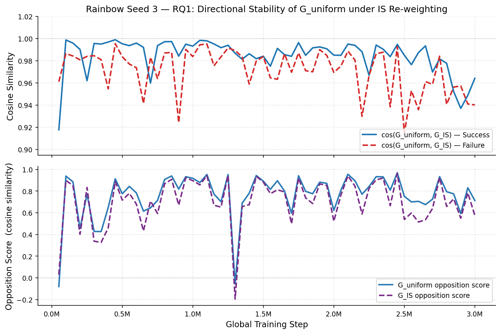
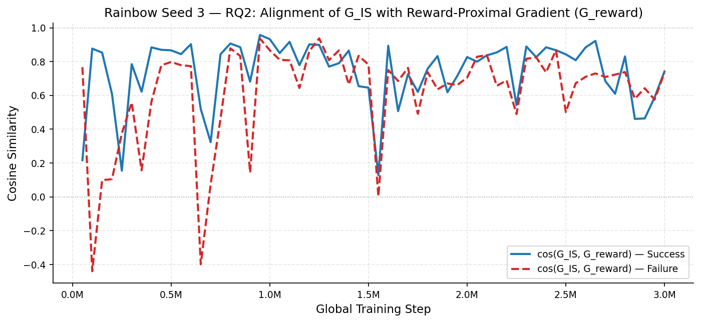
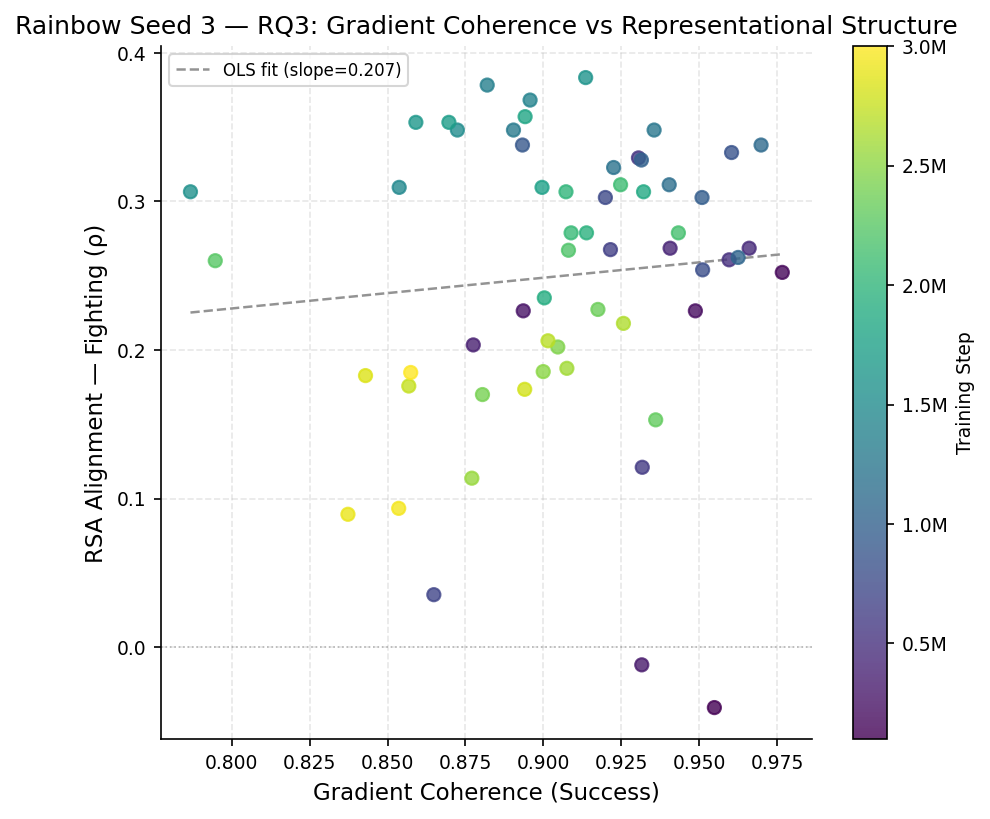
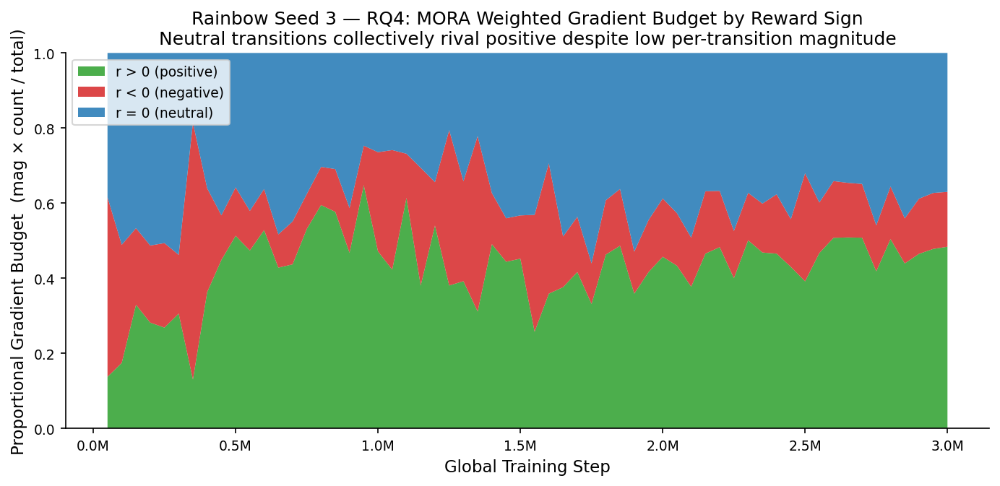
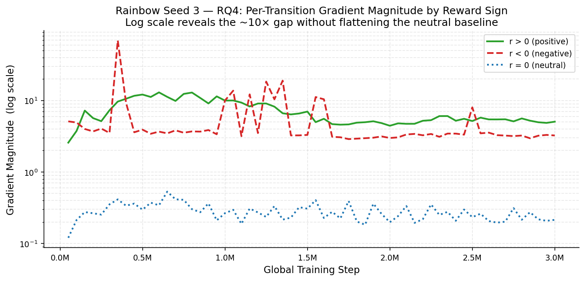
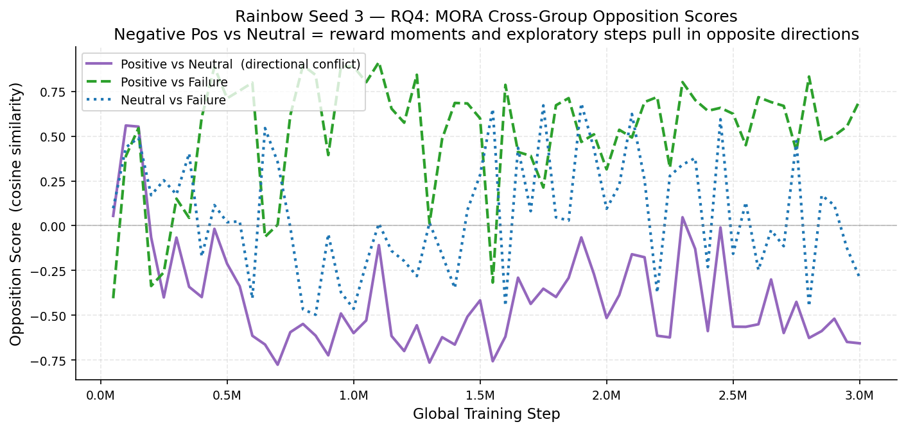

# Training & Analysis Report

**Environment:** `Crafter`  
**Seed:** 3  
**Total episodes:** 13,155  
**Experiment root:** `rainbow_experiment_root\seed_3`  
**Generated:** 2026-04-10 11:32

## Summary

| Checkpoint | Episodes | Opp. Score | Coh. (S) | Coh. (F) | Grad Mag (S) | Grad Mag (F) | Act. Sep. | Act. Cos. Dist. | RSA (ρ) |
|---|---:|---:|---:|---:|---:|---:|---:|---:|---:|
| collect_sapling @ ep144 | 144 | 0.9904 | 0.9599 | 0.9598 | 0.0904 | 0.0977 | 0.0127 | 0.0000 | — |
| collect_wood @ ep144 | 144 | 0.9935 | 0.9487 | 0.9574 | 0.0857 | 0.1011 | 0.0840 | 0.0001 | — |
| collect_drink @ ep146 | 146 | 0.9581 | 0.7890 | 0.8696 | 0.0449 | 0.0641 | 0.0776 | 0.0001 | — |
| defeat_zombie @ ep195 | 195 | -0.2550 | 0.9022 | 0.7992 | 0.0692 | 0.0704 | 0.1354 | 0.0002 | — |
| eat_cow @ ep218 | 218 | 0.1061 | 0.9550 | 0.7393 | 0.0794 | 0.0454 | 0.3001 | 0.0016 | — |
| Step 50,000 | 286 | -0.0808 | 0.8004 | 0.8591 | 0.0510 | 0.0590 | 0.2856 | 0.0011 | — |
| wake_up @ ep367 | 367 | 0.1905 | 0.8512 | 0.8355 | 0.0737 | 0.0607 | 0.1997 | 0.0005 | — |
| place_plant @ ep448 | 448 | 0.5787 | 0.9261 | 0.9091 | 0.1461 | 0.0845 | 0.2244 | 0.0009 | — |
| Step 100,000 | 570 | 0.9380 | 0.9549 | 0.9066 | 0.2741 | 0.1490 | 0.5485 | 0.0053 | — |
| defeat_skeleton @ ep625 | 625 | 0.9473 | 0.9546 | 0.9459 | 0.2699 | 0.1593 | 0.5400 | 0.0051 | — |
| Step 150,000 | 852 | 0.8851 | 0.9767 | 0.9614 | 0.4432 | 0.2683 | 0.3657 | 0.0023 | — |
| Step 200,000 | 1,124 | 0.4544 | 0.9488 | 0.9442 | 0.1806 | 0.1521 | 0.4874 | 0.0046 | — |
| place_table @ ep1237 | 1,237 | 0.7784 | 0.9545 | 0.9465 | 0.2841 | 0.2735 | 0.4517 | 0.0036 | — |
| Step 250,000 | 1,393 | 0.7717 | 0.8936 | 0.9482 | 0.1578 | 0.2018 | 0.8156 | 0.0144 | — |
| Step 300,000 | 1,662 | 0.4274 | 0.9316 | 0.9309 | 0.2776 | 0.2427 | 1.0233 | 0.0231 | — |
| Step 350,000 | 1,931 | 0.4264 | 0.8775 | 0.8840 | 0.3071 | 0.3068 | 1.0162 | 0.0223 | — |
| Step 400,000 | 2,187 | 0.6479 | 0.9407 | 0.8650 | 0.3485 | 0.1907 | 0.9094 | 0.0215 | — |
| Step 450,000 | 2,441 | 0.9128 | 0.9661 | 0.9020 | 0.5370 | 0.3867 | 0.6045 | 0.0092 | — |
| Step 500,000 | 2,700 | 0.7753 | 0.9596 | 0.9504 | 0.4853 | 0.4340 | 0.6071 | 0.0101 | — |
| make_wood_sword @ ep2713 | 2,713 | 0.7185 | 0.9238 | 0.9237 | 0.3346 | 0.3362 | 0.6120 | 0.0105 | — |
| Step 550,000 | 2,951 | 0.8433 | 0.9305 | 0.8837 | 0.3780 | 0.3002 | 0.6903 | 0.0151 | — |
| make_wood_pickaxe @ ep2996 | 2,996 | 0.5949 | 0.9314 | 0.8755 | 0.3282 | 0.2964 | 0.8725 | 0.0252 | — |
| Step 600,000 | 3,194 | 0.7824 | 0.9318 | 0.8701 | 0.3852 | 0.2628 | 0.7626 | 0.0191 | — |
| Step 650,000 | 3,446 | 0.6147 | 0.9215 | 0.7884 | 0.3557 | 0.2299 | 0.8425 | 0.0258 | — |
| Step 700,000 | 3,691 | 0.6450 | 0.8649 | 0.8876 | 0.2174 | 0.3046 | 0.5835 | 0.0143 | — |
| Step 750,000 | 3,939 | 0.7134 | 0.9199 | 0.8104 | 0.3634 | 0.2478 | 0.4686 | 0.0092 | — |
| Step 800,000 | 4,176 | 0.9065 | 0.9511 | 0.8612 | 0.4264 | 0.3687 | 0.4400 | 0.0091 | — |
| Step 850,000 | 4,417 | 0.9392 | 0.9604 | 0.9005 | 0.4262 | 0.3119 | 0.3907 | 0.0079 | — |
| Step 900,000 | 4,660 | 0.8180 | 0.8933 | 0.7639 | 0.2284 | 0.1585 | 0.4061 | 0.0089 | — |
| Step 950,000 | 4,889 | 0.9324 | 0.9509 | 0.8816 | 0.5040 | 0.5016 | 0.3894 | 0.0084 | — |
| Step 1,000,000 | 5,126 | 0.9174 | 0.9315 | 0.8023 | 0.3292 | 0.3257 | 0.3248 | 0.0058 | — |
| Step 1,050,000 | 5,352 | 0.8786 | 0.9625 | 0.7930 | 0.4216 | 0.3988 | 0.4061 | 0.0087 | — |
| Step 1,100,000 | 5,571 | 0.9527 | 0.9699 | 0.8741 | 0.4821 | 0.4648 | 0.3317 | 0.0057 | — |
| Step 1,150,000 | 5,784 | 0.7719 | 0.9404 | 0.7596 | 0.2910 | 0.2815 | 0.3839 | 0.0080 | — |
| Step 1,200,000 | 6,002 | 0.7016 | 0.9226 | 0.7664 | 0.2927 | 0.4197 | 0.4209 | 0.0090 | — |
| collect_stone @ ep6193 | 6,193 | 0.3194 | 0.8523 | 0.6693 | 0.1648 | 0.2614 | 0.3527 | 0.0067 | — |
| Step 1,250,000 | 6,233 | 0.9522 | 0.9356 | 0.8084 | 0.3706 | 0.4633 | 0.3435 | 0.0060 | — |
| Step 1,300,000 | 6,457 | -0.0572 | 0.8904 | 0.7942 | 0.2460 | 0.5117 | 0.4454 | 0.0098 | — |
| Step 1,350,000 | 6,674 | 0.6884 | 0.8820 | 0.8165 | 0.2335 | 0.3895 | 0.4621 | 0.0111 | — |
| Step 1,400,000 | 6,885 | 0.7799 | 0.8957 | 0.6855 | 0.2035 | 0.1644 | 0.5002 | 0.0141 | — |
| Step 1,450,000 | 7,097 | 0.9436 | 0.8537 | 0.7448 | 0.2708 | 0.3224 | 0.3646 | 0.0076 | — |
| place_stone @ ep7175 | 7,175 | 0.9589 | 0.9403 | 0.8125 | 0.3710 | 0.3198 | 0.4250 | 0.0098 | — |
| Step 1,500,000 | 7,311 | 0.8917 | 0.8724 | 0.8036 | 0.2711 | 0.3882 | 0.3487 | 0.0066 | — |
| Step 1,550,000 | 7,522 | 0.8160 | 0.7867 | 0.6687 | 0.2027 | 0.2536 | 0.4112 | 0.0091 | — |
| Step 1,600,000 | 7,727 | 0.8952 | 0.9136 | 0.7331 | 0.2179 | 0.1922 | 0.4130 | 0.0091 | — |
| Step 1,650,000 | 7,937 | 0.8008 | 0.8591 | 0.6882 | 0.2125 | 0.3614 | 0.4908 | 0.0131 | — |
| Step 1,700,000 | 8,157 | 0.5954 | 0.8697 | 0.6029 | 0.1846 | 0.2649 | 0.5057 | 0.0130 | — |
| Step 1,750,000 | 8,366 | 0.9412 | 0.8996 | 0.6928 | 0.4381 | 0.3912 | 0.4790 | 0.0117 | — |
| Step 1,800,000 | 8,575 | 0.7971 | 0.8941 | 0.7345 | 0.1913 | 0.2405 | 0.5532 | 0.0166 | — |
| Step 1,850,000 | 8,778 | 0.7752 | 0.9322 | 0.6435 | 0.2599 | 0.2585 | 0.5474 | 0.0168 | — |
| Step 1,900,000 | 8,974 | 0.8821 | 0.9003 | 0.7730 | 0.3581 | 0.5332 | 0.6687 | 0.0218 | — |
| Step 1,950,000 | 9,177 | 0.8710 | 0.9139 | 0.7403 | 0.2675 | 0.3223 | 0.5366 | 0.0150 | — |
| Step 2,000,000 | 9,371 | 0.6216 | 0.9073 | 0.6805 | 0.1985 | 0.2727 | 0.5939 | 0.0178 | — |
| collect_coal @ ep9553 | 9,553 | 0.9626 | 0.9636 | 0.8186 | 0.5354 | 0.5100 | 0.6241 | 0.0183 | — |
| Step 2,050,000 | 9,571 | 0.8069 | 0.9089 | 0.7837 | 0.2334 | 0.3482 | 0.7134 | 0.0251 | — |
| Step 2,100,000 | 9,779 | 0.9548 | 0.9248 | 0.7679 | 0.4564 | 0.4804 | 0.7008 | 0.0248 | — |
| Step 2,150,000 | 9,984 | 0.8948 | 0.9433 | 0.8178 | 0.3152 | 0.3352 | 0.7107 | 0.0219 | — |
| Step 2,200,000 | 10,184 | 0.7710 | 0.9081 | 0.6813 | 0.2427 | 0.1880 | 0.6710 | 0.0198 | — |
| Step 2,250,000 | 10,380 | 0.8419 | 0.7947 | 0.6775 | 0.2264 | 0.2949 | 0.6734 | 0.0199 | — |
| Step 2,300,000 | 10,576 | 0.9323 | 0.9361 | 0.8532 | 0.4104 | 0.3797 | 0.6751 | 0.0164 | — |
| make_stone_sword @ ep10703 | 10,703 | 0.8310 | 0.8087 | 0.6879 | 0.1855 | 0.1872 | 0.7071 | 0.0180 | — |
| Step 2,350,000 | 10,766 | 0.9310 | 0.9175 | 0.8369 | 0.4002 | 0.4961 | 0.7616 | 0.0199 | — |
| Step 2,400,000 | 10,962 | 0.8081 | 0.8805 | 0.6499 | 0.2143 | 0.2098 | 0.9017 | 0.0260 | — |
| Step 2,450,000 | 11,156 | 0.9688 | 0.9046 | 0.8182 | 0.4640 | 0.5490 | 0.9590 | 0.0328 | — |
| Step 2,500,000 | 11,351 | 0.7511 | 0.9000 | 0.6454 | 0.2526 | 0.1916 | 0.8942 | 0.0254 | — |
| Step 2,550,000 | 11,531 | 0.6999 | 0.8771 | 0.7314 | 0.2389 | 0.2642 | 1.1935 | 0.0416 | — |
| make_stone_pickaxe @ ep11568 | 11,568 | 0.9117 | 0.9421 | 0.8359 | 0.4455 | 0.3541 | 0.9929 | 0.0281 | — |
| Step 2,600,000 | 11,723 | 0.7052 | 0.9076 | 0.6592 | 0.2557 | 0.2029 | 1.1862 | 0.0432 | — |
| Step 2,650,000 | 11,915 | 0.6750 | 0.9257 | 0.6967 | 0.2933 | 0.2674 | 1.4159 | 0.0617 | — |
| Step 2,700,000 | 12,096 | 0.7253 | 0.9015 | 0.6664 | 0.2316 | 0.2407 | 1.4227 | 0.0594 | — |
| Step 2,750,000 | 12,276 | 0.9331 | 0.8568 | 0.7547 | 0.3664 | 0.4175 | 1.2044 | 0.0437 | — |
| Step 2,800,000 | 12,450 | 0.7939 | 0.8940 | 0.6842 | 0.2259 | 0.1936 | 1.3765 | 0.0546 | — |
| Step 2,850,000 | 12,641 | 0.7741 | 0.8429 | 0.6871 | 0.1976 | 0.2247 | 1.4931 | 0.0625 | — |
| Step 2,900,000 | 12,813 | 0.5921 | 0.8373 | 0.7064 | 0.1558 | 0.2395 | 1.6032 | 0.0694 | — |
| Step 2,950,000 | 12,988 | 0.8302 | 0.8536 | 0.6751 | 0.1863 | 0.1738 | 1.2911 | 0.0479 | — |
| Step 3,000,000 | 13,155 | 0.7125 | 0.8574 | 0.6089 | 0.1786 | 0.1859 | 1.5330 | 0.0618 | — |

---

## Longitudinal Analysis

### RQ1 — Directional Stability: cos(G_uniform, G_IS) and Opposition Score

*Top panel: cosine similarity between G_uniform and G_IS for success/failure groups (expected ~0.97–1.0 throughout). Bottom panel: opposition score under both weightings — G_IS tracks G_uniform closely, confirming IS re-weighting does not substantially redirect gradient direction.*

### RQ2 — PER Directional Influence: cos(G_IS, G_reward)

*Alignment between the IS-weighted gradient and the reward-proximal gradient proxy. High values indicate PER tends to up-weight reward-proximal transitions; variance across training reflects inconsistency of this alignment.*

### RQ3 — Coherence vs Representational Structure (Scatter)

*Each point is one periodic checkpoint. Colour encodes training stage (early=dark, late=bright). A positive slope would support the RQ3 prediction that high gradient coherence predicts better semantic structure. Weak/absent correlation is itself informative.*

### RQ4 — MORA: Weighted Gradient Budget by Reward Sign

*Proportional gradient contribution = gradient_magnitude × n_transitions, normalised to sum to 1. Resolves the scale problem: despite ~5–10× higher per-transition magnitude, positive transitions do not overwhelmingly dominate because neutral transitions vastly outnumber them.*

### RQ4 — MORA: Per-Transition Gradient Magnitude (Log Scale)

*Log y-axis makes the 5–10× gap between positive and neutral per-transition magnitudes readable without flattening the neutral baseline. Negative transitions sit in between.*

### RQ4 — MORA: Cross-Group Opposition Scores

*Three pairwise comparisons: Positive vs Neutral (directional conflict — persistently negative means reward moments and exploratory steps push the network in opposite directions); Positive vs Failure; Neutral vs Failure.*

---

## collect_sapling_ep144_lower0.000_upper0.000

### Metrics

| Metric | Value |
|---|---|
| Opposition Score | 0.9904 |
| Coherence (Success) | 0.9599 |
| Coherence (Failure) | 0.9598 |
| Gradient Magnitude (Success) | 0.0904 |
| Gradient Magnitude (Failure) | 0.0977 |
| Activation Separation | 0.0127 |
| Cosine Distance | 0.0000 |
| Clusters | 1,599 |
| Noise Fraction | 0.1807 |
| RSA Alignment (ρ) | — |
| RSA Stimuli (3) | Sapling, Wake Up, Wood |

### Gradient Variant Analysis (RQ1 / RQ2)

| Variant | Opp. Score | Coh. (S) | Coh. (F) | Grad Mag (S) | Grad Mag (F) |
|---|---:|---:|---:|---:|---:|
| G_uniform | 0.9904 | 0.9599 | 0.9598 | 0.0904 | 0.0977 |
| G_IS (β=0.401) | 0.9909 | 0.9649 | 0.9608 | 0.0871 | 0.0929 |

| Directional Alignment | Success | Failure |
|---|---:|---:|
| cos(G_uniform, G_IS) | 0.9993 | 0.9993 |
| cos(G_IS, G_reward)  | 0.9821 | 0.9786 |

### Moment of Reward (Rainbow)

| Subgroup | N transitions | Grad Mag | Coherence |
|---|---:|---:|---:|
| Positive (r > 0) | 214 | 43.2663 | 0.8753 |
| Neutral  (r = 0) | 41,732 | 0.0934 | 0.9875 |
| Negative (r < 0) | 1,301 | 3.7223 | 0.9940 |

| Comparison | Opp. Score |
|---|---:|
| Pos vs Neutral   | -0.7348 |
| Pos vs Negative  | -0.7632 |
| Neutral vs Neg.  | 0.4304 |
| Pos vs Failure   | -0.8468 |
| Neutral vs Fail. | 0.7699 |
| Neg. vs Failure  | 0.8490 |

---

## collect_wood_ep144_lower0.000_upper0.000

### Metrics

| Metric | Value |
|---|---|
| Opposition Score | 0.9935 |
| Coherence (Success) | 0.9487 |
| Coherence (Failure) | 0.9574 |
| Gradient Magnitude (Success) | 0.0857 |
| Gradient Magnitude (Failure) | 0.1011 |
| Activation Separation | 0.0840 |
| Cosine Distance | 0.0001 |
| Clusters | 1,630 |
| Noise Fraction | 0.1823 |
| RSA Alignment (ρ) | — |
| RSA Stimuli (2) | Drink, Wake Up |

### Gradient Variant Analysis (RQ1 / RQ2)

| Variant | Opp. Score | Coh. (S) | Coh. (F) | Grad Mag (S) | Grad Mag (F) |
|---|---:|---:|---:|---:|---:|
| G_uniform | 0.9935 | 0.9487 | 0.9574 | 0.0857 | 0.1011 |
| G_IS (β=0.401) | 0.9934 | 0.9543 | 0.9591 | 0.0834 | 0.0962 |

| Directional Alignment | Success | Failure |
|---|---:|---:|
| cos(G_uniform, G_IS) | 0.9992 | 0.9995 |
| cos(G_IS, G_reward)  | 0.9827 | 0.9801 |

### Moment of Reward (Rainbow)

| Subgroup | N transitions | Grad Mag | Coherence |
|---|---:|---:|---:|
| Positive (r > 0) | 233 | 39.7572 | 0.9842 |
| Neutral  (r = 0) | 42,102 | 0.0894 | 0.9897 |
| Negative (r < 0) | 1,301 | 3.7442 | 0.9937 |

| Comparison | Opp. Score |
|---|---:|
| Pos vs Neutral   | -0.7149 |
| Pos vs Negative  | -0.7466 |
| Neutral vs Neg.  | 0.3950 |
| Pos vs Failure   | -0.8491 |
| Neutral vs Fail. | 0.7467 |
| Neg. vs Failure  | 0.8569 |

---

## collect_drink_ep146_lower0.000_upper0.000

### Metrics

| Metric | Value |
|---|---|
| Opposition Score | 0.9581 |
| Coherence (Success) | 0.7890 |
| Coherence (Failure) | 0.8696 |
| Gradient Magnitude (Success) | 0.0449 |
| Gradient Magnitude (Failure) | 0.0641 |
| Activation Separation | 0.0776 |
| Cosine Distance | 0.0001 |
| Clusters | 1,614 |
| Noise Fraction | 0.1832 |
| RSA Alignment (ρ) | — |
| RSA Stimuli (3) | Drink, Sapling, Wake Up |

### Gradient Variant Analysis (RQ1 / RQ2)

| Variant | Opp. Score | Coh. (S) | Coh. (F) | Grad Mag (S) | Grad Mag (F) |
|---|---:|---:|---:|---:|---:|
| G_uniform | 0.9581 | 0.7890 | 0.8696 | 0.0449 | 0.0641 |
| G_IS (β=0.401) | 0.9707 | 0.8548 | 0.9017 | 0.0464 | 0.0634 |

| Directional Alignment | Success | Failure |
|---|---:|---:|
| cos(G_uniform, G_IS) | 0.9903 | 0.9969 |
| cos(G_IS, G_reward)  | 0.9048 | 0.9636 |

### Moment of Reward (Rainbow)

| Subgroup | N transitions | Grad Mag | Coherence |
|---|---:|---:|---:|
| Positive (r > 0) | 231 | 47.1411 | 0.8637 |
| Neutral  (r = 0) | 42,344 | 0.0419 | 0.8124 |
| Negative (r < 0) | 1,311 | 3.5631 | 0.9808 |

| Comparison | Opp. Score |
|---|---:|
| Pos vs Neutral   | -0.4973 |
| Pos vs Negative  | -0.7328 |
| Neutral vs Neg.  | 0.0007 |
| Pos vs Failure   | -0.7055 |
| Neutral vs Fail. | 0.1150 |
| Neg. vs Failure  | 0.9079 |

---

## defeat_zombie_ep195_lower0.000_upper1.900

### Metrics

| Metric | Value |
|---|---|
| Opposition Score | -0.2550 |
| Coherence (Success) | 0.9022 |
| Coherence (Failure) | 0.7992 |
| Gradient Magnitude (Success) | 0.0692 |
| Gradient Magnitude (Failure) | 0.0704 |
| Activation Separation | 0.1354 |
| Cosine Distance | 0.0002 |
| Clusters | 1,559 |
| Noise Fraction | 0.1657 |
| RSA Alignment (ρ) | — |
| RSA Stimuli (4) | Eat Cow, Sapling, Wake Up, Zombie |

### Gradient Variant Analysis (RQ1 / RQ2)

| Variant | Opp. Score | Coh. (S) | Coh. (F) | Grad Mag (S) | Grad Mag (F) |
|---|---:|---:|---:|---:|---:|
| G_uniform | -0.2550 | 0.9022 | 0.7992 | 0.0692 | 0.0704 |
| G_IS (β=0.403) | -0.1193 | 0.8827 | 0.8183 | 0.0611 | 0.0716 |

| Directional Alignment | Success | Failure |
|---|---:|---:|
| cos(G_uniform, G_IS) | 0.9848 | 0.9989 |
| cos(G_IS, G_reward)  | 0.4993 | 0.9487 |

### Moment of Reward (Rainbow)

| Subgroup | N transitions | Grad Mag | Coherence |
|---|---:|---:|---:|
| Positive (r > 0) | 492 | 25.6705 | 0.9885 |
| Neutral  (r = 0) | 43,966 | 0.0721 | 0.9905 |
| Negative (r < 0) | 1,207 | 4.5155 | 0.9945 |

| Comparison | Opp. Score |
|---|---:|
| Pos vs Neutral   | -0.4058 |
| Pos vs Negative  | -0.8606 |
| Neutral vs Neg.  | 0.1041 |
| Pos vs Failure   | -0.9084 |
| Neutral vs Fail. | 0.1450 |
| Neg. vs Failure  | 0.8997 |

---

## eat_cow_ep218_lower1.900_upper2.900

### Metrics

| Metric | Value |
|---|---|
| Opposition Score | 0.1061 |
| Coherence (Success) | 0.9550 |
| Coherence (Failure) | 0.7393 |
| Gradient Magnitude (Success) | 0.0794 |
| Gradient Magnitude (Failure) | 0.0454 |
| Activation Separation | 0.3001 |
| Cosine Distance | 0.0016 |
| Clusters | 1,594 |
| Noise Fraction | 0.1554 |
| RSA Alignment (ρ) | — |
| RSA Stimuli (6) | Eat Cow, Eat Plant, Place Plant, Sapling, Wake Up, Zombie |

### Gradient Variant Analysis (RQ1 / RQ2)

| Variant | Opp. Score | Coh. (S) | Coh. (F) | Grad Mag (S) | Grad Mag (F) |
|---|---:|---:|---:|---:|---:|
| G_uniform | 0.1061 | 0.9550 | 0.7393 | 0.0794 | 0.0454 |
| G_IS (β=0.404) | -0.0360 | 0.8785 | 0.8464 | 0.0551 | 0.0484 |

| Directional Alignment | Success | Failure |
|---|---:|---:|
| cos(G_uniform, G_IS) | 0.9827 | 0.9504 |
| cos(G_IS, G_reward)  | 0.5429 | 0.6934 |

### Moment of Reward (Rainbow)

| Subgroup | N transitions | Grad Mag | Coherence |
|---|---:|---:|---:|
| Positive (r > 0) | 759 | 2.1755 | 0.9365 |
| Neutral  (r = 0) | 45,008 | 0.0699 | 0.9686 |
| Negative (r < 0) | 1,336 | 4.4076 | 0.9986 |

| Comparison | Opp. Score |
|---|---:|
| Pos vs Neutral   | -0.1870 |
| Pos vs Negative  | 0.1497 |
| Neutral vs Neg.  | -0.7999 |
| Pos vs Failure   | -0.1886 |
| Neutral vs Fail. | -0.2462 |
| Neg. vs Failure  | 0.5720 |

---

## ep286_lower1.900_upper2.900

### Metrics

| Metric | Value |
|---|---|
| Opposition Score | -0.0808 |
| Coherence (Success) | 0.8004 |
| Coherence (Failure) | 0.8591 |
| Gradient Magnitude (Success) | 0.0510 |
| Gradient Magnitude (Failure) | 0.0590 |
| Activation Separation | 0.2856 |
| Cosine Distance | 0.0011 |
| Clusters | 1,646 |
| Noise Fraction | 0.1547 |
| RSA Alignment (ρ) | — |
| RSA Stimuli (5) | Eat Cow, Place Plant, Sapling, Wake Up, Zombie |

### Gradient Variant Analysis (RQ1 / RQ2)

| Variant | Opp. Score | Coh. (S) | Coh. (F) | Grad Mag (S) | Grad Mag (F) |
|---|---:|---:|---:|---:|---:|
| G_uniform | -0.0808 | 0.8004 | 0.8591 | 0.0510 | 0.0590 |
| G_IS (β=0.406) | 0.0286 | 0.6884 | 0.9144 | 0.0249 | 0.0607 |

| Directional Alignment | Success | Failure |
|---|---:|---:|
| cos(G_uniform, G_IS) | 0.9178 | 0.9610 |
| cos(G_IS, G_reward)  | 0.2167 | 0.7669 |

### Moment of Reward (Rainbow)

| Subgroup | N transitions | Grad Mag | Coherence |
|---|---:|---:|---:|
| Positive (r > 0) | 763 | 2.5749 | 0.8258 |
| Neutral  (r = 0) | 45,819 | 0.1202 | 0.9855 |
| Negative (r < 0) | 1,341 | 5.1088 | 0.9978 |

| Comparison | Opp. Score |
|---|---:|
| Pos vs Neutral   | 0.0552 |
| Pos vs Negative  | -0.1695 |
| Neutral vs Neg.  | -0.0272 |
| Pos vs Failure   | -0.4050 |
| Neutral vs Fail. | 0.0975 |
| Neg. vs Failure  | 0.5527 |

---

## wake_up_ep367_lower1.900_upper2.900

### Metrics

| Metric | Value |
|---|---|
| Opposition Score | 0.1905 |
| Coherence (Success) | 0.8512 |
| Coherence (Failure) | 0.8355 |
| Gradient Magnitude (Success) | 0.0737 |
| Gradient Magnitude (Failure) | 0.0607 |
| Activation Separation | 0.1997 |
| Cosine Distance | 0.0005 |
| Clusters | 1,700 |
| Noise Fraction | 0.1622 |
| RSA Alignment (ρ) | — |
| RSA Stimuli (8) | Drink, Eat Cow, Place Plant, Sapling, Skeleton, Wake Up, Wood, Zombie |

### Gradient Variant Analysis (RQ1 / RQ2)

| Variant | Opp. Score | Coh. (S) | Coh. (F) | Grad Mag (S) | Grad Mag (F) |
|---|---:|---:|---:|---:|---:|
| G_uniform | 0.1905 | 0.8512 | 0.8355 | 0.0737 | 0.0607 |
| G_IS (β=0.409) | 0.2481 | 0.7852 | 0.8756 | 0.0478 | 0.0547 |

| Directional Alignment | Success | Failure |
|---|---:|---:|
| cos(G_uniform, G_IS) | 0.9667 | 0.9788 |
| cos(G_IS, G_reward)  | 0.5910 | 0.7298 |

| Weight-Delta Alignment | Success | Failure |
|---|---:|---:|
| cos(G_uniform, Δθ) | 0.0152 | -0.0345 |
| cos(G_IS, Δθ)      | 0.0089 | -0.0378 |
| cos(G_reward, Δθ)  | -0.0011 | -0.0378 |

### Moment of Reward (Rainbow)

| Subgroup | N transitions | Grad Mag | Coherence |
|---|---:|---:|---:|
| Positive (r > 0) | 832 | 2.9029 | 0.8180 |
| Neutral  (r = 0) | 46,263 | 0.1211 | 0.9836 |
| Negative (r < 0) | 1,366 | 4.5256 | 0.9985 |

| Comparison | Opp. Score |
|---|---:|
| Pos vs Neutral   | 0.1050 |
| Pos vs Negative  | -0.3497 |
| Neutral vs Neg.  | -0.1325 |
| Pos vs Failure   | -0.4028 |
| Neutral vs Fail. | -0.2088 |
| Neg. vs Failure  | 0.6247 |

---

## place_plant_ep448_lower1.900_upper2.900

### Metrics

| Metric | Value |
|---|---|
| Opposition Score | 0.5787 |
| Coherence (Success) | 0.9261 |
| Coherence (Failure) | 0.9091 |
| Gradient Magnitude (Success) | 0.1461 |
| Gradient Magnitude (Failure) | 0.0845 |
| Activation Separation | 0.2244 |
| Cosine Distance | 0.0009 |
| Clusters | 1,717 |
| Noise Fraction | 0.1433 |
| RSA Alignment (ρ) | — |
| RSA Stimuli (8) | Drink, Eat Cow, Place Plant, Sapling, Skeleton, Wake Up, Wood, Zombie |

### Gradient Variant Analysis (RQ1 / RQ2)

| Variant | Opp. Score | Coh. (S) | Coh. (F) | Grad Mag (S) | Grad Mag (F) |
|---|---:|---:|---:|---:|---:|
| G_uniform | 0.5787 | 0.9261 | 0.9091 | 0.1461 | 0.0845 |
| G_IS (β=0.412) | 0.5407 | 0.9133 | 0.9105 | 0.0978 | 0.0686 |

| Directional Alignment | Success | Failure |
|---|---:|---:|
| cos(G_uniform, G_IS) | 0.9889 | 0.9778 |
| cos(G_IS, G_reward)  | 0.7400 | 0.4385 |

| Weight-Delta Alignment | Success | Failure |
|---|---:|---:|
| cos(G_uniform, Δθ) | 0.0378 | 0.0221 |
| cos(G_IS, Δθ)      | 0.0360 | 0.0132 |
| cos(G_reward, Δθ)  | -0.0015 | -0.0406 |

### Moment of Reward (Rainbow)

| Subgroup | N transitions | Grad Mag | Coherence |
|---|---:|---:|---:|
| Positive (r > 0) | 871 | 2.7436 | 0.9301 |
| Neutral  (r = 0) | 44,083 | 0.0983 | 0.9274 |
| Negative (r < 0) | 1,365 | 4.3438 | 0.9919 |

| Comparison | Opp. Score |
|---|---:|
| Pos vs Neutral   | 0.1076 |
| Pos vs Negative  | -0.3980 |
| Neutral vs Neg.  | -0.4010 |
| Pos vs Failure   | -0.3995 |
| Neutral vs Fail. | -0.4616 |
| Neg. vs Failure  | 0.3257 |

---

## ep570_lower1.900_upper2.900

### Metrics

| Metric | Value |
|---|---|
| Opposition Score | 0.9380 |
| Coherence (Success) | 0.9549 |
| Coherence (Failure) | 0.9066 |
| Gradient Magnitude (Success) | 0.2741 |
| Gradient Magnitude (Failure) | 0.1490 |
| Activation Separation | 0.5485 |
| Cosine Distance | 0.0053 |
| Clusters | 2,078 |
| Noise Fraction | 0.1340 |
| RSA Alignment (ρ) | — |
| RSA Stimuli (9) | Drink, Eat Cow, Place Plant, Sapling, Skeleton, Table, Wake Up, Wood, Zombie |

### Gradient Variant Analysis (RQ1 / RQ2)

| Variant | Opp. Score | Coh. (S) | Coh. (F) | Grad Mag (S) | Grad Mag (F) |
|---|---:|---:|---:|---:|---:|
| G_uniform | 0.9380 | 0.9549 | 0.9066 | 0.2741 | 0.1490 |
| G_IS (β=0.416) | 0.8969 | 0.9448 | 0.8937 | 0.1800 | 0.0934 |

| Directional Alignment | Success | Failure |
|---|---:|---:|
| cos(G_uniform, G_IS) | 0.9987 | 0.9864 |
| cos(G_IS, G_reward)  | 0.8768 | -0.4400 |

| Weight-Delta Alignment | Success | Failure |
|---|---:|---:|
| cos(G_uniform, Δθ) | 0.0296 | 0.0299 |
| cos(G_IS, Δθ)      | 0.0293 | 0.0252 |
| cos(G_reward, Δθ)  | 0.0012 | -0.0487 |

### Moment of Reward (Rainbow)

| Subgroup | N transitions | Grad Mag | Coherence |
|---|---:|---:|---:|
| Positive (r > 0) | 913 | 3.7483 | 0.9389 |
| Neutral  (r = 0) | 47,170 | 0.2128 | 0.9845 |
| Negative (r < 0) | 1,254 | 4.9262 | 0.9794 |

| Comparison | Opp. Score |
|---|---:|
| Pos vs Neutral   | 0.5597 |
| Pos vs Negative  | -0.6288 |
| Neutral vs Neg.  | -0.9196 |
| Pos vs Failure   | 0.3888 |
| Neutral vs Fail. | 0.4375 |
| Neg. vs Failure  | -0.6080 |

---

## defeat_skeleton_ep625_lower1.900_upper2.900

### Metrics

| Metric | Value |
|---|---|
| Opposition Score | 0.9473 |
| Coherence (Success) | 0.9546 |
| Coherence (Failure) | 0.9459 |
| Gradient Magnitude (Success) | 0.2699 |
| Gradient Magnitude (Failure) | 0.1593 |
| Activation Separation | 0.5400 |
| Cosine Distance | 0.0051 |
| Clusters | 2,145 |
| Noise Fraction | 0.1513 |
| RSA Alignment (ρ) | — |
| RSA Stimuli (9) | Drink, Eat Cow, Place Plant, Sapling, Skeleton, Table, Wake Up, Wood, Zombie |

### Gradient Variant Analysis (RQ1 / RQ2)

| Variant | Opp. Score | Coh. (S) | Coh. (F) | Grad Mag (S) | Grad Mag (F) |
|---|---:|---:|---:|---:|---:|
| G_uniform | 0.9473 | 0.9546 | 0.9459 | 0.2699 | 0.1593 |
| G_IS (β=0.418) | 0.9185 | 0.9456 | 0.9371 | 0.1778 | 0.1031 |

| Directional Alignment | Success | Failure |
|---|---:|---:|
| cos(G_uniform, G_IS) | 0.9986 | 0.9894 |
| cos(G_IS, G_reward)  | 0.8492 | -0.4603 |

### Moment of Reward (Rainbow)

| Subgroup | N transitions | Grad Mag | Coherence |
|---|---:|---:|---:|
| Positive (r > 0) | 911 | 3.8984 | 0.9562 |
| Neutral  (r = 0) | 46,046 | 0.2322 | 0.9914 |
| Negative (r < 0) | 1,212 | 5.1357 | 0.9801 |

| Comparison | Opp. Score |
|---|---:|
| Pos vs Neutral   | 0.5352 |
| Pos vs Negative  | -0.6371 |
| Neutral vs Neg.  | -0.8780 |
| Pos vs Failure   | 0.3561 |
| Neutral vs Fail. | 0.4286 |
| Neg. vs Failure  | -0.6220 |

---

## ep852_lower2.000_upper3.000

### Metrics

| Metric | Value |
|---|---|
| Opposition Score | 0.8851 |
| Coherence (Success) | 0.9767 |
| Coherence (Failure) | 0.9614 |
| Gradient Magnitude (Success) | 0.4432 |
| Gradient Magnitude (Failure) | 0.2683 |
| Activation Separation | 0.3657 |
| Cosine Distance | 0.0023 |
| Clusters | 1,805 |
| Noise Fraction | 0.1544 |
| RSA Alignment (ρ) | — |
| RSA Stimuli (9) | Drink, Eat Cow, Eat Plant, Place Plant, Sapling, Skeleton, Wake Up, Wood, Zombie |

### Gradient Variant Analysis (RQ1 / RQ2)

| Variant | Opp. Score | Coh. (S) | Coh. (F) | Grad Mag (S) | Grad Mag (F) |
|---|---:|---:|---:|---:|---:|
| G_uniform | 0.8851 | 0.9767 | 0.9614 | 0.4432 | 0.2683 |
| G_IS (β=0.426) | 0.8521 | 0.9748 | 0.9584 | 0.2970 | 0.1852 |

| Directional Alignment | Success | Failure |
|---|---:|---:|
| cos(G_uniform, G_IS) | 0.9959 | 0.9842 |
| cos(G_IS, G_reward)  | 0.8532 | 0.0985 |

| Weight-Delta Alignment | Success | Failure |
|---|---:|---:|
| cos(G_uniform, Δθ) | 0.0263 | 0.0378 |
| cos(G_IS, Δθ)      | 0.0261 | 0.0354 |
| cos(G_reward, Δθ)  | 0.0031 | -0.0116 |

### Moment of Reward (Rainbow)

| Subgroup | N transitions | Grad Mag | Coherence |
|---|---:|---:|---:|
| Positive (r > 0) | 1,208 | 7.2278 | 0.9917 |
| Neutral  (r = 0) | 44,993 | 0.2753 | 0.9923 |
| Negative (r < 0) | 1,352 | 4.0020 | 0.9906 |

| Comparison | Opp. Score |
|---|---:|
| Pos vs Neutral   | 0.5535 |
| Pos vs Negative  | -0.5384 |
| Neutral vs Neg.  | -0.7881 |
| Pos vs Failure   | 0.5450 |
| Neutral vs Fail. | 0.4905 |
| Neg. vs Failure  | -0.0074 |

---

## ep1124_lower2.000_upper3.900

### Metrics

| Metric | Value |
|---|---|
| Opposition Score | 0.4544 |
| Coherence (Success) | 0.9488 |
| Coherence (Failure) | 0.9442 |
| Gradient Magnitude (Success) | 0.1806 |
| Gradient Magnitude (Failure) | 0.1521 |
| Activation Separation | 0.4874 |
| Cosine Distance | 0.0046 |
| Clusters | 1,978 |
| Noise Fraction | 0.1525 |
| RSA Alignment (ρ) | — |
| RSA Stimuli (8) | Drink, Eat Cow, Place Plant, Sapling, Skeleton, Wake Up, Wood, Zombie |

### Gradient Variant Analysis (RQ1 / RQ2)

| Variant | Opp. Score | Coh. (S) | Coh. (F) | Grad Mag (S) | Grad Mag (F) |
|---|---:|---:|---:|---:|---:|
| G_uniform | 0.4544 | 0.9488 | 0.9442 | 0.1806 | 0.1521 |
| G_IS (β=0.436) | 0.4016 | 0.9367 | 0.9452 | 0.1133 | 0.1140 |

| Directional Alignment | Success | Failure |
|---|---:|---:|
| cos(G_uniform, G_IS) | 0.9902 | 0.9808 |
| cos(G_IS, G_reward)  | 0.6085 | 0.1048 |

| Weight-Delta Alignment | Success | Failure |
|---|---:|---:|
| cos(G_uniform, Δθ) | -0.0331 | -0.0318 |
| cos(G_IS, Δθ)      | -0.0365 | -0.0294 |
| cos(G_reward, Δθ)  | -0.0098 | 0.0006 |

### Moment of Reward (Rainbow)

| Subgroup | N transitions | Grad Mag | Coherence |
|---|---:|---:|---:|
| Positive (r > 0) | 1,217 | 5.6769 | 0.9839 |
| Neutral  (r = 0) | 47,565 | 0.2646 | 0.9906 |
| Negative (r < 0) | 1,364 | 3.6943 | 0.9895 |

| Comparison | Opp. Score |
|---|---:|
| Pos vs Neutral   | -0.0653 |
| Pos vs Negative  | -0.5397 |
| Neutral vs Neg.  | -0.6352 |
| Pos vs Failure   | -0.3365 |
| Neutral vs Fail. | 0.1707 |
| Neg. vs Failure  | 0.3727 |

---

## place_table_ep1237_lower2.000_upper3.900

### Metrics

| Metric | Value |
|---|---|
| Opposition Score | 0.7784 |
| Coherence (Success) | 0.9545 |
| Coherence (Failure) | 0.9465 |
| Gradient Magnitude (Success) | 0.2841 |
| Gradient Magnitude (Failure) | 0.2735 |
| Activation Separation | 0.4517 |
| Cosine Distance | 0.0036 |
| Clusters | 2,274 |
| Noise Fraction | 0.1406 |
| RSA Alignment (ρ) | — |
| RSA Stimuli (9) | Drink, Eat Cow, Place Plant, Sapling, Skeleton, Table, Wake Up, Wood, Zombie |

### Gradient Variant Analysis (RQ1 / RQ2)

| Variant | Opp. Score | Coh. (S) | Coh. (F) | Grad Mag (S) | Grad Mag (F) |
|---|---:|---:|---:|---:|---:|
| G_uniform | 0.7784 | 0.9545 | 0.9465 | 0.2841 | 0.2735 |
| G_IS (β=0.440) | 0.7875 | 0.9520 | 0.9481 | 0.1992 | 0.2119 |

| Directional Alignment | Success | Failure |
|---|---:|---:|
| cos(G_uniform, G_IS) | 0.9896 | 0.9908 |
| cos(G_IS, G_reward)  | 0.5698 | 0.6209 |

| Weight-Delta Alignment | Success | Failure |
|---|---:|---:|
| cos(G_uniform, Δθ) | 0.0188 | 0.0249 |
| cos(G_IS, Δθ)      | 0.0195 | 0.0238 |
| cos(G_reward, Δθ)  | -0.0121 | 0.0006 |

### Moment of Reward (Rainbow)

| Subgroup | N transitions | Grad Mag | Coherence |
|---|---:|---:|---:|
| Positive (r > 0) | 1,118 | 4.1757 | 0.9590 |
| Neutral  (r = 0) | 46,741 | 0.1730 | 0.9660 |
| Negative (r < 0) | 1,350 | 4.2076 | 0.9756 |

| Comparison | Opp. Score |
|---|---:|
| Pos vs Neutral   | 0.2098 |
| Pos vs Negative  | -0.4595 |
| Neutral vs Neg.  | -0.4236 |
| Pos vs Failure   | -0.1511 |
| Neutral vs Fail. | -0.0754 |
| Neg. vs Failure  | 0.7973 |

---

## ep1393_lower2.000_upper3.900

### Metrics

| Metric | Value |
|---|---|
| Opposition Score | 0.7717 |
| Coherence (Success) | 0.8936 |
| Coherence (Failure) | 0.9482 |
| Gradient Magnitude (Success) | 0.1578 |
| Gradient Magnitude (Failure) | 0.2018 |
| Activation Separation | 0.8156 |
| Cosine Distance | 0.0144 |
| Clusters | 2,286 |
| Noise Fraction | 0.1514 |
| RSA Alignment (ρ) | — |
| RSA Stimuli (8) | Drink, Eat Cow, Place Plant, Sapling, Skeleton, Wake Up, Wood, Zombie |

### Gradient Variant Analysis (RQ1 / RQ2)

| Variant | Opp. Score | Coh. (S) | Coh. (F) | Grad Mag (S) | Grad Mag (F) |
|---|---:|---:|---:|---:|---:|
| G_uniform | 0.7717 | 0.8936 | 0.9482 | 0.1578 | 0.2018 |
| G_IS (β=0.446) | 0.8327 | 0.8958 | 0.9539 | 0.1156 | 0.1599 |

| Directional Alignment | Success | Failure |
|---|---:|---:|
| cos(G_uniform, G_IS) | 0.9620 | 0.9839 |
| cos(G_IS, G_reward)  | 0.1546 | 0.3756 |

| Weight-Delta Alignment | Success | Failure |
|---|---:|---:|
| cos(G_uniform, Δθ) | 0.0168 | 0.0216 |
| cos(G_IS, Δθ)      | 0.0185 | 0.0204 |
| cos(G_reward, Δθ)  | -0.0168 | 0.0017 |

### Moment of Reward (Rainbow)

| Subgroup | N transitions | Grad Mag | Coherence |
|---|---:|---:|---:|
| Positive (r > 0) | 1,266 | 5.1416 | 0.9794 |
| Neutral  (r = 0) | 48,476 | 0.2535 | 0.9694 |
| Negative (r < 0) | 1,348 | 4.0520 | 0.9867 |

| Comparison | Opp. Score |
|---|---:|
| Pos vs Neutral   | -0.4003 |
| Pos vs Negative  | -0.4379 |
| Neutral vs Neg.  | -0.1381 |
| Pos vs Failure   | -0.2601 |
| Neutral vs Fail. | 0.2538 |
| Neg. vs Failure  | 0.7072 |

---

## ep1662_lower2.000_upper3.900

### Metrics

| Metric | Value |
|---|---|
| Opposition Score | 0.4274 |
| Coherence (Success) | 0.9316 |
| Coherence (Failure) | 0.9309 |
| Gradient Magnitude (Success) | 0.2776 |
| Gradient Magnitude (Failure) | 0.2427 |
| Activation Separation | 1.0233 |
| Cosine Distance | 0.0231 |
| Clusters | 2,097 |
| Noise Fraction | 0.1510 |
| RSA Alignment (ρ) | — |
| RSA Stimuli (8) | Drink, Eat Cow, Place Plant, Sapling, Skeleton, Wake Up, Wood, Zombie |

### Gradient Variant Analysis (RQ1 / RQ2)

| Variant | Opp. Score | Coh. (S) | Coh. (F) | Grad Mag (S) | Grad Mag (F) |
|---|---:|---:|---:|---:|---:|
| G_uniform | 0.4274 | 0.9316 | 0.9309 | 0.2776 | 0.2427 |
| G_IS (β=0.456) | 0.3376 | 0.9176 | 0.9322 | 0.1821 | 0.1753 |

| Directional Alignment | Success | Failure |
|---|---:|---:|
| cos(G_uniform, G_IS) | 0.9955 | 0.9845 |
| cos(G_IS, G_reward)  | 0.7849 | 0.5581 |

| Weight-Delta Alignment | Success | Failure |
|---|---:|---:|
| cos(G_uniform, Δθ) | 0.0089 | 0.0056 |
| cos(G_IS, Δθ)      | 0.0071 | 0.0027 |
| cos(G_reward, Δθ)  | 0.0012 | -0.0011 |

### Moment of Reward (Rainbow)

| Subgroup | N transitions | Grad Mag | Coherence |
|---|---:|---:|---:|
| Positive (r > 0) | 1,299 | 7.3047 | 0.9751 |
| Neutral  (r = 0) | 47,334 | 0.3528 | 0.9851 |
| Negative (r < 0) | 1,380 | 3.5202 | 0.9818 |

| Comparison | Opp. Score |
|---|---:|
| Pos vs Neutral   | -0.0662 |
| Pos vs Negative  | -0.2328 |
| Neutral vs Neg.  | -0.7769 |
| Pos vs Failure   | 0.1513 |
| Neutral vs Fail. | 0.1744 |
| Neg. vs Failure  | 0.1748 |

---

## ep1931_lower3.000_upper4.900

### Metrics

| Metric | Value |
|---|---|
| Opposition Score | 0.4264 |
| Coherence (Success) | 0.8775 |
| Coherence (Failure) | 0.8840 |
| Gradient Magnitude (Success) | 0.3071 |
| Gradient Magnitude (Failure) | 0.3068 |
| Activation Separation | 1.0162 |
| Cosine Distance | 0.0223 |
| Clusters | 2,230 |
| Noise Fraction | 0.1689 |
| RSA Alignment (ρ) | — |
| RSA Stimuli (9) | Drink, Eat Cow, Place Plant, Sapling, Skeleton, Table, Wake Up, Wood, Zombie |

### Gradient Variant Analysis (RQ1 / RQ2)

| Variant | Opp. Score | Coh. (S) | Coh. (F) | Grad Mag (S) | Grad Mag (F) |
|---|---:|---:|---:|---:|---:|
| G_uniform | 0.4264 | 0.8775 | 0.8840 | 0.3071 | 0.3068 |
| G_IS (β=0.466) | 0.3265 | 0.8575 | 0.8762 | 0.1834 | 0.2165 |

| Directional Alignment | Success | Failure |
|---|---:|---:|
| cos(G_uniform, G_IS) | 0.9950 | 0.9809 |
| cos(G_IS, G_reward)  | 0.6218 | 0.1570 |

| Weight-Delta Alignment | Success | Failure |
|---|---:|---:|
| cos(G_uniform, Δθ) | 0.0174 | 0.0238 |
| cos(G_IS, Δθ)      | 0.0177 | 0.0219 |
| cos(G_reward, Δθ)  | 0.0009 | 0.0026 |

### Moment of Reward (Rainbow)

| Subgroup | N transitions | Grad Mag | Coherence |
|---|---:|---:|---:|
| Positive (r > 0) | 1,414 | 9.6705 | 0.9859 |
| Neutral  (r = 0) | 47,299 | 0.4138 | 0.9775 |
| Negative (r < 0) | 1,041 | 69.1815 | 0.3553 |

| Comparison | Opp. Score |
|---|---:|
| Pos vs Neutral   | -0.3411 |
| Pos vs Negative  | 0.3751 |
| Neutral vs Neg.  | 0.3026 |
| Pos vs Failure   | 0.0442 |
| Neutral vs Fail. | 0.4041 |
| Neg. vs Failure  | 0.3866 |

---

## ep2187_lower3.000_upper4.900

### Metrics

| Metric | Value |
|---|---|
| Opposition Score | 0.6479 |
| Coherence (Success) | 0.9407 |
| Coherence (Failure) | 0.8650 |
| Gradient Magnitude (Success) | 0.3485 |
| Gradient Magnitude (Failure) | 0.1907 |
| Activation Separation | 0.9094 |
| Cosine Distance | 0.0215 |
| Clusters | 2,020 |
| Noise Fraction | 0.1758 |
| RSA Alignment (ρ) | — |
| RSA Stimuli (9) | Drink, Eat Cow, Place Plant, Sapling, Skeleton, Table, Wake Up, Wood, Zombie |

### Gradient Variant Analysis (RQ1 / RQ2)

| Variant | Opp. Score | Coh. (S) | Coh. (F) | Grad Mag (S) | Grad Mag (F) |
|---|---:|---:|---:|---:|---:|
| G_uniform | 0.6479 | 0.9407 | 0.8650 | 0.3485 | 0.1907 |
| G_IS (β=0.477) | 0.4595 | 0.9269 | 0.8543 | 0.2066 | 0.1151 |

| Directional Alignment | Success | Failure |
|---|---:|---:|
| cos(G_uniform, G_IS) | 0.9968 | 0.9546 |
| cos(G_IS, G_reward)  | 0.8839 | 0.5630 |

| Weight-Delta Alignment | Success | Failure |
|---|---:|---:|
| cos(G_uniform, Δθ) | -0.0069 | 0.0021 |
| cos(G_IS, Δθ)      | -0.0083 | 0.0013 |
| cos(G_reward, Δθ)  | -0.0042 | -0.0013 |

### Moment of Reward (Rainbow)

| Subgroup | N transitions | Grad Mag | Coherence |
|---|---:|---:|---:|
| Positive (r > 0) | 1,521 | 10.5889 | 0.9761 |
| Neutral  (r = 0) | 47,443 | 0.3374 | 0.9782 |
| Negative (r < 0) | 1,319 | 9.3170 | 0.5704 |

| Comparison | Opp. Score |
|---|---:|
| Pos vs Neutral   | -0.3984 |
| Pos vs Negative  | 0.3691 |
| Neutral vs Neg.  | -0.0428 |
| Pos vs Failure   | 0.6066 |
| Neutral vs Fail. | -0.1721 |
| Neg. vs Failure  | 0.5804 |

---

## ep2441_lower3.900_upper4.900

### Metrics

| Metric | Value |
|---|---|
| Opposition Score | 0.9128 |
| Coherence (Success) | 0.9661 |
| Coherence (Failure) | 0.9020 |
| Gradient Magnitude (Success) | 0.5370 |
| Gradient Magnitude (Failure) | 0.3867 |
| Activation Separation | 0.6045 |
| Cosine Distance | 0.0092 |
| Clusters | 2,174 |
| Noise Fraction | 0.1869 |
| RSA Alignment (ρ) | — |
| RSA Stimuli (9) | Drink, Eat Cow, Place Plant, Sapling, Skeleton, Table, Wake Up, Wood, Zombie |

### Gradient Variant Analysis (RQ1 / RQ2)

| Variant | Opp. Score | Coh. (S) | Coh. (F) | Grad Mag (S) | Grad Mag (F) |
|---|---:|---:|---:|---:|---:|
| G_uniform | 0.9128 | 0.9661 | 0.9020 | 0.5370 | 0.3867 |
| G_IS (β=0.487) | 0.8882 | 0.9608 | 0.8773 | 0.2964 | 0.2057 |

| Directional Alignment | Success | Failure |
|---|---:|---:|
| cos(G_uniform, G_IS) | 0.9989 | 0.9953 |
| cos(G_IS, G_reward)  | 0.8697 | 0.7784 |

| Weight-Delta Alignment | Success | Failure |
|---|---:|---:|
| cos(G_uniform, Δθ) | -0.0003 | 0.0081 |
| cos(G_IS, Δθ)      | 0.0001 | 0.0091 |
| cos(G_reward, Δθ)  | -0.0059 | 0.0001 |

### Moment of Reward (Rainbow)

| Subgroup | N transitions | Grad Mag | Coherence |
|---|---:|---:|---:|
| Positive (r > 0) | 1,581 | 11.6476 | 0.9854 |
| Neutral  (r = 0) | 49,158 | 0.3613 | 0.9740 |
| Negative (r < 0) | 1,360 | 3.5961 | 0.9651 |

| Comparison | Opp. Score |
|---|---:|
| Pos vs Neutral   | -0.0174 |
| Pos vs Negative  | -0.2038 |
| Neutral vs Neg.  | -0.7129 |
| Pos vs Failure   | 0.8870 |
| Neutral vs Fail. | 0.1151 |
| Neg. vs Failure  | -0.0893 |

---

## ep2700_lower3.900_upper5.900

### Metrics

| Metric | Value |
|---|---|
| Opposition Score | 0.7753 |
| Coherence (Success) | 0.9596 |
| Coherence (Failure) | 0.9504 |
| Gradient Magnitude (Success) | 0.4853 |
| Gradient Magnitude (Failure) | 0.4340 |
| Activation Separation | 0.6071 |
| Cosine Distance | 0.0101 |
| Clusters | 1,745 |
| Noise Fraction | 0.2356 |
| RSA Alignment (ρ) | — |
| RSA Stimuli (10) | Drink, Eat Cow, Place Plant, Sapling, Skeleton, Table, Wake Up, Wood, Wood Sword, Zombie |

### Gradient Variant Analysis (RQ1 / RQ2)

| Variant | Opp. Score | Coh. (S) | Coh. (F) | Grad Mag (S) | Grad Mag (F) |
|---|---:|---:|---:|---:|---:|
| G_uniform | 0.7753 | 0.9596 | 0.9504 | 0.4853 | 0.4340 |
| G_IS (β=0.497) | 0.7164 | 0.9506 | 0.9522 | 0.2736 | 0.2605 |

| Directional Alignment | Success | Failure |
|---|---:|---:|
| cos(G_uniform, G_IS) | 0.9952 | 0.9836 |
| cos(G_IS, G_reward)  | 0.8665 | 0.7976 |

| Weight-Delta Alignment | Success | Failure |
|---|---:|---:|
| cos(G_uniform, Δθ) | -0.0046 | 0.0051 |
| cos(G_IS, Δθ)      | -0.0040 | 0.0068 |
| cos(G_reward, Δθ)  | -0.0103 | -0.0022 |

### Moment of Reward (Rainbow)

| Subgroup | N transitions | Grad Mag | Coherence |
|---|---:|---:|---:|
| Positive (r > 0) | 1,728 | 12.1246 | 0.9896 |
| Neutral  (r = 0) | 49,287 | 0.2969 | 0.9824 |
| Negative (r < 0) | 1,345 | 3.9131 | 0.9676 |

| Comparison | Opp. Score |
|---|---:|
| Pos vs Neutral   | -0.2117 |
| Pos vs Negative  | -0.1817 |
| Neutral vs Neg.  | -0.3447 |
| Pos vs Failure   | 0.7114 |
| Neutral vs Fail. | 0.0197 |
| Neg. vs Failure  | 0.3251 |

---

## make_wood_sword_ep2713_lower4.000_upper5.900

### Metrics

| Metric | Value |
|---|---|
| Opposition Score | 0.7185 |
| Coherence (Success) | 0.9238 |
| Coherence (Failure) | 0.9237 |
| Gradient Magnitude (Success) | 0.3346 |
| Gradient Magnitude (Failure) | 0.3362 |
| Activation Separation | 0.6120 |
| Cosine Distance | 0.0105 |
| Clusters | 2,105 |
| Noise Fraction | 0.2231 |
| RSA Alignment (ρ) | — |
| RSA Stimuli (10) | Drink, Eat Cow, Place Plant, Sapling, Skeleton, Table, Wake Up, Wood, Wood Sword, Zombie |

### Gradient Variant Analysis (RQ1 / RQ2)

| Variant | Opp. Score | Coh. (S) | Coh. (F) | Grad Mag (S) | Grad Mag (F) |
|---|---:|---:|---:|---:|---:|
| G_uniform | 0.7185 | 0.9238 | 0.9237 | 0.3346 | 0.3362 |
| G_IS (β=0.497) | 0.6828 | 0.9067 | 0.9268 | 0.1922 | 0.2202 |

| Directional Alignment | Success | Failure |
|---|---:|---:|
| cos(G_uniform, G_IS) | 0.9824 | 0.9749 |
| cos(G_IS, G_reward)  | 0.7808 | 0.6496 |

### Moment of Reward (Rainbow)

| Subgroup | N transitions | Grad Mag | Coherence |
|---|---:|---:|---:|
| Positive (r > 0) | 1,785 | 11.5875 | 0.9851 |
| Neutral  (r = 0) | 52,188 | 0.3287 | 0.9772 |
| Negative (r < 0) | 1,419 | 3.8231 | 0.9605 |

| Comparison | Opp. Score |
|---|---:|
| Pos vs Neutral   | -0.4903 |
| Pos vs Negative  | -0.1497 |
| Neutral vs Neg.  | -0.2541 |
| Pos vs Failure   | 0.5465 |
| Neutral vs Fail. | 0.0248 |
| Neg. vs Failure  | 0.3996 |

---

## ep2951_lower4.900_upper5.900

### Metrics

| Metric | Value |
|---|---|
| Opposition Score | 0.8433 |
| Coherence (Success) | 0.9305 |
| Coherence (Failure) | 0.8837 |
| Gradient Magnitude (Success) | 0.3780 |
| Gradient Magnitude (Failure) | 0.3002 |
| Activation Separation | 0.6903 |
| Cosine Distance | 0.0151 |
| Clusters | 1,835 |
| Noise Fraction | 0.2349 |
| RSA Alignment (ρ) | — |
| RSA Stimuli (10) | Drink, Eat Cow, Place Plant, Sapling, Skeleton, Table, Wake Up, Wood, Wood Sword, Zombie |

### Gradient Variant Analysis (RQ1 / RQ2)

| Variant | Opp. Score | Coh. (S) | Coh. (F) | Grad Mag (S) | Grad Mag (F) |
|---|---:|---:|---:|---:|---:|
| G_uniform | 0.8433 | 0.9305 | 0.8837 | 0.3780 | 0.3002 |
| G_IS (β=0.507) | 0.7790 | 0.9103 | 0.8702 | 0.2118 | 0.1711 |

| Directional Alignment | Success | Failure |
|---|---:|---:|
| cos(G_uniform, G_IS) | 0.9936 | 0.9770 |
| cos(G_IS, G_reward)  | 0.8440 | 0.7786 |

| Weight-Delta Alignment | Success | Failure |
|---|---:|---:|
| cos(G_uniform, Δθ) | -0.0088 | -0.0080 |
| cos(G_IS, Δθ)      | -0.0089 | -0.0074 |
| cos(G_reward, Δθ)  | -0.0070 | -0.0066 |

### Moment of Reward (Rainbow)

| Subgroup | N transitions | Grad Mag | Coherence |
|---|---:|---:|---:|
| Positive (r > 0) | 1,873 | 11.2144 | 0.9869 |
| Neutral  (r = 0) | 50,124 | 0.3722 | 0.9846 |
| Negative (r < 0) | 1,364 | 3.4275 | 0.9663 |

| Comparison | Opp. Score |
|---|---:|
| Pos vs Neutral   | -0.3377 |
| Pos vs Negative  | -0.1303 |
| Neutral vs Neg.  | -0.5633 |
| Pos vs Failure   | 0.7545 |
| Neutral vs Fail. | 0.0240 |
| Neg. vs Failure  | -0.0171 |

---

## make_wood_pickaxe_ep2996_lower4.900_upper5.900

### Metrics

| Metric | Value |
|---|---|
| Opposition Score | 0.5949 |
| Coherence (Success) | 0.9314 |
| Coherence (Failure) | 0.8755 |
| Gradient Magnitude (Success) | 0.3282 |
| Gradient Magnitude (Failure) | 0.2964 |
| Activation Separation | 0.8725 |
| Cosine Distance | 0.0252 |
| Clusters | 2,019 |
| Noise Fraction | 0.2175 |
| RSA Alignment (ρ) | — |
| RSA Stimuli (10) | Drink, Eat Cow, Place Plant, Sapling, Skeleton, Table, Wake Up, Wood, Wood Sword, Zombie |

### Gradient Variant Analysis (RQ1 / RQ2)

| Variant | Opp. Score | Coh. (S) | Coh. (F) | Grad Mag (S) | Grad Mag (F) |
|---|---:|---:|---:|---:|---:|
| G_uniform | 0.5949 | 0.9314 | 0.8755 | 0.3282 | 0.2964 |
| G_IS (β=0.509) | 0.5074 | 0.9121 | 0.8772 | 0.1837 | 0.1934 |

| Directional Alignment | Success | Failure |
|---|---:|---:|
| cos(G_uniform, G_IS) | 0.9861 | 0.9684 |
| cos(G_IS, G_reward)  | 0.7724 | 0.5710 |

### Moment of Reward (Rainbow)

| Subgroup | N transitions | Grad Mag | Coherence |
|---|---:|---:|---:|
| Positive (r > 0) | 1,893 | 11.0755 | 0.9868 |
| Neutral  (r = 0) | 52,587 | 0.3256 | 0.9778 |
| Negative (r < 0) | 1,387 | 3.7282 | 0.9667 |

| Comparison | Opp. Score |
|---|---:|
| Pos vs Neutral   | -0.6269 |
| Pos vs Negative  | -0.1719 |
| Neutral vs Neg.  | -0.1808 |
| Pos vs Failure   | 0.4880 |
| Neutral vs Fail. | -0.1218 |
| Neg. vs Failure  | 0.4527 |

---

## ep3194_lower4.900_upper5.900

### Metrics

| Metric | Value |
|---|---|
| Opposition Score | 0.7824 |
| Coherence (Success) | 0.9318 |
| Coherence (Failure) | 0.8701 |
| Gradient Magnitude (Success) | 0.3852 |
| Gradient Magnitude (Failure) | 0.2628 |
| Activation Separation | 0.7626 |
| Cosine Distance | 0.0191 |
| Clusters | 1,995 |
| Noise Fraction | 0.2130 |
| RSA Alignment (ρ) | — |
| RSA Stimuli (11) | Drink, Eat Cow, Place Plant, Sapling, Skeleton, Table, Wake Up, Wood, Wood Pickaxe, Wood Sword, Zombie |

### Gradient Variant Analysis (RQ1 / RQ2)

| Variant | Opp. Score | Coh. (S) | Coh. (F) | Grad Mag (S) | Grad Mag (F) |
|---|---:|---:|---:|---:|---:|
| G_uniform | 0.7824 | 0.9318 | 0.8701 | 0.3852 | 0.2628 |
| G_IS (β=0.517) | 0.6792 | 0.9162 | 0.8600 | 0.2235 | 0.1553 |

| Directional Alignment | Success | Failure |
|---|---:|---:|
| cos(G_uniform, G_IS) | 0.9959 | 0.9737 |
| cos(G_IS, G_reward)  | 0.9031 | 0.7731 |

| Weight-Delta Alignment | Success | Failure |
|---|---:|---:|
| cos(G_uniform, Δθ) | -0.0031 | 0.0074 |
| cos(G_IS, Δθ)      | -0.0022 | 0.0104 |
| cos(G_reward, Δθ)  | 0.0028 | 0.0118 |

### Moment of Reward (Rainbow)

| Subgroup | N transitions | Grad Mag | Coherence |
|---|---:|---:|---:|
| Positive (r > 0) | 1,965 | 12.9987 | 0.9871 |
| Neutral  (r = 0) | 51,271 | 0.3419 | 0.9869 |
| Negative (r < 0) | 1,442 | 3.6744 | 0.9648 |

| Comparison | Opp. Score |
|---|---:|
| Pos vs Neutral   | -0.6143 |
| Pos vs Negative  | -0.0909 |
| Neutral vs Neg.  | -0.4239 |
| Pos vs Failure   | 0.7989 |
| Neutral vs Fail. | -0.4067 |
| Neg. vs Failure  | 0.1876 |

---

## ep3446_lower4.900_upper6.000

### Metrics

| Metric | Value |
|---|---|
| Opposition Score | 0.6147 |
| Coherence (Success) | 0.9215 |
| Coherence (Failure) | 0.7884 |
| Gradient Magnitude (Success) | 0.3557 |
| Gradient Magnitude (Failure) | 0.2299 |
| Activation Separation | 0.8425 |
| Cosine Distance | 0.0258 |
| Clusters | 1,994 |
| Noise Fraction | 0.2257 |
| RSA Alignment (ρ) | — |
| RSA Stimuli (10) | Drink, Eat Cow, Place Plant, Sapling, Skeleton, Table, Wake Up, Wood, Wood Sword, Zombie |

### Gradient Variant Analysis (RQ1 / RQ2)

| Variant | Opp. Score | Coh. (S) | Coh. (F) | Grad Mag (S) | Grad Mag (F) |
|---|---:|---:|---:|---:|---:|
| G_uniform | 0.6147 | 0.9215 | 0.7884 | 0.3557 | 0.2299 |
| G_IS (β=0.527) | 0.4327 | 0.9023 | 0.7649 | 0.1869 | 0.1273 |

| Directional Alignment | Success | Failure |
|---|---:|---:|
| cos(G_uniform, G_IS) | 0.9920 | 0.9415 |
| cos(G_IS, G_reward)  | 0.5189 | -0.3991 |

| Weight-Delta Alignment | Success | Failure |
|---|---:|---:|
| cos(G_uniform, Δθ) | -0.0044 | 0.0044 |
| cos(G_IS, Δθ)      | -0.0038 | 0.0069 |
| cos(G_reward, Δθ)  | -0.0053 | 0.0009 |

### Moment of Reward (Rainbow)

| Subgroup | N transitions | Grad Mag | Coherence |
|---|---:|---:|---:|
| Positive (r > 0) | 2,151 | 11.2466 | 0.9882 |
| Neutral  (r = 0) | 51,392 | 0.5315 | 0.9919 |
| Negative (r < 0) | 1,443 | 3.4711 | 0.9680 |

| Comparison | Opp. Score |
|---|---:|
| Pos vs Neutral   | -0.6632 |
| Pos vs Negative  | -0.1331 |
| Neutral vs Neg.  | -0.4520 |
| Pos vs Failure   | -0.0620 |
| Neutral vs Fail. | 0.5451 |
| Neg. vs Failure  | -0.2141 |

---

## ep3691_lower4.900_upper6.900

### Metrics

| Metric | Value |
|---|---|
| Opposition Score | 0.6450 |
| Coherence (Success) | 0.8649 |
| Coherence (Failure) | 0.8876 |
| Gradient Magnitude (Success) | 0.2174 |
| Gradient Magnitude (Failure) | 0.3046 |
| Activation Separation | 0.5835 |
| Cosine Distance | 0.0143 |
| Clusters | 2,363 |
| Noise Fraction | 0.1932 |
| RSA Alignment (ρ) | — |
| RSA Stimuli (11) | Drink, Eat Cow, Place Plant, Sapling, Skeleton, Table, Wake Up, Wood, Wood Pickaxe, Wood Sword, Zombie |

### Gradient Variant Analysis (RQ1 / RQ2)

| Variant | Opp. Score | Coh. (S) | Coh. (F) | Grad Mag (S) | Grad Mag (F) |
|---|---:|---:|---:|---:|---:|
| G_uniform | 0.6450 | 0.8649 | 0.8876 | 0.2174 | 0.3046 |
| G_IS (β=0.537) | 0.7083 | 0.8469 | 0.8958 | 0.1402 | 0.2257 |

| Directional Alignment | Success | Failure |
|---|---:|---:|
| cos(G_uniform, G_IS) | 0.9598 | 0.9832 |
| cos(G_IS, G_reward)  | 0.3236 | 0.0739 |

| Weight-Delta Alignment | Success | Failure |
|---|---:|---:|
| cos(G_uniform, Δθ) | 0.0074 | 0.0167 |
| cos(G_IS, Δθ)      | 0.0101 | 0.0172 |
| cos(G_reward, Δθ)  | -0.0082 | -0.0071 |

### Moment of Reward (Rainbow)

| Subgroup | N transitions | Grad Mag | Coherence |
|---|---:|---:|---:|
| Positive (r > 0) | 2,176 | 9.8689 | 0.9832 |
| Neutral  (r = 0) | 53,219 | 0.4148 | 0.9809 |
| Negative (r < 0) | 1,469 | 3.8272 | 0.9677 |

| Comparison | Opp. Score |
|---|---:|
| Pos vs Neutral   | -0.7759 |
| Pos vs Negative  | -0.1570 |
| Neutral vs Neg.  | 0.1118 |
| Pos vs Failure   | 0.0059 |
| Neutral vs Fail. | 0.3552 |
| Neg. vs Failure  | 0.5971 |

---

## ep3939_lower5.900_upper6.900

### Metrics

| Metric | Value |
|---|---|
| Opposition Score | 0.7134 |
| Coherence (Success) | 0.9199 |
| Coherence (Failure) | 0.8104 |
| Gradient Magnitude (Success) | 0.3634 |
| Gradient Magnitude (Failure) | 0.2478 |
| Activation Separation | 0.4686 |
| Cosine Distance | 0.0092 |
| Clusters | 1,942 |
| Noise Fraction | 0.2384 |
| RSA Alignment (ρ) | — |
| RSA Stimuli (11) | Drink, Eat Cow, Place Plant, Sapling, Skeleton, Table, Wake Up, Wood, Wood Pickaxe, Wood Sword, Zombie |

### Gradient Variant Analysis (RQ1 / RQ2)

| Variant | Opp. Score | Coh. (S) | Coh. (F) | Grad Mag (S) | Grad Mag (F) |
|---|---:|---:|---:|---:|---:|
| G_uniform | 0.7134 | 0.9199 | 0.8104 | 0.3634 | 0.2478 |
| G_IS (β=0.547) | 0.5929 | 0.8992 | 0.7993 | 0.1848 | 0.1360 |

| Directional Alignment | Success | Failure |
|---|---:|---:|
| cos(G_uniform, G_IS) | 0.9936 | 0.9639 |
| cos(G_IS, G_reward)  | 0.8435 | 0.4617 |

| Weight-Delta Alignment | Success | Failure |
|---|---:|---:|
| cos(G_uniform, Δθ) | 0.0096 | 0.0047 |
| cos(G_IS, Δθ)      | 0.0100 | 0.0032 |
| cos(G_reward, Δθ)  | 0.0082 | 0.0091 |

### Moment of Reward (Rainbow)

| Subgroup | N transitions | Grad Mag | Coherence |
|---|---:|---:|---:|
| Positive (r > 0) | 2,336 | 12.3772 | 0.9866 |
| Neutral  (r = 0) | 50,074 | 0.4083 | 0.9859 |
| Negative (r < 0) | 1,428 | 3.5444 | 0.9634 |

| Comparison | Opp. Score |
|---|---:|
| Pos vs Neutral   | -0.5944 |
| Pos vs Negative  | -0.1561 |
| Neutral vs Neg.  | -0.1145 |
| Pos vs Failure   | 0.6168 |
| Neutral vs Fail. | -0.0086 |
| Neg. vs Failure  | 0.1655 |

---

## ep4176_lower6.000_upper7.900

### Metrics

| Metric | Value |
|---|---|
| Opposition Score | 0.9065 |
| Coherence (Success) | 0.9511 |
| Coherence (Failure) | 0.8612 |
| Gradient Magnitude (Success) | 0.4264 |
| Gradient Magnitude (Failure) | 0.3687 |
| Activation Separation | 0.4400 |
| Cosine Distance | 0.0091 |
| Clusters | 1,748 |
| Noise Fraction | 0.2359 |
| RSA Alignment (ρ) | — |
| RSA Stimuli (12) | Drink, Eat Cow, Place Plant, Sapling, Skeleton, Stone, Table, Wake Up, Wood, Wood Pickaxe, Wood Sword, Zombie |

### Gradient Variant Analysis (RQ1 / RQ2)

| Variant | Opp. Score | Coh. (S) | Coh. (F) | Grad Mag (S) | Grad Mag (F) |
|---|---:|---:|---:|---:|---:|
| G_uniform | 0.9065 | 0.9511 | 0.8612 | 0.4264 | 0.3687 |
| G_IS (β=0.557) | 0.8670 | 0.9418 | 0.8481 | 0.2332 | 0.2026 |

| Directional Alignment | Success | Failure |
|---|---:|---:|
| cos(G_uniform, G_IS) | 0.9971 | 0.9869 |
| cos(G_IS, G_reward)  | 0.9069 | 0.8785 |

| Weight-Delta Alignment | Success | Failure |
|---|---:|---:|
| cos(G_uniform, Δθ) | -0.0074 | -0.0059 |
| cos(G_IS, Δθ)      | -0.0076 | -0.0054 |
| cos(G_reward, Δθ)  | -0.0041 | -0.0025 |

### Moment of Reward (Rainbow)

| Subgroup | N transitions | Grad Mag | Coherence |
|---|---:|---:|---:|
| Positive (r > 0) | 2,418 | 12.9287 | 0.9877 |
| Neutral  (r = 0) | 52,876 | 0.3017 | 0.9863 |
| Negative (r < 0) | 1,447 | 3.6956 | 0.9660 |

| Comparison | Opp. Score |
|---|---:|
| Pos vs Neutral   | -0.5484 |
| Pos vs Negative  | -0.1931 |
| Neutral vs Neg.  | -0.1508 |
| Pos vs Failure   | 0.8954 |
| Neutral vs Fail. | -0.4663 |
| Neg. vs Failure  | 0.0174 |

---

## ep4417_lower6.000_upper7.900

### Metrics

| Metric | Value |
|---|---|
| Opposition Score | 0.9392 |
| Coherence (Success) | 0.9604 |
| Coherence (Failure) | 0.9005 |
| Gradient Magnitude (Success) | 0.4262 |
| Gradient Magnitude (Failure) | 0.3119 |
| Activation Separation | 0.3907 |
| Cosine Distance | 0.0079 |
| Clusters | 1,601 |
| Noise Fraction | 0.2763 |
| RSA Alignment (ρ) | — |
| RSA Stimuli (11) | Drink, Eat Cow, Place Plant, Sapling, Skeleton, Table, Wake Up, Wood, Wood Pickaxe, Wood Sword, Zombie |

### Gradient Variant Analysis (RQ1 / RQ2)

| Variant | Opp. Score | Coh. (S) | Coh. (F) | Grad Mag (S) | Grad Mag (F) |
|---|---:|---:|---:|---:|---:|
| G_uniform | 0.9392 | 0.9604 | 0.9005 | 0.4262 | 0.3119 |
| G_IS (β=0.567) | 0.9080 | 0.9515 | 0.8829 | 0.2520 | 0.1819 |

| Directional Alignment | Success | Failure |
|---|---:|---:|
| cos(G_uniform, G_IS) | 0.9972 | 0.9875 |
| cos(G_IS, G_reward)  | 0.8851 | 0.8327 |

| Weight-Delta Alignment | Success | Failure |
|---|---:|---:|
| cos(G_uniform, Δθ) | -0.0075 | -0.0101 |
| cos(G_IS, Δθ)      | -0.0072 | -0.0098 |
| cos(G_reward, Δθ)  | 0.0003 | -0.0002 |

### Moment of Reward (Rainbow)

| Subgroup | N transitions | Grad Mag | Coherence |
|---|---:|---:|---:|
| Positive (r > 0) | 2,495 | 10.8706 | 0.9876 |
| Neutral  (r = 0) | 53,186 | 0.2736 | 0.9837 |
| Negative (r < 0) | 1,458 | 3.6744 | 0.9662 |

| Comparison | Opp. Score |
|---|---:|
| Pos vs Neutral   | -0.6138 |
| Pos vs Negative  | -0.1844 |
| Neutral vs Neg.  | -0.1499 |
| Pos vs Failure   | 0.8417 |
| Neutral vs Fail. | -0.4970 |
| Neg. vs Failure  | -0.0824 |

---

## ep4660_lower6.000_upper7.900

### Metrics

| Metric | Value |
|---|---|
| Opposition Score | 0.8180 |
| Coherence (Success) | 0.8933 |
| Coherence (Failure) | 0.7639 |
| Gradient Magnitude (Success) | 0.2284 |
| Gradient Magnitude (Failure) | 0.1585 |
| Activation Separation | 0.4061 |
| Cosine Distance | 0.0089 |
| Clusters | 1,611 |
| Noise Fraction | 0.2856 |
| RSA Alignment (ρ) | — |
| RSA Stimuli (11) | Drink, Eat Cow, Place Plant, Sapling, Skeleton, Table, Wake Up, Wood, Wood Pickaxe, Wood Sword, Zombie |

### Gradient Variant Analysis (RQ1 / RQ2)

| Variant | Opp. Score | Coh. (S) | Coh. (F) | Grad Mag (S) | Grad Mag (F) |
|---|---:|---:|---:|---:|---:|
| G_uniform | 0.8180 | 0.8933 | 0.7639 | 0.2284 | 0.1585 |
| G_IS (β=0.577) | 0.6703 | 0.8664 | 0.7316 | 0.1189 | 0.0844 |

| Directional Alignment | Success | Failure |
|---|---:|---:|
| cos(G_uniform, G_IS) | 0.9841 | 0.9242 |
| cos(G_IS, G_reward)  | 0.6814 | 0.1439 |

| Weight-Delta Alignment | Success | Failure |
|---|---:|---:|
| cos(G_uniform, Δθ) | -0.0132 | -0.0085 |
| cos(G_IS, Δθ)      | -0.0135 | -0.0058 |
| cos(G_reward, Δθ)  | -0.0178 | -0.0189 |

### Moment of Reward (Rainbow)

| Subgroup | N transitions | Grad Mag | Coherence |
|---|---:|---:|---:|
| Positive (r > 0) | 2,392 | 9.0994 | 0.9857 |
| Neutral  (r = 0) | 52,812 | 0.3642 | 0.9895 |
| Negative (r < 0) | 1,439 | 3.8626 | 0.9702 |

| Comparison | Opp. Score |
|---|---:|
| Pos vs Neutral   | -0.7235 |
| Pos vs Negative  | -0.2008 |
| Neutral vs Neg.  | -0.0814 |
| Pos vs Failure   | 0.3948 |
| Neutral vs Fail. | -0.0462 |
| Neg. vs Failure  | -0.0628 |

---

## ep4889_lower6.900_upper8.000

### Metrics

| Metric | Value |
|---|---|
| Opposition Score | 0.9324 |
| Coherence (Success) | 0.9509 |
| Coherence (Failure) | 0.8816 |
| Gradient Magnitude (Success) | 0.5040 |
| Gradient Magnitude (Failure) | 0.5016 |
| Activation Separation | 0.3894 |
| Cosine Distance | 0.0084 |
| Clusters | 1,845 |
| Noise Fraction | 0.2598 |
| RSA Alignment (ρ) | — |
| RSA Stimuli (11) | Drink, Eat Cow, Place Plant, Sapling, Skeleton, Table, Wake Up, Wood, Wood Pickaxe, Wood Sword, Zombie |

### Gradient Variant Analysis (RQ1 / RQ2)

| Variant | Opp. Score | Coh. (S) | Coh. (F) | Grad Mag (S) | Grad Mag (F) |
|---|---:|---:|---:|---:|---:|
| G_uniform | 0.9324 | 0.9509 | 0.8816 | 0.5040 | 0.5016 |
| G_IS (β=0.587) | 0.9239 | 0.9390 | 0.8807 | 0.2777 | 0.2809 |

| Directional Alignment | Success | Failure |
|---|---:|---:|
| cos(G_uniform, G_IS) | 0.9949 | 0.9902 |
| cos(G_IS, G_reward)  | 0.9574 | 0.9362 |

| Weight-Delta Alignment | Success | Failure |
|---|---:|---:|
| cos(G_uniform, Δθ) | 0.0013 | -0.0015 |
| cos(G_IS, Δθ)      | 0.0016 | -0.0010 |
| cos(G_reward, Δθ)  | 0.0018 | -0.0031 |

### Moment of Reward (Rainbow)

| Subgroup | N transitions | Grad Mag | Coherence |
|---|---:|---:|---:|
| Positive (r > 0) | 2,677 | 11.4284 | 0.9873 |
| Neutral  (r = 0) | 55,489 | 0.2103 | 0.9695 |
| Negative (r < 0) | 1,473 | 3.3734 | 0.9623 |

| Comparison | Opp. Score |
|---|---:|
| Pos vs Neutral   | -0.4900 |
| Pos vs Negative  | -0.1068 |
| Neutral vs Neg.  | -0.1748 |
| Pos vs Failure   | 0.8893 |
| Neutral vs Fail. | -0.3714 |
| Neg. vs Failure  | 0.0931 |

---

## ep5126_lower7.000_upper8.000

### Metrics

| Metric | Value |
|---|---|
| Opposition Score | 0.9174 |
| Coherence (Success) | 0.9315 |
| Coherence (Failure) | 0.8023 |
| Gradient Magnitude (Success) | 0.3292 |
| Gradient Magnitude (Failure) | 0.3257 |
| Activation Separation | 0.3248 |
| Cosine Distance | 0.0058 |
| Clusters | 1,766 |
| Noise Fraction | 0.2606 |
| RSA Alignment (ρ) | — |
| RSA Stimuli (11) | Drink, Eat Cow, Place Plant, Sapling, Skeleton, Table, Wake Up, Wood, Wood Pickaxe, Wood Sword, Zombie |

### Gradient Variant Analysis (RQ1 / RQ2)

| Variant | Opp. Score | Coh. (S) | Coh. (F) | Grad Mag (S) | Grad Mag (F) |
|---|---:|---:|---:|---:|---:|
| G_uniform | 0.9174 | 0.9315 | 0.8023 | 0.3292 | 0.3257 |
| G_IS (β=0.597) | 0.8957 | 0.9099 | 0.7779 | 0.1839 | 0.1830 |

| Directional Alignment | Success | Failure |
|---|---:|---:|
| cos(G_uniform, G_IS) | 0.9931 | 0.9837 |
| cos(G_IS, G_reward)  | 0.9325 | 0.8667 |

| Weight-Delta Alignment | Success | Failure |
|---|---:|---:|
| cos(G_uniform, Δθ) | -0.0002 | -0.0046 |
| cos(G_IS, Δθ)      | -0.0013 | -0.0063 |
| cos(G_reward, Δθ)  | 0.0035 | -0.0028 |

### Moment of Reward (Rainbow)

| Subgroup | N transitions | Grad Mag | Coherence |
|---|---:|---:|---:|
| Positive (r > 0) | 2,668 | 9.9883 | 0.9878 |
| Neutral  (r = 0) | 56,397 | 0.2652 | 0.9846 |
| Negative (r < 0) | 1,498 | 9.9846 | 0.6501 |

| Comparison | Opp. Score |
|---|---:|
| Pos vs Neutral   | -0.5995 |
| Pos vs Negative  | 0.1998 |
| Neutral vs Neg.  | -0.0981 |
| Pos vs Failure   | 0.8890 |
| Neutral vs Fail. | -0.4634 |
| Neg. vs Failure  | 0.1209 |

---

## ep5352_lower7.000_upper8.000

### Metrics

| Metric | Value |
|---|---|
| Opposition Score | 0.8786 |
| Coherence (Success) | 0.9625 |
| Coherence (Failure) | 0.7930 |
| Gradient Magnitude (Success) | 0.4216 |
| Gradient Magnitude (Failure) | 0.3988 |
| Activation Separation | 0.4061 |
| Cosine Distance | 0.0087 |
| Clusters | 1,777 |
| Noise Fraction | 0.2439 |
| RSA Alignment (ρ) | — |
| RSA Stimuli (11) | Drink, Eat Cow, Place Plant, Sapling, Skeleton, Table, Wake Up, Wood, Wood Pickaxe, Wood Sword, Zombie |

### Gradient Variant Analysis (RQ1 / RQ2)

| Variant | Opp. Score | Coh. (S) | Coh. (F) | Grad Mag (S) | Grad Mag (F) |
|---|---:|---:|---:|---:|---:|
| G_uniform | 0.8786 | 0.9625 | 0.7930 | 0.4216 | 0.3988 |
| G_IS (β=0.607) | 0.8570 | 0.9553 | 0.7615 | 0.2332 | 0.2117 |

| Directional Alignment | Success | Failure |
|---|---:|---:|
| cos(G_uniform, G_IS) | 0.9983 | 0.9943 |
| cos(G_IS, G_reward)  | 0.8501 | 0.8107 |

| Weight-Delta Alignment | Success | Failure |
|---|---:|---:|
| cos(G_uniform, Δθ) | -0.0005 | 0.0013 |
| cos(G_IS, Δθ)      | -0.0003 | 0.0022 |
| cos(G_reward, Δθ)  | 0.0004 | 0.0014 |

### Moment of Reward (Rainbow)

| Subgroup | N transitions | Grad Mag | Coherence |
|---|---:|---:|---:|
| Positive (r > 0) | 2,749 | 10.0133 | 0.9875 |
| Neutral  (r = 0) | 56,950 | 0.2958 | 0.9836 |
| Negative (r < 0) | 1,511 | 13.7323 | 0.6307 |

| Comparison | Opp. Score |
|---|---:|
| Pos vs Neutral   | -0.5287 |
| Pos vs Negative  | 0.1591 |
| Neutral vs Neg.  | -0.1563 |
| Pos vs Failure   | 0.8017 |
| Neutral vs Fail. | -0.2099 |
| Neg. vs Failure  | -0.0914 |

---

## ep5571_lower7.000_upper8.900

### Metrics

| Metric | Value |
|---|---|
| Opposition Score | 0.9527 |
| Coherence (Success) | 0.9699 |
| Coherence (Failure) | 0.8741 |
| Gradient Magnitude (Success) | 0.4821 |
| Gradient Magnitude (Failure) | 0.4648 |
| Activation Separation | 0.3317 |
| Cosine Distance | 0.0057 |
| Clusters | 2,191 |
| Noise Fraction | 0.2407 |
| RSA Alignment (ρ) | — |
| RSA Stimuli (11) | Drink, Eat Cow, Place Plant, Sapling, Skeleton, Table, Wake Up, Wood, Wood Pickaxe, Wood Sword, Zombie |

### Gradient Variant Analysis (RQ1 / RQ2)

| Variant | Opp. Score | Coh. (S) | Coh. (F) | Grad Mag (S) | Grad Mag (F) |
|---|---:|---:|---:|---:|---:|
| G_uniform | 0.9527 | 0.9699 | 0.8741 | 0.4821 | 0.4648 |
| G_IS (β=0.617) | 0.9415 | 0.9650 | 0.8593 | 0.2745 | 0.2636 |

| Directional Alignment | Success | Failure |
|---|---:|---:|
| cos(G_uniform, G_IS) | 0.9979 | 0.9950 |
| cos(G_IS, G_reward)  | 0.9167 | 0.8074 |

| Weight-Delta Alignment | Success | Failure |
|---|---:|---:|
| cos(G_uniform, Δθ) | 0.0048 | 0.0025 |
| cos(G_IS, Δθ)      | 0.0048 | 0.0024 |
| cos(G_reward, Δθ)  | 0.0035 | -0.0027 |

### Moment of Reward (Rainbow)

| Subgroup | N transitions | Grad Mag | Coherence |
|---|---:|---:|---:|
| Positive (r > 0) | 2,868 | 9.3562 | 0.9830 |
| Neutral  (r = 0) | 62,469 | 0.1879 | 0.9678 |
| Negative (r < 0) | 1,622 | 3.1725 | 0.9643 |

| Comparison | Opp. Score |
|---|---:|
| Pos vs Neutral   | -0.1085 |
| Pos vs Negative  | -0.1193 |
| Neutral vs Neg.  | -0.6476 |
| Pos vs Failure   | 0.9138 |
| Neutral vs Fail. | 0.0135 |
| Neg. vs Failure  | -0.0767 |

---

## ep5784_lower7.900_upper8.900

### Metrics

| Metric | Value |
|---|---|
| Opposition Score | 0.7719 |
| Coherence (Success) | 0.9404 |
| Coherence (Failure) | 0.7596 |
| Gradient Magnitude (Success) | 0.2910 |
| Gradient Magnitude (Failure) | 0.2815 |
| Activation Separation | 0.3839 |
| Cosine Distance | 0.0080 |
| Clusters | 2,126 |
| Noise Fraction | 0.2428 |
| RSA Alignment (ρ) | — |
| RSA Stimuli (12) | Drink, Eat Cow, Place Plant, Sapling, Skeleton, Stone, Table, Wake Up, Wood, Wood Pickaxe, Wood Sword, Zombie |

### Gradient Variant Analysis (RQ1 / RQ2)

| Variant | Opp. Score | Coh. (S) | Coh. (F) | Grad Mag (S) | Grad Mag (F) |
|---|---:|---:|---:|---:|---:|
| G_uniform | 0.7719 | 0.9404 | 0.7596 | 0.2910 | 0.2815 |
| G_IS (β=0.628) | 0.6696 | 0.9227 | 0.7164 | 0.1494 | 0.1418 |

| Directional Alignment | Success | Failure |
|---|---:|---:|
| cos(G_uniform, G_IS) | 0.9951 | 0.9754 |
| cos(G_IS, G_reward)  | 0.7789 | 0.6438 |

| Weight-Delta Alignment | Success | Failure |
|---|---:|---:|
| cos(G_uniform, Δθ) | 0.0033 | 0.0044 |
| cos(G_IS, Δθ)      | 0.0047 | 0.0066 |
| cos(G_reward, Δθ)  | -0.0026 | -0.0044 |

### Moment of Reward (Rainbow)

| Subgroup | N transitions | Grad Mag | Coherence |
|---|---:|---:|---:|
| Positive (r > 0) | 2,788 | 8.2606 | 0.9835 |
| Neutral  (r = 0) | 60,088 | 0.3086 | 0.9752 |
| Negative (r < 0) | 1,561 | 12.1819 | 0.6121 |

| Comparison | Opp. Score |
|---|---:|
| Pos vs Neutral   | -0.6155 |
| Pos vs Negative  | 0.2307 |
| Neutral vs Neg.  | -0.1198 |
| Pos vs Failure   | 0.6540 |
| Neutral vs Fail. | -0.1403 |
| Neg. vs Failure  | -0.0655 |

---

## ep6002_lower7.000_upper8.900

### Metrics

| Metric | Value |
|---|---|
| Opposition Score | 0.7016 |
| Coherence (Success) | 0.9226 |
| Coherence (Failure) | 0.7664 |
| Gradient Magnitude (Success) | 0.2927 |
| Gradient Magnitude (Failure) | 0.4197 |
| Activation Separation | 0.4209 |
| Cosine Distance | 0.0090 |
| Clusters | 2,104 |
| Noise Fraction | 0.2510 |
| RSA Alignment (ρ) | — |
| RSA Stimuli (11) | Drink, Eat Cow, Place Plant, Sapling, Skeleton, Table, Wake Up, Wood, Wood Pickaxe, Wood Sword, Zombie |

### Gradient Variant Analysis (RQ1 / RQ2)

| Variant | Opp. Score | Coh. (S) | Coh. (F) | Grad Mag (S) | Grad Mag (F) |
|---|---:|---:|---:|---:|---:|
| G_uniform | 0.7016 | 0.9226 | 0.7664 | 0.2927 | 0.4197 |
| G_IS (β=0.638) | 0.6514 | 0.9060 | 0.7566 | 0.1545 | 0.2343 |

| Directional Alignment | Success | Failure |
|---|---:|---:|
| cos(G_uniform, G_IS) | 0.9917 | 0.9835 |
| cos(G_IS, G_reward)  | 0.9021 | 0.8618 |

| Weight-Delta Alignment | Success | Failure |
|---|---:|---:|
| cos(G_uniform, Δθ) | 0.0003 | 0.0011 |
| cos(G_IS, Δθ)      | 0.0009 | 0.0022 |
| cos(G_reward, Δθ)  | 0.0002 | 0.0030 |

### Moment of Reward (Rainbow)

| Subgroup | N transitions | Grad Mag | Coherence |
|---|---:|---:|---:|
| Positive (r > 0) | 2,936 | 9.0833 | 0.9863 |
| Neutral  (r = 0) | 62,489 | 0.2719 | 0.9818 |
| Negative (r < 0) | 1,627 | 3.5083 | 0.9649 |

| Comparison | Opp. Score |
|---|---:|
| Pos vs Neutral   | -0.6997 |
| Pos vs Negative  | -0.1578 |
| Neutral vs Neg.  | -0.0257 |
| Pos vs Failure   | 0.5755 |
| Neutral vs Fail. | -0.1970 |
| Neg. vs Failure  | 0.2633 |

---

## collect_stone_ep6193_lower7.000_upper8.900

### Metrics

| Metric | Value |
|---|---|
| Opposition Score | 0.3194 |
| Coherence (Success) | 0.8523 |
| Coherence (Failure) | 0.6693 |
| Gradient Magnitude (Success) | 0.1648 |
| Gradient Magnitude (Failure) | 0.2614 |
| Activation Separation | 0.3527 |
| Cosine Distance | 0.0067 |
| Clusters | 2,079 |
| Noise Fraction | 0.2664 |
| RSA Alignment (ρ) | — |
| RSA Stimuli (11) | Drink, Eat Cow, Place Plant, Sapling, Skeleton, Table, Wake Up, Wood, Wood Pickaxe, Wood Sword, Zombie |

### Gradient Variant Analysis (RQ1 / RQ2)

| Variant | Opp. Score | Coh. (S) | Coh. (F) | Grad Mag (S) | Grad Mag (F) |
|---|---:|---:|---:|---:|---:|
| G_uniform | 0.3194 | 0.8523 | 0.6693 | 0.1648 | 0.2614 |
| G_IS (β=0.646) | 0.2739 | 0.8132 | 0.6757 | 0.0828 | 0.1559 |

| Directional Alignment | Success | Failure |
|---|---:|---:|
| cos(G_uniform, G_IS) | 0.9521 | 0.9666 |
| cos(G_IS, G_reward)  | 0.5085 | 0.6027 |

| Weight-Delta Alignment | Success | Failure |
|---|---:|---:|
| cos(G_uniform, Δθ) | -0.0010 | -0.0054 |
| cos(G_IS, Δθ)      | 0.0020 | -0.0031 |
| cos(G_reward, Δθ)  | 0.0050 | -0.0010 |

### Moment of Reward (Rainbow)

| Subgroup | N transitions | Grad Mag | Coherence |
|---|---:|---:|---:|
| Positive (r > 0) | 2,784 | 8.1146 | 0.9830 |
| Neutral  (r = 0) | 57,130 | 0.4087 | 0.9822 |
| Negative (r < 0) | 1,501 | 3.5414 | 0.9599 |

| Comparison | Opp. Score |
|---|---:|
| Pos vs Neutral   | -0.7669 |
| Pos vs Negative  | -0.1957 |
| Neutral vs Neg.  | 0.0296 |
| Pos vs Failure   | -0.0759 |
| Neutral vs Fail. | 0.3798 |
| Neg. vs Failure  | 0.2958 |

---

## ep6233_lower7.000_upper8.900

### Metrics

| Metric | Value |
|---|---|
| Opposition Score | 0.9522 |
| Coherence (Success) | 0.9356 |
| Coherence (Failure) | 0.8084 |
| Gradient Magnitude (Success) | 0.3706 |
| Gradient Magnitude (Failure) | 0.4633 |
| Activation Separation | 0.3435 |
| Cosine Distance | 0.0060 |
| Clusters | 2,349 |
| Noise Fraction | 0.2326 |
| RSA Alignment (ρ) | — |
| RSA Stimuli (11) | Drink, Eat Cow, Place Plant, Sapling, Skeleton, Table, Wake Up, Wood, Wood Pickaxe, Wood Sword, Zombie |

### Gradient Variant Analysis (RQ1 / RQ2)

| Variant | Opp. Score | Coh. (S) | Coh. (F) | Grad Mag (S) | Grad Mag (F) |
|---|---:|---:|---:|---:|---:|
| G_uniform | 0.9522 | 0.9356 | 0.8084 | 0.3706 | 0.4633 |
| G_IS (β=0.648) | 0.9446 | 0.9261 | 0.7999 | 0.1972 | 0.2481 |

| Directional Alignment | Success | Failure |
|---|---:|---:|
| cos(G_uniform, G_IS) | 0.9939 | 0.9914 |
| cos(G_IS, G_reward)  | 0.8984 | 0.9372 |

| Weight-Delta Alignment | Success | Failure |
|---|---:|---:|
| cos(G_uniform, Δθ) | 0.0044 | 0.0039 |
| cos(G_IS, Δθ)      | 0.0051 | 0.0047 |
| cos(G_reward, Δθ)  | 0.0073 | 0.0061 |

### Moment of Reward (Rainbow)

| Subgroup | N transitions | Grad Mag | Coherence |
|---|---:|---:|---:|
| Positive (r > 0) | 2,869 | 9.0885 | 0.9764 |
| Neutral  (r = 0) | 60,008 | 0.2349 | 0.9742 |
| Negative (r < 0) | 1,541 | 18.4028 | 0.4693 |

| Comparison | Opp. Score |
|---|---:|
| Pos vs Neutral   | -0.5559 |
| Pos vs Negative  | 0.1604 |
| Neutral vs Neg.  | -0.3100 |
| Pos vs Failure   | 0.8431 |
| Neutral vs Fail. | -0.2812 |
| Neg. vs Failure  | -0.0678 |

---

## ep6457_lower7.000_upper8.900

### Metrics

| Metric | Value |
|---|---|
| Opposition Score | -0.0572 |
| Coherence (Success) | 0.8904 |
| Coherence (Failure) | 0.7942 |
| Gradient Magnitude (Success) | 0.2460 |
| Gradient Magnitude (Failure) | 0.5117 |
| Activation Separation | 0.4454 |
| Cosine Distance | 0.0098 |
| Clusters | 2,186 |
| Noise Fraction | 0.2496 |
| RSA Alignment (ρ) | — |
| RSA Stimuli (11) | Drink, Eat Cow, Place Plant, Sapling, Skeleton, Table, Wake Up, Wood, Wood Pickaxe, Wood Sword, Zombie |

### Gradient Variant Analysis (RQ1 / RQ2)

| Variant | Opp. Score | Coh. (S) | Coh. (F) | Grad Mag (S) | Grad Mag (F) |
|---|---:|---:|---:|---:|---:|
| G_uniform | -0.0572 | 0.8904 | 0.7942 | 0.2460 | 0.5117 |
| G_IS (β=0.658) | -0.1963 | 0.8657 | 0.7916 | 0.1267 | 0.2868 |

| Directional Alignment | Success | Failure |
|---|---:|---:|
| cos(G_uniform, G_IS) | 0.9867 | 0.9892 |
| cos(G_IS, G_reward)  | 0.7702 | 0.8083 |

| Weight-Delta Alignment | Success | Failure |
|---|---:|---:|
| cos(G_uniform, Δθ) | 0.0044 | 0.0009 |
| cos(G_IS, Δθ)      | 0.0063 | 0.0012 |
| cos(G_reward, Δθ)  | -0.0022 | -0.0027 |

### Moment of Reward (Rainbow)

| Subgroup | N transitions | Grad Mag | Coherence |
|---|---:|---:|---:|
| Positive (r > 0) | 2,945 | 8.2115 | 0.9827 |
| Neutral  (r = 0) | 63,081 | 0.3344 | 0.9755 |
| Negative (r < 0) | 1,580 | 10.4022 | 0.6028 |

| Comparison | Opp. Score |
|---|---:|
| Pos vs Neutral   | -0.7642 |
| Pos vs Negative  | 0.2684 |
| Neutral vs Neg.  | -0.1234 |
| Pos vs Failure   | 0.0127 |
| Neutral vs Fail. | 0.0172 |
| Neg. vs Failure  | -0.5334 |

---

## ep6674_lower7.000_upper8.900

### Metrics

| Metric | Value |
|---|---|
| Opposition Score | 0.6884 |
| Coherence (Success) | 0.8820 |
| Coherence (Failure) | 0.8165 |
| Gradient Magnitude (Success) | 0.2335 |
| Gradient Magnitude (Failure) | 0.3895 |
| Activation Separation | 0.4621 |
| Cosine Distance | 0.0111 |
| Clusters | 2,390 |
| Noise Fraction | 0.2398 |
| RSA Alignment (ρ) | — |
| RSA Stimuli (11) | Drink, Eat Cow, Place Plant, Sapling, Skeleton, Table, Wake Up, Wood, Wood Pickaxe, Wood Sword, Zombie |

### Gradient Variant Analysis (RQ1 / RQ2)

| Variant | Opp. Score | Coh. (S) | Coh. (F) | Grad Mag (S) | Grad Mag (F) |
|---|---:|---:|---:|---:|---:|
| G_uniform | 0.6884 | 0.8820 | 0.8165 | 0.2335 | 0.3895 |
| G_IS (β=0.668) | 0.6566 | 0.8550 | 0.8105 | 0.1156 | 0.2063 |

| Directional Alignment | Success | Failure |
|---|---:|---:|
| cos(G_uniform, G_IS) | 0.9813 | 0.9835 |
| cos(G_IS, G_reward)  | 0.7903 | 0.8662 |

| Weight-Delta Alignment | Success | Failure |
|---|---:|---:|
| cos(G_uniform, Δθ) | 0.0043 | 0.0056 |
| cos(G_IS, Δθ)      | 0.0075 | 0.0081 |
| cos(G_reward, Δθ)  | 0.0010 | 0.0020 |

### Moment of Reward (Rainbow)

| Subgroup | N transitions | Grad Mag | Coherence |
|---|---:|---:|---:|
| Positive (r > 0) | 3,018 | 6.6324 | 0.9762 |
| Neutral  (r = 0) | 66,172 | 0.2155 | 0.9488 |
| Negative (r < 0) | 1,585 | 18.9750 | 0.4191 |

| Comparison | Opp. Score |
|---|---:|
| Pos vs Neutral   | -0.6224 |
| Pos vs Negative  | 0.2009 |
| Neutral vs Neg.  | -0.0103 |
| Pos vs Failure   | 0.4852 |
| Neutral vs Fail. | -0.1618 |
| Neg. vs Failure  | -0.2925 |

---

## ep6885_lower6.900_upper8.000

### Metrics

| Metric | Value |
|---|---|
| Opposition Score | 0.7799 |
| Coherence (Success) | 0.8957 |
| Coherence (Failure) | 0.6855 |
| Gradient Magnitude (Success) | 0.2035 |
| Gradient Magnitude (Failure) | 0.1644 |
| Activation Separation | 0.5002 |
| Cosine Distance | 0.0141 |
| Clusters | 2,292 |
| Noise Fraction | 0.2579 |
| RSA Alignment (ρ) | — |
| RSA Stimuli (11) | Drink, Eat Cow, Place Plant, Sapling, Skeleton, Table, Wake Up, Wood, Wood Pickaxe, Wood Sword, Zombie |

### Gradient Variant Analysis (RQ1 / RQ2)

| Variant | Opp. Score | Coh. (S) | Coh. (F) | Grad Mag (S) | Grad Mag (F) |
|---|---:|---:|---:|---:|---:|
| G_uniform | 0.7799 | 0.8957 | 0.6855 | 0.2035 | 0.1644 |
| G_IS (β=0.678) | 0.6742 | 0.8663 | 0.6346 | 0.0926 | 0.0782 |

| Directional Alignment | Success | Failure |
|---|---:|---:|
| cos(G_uniform, G_IS) | 0.9863 | 0.9589 |
| cos(G_IS, G_reward)  | 0.8650 | 0.6645 |

| Weight-Delta Alignment | Success | Failure |
|---|---:|---:|
| cos(G_uniform, Δθ) | -0.0017 | -0.0039 |
| cos(G_IS, Δθ)      | -0.0014 | -0.0039 |
| cos(G_reward, Δθ)  | 0.0019 | 0.0034 |

### Moment of Reward (Rainbow)

| Subgroup | N transitions | Grad Mag | Coherence |
|---|---:|---:|---:|
| Positive (r > 0) | 2,763 | 6.3932 | 0.9791 |
| Neutral  (r = 0) | 58,396 | 0.2302 | 0.9711 |
| Negative (r < 0) | 1,509 | 3.2501 | 0.9588 |

| Comparison | Opp. Score |
|---|---:|
| Pos vs Neutral   | -0.6638 |
| Pos vs Negative  | -0.1304 |
| Neutral vs Neg.  | -0.1575 |
| Pos vs Failure   | 0.6856 |
| Neutral vs Fail. | -0.3483 |
| Neg. vs Failure  | 0.0758 |

---

## ep7097_lower7.900_upper8.900

### Metrics

| Metric | Value |
|---|---|
| Opposition Score | 0.9436 |
| Coherence (Success) | 0.8537 |
| Coherence (Failure) | 0.7448 |
| Gradient Magnitude (Success) | 0.2708 |
| Gradient Magnitude (Failure) | 0.3224 |
| Activation Separation | 0.3646 |
| Cosine Distance | 0.0076 |
| Clusters | 2,028 |
| Noise Fraction | 0.2540 |
| RSA Alignment (ρ) | — |
| RSA Stimuli (13) | Drink, Eat Cow, Place Plant, Place Stone, Sapling, Skeleton, Stone, Table, Wake Up, Wood, Wood Pickaxe, Wood Sword, Zombie |

### Gradient Variant Analysis (RQ1 / RQ2)

| Variant | Opp. Score | Coh. (S) | Coh. (F) | Grad Mag (S) | Grad Mag (F) |
|---|---:|---:|---:|---:|---:|
| G_uniform | 0.9436 | 0.8537 | 0.7448 | 0.2708 | 0.3224 |
| G_IS (β=0.688) | 0.9357 | 0.8333 | 0.7374 | 0.1350 | 0.1637 |

| Directional Alignment | Success | Failure |
|---|---:|---:|
| cos(G_uniform, G_IS) | 0.9818 | 0.9797 |
| cos(G_IS, G_reward)  | 0.6544 | 0.8342 |

| Weight-Delta Alignment | Success | Failure |
|---|---:|---:|
| cos(G_uniform, Δθ) | -0.0001 | 0.0033 |
| cos(G_IS, Δθ)      | 0.0009 | 0.0046 |
| cos(G_reward, Δθ)  | -0.0006 | 0.0025 |

### Moment of Reward (Rainbow)

| Subgroup | N transitions | Grad Mag | Coherence |
|---|---:|---:|---:|
| Positive (r > 0) | 2,882 | 6.5878 | 0.9617 |
| Neutral  (r = 0) | 58,558 | 0.3218 | 0.9792 |
| Negative (r < 0) | 1,523 | 3.2540 | 0.9555 |

| Comparison | Opp. Score |
|---|---:|
| Pos vs Neutral   | -0.5076 |
| Pos vs Negative  | -0.1482 |
| Neutral vs Neg.  | 0.1142 |
| Pos vs Failure   | 0.6828 |
| Neutral vs Fail. | 0.0878 |
| Neg. vs Failure  | 0.2332 |

---

## place_stone_ep7175_lower7.000_upper8.900

### Metrics

| Metric | Value |
|---|---|
| Opposition Score | 0.9589 |
| Coherence (Success) | 0.9403 |
| Coherence (Failure) | 0.8125 |
| Gradient Magnitude (Success) | 0.3710 |
| Gradient Magnitude (Failure) | 0.3198 |
| Activation Separation | 0.4250 |
| Cosine Distance | 0.0098 |
| Clusters | 1,934 |
| Noise Fraction | 0.2797 |
| RSA Alignment (ρ) | — |
| RSA Stimuli (12) | Drink, Eat Cow, Place Plant, Sapling, Skeleton, Stone, Table, Wake Up, Wood, Wood Pickaxe, Wood Sword, Zombie |

### Gradient Variant Analysis (RQ1 / RQ2)

| Variant | Opp. Score | Coh. (S) | Coh. (F) | Grad Mag (S) | Grad Mag (F) |
|---|---:|---:|---:|---:|---:|
| G_uniform | 0.9589 | 0.9403 | 0.8125 | 0.3710 | 0.3198 |
| G_IS (β=0.691) | 0.9469 | 0.9274 | 0.7778 | 0.1907 | 0.1635 |

| Directional Alignment | Success | Failure |
|---|---:|---:|
| cos(G_uniform, G_IS) | 0.9936 | 0.9845 |
| cos(G_IS, G_reward)  | 0.9177 | 0.8436 |

| Weight-Delta Alignment | Success | Failure |
|---|---:|---:|
| cos(G_uniform, Δθ) | 0.0202 | 0.0153 |
| cos(G_IS, Δθ)      | 0.0207 | 0.0150 |
| cos(G_reward, Δθ)  | 0.0170 | 0.0110 |

### Moment of Reward (Rainbow)

| Subgroup | N transitions | Grad Mag | Coherence |
|---|---:|---:|---:|
| Positive (r > 0) | 2,817 | 7.0981 | 0.9724 |
| Neutral  (r = 0) | 56,521 | 0.1836 | 0.9626 |
| Negative (r < 0) | 1,496 | 3.3113 | 0.9462 |

| Comparison | Opp. Score |
|---|---:|
| Pos vs Neutral   | -0.4147 |
| Pos vs Negative  | -0.1440 |
| Neutral vs Neg.  | -0.1871 |
| Pos vs Failure   | 0.8503 |
| Neutral vs Fail. | -0.2116 |
| Neg. vs Failure  | 0.0559 |

---

## ep7311_lower7.900_upper8.900

### Metrics

| Metric | Value |
|---|---|
| Opposition Score | 0.8917 |
| Coherence (Success) | 0.8724 |
| Coherence (Failure) | 0.8036 |
| Gradient Magnitude (Success) | 0.2711 |
| Gradient Magnitude (Failure) | 0.3882 |
| Activation Separation | 0.3487 |
| Cosine Distance | 0.0066 |
| Clusters | 2,059 |
| Noise Fraction | 0.2687 |
| RSA Alignment (ρ) | — |
| RSA Stimuli (11) | Drink, Eat Cow, Place Plant, Sapling, Skeleton, Table, Wake Up, Wood, Wood Pickaxe, Wood Sword, Zombie |

### Gradient Variant Analysis (RQ1 / RQ2)

| Variant | Opp. Score | Coh. (S) | Coh. (F) | Grad Mag (S) | Grad Mag (F) |
|---|---:|---:|---:|---:|---:|
| G_uniform | 0.8917 | 0.8724 | 0.8036 | 0.2711 | 0.3882 |
| G_IS (β=0.698) | 0.8828 | 0.8624 | 0.8081 | 0.1393 | 0.2068 |

| Directional Alignment | Success | Failure |
|---|---:|---:|
| cos(G_uniform, G_IS) | 0.9840 | 0.9837 |
| cos(G_IS, G_reward)  | 0.6458 | 0.7821 |

| Weight-Delta Alignment | Success | Failure |
|---|---:|---:|
| cos(G_uniform, Δθ) | 0.0088 | 0.0084 |
| cos(G_IS, Δθ)      | 0.0078 | 0.0071 |
| cos(G_reward, Δθ)  | 0.0109 | 0.0085 |

### Moment of Reward (Rainbow)

| Subgroup | N transitions | Grad Mag | Coherence |
|---|---:|---:|---:|
| Positive (r > 0) | 2,865 | 7.0043 | 0.9734 |
| Neutral  (r = 0) | 62,703 | 0.3066 | 0.9761 |
| Negative (r < 0) | 1,552 | 3.3018 | 0.9590 |

| Comparison | Opp. Score |
|---|---:|
| Pos vs Neutral   | -0.4168 |
| Pos vs Negative  | -0.1402 |
| Neutral vs Neg.  | 0.2045 |
| Pos vs Failure   | 0.5995 |
| Neutral vs Fail. | 0.2836 |
| Neg. vs Failure  | 0.3409 |

---

## ep7522_lower7.900_upper8.900

### Metrics

| Metric | Value |
|---|---|
| Opposition Score | 0.8160 |
| Coherence (Success) | 0.7867 |
| Coherence (Failure) | 0.6687 |
| Gradient Magnitude (Success) | 0.2027 |
| Gradient Magnitude (Failure) | 0.2536 |
| Activation Separation | 0.4112 |
| Cosine Distance | 0.0091 |
| Clusters | 2,373 |
| Noise Fraction | 0.2476 |
| RSA Alignment (ρ) | — |
| RSA Stimuli (13) | Drink, Eat Cow, Place Plant, Place Stone, Sapling, Skeleton, Stone, Table, Wake Up, Wood, Wood Pickaxe, Wood Sword, Zombie |

### Gradient Variant Analysis (RQ1 / RQ2)

| Variant | Opp. Score | Coh. (S) | Coh. (F) | Grad Mag (S) | Grad Mag (F) |
|---|---:|---:|---:|---:|---:|
| G_uniform | 0.8160 | 0.7867 | 0.6687 | 0.2027 | 0.2536 |
| G_IS (β=0.708) | 0.7755 | 0.7342 | 0.6780 | 0.0975 | 0.1269 |

| Directional Alignment | Success | Failure |
|---|---:|---:|
| cos(G_uniform, G_IS) | 0.9750 | 0.9645 |
| cos(G_IS, G_reward)  | 0.1286 | 0.0029 |

| Weight-Delta Alignment | Success | Failure |
|---|---:|---:|
| cos(G_uniform, Δθ) | -0.0008 | -0.0022 |
| cos(G_IS, Δθ)      | -0.0002 | -0.0022 |
| cos(G_reward, Δθ)  | -0.0042 | -0.0077 |

### Moment of Reward (Rainbow)

| Subgroup | N transitions | Grad Mag | Coherence |
|---|---:|---:|---:|
| Positive (r > 0) | 3,013 | 4.9823 | 0.9689 |
| Neutral  (r = 0) | 62,229 | 0.4045 | 0.9861 |
| Negative (r < 0) | 1,624 | 11.1864 | 0.6153 |

| Comparison | Opp. Score |
|---|---:|
| Pos vs Neutral   | -0.7565 |
| Pos vs Negative  | 0.3221 |
| Neutral vs Neg.  | -0.4871 |
| Pos vs Failure   | -0.3172 |
| Neutral vs Fail. | 0.6523 |
| Neg. vs Failure  | -0.4092 |

---

## ep7727_lower7.900_upper8.900

### Metrics

| Metric | Value |
|---|---|
| Opposition Score | 0.8952 |
| Coherence (Success) | 0.9136 |
| Coherence (Failure) | 0.7331 |
| Gradient Magnitude (Success) | 0.2179 |
| Gradient Magnitude (Failure) | 0.1922 |
| Activation Separation | 0.4130 |
| Cosine Distance | 0.0091 |
| Clusters | 2,026 |
| Noise Fraction | 0.2874 |
| RSA Alignment (ρ) | — |
| RSA Stimuli (11) | Drink, Eat Cow, Place Plant, Sapling, Skeleton, Table, Wake Up, Wood, Wood Pickaxe, Wood Sword, Zombie |

### Gradient Variant Analysis (RQ1 / RQ2)

| Variant | Opp. Score | Coh. (S) | Coh. (F) | Grad Mag (S) | Grad Mag (F) |
|---|---:|---:|---:|---:|---:|
| G_uniform | 0.8952 | 0.9136 | 0.7331 | 0.2179 | 0.1922 |
| G_IS (β=0.718) | 0.8116 | 0.8898 | 0.6595 | 0.0919 | 0.0792 |

| Directional Alignment | Success | Failure |
|---|---:|---:|
| cos(G_uniform, G_IS) | 0.9911 | 0.9632 |
| cos(G_IS, G_reward)  | 0.8937 | 0.7501 |

| Weight-Delta Alignment | Success | Failure |
|---|---:|---:|
| cos(G_uniform, Δθ) | 0.0132 | 0.0141 |
| cos(G_IS, Δθ)      | 0.0142 | 0.0148 |
| cos(G_reward, Δθ)  | 0.0128 | 0.0126 |

### Moment of Reward (Rainbow)

| Subgroup | N transitions | Grad Mag | Coherence |
|---|---:|---:|---:|
| Positive (r > 0) | 3,118 | 5.5536 | 0.9794 |
| Neutral  (r = 0) | 62,440 | 0.2274 | 0.9738 |
| Negative (r < 0) | 1,610 | 10.4115 | 0.6052 |

| Comparison | Opp. Score |
|---|---:|
| Pos vs Neutral   | -0.6191 |
| Pos vs Negative  | 0.3323 |
| Neutral vs Neg.  | -0.4310 |
| Pos vs Failure   | 0.7867 |
| Neutral vs Fail. | -0.4473 |
| Neg. vs Failure  | 0.2490 |

---

## ep7937_lower7.900_upper8.900

### Metrics

| Metric | Value |
|---|---|
| Opposition Score | 0.8008 |
| Coherence (Success) | 0.8591 |
| Coherence (Failure) | 0.6882 |
| Gradient Magnitude (Success) | 0.2125 |
| Gradient Magnitude (Failure) | 0.3614 |
| Activation Separation | 0.4908 |
| Cosine Distance | 0.0131 |
| Clusters | 2,522 |
| Noise Fraction | 0.2518 |
| RSA Alignment (ρ) | — |
| RSA Stimuli (12) | Drink, Eat Cow, Eat Plant, Place Plant, Sapling, Skeleton, Table, Wake Up, Wood, Wood Pickaxe, Wood Sword, Zombie |

### Gradient Variant Analysis (RQ1 / RQ2)

| Variant | Opp. Score | Coh. (S) | Coh. (F) | Grad Mag (S) | Grad Mag (F) |
|---|---:|---:|---:|---:|---:|
| G_uniform | 0.8008 | 0.8591 | 0.6882 | 0.2125 | 0.3614 |
| G_IS (β=0.728) | 0.7922 | 0.8274 | 0.6869 | 0.1069 | 0.1977 |

| Directional Alignment | Success | Failure |
|---|---:|---:|
| cos(G_uniform, G_IS) | 0.9854 | 0.9862 |
| cos(G_IS, G_reward)  | 0.5069 | 0.6853 |

| Weight-Delta Alignment | Success | Failure |
|---|---:|---:|
| cos(G_uniform, Δθ) | 0.0100 | 0.0108 |
| cos(G_IS, Δθ)      | 0.0102 | 0.0107 |
| cos(G_reward, Δθ)  | 0.0033 | 0.0054 |

### Moment of Reward (Rainbow)

| Subgroup | N transitions | Grad Mag | Coherence |
|---|---:|---:|---:|
| Positive (r > 0) | 3,292 | 4.6749 | 0.9819 |
| Neutral  (r = 0) | 72,144 | 0.2775 | 0.9783 |
| Negative (r < 0) | 1,778 | 3.1117 | 0.9600 |

| Comparison | Opp. Score |
|---|---:|
| Pos vs Neutral   | -0.2901 |
| Pos vs Negative  | -0.1723 |
| Neutral vs Neg.  | -0.1621 |
| Pos vs Failure   | 0.4118 |
| Neutral vs Fail. | 0.4353 |
| Neg. vs Failure  | 0.3051 |

---

## ep8157_lower7.900_upper9.000

### Metrics

| Metric | Value |
|---|---|
| Opposition Score | 0.5954 |
| Coherence (Success) | 0.8697 |
| Coherence (Failure) | 0.6029 |
| Gradient Magnitude (Success) | 0.1846 |
| Gradient Magnitude (Failure) | 0.2649 |
| Activation Separation | 0.5057 |
| Cosine Distance | 0.0130 |
| Clusters | 2,505 |
| Noise Fraction | 0.2677 |
| RSA Alignment (ρ) | — |
| RSA Stimuli (12) | Drink, Eat Cow, Place Plant, Sapling, Skeleton, Stone, Table, Wake Up, Wood, Wood Pickaxe, Wood Sword, Zombie |

### Gradient Variant Analysis (RQ1 / RQ2)

| Variant | Opp. Score | Coh. (S) | Coh. (F) | Grad Mag (S) | Grad Mag (F) |
|---|---:|---:|---:|---:|---:|
| G_uniform | 0.5954 | 0.8697 | 0.6029 | 0.1846 | 0.2649 |
| G_IS (β=0.738) | 0.4983 | 0.8352 | 0.5813 | 0.0844 | 0.1407 |

| Directional Alignment | Success | Failure |
|---|---:|---:|
| cos(G_uniform, G_IS) | 0.9839 | 0.9696 |
| cos(G_IS, G_reward)  | 0.7256 | 0.7630 |

| Weight-Delta Alignment | Success | Failure |
|---|---:|---:|
| cos(G_uniform, Δθ) | 0.0049 | 0.0062 |
| cos(G_IS, Δθ)      | 0.0061 | 0.0062 |
| cos(G_reward, Δθ)  | 0.0025 | 0.0081 |

### Moment of Reward (Rainbow)

| Subgroup | N transitions | Grad Mag | Coherence |
|---|---:|---:|---:|
| Positive (r > 0) | 3,321 | 4.5945 | 0.9850 |
| Neutral  (r = 0) | 71,305 | 0.2244 | 0.9694 |
| Negative (r < 0) | 1,762 | 3.0609 | 0.9522 |

| Comparison | Opp. Score |
|---|---:|
| Pos vs Neutral   | -0.4366 |
| Pos vs Negative  | -0.2012 |
| Neutral vs Neg.  | -0.1765 |
| Pos vs Failure   | 0.3903 |
| Neutral vs Fail. | 0.0815 |
| Neg. vs Failure  | 0.3769 |

---

## ep8366_lower7.900_upper9.000

### Metrics

| Metric | Value |
|---|---|
| Opposition Score | 0.9412 |
| Coherence (Success) | 0.8996 |
| Coherence (Failure) | 0.6928 |
| Gradient Magnitude (Success) | 0.4381 |
| Gradient Magnitude (Failure) | 0.3912 |
| Activation Separation | 0.4790 |
| Cosine Distance | 0.0117 |
| Clusters | 2,297 |
| Noise Fraction | 0.2695 |
| RSA Alignment (ρ) | — |
| RSA Stimuli (13) | Drink, Eat Cow, Place Plant, Place Stone, Sapling, Skeleton, Stone, Table, Wake Up, Wood, Wood Pickaxe, Wood Sword, Zombie |

### Gradient Variant Analysis (RQ1 / RQ2)

| Variant | Opp. Score | Coh. (S) | Coh. (F) | Grad Mag (S) | Grad Mag (F) |
|---|---:|---:|---:|---:|---:|
| G_uniform | 0.9412 | 0.8996 | 0.6928 | 0.4381 | 0.3912 |
| G_IS (β=0.748) | 0.9204 | 0.8806 | 0.6680 | 0.2024 | 0.1784 |

| Directional Alignment | Success | Failure |
|---|---:|---:|
| cos(G_uniform, G_IS) | 0.9963 | 0.9870 |
| cos(G_IS, G_reward)  | 0.6206 | 0.4915 |

| Weight-Delta Alignment | Success | Failure |
|---|---:|---:|
| cos(G_uniform, Δθ) | 0.0030 | 0.0072 |
| cos(G_IS, Δθ)      | 0.0034 | 0.0083 |
| cos(G_reward, Δθ)  | 0.0012 | 0.0038 |

### Moment of Reward (Rainbow)

| Subgroup | N transitions | Grad Mag | Coherence |
|---|---:|---:|---:|
| Positive (r > 0) | 3,295 | 4.6324 | 0.9813 |
| Neutral  (r = 0) | 65,779 | 0.3928 | 0.9698 |
| Negative (r < 0) | 1,729 | 2.8855 | 0.9517 |

| Comparison | Opp. Score |
|---|---:|
| Pos vs Neutral   | -0.3515 |
| Pos vs Negative  | -0.2014 |
| Neutral vs Neg.  | -0.1488 |
| Pos vs Failure   | 0.2132 |
| Neutral vs Fail. | 0.6718 |
| Neg. vs Failure  | 0.0203 |

---

## ep8575_lower8.000_upper9.900

### Metrics

| Metric | Value |
|---|---|
| Opposition Score | 0.7971 |
| Coherence (Success) | 0.8941 |
| Coherence (Failure) | 0.7345 |
| Gradient Magnitude (Success) | 0.1913 |
| Gradient Magnitude (Failure) | 0.2405 |
| Activation Separation | 0.5532 |
| Cosine Distance | 0.0166 |
| Clusters | 2,342 |
| Noise Fraction | 0.2635 |
| RSA Alignment (ρ) | — |
| RSA Stimuli (12) | Drink, Eat Cow, Place Plant, Sapling, Skeleton, Stone, Table, Wake Up, Wood, Wood Pickaxe, Wood Sword, Zombie |

### Gradient Variant Analysis (RQ1 / RQ2)

| Variant | Opp. Score | Coh. (S) | Coh. (F) | Grad Mag (S) | Grad Mag (F) |
|---|---:|---:|---:|---:|---:|
| G_uniform | 0.7971 | 0.8941 | 0.7345 | 0.1913 | 0.2405 |
| G_IS (β=0.758) | 0.7372 | 0.8718 | 0.7049 | 0.0898 | 0.1232 |

| Directional Alignment | Success | Failure |
|---|---:|---:|
| cos(G_uniform, G_IS) | 0.9848 | 0.9710 |
| cos(G_IS, G_reward)  | 0.7584 | 0.7372 |

| Weight-Delta Alignment | Success | Failure |
|---|---:|---:|
| cos(G_uniform, Δθ) | 0.0017 | 0.0105 |
| cos(G_IS, Δθ)      | 0.0031 | 0.0125 |
| cos(G_reward, Δθ)  | 0.0026 | 0.0117 |

### Moment of Reward (Rainbow)

| Subgroup | N transitions | Grad Mag | Coherence |
|---|---:|---:|---:|
| Positive (r > 0) | 3,342 | 4.9018 | 0.9832 |
| Neutral  (r = 0) | 68,580 | 0.2027 | 0.9661 |
| Negative (r < 0) | 1,748 | 2.9302 | 0.9567 |

| Comparison | Opp. Score |
|---|---:|
| Pos vs Neutral   | -0.3979 |
| Pos vs Negative  | -0.1504 |
| Neutral vs Neg.  | -0.0654 |
| Pos vs Failure   | 0.6727 |
| Neutral vs Fail. | 0.0469 |
| Neg. vs Failure  | 0.2861 |

---

## ep8778_lower8.000_upper9.900

### Metrics

| Metric | Value |
|---|---|
| Opposition Score | 0.7752 |
| Coherence (Success) | 0.9322 |
| Coherence (Failure) | 0.6435 |
| Gradient Magnitude (Success) | 0.2599 |
| Gradient Magnitude (Failure) | 0.2585 |
| Activation Separation | 0.5474 |
| Cosine Distance | 0.0168 |
| Clusters | 2,245 |
| Noise Fraction | 0.2822 |
| RSA Alignment (ρ) | — |
| RSA Stimuli (13) | Drink, Eat Cow, Place Plant, Place Stone, Sapling, Skeleton, Stone, Table, Wake Up, Wood, Wood Pickaxe, Wood Sword, Zombie |

### Gradient Variant Analysis (RQ1 / RQ2)

| Variant | Opp. Score | Coh. (S) | Coh. (F) | Grad Mag (S) | Grad Mag (F) |
|---|---:|---:|---:|---:|---:|
| G_uniform | 0.7752 | 0.9322 | 0.6435 | 0.2599 | 0.2585 |
| G_IS (β=0.768) | 0.6848 | 0.9176 | 0.5962 | 0.1154 | 0.1167 |

| Directional Alignment | Success | Failure |
|---|---:|---:|
| cos(G_uniform, G_IS) | 0.9915 | 0.9700 |
| cos(G_IS, G_reward)  | 0.8326 | 0.6358 |

| Weight-Delta Alignment | Success | Failure |
|---|---:|---:|
| cos(G_uniform, Δθ) | 0.0049 | 0.0069 |
| cos(G_IS, Δθ)      | 0.0056 | 0.0070 |
| cos(G_reward, Δθ)  | -0.0045 | -0.0074 |

### Moment of Reward (Rainbow)

| Subgroup | N transitions | Grad Mag | Coherence |
|---|---:|---:|---:|
| Positive (r > 0) | 3,360 | 4.9734 | 0.9844 |
| Neutral  (r = 0) | 68,113 | 0.1829 | 0.9559 |
| Negative (r < 0) | 1,749 | 2.9727 | 0.9453 |

| Comparison | Opp. Score |
|---|---:|
| Pos vs Neutral   | -0.2910 |
| Pos vs Negative  | -0.0769 |
| Neutral vs Neg.  | -0.3728 |
| Pos vs Failure   | 0.7125 |
| Neutral vs Fail. | 0.0291 |
| Neg. vs Failure  | 0.2254 |

---

## ep8974_lower8.000_upper9.900

### Metrics

| Metric | Value |
|---|---|
| Opposition Score | 0.8821 |
| Coherence (Success) | 0.9003 |
| Coherence (Failure) | 0.7730 |
| Gradient Magnitude (Success) | 0.3581 |
| Gradient Magnitude (Failure) | 0.5332 |
| Activation Separation | 0.6687 |
| Cosine Distance | 0.0218 |
| Clusters | 2,588 |
| Noise Fraction | 0.2495 |
| RSA Alignment (ρ) | — |
| RSA Stimuli (13) | Drink, Eat Cow, Place Plant, Sapling, Skeleton, Stone, Stone Sword, Table, Wake Up, Wood, Wood Pickaxe, Wood Sword, Zombie |

### Gradient Variant Analysis (RQ1 / RQ2)

| Variant | Opp. Score | Coh. (S) | Coh. (F) | Grad Mag (S) | Grad Mag (F) |
|---|---:|---:|---:|---:|---:|
| G_uniform | 0.8821 | 0.9003 | 0.7730 | 0.3581 | 0.5332 |
| G_IS (β=0.779) | 0.8664 | 0.8797 | 0.7685 | 0.1377 | 0.2129 |

| Directional Alignment | Success | Failure |
|---|---:|---:|
| cos(G_uniform, G_IS) | 0.9924 | 0.9899 |
| cos(G_IS, G_reward)  | 0.6186 | 0.6706 |

| Weight-Delta Alignment | Success | Failure |
|---|---:|---:|
| cos(G_uniform, Δθ) | 0.0039 | 0.0010 |
| cos(G_IS, Δθ)      | 0.0039 | 0.0007 |
| cos(G_reward, Δθ)  | 0.0054 | 0.0041 |

### Moment of Reward (Rainbow)

| Subgroup | N transitions | Grad Mag | Coherence |
|---|---:|---:|---:|
| Positive (r > 0) | 3,419 | 5.1240 | 0.9806 |
| Neutral  (r = 0) | 71,711 | 0.3605 | 0.9717 |
| Negative (r < 0) | 1,811 | 3.0199 | 0.9379 |

| Comparison | Opp. Score |
|---|---:|
| Pos vs Neutral   | -0.0652 |
| Pos vs Negative  | -0.2049 |
| Neutral vs Neg.  | -0.0092 |
| Pos vs Failure   | 0.4679 |
| Neutral vs Fail. | 0.6835 |
| Neg. vs Failure  | 0.2206 |

---

## ep9177_lower8.000_upper9.900

### Metrics

| Metric | Value |
|---|---|
| Opposition Score | 0.8710 |
| Coherence (Success) | 0.9139 |
| Coherence (Failure) | 0.7403 |
| Gradient Magnitude (Success) | 0.2675 |
| Gradient Magnitude (Failure) | 0.3223 |
| Activation Separation | 0.5366 |
| Cosine Distance | 0.0150 |
| Clusters | 2,158 |
| Noise Fraction | 0.2901 |
| RSA Alignment (ρ) | — |
| RSA Stimuli (14) | Coal, Drink, Eat Cow, Place Plant, Place Stone, Sapling, Skeleton, Stone, Table, Wake Up, Wood, Wood Pickaxe, Wood Sword, Zombie |

### Gradient Variant Analysis (RQ1 / RQ2)

| Variant | Opp. Score | Coh. (S) | Coh. (F) | Grad Mag (S) | Grad Mag (F) |
|---|---:|---:|---:|---:|---:|
| G_uniform | 0.8710 | 0.9139 | 0.7403 | 0.2675 | 0.3223 |
| G_IS (β=0.789) | 0.8509 | 0.8938 | 0.6810 | 0.1195 | 0.1517 |

| Directional Alignment | Success | Failure |
|---|---:|---:|
| cos(G_uniform, G_IS) | 0.9907 | 0.9848 |
| cos(G_IS, G_reward)  | 0.7152 | 0.6613 |

| Weight-Delta Alignment | Success | Failure |
|---|---:|---:|
| cos(G_uniform, Δθ) | 0.0077 | 0.0087 |
| cos(G_IS, Δθ)      | 0.0087 | 0.0091 |
| cos(G_reward, Δθ)  | 0.0038 | 0.0092 |

### Moment of Reward (Rainbow)

| Subgroup | N transitions | Grad Mag | Coherence |
|---|---:|---:|---:|
| Positive (r > 0) | 3,397 | 4.8291 | 0.9784 |
| Neutral  (r = 0) | 67,838 | 0.2590 | 0.9659 |
| Negative (r < 0) | 1,738 | 3.1473 | 0.9475 |

| Comparison | Opp. Score |
|---|---:|
| Pos vs Neutral   | -0.2703 |
| Pos vs Negative  | -0.2178 |
| Neutral vs Neg.  | -0.0225 |
| Pos vs Failure   | 0.5105 |
| Neutral vs Fail. | 0.4301 |
| Neg. vs Failure  | 0.2051 |

---

## ep9371_lower8.900_upper10.000

### Metrics

| Metric | Value |
|---|---|
| Opposition Score | 0.6216 |
| Coherence (Success) | 0.9073 |
| Coherence (Failure) | 0.6805 |
| Gradient Magnitude (Success) | 0.1985 |
| Gradient Magnitude (Failure) | 0.2727 |
| Activation Separation | 0.5939 |
| Cosine Distance | 0.0178 |
| Clusters | 2,128 |
| Noise Fraction | 0.2962 |
| RSA Alignment (ρ) | — |
| RSA Stimuli (13) | Drink, Eat Cow, Place Plant, Place Stone, Sapling, Skeleton, Stone, Table, Wake Up, Wood, Wood Pickaxe, Wood Sword, Zombie |

### Gradient Variant Analysis (RQ1 / RQ2)

| Variant | Opp. Score | Coh. (S) | Coh. (F) | Grad Mag (S) | Grad Mag (F) |
|---|---:|---:|---:|---:|---:|
| G_uniform | 0.6216 | 0.9073 | 0.6805 | 0.1985 | 0.2727 |
| G_IS (β=0.799) | 0.5213 | 0.8929 | 0.6613 | 0.0809 | 0.1247 |

| Directional Alignment | Success | Failure |
|---|---:|---:|
| cos(G_uniform, G_IS) | 0.9850 | 0.9694 |
| cos(G_IS, G_reward)  | 0.8267 | 0.7056 |

| Weight-Delta Alignment | Success | Failure |
|---|---:|---:|
| cos(G_uniform, Δθ) | -0.0102 | -0.0016 |
| cos(G_IS, Δθ)      | -0.0100 | -0.0004 |
| cos(G_reward, Δθ)  | -0.0107 | -0.0023 |

### Moment of Reward (Rainbow)

| Subgroup | N transitions | Grad Mag | Coherence |
|---|---:|---:|---:|
| Positive (r > 0) | 3,497 | 4.4375 | 0.9814 |
| Neutral  (r = 0) | 66,374 | 0.1984 | 0.9694 |
| Negative (r < 0) | 1,762 | 2.9907 | 0.9542 |

| Comparison | Opp. Score |
|---|---:|
| Pos vs Neutral   | -0.5151 |
| Pos vs Negative  | -0.1782 |
| Neutral vs Neg.  | -0.1822 |
| Pos vs Failure   | 0.3148 |
| Neutral vs Fail. | 0.0950 |
| Neg. vs Failure  | 0.3568 |

---

## collect_coal_ep9553_lower8.900_upper10.000

### Metrics

| Metric | Value |
|---|---|
| Opposition Score | 0.9626 |
| Coherence (Success) | 0.9636 |
| Coherence (Failure) | 0.8186 |
| Gradient Magnitude (Success) | 0.5354 |
| Gradient Magnitude (Failure) | 0.5100 |
| Activation Separation | 0.6241 |
| Cosine Distance | 0.0183 |
| Clusters | 2,442 |
| Noise Fraction | 0.2608 |
| RSA Alignment (ρ) | — |
| RSA Stimuli (15) | Coal, Drink, Eat Cow, Eat Plant, Place Plant, Place Stone, Sapling, Skeleton, Stone, Table, Wake Up, Wood, Wood Pickaxe, Wood Sword, Zombie |

### Gradient Variant Analysis (RQ1 / RQ2)

| Variant | Opp. Score | Coh. (S) | Coh. (F) | Grad Mag (S) | Grad Mag (F) |
|---|---:|---:|---:|---:|---:|
| G_uniform | 0.9626 | 0.9636 | 0.8186 | 0.5354 | 0.5100 |
| G_IS (β=0.808) | 0.9538 | 0.9583 | 0.7752 | 0.2322 | 0.2127 |

| Directional Alignment | Success | Failure |
|---|---:|---:|
| cos(G_uniform, G_IS) | 0.9971 | 0.9931 |
| cos(G_IS, G_reward)  | 0.8186 | 0.5562 |

| Weight-Delta Alignment | Success | Failure |
|---|---:|---:|
| cos(G_uniform, Δθ) | 0.0050 | 0.0098 |
| cos(G_IS, Δθ)      | 0.0044 | 0.0096 |
| cos(G_reward, Δθ)  | 0.0038 | 0.0074 |

### Moment of Reward (Rainbow)

| Subgroup | N transitions | Grad Mag | Coherence |
|---|---:|---:|---:|
| Positive (r > 0) | 3,544 | 5.2163 | 0.9812 |
| Neutral  (r = 0) | 70,227 | 0.3245 | 0.9614 |
| Negative (r < 0) | 1,794 | 3.2454 | 0.9338 |

| Comparison | Opp. Score |
|---|---:|
| Pos vs Neutral   | 0.2232 |
| Pos vs Negative  | -0.3090 |
| Neutral vs Neg.  | -0.2927 |
| Pos vs Failure   | 0.6976 |
| Neutral vs Fail. | 0.7066 |
| Neg. vs Failure  | -0.1959 |

---

## ep9571_lower8.900_upper10.000

### Metrics

| Metric | Value |
|---|---|
| Opposition Score | 0.8069 |
| Coherence (Success) | 0.9089 |
| Coherence (Failure) | 0.7837 |
| Gradient Magnitude (Success) | 0.2334 |
| Gradient Magnitude (Failure) | 0.3482 |
| Activation Separation | 0.7134 |
| Cosine Distance | 0.0251 |
| Clusters | 2,264 |
| Noise Fraction | 0.2798 |
| RSA Alignment (ρ) | — |
| RSA Stimuli (14) | Coal, Drink, Eat Cow, Place Plant, Place Stone, Sapling, Skeleton, Stone, Table, Wake Up, Wood, Wood Pickaxe, Wood Sword, Zombie |

### Gradient Variant Analysis (RQ1 / RQ2)

| Variant | Opp. Score | Coh. (S) | Coh. (F) | Grad Mag (S) | Grad Mag (F) |
|---|---:|---:|---:|---:|---:|
| G_uniform | 0.8069 | 0.9089 | 0.7837 | 0.2334 | 0.3482 |
| G_IS (β=0.809) | 0.7624 | 0.8883 | 0.7770 | 0.0988 | 0.1628 |

| Directional Alignment | Success | Failure |
|---|---:|---:|
| cos(G_uniform, G_IS) | 0.9848 | 0.9751 |
| cos(G_IS, G_reward)  | 0.7993 | 0.8286 |

| Weight-Delta Alignment | Success | Failure |
|---|---:|---:|
| cos(G_uniform, Δθ) | 0.0129 | 0.0172 |
| cos(G_IS, Δθ)      | 0.0133 | 0.0167 |
| cos(G_reward, Δθ)  | 0.0051 | 0.0083 |

### Moment of Reward (Rainbow)

| Subgroup | N transitions | Grad Mag | Coherence |
|---|---:|---:|---:|
| Positive (r > 0) | 3,570 | 4.7926 | 0.9736 |
| Neutral  (r = 0) | 69,770 | 0.2418 | 0.9708 |
| Negative (r < 0) | 1,812 | 3.0530 | 0.9470 |

| Comparison | Opp. Score |
|---|---:|
| Pos vs Neutral   | -0.3869 |
| Pos vs Negative  | -0.1897 |
| Neutral vs Neg.  | -0.0009 |
| Pos vs Failure   | 0.5359 |
| Neutral vs Fail. | 0.2260 |
| Neg. vs Failure  | 0.3174 |

---

## ep9779_lower8.900_upper10.000

### Metrics

| Metric | Value |
|---|---|
| Opposition Score | 0.9548 |
| Coherence (Success) | 0.9248 |
| Coherence (Failure) | 0.7679 |
| Gradient Magnitude (Success) | 0.4564 |
| Gradient Magnitude (Failure) | 0.4804 |
| Activation Separation | 0.7008 |
| Cosine Distance | 0.0248 |
| Clusters | 2,218 |
| Noise Fraction | 0.2563 |
| RSA Alignment (ρ) | — |
| RSA Stimuli (12) | Drink, Eat Cow, Place Plant, Sapling, Skeleton, Stone, Table, Wake Up, Wood, Wood Pickaxe, Wood Sword, Zombie |

### Gradient Variant Analysis (RQ1 / RQ2)

| Variant | Opp. Score | Coh. (S) | Coh. (F) | Grad Mag (S) | Grad Mag (F) |
|---|---:|---:|---:|---:|---:|
| G_uniform | 0.9548 | 0.9248 | 0.7679 | 0.4564 | 0.4804 |
| G_IS (β=0.819) | 0.9402 | 0.9058 | 0.7272 | 0.1937 | 0.2008 |

| Directional Alignment | Success | Failure |
|---|---:|---:|
| cos(G_uniform, G_IS) | 0.9949 | 0.9886 |
| cos(G_IS, G_reward)  | 0.8369 | 0.8384 |

| Weight-Delta Alignment | Success | Failure |
|---|---:|---:|
| cos(G_uniform, Δθ) | 0.0068 | 0.0072 |
| cos(G_IS, Δθ)      | 0.0066 | 0.0069 |
| cos(G_reward, Δθ)  | 0.0059 | 0.0063 |

### Moment of Reward (Rainbow)

| Subgroup | N transitions | Grad Mag | Coherence |
|---|---:|---:|---:|
| Positive (r > 0) | 3,536 | 4.7227 | 0.9802 |
| Neutral  (r = 0) | 65,173 | 0.3344 | 0.9717 |
| Negative (r < 0) | 1,728 | 3.3493 | 0.9461 |

| Comparison | Opp. Score |
|---|---:|
| Pos vs Neutral   | -0.1592 |
| Pos vs Negative  | -0.2569 |
| Neutral vs Neg.  | -0.0936 |
| Pos vs Failure   | 0.4927 |
| Neutral vs Fail. | 0.6241 |
| Neg. vs Failure  | -0.0138 |

---

## ep9984_lower8.900_upper10.000

### Metrics

| Metric | Value |
|---|---|
| Opposition Score | 0.8948 |
| Coherence (Success) | 0.9433 |
| Coherence (Failure) | 0.8178 |
| Gradient Magnitude (Success) | 0.3152 |
| Gradient Magnitude (Failure) | 0.3352 |
| Activation Separation | 0.7107 |
| Cosine Distance | 0.0219 |
| Clusters | 2,390 |
| Noise Fraction | 0.2698 |
| RSA Alignment (ρ) | — |
| RSA Stimuli (14) | Coal, Drink, Eat Cow, Place Plant, Place Stone, Sapling, Skeleton, Stone, Table, Wake Up, Wood, Wood Pickaxe, Wood Sword, Zombie |

### Gradient Variant Analysis (RQ1 / RQ2)

| Variant | Opp. Score | Coh. (S) | Coh. (F) | Grad Mag (S) | Grad Mag (F) |
|---|---:|---:|---:|---:|---:|
| G_uniform | 0.8948 | 0.9433 | 0.8178 | 0.3152 | 0.3352 |
| G_IS (β=0.829) | 0.8452 | 0.9314 | 0.7898 | 0.1215 | 0.1322 |

| Directional Alignment | Success | Failure |
|---|---:|---:|
| cos(G_uniform, G_IS) | 0.9939 | 0.9805 |
| cos(G_IS, G_reward)  | 0.8541 | 0.6565 |

| Weight-Delta Alignment | Success | Failure |
|---|---:|---:|
| cos(G_uniform, Δθ) | 0.0098 | 0.0171 |
| cos(G_IS, Δθ)      | 0.0106 | 0.0184 |
| cos(G_reward, Δθ)  | 0.0031 | 0.0092 |

### Moment of Reward (Rainbow)

| Subgroup | N transitions | Grad Mag | Coherence |
|---|---:|---:|---:|
| Positive (r > 0) | 3,624 | 4.7277 | 0.9781 |
| Neutral  (r = 0) | 69,792 | 0.1944 | 0.9499 |
| Negative (r < 0) | 1,793 | 3.4116 | 0.9319 |

| Comparison | Opp. Score |
|---|---:|
| Pos vs Neutral   | -0.1759 |
| Pos vs Negative  | -0.2718 |
| Neutral vs Neg.  | -0.2568 |
| Pos vs Failure   | 0.6906 |
| Neutral vs Fail. | 0.2560 |
| Neg. vs Failure  | -0.0067 |

---

## ep10184_lower9.000_upper10.000

### Metrics

| Metric | Value |
|---|---|
| Opposition Score | 0.7710 |
| Coherence (Success) | 0.9081 |
| Coherence (Failure) | 0.6813 |
| Gradient Magnitude (Success) | 0.2427 |
| Gradient Magnitude (Failure) | 0.1880 |
| Activation Separation | 0.6710 |
| Cosine Distance | 0.0198 |
| Clusters | 2,136 |
| Noise Fraction | 0.2815 |
| RSA Alignment (ρ) | — |
| RSA Stimuli (14) | Coal, Drink, Eat Cow, Place Plant, Place Stone, Sapling, Skeleton, Stone, Table, Wake Up, Wood, Wood Pickaxe, Wood Sword, Zombie |

### Gradient Variant Analysis (RQ1 / RQ2)

| Variant | Opp. Score | Coh. (S) | Coh. (F) | Grad Mag (S) | Grad Mag (F) |
|---|---:|---:|---:|---:|---:|
| G_uniform | 0.7710 | 0.9081 | 0.6813 | 0.2427 | 0.1880 |
| G_IS (β=0.839) | 0.5884 | 0.8906 | 0.6115 | 0.0925 | 0.0725 |

| Directional Alignment | Success | Failure |
|---|---:|---:|
| cos(G_uniform, G_IS) | 0.9881 | 0.9299 |
| cos(G_IS, G_reward)  | 0.8868 | 0.6886 |

| Weight-Delta Alignment | Success | Failure |
|---|---:|---:|
| cos(G_uniform, Δθ) | 0.0012 | 0.0026 |
| cos(G_IS, Δθ)      | 0.0016 | 0.0033 |
| cos(G_reward, Δθ)  | 0.0003 | 0.0016 |

### Moment of Reward (Rainbow)

| Subgroup | N transitions | Grad Mag | Coherence |
|---|---:|---:|---:|
| Positive (r > 0) | 3,445 | 5.2130 | 0.9728 |
| Neutral  (r = 0) | 62,487 | 0.2189 | 0.9721 |
| Negative (r < 0) | 1,708 | 3.2643 | 0.9523 |

| Comparison | Opp. Score |
|---|---:|
| Pos vs Neutral   | -0.6142 |
| Pos vs Negative  | -0.2118 |
| Neutral vs Neg.  | -0.2095 |
| Pos vs Failure   | 0.7188 |
| Neutral vs Fail. | -0.3739 |
| Neg. vs Failure  | 0.0968 |

---

## ep10380_lower9.000_upper10.000

### Metrics

| Metric | Value |
|---|---|
| Opposition Score | 0.8419 |
| Coherence (Success) | 0.7947 |
| Coherence (Failure) | 0.6775 |
| Gradient Magnitude (Success) | 0.2264 |
| Gradient Magnitude (Failure) | 0.2949 |
| Activation Separation | 0.6734 |
| Cosine Distance | 0.0199 |
| Clusters | 2,206 |
| Noise Fraction | 0.2812 |
| RSA Alignment (ρ) | — |
| RSA Stimuli (14) | Coal, Drink, Eat Cow, Place Plant, Place Stone, Sapling, Skeleton, Stone, Table, Wake Up, Wood, Wood Pickaxe, Wood Sword, Zombie |

### Gradient Variant Analysis (RQ1 / RQ2)

| Variant | Opp. Score | Coh. (S) | Coh. (F) | Grad Mag (S) | Grad Mag (F) |
|---|---:|---:|---:|---:|---:|
| G_uniform | 0.8419 | 0.7947 | 0.6775 | 0.2264 | 0.2949 |
| G_IS (β=0.849) | 0.8259 | 0.7851 | 0.7063 | 0.0839 | 0.1203 |

| Directional Alignment | Success | Failure |
|---|---:|---:|
| cos(G_uniform, G_IS) | 0.9668 | 0.9667 |
| cos(G_IS, G_reward)  | 0.5422 | 0.4895 |

| Weight-Delta Alignment | Success | Failure |
|---|---:|---:|
| cos(G_uniform, Δθ) | 0.0057 | 0.0123 |
| cos(G_IS, Δθ)      | 0.0067 | 0.0129 |
| cos(G_reward, Δθ)  | 0.0023 | 0.0074 |

### Moment of Reward (Rainbow)

| Subgroup | N transitions | Grad Mag | Coherence |
|---|---:|---:|---:|
| Positive (r > 0) | 3,493 | 5.3116 | 0.9658 |
| Neutral  (r = 0) | 62,513 | 0.3521 | 0.9819 |
| Negative (r < 0) | 1,716 | 3.4047 | 0.9520 |

| Comparison | Opp. Score |
|---|---:|
| Pos vs Neutral   | -0.6235 |
| Pos vs Negative  | -0.1869 |
| Neutral vs Neg.  | 0.0194 |
| Pos vs Failure   | 0.3237 |
| Neutral vs Fail. | 0.2782 |
| Neg. vs Failure  | 0.2577 |

---

## ep10576_lower9.000_upper10.000

### Metrics

| Metric | Value |
|---|---|
| Opposition Score | 0.9323 |
| Coherence (Success) | 0.9361 |
| Coherence (Failure) | 0.8532 |
| Gradient Magnitude (Success) | 0.4104 |
| Gradient Magnitude (Failure) | 0.3797 |
| Activation Separation | 0.6751 |
| Cosine Distance | 0.0164 |
| Clusters | 2,065 |
| Noise Fraction | 0.2897 |
| RSA Alignment (ρ) | — |
| RSA Stimuli (15) | Coal, Drink, Eat Cow, Place Plant, Place Stone, Sapling, Skeleton, Stone, Stone Sword, Table, Wake Up, Wood, Wood Pickaxe, Wood Sword, Zombie |

### Gradient Variant Analysis (RQ1 / RQ2)

| Variant | Opp. Score | Coh. (S) | Coh. (F) | Grad Mag (S) | Grad Mag (F) |
|---|---:|---:|---:|---:|---:|
| G_uniform | 0.9323 | 0.9361 | 0.8532 | 0.4104 | 0.3797 |
| G_IS (β=0.859) | 0.9032 | 0.9332 | 0.8159 | 0.1624 | 0.1508 |

| Directional Alignment | Success | Failure |
|---|---:|---:|
| cos(G_uniform, G_IS) | 0.9941 | 0.9862 |
| cos(G_IS, G_reward)  | 0.8893 | 0.8166 |

| Weight-Delta Alignment | Success | Failure |
|---|---:|---:|
| cos(G_uniform, Δθ) | 0.0177 | 0.0184 |
| cos(G_IS, Δθ)      | 0.0171 | 0.0168 |
| cos(G_reward, Δθ)  | 0.0138 | 0.0123 |

### Moment of Reward (Rainbow)

| Subgroup | N transitions | Grad Mag | Coherence |
|---|---:|---:|---:|
| Positive (r > 0) | 3,443 | 6.0550 | 0.9703 |
| Neutral  (r = 0) | 61,788 | 0.2511 | 0.9531 |
| Negative (r < 0) | 1,692 | 3.1098 | 0.9367 |

| Comparison | Opp. Score |
|---|---:|
| Pos vs Neutral   | 0.0473 |
| Pos vs Negative  | -0.1809 |
| Neutral vs Neg.  | -0.5110 |
| Pos vs Failure   | 0.8020 |
| Neutral vs Fail. | 0.3414 |
| Neg. vs Failure  | -0.1066 |

---

## make_stone_sword_ep10703_lower9.000_upper10.000

### Metrics

| Metric | Value |
|---|---|
| Opposition Score | 0.8310 |
| Coherence (Success) | 0.8087 |
| Coherence (Failure) | 0.6879 |
| Gradient Magnitude (Success) | 0.1855 |
| Gradient Magnitude (Failure) | 0.1872 |
| Activation Separation | 0.7071 |
| Cosine Distance | 0.0180 |
| Clusters | 2,470 |
| Noise Fraction | 0.2709 |
| RSA Alignment (ρ) | — |
| RSA Stimuli (15) | Coal, Drink, Eat Cow, Place Plant, Place Stone, Sapling, Skeleton, Stone, Stone Sword, Table, Wake Up, Wood, Wood Pickaxe, Wood Sword, Zombie |

### Gradient Variant Analysis (RQ1 / RQ2)

| Variant | Opp. Score | Coh. (S) | Coh. (F) | Grad Mag (S) | Grad Mag (F) |
|---|---:|---:|---:|---:|---:|
| G_uniform | 0.8310 | 0.8087 | 0.6879 | 0.1855 | 0.1872 |
| G_IS (β=0.866) | 0.7889 | 0.7821 | 0.6638 | 0.0662 | 0.0729 |

| Directional Alignment | Success | Failure |
|---|---:|---:|
| cos(G_uniform, G_IS) | 0.9363 | 0.9186 |
| cos(G_IS, G_reward)  | 0.3399 | 0.0559 |

| Weight-Delta Alignment | Success | Failure |
|---|---:|---:|
| cos(G_uniform, Δθ) | -0.0036 | 0.0053 |
| cos(G_IS, Δθ)      | -0.0003 | 0.0092 |
| cos(G_reward, Δθ)  | -0.0152 | -0.0077 |

### Moment of Reward (Rainbow)

| Subgroup | N transitions | Grad Mag | Coherence |
|---|---:|---:|---:|
| Positive (r > 0) | 3,642 | 4.7171 | 0.9616 |
| Neutral  (r = 0) | 68,572 | 0.3038 | 0.9667 |
| Negative (r < 0) | 1,828 | 3.4671 | 0.9504 |

| Comparison | Opp. Score |
|---|---:|
| Pos vs Neutral   | -0.6842 |
| Pos vs Negative  | -0.2625 |
| Neutral vs Neg.  | 0.1101 |
| Pos vs Failure   | 0.2003 |
| Neutral vs Fail. | 0.1805 |
| Neg. vs Failure  | 0.3899 |

---

## ep10766_lower9.000_upper10.000

### Metrics

| Metric | Value |
|---|---|
| Opposition Score | 0.9310 |
| Coherence (Success) | 0.9175 |
| Coherence (Failure) | 0.8369 |
| Gradient Magnitude (Success) | 0.4002 |
| Gradient Magnitude (Failure) | 0.4961 |
| Activation Separation | 0.7616 |
| Cosine Distance | 0.0199 |
| Clusters | 2,236 |
| Noise Fraction | 0.2766 |
| RSA Alignment (ρ) | — |
| RSA Stimuli (14) | Coal, Drink, Eat Cow, Place Plant, Place Stone, Sapling, Skeleton, Stone, Table, Wake Up, Wood, Wood Pickaxe, Wood Sword, Zombie |

### Gradient Variant Analysis (RQ1 / RQ2)

| Variant | Opp. Score | Coh. (S) | Coh. (F) | Grad Mag (S) | Grad Mag (F) |
|---|---:|---:|---:|---:|---:|
| G_uniform | 0.9310 | 0.9175 | 0.8369 | 0.4002 | 0.4961 |
| G_IS (β=0.869) | 0.9192 | 0.9022 | 0.7978 | 0.1496 | 0.1934 |

| Directional Alignment | Success | Failure |
|---|---:|---:|
| cos(G_uniform, G_IS) | 0.9903 | 0.9877 |
| cos(G_IS, G_reward)  | 0.8262 | 0.8253 |

| Weight-Delta Alignment | Success | Failure |
|---|---:|---:|
| cos(G_uniform, Δθ) | 0.0010 | 0.0041 |
| cos(G_IS, Δθ)      | 0.0017 | 0.0049 |
| cos(G_reward, Δθ)  | -0.0066 | -0.0013 |

### Moment of Reward (Rainbow)

| Subgroup | N transitions | Grad Mag | Coherence |
|---|---:|---:|---:|
| Positive (r > 0) | 3,535 | 6.0645 | 0.9608 |
| Neutral  (r = 0) | 66,333 | 0.2769 | 0.9437 |
| Negative (r < 0) | 1,729 | 3.4492 | 0.9448 |

| Comparison | Opp. Score |
|---|---:|
| Pos vs Neutral   | -0.1291 |
| Pos vs Negative  | -0.2557 |
| Neutral vs Neg.  | -0.1958 |
| Pos vs Failure   | 0.7022 |
| Neutral vs Fail. | 0.3777 |
| Neg. vs Failure  | -0.0306 |

---

## ep10962_lower9.000_upper10.000

### Metrics

| Metric | Value |
|---|---|
| Opposition Score | 0.8081 |
| Coherence (Success) | 0.8805 |
| Coherence (Failure) | 0.6499 |
| Gradient Magnitude (Success) | 0.2143 |
| Gradient Magnitude (Failure) | 0.2098 |
| Activation Separation | 0.9017 |
| Cosine Distance | 0.0260 |
| Clusters | 2,619 |
| Noise Fraction | 0.2604 |
| RSA Alignment (ρ) | — |
| RSA Stimuli (16) | Coal, Drink, Eat Cow, Eat Plant, Place Plant, Place Stone, Sapling, Skeleton, Stone, Stone Sword, Table, Wake Up, Wood, Wood Pickaxe, Wood Sword, Zombie |

### Gradient Variant Analysis (RQ1 / RQ2)

| Variant | Opp. Score | Coh. (S) | Coh. (F) | Grad Mag (S) | Grad Mag (F) |
|---|---:|---:|---:|---:|---:|
| G_uniform | 0.8081 | 0.8805 | 0.6499 | 0.2143 | 0.2098 |
| G_IS (β=0.879) | 0.6655 | 0.8497 | 0.5723 | 0.0736 | 0.0736 |

| Directional Alignment | Success | Failure |
|---|---:|---:|
| cos(G_uniform, G_IS) | 0.9836 | 0.9385 |
| cos(G_IS, G_reward)  | 0.8844 | 0.7359 |

| Weight-Delta Alignment | Success | Failure |
|---|---:|---:|
| cos(G_uniform, Δθ) | -0.0057 | -0.0029 |
| cos(G_IS, Δθ)      | -0.0047 | -0.0006 |
| cos(G_reward, Δθ)  | -0.0037 | 0.0000 |

### Moment of Reward (Rainbow)

| Subgroup | N transitions | Grad Mag | Coherence |
|---|---:|---:|---:|
| Positive (r > 0) | 3,691 | 5.2162 | 0.9656 |
| Neutral  (r = 0) | 74,959 | 0.2079 | 0.9670 |
| Negative (r < 0) | 1,898 | 3.4440 | 0.9151 |

| Comparison | Opp. Score |
|---|---:|
| Pos vs Neutral   | -0.5881 |
| Pos vs Negative  | -0.2555 |
| Neutral vs Neg.  | -0.1539 |
| Pos vs Failure   | 0.6417 |
| Neutral vs Fail. | -0.2307 |
| Neg. vs Failure  | 0.1342 |

---

## ep11156_lower9.000_upper10.000

### Metrics

| Metric | Value |
|---|---|
| Opposition Score | 0.9688 |
| Coherence (Success) | 0.9046 |
| Coherence (Failure) | 0.8182 |
| Gradient Magnitude (Success) | 0.4640 |
| Gradient Magnitude (Failure) | 0.5490 |
| Activation Separation | 0.9590 |
| Cosine Distance | 0.0328 |
| Clusters | 2,442 |
| Noise Fraction | 0.2481 |
| RSA Alignment (ρ) | — |
| RSA Stimuli (16) | Coal, Drink, Eat Cow, Place Plant, Place Stone, Sapling, Skeleton, Stone, Stone Pickaxe, Stone Sword, Table, Wake Up, Wood, Wood Pickaxe, Wood Sword, Zombie |

### Gradient Variant Analysis (RQ1 / RQ2)

| Variant | Opp. Score | Coh. (S) | Coh. (F) | Grad Mag (S) | Grad Mag (F) |
|---|---:|---:|---:|---:|---:|
| G_uniform | 0.9688 | 0.9046 | 0.8182 | 0.4640 | 0.5490 |
| G_IS (β=0.889) | 0.9639 | 0.8779 | 0.7845 | 0.1923 | 0.2299 |

| Directional Alignment | Success | Failure |
|---|---:|---:|
| cos(G_uniform, G_IS) | 0.9947 | 0.9928 |
| cos(G_IS, G_reward)  | 0.8673 | 0.8679 |

| Weight-Delta Alignment | Success | Failure |
|---|---:|---:|
| cos(G_uniform, Δθ) | -0.0003 | 0.0026 |
| cos(G_IS, Δθ)      | 0.0010 | 0.0044 |
| cos(G_reward, Δθ)  | -0.0028 | 0.0003 |

### Moment of Reward (Rainbow)

| Subgroup | N transitions | Grad Mag | Coherence |
|---|---:|---:|---:|
| Positive (r > 0) | 3,589 | 5.5535 | 0.9724 |
| Neutral  (r = 0) | 68,724 | 0.2988 | 0.9687 |
| Negative (r < 0) | 1,767 | 3.3322 | 0.9341 |

| Comparison | Opp. Score |
|---|---:|
| Pos vs Neutral   | -0.0100 |
| Pos vs Negative  | -0.2654 |
| Neutral vs Neg.  | -0.2063 |
| Pos vs Failure   | 0.6582 |
| Neutral vs Fail. | 0.5943 |
| Neg. vs Failure  | -0.0838 |

---

## ep11351_lower9.000_upper10.000

### Metrics

| Metric | Value |
|---|---|
| Opposition Score | 0.7511 |
| Coherence (Success) | 0.9000 |
| Coherence (Failure) | 0.6454 |
| Gradient Magnitude (Success) | 0.2526 |
| Gradient Magnitude (Failure) | 0.1916 |
| Activation Separation | 0.8942 |
| Cosine Distance | 0.0254 |
| Clusters | 2,354 |
| Noise Fraction | 0.2601 |
| RSA Alignment (ρ) | — |
| RSA Stimuli (16) | Coal, Drink, Eat Cow, Place Plant, Place Stone, Sapling, Skeleton, Stone, Stone Pickaxe, Stone Sword, Table, Wake Up, Wood, Wood Pickaxe, Wood Sword, Zombie |

### Gradient Variant Analysis (RQ1 / RQ2)

| Variant | Opp. Score | Coh. (S) | Coh. (F) | Grad Mag (S) | Grad Mag (F) |
|---|---:|---:|---:|---:|---:|
| G_uniform | 0.7511 | 0.9000 | 0.6454 | 0.2526 | 0.1916 |
| G_IS (β=0.899) | 0.5378 | 0.8804 | 0.5803 | 0.0879 | 0.0677 |

| Directional Alignment | Success | Failure |
|---|---:|---:|
| cos(G_uniform, G_IS) | 0.9849 | 0.9147 |
| cos(G_IS, G_reward)  | 0.8429 | 0.5013 |

| Weight-Delta Alignment | Success | Failure |
|---|---:|---:|
| cos(G_uniform, Δθ) | 0.0081 | 0.0101 |
| cos(G_IS, Δθ)      | 0.0087 | 0.0080 |
| cos(G_reward, Δθ)  | 0.0021 | -0.0007 |

### Moment of Reward (Rainbow)

| Subgroup | N transitions | Grad Mag | Coherence |
|---|---:|---:|---:|
| Positive (r > 0) | 3,667 | 5.1673 | 0.9740 |
| Neutral  (r = 0) | 66,428 | 0.2335 | 0.9548 |
| Negative (r < 0) | 1,738 | 8.0191 | 0.6250 |

| Comparison | Opp. Score |
|---|---:|
| Pos vs Neutral   | -0.5637 |
| Pos vs Negative  | 0.1629 |
| Neutral vs Neg.  | -0.0616 |
| Pos vs Failure   | 0.6250 |
| Neutral vs Fail. | -0.1566 |
| Neg. vs Failure  | 0.4143 |

---

## ep11531_lower9.000_upper11.000

### Metrics

| Metric | Value |
|---|---|
| Opposition Score | 0.6999 |
| Coherence (Success) | 0.8771 |
| Coherence (Failure) | 0.7314 |
| Gradient Magnitude (Success) | 0.2389 |
| Gradient Magnitude (Failure) | 0.2642 |
| Activation Separation | 1.1935 |
| Cosine Distance | 0.0416 |
| Clusters | 2,606 |
| Noise Fraction | 0.2545 |
| RSA Alignment (ρ) | — |
| RSA Stimuli (15) | Coal, Drink, Eat Cow, Place Plant, Place Stone, Sapling, Skeleton, Stone, Stone Sword, Table, Wake Up, Wood, Wood Pickaxe, Wood Sword, Zombie |

### Gradient Variant Analysis (RQ1 / RQ2)

| Variant | Opp. Score | Coh. (S) | Coh. (F) | Grad Mag (S) | Grad Mag (F) |
|---|---:|---:|---:|---:|---:|
| G_uniform | 0.6999 | 0.8771 | 0.7314 | 0.2389 | 0.2642 |
| G_IS (β=0.909) | 0.5983 | 0.8274 | 0.7193 | 0.0763 | 0.0984 |

| Directional Alignment | Success | Failure |
|---|---:|---:|
| cos(G_uniform, G_IS) | 0.9764 | 0.9530 |
| cos(G_IS, G_reward)  | 0.8083 | 0.6718 |

| Weight-Delta Alignment | Success | Failure |
|---|---:|---:|
| cos(G_uniform, Δθ) | 0.0072 | 0.0149 |
| cos(G_IS, Δθ)      | 0.0111 | 0.0168 |
| cos(G_reward, Δθ)  | -0.0008 | 0.0097 |

### Moment of Reward (Rainbow)

| Subgroup | N transitions | Grad Mag | Coherence |
|---|---:|---:|---:|
| Positive (r > 0) | 3,748 | 5.7576 | 0.9818 |
| Neutral  (r = 0) | 70,540 | 0.2611 | 0.9670 |
| Negative (r < 0) | 1,791 | 3.4753 | 0.9249 |

| Comparison | Opp. Score |
|---|---:|
| Pos vs Neutral   | -0.5645 |
| Pos vs Negative  | -0.2189 |
| Neutral vs Neg.  | -0.0300 |
| Pos vs Failure   | 0.4498 |
| Neutral vs Fail. | 0.1316 |
| Neg. vs Failure  | 0.2066 |

---

## make_stone_pickaxe_ep11568_lower9.000_upper11.000

### Metrics

| Metric | Value |
|---|---|
| Opposition Score | 0.9117 |
| Coherence (Success) | 0.9421 |
| Coherence (Failure) | 0.8359 |
| Gradient Magnitude (Success) | 0.4455 |
| Gradient Magnitude (Failure) | 0.3541 |
| Activation Separation | 0.9929 |
| Cosine Distance | 0.0281 |
| Clusters | 2,595 |
| Noise Fraction | 0.2720 |
| RSA Alignment (ρ) | — |
| RSA Stimuli (16) | Coal, Drink, Eat Cow, Furnace, Place Plant, Place Stone, Sapling, Skeleton, Stone, Stone Sword, Table, Wake Up, Wood, Wood Pickaxe, Wood Sword, Zombie |

### Gradient Variant Analysis (RQ1 / RQ2)

| Variant | Opp. Score | Coh. (S) | Coh. (F) | Grad Mag (S) | Grad Mag (F) |
|---|---:|---:|---:|---:|---:|
| G_uniform | 0.9117 | 0.9421 | 0.8359 | 0.4455 | 0.3541 |
| G_IS (β=0.911) | 0.8783 | 0.9321 | 0.7842 | 0.1609 | 0.1243 |

| Directional Alignment | Success | Failure |
|---|---:|---:|
| cos(G_uniform, G_IS) | 0.9937 | 0.9783 |
| cos(G_IS, G_reward)  | 0.8666 | 0.7038 |

### Moment of Reward (Rainbow)

| Subgroup | N transitions | Grad Mag | Coherence |
|---|---:|---:|---:|
| Positive (r > 0) | 3,772 | 6.0647 | 0.9804 |
| Neutral  (r = 0) | 68,515 | 0.2232 | 0.9470 |
| Negative (r < 0) | 1,791 | 7.2225 | 0.6081 |

| Comparison | Opp. Score |
|---|---:|
| Pos vs Neutral   | 0.0394 |
| Pos vs Negative  | 0.2462 |
| Neutral vs Neg.  | -0.0094 |
| Pos vs Failure   | 0.8003 |
| Neutral vs Fail. | 0.3500 |
| Neg. vs Failure  | 0.2729 |

---

## ep11723_lower9.000_upper11.450

### Metrics

| Metric | Value |
|---|---|
| Opposition Score | 0.7052 |
| Coherence (Success) | 0.9076 |
| Coherence (Failure) | 0.6592 |
| Gradient Magnitude (Success) | 0.2557 |
| Gradient Magnitude (Failure) | 0.2029 |
| Activation Separation | 1.1862 |
| Cosine Distance | 0.0432 |
| Clusters | 2,622 |
| Noise Fraction | 0.2637 |
| RSA Alignment (ρ) | — |
| RSA Stimuli (16) | Coal, Drink, Eat Cow, Furnace, Place Plant, Place Stone, Sapling, Skeleton, Stone, Stone Sword, Table, Wake Up, Wood, Wood Pickaxe, Wood Sword, Zombie |

### Gradient Variant Analysis (RQ1 / RQ2)

| Variant | Opp. Score | Coh. (S) | Coh. (F) | Grad Mag (S) | Grad Mag (F) |
|---|---:|---:|---:|---:|---:|
| G_uniform | 0.7052 | 0.9076 | 0.6592 | 0.2557 | 0.2029 |
| G_IS (β=0.919) | 0.5145 | 0.8783 | 0.6227 | 0.0892 | 0.0771 |

| Directional Alignment | Success | Failure |
|---|---:|---:|
| cos(G_uniform, G_IS) | 0.9873 | 0.9358 |
| cos(G_IS, G_reward)  | 0.8838 | 0.7098 |

| Weight-Delta Alignment | Success | Failure |
|---|---:|---:|
| cos(G_uniform, Δθ) | -0.0081 | -0.0001 |
| cos(G_IS, Δθ)      | -0.0047 | 0.0041 |
| cos(G_reward, Δθ)  | -0.0114 | 0.0033 |

### Moment of Reward (Rainbow)

| Subgroup | N transitions | Grad Mag | Coherence |
|---|---:|---:|---:|
| Positive (r > 0) | 3,877 | 5.4431 | 0.9831 |
| Neutral  (r = 0) | 69,010 | 0.2057 | 0.9652 |
| Negative (r < 0) | 1,769 | 3.5530 | 0.9423 |

| Comparison | Opp. Score |
|---|---:|
| Pos vs Neutral   | -0.5502 |
| Pos vs Negative  | -0.1955 |
| Neutral vs Neg.  | -0.1557 |
| Pos vs Failure   | 0.7179 |
| Neutral vs Fail. | -0.2475 |
| Neg. vs Failure  | 0.1768 |

---

## ep11915_lower9.000_upper11.900

### Metrics

| Metric | Value |
|---|---|
| Opposition Score | 0.6750 |
| Coherence (Success) | 0.9257 |
| Coherence (Failure) | 0.6967 |
| Gradient Magnitude (Success) | 0.2933 |
| Gradient Magnitude (Failure) | 0.2674 |
| Activation Separation | 1.4159 |
| Cosine Distance | 0.0617 |
| Clusters | 2,626 |
| Noise Fraction | 0.2571 |
| RSA Alignment (ρ) | — |
| RSA Stimuli (14) | Coal, Drink, Eat Cow, Place Plant, Place Stone, Sapling, Skeleton, Stone, Table, Wake Up, Wood, Wood Pickaxe, Wood Sword, Zombie |

### Gradient Variant Analysis (RQ1 / RQ2)

| Variant | Opp. Score | Coh. (S) | Coh. (F) | Grad Mag (S) | Grad Mag (F) |
|---|---:|---:|---:|---:|---:|
| G_uniform | 0.6750 | 0.9257 | 0.6967 | 0.2933 | 0.2674 |
| G_IS (β=0.930) | 0.5358 | 0.9146 | 0.6696 | 0.1105 | 0.1043 |

| Directional Alignment | Success | Failure |
|---|---:|---:|
| cos(G_uniform, G_IS) | 0.9933 | 0.9611 |
| cos(G_IS, G_reward)  | 0.9224 | 0.7300 |

| Weight-Delta Alignment | Success | Failure |
|---|---:|---:|
| cos(G_uniform, Δθ) | -0.0048 | 0.0029 |
| cos(G_IS, Δθ)      | -0.0036 | 0.0061 |
| cos(G_reward, Δθ)  | -0.0046 | 0.0002 |

### Moment of Reward (Rainbow)

| Subgroup | N transitions | Grad Mag | Coherence |
|---|---:|---:|---:|
| Positive (r > 0) | 3,840 | 5.4397 | 0.9785 |
| Neutral  (r = 0) | 72,590 | 0.1958 | 0.9485 |
| Negative (r < 0) | 1,825 | 3.2767 | 0.9282 |

| Comparison | Opp. Score |
|---|---:|
| Pos vs Neutral   | -0.2999 |
| Pos vs Negative  | -0.2651 |
| Neutral vs Neg.  | -0.2660 |
| Pos vs Failure   | 0.6906 |
| Neutral vs Fail. | -0.0246 |
| Neg. vs Failure  | 0.1080 |

---

## ep12096_lower9.900_upper12.000

### Metrics

| Metric | Value |
|---|---|
| Opposition Score | 0.7253 |
| Coherence (Success) | 0.9015 |
| Coherence (Failure) | 0.6664 |
| Gradient Magnitude (Success) | 0.2316 |
| Gradient Magnitude (Failure) | 0.2407 |
| Activation Separation | 1.4227 |
| Cosine Distance | 0.0594 |
| Clusters | 2,759 |
| Noise Fraction | 0.2431 |
| RSA Alignment (ρ) | — |
| RSA Stimuli (14) | Coal, Drink, Eat Cow, Place Plant, Place Stone, Sapling, Skeleton, Stone, Table, Wake Up, Wood, Wood Pickaxe, Wood Sword, Zombie |

### Gradient Variant Analysis (RQ1 / RQ2)

| Variant | Opp. Score | Coh. (S) | Coh. (F) | Grad Mag (S) | Grad Mag (F) |
|---|---:|---:|---:|---:|---:|
| G_uniform | 0.7253 | 0.9015 | 0.6664 | 0.2316 | 0.2407 |
| G_IS (β=0.940) | 0.6395 | 0.8820 | 0.6502 | 0.0889 | 0.0956 |

| Directional Alignment | Success | Failure |
|---|---:|---:|
| cos(G_uniform, G_IS) | 0.9697 | 0.9587 |
| cos(G_IS, G_reward)  | 0.6850 | 0.7092 |

| Weight-Delta Alignment | Success | Failure |
|---|---:|---:|
| cos(G_uniform, Δθ) | 0.0006 | 0.0052 |
| cos(G_IS, Δθ)      | 0.0063 | 0.0097 |
| cos(G_reward, Δθ)  | -0.0111 | 0.0039 |

### Moment of Reward (Rainbow)

| Subgroup | N transitions | Grad Mag | Coherence |
|---|---:|---:|---:|
| Positive (r > 0) | 3,976 | 5.4628 | 0.9852 |
| Neutral  (r = 0) | 73,996 | 0.2017 | 0.9594 |
| Negative (r < 0) | 1,893 | 3.2322 | 0.9376 |

| Comparison | Opp. Score |
|---|---:|
| Pos vs Neutral   | -0.5989 |
| Pos vs Negative  | -0.2230 |
| Neutral vs Neg.  | 0.1365 |
| Pos vs Failure   | 0.6692 |
| Neutral vs Fail. | -0.1141 |
| Neg. vs Failure  | 0.1338 |

---

## ep12276_lower9.000_upper12.000

### Metrics

| Metric | Value |
|---|---|
| Opposition Score | 0.9331 |
| Coherence (Success) | 0.8568 |
| Coherence (Failure) | 0.7547 |
| Gradient Magnitude (Success) | 0.3664 |
| Gradient Magnitude (Failure) | 0.4175 |
| Activation Separation | 1.2044 |
| Cosine Distance | 0.0437 |
| Clusters | 2,738 |
| Noise Fraction | 0.2411 |
| RSA Alignment (ρ) | — |
| RSA Stimuli (14) | Coal, Drink, Eat Cow, Place Plant, Place Stone, Sapling, Skeleton, Stone, Table, Wake Up, Wood, Wood Pickaxe, Wood Sword, Zombie |

### Gradient Variant Analysis (RQ1 / RQ2)

| Variant | Opp. Score | Coh. (S) | Coh. (F) | Grad Mag (S) | Grad Mag (F) |
|---|---:|---:|---:|---:|---:|
| G_uniform | 0.9331 | 0.8568 | 0.7547 | 0.3664 | 0.4175 |
| G_IS (β=0.950) | 0.9244 | 0.8538 | 0.7640 | 0.1395 | 0.1606 |

| Directional Alignment | Success | Failure |
|---|---:|---:|
| cos(G_uniform, G_IS) | 0.9816 | 0.9840 |
| cos(G_IS, G_reward)  | 0.6097 | 0.7230 |

| Weight-Delta Alignment | Success | Failure |
|---|---:|---:|
| cos(G_uniform, Δθ) | -0.0010 | 0.0020 |
| cos(G_IS, Δθ)      | -0.0003 | 0.0028 |
| cos(G_reward, Δθ)  | -0.0065 | -0.0024 |

### Moment of Reward (Rainbow)

| Subgroup | N transitions | Grad Mag | Coherence |
|---|---:|---:|---:|
| Positive (r > 0) | 3,940 | 5.1105 | 0.9814 |
| Neutral  (r = 0) | 70,708 | 0.3129 | 0.9689 |
| Negative (r < 0) | 1,851 | 3.1810 | 0.9407 |

| Comparison | Opp. Score |
|---|---:|
| Pos vs Neutral   | -0.4252 |
| Pos vs Negative  | -0.2204 |
| Neutral vs Neg.  | 0.1278 |
| Pos vs Failure   | 0.4175 |
| Neutral vs Fail. | 0.4731 |
| Neg. vs Failure  | 0.1108 |

---

## ep12450_lower9.900_upper11.900

### Metrics

| Metric | Value |
|---|---|
| Opposition Score | 0.7939 |
| Coherence (Success) | 0.8940 |
| Coherence (Failure) | 0.6842 |
| Gradient Magnitude (Success) | 0.2259 |
| Gradient Magnitude (Failure) | 0.1936 |
| Activation Separation | 1.3765 |
| Cosine Distance | 0.0546 |
| Clusters | 2,838 |
| Noise Fraction | 0.2364 |
| RSA Alignment (ρ) | — |
| RSA Stimuli (15) | Coal, Drink, Eat Cow, Place Plant, Place Stone, Sapling, Skeleton, Stone, Stone Pickaxe, Table, Wake Up, Wood, Wood Pickaxe, Wood Sword, Zombie |

### Gradient Variant Analysis (RQ1 / RQ2)

| Variant | Opp. Score | Coh. (S) | Coh. (F) | Grad Mag (S) | Grad Mag (F) |
|---|---:|---:|---:|---:|---:|
| G_uniform | 0.7939 | 0.8940 | 0.6842 | 0.2259 | 0.1936 |
| G_IS (β=0.960) | 0.6580 | 0.8711 | 0.6260 | 0.0746 | 0.0672 |

| Directional Alignment | Success | Failure |
|---|---:|---:|
| cos(G_uniform, G_IS) | 0.9777 | 0.9406 |
| cos(G_IS, G_reward)  | 0.8306 | 0.7381 |

| Weight-Delta Alignment | Success | Failure |
|---|---:|---:|
| cos(G_uniform, Δθ) | 0.0051 | 0.0139 |
| cos(G_IS, Δθ)      | 0.0042 | 0.0136 |
| cos(G_reward, Δθ)  | 0.0073 | 0.0131 |

### Moment of Reward (Rainbow)

| Subgroup | N transitions | Grad Mag | Coherence |
|---|---:|---:|---:|
| Positive (r > 0) | 3,900 | 5.6148 | 0.9831 |
| Neutral  (r = 0) | 71,936 | 0.2149 | 0.9692 |
| Negative (r < 0) | 1,880 | 3.2373 | 0.9413 |

| Comparison | Opp. Score |
|---|---:|
| Pos vs Neutral   | -0.6266 |
| Pos vs Negative  | -0.2638 |
| Neutral vs Neg.  | 0.0055 |
| Pos vs Failure   | 0.8331 |
| Neutral vs Fail. | -0.4501 |
| Neg. vs Failure  | 0.0055 |

---

## ep12641_lower9.000_upper12.000

### Metrics

| Metric | Value |
|---|---|
| Opposition Score | 0.7741 |
| Coherence (Success) | 0.8429 |
| Coherence (Failure) | 0.6871 |
| Gradient Magnitude (Success) | 0.1976 |
| Gradient Magnitude (Failure) | 0.2247 |
| Activation Separation | 1.4931 |
| Cosine Distance | 0.0625 |
| Clusters | 2,736 |
| Noise Fraction | 0.2426 |
| RSA Alignment (ρ) | — |
| RSA Stimuli (14) | Coal, Drink, Eat Cow, Place Plant, Place Stone, Sapling, Skeleton, Stone, Table, Wake Up, Wood, Wood Pickaxe, Wood Sword, Zombie |

### Gradient Variant Analysis (RQ1 / RQ2)

| Variant | Opp. Score | Coh. (S) | Coh. (F) | Grad Mag (S) | Grad Mag (F) |
|---|---:|---:|---:|---:|---:|
| G_uniform | 0.7741 | 0.8429 | 0.6871 | 0.1976 | 0.2247 |
| G_IS (β=0.970) | 0.7279 | 0.8263 | 0.6822 | 0.0717 | 0.0840 |

| Directional Alignment | Success | Failure |
|---|---:|---:|
| cos(G_uniform, G_IS) | 0.9521 | 0.9562 |
| cos(G_IS, G_reward)  | 0.4608 | 0.5801 |

| Weight-Delta Alignment | Success | Failure |
|---|---:|---:|
| cos(G_uniform, Δθ) | 0.0042 | 0.0092 |
| cos(G_IS, Δθ)      | 0.0061 | 0.0105 |
| cos(G_reward, Δθ)  | 0.0036 | 0.0167 |

### Moment of Reward (Rainbow)

| Subgroup | N transitions | Grad Mag | Coherence |
|---|---:|---:|---:|
| Positive (r > 0) | 3,949 | 5.2255 | 0.9815 |
| Neutral  (r = 0) | 75,596 | 0.2739 | 0.9707 |
| Negative (r < 0) | 1,904 | 2.9637 | 0.9219 |

| Comparison | Opp. Score |
|---|---:|
| Pos vs Neutral   | -0.5881 |
| Pos vs Negative  | -0.1951 |
| Neutral vs Neg.  | 0.0672 |
| Pos vs Failure   | 0.4681 |
| Neutral vs Fail. | 0.1701 |
| Neg. vs Failure  | 0.1915 |

---

## ep12813_lower9.900_upper12.000

### Metrics

| Metric | Value |
|---|---|
| Opposition Score | 0.5921 |
| Coherence (Success) | 0.8373 |
| Coherence (Failure) | 0.7064 |
| Gradient Magnitude (Success) | 0.1558 |
| Gradient Magnitude (Failure) | 0.2395 |
| Activation Separation | 1.6032 |
| Cosine Distance | 0.0694 |
| Clusters | 2,929 |
| Noise Fraction | 0.2112 |
| RSA Alignment (ρ) | — |
| RSA Stimuli (16) | Coal, Drink, Eat Cow, Eat Plant, Place Plant, Place Stone, Sapling, Skeleton, Stone, Stone Sword, Table, Wake Up, Wood, Wood Pickaxe, Wood Sword, Zombie |

### Gradient Variant Analysis (RQ1 / RQ2)

| Variant | Opp. Score | Coh. (S) | Coh. (F) | Grad Mag (S) | Grad Mag (F) |
|---|---:|---:|---:|---:|---:|
| G_uniform | 0.5921 | 0.8373 | 0.7064 | 0.1558 | 0.2395 |
| G_IS (β=0.980) | 0.5499 | 0.8069 | 0.7157 | 0.0578 | 0.1010 |

| Directional Alignment | Success | Failure |
|---|---:|---:|
| cos(G_uniform, G_IS) | 0.9370 | 0.9572 |
| cos(G_IS, G_reward)  | 0.4638 | 0.6424 |

| Weight-Delta Alignment | Success | Failure |
|---|---:|---:|
| cos(G_uniform, Δθ) | -0.0011 | 0.0086 |
| cos(G_IS, Δθ)      | 0.0034 | 0.0117 |
| cos(G_reward, Δθ)  | -0.0102 | 0.0017 |

### Moment of Reward (Rainbow)

| Subgroup | N transitions | Grad Mag | Coherence |
|---|---:|---:|---:|
| Positive (r > 0) | 3,965 | 4.9660 | 0.9808 |
| Neutral  (r = 0) | 75,523 | 0.2178 | 0.9634 |
| Negative (r < 0) | 1,933 | 3.2208 | 0.9240 |

| Comparison | Opp. Score |
|---|---:|
| Pos vs Neutral   | -0.5190 |
| Pos vs Negative  | -0.1969 |
| Neutral vs Neg.  | 0.1604 |
| Pos vs Failure   | 0.5026 |
| Neutral vs Fail. | 0.1143 |
| Neg. vs Failure  | 0.2964 |

---

## ep12988_lower9.900_upper12.000

### Metrics

| Metric | Value |
|---|---|
| Opposition Score | 0.8302 |
| Coherence (Success) | 0.8536 |
| Coherence (Failure) | 0.6751 |
| Gradient Magnitude (Success) | 0.1863 |
| Gradient Magnitude (Failure) | 0.1738 |
| Activation Separation | 1.2911 |
| Cosine Distance | 0.0479 |
| Clusters | 2,817 |
| Noise Fraction | 0.2367 |
| RSA Alignment (ρ) | — |
| RSA Stimuli (15) | Coal, Drink, Eat Cow, Place Plant, Place Stone, Sapling, Skeleton, Stone, Stone Sword, Table, Wake Up, Wood, Wood Pickaxe, Wood Sword, Zombie |

### Gradient Variant Analysis (RQ1 / RQ2)

| Variant | Opp. Score | Coh. (S) | Coh. (F) | Grad Mag (S) | Grad Mag (F) |
|---|---:|---:|---:|---:|---:|
| G_uniform | 0.8302 | 0.8536 | 0.6751 | 0.1863 | 0.1738 |
| G_IS (β=0.990) | 0.7843 | 0.8176 | 0.6531 | 0.0625 | 0.0606 |

| Directional Alignment | Success | Failure |
|---|---:|---:|
| cos(G_uniform, G_IS) | 0.9487 | 0.9410 |
| cos(G_IS, G_reward)  | 0.5882 | 0.5748 |

| Weight-Delta Alignment | Success | Failure |
|---|---:|---:|
| cos(G_uniform, Δθ) | -0.0109 | -0.0065 |
| cos(G_IS, Δθ)      | -0.0101 | -0.0054 |
| cos(G_reward, Δθ)  | -0.0107 | -0.0052 |

### Moment of Reward (Rainbow)

| Subgroup | N transitions | Grad Mag | Coherence |
|---|---:|---:|---:|
| Positive (r > 0) | 3,968 | 4.8643 | 0.9810 |
| Neutral  (r = 0) | 72,609 | 0.2075 | 0.9633 |
| Negative (r < 0) | 1,825 | 3.3026 | 0.9237 |

| Comparison | Opp. Score |
|---|---:|
| Pos vs Neutral   | -0.6489 |
| Pos vs Negative  | -0.2345 |
| Neutral vs Neg.  | 0.0604 |
| Pos vs Failure   | 0.5549 |
| Neutral vs Fail. | -0.1255 |
| Neg. vs Failure  | 0.1291 |

---

## ep13155_lower10.000_upper12.000

### Metrics

| Metric | Value |
|---|---|
| Opposition Score | 0.7125 |
| Coherence (Success) | 0.8574 |
| Coherence (Failure) | 0.6089 |
| Gradient Magnitude (Success) | 0.1786 |
| Gradient Magnitude (Failure) | 0.1859 |
| Activation Separation | 1.5330 |
| Cosine Distance | 0.0618 |
| Clusters | 2,714 |
| Noise Fraction | 0.2430 |
| RSA Alignment (ρ) | — |
| RSA Stimuli (15) | Coal, Drink, Eat Cow, Eat Plant, Place Plant, Place Stone, Sapling, Skeleton, Stone, Table, Wake Up, Wood, Wood Pickaxe, Wood Sword, Zombie |

### Gradient Variant Analysis (RQ1 / RQ2)

| Variant | Opp. Score | Coh. (S) | Coh. (F) | Grad Mag (S) | Grad Mag (F) |
|---|---:|---:|---:|---:|---:|
| G_uniform | 0.7125 | 0.8574 | 0.6089 | 0.1786 | 0.1859 |
| G_IS (β=1.000) | 0.5755 | 0.8229 | 0.5948 | 0.0578 | 0.0661 |

| Directional Alignment | Success | Failure |
|---|---:|---:|
| cos(G_uniform, G_IS) | 0.9641 | 0.9401 |
| cos(G_IS, G_reward)  | 0.7414 | 0.7342 |

| Weight-Delta Alignment | Success | Failure |
|---|---:|---:|
| cos(G_uniform, Δθ) | -0.0075 | 0.0018 |
| cos(G_IS, Δθ)      | -0.0085 | 0.0028 |
| cos(G_reward, Δθ)  | -0.0112 | -0.0078 |

### Moment of Reward (Rainbow)

| Subgroup | N transitions | Grad Mag | Coherence |
|---|---:|---:|---:|
| Positive (r > 0) | 4,003 | 5.0575 | 0.9845 |
| Neutral  (r = 0) | 72,338 | 0.2141 | 0.9710 |
| Negative (r < 0) | 1,887 | 3.2447 | 0.9238 |

| Comparison | Opp. Score |
|---|---:|
| Pos vs Neutral   | -0.6565 |
| Pos vs Negative  | -0.2236 |
| Neutral vs Neg.  | 0.0660 |
| Pos vs Failure   | 0.7000 |
| Neutral vs Fail. | -0.2899 |
| Neg. vs Failure  | 0.1655 |

---

## Achievement Checkpoints

| Checkpoint | Episodes | Opp. Score | Coh. (S) | Coh. (F) | Grad Mag (S) | Grad Mag (F) | Act. Sep. | Act. Cos. Dist. | RSA (ρ) |
|---|---:|---:|---:|---:|---:|---:|---:|---:|---:|
| collect_sapling @ ep144 | 144 | 0.9904 | 0.9599 | 0.9598 | 0.0904 | 0.0977 | 0.0127 | 0.0000 | — |
| collect_wood @ ep144 | 144 | 0.9935 | 0.9487 | 0.9574 | 0.0857 | 0.1011 | 0.0840 | 0.0001 | — |
| collect_drink @ ep146 | 146 | 0.9581 | 0.7890 | 0.8696 | 0.0449 | 0.0641 | 0.0776 | 0.0001 | — |
| defeat_zombie @ ep195 | 195 | -0.2550 | 0.9022 | 0.7992 | 0.0692 | 0.0704 | 0.1354 | 0.0002 | — |
| eat_cow @ ep218 | 218 | 0.1061 | 0.9550 | 0.7393 | 0.0794 | 0.0454 | 0.3001 | 0.0016 | — |
| wake_up @ ep367 | 367 | 0.1905 | 0.8512 | 0.8355 | 0.0737 | 0.0607 | 0.1997 | 0.0005 | — |
| place_plant @ ep448 | 448 | 0.5787 | 0.9261 | 0.9091 | 0.1461 | 0.0845 | 0.2244 | 0.0009 | — |
| defeat_skeleton @ ep625 | 625 | 0.9473 | 0.9546 | 0.9459 | 0.2699 | 0.1593 | 0.5400 | 0.0051 | — |
| place_table @ ep1237 | 1,237 | 0.7784 | 0.9545 | 0.9465 | 0.2841 | 0.2735 | 0.4517 | 0.0036 | — |
| make_wood_sword @ ep2713 | 2,713 | 0.7185 | 0.9238 | 0.9237 | 0.3346 | 0.3362 | 0.6120 | 0.0105 | — |
| make_wood_pickaxe @ ep2996 | 2,996 | 0.5949 | 0.9314 | 0.8755 | 0.3282 | 0.2964 | 0.8725 | 0.0252 | — |
| collect_stone @ ep6193 | 6,193 | 0.3194 | 0.8523 | 0.6693 | 0.1648 | 0.2614 | 0.3527 | 0.0067 | — |
| place_stone @ ep7175 | 7,175 | 0.9589 | 0.9403 | 0.8125 | 0.3710 | 0.3198 | 0.4250 | 0.0098 | — |
| collect_coal @ ep9553 | 9,553 | 0.9626 | 0.9636 | 0.8186 | 0.5354 | 0.5100 | 0.6241 | 0.0183 | — |
| make_stone_sword @ ep10703 | 10,703 | 0.8310 | 0.8087 | 0.6879 | 0.1855 | 0.1872 | 0.7071 | 0.0180 | — |
| make_stone_pickaxe @ ep11568 | 11,568 | 0.9117 | 0.9421 | 0.8359 | 0.4455 | 0.3541 | 0.9929 | 0.0281 | — |

---

## Periodic Checkpoints

| Checkpoint | Episodes | Opp. Score | Coh. (S) | Coh. (F) | Grad Mag (S) | Grad Mag (F) | Act. Sep. | Act. Cos. Dist. | RSA (ρ) |
|---|---:|---:|---:|---:|---:|---:|---:|---:|---:|
| Step 50,000 | 286 | -0.0808 | 0.8004 | 0.8591 | 0.0510 | 0.0590 | 0.2856 | 0.0011 | — |
| Step 100,000 | 570 | 0.9380 | 0.9549 | 0.9066 | 0.2741 | 0.1490 | 0.5485 | 0.0053 | — |
| Step 150,000 | 852 | 0.8851 | 0.9767 | 0.9614 | 0.4432 | 0.2683 | 0.3657 | 0.0023 | — |
| Step 200,000 | 1,124 | 0.4544 | 0.9488 | 0.9442 | 0.1806 | 0.1521 | 0.4874 | 0.0046 | — |
| Step 250,000 | 1,393 | 0.7717 | 0.8936 | 0.9482 | 0.1578 | 0.2018 | 0.8156 | 0.0144 | — |
| Step 300,000 | 1,662 | 0.4274 | 0.9316 | 0.9309 | 0.2776 | 0.2427 | 1.0233 | 0.0231 | — |
| Step 350,000 | 1,931 | 0.4264 | 0.8775 | 0.8840 | 0.3071 | 0.3068 | 1.0162 | 0.0223 | — |
| Step 400,000 | 2,187 | 0.6479 | 0.9407 | 0.8650 | 0.3485 | 0.1907 | 0.9094 | 0.0215 | — |
| Step 450,000 | 2,441 | 0.9128 | 0.9661 | 0.9020 | 0.5370 | 0.3867 | 0.6045 | 0.0092 | — |
| Step 500,000 | 2,700 | 0.7753 | 0.9596 | 0.9504 | 0.4853 | 0.4340 | 0.6071 | 0.0101 | — |
| Step 550,000 | 2,951 | 0.8433 | 0.9305 | 0.8837 | 0.3780 | 0.3002 | 0.6903 | 0.0151 | — |
| Step 600,000 | 3,194 | 0.7824 | 0.9318 | 0.8701 | 0.3852 | 0.2628 | 0.7626 | 0.0191 | — |
| Step 650,000 | 3,446 | 0.6147 | 0.9215 | 0.7884 | 0.3557 | 0.2299 | 0.8425 | 0.0258 | — |
| Step 700,000 | 3,691 | 0.6450 | 0.8649 | 0.8876 | 0.2174 | 0.3046 | 0.5835 | 0.0143 | — |
| Step 750,000 | 3,939 | 0.7134 | 0.9199 | 0.8104 | 0.3634 | 0.2478 | 0.4686 | 0.0092 | — |
| Step 800,000 | 4,176 | 0.9065 | 0.9511 | 0.8612 | 0.4264 | 0.3687 | 0.4400 | 0.0091 | — |
| Step 850,000 | 4,417 | 0.9392 | 0.9604 | 0.9005 | 0.4262 | 0.3119 | 0.3907 | 0.0079 | — |
| Step 900,000 | 4,660 | 0.8180 | 0.8933 | 0.7639 | 0.2284 | 0.1585 | 0.4061 | 0.0089 | — |
| Step 950,000 | 4,889 | 0.9324 | 0.9509 | 0.8816 | 0.5040 | 0.5016 | 0.3894 | 0.0084 | — |
| Step 1,000,000 | 5,126 | 0.9174 | 0.9315 | 0.8023 | 0.3292 | 0.3257 | 0.3248 | 0.0058 | — |
| Step 1,050,000 | 5,352 | 0.8786 | 0.9625 | 0.7930 | 0.4216 | 0.3988 | 0.4061 | 0.0087 | — |
| Step 1,100,000 | 5,571 | 0.9527 | 0.9699 | 0.8741 | 0.4821 | 0.4648 | 0.3317 | 0.0057 | — |
| Step 1,150,000 | 5,784 | 0.7719 | 0.9404 | 0.7596 | 0.2910 | 0.2815 | 0.3839 | 0.0080 | — |
| Step 1,200,000 | 6,002 | 0.7016 | 0.9226 | 0.7664 | 0.2927 | 0.4197 | 0.4209 | 0.0090 | — |
| Step 1,250,000 | 6,233 | 0.9522 | 0.9356 | 0.8084 | 0.3706 | 0.4633 | 0.3435 | 0.0060 | — |
| Step 1,300,000 | 6,457 | -0.0572 | 0.8904 | 0.7942 | 0.2460 | 0.5117 | 0.4454 | 0.0098 | — |
| Step 1,350,000 | 6,674 | 0.6884 | 0.8820 | 0.8165 | 0.2335 | 0.3895 | 0.4621 | 0.0111 | — |
| Step 1,400,000 | 6,885 | 0.7799 | 0.8957 | 0.6855 | 0.2035 | 0.1644 | 0.5002 | 0.0141 | — |
| Step 1,450,000 | 7,097 | 0.9436 | 0.8537 | 0.7448 | 0.2708 | 0.3224 | 0.3646 | 0.0076 | — |
| Step 1,500,000 | 7,311 | 0.8917 | 0.8724 | 0.8036 | 0.2711 | 0.3882 | 0.3487 | 0.0066 | — |
| Step 1,550,000 | 7,522 | 0.8160 | 0.7867 | 0.6687 | 0.2027 | 0.2536 | 0.4112 | 0.0091 | — |
| Step 1,600,000 | 7,727 | 0.8952 | 0.9136 | 0.7331 | 0.2179 | 0.1922 | 0.4130 | 0.0091 | — |
| Step 1,650,000 | 7,937 | 0.8008 | 0.8591 | 0.6882 | 0.2125 | 0.3614 | 0.4908 | 0.0131 | — |
| Step 1,700,000 | 8,157 | 0.5954 | 0.8697 | 0.6029 | 0.1846 | 0.2649 | 0.5057 | 0.0130 | — |
| Step 1,750,000 | 8,366 | 0.9412 | 0.8996 | 0.6928 | 0.4381 | 0.3912 | 0.4790 | 0.0117 | — |
| Step 1,800,000 | 8,575 | 0.7971 | 0.8941 | 0.7345 | 0.1913 | 0.2405 | 0.5532 | 0.0166 | — |
| Step 1,850,000 | 8,778 | 0.7752 | 0.9322 | 0.6435 | 0.2599 | 0.2585 | 0.5474 | 0.0168 | — |
| Step 1,900,000 | 8,974 | 0.8821 | 0.9003 | 0.7730 | 0.3581 | 0.5332 | 0.6687 | 0.0218 | — |
| Step 1,950,000 | 9,177 | 0.8710 | 0.9139 | 0.7403 | 0.2675 | 0.3223 | 0.5366 | 0.0150 | — |
| Step 2,000,000 | 9,371 | 0.6216 | 0.9073 | 0.6805 | 0.1985 | 0.2727 | 0.5939 | 0.0178 | — |
| Step 2,050,000 | 9,571 | 0.8069 | 0.9089 | 0.7837 | 0.2334 | 0.3482 | 0.7134 | 0.0251 | — |
| Step 2,100,000 | 9,779 | 0.9548 | 0.9248 | 0.7679 | 0.4564 | 0.4804 | 0.7008 | 0.0248 | — |
| Step 2,150,000 | 9,984 | 0.8948 | 0.9433 | 0.8178 | 0.3152 | 0.3352 | 0.7107 | 0.0219 | — |
| Step 2,200,000 | 10,184 | 0.7710 | 0.9081 | 0.6813 | 0.2427 | 0.1880 | 0.6710 | 0.0198 | — |
| Step 2,250,000 | 10,380 | 0.8419 | 0.7947 | 0.6775 | 0.2264 | 0.2949 | 0.6734 | 0.0199 | — |
| Step 2,300,000 | 10,576 | 0.9323 | 0.9361 | 0.8532 | 0.4104 | 0.3797 | 0.6751 | 0.0164 | — |
| Step 2,350,000 | 10,766 | 0.9310 | 0.9175 | 0.8369 | 0.4002 | 0.4961 | 0.7616 | 0.0199 | — |
| Step 2,400,000 | 10,962 | 0.8081 | 0.8805 | 0.6499 | 0.2143 | 0.2098 | 0.9017 | 0.0260 | — |
| Step 2,450,000 | 11,156 | 0.9688 | 0.9046 | 0.8182 | 0.4640 | 0.5490 | 0.9590 | 0.0328 | — |
| Step 2,500,000 | 11,351 | 0.7511 | 0.9000 | 0.6454 | 0.2526 | 0.1916 | 0.8942 | 0.0254 | — |
| Step 2,550,000 | 11,531 | 0.6999 | 0.8771 | 0.7314 | 0.2389 | 0.2642 | 1.1935 | 0.0416 | — |
| Step 2,600,000 | 11,723 | 0.7052 | 0.9076 | 0.6592 | 0.2557 | 0.2029 | 1.1862 | 0.0432 | — |
| Step 2,650,000 | 11,915 | 0.6750 | 0.9257 | 0.6967 | 0.2933 | 0.2674 | 1.4159 | 0.0617 | — |
| Step 2,700,000 | 12,096 | 0.7253 | 0.9015 | 0.6664 | 0.2316 | 0.2407 | 1.4227 | 0.0594 | — |
| Step 2,750,000 | 12,276 | 0.9331 | 0.8568 | 0.7547 | 0.3664 | 0.4175 | 1.2044 | 0.0437 | — |
| Step 2,800,000 | 12,450 | 0.7939 | 0.8940 | 0.6842 | 0.2259 | 0.1936 | 1.3765 | 0.0546 | — |
| Step 2,850,000 | 12,641 | 0.7741 | 0.8429 | 0.6871 | 0.1976 | 0.2247 | 1.4931 | 0.0625 | — |
| Step 2,900,000 | 12,813 | 0.5921 | 0.8373 | 0.7064 | 0.1558 | 0.2395 | 1.6032 | 0.0694 | — |
| Step 2,950,000 | 12,988 | 0.8302 | 0.8536 | 0.6751 | 0.1863 | 0.1738 | 1.2911 | 0.0479 | — |
| Step 3,000,000 | 13,155 | 0.7125 | 0.8574 | 0.6089 | 0.1786 | 0.1859 | 1.5330 | 0.0618 | — |
