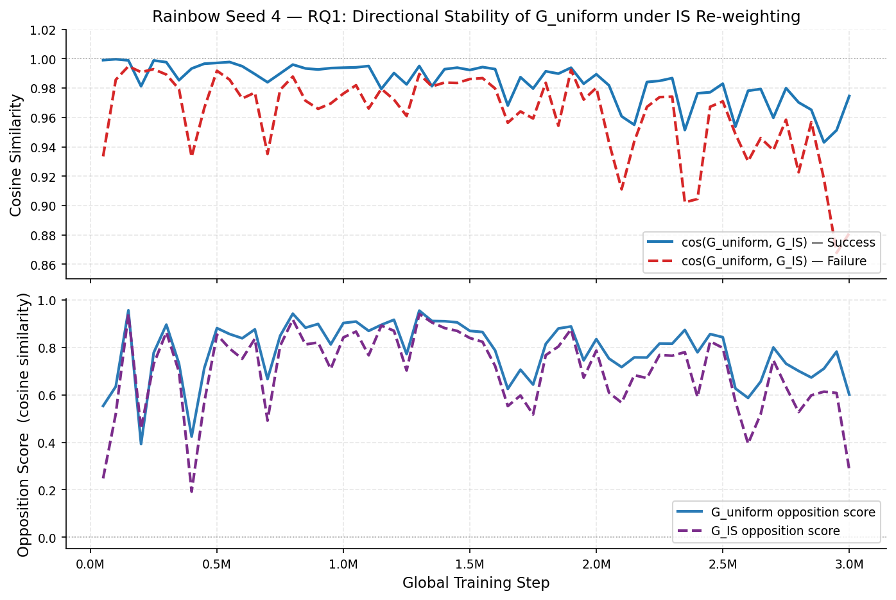
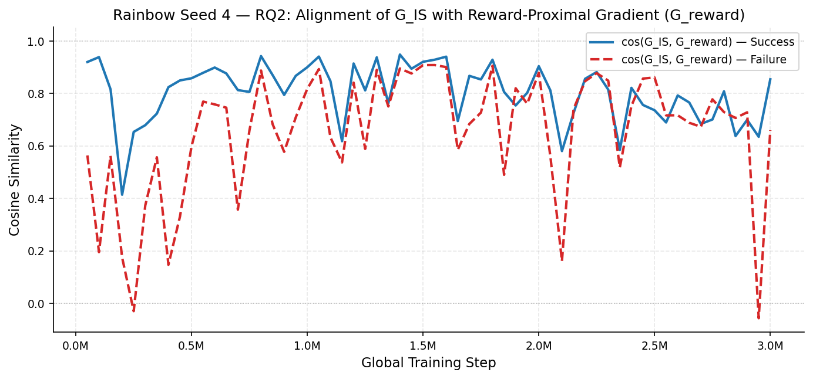
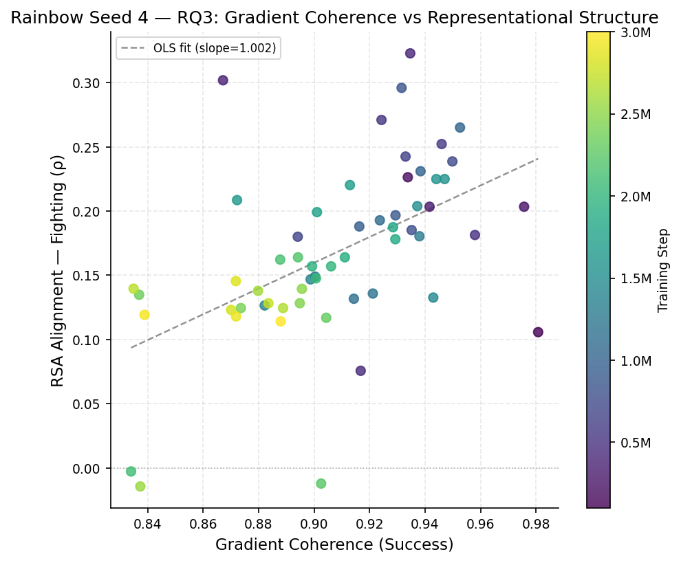
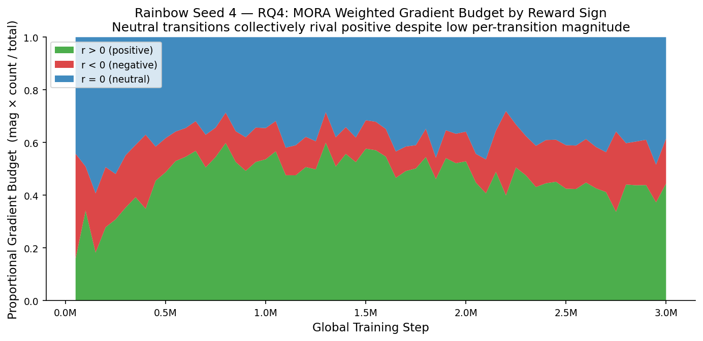
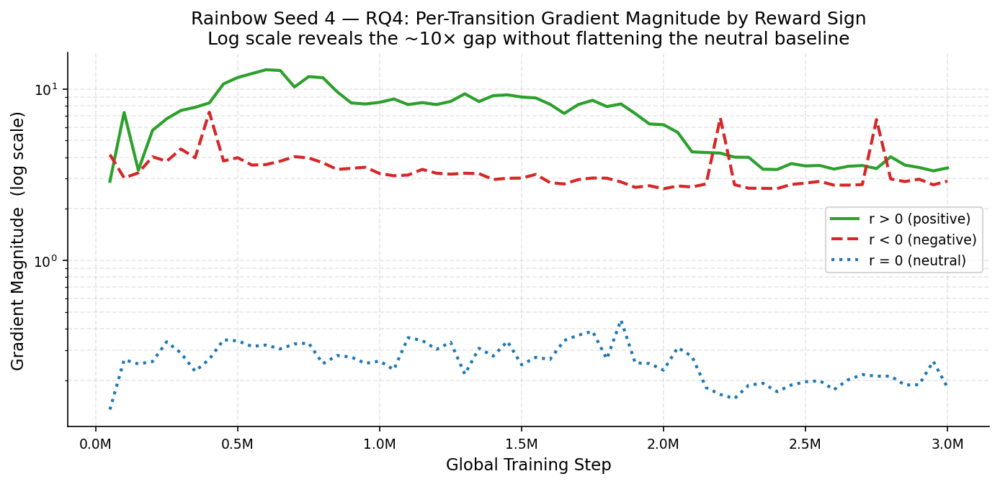
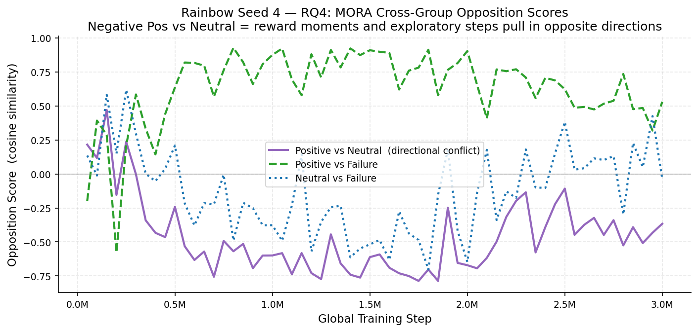

# Training & Analysis Report

**Environment:** `Crafter`  
**Seed:** 4  
**Total episodes:** 13,009  
**Experiment root:** `rainbow_experiment_root\seed_4`  
**Generated:** 2026-04-11 12:25

## Summary

| Checkpoint | Episodes | Opp. Score | Coh. (S) | Coh. (F) | Grad Mag (S) | Grad Mag (F) | Act. Sep. | Act. Cos. Dist. | RSA (ρ) |
|---|---:|---:|---:|---:|---:|---:|---:|---:|---:|
| collect_sapling @ ep1 | 1 | 0.9993 | 0.9932 | 0.9916 | 0.0434 | 0.0446 | 0.0077 | 0.0000 | — |
| defeat_zombie @ ep104 | 104 | 0.9997 | 0.9917 | 0.9891 | 0.0438 | 0.0445 | 0.0049 | 0.0000 | — |
| eat_cow @ ep113 | 113 | 0.9995 | 0.9949 | 0.9905 | 0.0436 | 0.0446 | 0.0054 | 0.0000 | — |
| collect_wood @ ep134 | 134 | 0.2491 | 0.8402 | 0.7999 | 0.0415 | 0.0414 | 0.2199 | 0.0008 | — |
| wake_up @ ep205 | 205 | -0.2994 | 0.9115 | 0.5127 | 0.0490 | 0.0425 | 0.2566 | 0.0007 | — |
| Step 50,000 | 299 | 0.5532 | 0.9889 | 0.8464 | 0.1789 | 0.0670 | 0.4912 | 0.0027 | — |
| collect_drink @ ep317 | 317 | 0.1155 | 0.9472 | 0.7831 | 0.0826 | 0.0643 | 0.5388 | 0.0031 | — |
| place_plant @ ep558 | 558 | 0.3734 | 0.8604 | 0.8103 | 0.1196 | 0.1119 | 0.4953 | 0.0021 | — |
| defeat_skeleton @ ep574 | 574 | 0.8747 | 0.8127 | 0.9685 | 0.0670 | 0.1479 | 0.6224 | 0.0034 | — |
| Step 100,000 | 594 | 0.6348 | 0.9808 | 0.9297 | 0.3398 | 0.1552 | 0.4449 | 0.0014 | — |
| place_table @ ep718 | 718 | -0.1472 | 0.9266 | 0.8984 | 0.1343 | 0.1509 | 0.1837 | 0.0002 | — |
| Step 150,000 | 882 | 0.9557 | 0.9734 | 0.9817 | 0.3180 | 0.2724 | 0.2898 | 0.0010 | — |
| Step 200,000 | 1,157 | 0.3926 | 0.9338 | 0.9733 | 0.1551 | 0.1896 | 0.4325 | 0.0025 | — |
| Step 250,000 | 1,420 | 0.7771 | 0.9757 | 0.9628 | 0.3919 | 0.2709 | 0.5058 | 0.0041 | — |
| Step 300,000 | 1,669 | 0.8954 | 0.9416 | 0.8868 | 0.3301 | 0.2182 | 0.5752 | 0.0060 | — |
| make_wood_sword @ ep1857 | 1,857 | 0.7635 | 0.9538 | 0.8802 | 0.3341 | 0.2380 | 0.4799 | 0.0042 | — |
| Step 350,000 | 1,921 | 0.7315 | 0.8672 | 0.9211 | 0.2264 | 0.2543 | 0.6934 | 0.0084 | — |
| make_wood_pickaxe @ ep2026 | 2,026 | 0.7385 | 0.8676 | 0.9208 | 0.2494 | 0.3322 | 1.0385 | 0.0187 | — |
| Step 400,000 | 2,162 | 0.4238 | 0.9347 | 0.8437 | 0.2548 | 0.1544 | 0.7658 | 0.0119 | — |
| collect_stone @ ep2395 | 2,395 | 0.4336 | 0.9624 | 0.8788 | 0.3803 | 0.2273 | 1.3713 | 0.0382 | — |
| Step 450,000 | 2,408 | 0.7125 | 0.9168 | 0.8067 | 0.3356 | 0.1921 | 1.1909 | 0.0258 | — |
| Step 500,000 | 2,664 | 0.8808 | 0.9580 | 0.8618 | 0.4198 | 0.2981 | 1.6916 | 0.0524 | — |
| Step 550,000 | 2,914 | 0.8558 | 0.9243 | 0.8584 | 0.3435 | 0.2637 | 1.1293 | 0.0296 | — |
| Step 600,000 | 3,160 | 0.8380 | 0.9460 | 0.8559 | 0.3200 | 0.2455 | 0.7692 | 0.0147 | — |
| Step 650,000 | 3,389 | 0.8755 | 0.9330 | 0.9310 | 0.3452 | 0.3099 | 0.4901 | 0.0073 | — |
| Step 700,000 | 3,628 | 0.6661 | 0.8941 | 0.8309 | 0.2006 | 0.1659 | 0.3647 | 0.0046 | — |
| Step 750,000 | 3,862 | 0.8487 | 0.9499 | 0.9096 | 0.3132 | 0.3163 | 0.3684 | 0.0050 | — |
| collect_coal @ ep4043 | 4,043 | 0.8944 | 0.9169 | 0.8272 | 0.3091 | 0.2490 | 0.3978 | 0.0061 | — |
| Step 800,000 | 4,087 | 0.9416 | 0.9352 | 0.8982 | 0.3611 | 0.2888 | 0.3404 | 0.0045 | — |
| Step 850,000 | 4,307 | 0.8825 | 0.9316 | 0.8036 | 0.2714 | 0.2006 | 0.3684 | 0.0054 | — |
| Step 900,000 | 4,532 | 0.8982 | 0.9294 | 0.8684 | 0.2407 | 0.1682 | 0.3339 | 0.0051 | — |
| Step 950,000 | 4,750 | 0.8123 | 0.9163 | 0.8094 | 0.2632 | 0.1877 | 0.3553 | 0.0059 | — |
| Step 1,000,000 | 4,967 | 0.9023 | 0.9384 | 0.8461 | 0.2936 | 0.2456 | 0.3430 | 0.0057 | — |
| Step 1,050,000 | 5,187 | 0.9083 | 0.9526 | 0.8634 | 0.3280 | 0.2949 | 0.3591 | 0.0061 | — |
| Step 1,100,000 | 5,407 | 0.8691 | 0.9237 | 0.7593 | 0.2637 | 0.1959 | 0.3795 | 0.0072 | — |
| Step 1,150,000 | 5,622 | 0.8945 | 0.9143 | 0.8464 | 0.2809 | 0.3134 | 0.4714 | 0.0105 | — |
| place_stone @ ep5835 | 5,835 | 0.5385 | 0.8921 | 0.8185 | 0.2450 | 0.3072 | 0.6283 | 0.0170 | — |
| Step 1,200,000 | 5,840 | 0.9159 | 0.9212 | 0.8537 | 0.2846 | 0.2446 | 0.5554 | 0.0143 | — |
| Step 1,250,000 | 6,057 | 0.7712 | 0.9003 | 0.7804 | 0.2306 | 0.2196 | 0.7275 | 0.0238 | — |
| make_stone_sword @ ep6200 | 6,200 | 0.5469 | 0.8558 | 0.6897 | 0.2395 | 0.1690 | 0.7796 | 0.0278 | — |
| Step 1,300,000 | 6,273 | 0.9545 | 0.9380 | 0.8854 | 0.4341 | 0.3877 | 0.7060 | 0.0213 | — |
| Step 1,350,000 | 6,483 | 0.9108 | 0.8822 | 0.8650 | 0.2786 | 0.3293 | 0.7894 | 0.0270 | — |
| Step 1,400,000 | 6,696 | 0.9099 | 0.8987 | 0.8757 | 0.3139 | 0.2962 | 0.7141 | 0.0226 | — |
| Step 1,450,000 | 6,917 | 0.9049 | 0.9430 | 0.8762 | 0.3543 | 0.3077 | 0.8189 | 0.0291 | — |
| Step 1,500,000 | 7,127 | 0.8691 | 0.9372 | 0.8636 | 0.3689 | 0.3871 | 0.8686 | 0.0320 | — |
| Step 1,550,000 | 7,334 | 0.8643 | 0.9471 | 0.8511 | 0.4020 | 0.3619 | 0.9480 | 0.0368 | — |
| Step 1,600,000 | 7,546 | 0.7867 | 0.9441 | 0.8152 | 0.3106 | 0.2975 | 0.9924 | 0.0406 | — |
| Step 1,650,000 | 7,747 | 0.6249 | 0.8722 | 0.7623 | 0.1938 | 0.2280 | 0.8155 | 0.0284 | — |
| Step 1,700,000 | 7,949 | 0.7059 | 0.9129 | 0.7074 | 0.2734 | 0.2363 | 0.8815 | 0.0330 | — |
| Step 1,750,000 | 8,150 | 0.6430 | 0.9010 | 0.7411 | 0.2444 | 0.2335 | 0.8408 | 0.0311 | — |
| Step 1,800,000 | 8,354 | 0.8140 | 0.9285 | 0.8311 | 0.2768 | 0.2961 | 0.8525 | 0.0287 | — |
| Step 1,850,000 | 8,553 | 0.8792 | 0.9293 | 0.7371 | 0.2786 | 0.1798 | 0.8315 | 0.0265 | — |
| Step 1,900,000 | 8,749 | 0.8878 | 0.9111 | 0.8532 | 0.3778 | 0.4695 | 1.0163 | 0.0417 | — |
| Step 1,950,000 | 8,956 | 0.7453 | 0.8993 | 0.7592 | 0.2106 | 0.2445 | 0.7220 | 0.0223 | — |
| Step 2,000,000 | 9,151 | 0.8346 | 0.9061 | 0.8149 | 0.2204 | 0.2423 | 0.7796 | 0.0228 | — |
| Step 2,050,000 | 9,348 | 0.7526 | 0.9007 | 0.6984 | 0.2007 | 0.1658 | 0.7563 | 0.0215 | — |
| Step 2,100,000 | 9,546 | 0.7167 | 0.8340 | 0.6541 | 0.1742 | 0.1397 | 0.7532 | 0.0219 | — |
| Step 2,150,000 | 9,743 | 0.7575 | 0.8878 | 0.7740 | 0.1920 | 0.1866 | 0.8431 | 0.0272 | — |
| Step 2,200,000 | 9,936 | 0.7569 | 0.8942 | 0.7586 | 0.1999 | 0.2400 | 0.8067 | 0.0220 | — |
| make_stone_pickaxe @ ep10041 | 10,041 | 0.6657 | 0.8987 | 0.7329 | 0.2304 | 0.1833 | 0.7891 | 0.0212 | — |
| Step 2,250,000 | 10,132 | 0.8158 | 0.9025 | 0.8005 | 0.2438 | 0.2561 | 0.6691 | 0.0159 | — |
| Step 2,300,000 | 10,322 | 0.8153 | 0.9044 | 0.7517 | 0.2562 | 0.2915 | 0.8955 | 0.0278 | — |
| Step 2,350,000 | 10,511 | 0.8731 | 0.8369 | 0.6830 | 0.1641 | 0.1520 | 0.8348 | 0.0249 | — |
| Step 2,400,000 | 10,700 | 0.7787 | 0.8736 | 0.6949 | 0.1708 | 0.1534 | 0.8550 | 0.0268 | — |
| Step 2,450,000 | 10,893 | 0.8558 | 0.8949 | 0.8566 | 0.2168 | 0.2579 | 0.9595 | 0.0312 | — |
| Step 2,500,000 | 11,086 | 0.8424 | 0.8956 | 0.7856 | 0.2307 | 0.2885 | 1.1606 | 0.0418 | — |
| Step 2,550,000 | 11,275 | 0.6265 | 0.8373 | 0.7704 | 0.1645 | 0.2245 | 1.1442 | 0.0423 | — |
| place_furnace @ ep11315 | 11,315 | 0.9623 | 0.8900 | 0.7220 | 0.4098 | 0.4246 | 1.0994 | 0.0376 | — |
| Step 2,600,000 | 11,469 | 0.5869 | 0.8798 | 0.7340 | 0.1907 | 0.1797 | 0.8742 | 0.0235 | — |
| Step 2,650,000 | 11,658 | 0.6558 | 0.8888 | 0.7312 | 0.2035 | 0.2127 | 1.1195 | 0.0369 | — |
| Step 2,700,000 | 11,850 | 0.7991 | 0.8349 | 0.7394 | 0.1814 | 0.2036 | 1.1672 | 0.0416 | — |
| Step 2,750,000 | 12,046 | 0.7311 | 0.8835 | 0.6400 | 0.1993 | 0.2372 | 1.2492 | 0.0469 | — |
| Step 2,800,000 | 12,235 | 0.7003 | 0.8701 | 0.7093 | 0.1950 | 0.1836 | 1.2864 | 0.0433 | — |
| Step 2,850,000 | 12,428 | 0.6727 | 0.8718 | 0.7408 | 0.2129 | 0.2590 | 1.0934 | 0.0325 | — |
| Step 2,900,000 | 12,621 | 0.7103 | 0.8719 | 0.7504 | 0.1969 | 0.2121 | 0.9804 | 0.0278 | — |
| collect_iron @ ep12805 | 12,805 | 0.5351 | 0.8631 | 0.6927 | 0.1945 | 0.1858 | 1.0206 | 0.0296 | — |
| Step 2,950,000 | 12,806 | 0.7819 | 0.8389 | 0.6181 | 0.1959 | 0.1576 | 1.1964 | 0.0402 | — |
| Step 3,000,000 | 13,009 | 0.6008 | 0.8880 | 0.7293 | 0.2150 | 0.1670 | 1.1514 | 0.0375 | — |

---

## Longitudinal Analysis

### RQ1 — Directional Stability: cos(G_uniform, G_IS) and Opposition Score

*Top panel: cosine similarity between G_uniform and G_IS for success/failure groups (expected ~0.97–1.0 throughout). Bottom panel: opposition score under both weightings — G_IS tracks G_uniform closely, confirming IS re-weighting does not substantially redirect gradient direction.*

### RQ2 — PER Directional Influence: cos(G_IS, G_reward)

*Alignment between the IS-weighted gradient and the reward-proximal gradient proxy. High values indicate PER tends to up-weight reward-proximal transitions; variance across training reflects inconsistency of this alignment.*

### RQ3 — Coherence vs Representational Structure (Scatter)

*Each point is one periodic checkpoint. Colour encodes training stage (early=dark, late=bright). A positive slope would support the RQ3 prediction that high gradient coherence predicts better semantic structure. Weak/absent correlation is itself informative.*

### RQ4 — MORA: Weighted Gradient Budget by Reward Sign

*Proportional gradient contribution = gradient_magnitude × n_transitions, normalised to sum to 1. Resolves the scale problem: despite ~5–10× higher per-transition magnitude, positive transitions do not overwhelmingly dominate because neutral transitions vastly outnumber them.*

### RQ4 — MORA: Per-Transition Gradient Magnitude (Log Scale)

*Log y-axis makes the 5–10× gap between positive and neutral per-transition magnitudes readable without flattening the neutral baseline. Negative transitions sit in between.*

### RQ4 — MORA: Cross-Group Opposition Scores

*Three pairwise comparisons: Positive vs Neutral (directional conflict — persistently negative means reward moments and exploratory steps push the network in opposite directions); Positive vs Failure; Neutral vs Failure.*

---

## collect_sapling_ep1_lower0.000_upper0.000

### Metrics

| Metric | Value |
|---|---|
| Opposition Score | 0.9993 |
| Coherence (Success) | 0.9932 |
| Coherence (Failure) | 0.9916 |
| Gradient Magnitude (Success) | 0.0434 |
| Gradient Magnitude (Failure) | 0.0446 |
| Activation Separation | 0.0077 |
| Cosine Distance | 0.0000 |
| Clusters | 1,773 |
| Noise Fraction | 0.1173 |
| RSA Alignment (ρ) | — |
| RSA Stimuli (1) | Wake Up |

### Gradient Variant Analysis (RQ1 / RQ2)

| Variant | Opp. Score | Coh. (S) | Coh. (F) | Grad Mag (S) | Grad Mag (F) |
|---|---:|---:|---:|---:|---:|
| G_uniform | 0.9993 | 0.9932 | 0.9916 | 0.0434 | 0.0446 |
| G_IS (β=0.400) | 0.9993 | 0.9932 | 0.9916 | 0.0434 | 0.0445 |

| Directional Alignment | Success | Failure |
|---|---:|---:|
| cos(G_uniform, G_IS) | 1.0000 | 1.0000 |
| cos(G_IS, G_reward)  | 0.7860 | 0.7908 |

### Moment of Reward (Rainbow)

| Subgroup | N transitions | Grad Mag | Coherence |
|---|---:|---:|---:|
| Positive (r > 0) | 171 | 0.4533 | 0.8078 |
| Neutral  (r = 0) | 41,663 | 0.0437 | 0.9963 |
| Negative (r < 0) | 1,292 | 0.6700 | 0.9953 |

| Comparison | Opp. Score |
|---|---:|
| Pos vs Neutral   | 0.0985 |
| Pos vs Negative  | 0.0735 |
| Neutral vs Neg.  | 0.2122 |
| Pos vs Failure   | 0.1143 |
| Neutral vs Fail. | 0.9278 |
| Neg. vs Failure  | 0.5209 |

---

## defeat_zombie_ep104_lower0.000_upper0.000

### Metrics

| Metric | Value |
|---|---|
| Opposition Score | 0.9997 |
| Coherence (Success) | 0.9917 |
| Coherence (Failure) | 0.9891 |
| Gradient Magnitude (Success) | 0.0438 |
| Gradient Magnitude (Failure) | 0.0445 |
| Activation Separation | 0.0049 |
| Cosine Distance | 0.0000 |
| Clusters | 1,760 |
| Noise Fraction | 0.1082 |
| RSA Alignment (ρ) | — |
| RSA Stimuli (1) | Wake Up |

### Gradient Variant Analysis (RQ1 / RQ2)

| Variant | Opp. Score | Coh. (S) | Coh. (F) | Grad Mag (S) | Grad Mag (F) |
|---|---:|---:|---:|---:|---:|
| G_uniform | 0.9997 | 0.9917 | 0.9891 | 0.0438 | 0.0445 |
| G_IS (β=0.400) | 0.9997 | 0.9917 | 0.9891 | 0.0437 | 0.0444 |

| Directional Alignment | Success | Failure |
|---|---:|---:|
| cos(G_uniform, G_IS) | 1.0000 | 1.0000 |
| cos(G_IS, G_reward)  | 0.7832 | 0.7881 |

### Moment of Reward (Rainbow)

| Subgroup | N transitions | Grad Mag | Coherence |
|---|---:|---:|---:|
| Positive (r > 0) | 182 | 0.4388 | 0.9586 |
| Neutral  (r = 0) | 41,076 | 0.0441 | 0.9942 |
| Negative (r < 0) | 1,291 | 0.6657 | 0.9950 |

| Comparison | Opp. Score |
|---|---:|
| Pos vs Neutral   | 0.1590 |
| Pos vs Negative  | 0.1000 |
| Neutral vs Neg.  | 0.2161 |
| Pos vs Failure   | 0.1605 |
| Neutral vs Fail. | 0.9240 |
| Neg. vs Failure  | 0.5234 |

---

## eat_cow_ep113_lower0.000_upper0.000

### Metrics

| Metric | Value |
|---|---|
| Opposition Score | 0.9995 |
| Coherence (Success) | 0.9949 |
| Coherence (Failure) | 0.9905 |
| Gradient Magnitude (Success) | 0.0436 |
| Gradient Magnitude (Failure) | 0.0446 |
| Activation Separation | 0.0054 |
| Cosine Distance | 0.0000 |
| Clusters | 1,730 |
| Noise Fraction | 0.1129 |
| RSA Alignment (ρ) | — |
| RSA Stimuli (2) | Sapling, Wake Up |

### Gradient Variant Analysis (RQ1 / RQ2)

| Variant | Opp. Score | Coh. (S) | Coh. (F) | Grad Mag (S) | Grad Mag (F) |
|---|---:|---:|---:|---:|---:|
| G_uniform | 0.9995 | 0.9949 | 0.9905 | 0.0436 | 0.0446 |
| G_IS (β=0.400) | 0.9995 | 0.9949 | 0.9905 | 0.0434 | 0.0444 |

| Directional Alignment | Success | Failure |
|---|---:|---:|
| cos(G_uniform, G_IS) | 1.0000 | 1.0000 |
| cos(G_IS, G_reward)  | 0.7793 | 0.7905 |

### Moment of Reward (Rainbow)

| Subgroup | N transitions | Grad Mag | Coherence |
|---|---:|---:|---:|
| Positive (r > 0) | 177 | 0.4360 | 0.9758 |
| Neutral  (r = 0) | 41,460 | 0.0439 | 0.9979 |
| Negative (r < 0) | 1,287 | 0.6628 | 0.9963 |

| Comparison | Opp. Score |
|---|---:|
| Pos vs Neutral   | 0.1452 |
| Pos vs Negative  | 0.0971 |
| Neutral vs Neg.  | 0.2186 |
| Pos vs Failure   | 0.1512 |
| Neutral vs Fail. | 0.9263 |
| Neg. vs Failure  | 0.5234 |

---

## collect_wood_ep134_lower1.900_upper2.900

### Metrics

| Metric | Value |
|---|---|
| Opposition Score | 0.2491 |
| Coherence (Success) | 0.8402 |
| Coherence (Failure) | 0.7999 |
| Gradient Magnitude (Success) | 0.0415 |
| Gradient Magnitude (Failure) | 0.0414 |
| Activation Separation | 0.2199 |
| Cosine Distance | 0.0008 |
| Clusters | 1,472 |
| Noise Fraction | 0.2022 |
| RSA Alignment (ρ) | — |
| RSA Stimuli (5) | Eat Cow, Place Plant, Sapling, Wake Up, Zombie |

### Gradient Variant Analysis (RQ1 / RQ2)

| Variant | Opp. Score | Coh. (S) | Coh. (F) | Grad Mag (S) | Grad Mag (F) |
|---|---:|---:|---:|---:|---:|
| G_uniform | 0.2491 | 0.8402 | 0.7999 | 0.0415 | 0.0414 |
| G_IS (β=0.401) | 0.2943 | 0.8199 | 0.8306 | 0.0384 | 0.0420 |

| Directional Alignment | Success | Failure |
|---|---:|---:|
| cos(G_uniform, G_IS) | 0.9933 | 0.9975 |
| cos(G_IS, G_reward)  | 0.2646 | 0.6915 |

### Moment of Reward (Rainbow)

| Subgroup | N transitions | Grad Mag | Coherence |
|---|---:|---:|---:|
| Positive (r > 0) | 764 | 1.6952 | 0.9866 |
| Neutral  (r = 0) | 45,034 | 0.0489 | 0.9390 |
| Negative (r < 0) | 1,352 | 2.9040 | 0.9915 |

| Comparison | Opp. Score |
|---|---:|
| Pos vs Neutral   | -0.0365 |
| Pos vs Negative  | 0.2240 |
| Neutral vs Neg.  | -0.5669 |
| Pos vs Failure   | 0.0618 |
| Neutral vs Fail. | -0.2662 |
| Neg. vs Failure  | 0.8162 |

---

## wake_up_ep205_lower1.900_upper1.900

### Metrics

| Metric | Value |
|---|---|
| Opposition Score | -0.2994 |
| Coherence (Success) | 0.9115 |
| Coherence (Failure) | 0.5127 |
| Gradient Magnitude (Success) | 0.0490 |
| Gradient Magnitude (Failure) | 0.0425 |
| Activation Separation | 0.2566 |
| Cosine Distance | 0.0007 |
| Clusters | 1,434 |
| Noise Fraction | 0.2159 |
| RSA Alignment (ρ) | — |
| RSA Stimuli (5) | Eat Cow, Place Plant, Sapling, Wake Up, Zombie |

### Gradient Variant Analysis (RQ1 / RQ2)

| Variant | Opp. Score | Coh. (S) | Coh. (F) | Grad Mag (S) | Grad Mag (F) |
|---|---:|---:|---:|---:|---:|
| G_uniform | -0.2994 | 0.9115 | 0.5127 | 0.0490 | 0.0425 |
| G_IS (β=0.403) | -0.4000 | 0.7811 | 0.6346 | 0.0294 | 0.0442 |

| Directional Alignment | Success | Failure |
|---|---:|---:|
| cos(G_uniform, G_IS) | 0.9679 | 0.9642 |
| cos(G_IS, G_reward)  | 0.3827 | 0.7956 |

### Moment of Reward (Rainbow)

| Subgroup | N transitions | Grad Mag | Coherence |
|---|---:|---:|---:|
| Positive (r > 0) | 777 | 2.4167 | 0.9682 |
| Neutral  (r = 0) | 44,786 | 0.0771 | 0.9732 |
| Negative (r < 0) | 1,339 | 4.2327 | 0.9977 |

| Comparison | Opp. Score |
|---|---:|
| Pos vs Neutral   | 0.0882 |
| Pos vs Negative  | 0.1620 |
| Neutral vs Neg.  | -0.7276 |
| Pos vs Failure   | 0.0310 |
| Neutral vs Fail. | -0.4271 |
| Neg. vs Failure  | 0.6187 |

---

## ep299_lower1.900_upper2.900

### Metrics

| Metric | Value |
|---|---|
| Opposition Score | 0.5532 |
| Coherence (Success) | 0.9889 |
| Coherence (Failure) | 0.8464 |
| Gradient Magnitude (Success) | 0.1789 |
| Gradient Magnitude (Failure) | 0.0670 |
| Activation Separation | 0.4912 |
| Cosine Distance | 0.0027 |
| Clusters | 1,563 |
| Noise Fraction | 0.2044 |
| RSA Alignment (ρ) | — |
| RSA Stimuli (5) | Eat Cow, Place Plant, Sapling, Wake Up, Zombie |

### Gradient Variant Analysis (RQ1 / RQ2)

| Variant | Opp. Score | Coh. (S) | Coh. (F) | Grad Mag (S) | Grad Mag (F) |
|---|---:|---:|---:|---:|---:|
| G_uniform | 0.5532 | 0.9889 | 0.8464 | 0.1789 | 0.0670 |
| G_IS (β=0.406) | 0.2484 | 0.9834 | 0.8037 | 0.1276 | 0.0518 |

| Directional Alignment | Success | Failure |
|---|---:|---:|
| cos(G_uniform, G_IS) | 0.9990 | 0.9335 |
| cos(G_IS, G_reward)  | 0.9201 | 0.5638 |

### Moment of Reward (Rainbow)

| Subgroup | N transitions | Grad Mag | Coherence |
|---|---:|---:|---:|
| Positive (r > 0) | 789 | 2.8937 | 0.9501 |
| Neutral  (r = 0) | 47,069 | 0.1355 | 0.9921 |
| Negative (r < 0) | 1,388 | 4.1402 | 0.9968 |

| Comparison | Opp. Score |
|---|---:|
| Pos vs Neutral   | 0.2155 |
| Pos vs Negative  | -0.3147 |
| Neutral vs Neg.  | -0.9670 |
| Pos vs Failure   | -0.1978 |
| Neutral vs Fail. | 0.1353 |
| Neg. vs Failure  | -0.0262 |

---

## collect_drink_ep317_lower1.900_upper2.900

### Metrics

| Metric | Value |
|---|---|
| Opposition Score | 0.1155 |
| Coherence (Success) | 0.9472 |
| Coherence (Failure) | 0.7831 |
| Gradient Magnitude (Success) | 0.0826 |
| Gradient Magnitude (Failure) | 0.0643 |
| Activation Separation | 0.5388 |
| Cosine Distance | 0.0031 |
| Clusters | 1,620 |
| Noise Fraction | 0.1725 |
| RSA Alignment (ρ) | — |
| RSA Stimuli (5) | Eat Cow, Place Plant, Sapling, Wake Up, Zombie |

### Gradient Variant Analysis (RQ1 / RQ2)

| Variant | Opp. Score | Coh. (S) | Coh. (F) | Grad Mag (S) | Grad Mag (F) |
|---|---:|---:|---:|---:|---:|
| G_uniform | 0.1155 | 0.9472 | 0.7831 | 0.0826 | 0.0643 |
| G_IS (β=0.407) | -0.0269 | 0.8750 | 0.8993 | 0.0483 | 0.0651 |

| Directional Alignment | Success | Failure |
|---|---:|---:|
| cos(G_uniform, G_IS) | 0.9779 | 0.9436 |
| cos(G_IS, G_reward)  | 0.8264 | 0.7952 |

### Moment of Reward (Rainbow)

| Subgroup | N transitions | Grad Mag | Coherence |
|---|---:|---:|---:|
| Positive (r > 0) | 766 | 2.8656 | 0.9546 |
| Neutral  (r = 0) | 47,477 | 0.0832 | 0.9227 |
| Negative (r < 0) | 1,369 | 4.2506 | 0.9974 |

| Comparison | Opp. Score |
|---|---:|
| Pos vs Neutral   | 0.0933 |
| Pos vs Negative  | -0.2841 |
| Neutral vs Neg.  | -0.4566 |
| Pos vs Failure   | -0.2788 |
| Neutral vs Fail. | -0.4102 |
| Neg. vs Failure  | 0.6182 |

---

## place_plant_ep558_lower1.900_upper2.900

### Metrics

| Metric | Value |
|---|---|
| Opposition Score | 0.3734 |
| Coherence (Success) | 0.8604 |
| Coherence (Failure) | 0.8103 |
| Gradient Magnitude (Success) | 0.1196 |
| Gradient Magnitude (Failure) | 0.1119 |
| Activation Separation | 0.4953 |
| Cosine Distance | 0.0021 |
| Clusters | 2,010 |
| Noise Fraction | 0.1483 |
| RSA Alignment (ρ) | — |
| RSA Stimuli (8) | Drink, Eat Cow, Place Plant, Sapling, Skeleton, Wake Up, Wood, Zombie |

### Gradient Variant Analysis (RQ1 / RQ2)

| Variant | Opp. Score | Coh. (S) | Coh. (F) | Grad Mag (S) | Grad Mag (F) |
|---|---:|---:|---:|---:|---:|
| G_uniform | 0.3734 | 0.8604 | 0.8103 | 0.1196 | 0.1119 |
| G_IS (β=0.415) | 0.3260 | 0.8105 | 0.8381 | 0.0745 | 0.0884 |

| Directional Alignment | Success | Failure |
|---|---:|---:|
| cos(G_uniform, G_IS) | 0.9925 | 0.9834 |
| cos(G_IS, G_reward)  | 0.7755 | 0.6288 |

| Weight-Delta Alignment | Success | Failure |
|---|---:|---:|
| cos(G_uniform, Δθ) | 0.0781 | 0.0750 |
| cos(G_IS, Δθ)      | 0.0803 | 0.0581 |
| cos(G_reward, Δθ)  | 0.0206 | -0.0236 |

### Moment of Reward (Rainbow)

| Subgroup | N transitions | Grad Mag | Coherence |
|---|---:|---:|---:|
| Positive (r > 0) | 909 | 4.1373 | 0.9584 |
| Neutral  (r = 0) | 45,431 | 0.1835 | 0.9786 |
| Negative (r < 0) | 1,265 | 4.2784 | 0.9805 |

| Comparison | Opp. Score |
|---|---:|
| Pos vs Neutral   | -0.0759 |
| Pos vs Negative  | -0.5613 |
| Neutral vs Neg.  | -0.2823 |
| Pos vs Failure   | -0.3546 |
| Neutral vs Fail. | -0.4168 |
| Neg. vs Failure  | 0.6051 |

---

## defeat_skeleton_ep574_lower1.900_upper2.900

### Metrics

| Metric | Value |
|---|---|
| Opposition Score | 0.8747 |
| Coherence (Success) | 0.8127 |
| Coherence (Failure) | 0.9685 |
| Gradient Magnitude (Success) | 0.0670 |
| Gradient Magnitude (Failure) | 0.1479 |
| Activation Separation | 0.6224 |
| Cosine Distance | 0.0034 |
| Clusters | 1,980 |
| Noise Fraction | 0.1519 |
| RSA Alignment (ρ) | — |
| RSA Stimuli (7) | Eat Cow, Place Plant, Sapling, Skeleton, Wake Up, Wood, Zombie |

### Gradient Variant Analysis (RQ1 / RQ2)

| Variant | Opp. Score | Coh. (S) | Coh. (F) | Grad Mag (S) | Grad Mag (F) |
|---|---:|---:|---:|---:|---:|
| G_uniform | 0.8747 | 0.8127 | 0.9685 | 0.0670 | 0.1479 |
| G_IS (β=0.415) | 0.9359 | 0.8678 | 0.9760 | 0.0586 | 0.1231 |

| Directional Alignment | Success | Failure |
|---|---:|---:|
| cos(G_uniform, G_IS) | 0.9591 | 0.9923 |
| cos(G_IS, G_reward)  | -0.4504 | 0.8395 |

| Weight-Delta Alignment | Success | Failure |
|---|---:|---:|
| cos(G_uniform, Δθ) | 0.0404 | 0.0163 |
| cos(G_IS, Δθ)      | 0.0223 | 0.0069 |
| cos(G_reward, Δθ)  | 0.0006 | -0.0277 |

### Moment of Reward (Rainbow)

| Subgroup | N transitions | Grad Mag | Coherence |
|---|---:|---:|---:|
| Positive (r > 0) | 967 | 3.9062 | 0.9563 |
| Neutral  (r = 0) | 48,089 | 0.2472 | 0.9948 |
| Negative (r < 0) | 1,389 | 3.7871 | 0.9962 |

| Comparison | Opp. Score |
|---|---:|
| Pos vs Neutral   | -0.3057 |
| Pos vs Negative  | -0.6374 |
| Neutral vs Neg.  | 0.0190 |
| Pos vs Failure   | -0.6751 |
| Neutral vs Fail. | 0.2436 |
| Neg. vs Failure  | 0.7880 |

---

## ep594_lower2.000_upper3.000

### Metrics

| Metric | Value |
|---|---|
| Opposition Score | 0.6348 |
| Coherence (Success) | 0.9808 |
| Coherence (Failure) | 0.9297 |
| Gradient Magnitude (Success) | 0.3398 |
| Gradient Magnitude (Failure) | 0.1552 |
| Activation Separation | 0.4449 |
| Cosine Distance | 0.0014 |
| Clusters | 2,031 |
| Noise Fraction | 0.1707 |
| RSA Alignment (ρ) | — |
| RSA Stimuli (9) | Drink, Eat Cow, Place Plant, Sapling, Skeleton, Table, Wake Up, Wood, Zombie |

### Gradient Variant Analysis (RQ1 / RQ2)

| Variant | Opp. Score | Coh. (S) | Coh. (F) | Grad Mag (S) | Grad Mag (F) |
|---|---:|---:|---:|---:|---:|
| G_uniform | 0.6348 | 0.9808 | 0.9297 | 0.3398 | 0.1552 |
| G_IS (β=0.416) | 0.5196 | 0.9768 | 0.9148 | 0.2196 | 0.1019 |

| Directional Alignment | Success | Failure |
|---|---:|---:|
| cos(G_uniform, G_IS) | 0.9996 | 0.9857 |
| cos(G_IS, G_reward)  | 0.9387 | 0.1952 |

| Weight-Delta Alignment | Success | Failure |
|---|---:|---:|
| cos(G_uniform, Δθ) | 0.0352 | 0.0599 |
| cos(G_IS, Δθ)      | 0.0347 | 0.0556 |
| cos(G_reward, Δθ)  | 0.0176 | -0.0228 |

### Moment of Reward (Rainbow)

| Subgroup | N transitions | Grad Mag | Coherence |
|---|---:|---:|---:|
| Positive (r > 0) | 1,130 | 7.2952 | 0.9907 |
| Neutral  (r = 0) | 44,857 | 0.2644 | 0.9781 |
| Negative (r < 0) | 1,335 | 3.0331 | 0.9853 |

| Comparison | Opp. Score |
|---|---:|
| Pos vs Neutral   | 0.1171 |
| Pos vs Negative  | -0.5114 |
| Neutral vs Neg.  | -0.7434 |
| Pos vs Failure   | 0.3923 |
| Neutral vs Fail. | -0.0117 |
| Neg. vs Failure  | 0.0381 |

---

## place_table_ep718_lower1.900_upper2.900

### Metrics

| Metric | Value |
|---|---|
| Opposition Score | -0.1472 |
| Coherence (Success) | 0.9266 |
| Coherence (Failure) | 0.8984 |
| Gradient Magnitude (Success) | 0.1343 |
| Gradient Magnitude (Failure) | 0.1509 |
| Activation Separation | 0.1837 |
| Cosine Distance | 0.0002 |
| Clusters | 1,978 |
| Noise Fraction | 0.1542 |
| RSA Alignment (ρ) | — |
| RSA Stimuli (7) | Drink, Eat Cow, Place Plant, Sapling, Wake Up, Wood, Zombie |

### Gradient Variant Analysis (RQ1 / RQ2)

| Variant | Opp. Score | Coh. (S) | Coh. (F) | Grad Mag (S) | Grad Mag (F) |
|---|---:|---:|---:|---:|---:|
| G_uniform | -0.1472 | 0.9266 | 0.8984 | 0.1343 | 0.1509 |
| G_IS (β=0.420) | -0.1094 | 0.8918 | 0.9296 | 0.0828 | 0.1263 |

| Directional Alignment | Success | Failure |
|---|---:|---:|
| cos(G_uniform, G_IS) | 0.9859 | 0.9902 |
| cos(G_IS, G_reward)  | 0.7388 | 0.7369 |

| Weight-Delta Alignment | Success | Failure |
|---|---:|---:|
| cos(G_uniform, Δθ) | -0.0346 | 0.0225 |
| cos(G_IS, Δθ)      | -0.0354 | 0.0219 |
| cos(G_reward, Δθ)  | -0.0452 | -0.0095 |

### Moment of Reward (Rainbow)

| Subgroup | N transitions | Grad Mag | Coherence |
|---|---:|---:|---:|
| Positive (r > 0) | 830 | 7.5850 | 0.9699 |
| Neutral  (r = 0) | 46,160 | 0.2122 | 0.9667 |
| Negative (r < 0) | 1,327 | 3.3266 | 0.5810 |

| Comparison | Opp. Score |
|---|---:|
| Pos vs Neutral   | -0.3676 |
| Pos vs Negative  | -0.3181 |
| Neutral vs Neg.  | -0.3311 |
| Pos vs Failure   | -0.5497 |
| Neutral vs Fail. | 0.0877 |
| Neg. vs Failure  | 0.7287 |

---

## ep882_lower2.000_upper3.000

### Metrics

| Metric | Value |
|---|---|
| Opposition Score | 0.9557 |
| Coherence (Success) | 0.9734 |
| Coherence (Failure) | 0.9817 |
| Gradient Magnitude (Success) | 0.3180 |
| Gradient Magnitude (Failure) | 0.2724 |
| Activation Separation | 0.2898 |
| Cosine Distance | 0.0010 |
| Clusters | 1,701 |
| Noise Fraction | 0.1334 |
| RSA Alignment (ρ) | — |
| RSA Stimuli (5) | Eat Cow, Place Plant, Sapling, Wake Up, Zombie |

### Gradient Variant Analysis (RQ1 / RQ2)

| Variant | Opp. Score | Coh. (S) | Coh. (F) | Grad Mag (S) | Grad Mag (F) |
|---|---:|---:|---:|---:|---:|
| G_uniform | 0.9557 | 0.9734 | 0.9817 | 0.3180 | 0.2724 |
| G_IS (β=0.426) | 0.9404 | 0.9676 | 0.9782 | 0.2127 | 0.1819 |

| Directional Alignment | Success | Failure |
|---|---:|---:|
| cos(G_uniform, G_IS) | 0.9988 | 0.9948 |
| cos(G_IS, G_reward)  | 0.8160 | 0.5622 |

| Weight-Delta Alignment | Success | Failure |
|---|---:|---:|
| cos(G_uniform, Δθ) | 0.0227 | 0.0332 |
| cos(G_IS, Δθ)      | 0.0234 | 0.0341 |
| cos(G_reward, Δθ)  | 0.0042 | 0.0302 |

### Moment of Reward (Rainbow)

| Subgroup | N transitions | Grad Mag | Coherence |
|---|---:|---:|---:|
| Positive (r > 0) | 1,019 | 3.3578 | 0.9806 |
| Neutral  (r = 0) | 44,651 | 0.2498 | 0.9958 |
| Negative (r < 0) | 1,309 | 3.2419 | 0.6090 |

| Comparison | Opp. Score |
|---|---:|
| Pos vs Neutral   | 0.4700 |
| Pos vs Negative  | -0.5489 |
| Neutral vs Neg.  | -0.5967 |
| Pos vs Failure   | 0.2858 |
| Neutral vs Fail. | 0.5821 |
| Neg. vs Failure  | -0.0211 |

---

## ep1157_lower2.000_upper3.000

### Metrics

| Metric | Value |
|---|---|
| Opposition Score | 0.3926 |
| Coherence (Success) | 0.9338 |
| Coherence (Failure) | 0.9733 |
| Gradient Magnitude (Success) | 0.1551 |
| Gradient Magnitude (Failure) | 0.1896 |
| Activation Separation | 0.4325 |
| Cosine Distance | 0.0025 |
| Clusters | 1,817 |
| Noise Fraction | 0.1311 |
| RSA Alignment (ρ) | — |
| RSA Stimuli (8) | Drink, Eat Cow, Place Plant, Sapling, Skeleton, Wake Up, Wood, Zombie |

### Gradient Variant Analysis (RQ1 / RQ2)

| Variant | Opp. Score | Coh. (S) | Coh. (F) | Grad Mag (S) | Grad Mag (F) |
|---|---:|---:|---:|---:|---:|
| G_uniform | 0.3926 | 0.9338 | 0.9733 | 0.1551 | 0.1896 |
| G_IS (β=0.436) | 0.4570 | 0.9271 | 0.9775 | 0.1024 | 0.1488 |

| Directional Alignment | Success | Failure |
|---|---:|---:|
| cos(G_uniform, G_IS) | 0.9812 | 0.9909 |
| cos(G_IS, G_reward)  | 0.4140 | 0.1747 |

| Weight-Delta Alignment | Success | Failure |
|---|---:|---:|
| cos(G_uniform, Δθ) | -0.0227 | -0.0309 |
| cos(G_IS, Δθ)      | -0.0261 | -0.0292 |
| cos(G_reward, Δθ)  | 0.0046 | -0.0111 |

### Moment of Reward (Rainbow)

| Subgroup | N transitions | Grad Mag | Coherence |
|---|---:|---:|---:|
| Positive (r > 0) | 1,190 | 5.7384 | 0.9834 |
| Neutral  (r = 0) | 46,913 | 0.2580 | 0.9960 |
| Negative (r < 0) | 1,394 | 4.0238 | 0.9939 |

| Comparison | Opp. Score |
|---|---:|
| Pos vs Neutral   | -0.1543 |
| Pos vs Negative  | -0.7153 |
| Neutral vs Neg.  | -0.3635 |
| Pos vs Failure   | -0.5768 |
| Neutral vs Fail. | 0.1492 |
| Neg. vs Failure  | 0.6150 |

---

## ep1420_lower2.000_upper3.900

### Metrics

| Metric | Value |
|---|---|
| Opposition Score | 0.7771 |
| Coherence (Success) | 0.9757 |
| Coherence (Failure) | 0.9628 |
| Gradient Magnitude (Success) | 0.3919 |
| Gradient Magnitude (Failure) | 0.2709 |
| Activation Separation | 0.5058 |
| Cosine Distance | 0.0041 |
| Clusters | 2,051 |
| Noise Fraction | 0.1867 |
| RSA Alignment (ρ) | — |
| RSA Stimuli (9) | Drink, Eat Cow, Place Plant, Sapling, Skeleton, Table, Wake Up, Wood, Zombie |

### Gradient Variant Analysis (RQ1 / RQ2)

| Variant | Opp. Score | Coh. (S) | Coh. (F) | Grad Mag (S) | Grad Mag (F) |
|---|---:|---:|---:|---:|---:|
| G_uniform | 0.7771 | 0.9757 | 0.9628 | 0.3919 | 0.2709 |
| G_IS (β=0.446) | 0.7297 | 0.9715 | 0.9612 | 0.2576 | 0.1811 |

| Directional Alignment | Success | Failure |
|---|---:|---:|
| cos(G_uniform, G_IS) | 0.9988 | 0.9928 |
| cos(G_IS, G_reward)  | 0.6535 | -0.0301 |

| Weight-Delta Alignment | Success | Failure |
|---|---:|---:|
| cos(G_uniform, Δθ) | -0.0013 | 0.0121 |
| cos(G_IS, Δθ)      | -0.0010 | 0.0134 |
| cos(G_reward, Δθ)  | -0.0142 | -0.0032 |

### Moment of Reward (Rainbow)

| Subgroup | N transitions | Grad Mag | Coherence |
|---|---:|---:|---:|
| Positive (r > 0) | 1,448 | 6.7000 | 0.9928 |
| Neutral  (r = 0) | 48,619 | 0.3364 | 0.9915 |
| Negative (r < 0) | 1,432 | 3.7907 | 0.9927 |

| Comparison | Opp. Score |
|---|---:|
| Pos vs Neutral   | 0.2364 |
| Pos vs Negative  | -0.6062 |
| Neutral vs Neg.  | -0.5443 |
| Pos vs Failure   | 0.2092 |
| Neutral vs Fail. | 0.6181 |
| Neg. vs Failure  | 0.0655 |

---

## ep1669_lower3.000_upper4.900

### Metrics

| Metric | Value |
|---|---|
| Opposition Score | 0.8954 |
| Coherence (Success) | 0.9416 |
| Coherence (Failure) | 0.8868 |
| Gradient Magnitude (Success) | 0.3301 |
| Gradient Magnitude (Failure) | 0.2182 |
| Activation Separation | 0.5752 |
| Cosine Distance | 0.0060 |
| Clusters | 2,154 |
| Noise Fraction | 0.1778 |
| RSA Alignment (ρ) | — |
| RSA Stimuli (9) | Drink, Eat Cow, Place Plant, Sapling, Skeleton, Table, Wake Up, Wood, Zombie |

### Gradient Variant Analysis (RQ1 / RQ2)

| Variant | Opp. Score | Coh. (S) | Coh. (F) | Grad Mag (S) | Grad Mag (F) |
|---|---:|---:|---:|---:|---:|
| G_uniform | 0.8954 | 0.9416 | 0.8868 | 0.3301 | 0.2182 |
| G_IS (β=0.456) | 0.8636 | 0.9275 | 0.8726 | 0.2109 | 0.1359 |

| Directional Alignment | Success | Failure |
|---|---:|---:|
| cos(G_uniform, G_IS) | 0.9976 | 0.9892 |
| cos(G_IS, G_reward)  | 0.6792 | 0.3732 |

| Weight-Delta Alignment | Success | Failure |
|---|---:|---:|
| cos(G_uniform, Δθ) | 0.0026 | 0.0106 |
| cos(G_IS, Δθ)      | 0.0027 | 0.0113 |
| cos(G_reward, Δθ)  | -0.0071 | -0.0004 |

### Moment of Reward (Rainbow)

| Subgroup | N transitions | Grad Mag | Coherence |
|---|---:|---:|---:|
| Positive (r > 0) | 1,470 | 7.4896 | 0.9828 |
| Neutral  (r = 0) | 48,363 | 0.2892 | 0.9844 |
| Negative (r < 0) | 1,389 | 4.4650 | 0.9892 |

| Comparison | Opp. Score |
|---|---:|
| Pos vs Neutral   | -0.0026 |
| Pos vs Negative  | -0.5399 |
| Neutral vs Neg.  | -0.5979 |
| Pos vs Failure   | 0.5845 |
| Neutral vs Fail. | 0.2964 |
| Neg. vs Failure  | -0.2173 |

---

## make_wood_sword_ep1857_lower3.000_upper4.900

### Metrics

| Metric | Value |
|---|---|
| Opposition Score | 0.7635 |
| Coherence (Success) | 0.9538 |
| Coherence (Failure) | 0.8802 |
| Gradient Magnitude (Success) | 0.3341 |
| Gradient Magnitude (Failure) | 0.2380 |
| Activation Separation | 0.4799 |
| Cosine Distance | 0.0042 |
| Clusters | 2,211 |
| Noise Fraction | 0.1603 |
| RSA Alignment (ρ) | — |
| RSA Stimuli (10) | Drink, Eat Cow, Place Plant, Sapling, Skeleton, Table, Wake Up, Wood, Wood Sword, Zombie |

### Gradient Variant Analysis (RQ1 / RQ2)

| Variant | Opp. Score | Coh. (S) | Coh. (F) | Grad Mag (S) | Grad Mag (F) |
|---|---:|---:|---:|---:|---:|
| G_uniform | 0.7635 | 0.9538 | 0.8802 | 0.3341 | 0.2380 |
| G_IS (β=0.464) | 0.6795 | 0.9437 | 0.8792 | 0.2100 | 0.1534 |

| Directional Alignment | Success | Failure |
|---|---:|---:|
| cos(G_uniform, G_IS) | 0.9967 | 0.9783 |
| cos(G_IS, G_reward)  | 0.6513 | 0.3217 |

| Weight-Delta Alignment | Success | Failure |
|---|---:|---:|
| cos(G_uniform, Δθ) | 0.0094 | 0.0196 |
| cos(G_IS, Δθ)      | 0.0088 | 0.0188 |
| cos(G_reward, Δθ)  | -0.0030 | -0.0030 |

### Moment of Reward (Rainbow)

| Subgroup | N transitions | Grad Mag | Coherence |
|---|---:|---:|---:|
| Positive (r > 0) | 1,436 | 7.9077 | 0.9881 |
| Neutral  (r = 0) | 50,141 | 0.2448 | 0.9873 |
| Negative (r < 0) | 1,353 | 4.1139 | 0.9829 |

| Comparison | Opp. Score |
|---|---:|
| Pos vs Neutral   | -0.0947 |
| Pos vs Negative  | -0.5005 |
| Neutral vs Neg.  | -0.3042 |
| Pos vs Failure   | 0.4035 |
| Neutral vs Fail. | 0.1991 |
| Neg. vs Failure  | 0.2498 |

---

## ep1921_lower3.000_upper4.900

### Metrics

| Metric | Value |
|---|---|
| Opposition Score | 0.7315 |
| Coherence (Success) | 0.8672 |
| Coherence (Failure) | 0.9211 |
| Gradient Magnitude (Success) | 0.2264 |
| Gradient Magnitude (Failure) | 0.2543 |
| Activation Separation | 0.6934 |
| Cosine Distance | 0.0084 |
| Clusters | 2,436 |
| Noise Fraction | 0.1695 |
| RSA Alignment (ρ) | — |
| RSA Stimuli (10) | Drink, Eat Cow, Place Plant, Sapling, Skeleton, Table, Wake Up, Wood, Wood Sword, Zombie |

### Gradient Variant Analysis (RQ1 / RQ2)

| Variant | Opp. Score | Coh. (S) | Coh. (F) | Grad Mag (S) | Grad Mag (F) |
|---|---:|---:|---:|---:|---:|
| G_uniform | 0.7315 | 0.8672 | 0.9211 | 0.2264 | 0.2543 |
| G_IS (β=0.466) | 0.6965 | 0.8535 | 0.9260 | 0.1434 | 0.1811 |

| Directional Alignment | Success | Failure |
|---|---:|---:|
| cos(G_uniform, G_IS) | 0.9853 | 0.9793 |
| cos(G_IS, G_reward)  | 0.7232 | 0.5568 |

| Weight-Delta Alignment | Success | Failure |
|---|---:|---:|
| cos(G_uniform, Δθ) | 0.0031 | 0.0158 |
| cos(G_IS, Δθ)      | 0.0020 | 0.0151 |
| cos(G_reward, Δθ)  | -0.0080 | -0.0030 |

### Moment of Reward (Rainbow)

| Subgroup | N transitions | Grad Mag | Coherence |
|---|---:|---:|---:|
| Positive (r > 0) | 1,409 | 7.8144 | 0.9803 |
| Neutral  (r = 0) | 50,712 | 0.2264 | 0.9714 |
| Negative (r < 0) | 1,405 | 3.9712 | 0.9727 |

| Comparison | Opp. Score |
|---|---:|
| Pos vs Neutral   | -0.3410 |
| Pos vs Negative  | -0.3544 |
| Neutral vs Neg.  | -0.2539 |
| Pos vs Failure   | 0.3324 |
| Neutral vs Fail. | 0.0015 |
| Neg. vs Failure  | 0.4388 |

---

## make_wood_pickaxe_ep2026_lower3.000_upper4.900

### Metrics

| Metric | Value |
|---|---|
| Opposition Score | 0.7385 |
| Coherence (Success) | 0.8676 |
| Coherence (Failure) | 0.9208 |
| Gradient Magnitude (Success) | 0.2494 |
| Gradient Magnitude (Failure) | 0.3322 |
| Activation Separation | 1.0385 |
| Cosine Distance | 0.0187 |
| Clusters | 2,642 |
| Noise Fraction | 0.1558 |
| RSA Alignment (ρ) | — |
| RSA Stimuli (9) | Drink, Eat Cow, Place Plant, Sapling, Skeleton, Table, Wake Up, Wood, Zombie |

### Gradient Variant Analysis (RQ1 / RQ2)

| Variant | Opp. Score | Coh. (S) | Coh. (F) | Grad Mag (S) | Grad Mag (F) |
|---|---:|---:|---:|---:|---:|
| G_uniform | 0.7385 | 0.8676 | 0.9208 | 0.2494 | 0.3322 |
| G_IS (β=0.471) | 0.7669 | 0.8641 | 0.9261 | 0.1714 | 0.2507 |

| Directional Alignment | Success | Failure |
|---|---:|---:|
| cos(G_uniform, G_IS) | 0.9817 | 0.9904 |
| cos(G_IS, G_reward)  | 0.3411 | 0.2247 |

| Weight-Delta Alignment | Success | Failure |
|---|---:|---:|
| cos(G_uniform, Δθ) | 0.0241 | 0.0205 |
| cos(G_IS, Δθ)      | 0.0237 | 0.0185 |
| cos(G_reward, Δθ)  | 0.0080 | 0.0115 |

### Moment of Reward (Rainbow)

| Subgroup | N transitions | Grad Mag | Coherence |
|---|---:|---:|---:|
| Positive (r > 0) | 1,608 | 7.7256 | 0.9747 |
| Neutral  (r = 0) | 54,382 | 0.3020 | 0.9744 |
| Negative (r < 0) | 1,510 | 4.0975 | 0.9728 |

| Comparison | Opp. Score |
|---|---:|
| Pos vs Neutral   | -0.4792 |
| Pos vs Negative  | -0.3128 |
| Neutral vs Neg.  | 0.0724 |
| Pos vs Failure   | 0.0040 |
| Neutral vs Fail. | 0.4366 |
| Neg. vs Failure  | 0.6434 |

---

## ep2162_lower3.000_upper4.900

### Metrics

| Metric | Value |
|---|---|
| Opposition Score | 0.4238 |
| Coherence (Success) | 0.9347 |
| Coherence (Failure) | 0.8437 |
| Gradient Magnitude (Success) | 0.2548 |
| Gradient Magnitude (Failure) | 0.1544 |
| Activation Separation | 0.7658 |
| Cosine Distance | 0.0119 |
| Clusters | 2,267 |
| Noise Fraction | 0.1607 |
| RSA Alignment (ρ) | — |
| RSA Stimuli (11) | Drink, Eat Cow, Place Plant, Sapling, Skeleton, Table, Wake Up, Wood, Wood Pickaxe, Wood Sword, Zombie |

### Gradient Variant Analysis (RQ1 / RQ2)

| Variant | Opp. Score | Coh. (S) | Coh. (F) | Grad Mag (S) | Grad Mag (F) |
|---|---:|---:|---:|---:|---:|
| G_uniform | 0.4238 | 0.9347 | 0.8437 | 0.2548 | 0.1544 |
| G_IS (β=0.477) | 0.1923 | 0.9137 | 0.8351 | 0.1526 | 0.1088 |

| Directional Alignment | Success | Failure |
|---|---:|---:|
| cos(G_uniform, G_IS) | 0.9933 | 0.9332 |
| cos(G_IS, G_reward)  | 0.8241 | 0.1469 |

| Weight-Delta Alignment | Success | Failure |
|---|---:|---:|
| cos(G_uniform, Δθ) | 0.0024 | 0.0047 |
| cos(G_IS, Δθ)      | 0.0012 | 0.0021 |
| cos(G_reward, Δθ)  | 0.0081 | 0.0092 |

### Moment of Reward (Rainbow)

| Subgroup | N transitions | Grad Mag | Coherence |
|---|---:|---:|---:|
| Positive (r > 0) | 1,526 | 8.2864 | 0.9701 |
| Neutral  (r = 0) | 50,517 | 0.2661 | 0.9884 |
| Negative (r < 0) | 1,395 | 7.3188 | 0.6507 |

| Comparison | Opp. Score |
|---|---:|
| Pos vs Neutral   | -0.4328 |
| Pos vs Negative  | 0.0503 |
| Neutral vs Neg.  | -0.1841 |
| Pos vs Failure   | 0.1437 |
| Neutral vs Fail. | -0.0528 |
| Neg. vs Failure  | 0.5278 |

---

## collect_stone_ep2395_lower3.900_upper5.900

### Metrics

| Metric | Value |
|---|---|
| Opposition Score | 0.4336 |
| Coherence (Success) | 0.9624 |
| Coherence (Failure) | 0.8788 |
| Gradient Magnitude (Success) | 0.3803 |
| Gradient Magnitude (Failure) | 0.2273 |
| Activation Separation | 1.3713 |
| Cosine Distance | 0.0382 |
| Clusters | 2,338 |
| Noise Fraction | 0.1626 |
| RSA Alignment (ρ) | — |
| RSA Stimuli (12) | Drink, Eat Cow, Place Plant, Sapling, Skeleton, Stone, Table, Wake Up, Wood, Wood Pickaxe, Wood Sword, Zombie |

### Gradient Variant Analysis (RQ1 / RQ2)

| Variant | Opp. Score | Coh. (S) | Coh. (F) | Grad Mag (S) | Grad Mag (F) |
|---|---:|---:|---:|---:|---:|
| G_uniform | 0.4336 | 0.9624 | 0.8788 | 0.3803 | 0.2273 |
| G_IS (β=0.486) | 0.3298 | 0.9575 | 0.8850 | 0.2449 | 0.1723 |

| Directional Alignment | Success | Failure |
|---|---:|---:|
| cos(G_uniform, G_IS) | 0.9945 | 0.9690 |
| cos(G_IS, G_reward)  | 0.9012 | 0.3487 |

| Weight-Delta Alignment | Success | Failure |
|---|---:|---:|
| cos(G_uniform, Δθ) | 0.0145 | 0.0171 |
| cos(G_IS, Δθ)      | 0.0147 | 0.0141 |
| cos(G_reward, Δθ)  | 0.0083 | 0.0063 |

### Moment of Reward (Rainbow)

| Subgroup | N transitions | Grad Mag | Coherence |
|---|---:|---:|---:|
| Positive (r > 0) | 1,761 | 10.1991 | 0.9892 |
| Neutral  (r = 0) | 52,417 | 0.2051 | 0.9777 |
| Negative (r < 0) | 1,430 | 4.0727 | 0.9754 |

| Comparison | Opp. Score |
|---|---:|
| Pos vs Neutral   | -0.5169 |
| Pos vs Negative  | -0.1972 |
| Neutral vs Neg.  | -0.5631 |
| Pos vs Failure   | 0.2961 |
| Neutral vs Fail. | -0.3918 |
| Neg. vs Failure  | 0.5149 |

---

## ep2408_lower3.900_upper5.900

### Metrics

| Metric | Value |
|---|---|
| Opposition Score | 0.7125 |
| Coherence (Success) | 0.9168 |
| Coherence (Failure) | 0.8067 |
| Gradient Magnitude (Success) | 0.3356 |
| Gradient Magnitude (Failure) | 0.1921 |
| Activation Separation | 1.1909 |
| Cosine Distance | 0.0258 |
| Clusters | 2,336 |
| Noise Fraction | 0.1777 |
| RSA Alignment (ρ) | — |
| RSA Stimuli (11) | Drink, Eat Cow, Place Plant, Sapling, Skeleton, Table, Wake Up, Wood, Wood Pickaxe, Wood Sword, Zombie |

### Gradient Variant Analysis (RQ1 / RQ2)

| Variant | Opp. Score | Coh. (S) | Coh. (F) | Grad Mag (S) | Grad Mag (F) |
|---|---:|---:|---:|---:|---:|
| G_uniform | 0.7125 | 0.9168 | 0.8067 | 0.3356 | 0.1921 |
| G_IS (β=0.487) | 0.5687 | 0.8832 | 0.8054 | 0.2001 | 0.1156 |

| Directional Alignment | Success | Failure |
|---|---:|---:|
| cos(G_uniform, G_IS) | 0.9966 | 0.9665 |
| cos(G_IS, G_reward)  | 0.8498 | 0.3313 |

| Weight-Delta Alignment | Success | Failure |
|---|---:|---:|
| cos(G_uniform, Δθ) | 0.0108 | 0.0161 |
| cos(G_IS, Δθ)      | 0.0109 | 0.0150 |
| cos(G_reward, Δθ)  | 0.0057 | 0.0075 |

### Moment of Reward (Rainbow)

| Subgroup | N transitions | Grad Mag | Coherence |
|---|---:|---:|---:|
| Positive (r > 0) | 1,782 | 10.6992 | 0.9875 |
| Neutral  (r = 0) | 50,479 | 0.3451 | 0.9853 |
| Negative (r < 0) | 1,428 | 3.8026 | 0.9748 |

| Comparison | Opp. Score |
|---|---:|
| Pos vs Neutral   | -0.4645 |
| Pos vs Negative  | -0.2225 |
| Neutral vs Neg.  | -0.5087 |
| Pos vs Failure   | 0.4406 |
| Neutral vs Fail. | 0.0379 |
| Neg. vs Failure  | 0.0132 |

---

## ep2664_lower3.900_upper5.900

### Metrics

| Metric | Value |
|---|---|
| Opposition Score | 0.8808 |
| Coherence (Success) | 0.9580 |
| Coherence (Failure) | 0.8618 |
| Gradient Magnitude (Success) | 0.4198 |
| Gradient Magnitude (Failure) | 0.2981 |
| Activation Separation | 1.6916 |
| Cosine Distance | 0.0524 |
| Clusters | 2,298 |
| Noise Fraction | 0.1819 |
| RSA Alignment (ρ) | — |
| RSA Stimuli (12) | Drink, Eat Cow, Place Plant, Sapling, Skeleton, Stone, Table, Wake Up, Wood, Wood Pickaxe, Wood Sword, Zombie |

### Gradient Variant Analysis (RQ1 / RQ2)

| Variant | Opp. Score | Coh. (S) | Coh. (F) | Grad Mag (S) | Grad Mag (F) |
|---|---:|---:|---:|---:|---:|
| G_uniform | 0.8808 | 0.9580 | 0.8618 | 0.4198 | 0.2981 |
| G_IS (β=0.497) | 0.8535 | 0.9489 | 0.8393 | 0.2645 | 0.1818 |

| Directional Alignment | Success | Failure |
|---|---:|---:|
| cos(G_uniform, G_IS) | 0.9971 | 0.9918 |
| cos(G_IS, G_reward)  | 0.8581 | 0.5992 |

| Weight-Delta Alignment | Success | Failure |
|---|---:|---:|
| cos(G_uniform, Δθ) | 0.0114 | 0.0128 |
| cos(G_IS, Δθ)      | 0.0119 | 0.0138 |
| cos(G_reward, Δθ)  | 0.0074 | 0.0082 |

### Moment of Reward (Rainbow)

| Subgroup | N transitions | Grad Mag | Coherence |
|---|---:|---:|---:|
| Positive (r > 0) | 1,843 | 11.6556 | 0.9894 |
| Neutral  (r = 0) | 49,636 | 0.3404 | 0.9870 |
| Negative (r < 0) | 1,435 | 3.9750 | 0.9790 |

| Comparison | Opp. Score |
|---|---:|
| Pos vs Neutral   | -0.2419 |
| Pos vs Negative  | -0.1263 |
| Neutral vs Neg.  | -0.5172 |
| Pos vs Failure   | 0.6359 |
| Neutral vs Fail. | 0.2089 |
| Neg. vs Failure  | -0.1473 |

---

## ep2914_lower4.900_upper6.000

### Metrics

| Metric | Value |
|---|---|
| Opposition Score | 0.8558 |
| Coherence (Success) | 0.9243 |
| Coherence (Failure) | 0.8584 |
| Gradient Magnitude (Success) | 0.3435 |
| Gradient Magnitude (Failure) | 0.2637 |
| Activation Separation | 1.1293 |
| Cosine Distance | 0.0296 |
| Clusters | 2,410 |
| Noise Fraction | 0.1908 |
| RSA Alignment (ρ) | — |
| RSA Stimuli (13) | Drink, Eat Cow, Place Plant, Sapling, Skeleton, Stone, Stone Pickaxe, Table, Wake Up, Wood, Wood Pickaxe, Wood Sword, Zombie |

### Gradient Variant Analysis (RQ1 / RQ2)

| Variant | Opp. Score | Coh. (S) | Coh. (F) | Grad Mag (S) | Grad Mag (F) |
|---|---:|---:|---:|---:|---:|
| G_uniform | 0.8558 | 0.9243 | 0.8584 | 0.3435 | 0.2637 |
| G_IS (β=0.507) | 0.7948 | 0.9078 | 0.8400 | 0.2082 | 0.1610 |

| Directional Alignment | Success | Failure |
|---|---:|---:|
| cos(G_uniform, G_IS) | 0.9977 | 0.9857 |
| cos(G_IS, G_reward)  | 0.8789 | 0.7691 |

| Weight-Delta Alignment | Success | Failure |
|---|---:|---:|
| cos(G_uniform, Δθ) | -0.0148 | -0.0075 |
| cos(G_IS, Δθ)      | -0.0140 | -0.0045 |
| cos(G_reward, Δθ)  | -0.0108 | -0.0047 |

### Moment of Reward (Rainbow)

| Subgroup | N transitions | Grad Mag | Coherence |
|---|---:|---:|---:|
| Positive (r > 0) | 2,041 | 12.2868 | 0.9879 |
| Neutral  (r = 0) | 53,663 | 0.3162 | 0.9869 |
| Negative (r < 0) | 1,475 | 3.6001 | 0.9652 |

| Comparison | Opp. Score |
|---|---:|
| Pos vs Neutral   | -0.5311 |
| Pos vs Negative  | -0.1462 |
| Neutral vs Neg.  | -0.4172 |
| Pos vs Failure   | 0.8194 |
| Neutral vs Fail. | -0.2144 |
| Neg. vs Failure  | -0.0129 |

---

## ep3160_lower4.900_upper6.000

### Metrics

| Metric | Value |
|---|---|
| Opposition Score | 0.8380 |
| Coherence (Success) | 0.9460 |
| Coherence (Failure) | 0.8559 |
| Gradient Magnitude (Success) | 0.3200 |
| Gradient Magnitude (Failure) | 0.2455 |
| Activation Separation | 0.7692 |
| Cosine Distance | 0.0147 |
| Clusters | 2,290 |
| Noise Fraction | 0.2061 |
| RSA Alignment (ρ) | — |
| RSA Stimuli (11) | Drink, Eat Cow, Place Plant, Sapling, Skeleton, Table, Wake Up, Wood, Wood Pickaxe, Wood Sword, Zombie |

### Gradient Variant Analysis (RQ1 / RQ2)

| Variant | Opp. Score | Coh. (S) | Coh. (F) | Grad Mag (S) | Grad Mag (F) |
|---|---:|---:|---:|---:|---:|
| G_uniform | 0.8380 | 0.9460 | 0.8559 | 0.3200 | 0.2455 |
| G_IS (β=0.517) | 0.7516 | 0.9344 | 0.8375 | 0.1888 | 0.1468 |

| Directional Alignment | Success | Failure |
|---|---:|---:|
| cos(G_uniform, G_IS) | 0.9949 | 0.9729 |
| cos(G_IS, G_reward)  | 0.8990 | 0.7584 |

| Weight-Delta Alignment | Success | Failure |
|---|---:|---:|
| cos(G_uniform, Δθ) | -0.0006 | 0.0006 |
| cos(G_IS, Δθ)      | -0.0011 | -0.0002 |
| cos(G_reward, Δθ)  | -0.0047 | -0.0027 |

### Moment of Reward (Rainbow)

| Subgroup | N transitions | Grad Mag | Coherence |
|---|---:|---:|---:|
| Positive (r > 0) | 2,059 | 12.9374 | 0.9917 |
| Neutral  (r = 0) | 52,339 | 0.3217 | 0.9889 |
| Negative (r < 0) | 1,469 | 3.6258 | 0.9668 |

| Comparison | Opp. Score |
|---|---:|
| Pos vs Neutral   | -0.6325 |
| Pos vs Negative  | -0.1178 |
| Neutral vs Neg.  | -0.3533 |
| Pos vs Failure   | 0.8163 |
| Neutral vs Fail. | -0.3788 |
| Neg. vs Failure  | 0.0537 |

---

## ep3389_lower4.900_upper6.900

### Metrics

| Metric | Value |
|---|---|
| Opposition Score | 0.8755 |
| Coherence (Success) | 0.9330 |
| Coherence (Failure) | 0.9310 |
| Gradient Magnitude (Success) | 0.3452 |
| Gradient Magnitude (Failure) | 0.3099 |
| Activation Separation | 0.4901 |
| Cosine Distance | 0.0073 |
| Clusters | 1,988 |
| Noise Fraction | 0.2308 |
| RSA Alignment (ρ) | — |
| RSA Stimuli (12) | Drink, Eat Cow, Place Plant, Sapling, Skeleton, Stone, Table, Wake Up, Wood, Wood Pickaxe, Wood Sword, Zombie |

### Gradient Variant Analysis (RQ1 / RQ2)

| Variant | Opp. Score | Coh. (S) | Coh. (F) | Grad Mag (S) | Grad Mag (F) |
|---|---:|---:|---:|---:|---:|
| G_uniform | 0.8755 | 0.9330 | 0.9310 | 0.3452 | 0.3099 |
| G_IS (β=0.527) | 0.8361 | 0.9260 | 0.9235 | 0.2077 | 0.1959 |

| Directional Alignment | Success | Failure |
|---|---:|---:|
| cos(G_uniform, G_IS) | 0.9895 | 0.9769 |
| cos(G_IS, G_reward)  | 0.8765 | 0.7459 |

| Weight-Delta Alignment | Success | Failure |
|---|---:|---:|
| cos(G_uniform, Δθ) | 0.0057 | 0.0062 |
| cos(G_IS, Δθ)      | 0.0064 | 0.0069 |
| cos(G_reward, Δθ)  | 0.0064 | 0.0080 |

### Moment of Reward (Rainbow)

| Subgroup | N transitions | Grad Mag | Coherence |
|---|---:|---:|---:|
| Positive (r > 0) | 2,172 | 12.8068 | 0.9890 |
| Neutral  (r = 0) | 51,104 | 0.3057 | 0.9877 |
| Negative (r < 0) | 1,456 | 3.7930 | 0.9773 |

| Comparison | Opp. Score |
|---|---:|
| Pos vs Neutral   | -0.5701 |
| Pos vs Negative  | -0.1082 |
| Neutral vs Neg.  | -0.0843 |
| Pos vs Failure   | 0.7960 |
| Neutral vs Fail. | -0.2150 |
| Neg. vs Failure  | 0.2053 |

---

## ep3628_lower5.900_upper7.000

### Metrics

| Metric | Value |
|---|---|
| Opposition Score | 0.6661 |
| Coherence (Success) | 0.8941 |
| Coherence (Failure) | 0.8309 |
| Gradient Magnitude (Success) | 0.2006 |
| Gradient Magnitude (Failure) | 0.1659 |
| Activation Separation | 0.3647 |
| Cosine Distance | 0.0046 |
| Clusters | 2,094 |
| Noise Fraction | 0.2307 |
| RSA Alignment (ρ) | — |
| RSA Stimuli (11) | Drink, Eat Cow, Place Plant, Sapling, Skeleton, Stone, Table, Wake Up, Wood, Wood Pickaxe, Zombie |

### Gradient Variant Analysis (RQ1 / RQ2)

| Variant | Opp. Score | Coh. (S) | Coh. (F) | Grad Mag (S) | Grad Mag (F) |
|---|---:|---:|---:|---:|---:|
| G_uniform | 0.6661 | 0.8941 | 0.8309 | 0.2006 | 0.1659 |
| G_IS (β=0.537) | 0.4912 | 0.8600 | 0.8070 | 0.1060 | 0.1003 |

| Directional Alignment | Success | Failure |
|---|---:|---:|
| cos(G_uniform, G_IS) | 0.9839 | 0.9352 |
| cos(G_IS, G_reward)  | 0.8130 | 0.3571 |

| Weight-Delta Alignment | Success | Failure |
|---|---:|---:|
| cos(G_uniform, Δθ) | -0.0155 | -0.0005 |
| cos(G_IS, Δθ)      | -0.0164 | 0.0029 |
| cos(G_reward, Δθ)  | -0.0134 | -0.0068 |

### Moment of Reward (Rainbow)

| Subgroup | N transitions | Grad Mag | Coherence |
|---|---:|---:|---:|
| Positive (r > 0) | 2,384 | 10.2607 | 0.9912 |
| Neutral  (r = 0) | 54,922 | 0.3266 | 0.9869 |
| Negative (r < 0) | 1,490 | 4.0312 | 0.9794 |

| Comparison | Opp. Score |
|---|---:|
| Pos vs Neutral   | -0.7559 |
| Pos vs Negative  | -0.1957 |
| Neutral vs Neg.  | -0.0324 |
| Pos vs Failure   | 0.5685 |
| Neutral vs Fail. | -0.2237 |
| Neg. vs Failure  | 0.2254 |

---

## ep3862_lower5.900_upper7.900

### Metrics

| Metric | Value |
|---|---|
| Opposition Score | 0.8487 |
| Coherence (Success) | 0.9499 |
| Coherence (Failure) | 0.9096 |
| Gradient Magnitude (Success) | 0.3132 |
| Gradient Magnitude (Failure) | 0.3163 |
| Activation Separation | 0.3684 |
| Cosine Distance | 0.0050 |
| Clusters | 1,983 |
| Noise Fraction | 0.2517 |
| RSA Alignment (ρ) | — |
| RSA Stimuli (12) | Drink, Eat Cow, Place Plant, Sapling, Skeleton, Stone, Table, Wake Up, Wood, Wood Pickaxe, Wood Sword, Zombie |

### Gradient Variant Analysis (RQ1 / RQ2)

| Variant | Opp. Score | Coh. (S) | Coh. (F) | Grad Mag (S) | Grad Mag (F) |
|---|---:|---:|---:|---:|---:|
| G_uniform | 0.8487 | 0.9499 | 0.9096 | 0.3132 | 0.3163 |
| G_IS (β=0.547) | 0.8063 | 0.9433 | 0.9020 | 0.1820 | 0.1993 |

| Directional Alignment | Success | Failure |
|---|---:|---:|
| cos(G_uniform, G_IS) | 0.9899 | 0.9788 |
| cos(G_IS, G_reward)  | 0.8060 | 0.6591 |

| Weight-Delta Alignment | Success | Failure |
|---|---:|---:|
| cos(G_uniform, Δθ) | 0.0048 | 0.0111 |
| cos(G_IS, Δθ)      | 0.0055 | 0.0121 |
| cos(G_reward, Δθ)  | -0.0008 | 0.0028 |

### Moment of Reward (Rainbow)

| Subgroup | N transitions | Grad Mag | Coherence |
|---|---:|---:|---:|
| Positive (r > 0) | 2,352 | 11.7935 | 0.9916 |
| Neutral  (r = 0) | 52,819 | 0.3304 | 0.9889 |
| Negative (r < 0) | 1,430 | 3.9612 | 0.9750 |

| Comparison | Opp. Score |
|---|---:|
| Pos vs Neutral   | -0.4926 |
| Pos vs Negative  | -0.1387 |
| Neutral vs Neg.  | -0.1074 |
| Pos vs Failure   | 0.7623 |
| Neutral vs Fail. | -0.0052 |
| Neg. vs Failure  | 0.1085 |

---

## collect_coal_ep4043_lower6.000_upper7.900

### Metrics

| Metric | Value |
|---|---|
| Opposition Score | 0.8944 |
| Coherence (Success) | 0.9169 |
| Coherence (Failure) | 0.8272 |
| Gradient Magnitude (Success) | 0.3091 |
| Gradient Magnitude (Failure) | 0.2490 |
| Activation Separation | 0.3978 |
| Cosine Distance | 0.0061 |
| Clusters | 1,886 |
| Noise Fraction | 0.2801 |
| RSA Alignment (ρ) | — |
| RSA Stimuli (12) | Drink, Eat Cow, Place Plant, Sapling, Skeleton, Stone, Table, Wake Up, Wood, Wood Pickaxe, Wood Sword, Zombie |

### Gradient Variant Analysis (RQ1 / RQ2)

| Variant | Opp. Score | Coh. (S) | Coh. (F) | Grad Mag (S) | Grad Mag (F) |
|---|---:|---:|---:|---:|---:|
| G_uniform | 0.8944 | 0.9169 | 0.8272 | 0.3091 | 0.2490 |
| G_IS (β=0.555) | 0.8513 | 0.9003 | 0.8160 | 0.1726 | 0.1434 |

| Directional Alignment | Success | Failure |
|---|---:|---:|
| cos(G_uniform, G_IS) | 0.9917 | 0.9772 |
| cos(G_IS, G_reward)  | 0.8615 | 0.7277 |

| Weight-Delta Alignment | Success | Failure |
|---|---:|---:|
| cos(G_uniform, Δθ) | 0.0044 | 0.0037 |
| cos(G_IS, Δθ)      | 0.0053 | 0.0044 |
| cos(G_reward, Δθ)  | 0.0030 | 0.0023 |

### Moment of Reward (Rainbow)

| Subgroup | N transitions | Grad Mag | Coherence |
|---|---:|---:|---:|
| Positive (r > 0) | 2,547 | 11.5097 | 0.9912 |
| Neutral  (r = 0) | 58,316 | 0.2788 | 0.9885 |
| Negative (r < 0) | 1,611 | 3.8160 | 0.9757 |

| Comparison | Opp. Score |
|---|---:|
| Pos vs Neutral   | -0.6583 |
| Pos vs Negative  | -0.1075 |
| Neutral vs Neg.  | -0.0608 |
| Pos vs Failure   | 0.8233 |
| Neutral vs Fail. | -0.4300 |
| Neg. vs Failure  | 0.2522 |

---

## ep4087_lower6.000_upper7.900

### Metrics

| Metric | Value |
|---|---|
| Opposition Score | 0.9416 |
| Coherence (Success) | 0.9352 |
| Coherence (Failure) | 0.8982 |
| Gradient Magnitude (Success) | 0.3611 |
| Gradient Magnitude (Failure) | 0.2888 |
| Activation Separation | 0.3404 |
| Cosine Distance | 0.0045 |
| Clusters | 1,981 |
| Noise Fraction | 0.2656 |
| RSA Alignment (ρ) | — |
| RSA Stimuli (12) | Drink, Eat Cow, Place Plant, Sapling, Skeleton, Stone, Table, Wake Up, Wood, Wood Pickaxe, Wood Sword, Zombie |

### Gradient Variant Analysis (RQ1 / RQ2)

| Variant | Opp. Score | Coh. (S) | Coh. (F) | Grad Mag (S) | Grad Mag (F) |
|---|---:|---:|---:|---:|---:|
| G_uniform | 0.9416 | 0.9352 | 0.8982 | 0.3611 | 0.2888 |
| G_IS (β=0.557) | 0.9165 | 0.9189 | 0.8765 | 0.2041 | 0.1653 |

| Directional Alignment | Success | Failure |
|---|---:|---:|
| cos(G_uniform, G_IS) | 0.9960 | 0.9878 |
| cos(G_IS, G_reward)  | 0.9426 | 0.8876 |

| Weight-Delta Alignment | Success | Failure |
|---|---:|---:|
| cos(G_uniform, Δθ) | -0.0035 | -0.0037 |
| cos(G_IS, Δθ)      | -0.0038 | -0.0038 |
| cos(G_reward, Δθ)  | 0.0006 | 0.0008 |

### Moment of Reward (Rainbow)

| Subgroup | N transitions | Grad Mag | Coherence |
|---|---:|---:|---:|
| Positive (r > 0) | 2,450 | 11.6265 | 0.9876 |
| Neutral  (r = 0) | 54,499 | 0.2506 | 0.9861 |
| Negative (r < 0) | 1,483 | 3.7130 | 0.9744 |

| Comparison | Opp. Score |
|---|---:|
| Pos vs Neutral   | -0.5684 |
| Pos vs Negative  | -0.1052 |
| Neutral vs Neg.  | -0.2569 |
| Pos vs Failure   | 0.9271 |
| Neutral vs Fail. | -0.4897 |
| Neg. vs Failure  | 0.0075 |

---

## ep4307_lower6.000_upper7.900

### Metrics

| Metric | Value |
|---|---|
| Opposition Score | 0.8825 |
| Coherence (Success) | 0.9316 |
| Coherence (Failure) | 0.8036 |
| Gradient Magnitude (Success) | 0.2714 |
| Gradient Magnitude (Failure) | 0.2006 |
| Activation Separation | 0.3684 |
| Cosine Distance | 0.0054 |
| Clusters | 1,918 |
| Noise Fraction | 0.2876 |
| RSA Alignment (ρ) | — |
| RSA Stimuli (12) | Drink, Eat Cow, Place Plant, Sapling, Skeleton, Stone, Table, Wake Up, Wood, Wood Pickaxe, Wood Sword, Zombie |

### Gradient Variant Analysis (RQ1 / RQ2)

| Variant | Opp. Score | Coh. (S) | Coh. (F) | Grad Mag (S) | Grad Mag (F) |
|---|---:|---:|---:|---:|---:|
| G_uniform | 0.8825 | 0.9316 | 0.8036 | 0.2714 | 0.2006 |
| G_IS (β=0.567) | 0.8121 | 0.9160 | 0.7732 | 0.1469 | 0.1084 |

| Directional Alignment | Success | Failure |
|---|---:|---:|
| cos(G_uniform, G_IS) | 0.9933 | 0.9714 |
| cos(G_IS, G_reward)  | 0.8705 | 0.6832 |

| Weight-Delta Alignment | Success | Failure |
|---|---:|---:|
| cos(G_uniform, Δθ) | -0.0035 | 0.0003 |
| cos(G_IS, Δθ)      | -0.0044 | 0.0004 |
| cos(G_reward, Δθ)  | -0.0055 | -0.0045 |

### Moment of Reward (Rainbow)

| Subgroup | N transitions | Grad Mag | Coherence |
|---|---:|---:|---:|
| Positive (r > 0) | 2,509 | 9.6367 | 0.9892 |
| Neutral  (r = 0) | 58,673 | 0.2798 | 0.9810 |
| Negative (r < 0) | 1,578 | 3.3966 | 0.9719 |

| Comparison | Opp. Score |
|---|---:|
| Pos vs Neutral   | -0.5142 |
| Pos vs Negative  | -0.1283 |
| Neutral vs Neg.  | -0.2376 |
| Pos vs Failure   | 0.8213 |
| Neutral vs Fail. | -0.2117 |
| Neg. vs Failure  | -0.0125 |

---

## ep4532_lower6.900_upper7.900

### Metrics

| Metric | Value |
|---|---|
| Opposition Score | 0.8982 |
| Coherence (Success) | 0.9294 |
| Coherence (Failure) | 0.8684 |
| Gradient Magnitude (Success) | 0.2407 |
| Gradient Magnitude (Failure) | 0.1682 |
| Activation Separation | 0.3339 |
| Cosine Distance | 0.0051 |
| Clusters | 1,883 |
| Noise Fraction | 0.2750 |
| RSA Alignment (ρ) | — |
| RSA Stimuli (11) | Drink, Eat Cow, Place Plant, Sapling, Skeleton, Table, Wake Up, Wood, Wood Pickaxe, Wood Sword, Zombie |

### Gradient Variant Analysis (RQ1 / RQ2)

| Variant | Opp. Score | Coh. (S) | Coh. (F) | Grad Mag (S) | Grad Mag (F) |
|---|---:|---:|---:|---:|---:|
| G_uniform | 0.8982 | 0.9294 | 0.8684 | 0.2407 | 0.1682 |
| G_IS (β=0.577) | 0.8202 | 0.9116 | 0.8313 | 0.1255 | 0.0825 |

| Directional Alignment | Success | Failure |
|---|---:|---:|
| cos(G_uniform, G_IS) | 0.9926 | 0.9658 |
| cos(G_IS, G_reward)  | 0.7946 | 0.5776 |

| Weight-Delta Alignment | Success | Failure |
|---|---:|---:|
| cos(G_uniform, Δθ) | -0.0099 | -0.0095 |
| cos(G_IS, Δθ)      | -0.0099 | -0.0088 |
| cos(G_reward, Δθ)  | -0.0112 | -0.0104 |

### Moment of Reward (Rainbow)

| Subgroup | N transitions | Grad Mag | Coherence |
|---|---:|---:|---:|
| Positive (r > 0) | 2,543 | 8.2875 | 0.9852 |
| Neutral  (r = 0) | 59,405 | 0.2739 | 0.9842 |
| Negative (r < 0) | 1,586 | 3.4451 | 0.9755 |

| Comparison | Opp. Score |
|---|---:|
| Pos vs Neutral   | -0.6928 |
| Pos vs Negative  | -0.1234 |
| Neutral vs Neg.  | -0.1983 |
| Pos vs Failure   | 0.6612 |
| Neutral vs Fail. | -0.2514 |
| Neg. vs Failure  | -0.0076 |

---

## ep4750_lower6.900_upper8.000

### Metrics

| Metric | Value |
|---|---|
| Opposition Score | 0.8123 |
| Coherence (Success) | 0.9163 |
| Coherence (Failure) | 0.8094 |
| Gradient Magnitude (Success) | 0.2632 |
| Gradient Magnitude (Failure) | 0.1877 |
| Activation Separation | 0.3553 |
| Cosine Distance | 0.0059 |
| Clusters | 2,025 |
| Noise Fraction | 0.2977 |
| RSA Alignment (ρ) | — |
| RSA Stimuli (13) | Coal, Drink, Eat Cow, Place Plant, Sapling, Skeleton, Stone, Table, Wake Up, Wood, Wood Pickaxe, Wood Sword, Zombie |

### Gradient Variant Analysis (RQ1 / RQ2)

| Variant | Opp. Score | Coh. (S) | Coh. (F) | Grad Mag (S) | Grad Mag (F) |
|---|---:|---:|---:|---:|---:|
| G_uniform | 0.8123 | 0.9163 | 0.8094 | 0.2632 | 0.1877 |
| G_IS (β=0.587) | 0.7088 | 0.8959 | 0.8017 | 0.1321 | 0.0959 |

| Directional Alignment | Success | Failure |
|---|---:|---:|
| cos(G_uniform, G_IS) | 0.9936 | 0.9695 |
| cos(G_IS, G_reward)  | 0.8673 | 0.7087 |

| Weight-Delta Alignment | Success | Failure |
|---|---:|---:|
| cos(G_uniform, Δθ) | -0.0100 | -0.0032 |
| cos(G_IS, Δθ)      | -0.0091 | 0.0005 |
| cos(G_reward, Δθ)  | -0.0102 | -0.0048 |

### Moment of Reward (Rainbow)

| Subgroup | N transitions | Grad Mag | Coherence |
|---|---:|---:|---:|
| Positive (r > 0) | 2,749 | 8.1748 | 0.9872 |
| Neutral  (r = 0) | 58,254 | 0.2517 | 0.9829 |
| Negative (r < 0) | 1,597 | 3.4970 | 0.9758 |

| Comparison | Opp. Score |
|---|---:|
| Pos vs Neutral   | -0.5999 |
| Pos vs Negative  | -0.1156 |
| Neutral vs Neg.  | -0.2106 |
| Pos vs Failure   | 0.8068 |
| Neutral vs Fail. | -0.3773 |
| Neg. vs Failure  | 0.1102 |

---

## ep4967_lower7.000_upper8.000

### Metrics

| Metric | Value |
|---|---|
| Opposition Score | 0.9023 |
| Coherence (Success) | 0.9384 |
| Coherence (Failure) | 0.8461 |
| Gradient Magnitude (Success) | 0.2936 |
| Gradient Magnitude (Failure) | 0.2456 |
| Activation Separation | 0.3430 |
| Cosine Distance | 0.0057 |
| Clusters | 1,705 |
| Noise Fraction | 0.2919 |
| RSA Alignment (ρ) | — |
| RSA Stimuli (12) | Drink, Eat Cow, Place Plant, Sapling, Skeleton, Stone, Table, Wake Up, Wood, Wood Pickaxe, Wood Sword, Zombie |

### Gradient Variant Analysis (RQ1 / RQ2)

| Variant | Opp. Score | Coh. (S) | Coh. (F) | Grad Mag (S) | Grad Mag (F) |
|---|---:|---:|---:|---:|---:|
| G_uniform | 0.9023 | 0.9384 | 0.8461 | 0.2936 | 0.2456 |
| G_IS (β=0.597) | 0.8416 | 0.9211 | 0.8173 | 0.1475 | 0.1226 |

| Directional Alignment | Success | Failure |
|---|---:|---:|
| cos(G_uniform, G_IS) | 0.9939 | 0.9762 |
| cos(G_IS, G_reward)  | 0.9002 | 0.8182 |

| Weight-Delta Alignment | Success | Failure |
|---|---:|---:|
| cos(G_uniform, Δθ) | -0.0032 | -0.0043 |
| cos(G_IS, Δθ)      | -0.0038 | -0.0046 |
| cos(G_reward, Δθ)  | -0.0035 | -0.0045 |

### Moment of Reward (Rainbow)

| Subgroup | N transitions | Grad Mag | Coherence |
|---|---:|---:|---:|
| Positive (r > 0) | 2,657 | 8.3546 | 0.9874 |
| Neutral  (r = 0) | 55,012 | 0.2597 | 0.9870 |
| Negative (r < 0) | 1,528 | 3.2127 | 0.9728 |

| Comparison | Opp. Score |
|---|---:|
| Pos vs Neutral   | -0.5992 |
| Pos vs Negative  | -0.1490 |
| Neutral vs Neg.  | -0.2122 |
| Pos vs Failure   | 0.8751 |
| Neutral vs Fail. | -0.3770 |
| Neg. vs Failure  | -0.0420 |

---

## ep5187_lower7.000_upper8.900

### Metrics

| Metric | Value |
|---|---|
| Opposition Score | 0.9083 |
| Coherence (Success) | 0.9526 |
| Coherence (Failure) | 0.8634 |
| Gradient Magnitude (Success) | 0.3280 |
| Gradient Magnitude (Failure) | 0.2949 |
| Activation Separation | 0.3591 |
| Cosine Distance | 0.0061 |
| Clusters | 1,957 |
| Noise Fraction | 0.2834 |
| RSA Alignment (ρ) | — |
| RSA Stimuli (13) | Drink, Eat Cow, Place Plant, Place Stone, Sapling, Skeleton, Stone, Table, Wake Up, Wood, Wood Pickaxe, Wood Sword, Zombie |

### Gradient Variant Analysis (RQ1 / RQ2)

| Variant | Opp. Score | Coh. (S) | Coh. (F) | Grad Mag (S) | Grad Mag (F) |
|---|---:|---:|---:|---:|---:|
| G_uniform | 0.9083 | 0.9526 | 0.8634 | 0.3280 | 0.2949 |
| G_IS (β=0.607) | 0.8662 | 0.9397 | 0.8427 | 0.1697 | 0.1564 |

| Directional Alignment | Success | Failure |
|---|---:|---:|
| cos(G_uniform, G_IS) | 0.9941 | 0.9819 |
| cos(G_IS, G_reward)  | 0.9408 | 0.8931 |

| Weight-Delta Alignment | Success | Failure |
|---|---:|---:|
| cos(G_uniform, Δθ) | -0.0041 | -0.0009 |
| cos(G_IS, Δθ)      | -0.0042 | 0.0000 |
| cos(G_reward, Δθ)  | -0.0041 | -0.0029 |

### Moment of Reward (Rainbow)

| Subgroup | N transitions | Grad Mag | Coherence |
|---|---:|---:|---:|
| Positive (r > 0) | 2,755 | 8.7355 | 0.9905 |
| Neutral  (r = 0) | 58,500 | 0.2313 | 0.9794 |
| Negative (r < 0) | 1,568 | 3.1219 | 0.9733 |

| Comparison | Opp. Score |
|---|---:|
| Pos vs Neutral   | -0.5823 |
| Pos vs Negative  | -0.1021 |
| Neutral vs Neg.  | -0.2560 |
| Pos vs Failure   | 0.9223 |
| Neutral vs Fail. | -0.4911 |
| Neg. vs Failure  | 0.0484 |

---

## ep5407_lower7.000_upper8.900

### Metrics

| Metric | Value |
|---|---|
| Opposition Score | 0.8691 |
| Coherence (Success) | 0.9237 |
| Coherence (Failure) | 0.7593 |
| Gradient Magnitude (Success) | 0.2637 |
| Gradient Magnitude (Failure) | 0.1959 |
| Activation Separation | 0.3795 |
| Cosine Distance | 0.0072 |
| Clusters | 1,906 |
| Noise Fraction | 0.2667 |
| RSA Alignment (ρ) | — |
| RSA Stimuli (12) | Drink, Eat Cow, Place Plant, Sapling, Skeleton, Stone, Table, Wake Up, Wood, Wood Pickaxe, Wood Sword, Zombie |

### Gradient Variant Analysis (RQ1 / RQ2)

| Variant | Opp. Score | Coh. (S) | Coh. (F) | Grad Mag (S) | Grad Mag (F) |
|---|---:|---:|---:|---:|---:|
| G_uniform | 0.8691 | 0.9237 | 0.7593 | 0.2637 | 0.1959 |
| G_IS (β=0.617) | 0.7665 | 0.8979 | 0.7008 | 0.1263 | 0.0886 |

| Directional Alignment | Success | Failure |
|---|---:|---:|
| cos(G_uniform, G_IS) | 0.9950 | 0.9661 |
| cos(G_IS, G_reward)  | 0.8469 | 0.6324 |

| Weight-Delta Alignment | Success | Failure |
|---|---:|---:|
| cos(G_uniform, Δθ) | 0.0045 | 0.0090 |
| cos(G_IS, Δθ)      | 0.0053 | 0.0115 |
| cos(G_reward, Δθ)  | 0.0016 | 0.0019 |

### Moment of Reward (Rainbow)

| Subgroup | N transitions | Grad Mag | Coherence |
|---|---:|---:|---:|
| Positive (r > 0) | 2,781 | 8.1099 | 0.9818 |
| Neutral  (r = 0) | 55,980 | 0.3554 | 0.9809 |
| Negative (r < 0) | 1,577 | 3.1483 | 0.9678 |

| Comparison | Opp. Score |
|---|---:|
| Pos vs Neutral   | -0.7373 |
| Pos vs Negative  | -0.1508 |
| Neutral vs Neg.  | -0.1399 |
| Pos vs Failure   | 0.6944 |
| Neutral vs Fail. | -0.2319 |
| Neg. vs Failure  | -0.0299 |

---

## ep5622_lower7.000_upper8.900

### Metrics

| Metric | Value |
|---|---|
| Opposition Score | 0.8945 |
| Coherence (Success) | 0.9143 |
| Coherence (Failure) | 0.8464 |
| Gradient Magnitude (Success) | 0.2809 |
| Gradient Magnitude (Failure) | 0.3134 |
| Activation Separation | 0.4714 |
| Cosine Distance | 0.0105 |
| Clusters | 2,142 |
| Noise Fraction | 0.2860 |
| RSA Alignment (ρ) | — |
| RSA Stimuli (12) | Drink, Eat Cow, Place Plant, Sapling, Skeleton, Stone, Table, Wake Up, Wood, Wood Pickaxe, Wood Sword, Zombie |

### Gradient Variant Analysis (RQ1 / RQ2)

| Variant | Opp. Score | Coh. (S) | Coh. (F) | Grad Mag (S) | Grad Mag (F) |
|---|---:|---:|---:|---:|---:|
| G_uniform | 0.8945 | 0.9143 | 0.8464 | 0.2809 | 0.3134 |
| G_IS (β=0.628) | 0.8913 | 0.9064 | 0.8488 | 0.1594 | 0.1889 |

| Directional Alignment | Success | Failure |
|---|---:|---:|
| cos(G_uniform, G_IS) | 0.9794 | 0.9795 |
| cos(G_IS, G_reward)  | 0.6181 | 0.5372 |

| Weight-Delta Alignment | Success | Failure |
|---|---:|---:|
| cos(G_uniform, Δθ) | 0.0099 | 0.0176 |
| cos(G_IS, Δθ)      | 0.0110 | 0.0181 |
| cos(G_reward, Δθ)  | 0.0000 | 0.0035 |

### Moment of Reward (Rainbow)

| Subgroup | N transitions | Grad Mag | Coherence |
|---|---:|---:|---:|
| Positive (r > 0) | 2,775 | 8.3231 | 0.9849 |
| Neutral  (r = 0) | 58,266 | 0.3422 | 0.9810 |
| Negative (r < 0) | 1,634 | 3.3984 | 0.9698 |

| Comparison | Opp. Score |
|---|---:|
| Pos vs Neutral   | -0.5818 |
| Pos vs Negative  | -0.1357 |
| Neutral vs Neg.  | 0.1735 |
| Pos vs Failure   | 0.5784 |
| Neutral vs Fail. | 0.1444 |
| Neg. vs Failure  | 0.3322 |

---

## place_stone_ep5835_lower7.000_upper8.900

### Metrics

| Metric | Value |
|---|---|
| Opposition Score | 0.5385 |
| Coherence (Success) | 0.8921 |
| Coherence (Failure) | 0.8185 |
| Gradient Magnitude (Success) | 0.2450 |
| Gradient Magnitude (Failure) | 0.3072 |
| Activation Separation | 0.6283 |
| Cosine Distance | 0.0170 |
| Clusters | 2,457 |
| Noise Fraction | 0.2555 |
| RSA Alignment (ρ) | — |
| RSA Stimuli (14) | Coal, Drink, Eat Cow, Place Plant, Place Stone, Sapling, Skeleton, Stone, Table, Wake Up, Wood, Wood Pickaxe, Wood Sword, Zombie |

### Gradient Variant Analysis (RQ1 / RQ2)

| Variant | Opp. Score | Coh. (S) | Coh. (F) | Grad Mag (S) | Grad Mag (F) |
|---|---:|---:|---:|---:|---:|
| G_uniform | 0.5385 | 0.8921 | 0.8185 | 0.2450 | 0.3072 |
| G_IS (β=0.637) | 0.4654 | 0.8631 | 0.8180 | 0.1159 | 0.1742 |

| Directional Alignment | Success | Failure |
|---|---:|---:|
| cos(G_uniform, G_IS) | 0.9878 | 0.9757 |
| cos(G_IS, G_reward)  | 0.7702 | 0.3032 |

| Weight-Delta Alignment | Success | Failure |
|---|---:|---:|
| cos(G_uniform, Δθ) | 0.0033 | 0.0066 |
| cos(G_IS, Δθ)      | 0.0038 | 0.0068 |
| cos(G_reward, Δθ)  | -0.0051 | -0.0080 |

### Moment of Reward (Rainbow)

| Subgroup | N transitions | Grad Mag | Coherence |
|---|---:|---:|---:|
| Positive (r > 0) | 2,898 | 8.5351 | 0.9774 |
| Neutral  (r = 0) | 61,068 | 0.3958 | 0.9754 |
| Negative (r < 0) | 1,707 | 3.0362 | 0.9504 |

| Comparison | Opp. Score |
|---|---:|
| Pos vs Neutral   | -0.7336 |
| Pos vs Negative  | -0.1110 |
| Neutral vs Neg.  | -0.1561 |
| Pos vs Failure   | 0.3152 |
| Neutral vs Fail. | 0.0900 |
| Neg. vs Failure  | 0.2179 |

---

## ep5840_lower7.000_upper8.900

### Metrics

| Metric | Value |
|---|---|
| Opposition Score | 0.9159 |
| Coherence (Success) | 0.9212 |
| Coherence (Failure) | 0.8537 |
| Gradient Magnitude (Success) | 0.2846 |
| Gradient Magnitude (Failure) | 0.2446 |
| Activation Separation | 0.5554 |
| Cosine Distance | 0.0143 |
| Clusters | 2,048 |
| Noise Fraction | 0.2601 |
| RSA Alignment (ρ) | — |
| RSA Stimuli (15) | Coal, Drink, Eat Cow, Place Plant, Place Stone, Sapling, Skeleton, Stone, Stone Pickaxe, Table, Wake Up, Wood, Wood Pickaxe, Wood Sword, Zombie |

### Gradient Variant Analysis (RQ1 / RQ2)

| Variant | Opp. Score | Coh. (S) | Coh. (F) | Grad Mag (S) | Grad Mag (F) |
|---|---:|---:|---:|---:|---:|
| G_uniform | 0.9159 | 0.9212 | 0.8537 | 0.2846 | 0.2446 |
| G_IS (β=0.638) | 0.8695 | 0.8935 | 0.8269 | 0.1369 | 0.1209 |

| Directional Alignment | Success | Failure |
|---|---:|---:|
| cos(G_uniform, G_IS) | 0.9902 | 0.9721 |
| cos(G_IS, G_reward)  | 0.9144 | 0.8413 |

| Weight-Delta Alignment | Success | Failure |
|---|---:|---:|
| cos(G_uniform, Δθ) | -0.0058 | -0.0039 |
| cos(G_IS, Δθ)      | -0.0063 | -0.0038 |
| cos(G_reward, Δθ)  | -0.0076 | -0.0071 |

### Moment of Reward (Rainbow)

| Subgroup | N transitions | Grad Mag | Coherence |
|---|---:|---:|---:|
| Positive (r > 0) | 2,817 | 8.1093 | 0.9765 |
| Neutral  (r = 0) | 56,089 | 0.3041 | 0.9840 |
| Negative (r < 0) | 1,603 | 3.2279 | 0.9692 |

| Comparison | Opp. Score |
|---|---:|
| Pos vs Neutral   | -0.7289 |
| Pos vs Negative  | -0.0861 |
| Neutral vs Neg.  | -0.1631 |
| Pos vs Failure   | 0.8799 |
| Neutral vs Fail. | -0.5700 |
| Neg. vs Failure  | 0.0832 |

---

## ep6057_lower7.000_upper8.900

### Metrics

| Metric | Value |
|---|---|
| Opposition Score | 0.7712 |
| Coherence (Success) | 0.9003 |
| Coherence (Failure) | 0.7804 |
| Gradient Magnitude (Success) | 0.2306 |
| Gradient Magnitude (Failure) | 0.2196 |
| Activation Separation | 0.7275 |
| Cosine Distance | 0.0238 |
| Clusters | 2,224 |
| Noise Fraction | 0.2579 |
| RSA Alignment (ρ) | — |
| RSA Stimuli (15) | Coal, Drink, Eat Cow, Furnace, Place Plant, Place Stone, Sapling, Skeleton, Stone, Table, Wake Up, Wood, Wood Pickaxe, Wood Sword, Zombie |

### Gradient Variant Analysis (RQ1 / RQ2)

| Variant | Opp. Score | Coh. (S) | Coh. (F) | Grad Mag (S) | Grad Mag (F) |
|---|---:|---:|---:|---:|---:|
| G_uniform | 0.7712 | 0.9003 | 0.7804 | 0.2306 | 0.2196 |
| G_IS (β=0.648) | 0.7023 | 0.8761 | 0.7793 | 0.1125 | 0.1222 |

| Directional Alignment | Success | Failure |
|---|---:|---:|
| cos(G_uniform, G_IS) | 0.9825 | 0.9610 |
| cos(G_IS, G_reward)  | 0.8119 | 0.5888 |

| Weight-Delta Alignment | Success | Failure |
|---|---:|---:|
| cos(G_uniform, Δθ) | 0.0107 | 0.0140 |
| cos(G_IS, Δθ)      | 0.0126 | 0.0155 |
| cos(G_reward, Δθ)  | 0.0079 | 0.0093 |

### Moment of Reward (Rainbow)

| Subgroup | N transitions | Grad Mag | Coherence |
|---|---:|---:|---:|
| Positive (r > 0) | 2,860 | 8.4552 | 0.9805 |
| Neutral  (r = 0) | 57,410 | 0.3343 | 0.9829 |
| Negative (r < 0) | 1,626 | 3.1867 | 0.9684 |

| Comparison | Opp. Score |
|---|---:|
| Pos vs Neutral   | -0.7734 |
| Pos vs Negative  | -0.0617 |
| Neutral vs Neg.  | -0.0535 |
| Pos vs Failure   | 0.7100 |
| Neutral vs Fail. | -0.3524 |
| Neg. vs Failure  | 0.2732 |

---

## make_stone_sword_ep6200_lower7.900_upper8.900

### Metrics

| Metric | Value |
|---|---|
| Opposition Score | 0.5469 |
| Coherence (Success) | 0.8558 |
| Coherence (Failure) | 0.6897 |
| Gradient Magnitude (Success) | 0.2395 |
| Gradient Magnitude (Failure) | 0.1690 |
| Activation Separation | 0.7796 |
| Cosine Distance | 0.0278 |
| Clusters | 1,998 |
| Noise Fraction | 0.2787 |
| RSA Alignment (ρ) | — |
| RSA Stimuli (14) | Coal, Drink, Eat Cow, Place Plant, Place Stone, Sapling, Skeleton, Stone, Table, Wake Up, Wood, Wood Pickaxe, Wood Sword, Zombie |

### Gradient Variant Analysis (RQ1 / RQ2)

| Variant | Opp. Score | Coh. (S) | Coh. (F) | Grad Mag (S) | Grad Mag (F) |
|---|---:|---:|---:|---:|---:|
| G_uniform | 0.5469 | 0.8558 | 0.6897 | 0.2395 | 0.1690 |
| G_IS (β=0.654) | 0.3216 | 0.8208 | 0.6896 | 0.1159 | 0.0918 |

| Directional Alignment | Success | Failure |
|---|---:|---:|
| cos(G_uniform, G_IS) | 0.9899 | 0.9345 |
| cos(G_IS, G_reward)  | 0.5331 | -0.2010 |

| Weight-Delta Alignment | Success | Failure |
|---|---:|---:|
| cos(G_uniform, Δθ) | 0.0058 | 0.0135 |
| cos(G_IS, Δθ)      | 0.0063 | 0.0137 |
| cos(G_reward, Δθ)  | 0.0003 | 0.0007 |

### Moment of Reward (Rainbow)

| Subgroup | N transitions | Grad Mag | Coherence |
|---|---:|---:|---:|
| Positive (r > 0) | 2,894 | 8.0491 | 0.9717 |
| Neutral  (r = 0) | 57,351 | 0.4506 | 0.9866 |
| Negative (r < 0) | 1,639 | 3.2526 | 0.9647 |

| Comparison | Opp. Score |
|---|---:|
| Pos vs Neutral   | -0.7797 |
| Pos vs Negative  | -0.1000 |
| Neutral vs Neg.  | -0.1600 |
| Pos vs Failure   | 0.0146 |
| Neutral vs Fail. | 0.4166 |
| Neg. vs Failure  | 0.1617 |

---

## ep6273_lower7.900_upper8.900

### Metrics

| Metric | Value |
|---|---|
| Opposition Score | 0.9545 |
| Coherence (Success) | 0.9380 |
| Coherence (Failure) | 0.8854 |
| Gradient Magnitude (Success) | 0.4341 |
| Gradient Magnitude (Failure) | 0.3877 |
| Activation Separation | 0.7060 |
| Cosine Distance | 0.0213 |
| Clusters | 2,199 |
| Noise Fraction | 0.2646 |
| RSA Alignment (ρ) | — |
| RSA Stimuli (14) | Coal, Drink, Eat Cow, Place Plant, Place Stone, Sapling, Skeleton, Stone, Table, Wake Up, Wood, Wood Pickaxe, Wood Sword, Zombie |

### Gradient Variant Analysis (RQ1 / RQ2)

| Variant | Opp. Score | Coh. (S) | Coh. (F) | Grad Mag (S) | Grad Mag (F) |
|---|---:|---:|---:|---:|---:|
| G_uniform | 0.9545 | 0.9380 | 0.8854 | 0.4341 | 0.3877 |
| G_IS (β=0.658) | 0.9405 | 0.9289 | 0.8618 | 0.2216 | 0.1999 |

| Directional Alignment | Success | Failure |
|---|---:|---:|
| cos(G_uniform, G_IS) | 0.9950 | 0.9896 |
| cos(G_IS, G_reward)  | 0.9378 | 0.8902 |

| Weight-Delta Alignment | Success | Failure |
|---|---:|---:|
| cos(G_uniform, Δθ) | 0.0045 | 0.0065 |
| cos(G_IS, Δθ)      | 0.0046 | 0.0065 |
| cos(G_reward, Δθ)  | 0.0031 | 0.0031 |

### Moment of Reward (Rainbow)

| Subgroup | N transitions | Grad Mag | Coherence |
|---|---:|---:|---:|
| Positive (r > 0) | 2,929 | 9.3679 | 0.9597 |
| Neutral  (r = 0) | 59,893 | 0.2179 | 0.9716 |
| Negative (r < 0) | 1,647 | 3.2268 | 0.9568 |

| Comparison | Opp. Score |
|---|---:|
| Pos vs Neutral   | -0.4441 |
| Pos vs Negative  | -0.0914 |
| Neutral vs Neg.  | -0.1567 |
| Pos vs Failure   | 0.9113 |
| Neutral vs Fail. | -0.2440 |
| Neg. vs Failure  | 0.0348 |

---

## ep6483_lower7.900_upper8.900

### Metrics

| Metric | Value |
|---|---|
| Opposition Score | 0.9108 |
| Coherence (Success) | 0.8822 |
| Coherence (Failure) | 0.8650 |
| Gradient Magnitude (Success) | 0.2786 |
| Gradient Magnitude (Failure) | 0.3293 |
| Activation Separation | 0.7894 |
| Cosine Distance | 0.0270 |
| Clusters | 2,208 |
| Noise Fraction | 0.2578 |
| RSA Alignment (ρ) | — |
| RSA Stimuli (14) | Coal, Drink, Eat Cow, Place Plant, Place Stone, Sapling, Skeleton, Stone, Table, Wake Up, Wood, Wood Pickaxe, Wood Sword, Zombie |

### Gradient Variant Analysis (RQ1 / RQ2)

| Variant | Opp. Score | Coh. (S) | Coh. (F) | Grad Mag (S) | Grad Mag (F) |
|---|---:|---:|---:|---:|---:|
| G_uniform | 0.9108 | 0.8822 | 0.8650 | 0.2786 | 0.3293 |
| G_IS (β=0.668) | 0.9045 | 0.8748 | 0.8689 | 0.1452 | 0.1814 |

| Directional Alignment | Success | Failure |
|---|---:|---:|
| cos(G_uniform, G_IS) | 0.9812 | 0.9811 |
| cos(G_IS, G_reward)  | 0.7625 | 0.7506 |

| Weight-Delta Alignment | Success | Failure |
|---|---:|---:|
| cos(G_uniform, Δθ) | 0.0032 | 0.0084 |
| cos(G_IS, Δθ)      | 0.0070 | 0.0112 |
| cos(G_reward, Δθ)  | -0.0050 | 0.0035 |

### Moment of Reward (Rainbow)

| Subgroup | N transitions | Grad Mag | Coherence |
|---|---:|---:|---:|
| Positive (r > 0) | 2,918 | 8.4437 | 0.9586 |
| Neutral  (r = 0) | 59,679 | 0.3082 | 0.9750 |
| Negative (r < 0) | 1,681 | 3.2098 | 0.9559 |

| Comparison | Opp. Score |
|---|---:|
| Pos vs Neutral   | -0.6578 |
| Pos vs Negative  | -0.0175 |
| Neutral vs Neg.  | 0.1018 |
| Pos vs Failure   | 0.7832 |
| Neutral vs Fail. | -0.2348 |
| Neg. vs Failure  | 0.3391 |

---

## ep6696_lower7.900_upper8.900

### Metrics

| Metric | Value |
|---|---|
| Opposition Score | 0.9099 |
| Coherence (Success) | 0.8987 |
| Coherence (Failure) | 0.8757 |
| Gradient Magnitude (Success) | 0.3139 |
| Gradient Magnitude (Failure) | 0.2962 |
| Activation Separation | 0.7141 |
| Cosine Distance | 0.0226 |
| Clusters | 2,045 |
| Noise Fraction | 0.3036 |
| RSA Alignment (ρ) | — |
| RSA Stimuli (16) | Coal, Drink, Eat Cow, Place Plant, Place Stone, Sapling, Skeleton, Stone, Stone Pickaxe, Stone Sword, Table, Wake Up, Wood, Wood Pickaxe, Wood Sword, Zombie |

### Gradient Variant Analysis (RQ1 / RQ2)

| Variant | Opp. Score | Coh. (S) | Coh. (F) | Grad Mag (S) | Grad Mag (F) |
|---|---:|---:|---:|---:|---:|
| G_uniform | 0.9099 | 0.8987 | 0.8757 | 0.3139 | 0.2962 |
| G_IS (β=0.678) | 0.8810 | 0.8688 | 0.8520 | 0.1569 | 0.1540 |

| Directional Alignment | Success | Failure |
|---|---:|---:|
| cos(G_uniform, G_IS) | 0.9928 | 0.9837 |
| cos(G_IS, G_reward)  | 0.9485 | 0.8953 |

| Weight-Delta Alignment | Success | Failure |
|---|---:|---:|
| cos(G_uniform, Δθ) | 0.0051 | 0.0030 |
| cos(G_IS, Δθ)      | 0.0040 | 0.0014 |
| cos(G_reward, Δθ)  | 0.0040 | 0.0018 |

### Moment of Reward (Rainbow)

| Subgroup | N transitions | Grad Mag | Coherence |
|---|---:|---:|---:|
| Positive (r > 0) | 2,900 | 9.1386 | 0.9573 |
| Neutral  (r = 0) | 58,625 | 0.2775 | 0.9782 |
| Negative (r < 0) | 1,632 | 2.9656 | 0.9628 |

| Comparison | Opp. Score |
|---|---:|
| Pos vs Neutral   | -0.7407 |
| Pos vs Negative  | -0.0303 |
| Neutral vs Neg.  | -0.1530 |
| Pos vs Failure   | 0.9228 |
| Neutral vs Fail. | -0.6127 |
| Neg. vs Failure  | 0.1108 |

---

## ep6917_lower7.900_upper8.900

### Metrics

| Metric | Value |
|---|---|
| Opposition Score | 0.9049 |
| Coherence (Success) | 0.9430 |
| Coherence (Failure) | 0.8762 |
| Gradient Magnitude (Success) | 0.3543 |
| Gradient Magnitude (Failure) | 0.3077 |
| Activation Separation | 0.8189 |
| Cosine Distance | 0.0291 |
| Clusters | 2,266 |
| Noise Fraction | 0.2603 |
| RSA Alignment (ρ) | — |
| RSA Stimuli (15) | Coal, Drink, Eat Cow, Place Plant, Place Stone, Sapling, Skeleton, Stone, Stone Sword, Table, Wake Up, Wood, Wood Pickaxe, Wood Sword, Zombie |

### Gradient Variant Analysis (RQ1 / RQ2)

| Variant | Opp. Score | Coh. (S) | Coh. (F) | Grad Mag (S) | Grad Mag (F) |
|---|---:|---:|---:|---:|---:|
| G_uniform | 0.9049 | 0.9430 | 0.8762 | 0.3543 | 0.3077 |
| G_IS (β=0.688) | 0.8690 | 0.9332 | 0.8514 | 0.1685 | 0.1470 |

| Directional Alignment | Success | Failure |
|---|---:|---:|
| cos(G_uniform, G_IS) | 0.9939 | 0.9834 |
| cos(G_IS, G_reward)  | 0.8944 | 0.8763 |

| Weight-Delta Alignment | Success | Failure |
|---|---:|---:|
| cos(G_uniform, Δθ) | 0.0112 | 0.0118 |
| cos(G_IS, Δθ)      | 0.0129 | 0.0135 |
| cos(G_reward, Δθ)  | 0.0010 | 0.0015 |

### Moment of Reward (Rainbow)

| Subgroup | N transitions | Grad Mag | Coherence |
|---|---:|---:|---:|
| Positive (r > 0) | 3,028 | 9.2373 | 0.9865 |
| Neutral  (r = 0) | 59,932 | 0.3383 | 0.9820 |
| Negative (r < 0) | 1,654 | 3.0164 | 0.9630 |

| Comparison | Opp. Score |
|---|---:|
| Pos vs Neutral   | -0.7621 |
| Pos vs Negative  | -0.0733 |
| Neutral vs Neg.  | -0.1826 |
| Pos vs Failure   | 0.8736 |
| Neutral vs Fail. | -0.5478 |
| Neg. vs Failure  | 0.0736 |

---

## ep7127_lower7.900_upper9.000

### Metrics

| Metric | Value |
|---|---|
| Opposition Score | 0.8691 |
| Coherence (Success) | 0.9372 |
| Coherence (Failure) | 0.8636 |
| Gradient Magnitude (Success) | 0.3689 |
| Gradient Magnitude (Failure) | 0.3871 |
| Activation Separation | 0.8686 |
| Cosine Distance | 0.0320 |
| Clusters | 2,212 |
| Noise Fraction | 0.2891 |
| RSA Alignment (ρ) | — |
| RSA Stimuli (14) | Coal, Drink, Eat Cow, Place Plant, Place Stone, Sapling, Skeleton, Stone, Table, Wake Up, Wood, Wood Pickaxe, Wood Sword, Zombie |

### Gradient Variant Analysis (RQ1 / RQ2)

| Variant | Opp. Score | Coh. (S) | Coh. (F) | Grad Mag (S) | Grad Mag (F) |
|---|---:|---:|---:|---:|---:|
| G_uniform | 0.8691 | 0.9372 | 0.8636 | 0.3689 | 0.3871 |
| G_IS (β=0.698) | 0.8390 | 0.9222 | 0.8479 | 0.1724 | 0.1888 |

| Directional Alignment | Success | Failure |
|---|---:|---:|
| cos(G_uniform, G_IS) | 0.9923 | 0.9861 |
| cos(G_IS, G_reward)  | 0.9209 | 0.9082 |

| Weight-Delta Alignment | Success | Failure |
|---|---:|---:|
| cos(G_uniform, Δθ) | 0.0039 | 0.0058 |
| cos(G_IS, Δθ)      | 0.0045 | 0.0065 |
| cos(G_reward, Δθ)  | 0.0033 | 0.0057 |

### Moment of Reward (Rainbow)

| Subgroup | N transitions | Grad Mag | Coherence |
|---|---:|---:|---:|
| Positive (r > 0) | 3,054 | 8.9698 | 0.9821 |
| Neutral  (r = 0) | 60,668 | 0.2470 | 0.9698 |
| Negative (r < 0) | 1,700 | 3.0228 | 0.9631 |

| Comparison | Opp. Score |
|---|---:|
| Pos vs Neutral   | -0.6116 |
| Pos vs Negative  | -0.1276 |
| Neutral vs Neg.  | -0.2317 |
| Pos vs Failure   | 0.9095 |
| Neutral vs Fail. | -0.5180 |
| Neg. vs Failure  | 0.0000 |

---

## ep7334_lower7.900_upper9.000

### Metrics

| Metric | Value |
|---|---|
| Opposition Score | 0.8643 |
| Coherence (Success) | 0.9471 |
| Coherence (Failure) | 0.8511 |
| Gradient Magnitude (Success) | 0.4020 |
| Gradient Magnitude (Failure) | 0.3619 |
| Activation Separation | 0.9480 |
| Cosine Distance | 0.0368 |
| Clusters | 2,303 |
| Noise Fraction | 0.2369 |
| RSA Alignment (ρ) | — |
| RSA Stimuli (14) | Coal, Drink, Eat Cow, Place Plant, Place Stone, Sapling, Skeleton, Stone, Table, Wake Up, Wood, Wood Pickaxe, Wood Sword, Zombie |

### Gradient Variant Analysis (RQ1 / RQ2)

| Variant | Opp. Score | Coh. (S) | Coh. (F) | Grad Mag (S) | Grad Mag (F) |
|---|---:|---:|---:|---:|---:|
| G_uniform | 0.8643 | 0.9471 | 0.8511 | 0.4020 | 0.3619 |
| G_IS (β=0.708) | 0.8232 | 0.9388 | 0.8262 | 0.1803 | 0.1673 |

| Directional Alignment | Success | Failure |
|---|---:|---:|
| cos(G_uniform, G_IS) | 0.9943 | 0.9868 |
| cos(G_IS, G_reward)  | 0.9288 | 0.9085 |

| Weight-Delta Alignment | Success | Failure |
|---|---:|---:|
| cos(G_uniform, Δθ) | 0.0112 | 0.0096 |
| cos(G_IS, Δθ)      | 0.0116 | 0.0091 |
| cos(G_reward, Δθ)  | 0.0092 | 0.0076 |

### Moment of Reward (Rainbow)

| Subgroup | N transitions | Grad Mag | Coherence |
|---|---:|---:|---:|
| Positive (r > 0) | 3,083 | 8.8607 | 0.9811 |
| Neutral  (r = 0) | 56,349 | 0.2730 | 0.9771 |
| Negative (r < 0) | 1,631 | 3.1776 | 0.9523 |

| Comparison | Opp. Score |
|---|---:|
| Pos vs Neutral   | -0.5916 |
| Pos vs Negative  | -0.0854 |
| Neutral vs Neg.  | -0.1942 |
| Pos vs Failure   | 0.8982 |
| Neutral vs Fail. | -0.4856 |
| Neg. vs Failure  | 0.0185 |

---

## ep7546_lower7.900_upper9.900

### Metrics

| Metric | Value |
|---|---|
| Opposition Score | 0.7867 |
| Coherence (Success) | 0.9441 |
| Coherence (Failure) | 0.8152 |
| Gradient Magnitude (Success) | 0.3106 |
| Gradient Magnitude (Failure) | 0.2975 |
| Activation Separation | 0.9924 |
| Cosine Distance | 0.0406 |
| Clusters | 2,529 |
| Noise Fraction | 0.2529 |
| RSA Alignment (ρ) | — |
| RSA Stimuli (14) | Coal, Drink, Eat Cow, Place Plant, Place Stone, Sapling, Skeleton, Stone, Table, Wake Up, Wood, Wood Pickaxe, Wood Sword, Zombie |

### Gradient Variant Analysis (RQ1 / RQ2)

| Variant | Opp. Score | Coh. (S) | Coh. (F) | Grad Mag (S) | Grad Mag (F) |
|---|---:|---:|---:|---:|---:|
| G_uniform | 0.7867 | 0.9441 | 0.8152 | 0.3106 | 0.2975 |
| G_IS (β=0.718) | 0.7210 | 0.9310 | 0.7953 | 0.1417 | 0.1441 |

| Directional Alignment | Success | Failure |
|---|---:|---:|
| cos(G_uniform, G_IS) | 0.9929 | 0.9797 |
| cos(G_IS, G_reward)  | 0.9404 | 0.9006 |

| Weight-Delta Alignment | Success | Failure |
|---|---:|---:|
| cos(G_uniform, Δθ) | -0.0010 | 0.0047 |
| cos(G_IS, Δθ)      | -0.0010 | 0.0054 |
| cos(G_reward, Δθ)  | -0.0039 | 0.0011 |

### Moment of Reward (Rainbow)

| Subgroup | N transitions | Grad Mag | Coherence |
|---|---:|---:|---:|
| Positive (r > 0) | 3,305 | 8.1393 | 0.9871 |
| Neutral  (r = 0) | 64,685 | 0.2654 | 0.9804 |
| Negative (r < 0) | 1,814 | 2.8455 | 0.9454 |

| Comparison | Opp. Score |
|---|---:|
| Pos vs Neutral   | -0.6897 |
| Pos vs Negative  | -0.0295 |
| Neutral vs Neg.  | -0.2777 |
| Pos vs Failure   | 0.8901 |
| Neutral vs Fail. | -0.6314 |
| Neg. vs Failure  | 0.1404 |

---

## ep7747_lower8.000_upper9.900

### Metrics

| Metric | Value |
|---|---|
| Opposition Score | 0.6249 |
| Coherence (Success) | 0.8722 |
| Coherence (Failure) | 0.7623 |
| Gradient Magnitude (Success) | 0.1938 |
| Gradient Magnitude (Failure) | 0.2280 |
| Activation Separation | 0.8155 |
| Cosine Distance | 0.0284 |
| Clusters | 2,393 |
| Noise Fraction | 0.2569 |
| RSA Alignment (ρ) | — |
| RSA Stimuli (14) | Coal, Drink, Eat Cow, Place Plant, Place Stone, Sapling, Skeleton, Stone, Table, Wake Up, Wood, Wood Pickaxe, Wood Sword, Zombie |

### Gradient Variant Analysis (RQ1 / RQ2)

| Variant | Opp. Score | Coh. (S) | Coh. (F) | Grad Mag (S) | Grad Mag (F) |
|---|---:|---:|---:|---:|---:|
| G_uniform | 0.6249 | 0.8722 | 0.7623 | 0.1938 | 0.2280 |
| G_IS (β=0.728) | 0.5525 | 0.8309 | 0.7546 | 0.0772 | 0.1142 |

| Directional Alignment | Success | Failure |
|---|---:|---:|
| cos(G_uniform, G_IS) | 0.9681 | 0.9563 |
| cos(G_IS, G_reward)  | 0.6949 | 0.5853 |

| Weight-Delta Alignment | Success | Failure |
|---|---:|---:|
| cos(G_uniform, Δθ) | 0.0017 | 0.0101 |
| cos(G_IS, Δθ)      | 0.0051 | 0.0123 |
| cos(G_reward, Δθ)  | -0.0065 | 0.0014 |

### Moment of Reward (Rainbow)

| Subgroup | N transitions | Grad Mag | Coherence |
|---|---:|---:|---:|
| Positive (r > 0) | 3,158 | 7.1961 | 0.9861 |
| Neutral  (r = 0) | 61,909 | 0.3420 | 0.9766 |
| Negative (r < 0) | 1,751 | 2.7925 | 0.9530 |

| Comparison | Opp. Score |
|---|---:|
| Pos vs Neutral   | -0.7302 |
| Pos vs Negative  | -0.1063 |
| Neutral vs Neg.  | -0.0584 |
| Pos vs Failure   | 0.6205 |
| Neutral vs Fail. | -0.2750 |
| Neg. vs Failure  | 0.1924 |

---

## ep7949_lower8.000_upper9.900

### Metrics

| Metric | Value |
|---|---|
| Opposition Score | 0.7059 |
| Coherence (Success) | 0.9129 |
| Coherence (Failure) | 0.7074 |
| Gradient Magnitude (Success) | 0.2734 |
| Gradient Magnitude (Failure) | 0.2363 |
| Activation Separation | 0.8815 |
| Cosine Distance | 0.0330 |
| Clusters | 2,510 |
| Noise Fraction | 0.2378 |
| RSA Alignment (ρ) | — |
| RSA Stimuli (14) | Coal, Drink, Eat Cow, Place Plant, Place Stone, Sapling, Skeleton, Stone, Table, Wake Up, Wood, Wood Pickaxe, Wood Sword, Zombie |

### Gradient Variant Analysis (RQ1 / RQ2)

| Variant | Opp. Score | Coh. (S) | Coh. (F) | Grad Mag (S) | Grad Mag (F) |
|---|---:|---:|---:|---:|---:|
| G_uniform | 0.7059 | 0.9129 | 0.7074 | 0.2734 | 0.2363 |
| G_IS (β=0.738) | 0.5971 | 0.8887 | 0.6867 | 0.1154 | 0.1100 |

| Directional Alignment | Success | Failure |
|---|---:|---:|
| cos(G_uniform, G_IS) | 0.9874 | 0.9641 |
| cos(G_IS, G_reward)  | 0.8673 | 0.6840 |

| Weight-Delta Alignment | Success | Failure |
|---|---:|---:|
| cos(G_uniform, Δθ) | -0.0013 | 0.0045 |
| cos(G_IS, Δθ)      | 0.0002 | 0.0068 |
| cos(G_reward, Δθ)  | -0.0068 | -0.0001 |

### Moment of Reward (Rainbow)

| Subgroup | N transitions | Grad Mag | Coherence |
|---|---:|---:|---:|
| Positive (r > 0) | 3,301 | 8.1149 | 0.9856 |
| Neutral  (r = 0) | 61,520 | 0.3676 | 0.9778 |
| Negative (r < 0) | 1,711 | 2.9644 | 0.9524 |

| Comparison | Opp. Score |
|---|---:|
| Pos vs Neutral   | -0.7506 |
| Pos vs Negative  | -0.1317 |
| Neutral vs Neg.  | -0.0568 |
| Pos vs Failure   | 0.7594 |
| Neutral vs Fail. | -0.4375 |
| Neg. vs Failure  | 0.0535 |

---

## ep8150_lower8.000_upper10.000

### Metrics

| Metric | Value |
|---|---|
| Opposition Score | 0.6430 |
| Coherence (Success) | 0.9010 |
| Coherence (Failure) | 0.7411 |
| Gradient Magnitude (Success) | 0.2444 |
| Gradient Magnitude (Failure) | 0.2335 |
| Activation Separation | 0.8408 |
| Cosine Distance | 0.0311 |
| Clusters | 2,270 |
| Noise Fraction | 0.2390 |
| RSA Alignment (ρ) | — |
| RSA Stimuli (14) | Coal, Drink, Eat Cow, Place Plant, Place Stone, Sapling, Skeleton, Stone, Table, Wake Up, Wood, Wood Pickaxe, Wood Sword, Zombie |

### Gradient Variant Analysis (RQ1 / RQ2)

| Variant | Opp. Score | Coh. (S) | Coh. (F) | Grad Mag (S) | Grad Mag (F) |
|---|---:|---:|---:|---:|---:|
| G_uniform | 0.6430 | 0.9010 | 0.7411 | 0.2444 | 0.2335 |
| G_IS (β=0.748) | 0.5173 | 0.8710 | 0.7240 | 0.1005 | 0.1098 |

| Directional Alignment | Success | Failure |
|---|---:|---:|
| cos(G_uniform, G_IS) | 0.9796 | 0.9593 |
| cos(G_IS, G_reward)  | 0.8535 | 0.7271 |

| Weight-Delta Alignment | Success | Failure |
|---|---:|---:|
| cos(G_uniform, Δθ) | 0.0006 | 0.0197 |
| cos(G_IS, Δθ)      | 0.0031 | 0.0227 |
| cos(G_reward, Δθ)  | -0.0039 | 0.0117 |

### Moment of Reward (Rainbow)

| Subgroup | N transitions | Grad Mag | Coherence |
|---|---:|---:|---:|
| Positive (r > 0) | 3,262 | 8.5840 | 0.9870 |
| Neutral  (r = 0) | 59,139 | 0.3871 | 0.9791 |
| Negative (r < 0) | 1,630 | 3.0266 | 0.9496 |

| Comparison | Opp. Score |
|---|---:|
| Pos vs Neutral   | -0.7865 |
| Pos vs Negative  | -0.0722 |
| Neutral vs Neg.  | -0.1086 |
| Pos vs Failure   | 0.7817 |
| Neutral vs Fail. | -0.4860 |
| Neg. vs Failure  | 0.1754 |

---

## ep8354_lower8.900_upper10.450

### Metrics

| Metric | Value |
|---|---|
| Opposition Score | 0.8140 |
| Coherence (Success) | 0.9285 |
| Coherence (Failure) | 0.8311 |
| Gradient Magnitude (Success) | 0.2768 |
| Gradient Magnitude (Failure) | 0.2961 |
| Activation Separation | 0.8525 |
| Cosine Distance | 0.0287 |
| Clusters | 2,447 |
| Noise Fraction | 0.2378 |
| RSA Alignment (ρ) | — |
| RSA Stimuli (14) | Coal, Drink, Eat Cow, Place Plant, Place Stone, Sapling, Skeleton, Stone, Table, Wake Up, Wood, Wood Pickaxe, Wood Sword, Zombie |

### Gradient Variant Analysis (RQ1 / RQ2)

| Variant | Opp. Score | Coh. (S) | Coh. (F) | Grad Mag (S) | Grad Mag (F) |
|---|---:|---:|---:|---:|---:|
| G_uniform | 0.8140 | 0.9285 | 0.8311 | 0.2768 | 0.2961 |
| G_IS (β=0.758) | 0.7668 | 0.9084 | 0.8094 | 0.1169 | 0.1335 |

| Directional Alignment | Success | Failure |
|---|---:|---:|
| cos(G_uniform, G_IS) | 0.9914 | 0.9836 |
| cos(G_IS, G_reward)  | 0.9287 | 0.9057 |

| Weight-Delta Alignment | Success | Failure |
|---|---:|---:|
| cos(G_uniform, Δθ) | -0.0072 | -0.0037 |
| cos(G_IS, Δθ)      | -0.0070 | -0.0033 |
| cos(G_reward, Δθ)  | -0.0060 | -0.0008 |

### Moment of Reward (Rainbow)

| Subgroup | N transitions | Grad Mag | Coherence |
|---|---:|---:|---:|
| Positive (r > 0) | 3,356 | 7.8949 | 0.9851 |
| Neutral  (r = 0) | 63,288 | 0.2672 | 0.9754 |
| Negative (r < 0) | 1,730 | 3.0201 | 0.9569 |

| Comparison | Opp. Score |
|---|---:|
| Pos vs Neutral   | -0.7025 |
| Pos vs Negative  | -0.1165 |
| Neutral vs Neg.  | -0.1407 |
| Pos vs Failure   | 0.9131 |
| Neutral vs Fail. | -0.7028 |
| Neg. vs Failure  | -0.0271 |

---

## ep8553_lower8.900_upper10.900

### Metrics

| Metric | Value |
|---|---|
| Opposition Score | 0.8792 |
| Coherence (Success) | 0.9293 |
| Coherence (Failure) | 0.7371 |
| Gradient Magnitude (Success) | 0.2786 |
| Gradient Magnitude (Failure) | 0.1798 |
| Activation Separation | 0.8315 |
| Cosine Distance | 0.0265 |
| Clusters | 2,456 |
| Noise Fraction | 0.2463 |
| RSA Alignment (ρ) | — |
| RSA Stimuli (14) | Coal, Drink, Eat Cow, Place Plant, Place Stone, Sapling, Skeleton, Stone, Table, Wake Up, Wood, Wood Pickaxe, Wood Sword, Zombie |

### Gradient Variant Analysis (RQ1 / RQ2)

| Variant | Opp. Score | Coh. (S) | Coh. (F) | Grad Mag (S) | Grad Mag (F) |
|---|---:|---:|---:|---:|---:|
| G_uniform | 0.8792 | 0.9293 | 0.7371 | 0.2786 | 0.1798 |
| G_IS (β=0.768) | 0.8032 | 0.9095 | 0.6450 | 0.1182 | 0.0669 |

| Directional Alignment | Success | Failure |
|---|---:|---:|
| cos(G_uniform, G_IS) | 0.9898 | 0.9543 |
| cos(G_IS, G_reward)  | 0.8059 | 0.4898 |

| Weight-Delta Alignment | Success | Failure |
|---|---:|---:|
| cos(G_uniform, Δθ) | 0.0010 | 0.0076 |
| cos(G_IS, Δθ)      | 0.0006 | 0.0076 |
| cos(G_reward, Δθ)  | -0.0030 | 0.0008 |

### Moment of Reward (Rainbow)

| Subgroup | N transitions | Grad Mag | Coherence |
|---|---:|---:|---:|
| Positive (r > 0) | 3,445 | 8.1743 | 0.9867 |
| Neutral  (r = 0) | 61,980 | 0.4505 | 0.9755 |
| Negative (r < 0) | 1,730 | 2.8713 | 0.9469 |

| Comparison | Opp. Score |
|---|---:|
| Pos vs Neutral   | -0.7863 |
| Pos vs Negative  | -0.0206 |
| Neutral vs Neg.  | -0.1939 |
| Pos vs Failure   | 0.5780 |
| Neutral vs Fail. | -0.1527 |
| Neg. vs Failure  | -0.0194 |

---

## ep8749_lower8.000_upper10.450

### Metrics

| Metric | Value |
|---|---|
| Opposition Score | 0.8878 |
| Coherence (Success) | 0.9111 |
| Coherence (Failure) | 0.8532 |
| Gradient Magnitude (Success) | 0.3778 |
| Gradient Magnitude (Failure) | 0.4695 |
| Activation Separation | 1.0163 |
| Cosine Distance | 0.0417 |
| Clusters | 2,827 |
| Noise Fraction | 0.2044 |
| RSA Alignment (ρ) | — |
| RSA Stimuli (14) | Coal, Drink, Eat Cow, Place Plant, Place Stone, Sapling, Skeleton, Stone, Table, Wake Up, Wood, Wood Pickaxe, Wood Sword, Zombie |

### Gradient Variant Analysis (RQ1 / RQ2)

| Variant | Opp. Score | Coh. (S) | Coh. (F) | Grad Mag (S) | Grad Mag (F) |
|---|---:|---:|---:|---:|---:|
| G_uniform | 0.8878 | 0.9111 | 0.8532 | 0.3778 | 0.4695 |
| G_IS (β=0.779) | 0.8761 | 0.8939 | 0.8480 | 0.1754 | 0.2254 |

| Directional Alignment | Success | Failure |
|---|---:|---:|
| cos(G_uniform, G_IS) | 0.9939 | 0.9924 |
| cos(G_IS, G_reward)  | 0.7542 | 0.8200 |

| Weight-Delta Alignment | Success | Failure |
|---|---:|---:|
| cos(G_uniform, Δθ) | -0.0003 | 0.0076 |
| cos(G_IS, Δθ)      | 0.0019 | 0.0095 |
| cos(G_reward, Δθ)  | -0.0094 | 0.0030 |

### Moment of Reward (Rainbow)

| Subgroup | N transitions | Grad Mag | Coherence |
|---|---:|---:|---:|
| Positive (r > 0) | 3,452 | 7.1866 | 0.9832 |
| Neutral  (r = 0) | 64,020 | 0.2534 | 0.9584 |
| Negative (r < 0) | 1,819 | 2.6697 | 0.9498 |

| Comparison | Opp. Score |
|---|---:|
| Pos vs Neutral   | -0.2478 |
| Pos vs Negative  | -0.0566 |
| Neutral vs Neg.  | -0.2944 |
| Pos vs Failure   | 0.7652 |
| Neutral vs Fail. | 0.1787 |
| Neg. vs Failure  | 0.0406 |

---

## ep8956_lower9.000_upper11.000

### Metrics

| Metric | Value |
|---|---|
| Opposition Score | 0.7453 |
| Coherence (Success) | 0.8993 |
| Coherence (Failure) | 0.7592 |
| Gradient Magnitude (Success) | 0.2106 |
| Gradient Magnitude (Failure) | 0.2445 |
| Activation Separation | 0.7220 |
| Cosine Distance | 0.0223 |
| Clusters | 2,278 |
| Noise Fraction | 0.2658 |
| RSA Alignment (ρ) | — |
| RSA Stimuli (14) | Coal, Drink, Eat Cow, Place Plant, Place Stone, Sapling, Skeleton, Stone, Table, Wake Up, Wood, Wood Pickaxe, Wood Sword, Zombie |

### Gradient Variant Analysis (RQ1 / RQ2)

| Variant | Opp. Score | Coh. (S) | Coh. (F) | Grad Mag (S) | Grad Mag (F) |
|---|---:|---:|---:|---:|---:|
| G_uniform | 0.7453 | 0.8993 | 0.7592 | 0.2106 | 0.2445 |
| G_IS (β=0.789) | 0.6720 | 0.8723 | 0.7337 | 0.0849 | 0.1119 |

| Directional Alignment | Success | Failure |
|---|---:|---:|
| cos(G_uniform, G_IS) | 0.9829 | 0.9722 |
| cos(G_IS, G_reward)  | 0.8028 | 0.7610 |

| Weight-Delta Alignment | Success | Failure |
|---|---:|---:|
| cos(G_uniform, Δθ) | -0.0072 | -0.0026 |
| cos(G_IS, Δθ)      | -0.0068 | -0.0005 |
| cos(G_reward, Δθ)  | -0.0129 | -0.0116 |

### Moment of Reward (Rainbow)

| Subgroup | N transitions | Grad Mag | Coherence |
|---|---:|---:|---:|
| Positive (r > 0) | 3,510 | 6.2509 | 0.9837 |
| Neutral  (r = 0) | 61,431 | 0.2512 | 0.9614 |
| Negative (r < 0) | 1,723 | 2.7289 | 0.9387 |

| Comparison | Opp. Score |
|---|---:|
| Pos vs Neutral   | -0.6540 |
| Pos vs Negative  | -0.0294 |
| Neutral vs Neg.  | -0.2084 |
| Pos vs Failure   | 0.8153 |
| Neutral vs Fail. | -0.4181 |
| Neg. vs Failure  | 0.0540 |

---

## ep9151_lower9.000_upper11.000

### Metrics

| Metric | Value |
|---|---|
| Opposition Score | 0.8346 |
| Coherence (Success) | 0.9061 |
| Coherence (Failure) | 0.8149 |
| Gradient Magnitude (Success) | 0.2204 |
| Gradient Magnitude (Failure) | 0.2423 |
| Activation Separation | 0.7796 |
| Cosine Distance | 0.0228 |
| Clusters | 2,549 |
| Noise Fraction | 0.2507 |
| RSA Alignment (ρ) | — |
| RSA Stimuli (14) | Coal, Drink, Eat Cow, Place Plant, Place Stone, Sapling, Skeleton, Stone, Table, Wake Up, Wood, Wood Pickaxe, Wood Sword, Zombie |

### Gradient Variant Analysis (RQ1 / RQ2)

| Variant | Opp. Score | Coh. (S) | Coh. (F) | Grad Mag (S) | Grad Mag (F) |
|---|---:|---:|---:|---:|---:|
| G_uniform | 0.8346 | 0.9061 | 0.8149 | 0.2204 | 0.2423 |
| G_IS (β=0.799) | 0.7862 | 0.8843 | 0.7794 | 0.0916 | 0.1073 |

| Directional Alignment | Success | Failure |
|---|---:|---:|
| cos(G_uniform, G_IS) | 0.9894 | 0.9801 |
| cos(G_IS, G_reward)  | 0.9040 | 0.8788 |

| Weight-Delta Alignment | Success | Failure |
|---|---:|---:|
| cos(G_uniform, Δθ) | -0.0108 | -0.0010 |
| cos(G_IS, Δθ)      | -0.0125 | -0.0015 |
| cos(G_reward, Δθ)  | -0.0097 | -0.0005 |

### Moment of Reward (Rainbow)

| Subgroup | N transitions | Grad Mag | Coherence |
|---|---:|---:|---:|
| Positive (r > 0) | 3,571 | 6.1879 | 0.9850 |
| Neutral  (r = 0) | 65,232 | 0.2300 | 0.9738 |
| Negative (r < 0) | 1,800 | 2.6199 | 0.9417 |

| Comparison | Opp. Score |
|---|---:|
| Pos vs Neutral   | -0.6709 |
| Pos vs Negative  | -0.0361 |
| Neutral vs Neg.  | -0.1971 |
| Pos vs Failure   | 0.9033 |
| Neutral vs Fail. | -0.6468 |
| Neg. vs Failure  | 0.0315 |

---

## ep9348_lower9.000_upper11.000

### Metrics

| Metric | Value |
|---|---|
| Opposition Score | 0.7526 |
| Coherence (Success) | 0.9007 |
| Coherence (Failure) | 0.6984 |
| Gradient Magnitude (Success) | 0.2007 |
| Gradient Magnitude (Failure) | 0.1658 |
| Activation Separation | 0.7563 |
| Cosine Distance | 0.0215 |
| Clusters | 2,388 |
| Noise Fraction | 0.2684 |
| RSA Alignment (ρ) | — |
| RSA Stimuli (14) | Coal, Drink, Eat Cow, Place Plant, Place Stone, Sapling, Skeleton, Stone, Table, Wake Up, Wood, Wood Pickaxe, Wood Sword, Zombie |

### Gradient Variant Analysis (RQ1 / RQ2)

| Variant | Opp. Score | Coh. (S) | Coh. (F) | Grad Mag (S) | Grad Mag (F) |
|---|---:|---:|---:|---:|---:|
| G_uniform | 0.7526 | 0.9007 | 0.6984 | 0.2007 | 0.1658 |
| G_IS (β=0.809) | 0.6093 | 0.8725 | 0.6635 | 0.0777 | 0.0684 |

| Directional Alignment | Success | Failure |
|---|---:|---:|
| cos(G_uniform, G_IS) | 0.9818 | 0.9430 |
| cos(G_IS, G_reward)  | 0.8118 | 0.5602 |

| Weight-Delta Alignment | Success | Failure |
|---|---:|---:|
| cos(G_uniform, Δθ) | -0.0088 | 0.0043 |
| cos(G_IS, Δθ)      | -0.0081 | 0.0087 |
| cos(G_reward, Δθ)  | -0.0165 | -0.0122 |

### Moment of Reward (Rainbow)

| Subgroup | N transitions | Grad Mag | Coherence |
|---|---:|---:|---:|
| Positive (r > 0) | 3,563 | 5.5807 | 0.9827 |
| Neutral  (r = 0) | 63,278 | 0.3110 | 0.9729 |
| Negative (r < 0) | 1,778 | 2.7208 | 0.9411 |

| Comparison | Opp. Score |
|---|---:|
| Pos vs Neutral   | -0.6938 |
| Pos vs Negative  | -0.0419 |
| Neutral vs Neg.  | -0.1432 |
| Pos vs Failure   | 0.6548 |
| Neutral vs Fail. | -0.1384 |
| Neg. vs Failure  | 0.1224 |

---

## ep9546_lower9.000_upper11.000

### Metrics

| Metric | Value |
|---|---|
| Opposition Score | 0.7167 |
| Coherence (Success) | 0.8340 |
| Coherence (Failure) | 0.6541 |
| Gradient Magnitude (Success) | 0.1742 |
| Gradient Magnitude (Failure) | 0.1397 |
| Activation Separation | 0.7532 |
| Cosine Distance | 0.0219 |
| Clusters | 2,572 |
| Noise Fraction | 0.2539 |
| RSA Alignment (ρ) | — |
| RSA Stimuli (15) | Coal, Drink, Eat Cow, Place Plant, Place Stone, Sapling, Skeleton, Stone, Stone Sword, Table, Wake Up, Wood, Wood Pickaxe, Wood Sword, Zombie |

### Gradient Variant Analysis (RQ1 / RQ2)

| Variant | Opp. Score | Coh. (S) | Coh. (F) | Grad Mag (S) | Grad Mag (F) |
|---|---:|---:|---:|---:|---:|
| G_uniform | 0.7167 | 0.8340 | 0.6541 | 0.1742 | 0.1397 |
| G_IS (β=0.819) | 0.5668 | 0.7953 | 0.6229 | 0.0711 | 0.0588 |

| Directional Alignment | Success | Failure |
|---|---:|---:|
| cos(G_uniform, G_IS) | 0.9607 | 0.9111 |
| cos(G_IS, G_reward)  | 0.5804 | 0.1608 |

| Weight-Delta Alignment | Success | Failure |
|---|---:|---:|
| cos(G_uniform, Δθ) | 0.0004 | 0.0088 |
| cos(G_IS, Δθ)      | -0.0001 | 0.0092 |
| cos(G_reward, Δθ)  | -0.0073 | -0.0043 |

### Moment of Reward (Rainbow)

| Subgroup | N transitions | Grad Mag | Coherence |
|---|---:|---:|---:|
| Positive (r > 0) | 3,617 | 4.2981 | 0.9817 |
| Neutral  (r = 0) | 64,123 | 0.2764 | 0.9728 |
| Negative (r < 0) | 1,836 | 2.6827 | 0.9405 |

| Comparison | Opp. Score |
|---|---:|
| Pos vs Neutral   | -0.6170 |
| Pos vs Negative  | -0.0612 |
| Neutral vs Neg.  | -0.1166 |
| Pos vs Failure   | 0.4086 |
| Neutral vs Fail. | 0.1773 |
| Neg. vs Failure  | 0.2068 |

---

## ep9743_lower9.000_upper11.000

### Metrics

| Metric | Value |
|---|---|
| Opposition Score | 0.7575 |
| Coherence (Success) | 0.8878 |
| Coherence (Failure) | 0.7740 |
| Gradient Magnitude (Success) | 0.1920 |
| Gradient Magnitude (Failure) | 0.1866 |
| Activation Separation | 0.8431 |
| Cosine Distance | 0.0272 |
| Clusters | 2,346 |
| Noise Fraction | 0.2461 |
| RSA Alignment (ρ) | — |
| RSA Stimuli (15) | Coal, Drink, Eat Cow, Place Plant, Place Stone, Sapling, Skeleton, Stone, Stone Pickaxe, Table, Wake Up, Wood, Wood Pickaxe, Wood Sword, Zombie |

### Gradient Variant Analysis (RQ1 / RQ2)

| Variant | Opp. Score | Coh. (S) | Coh. (F) | Grad Mag (S) | Grad Mag (F) |
|---|---:|---:|---:|---:|---:|
| G_uniform | 0.7575 | 0.8878 | 0.7740 | 0.1920 | 0.1866 |
| G_IS (β=0.829) | 0.6826 | 0.8661 | 0.7529 | 0.0775 | 0.0791 |

| Directional Alignment | Success | Failure |
|---|---:|---:|
| cos(G_uniform, G_IS) | 0.9550 | 0.9436 |
| cos(G_IS, G_reward)  | 0.7251 | 0.7402 |

| Weight-Delta Alignment | Success | Failure |
|---|---:|---:|
| cos(G_uniform, Δθ) | 0.0092 | 0.0100 |
| cos(G_IS, Δθ)      | 0.0099 | 0.0100 |
| cos(G_reward, Δθ)  | 0.0089 | 0.0090 |

### Moment of Reward (Rainbow)

| Subgroup | N transitions | Grad Mag | Coherence |
|---|---:|---:|---:|
| Positive (r > 0) | 3,683 | 4.2625 | 0.9807 |
| Neutral  (r = 0) | 62,842 | 0.1817 | 0.9504 |
| Negative (r < 0) | 1,797 | 2.7962 | 0.9429 |

| Comparison | Opp. Score |
|---|---:|
| Pos vs Neutral   | -0.4977 |
| Pos vs Negative  | -0.0437 |
| Neutral vs Neg.  | -0.0551 |
| Pos vs Failure   | 0.7684 |
| Neutral vs Fail. | -0.3391 |
| Neg. vs Failure  | 0.2677 |

---

## ep9936_lower9.000_upper11.000

### Metrics

| Metric | Value |
|---|---|
| Opposition Score | 0.7569 |
| Coherence (Success) | 0.8942 |
| Coherence (Failure) | 0.7586 |
| Gradient Magnitude (Success) | 0.1999 |
| Gradient Magnitude (Failure) | 0.2400 |
| Activation Separation | 0.8067 |
| Cosine Distance | 0.0220 |
| Clusters | 2,544 |
| Noise Fraction | 0.2659 |
| RSA Alignment (ρ) | — |
| RSA Stimuli (14) | Coal, Drink, Eat Cow, Place Plant, Place Stone, Sapling, Skeleton, Stone, Table, Wake Up, Wood, Wood Pickaxe, Wood Sword, Zombie |

### Gradient Variant Analysis (RQ1 / RQ2)

| Variant | Opp. Score | Coh. (S) | Coh. (F) | Grad Mag (S) | Grad Mag (F) |
|---|---:|---:|---:|---:|---:|
| G_uniform | 0.7569 | 0.8942 | 0.7586 | 0.1999 | 0.2400 |
| G_IS (β=0.839) | 0.6704 | 0.8685 | 0.7332 | 0.0735 | 0.0998 |

| Directional Alignment | Success | Failure |
|---|---:|---:|
| cos(G_uniform, G_IS) | 0.9841 | 0.9671 |
| cos(G_IS, G_reward)  | 0.8561 | 0.8468 |

| Weight-Delta Alignment | Success | Failure |
|---|---:|---:|
| cos(G_uniform, Δθ) | -0.0029 | -0.0001 |
| cos(G_IS, Δθ)      | -0.0048 | -0.0012 |
| cos(G_reward, Δθ)  | -0.0073 | -0.0087 |

### Moment of Reward (Rainbow)

| Subgroup | N transitions | Grad Mag | Coherence |
|---|---:|---:|---:|
| Positive (r > 0) | 3,636 | 4.2263 | 0.9763 |
| Neutral  (r = 0) | 65,128 | 0.1658 | 0.9525 |
| Negative (r < 0) | 1,813 | 6.7870 | 0.6415 |

| Comparison | Opp. Score |
|---|---:|
| Pos vs Neutral   | -0.3156 |
| Pos vs Negative  | 0.2685 |
| Neutral vs Neg.  | -0.1870 |
| Pos vs Failure   | 0.7553 |
| Neutral vs Fail. | -0.1279 |
| Neg. vs Failure  | 0.2561 |

---

## make_stone_pickaxe_ep10041_lower9.900_upper11.000

### Metrics

| Metric | Value |
|---|---|
| Opposition Score | 0.6657 |
| Coherence (Success) | 0.8987 |
| Coherence (Failure) | 0.7329 |
| Gradient Magnitude (Success) | 0.2304 |
| Gradient Magnitude (Failure) | 0.1833 |
| Activation Separation | 0.7891 |
| Cosine Distance | 0.0212 |
| Clusters | 2,546 |
| Noise Fraction | 0.2522 |
| RSA Alignment (ρ) | — |
| RSA Stimuli (15) | Coal, Drink, Eat Cow, Place Plant, Place Stone, Sapling, Skeleton, Stone, Stone Pickaxe, Table, Wake Up, Wood, Wood Pickaxe, Wood Sword, Zombie |

### Gradient Variant Analysis (RQ1 / RQ2)

| Variant | Opp. Score | Coh. (S) | Coh. (F) | Grad Mag (S) | Grad Mag (F) |
|---|---:|---:|---:|---:|---:|
| G_uniform | 0.6657 | 0.8987 | 0.7329 | 0.2304 | 0.1833 |
| G_IS (β=0.844) | 0.4759 | 0.8672 | 0.6994 | 0.0842 | 0.0675 |

| Directional Alignment | Success | Failure |
|---|---:|---:|
| cos(G_uniform, G_IS) | 0.9850 | 0.9476 |
| cos(G_IS, G_reward)  | 0.8751 | 0.6763 |

| Weight-Delta Alignment | Success | Failure |
|---|---:|---:|
| cos(G_uniform, Δθ) | 0.0090 | 0.0113 |
| cos(G_IS, Δθ)      | 0.0109 | 0.0129 |
| cos(G_reward, Δθ)  | 0.0016 | -0.0040 |

### Moment of Reward (Rainbow)

| Subgroup | N transitions | Grad Mag | Coherence |
|---|---:|---:|---:|
| Positive (r > 0) | 3,601 | 3.9870 | 0.9748 |
| Neutral  (r = 0) | 64,446 | 0.2023 | 0.9614 |
| Negative (r < 0) | 1,794 | 2.6836 | 0.9366 |

| Comparison | Opp. Score |
|---|---:|
| Pos vs Neutral   | -0.2427 |
| Pos vs Negative  | -0.0773 |
| Neutral vs Neg.  | -0.3982 |
| Pos vs Failure   | 0.7602 |
| Neutral vs Fail. | -0.0080 |
| Neg. vs Failure  | 0.0486 |

---

## ep10132_lower9.450_upper11.450

### Metrics

| Metric | Value |
|---|---|
| Opposition Score | 0.8158 |
| Coherence (Success) | 0.9025 |
| Coherence (Failure) | 0.8005 |
| Gradient Magnitude (Success) | 0.2438 |
| Gradient Magnitude (Failure) | 0.2561 |
| Activation Separation | 0.6691 |
| Cosine Distance | 0.0159 |
| Clusters | 2,518 |
| Noise Fraction | 0.2453 |
| RSA Alignment (ρ) | — |
| RSA Stimuli (16) | Coal, Drink, Eat Cow, Place Plant, Place Stone, Sapling, Skeleton, Stone, Stone Pickaxe, Stone Sword, Table, Wake Up, Wood, Wood Pickaxe, Wood Sword, Zombie |

### Gradient Variant Analysis (RQ1 / RQ2)

| Variant | Opp. Score | Coh. (S) | Coh. (F) | Grad Mag (S) | Grad Mag (F) |
|---|---:|---:|---:|---:|---:|
| G_uniform | 0.8158 | 0.9025 | 0.8005 | 0.2438 | 0.2561 |
| G_IS (β=0.849) | 0.7678 | 0.8792 | 0.7656 | 0.0926 | 0.1045 |

| Directional Alignment | Success | Failure |
|---|---:|---:|
| cos(G_uniform, G_IS) | 0.9849 | 0.9738 |
| cos(G_IS, G_reward)  | 0.8819 | 0.8775 |

| Weight-Delta Alignment | Success | Failure |
|---|---:|---:|
| cos(G_uniform, Δθ) | -0.0040 | -0.0022 |
| cos(G_IS, Δθ)      | -0.0029 | -0.0008 |
| cos(G_reward, Δθ)  | -0.0057 | -0.0071 |

### Moment of Reward (Rainbow)

| Subgroup | N transitions | Grad Mag | Coherence |
|---|---:|---:|---:|
| Positive (r > 0) | 3,711 | 4.0032 | 0.9814 |
| Neutral  (r = 0) | 62,134 | 0.1570 | 0.9498 |
| Negative (r < 0) | 1,738 | 2.7664 | 0.9400 |

| Comparison | Opp. Score |
|---|---:|
| Pos vs Neutral   | -0.1981 |
| Pos vs Negative  | -0.1106 |
| Neutral vs Neg.  | -0.3769 |
| Pos vs Failure   | 0.7696 |
| Neutral vs Fail. | -0.1757 |
| Neg. vs Failure  | 0.0671 |

---

## ep10322_lower9.000_upper11.450

### Metrics

| Metric | Value |
|---|---|
| Opposition Score | 0.8153 |
| Coherence (Success) | 0.9044 |
| Coherence (Failure) | 0.7517 |
| Gradient Magnitude (Success) | 0.2562 |
| Gradient Magnitude (Failure) | 0.2915 |
| Activation Separation | 0.8955 |
| Cosine Distance | 0.0278 |
| Clusters | 2,420 |
| Noise Fraction | 0.2669 |
| RSA Alignment (ρ) | — |
| RSA Stimuli (15) | Coal, Drink, Eat Cow, Place Plant, Place Stone, Sapling, Skeleton, Stone, Stone Pickaxe, Table, Wake Up, Wood, Wood Pickaxe, Wood Sword, Zombie |

### Gradient Variant Analysis (RQ1 / RQ2)

| Variant | Opp. Score | Coh. (S) | Coh. (F) | Grad Mag (S) | Grad Mag (F) |
|---|---:|---:|---:|---:|---:|
| G_uniform | 0.8153 | 0.9044 | 0.7517 | 0.2562 | 0.2915 |
| G_IS (β=0.859) | 0.7645 | 0.8813 | 0.6992 | 0.0979 | 0.1202 |

| Directional Alignment | Success | Failure |
|---|---:|---:|
| cos(G_uniform, G_IS) | 0.9868 | 0.9741 |
| cos(G_IS, G_reward)  | 0.8147 | 0.8489 |

| Weight-Delta Alignment | Success | Failure |
|---|---:|---:|
| cos(G_uniform, Δθ) | 0.0008 | 0.0038 |
| cos(G_IS, Δθ)      | 0.0006 | 0.0037 |
| cos(G_reward, Δθ)  | -0.0030 | -0.0017 |

### Moment of Reward (Rainbow)

| Subgroup | N transitions | Grad Mag | Coherence |
|---|---:|---:|---:|
| Positive (r > 0) | 3,739 | 3.9960 | 0.9725 |
| Neutral  (r = 0) | 62,922 | 0.1878 | 0.9611 |
| Negative (r < 0) | 1,778 | 2.6393 | 0.9384 |

| Comparison | Opp. Score |
|---|---:|
| Pos vs Neutral   | -0.1346 |
| Pos vs Negative  | -0.1108 |
| Neutral vs Neg.  | -0.4326 |
| Pos vs Failure   | 0.7091 |
| Neutral vs Fail. | 0.1802 |
| Neg. vs Failure  | 0.0325 |

---

## ep10511_lower10.000_upper11.900

### Metrics

| Metric | Value |
|---|---|
| Opposition Score | 0.8731 |
| Coherence (Success) | 0.8369 |
| Coherence (Failure) | 0.6830 |
| Gradient Magnitude (Success) | 0.1641 |
| Gradient Magnitude (Failure) | 0.1520 |
| Activation Separation | 0.8348 |
| Cosine Distance | 0.0249 |
| Clusters | 2,361 |
| Noise Fraction | 0.2541 |
| RSA Alignment (ρ) | — |
| RSA Stimuli (16) | Coal, Drink, Eat Cow, Furnace, Place Plant, Place Stone, Sapling, Skeleton, Stone, Stone Pickaxe, Table, Wake Up, Wood, Wood Pickaxe, Wood Sword, Zombie |

### Gradient Variant Analysis (RQ1 / RQ2)

| Variant | Opp. Score | Coh. (S) | Coh. (F) | Grad Mag (S) | Grad Mag (F) |
|---|---:|---:|---:|---:|---:|
| G_uniform | 0.8731 | 0.8369 | 0.6830 | 0.1641 | 0.1520 |
| G_IS (β=0.869) | 0.7796 | 0.7861 | 0.6090 | 0.0602 | 0.0576 |

| Directional Alignment | Success | Failure |
|---|---:|---:|
| cos(G_uniform, G_IS) | 0.9514 | 0.9022 |
| cos(G_IS, G_reward)  | 0.5851 | 0.5181 |

| Weight-Delta Alignment | Success | Failure |
|---|---:|---:|
| cos(G_uniform, Δθ) | -0.0064 | 0.0023 |
| cos(G_IS, Δθ)      | -0.0034 | 0.0084 |
| cos(G_reward, Δθ)  | -0.0184 | -0.0178 |

### Moment of Reward (Rainbow)

| Subgroup | N transitions | Grad Mag | Coherence |
|---|---:|---:|---:|
| Positive (r > 0) | 3,894 | 3.4063 | 0.9777 |
| Neutral  (r = 0) | 65,862 | 0.1928 | 0.9635 |
| Negative (r < 0) | 1,831 | 2.6354 | 0.9393 |

| Comparison | Opp. Score |
|---|---:|
| Pos vs Neutral   | -0.5767 |
| Pos vs Negative  | -0.1566 |
| Neutral vs Neg.  | -0.0962 |
| Pos vs Failure   | 0.5573 |
| Neutral vs Fail. | -0.0994 |
| Neg. vs Failure  | 0.0762 |

---

## ep10700_lower9.000_upper11.000

### Metrics

| Metric | Value |
|---|---|
| Opposition Score | 0.7787 |
| Coherence (Success) | 0.8736 |
| Coherence (Failure) | 0.6949 |
| Gradient Magnitude (Success) | 0.1708 |
| Gradient Magnitude (Failure) | 0.1534 |
| Activation Separation | 0.8550 |
| Cosine Distance | 0.0268 |
| Clusters | 2,503 |
| Noise Fraction | 0.2601 |
| RSA Alignment (ρ) | — |
| RSA Stimuli (15) | Coal, Drink, Eat Cow, Place Plant, Place Stone, Sapling, Skeleton, Stone, Stone Pickaxe, Table, Wake Up, Wood, Wood Pickaxe, Wood Sword, Zombie |

### Gradient Variant Analysis (RQ1 / RQ2)

| Variant | Opp. Score | Coh. (S) | Coh. (F) | Grad Mag (S) | Grad Mag (F) |
|---|---:|---:|---:|---:|---:|
| G_uniform | 0.7787 | 0.8736 | 0.6949 | 0.1708 | 0.1534 |
| G_IS (β=0.879) | 0.5906 | 0.8217 | 0.6380 | 0.0564 | 0.0561 |

| Directional Alignment | Success | Failure |
|---|---:|---:|
| cos(G_uniform, G_IS) | 0.9764 | 0.9045 |
| cos(G_IS, G_reward)  | 0.8215 | 0.7525 |

| Weight-Delta Alignment | Success | Failure |
|---|---:|---:|
| cos(G_uniform, Δθ) | 0.0037 | 0.0038 |
| cos(G_IS, Δθ)      | 0.0042 | 0.0044 |
| cos(G_reward, Δθ)  | 0.0074 | 0.0043 |

### Moment of Reward (Rainbow)

| Subgroup | N transitions | Grad Mag | Coherence |
|---|---:|---:|---:|
| Positive (r > 0) | 3,839 | 3.3924 | 0.9773 |
| Neutral  (r = 0) | 66,338 | 0.1722 | 0.9603 |
| Negative (r < 0) | 1,828 | 2.6280 | 0.9340 |

| Comparison | Opp. Score |
|---|---:|
| Pos vs Neutral   | -0.3909 |
| Pos vs Negative  | -0.1262 |
| Neutral vs Neg.  | -0.2990 |
| Pos vs Failure   | 0.7062 |
| Neutral vs Fail. | -0.1029 |
| Neg. vs Failure  | 0.0870 |

---

## ep10893_lower9.000_upper11.450

### Metrics

| Metric | Value |
|---|---|
| Opposition Score | 0.8558 |
| Coherence (Success) | 0.8949 |
| Coherence (Failure) | 0.8566 |
| Gradient Magnitude (Success) | 0.2168 |
| Gradient Magnitude (Failure) | 0.2579 |
| Activation Separation | 0.9595 |
| Cosine Distance | 0.0312 |
| Clusters | 2,413 |
| Noise Fraction | 0.2719 |
| RSA Alignment (ρ) | — |
| RSA Stimuli (15) | Coal, Drink, Eat Cow, Place Plant, Place Stone, Sapling, Skeleton, Stone, Stone Pickaxe, Table, Wake Up, Wood, Wood Pickaxe, Wood Sword, Zombie |

### Gradient Variant Analysis (RQ1 / RQ2)

| Variant | Opp. Score | Coh. (S) | Coh. (F) | Grad Mag (S) | Grad Mag (F) |
|---|---:|---:|---:|---:|---:|
| G_uniform | 0.8558 | 0.8949 | 0.8566 | 0.2168 | 0.2579 |
| G_IS (β=0.889) | 0.8248 | 0.8617 | 0.8293 | 0.0793 | 0.1038 |

| Directional Alignment | Success | Failure |
|---|---:|---:|
| cos(G_uniform, G_IS) | 0.9771 | 0.9672 |
| cos(G_IS, G_reward)  | 0.7563 | 0.8569 |

| Weight-Delta Alignment | Success | Failure |
|---|---:|---:|
| cos(G_uniform, Δθ) | 0.0209 | 0.0168 |
| cos(G_IS, Δθ)      | 0.0219 | 0.0152 |
| cos(G_reward, Δθ)  | 0.0202 | 0.0180 |

### Moment of Reward (Rainbow)

| Subgroup | N transitions | Grad Mag | Coherence |
|---|---:|---:|---:|
| Positive (r > 0) | 3,926 | 3.6722 | 0.9732 |
| Neutral  (r = 0) | 66,118 | 0.1883 | 0.9490 |
| Negative (r < 0) | 1,840 | 2.7752 | 0.9364 |

| Comparison | Opp. Score |
|---|---:|
| Pos vs Neutral   | -0.2219 |
| Pos vs Negative  | -0.1514 |
| Neutral vs Neg.  | -0.1605 |
| Pos vs Failure   | 0.6878 |
| Neutral vs Fail. | 0.1515 |
| Neg. vs Failure  | 0.1283 |

---

## ep11086_lower9.900_upper11.900

### Metrics

| Metric | Value |
|---|---|
| Opposition Score | 0.8424 |
| Coherence (Success) | 0.8956 |
| Coherence (Failure) | 0.7856 |
| Gradient Magnitude (Success) | 0.2307 |
| Gradient Magnitude (Failure) | 0.2885 |
| Activation Separation | 1.1606 |
| Cosine Distance | 0.0418 |
| Clusters | 2,735 |
| Noise Fraction | 0.2603 |
| RSA Alignment (ρ) | — |
| RSA Stimuli (16) | Coal, Drink, Eat Cow, Iron, Place Plant, Place Stone, Sapling, Skeleton, Stone, Stone Pickaxe, Table, Wake Up, Wood, Wood Pickaxe, Wood Sword, Zombie |

### Gradient Variant Analysis (RQ1 / RQ2)

| Variant | Opp. Score | Coh. (S) | Coh. (F) | Grad Mag (S) | Grad Mag (F) |
|---|---:|---:|---:|---:|---:|
| G_uniform | 0.8424 | 0.8956 | 0.7856 | 0.2307 | 0.2885 |
| G_IS (β=0.899) | 0.7976 | 0.8616 | 0.7382 | 0.0872 | 0.1185 |

| Directional Alignment | Success | Failure |
|---|---:|---:|
| cos(G_uniform, G_IS) | 0.9830 | 0.9709 |
| cos(G_IS, G_reward)  | 0.7362 | 0.8612 |

| Weight-Delta Alignment | Success | Failure |
|---|---:|---:|
| cos(G_uniform, Δθ) | 0.0097 | 0.0091 |
| cos(G_IS, Δθ)      | 0.0106 | 0.0091 |
| cos(G_reward, Δθ)  | 0.0088 | 0.0073 |

### Moment of Reward (Rainbow)

| Subgroup | N transitions | Grad Mag | Coherence |
|---|---:|---:|---:|
| Positive (r > 0) | 4,095 | 3.5581 | 0.9716 |
| Neutral  (r = 0) | 71,684 | 0.1965 | 0.9540 |
| Negative (r < 0) | 2,006 | 2.8291 | 0.9233 |

| Comparison | Opp. Score |
|---|---:|
| Pos vs Neutral   | -0.1078 |
| Pos vs Negative  | -0.1162 |
| Neutral vs Neg.  | -0.2614 |
| Pos vs Failure   | 0.6229 |
| Neutral vs Fail. | 0.3822 |
| Neg. vs Failure  | 0.0963 |

---

## ep11275_lower9.000_upper11.450

### Metrics

| Metric | Value |
|---|---|
| Opposition Score | 0.6265 |
| Coherence (Success) | 0.8373 |
| Coherence (Failure) | 0.7704 |
| Gradient Magnitude (Success) | 0.1645 |
| Gradient Magnitude (Failure) | 0.2245 |
| Activation Separation | 1.1442 |
| Cosine Distance | 0.0423 |
| Clusters | 2,501 |
| Noise Fraction | 0.2392 |
| RSA Alignment (ρ) | — |
| RSA Stimuli (16) | Coal, Drink, Eat Cow, Place Plant, Place Stone, Sapling, Skeleton, Stone, Stone Pickaxe, Stone Sword, Table, Wake Up, Wood, Wood Pickaxe, Wood Sword, Zombie |

### Gradient Variant Analysis (RQ1 / RQ2)

| Variant | Opp. Score | Coh. (S) | Coh. (F) | Grad Mag (S) | Grad Mag (F) |
|---|---:|---:|---:|---:|---:|
| G_uniform | 0.6265 | 0.8373 | 0.7704 | 0.1645 | 0.2245 |
| G_IS (β=0.909) | 0.5712 | 0.7857 | 0.7654 | 0.0564 | 0.0962 |

| Directional Alignment | Success | Failure |
|---|---:|---:|
| cos(G_uniform, G_IS) | 0.9537 | 0.9487 |
| cos(G_IS, G_reward)  | 0.6895 | 0.7165 |

| Weight-Delta Alignment | Success | Failure |
|---|---:|---:|
| cos(G_uniform, Δθ) | 0.0033 | 0.0078 |
| cos(G_IS, Δθ)      | 0.0071 | 0.0098 |
| cos(G_reward, Δθ)  | -0.0054 | -0.0034 |

### Moment of Reward (Rainbow)

| Subgroup | N transitions | Grad Mag | Coherence |
|---|---:|---:|---:|
| Positive (r > 0) | 3,828 | 3.5821 | 0.9659 |
| Neutral  (r = 0) | 66,821 | 0.1995 | 0.9533 |
| Negative (r < 0) | 1,850 | 2.8918 | 0.9431 |

| Comparison | Opp. Score |
|---|---:|
| Pos vs Neutral   | -0.4477 |
| Pos vs Negative  | -0.1397 |
| Neutral vs Neg.  | -0.0245 |
| Pos vs Failure   | 0.4871 |
| Neutral vs Fail. | 0.0311 |
| Neg. vs Failure  | 0.2626 |

---

## place_furnace_ep11315_lower9.000_upper11.900

### Metrics

| Metric | Value |
|---|---|
| Opposition Score | 0.9623 |
| Coherence (Success) | 0.8900 |
| Coherence (Failure) | 0.7220 |
| Gradient Magnitude (Success) | 0.4098 |
| Gradient Magnitude (Failure) | 0.4246 |
| Activation Separation | 1.0994 |
| Cosine Distance | 0.0376 |
| Clusters | 2,637 |
| Noise Fraction | 0.2425 |
| RSA Alignment (ρ) | — |
| RSA Stimuli (15) | Coal, Drink, Eat Cow, Place Plant, Place Stone, Sapling, Skeleton, Stone, Stone Pickaxe, Table, Wake Up, Wood, Wood Pickaxe, Wood Sword, Zombie |

### Gradient Variant Analysis (RQ1 / RQ2)

| Variant | Opp. Score | Coh. (S) | Coh. (F) | Grad Mag (S) | Grad Mag (F) |
|---|---:|---:|---:|---:|---:|
| G_uniform | 0.9623 | 0.8900 | 0.7220 | 0.4098 | 0.4246 |
| G_IS (β=0.911) | 0.9556 | 0.8625 | 0.6937 | 0.1661 | 0.1753 |

| Directional Alignment | Success | Failure |
|---|---:|---:|
| cos(G_uniform, G_IS) | 0.9905 | 0.9846 |
| cos(G_IS, G_reward)  | 0.7798 | 0.2830 |

### Moment of Reward (Rainbow)

| Subgroup | N transitions | Grad Mag | Coherence |
|---|---:|---:|---:|
| Positive (r > 0) | 3,742 | 3.7008 | 0.9688 |
| Neutral  (r = 0) | 66,446 | 0.3882 | 0.9653 |
| Negative (r < 0) | 1,801 | 2.8780 | 0.9398 |

| Comparison | Opp. Score |
|---|---:|
| Pos vs Neutral   | -0.0049 |
| Pos vs Negative  | -0.1633 |
| Neutral vs Neg.  | -0.2125 |
| Pos vs Failure   | 0.4202 |
| Neutral vs Fail. | 0.8138 |
| Neg. vs Failure  | -0.0757 |

---

## ep11469_lower9.450_upper11.900

### Metrics

| Metric | Value |
|---|---|
| Opposition Score | 0.5869 |
| Coherence (Success) | 0.8798 |
| Coherence (Failure) | 0.7340 |
| Gradient Magnitude (Success) | 0.1907 |
| Gradient Magnitude (Failure) | 0.1797 |
| Activation Separation | 0.8742 |
| Cosine Distance | 0.0235 |
| Clusters | 2,357 |
| Noise Fraction | 0.2419 |
| RSA Alignment (ρ) | — |
| RSA Stimuli (16) | Coal, Drink, Eat Cow, Furnace, Place Plant, Place Stone, Sapling, Skeleton, Stone, Stone Pickaxe, Table, Wake Up, Wood, Wood Pickaxe, Wood Sword, Zombie |

### Gradient Variant Analysis (RQ1 / RQ2)

| Variant | Opp. Score | Coh. (S) | Coh. (F) | Grad Mag (S) | Grad Mag (F) |
|---|---:|---:|---:|---:|---:|
| G_uniform | 0.5869 | 0.8798 | 0.7340 | 0.1907 | 0.1797 |
| G_IS (β=0.919) | 0.3942 | 0.8361 | 0.6991 | 0.0619 | 0.0683 |

| Directional Alignment | Success | Failure |
|---|---:|---:|
| cos(G_uniform, G_IS) | 0.9781 | 0.9301 |
| cos(G_IS, G_reward)  | 0.7925 | 0.7169 |

| Weight-Delta Alignment | Success | Failure |
|---|---:|---:|
| cos(G_uniform, Δθ) | -0.0025 | 0.0008 |
| cos(G_IS, Δθ)      | -0.0017 | 0.0029 |
| cos(G_reward, Δθ)  | -0.0026 | 0.0025 |

### Moment of Reward (Rainbow)

| Subgroup | N transitions | Grad Mag | Coherence |
|---|---:|---:|---:|
| Positive (r > 0) | 3,805 | 3.4100 | 0.9695 |
| Neutral  (r = 0) | 63,390 | 0.1768 | 0.9507 |
| Negative (r < 0) | 1,739 | 2.7520 | 0.9330 |

| Comparison | Opp. Score |
|---|---:|
| Pos vs Neutral   | -0.3736 |
| Pos vs Negative  | -0.1005 |
| Neutral vs Neg.  | -0.3323 |
| Pos vs Failure   | 0.4924 |
| Neutral vs Fail. | 0.0422 |
| Neg. vs Failure  | 0.1472 |

---

## ep11658_lower10.000_upper11.900

### Metrics

| Metric | Value |
|---|---|
| Opposition Score | 0.6558 |
| Coherence (Success) | 0.8888 |
| Coherence (Failure) | 0.7312 |
| Gradient Magnitude (Success) | 0.2035 |
| Gradient Magnitude (Failure) | 0.2127 |
| Activation Separation | 1.1195 |
| Cosine Distance | 0.0369 |
| Clusters | 2,551 |
| Noise Fraction | 0.2414 |
| RSA Alignment (ρ) | — |
| RSA Stimuli (15) | Coal, Drink, Eat Cow, Place Plant, Place Stone, Sapling, Skeleton, Stone, Stone Pickaxe, Table, Wake Up, Wood, Wood Pickaxe, Wood Sword, Zombie |

### Gradient Variant Analysis (RQ1 / RQ2)

| Variant | Opp. Score | Coh. (S) | Coh. (F) | Grad Mag (S) | Grad Mag (F) |
|---|---:|---:|---:|---:|---:|
| G_uniform | 0.6558 | 0.8888 | 0.7312 | 0.2035 | 0.2127 |
| G_IS (β=0.930) | 0.5192 | 0.8571 | 0.6924 | 0.0715 | 0.0827 |

| Directional Alignment | Success | Failure |
|---|---:|---:|
| cos(G_uniform, G_IS) | 0.9793 | 0.9460 |
| cos(G_IS, G_reward)  | 0.7657 | 0.6883 |

| Weight-Delta Alignment | Success | Failure |
|---|---:|---:|
| cos(G_uniform, Δθ) | 0.0119 | 0.0107 |
| cos(G_IS, Δθ)      | 0.0147 | 0.0116 |
| cos(G_reward, Δθ)  | 0.0108 | 0.0102 |

### Moment of Reward (Rainbow)

| Subgroup | N transitions | Grad Mag | Coherence |
|---|---:|---:|---:|
| Positive (r > 0) | 3,845 | 3.5408 | 0.9751 |
| Neutral  (r = 0) | 65,940 | 0.2021 | 0.9551 |
| Negative (r < 0) | 1,823 | 2.7522 | 0.9120 |

| Comparison | Opp. Score |
|---|---:|
| Pos vs Neutral   | -0.3226 |
| Pos vs Negative  | -0.1451 |
| Neutral vs Neg.  | -0.2139 |
| Pos vs Failure   | 0.4744 |
| Neutral vs Fail. | 0.1144 |
| Neg. vs Failure  | 0.0780 |

---

## ep11850_lower9.000_upper11.900

### Metrics

| Metric | Value |
|---|---|
| Opposition Score | 0.7991 |
| Coherence (Success) | 0.8349 |
| Coherence (Failure) | 0.7394 |
| Gradient Magnitude (Success) | 0.1814 |
| Gradient Magnitude (Failure) | 0.2036 |
| Activation Separation | 1.1672 |
| Cosine Distance | 0.0416 |
| Clusters | 2,426 |
| Noise Fraction | 0.2432 |
| RSA Alignment (ρ) | — |
| RSA Stimuli (15) | Coal, Drink, Eat Cow, Place Plant, Place Stone, Sapling, Skeleton, Stone, Stone Pickaxe, Table, Wake Up, Wood, Wood Pickaxe, Wood Sword, Zombie |

### Gradient Variant Analysis (RQ1 / RQ2)

| Variant | Opp. Score | Coh. (S) | Coh. (F) | Grad Mag (S) | Grad Mag (F) |
|---|---:|---:|---:|---:|---:|
| G_uniform | 0.7991 | 0.8349 | 0.7394 | 0.1814 | 0.2036 |
| G_IS (β=0.940) | 0.7457 | 0.7603 | 0.7236 | 0.0625 | 0.0824 |

| Directional Alignment | Success | Failure |
|---|---:|---:|
| cos(G_uniform, G_IS) | 0.9598 | 0.9376 |
| cos(G_IS, G_reward)  | 0.6840 | 0.6730 |

| Weight-Delta Alignment | Success | Failure |
|---|---:|---:|
| cos(G_uniform, Δθ) | 0.0028 | 0.0043 |
| cos(G_IS, Δθ)      | 0.0048 | 0.0055 |
| cos(G_reward, Δθ)  | -0.0078 | -0.0060 |

### Moment of Reward (Rainbow)

| Subgroup | N transitions | Grad Mag | Coherence |
|---|---:|---:|---:|
| Positive (r > 0) | 3,823 | 3.5794 | 0.9754 |
| Neutral  (r = 0) | 67,037 | 0.2165 | 0.9391 |
| Negative (r < 0) | 1,819 | 2.7705 | 0.9142 |

| Comparison | Opp. Score |
|---|---:|
| Pos vs Neutral   | -0.4484 |
| Pos vs Negative  | -0.1456 |
| Neutral vs Neg.  | -0.1940 |
| Pos vs Failure   | 0.5166 |
| Neutral vs Fail. | 0.1023 |
| Neg. vs Failure  | 0.0914 |

---

## ep12046_lower10.000_upper11.900

### Metrics

| Metric | Value |
|---|---|
| Opposition Score | 0.7311 |
| Coherence (Success) | 0.8835 |
| Coherence (Failure) | 0.6400 |
| Gradient Magnitude (Success) | 0.1993 |
| Gradient Magnitude (Failure) | 0.2372 |
| Activation Separation | 1.2492 |
| Cosine Distance | 0.0469 |
| Clusters | 2,572 |
| Noise Fraction | 0.2056 |
| RSA Alignment (ρ) | — |
| RSA Stimuli (15) | Coal, Drink, Eat Cow, Place Plant, Place Stone, Sapling, Skeleton, Stone, Stone Pickaxe, Table, Wake Up, Wood, Wood Pickaxe, Wood Sword, Zombie |

### Gradient Variant Analysis (RQ1 / RQ2)

| Variant | Opp. Score | Coh. (S) | Coh. (F) | Grad Mag (S) | Grad Mag (F) |
|---|---:|---:|---:|---:|---:|
| G_uniform | 0.7311 | 0.8835 | 0.6400 | 0.1993 | 0.2372 |
| G_IS (β=0.950) | 0.6329 | 0.8549 | 0.5798 | 0.0690 | 0.0905 |

| Directional Alignment | Success | Failure |
|---|---:|---:|
| cos(G_uniform, G_IS) | 0.9799 | 0.9584 |
| cos(G_IS, G_reward)  | 0.7008 | 0.7778 |

| Weight-Delta Alignment | Success | Failure |
|---|---:|---:|
| cos(G_uniform, Δθ) | 0.0024 | 0.0081 |
| cos(G_IS, Δθ)      | 0.0027 | 0.0082 |
| cos(G_reward, Δθ)  | -0.0001 | 0.0059 |

### Moment of Reward (Rainbow)

| Subgroup | N transitions | Grad Mag | Coherence |
|---|---:|---:|---:|
| Positive (r > 0) | 3,868 | 3.4356 | 0.9722 |
| Neutral  (r = 0) | 66,711 | 0.2119 | 0.9558 |
| Negative (r < 0) | 1,816 | 6.6285 | 0.5508 |

| Comparison | Opp. Score |
|---|---:|
| Pos vs Neutral   | -0.3398 |
| Pos vs Negative  | 0.3026 |
| Neutral vs Neg.  | -0.0393 |
| Pos vs Failure   | 0.5379 |
| Neutral vs Fail. | 0.1309 |
| Neg. vs Failure  | 0.2768 |

---

## ep12235_lower10.000_upper12.000

### Metrics

| Metric | Value |
|---|---|
| Opposition Score | 0.7003 |
| Coherence (Success) | 0.8701 |
| Coherence (Failure) | 0.7093 |
| Gradient Magnitude (Success) | 0.1950 |
| Gradient Magnitude (Failure) | 0.1836 |
| Activation Separation | 1.2864 |
| Cosine Distance | 0.0433 |
| Clusters | 2,883 |
| Noise Fraction | 0.2280 |
| RSA Alignment (ρ) | — |
| RSA Stimuli (17) | Coal, Drink, Eat Cow, Furnace, Iron, Place Plant, Place Stone, Sapling, Skeleton, Stone, Stone Pickaxe, Table, Wake Up, Wood, Wood Pickaxe, Wood Sword, Zombie |

### Gradient Variant Analysis (RQ1 / RQ2)

| Variant | Opp. Score | Coh. (S) | Coh. (F) | Grad Mag (S) | Grad Mag (F) |
|---|---:|---:|---:|---:|---:|
| G_uniform | 0.7003 | 0.8701 | 0.7093 | 0.1950 | 0.1836 |
| G_IS (β=0.960) | 0.5274 | 0.8303 | 0.6710 | 0.0609 | 0.0654 |

| Directional Alignment | Success | Failure |
|---|---:|---:|
| cos(G_uniform, G_IS) | 0.9702 | 0.9226 |
| cos(G_IS, G_reward)  | 0.8083 | 0.7291 |

| Weight-Delta Alignment | Success | Failure |
|---|---:|---:|
| cos(G_uniform, Δθ) | 0.0149 | 0.0166 |
| cos(G_IS, Δθ)      | 0.0165 | 0.0164 |
| cos(G_reward, Δθ)  | 0.0087 | 0.0094 |

### Moment of Reward (Rainbow)

| Subgroup | N transitions | Grad Mag | Coherence |
|---|---:|---:|---:|
| Positive (r > 0) | 3,874 | 4.0230 | 0.9776 |
| Neutral  (r = 0) | 67,215 | 0.2119 | 0.9644 |
| Negative (r < 0) | 1,860 | 2.9891 | 0.9091 |

| Comparison | Opp. Score |
|---|---:|
| Pos vs Neutral   | -0.5253 |
| Pos vs Negative  | -0.0800 |
| Neutral vs Neg.  | -0.2738 |
| Pos vs Failure   | 0.7350 |
| Neutral vs Fail. | -0.2976 |
| Neg. vs Failure  | 0.1785 |

---

## ep12428_lower10.000_upper12.000

### Metrics

| Metric | Value |
|---|---|
| Opposition Score | 0.6727 |
| Coherence (Success) | 0.8718 |
| Coherence (Failure) | 0.7408 |
| Gradient Magnitude (Success) | 0.2129 |
| Gradient Magnitude (Failure) | 0.2590 |
| Activation Separation | 1.0934 |
| Cosine Distance | 0.0325 |
| Clusters | 2,667 |
| Noise Fraction | 0.2430 |
| RSA Alignment (ρ) | — |
| RSA Stimuli (19) | Coal, Drink, Eat Cow, Eat Plant, Furnace, Iron, Place Plant, Place Stone, Sapling, Skeleton, Stone, Stone Pickaxe, Stone Sword, Table, Wake Up, Wood, Wood Pickaxe, Wood Sword, Zombie |

### Gradient Variant Analysis (RQ1 / RQ2)

| Variant | Opp. Score | Coh. (S) | Coh. (F) | Grad Mag (S) | Grad Mag (F) |
|---|---:|---:|---:|---:|---:|
| G_uniform | 0.6727 | 0.8718 | 0.7408 | 0.2129 | 0.2590 |
| G_IS (β=0.970) | 0.5979 | 0.8394 | 0.7573 | 0.0762 | 0.1038 |

| Directional Alignment | Success | Failure |
|---|---:|---:|
| cos(G_uniform, G_IS) | 0.9652 | 0.9568 |
| cos(G_IS, G_reward)  | 0.6379 | 0.7066 |

| Weight-Delta Alignment | Success | Failure |
|---|---:|---:|
| cos(G_uniform, Δθ) | -0.0019 | 0.0031 |
| cos(G_IS, Δθ)      | -0.0010 | 0.0039 |
| cos(G_reward, Δθ)  | -0.0008 | 0.0040 |

### Moment of Reward (Rainbow)

| Subgroup | N transitions | Grad Mag | Coherence |
|---|---:|---:|---:|
| Positive (r > 0) | 3,872 | 3.6003 | 0.9741 |
| Neutral  (r = 0) | 67,017 | 0.1884 | 0.9575 |
| Negative (r < 0) | 1,833 | 2.8853 | 0.9120 |

| Comparison | Opp. Score |
|---|---:|
| Pos vs Neutral   | -0.3914 |
| Pos vs Negative  | -0.1106 |
| Neutral vs Neg.  | -0.0600 |
| Pos vs Failure   | 0.4763 |
| Neutral vs Fail. | 0.2280 |
| Neg. vs Failure  | 0.3067 |

---

## ep12621_lower10.000_upper12.000

### Metrics

| Metric | Value |
|---|---|
| Opposition Score | 0.7103 |
| Coherence (Success) | 0.8719 |
| Coherence (Failure) | 0.7504 |
| Gradient Magnitude (Success) | 0.1969 |
| Gradient Magnitude (Failure) | 0.2121 |
| Activation Separation | 0.9804 |
| Cosine Distance | 0.0278 |
| Clusters | 2,194 |
| Noise Fraction | 0.2259 |
| RSA Alignment (ρ) | — |
| RSA Stimuli (17) | Coal, Drink, Eat Cow, Furnace, Iron, Place Plant, Place Stone, Sapling, Skeleton, Stone, Stone Pickaxe, Table, Wake Up, Wood, Wood Pickaxe, Wood Sword, Zombie |

### Gradient Variant Analysis (RQ1 / RQ2)

| Variant | Opp. Score | Coh. (S) | Coh. (F) | Grad Mag (S) | Grad Mag (F) |
|---|---:|---:|---:|---:|---:|
| G_uniform | 0.7103 | 0.8719 | 0.7504 | 0.1969 | 0.2121 |
| G_IS (β=0.980) | 0.6132 | 0.8359 | 0.7278 | 0.0598 | 0.0697 |

| Directional Alignment | Success | Failure |
|---|---:|---:|
| cos(G_uniform, G_IS) | 0.9430 | 0.9180 |
| cos(G_IS, G_reward)  | 0.6996 | 0.7282 |

| Weight-Delta Alignment | Success | Failure |
|---|---:|---:|
| cos(G_uniform, Δθ) | 0.0083 | 0.0029 |
| cos(G_IS, Δθ)      | 0.0084 | 0.0013 |
| cos(G_reward, Δθ)  | 0.0066 | -0.0004 |

### Moment of Reward (Rainbow)

| Subgroup | N transitions | Grad Mag | Coherence |
|---|---:|---:|---:|
| Positive (r > 0) | 3,969 | 3.4864 | 0.9738 |
| Neutral  (r = 0) | 65,055 | 0.1890 | 0.9498 |
| Negative (r < 0) | 1,823 | 2.9795 | 0.9173 |

| Comparison | Opp. Score |
|---|---:|
| Pos vs Neutral   | -0.5080 |
| Pos vs Negative  | -0.1908 |
| Neutral vs Neg.  | -0.0951 |
| Pos vs Failure   | 0.4850 |
| Neutral vs Fail. | 0.0504 |
| Neg. vs Failure  | 0.2472 |

---

## collect_iron_ep12805_lower10.000_upper12.000

### Metrics

| Metric | Value |
|---|---|
| Opposition Score | 0.5351 |
| Coherence (Success) | 0.8631 |
| Coherence (Failure) | 0.6927 |
| Gradient Magnitude (Success) | 0.1945 |
| Gradient Magnitude (Failure) | 0.1858 |
| Activation Separation | 1.0206 |
| Cosine Distance | 0.0296 |
| Clusters | 2,544 |
| Noise Fraction | 0.2337 |
| RSA Alignment (ρ) | — |
| RSA Stimuli (17) | Coal, Drink, Eat Cow, Furnace, Iron, Place Plant, Place Stone, Sapling, Skeleton, Stone, Stone Pickaxe, Table, Wake Up, Wood, Wood Pickaxe, Wood Sword, Zombie |

### Gradient Variant Analysis (RQ1 / RQ2)

| Variant | Opp. Score | Coh. (S) | Coh. (F) | Grad Mag (S) | Grad Mag (F) |
|---|---:|---:|---:|---:|---:|
| G_uniform | 0.5351 | 0.8631 | 0.6927 | 0.1945 | 0.1858 |
| G_IS (β=0.990) | 0.3113 | 0.8067 | 0.6634 | 0.0610 | 0.0720 |

| Directional Alignment | Success | Failure |
|---|---:|---:|
| cos(G_uniform, G_IS) | 0.9633 | 0.9105 |
| cos(G_IS, G_reward)  | 0.7434 | 0.5254 |

| Weight-Delta Alignment | Success | Failure |
|---|---:|---:|
| cos(G_uniform, Δθ) | 0.0056 | 0.0138 |
| cos(G_IS, Δθ)      | 0.0086 | 0.0180 |
| cos(G_reward, Δθ)  | 0.0027 | 0.0046 |

### Moment of Reward (Rainbow)

| Subgroup | N transitions | Grad Mag | Coherence |
|---|---:|---:|---:|
| Positive (r > 0) | 3,856 | 3.4388 | 0.9710 |
| Neutral  (r = 0) | 63,390 | 0.2147 | 0.9481 |
| Negative (r < 0) | 1,792 | 2.8340 | 0.9102 |

| Comparison | Opp. Score |
|---|---:|
| Pos vs Neutral   | -0.4859 |
| Pos vs Negative  | -0.1814 |
| Neutral vs Neg.  | -0.1687 |
| Pos vs Failure   | 0.3318 |
| Neutral vs Fail. | 0.1708 |
| Neg. vs Failure  | 0.1662 |

---

## ep12806_lower10.000_upper12.000

### Metrics

| Metric | Value |
|---|---|
| Opposition Score | 0.7819 |
| Coherence (Success) | 0.8389 |
| Coherence (Failure) | 0.6181 |
| Gradient Magnitude (Success) | 0.1959 |
| Gradient Magnitude (Failure) | 0.1576 |
| Activation Separation | 1.1964 |
| Cosine Distance | 0.0402 |
| Clusters | 2,578 |
| Noise Fraction | 0.2221 |
| RSA Alignment (ρ) | — |
| RSA Stimuli (17) | Coal, Drink, Eat Cow, Furnace, Iron, Place Plant, Place Stone, Sapling, Skeleton, Stone, Stone Pickaxe, Table, Wake Up, Wood, Wood Pickaxe, Wood Sword, Zombie |

### Gradient Variant Analysis (RQ1 / RQ2)

| Variant | Opp. Score | Coh. (S) | Coh. (F) | Grad Mag (S) | Grad Mag (F) |
|---|---:|---:|---:|---:|---:|
| G_uniform | 0.7819 | 0.8389 | 0.6181 | 0.1959 | 0.1576 |
| G_IS (β=0.990) | 0.6078 | 0.7665 | 0.5955 | 0.0617 | 0.0546 |

| Directional Alignment | Success | Failure |
|---|---:|---:|
| cos(G_uniform, G_IS) | 0.9513 | 0.8678 |
| cos(G_IS, G_reward)  | 0.6349 | -0.0571 |

| Weight-Delta Alignment | Success | Failure |
|---|---:|---:|
| cos(G_uniform, Δθ) | 0.0033 | 0.0119 |
| cos(G_IS, Δθ)      | 0.0079 | 0.0213 |
| cos(G_reward, Δθ)  | -0.0013 | 0.0014 |

### Moment of Reward (Rainbow)

| Subgroup | N transitions | Grad Mag | Coherence |
|---|---:|---:|---:|
| Positive (r > 0) | 3,929 | 3.3330 | 0.9678 |
| Neutral  (r = 0) | 65,772 | 0.2586 | 0.9525 |
| Negative (r < 0) | 1,824 | 2.7621 | 0.8953 |

| Comparison | Opp. Score |
|---|---:|
| Pos vs Neutral   | -0.4322 |
| Pos vs Negative  | -0.2226 |
| Neutral vs Neg.  | -0.2327 |
| Pos vs Failure   | 0.3189 |
| Neutral vs Fail. | 0.4250 |
| Neg. vs Failure  | -0.0196 |

---

## ep13009_lower10.000_upper12.000

### Metrics

| Metric | Value |
|---|---|
| Opposition Score | 0.6008 |
| Coherence (Success) | 0.8880 |
| Coherence (Failure) | 0.7293 |
| Gradient Magnitude (Success) | 0.2150 |
| Gradient Magnitude (Failure) | 0.1670 |
| Activation Separation | 1.1514 |
| Cosine Distance | 0.0375 |
| Clusters | 2,544 |
| Noise Fraction | 0.2561 |
| RSA Alignment (ρ) | — |
| RSA Stimuli (17) | Coal, Drink, Eat Cow, Furnace, Iron, Place Plant, Place Stone, Sapling, Skeleton, Stone, Stone Pickaxe, Table, Wake Up, Wood, Wood Pickaxe, Wood Sword, Zombie |

### Gradient Variant Analysis (RQ1 / RQ2)

| Variant | Opp. Score | Coh. (S) | Coh. (F) | Grad Mag (S) | Grad Mag (F) |
|---|---:|---:|---:|---:|---:|
| G_uniform | 0.6008 | 0.8880 | 0.7293 | 0.2150 | 0.1670 |
| G_IS (β=1.000) | 0.2851 | 0.8510 | 0.6671 | 0.0647 | 0.0530 |

| Directional Alignment | Success | Failure |
|---|---:|---:|
| cos(G_uniform, G_IS) | 0.9745 | 0.8812 |
| cos(G_IS, G_reward)  | 0.8542 | 0.6599 |

| Weight-Delta Alignment | Success | Failure |
|---|---:|---:|
| cos(G_uniform, Δθ) | 0.0058 | 0.0081 |
| cos(G_IS, Δθ)      | 0.0074 | 0.0083 |
| cos(G_reward, Δθ)  | 0.0072 | 0.0146 |

### Moment of Reward (Rainbow)

| Subgroup | N transitions | Grad Mag | Coherence |
|---|---:|---:|---:|
| Positive (r > 0) | 3,993 | 3.4617 | 0.9652 |
| Neutral  (r = 0) | 65,717 | 0.1823 | 0.9583 |
| Negative (r < 0) | 1,832 | 2.9028 | 0.9209 |

| Comparison | Opp. Score |
|---|---:|
| Pos vs Neutral   | -0.3663 |
| Pos vs Negative  | -0.1550 |
| Neutral vs Neg.  | -0.3691 |
| Pos vs Failure   | 0.5307 |
| Neutral vs Fail. | -0.0383 |
| Neg. vs Failure  | 0.1355 |

---

## Achievement Checkpoints

| Checkpoint | Episodes | Opp. Score | Coh. (S) | Coh. (F) | Grad Mag (S) | Grad Mag (F) | Act. Sep. | Act. Cos. Dist. | RSA (ρ) |
|---|---:|---:|---:|---:|---:|---:|---:|---:|---:|
| collect_sapling @ ep1 | 1 | 0.9993 | 0.9932 | 0.9916 | 0.0434 | 0.0446 | 0.0077 | 0.0000 | — |
| defeat_zombie @ ep104 | 104 | 0.9997 | 0.9917 | 0.9891 | 0.0438 | 0.0445 | 0.0049 | 0.0000 | — |
| eat_cow @ ep113 | 113 | 0.9995 | 0.9949 | 0.9905 | 0.0436 | 0.0446 | 0.0054 | 0.0000 | — |
| collect_wood @ ep134 | 134 | 0.2491 | 0.8402 | 0.7999 | 0.0415 | 0.0414 | 0.2199 | 0.0008 | — |
| wake_up @ ep205 | 205 | -0.2994 | 0.9115 | 0.5127 | 0.0490 | 0.0425 | 0.2566 | 0.0007 | — |
| collect_drink @ ep317 | 317 | 0.1155 | 0.9472 | 0.7831 | 0.0826 | 0.0643 | 0.5388 | 0.0031 | — |
| place_plant @ ep558 | 558 | 0.3734 | 0.8604 | 0.8103 | 0.1196 | 0.1119 | 0.4953 | 0.0021 | — |
| defeat_skeleton @ ep574 | 574 | 0.8747 | 0.8127 | 0.9685 | 0.0670 | 0.1479 | 0.6224 | 0.0034 | — |
| place_table @ ep718 | 718 | -0.1472 | 0.9266 | 0.8984 | 0.1343 | 0.1509 | 0.1837 | 0.0002 | — |
| make_wood_sword @ ep1857 | 1,857 | 0.7635 | 0.9538 | 0.8802 | 0.3341 | 0.2380 | 0.4799 | 0.0042 | — |
| make_wood_pickaxe @ ep2026 | 2,026 | 0.7385 | 0.8676 | 0.9208 | 0.2494 | 0.3322 | 1.0385 | 0.0187 | — |
| collect_stone @ ep2395 | 2,395 | 0.4336 | 0.9624 | 0.8788 | 0.3803 | 0.2273 | 1.3713 | 0.0382 | — |
| collect_coal @ ep4043 | 4,043 | 0.8944 | 0.9169 | 0.8272 | 0.3091 | 0.2490 | 0.3978 | 0.0061 | — |
| place_stone @ ep5835 | 5,835 | 0.5385 | 0.8921 | 0.8185 | 0.2450 | 0.3072 | 0.6283 | 0.0170 | — |
| make_stone_sword @ ep6200 | 6,200 | 0.5469 | 0.8558 | 0.6897 | 0.2395 | 0.1690 | 0.7796 | 0.0278 | — |
| make_stone_pickaxe @ ep10041 | 10,041 | 0.6657 | 0.8987 | 0.7329 | 0.2304 | 0.1833 | 0.7891 | 0.0212 | — |
| place_furnace @ ep11315 | 11,315 | 0.9623 | 0.8900 | 0.7220 | 0.4098 | 0.4246 | 1.0994 | 0.0376 | — |
| collect_iron @ ep12805 | 12,805 | 0.5351 | 0.8631 | 0.6927 | 0.1945 | 0.1858 | 1.0206 | 0.0296 | — |

---

## Periodic Checkpoints

| Checkpoint | Episodes | Opp. Score | Coh. (S) | Coh. (F) | Grad Mag (S) | Grad Mag (F) | Act. Sep. | Act. Cos. Dist. | RSA (ρ) |
|---|---:|---:|---:|---:|---:|---:|---:|---:|---:|
| Step 50,000 | 299 | 0.5532 | 0.9889 | 0.8464 | 0.1789 | 0.0670 | 0.4912 | 0.0027 | — |
| Step 100,000 | 594 | 0.6348 | 0.9808 | 0.9297 | 0.3398 | 0.1552 | 0.4449 | 0.0014 | — |
| Step 150,000 | 882 | 0.9557 | 0.9734 | 0.9817 | 0.3180 | 0.2724 | 0.2898 | 0.0010 | — |
| Step 200,000 | 1,157 | 0.3926 | 0.9338 | 0.9733 | 0.1551 | 0.1896 | 0.4325 | 0.0025 | — |
| Step 250,000 | 1,420 | 0.7771 | 0.9757 | 0.9628 | 0.3919 | 0.2709 | 0.5058 | 0.0041 | — |
| Step 300,000 | 1,669 | 0.8954 | 0.9416 | 0.8868 | 0.3301 | 0.2182 | 0.5752 | 0.0060 | — |
| Step 350,000 | 1,921 | 0.7315 | 0.8672 | 0.9211 | 0.2264 | 0.2543 | 0.6934 | 0.0084 | — |
| Step 400,000 | 2,162 | 0.4238 | 0.9347 | 0.8437 | 0.2548 | 0.1544 | 0.7658 | 0.0119 | — |
| Step 450,000 | 2,408 | 0.7125 | 0.9168 | 0.8067 | 0.3356 | 0.1921 | 1.1909 | 0.0258 | — |
| Step 500,000 | 2,664 | 0.8808 | 0.9580 | 0.8618 | 0.4198 | 0.2981 | 1.6916 | 0.0524 | — |
| Step 550,000 | 2,914 | 0.8558 | 0.9243 | 0.8584 | 0.3435 | 0.2637 | 1.1293 | 0.0296 | — |
| Step 600,000 | 3,160 | 0.8380 | 0.9460 | 0.8559 | 0.3200 | 0.2455 | 0.7692 | 0.0147 | — |
| Step 650,000 | 3,389 | 0.8755 | 0.9330 | 0.9310 | 0.3452 | 0.3099 | 0.4901 | 0.0073 | — |
| Step 700,000 | 3,628 | 0.6661 | 0.8941 | 0.8309 | 0.2006 | 0.1659 | 0.3647 | 0.0046 | — |
| Step 750,000 | 3,862 | 0.8487 | 0.9499 | 0.9096 | 0.3132 | 0.3163 | 0.3684 | 0.0050 | — |
| Step 800,000 | 4,087 | 0.9416 | 0.9352 | 0.8982 | 0.3611 | 0.2888 | 0.3404 | 0.0045 | — |
| Step 850,000 | 4,307 | 0.8825 | 0.9316 | 0.8036 | 0.2714 | 0.2006 | 0.3684 | 0.0054 | — |
| Step 900,000 | 4,532 | 0.8982 | 0.9294 | 0.8684 | 0.2407 | 0.1682 | 0.3339 | 0.0051 | — |
| Step 950,000 | 4,750 | 0.8123 | 0.9163 | 0.8094 | 0.2632 | 0.1877 | 0.3553 | 0.0059 | — |
| Step 1,000,000 | 4,967 | 0.9023 | 0.9384 | 0.8461 | 0.2936 | 0.2456 | 0.3430 | 0.0057 | — |
| Step 1,050,000 | 5,187 | 0.9083 | 0.9526 | 0.8634 | 0.3280 | 0.2949 | 0.3591 | 0.0061 | — |
| Step 1,100,000 | 5,407 | 0.8691 | 0.9237 | 0.7593 | 0.2637 | 0.1959 | 0.3795 | 0.0072 | — |
| Step 1,150,000 | 5,622 | 0.8945 | 0.9143 | 0.8464 | 0.2809 | 0.3134 | 0.4714 | 0.0105 | — |
| Step 1,200,000 | 5,840 | 0.9159 | 0.9212 | 0.8537 | 0.2846 | 0.2446 | 0.5554 | 0.0143 | — |
| Step 1,250,000 | 6,057 | 0.7712 | 0.9003 | 0.7804 | 0.2306 | 0.2196 | 0.7275 | 0.0238 | — |
| Step 1,300,000 | 6,273 | 0.9545 | 0.9380 | 0.8854 | 0.4341 | 0.3877 | 0.7060 | 0.0213 | — |
| Step 1,350,000 | 6,483 | 0.9108 | 0.8822 | 0.8650 | 0.2786 | 0.3293 | 0.7894 | 0.0270 | — |
| Step 1,400,000 | 6,696 | 0.9099 | 0.8987 | 0.8757 | 0.3139 | 0.2962 | 0.7141 | 0.0226 | — |
| Step 1,450,000 | 6,917 | 0.9049 | 0.9430 | 0.8762 | 0.3543 | 0.3077 | 0.8189 | 0.0291 | — |
| Step 1,500,000 | 7,127 | 0.8691 | 0.9372 | 0.8636 | 0.3689 | 0.3871 | 0.8686 | 0.0320 | — |
| Step 1,550,000 | 7,334 | 0.8643 | 0.9471 | 0.8511 | 0.4020 | 0.3619 | 0.9480 | 0.0368 | — |
| Step 1,600,000 | 7,546 | 0.7867 | 0.9441 | 0.8152 | 0.3106 | 0.2975 | 0.9924 | 0.0406 | — |
| Step 1,650,000 | 7,747 | 0.6249 | 0.8722 | 0.7623 | 0.1938 | 0.2280 | 0.8155 | 0.0284 | — |
| Step 1,700,000 | 7,949 | 0.7059 | 0.9129 | 0.7074 | 0.2734 | 0.2363 | 0.8815 | 0.0330 | — |
| Step 1,750,000 | 8,150 | 0.6430 | 0.9010 | 0.7411 | 0.2444 | 0.2335 | 0.8408 | 0.0311 | — |
| Step 1,800,000 | 8,354 | 0.8140 | 0.9285 | 0.8311 | 0.2768 | 0.2961 | 0.8525 | 0.0287 | — |
| Step 1,850,000 | 8,553 | 0.8792 | 0.9293 | 0.7371 | 0.2786 | 0.1798 | 0.8315 | 0.0265 | — |
| Step 1,900,000 | 8,749 | 0.8878 | 0.9111 | 0.8532 | 0.3778 | 0.4695 | 1.0163 | 0.0417 | — |
| Step 1,950,000 | 8,956 | 0.7453 | 0.8993 | 0.7592 | 0.2106 | 0.2445 | 0.7220 | 0.0223 | — |
| Step 2,000,000 | 9,151 | 0.8346 | 0.9061 | 0.8149 | 0.2204 | 0.2423 | 0.7796 | 0.0228 | — |
| Step 2,050,000 | 9,348 | 0.7526 | 0.9007 | 0.6984 | 0.2007 | 0.1658 | 0.7563 | 0.0215 | — |
| Step 2,100,000 | 9,546 | 0.7167 | 0.8340 | 0.6541 | 0.1742 | 0.1397 | 0.7532 | 0.0219 | — |
| Step 2,150,000 | 9,743 | 0.7575 | 0.8878 | 0.7740 | 0.1920 | 0.1866 | 0.8431 | 0.0272 | — |
| Step 2,200,000 | 9,936 | 0.7569 | 0.8942 | 0.7586 | 0.1999 | 0.2400 | 0.8067 | 0.0220 | — |
| Step 2,250,000 | 10,132 | 0.8158 | 0.9025 | 0.8005 | 0.2438 | 0.2561 | 0.6691 | 0.0159 | — |
| Step 2,300,000 | 10,322 | 0.8153 | 0.9044 | 0.7517 | 0.2562 | 0.2915 | 0.8955 | 0.0278 | — |
| Step 2,350,000 | 10,511 | 0.8731 | 0.8369 | 0.6830 | 0.1641 | 0.1520 | 0.8348 | 0.0249 | — |
| Step 2,400,000 | 10,700 | 0.7787 | 0.8736 | 0.6949 | 0.1708 | 0.1534 | 0.8550 | 0.0268 | — |
| Step 2,450,000 | 10,893 | 0.8558 | 0.8949 | 0.8566 | 0.2168 | 0.2579 | 0.9595 | 0.0312 | — |
| Step 2,500,000 | 11,086 | 0.8424 | 0.8956 | 0.7856 | 0.2307 | 0.2885 | 1.1606 | 0.0418 | — |
| Step 2,550,000 | 11,275 | 0.6265 | 0.8373 | 0.7704 | 0.1645 | 0.2245 | 1.1442 | 0.0423 | — |
| Step 2,600,000 | 11,469 | 0.5869 | 0.8798 | 0.7340 | 0.1907 | 0.1797 | 0.8742 | 0.0235 | — |
| Step 2,650,000 | 11,658 | 0.6558 | 0.8888 | 0.7312 | 0.2035 | 0.2127 | 1.1195 | 0.0369 | — |
| Step 2,700,000 | 11,850 | 0.7991 | 0.8349 | 0.7394 | 0.1814 | 0.2036 | 1.1672 | 0.0416 | — |
| Step 2,750,000 | 12,046 | 0.7311 | 0.8835 | 0.6400 | 0.1993 | 0.2372 | 1.2492 | 0.0469 | — |
| Step 2,800,000 | 12,235 | 0.7003 | 0.8701 | 0.7093 | 0.1950 | 0.1836 | 1.2864 | 0.0433 | — |
| Step 2,850,000 | 12,428 | 0.6727 | 0.8718 | 0.7408 | 0.2129 | 0.2590 | 1.0934 | 0.0325 | — |
| Step 2,900,000 | 12,621 | 0.7103 | 0.8719 | 0.7504 | 0.1969 | 0.2121 | 0.9804 | 0.0278 | — |
| Step 2,950,000 | 12,806 | 0.7819 | 0.8389 | 0.6181 | 0.1959 | 0.1576 | 1.1964 | 0.0402 | — |
| Step 3,000,000 | 13,009 | 0.6008 | 0.8880 | 0.7293 | 0.2150 | 0.1670 | 1.1514 | 0.0375 | — |
