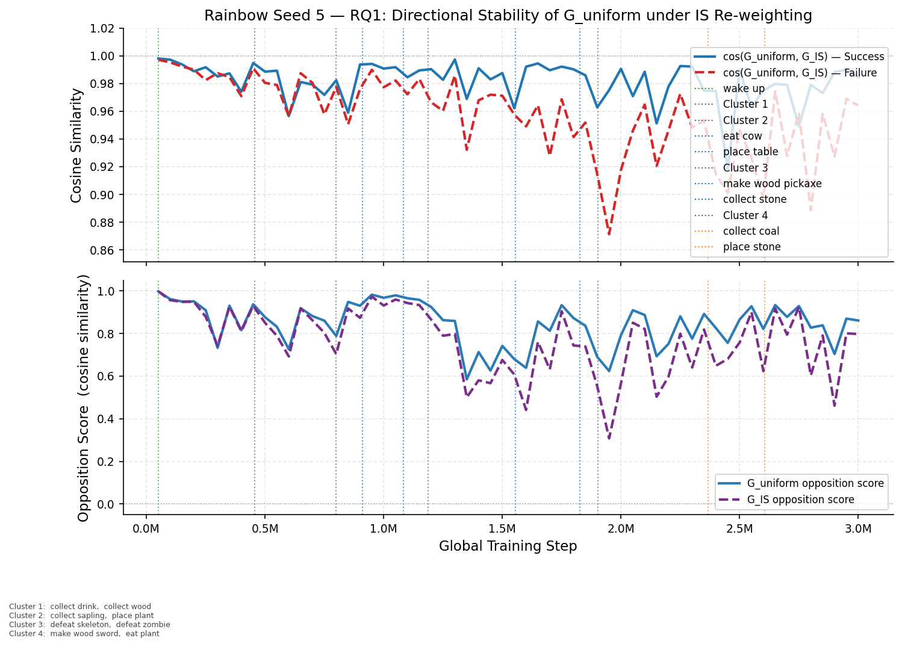
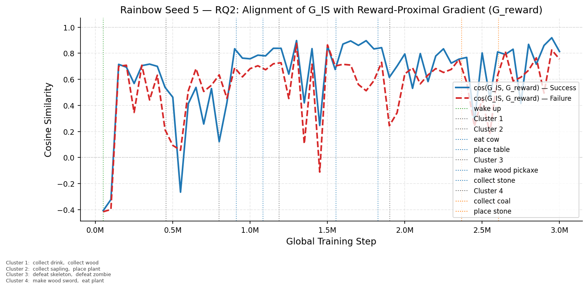
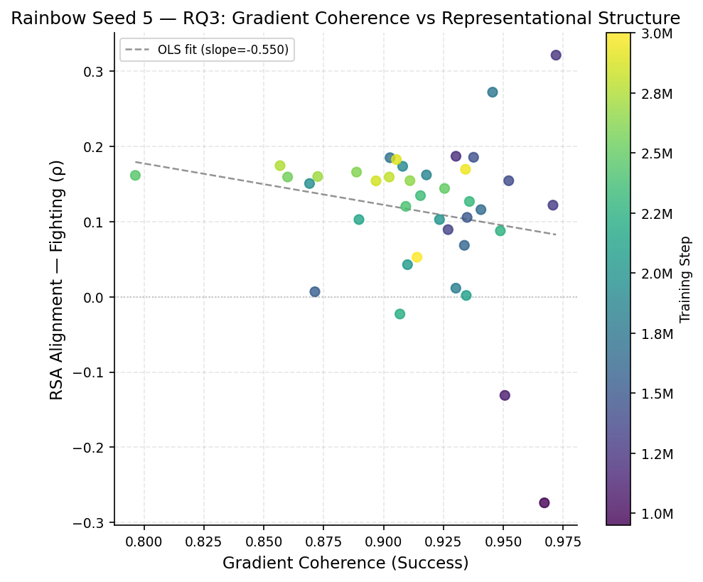
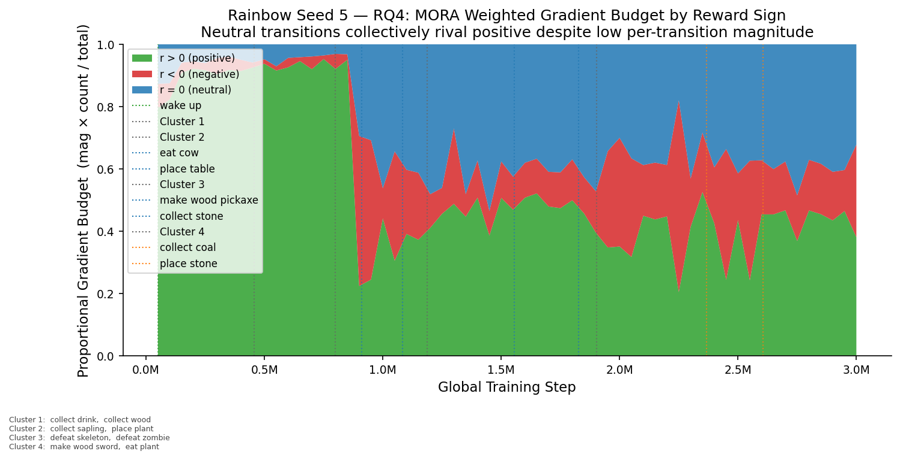
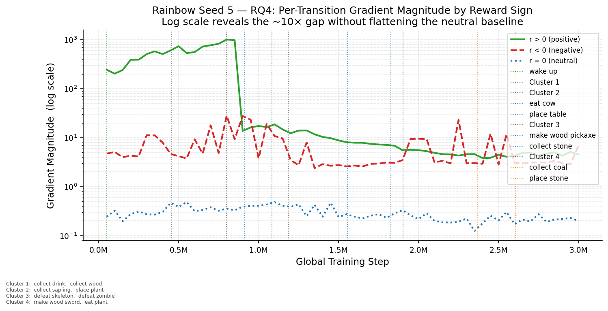
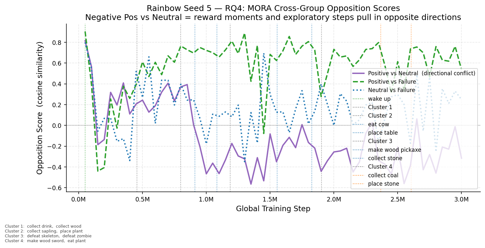
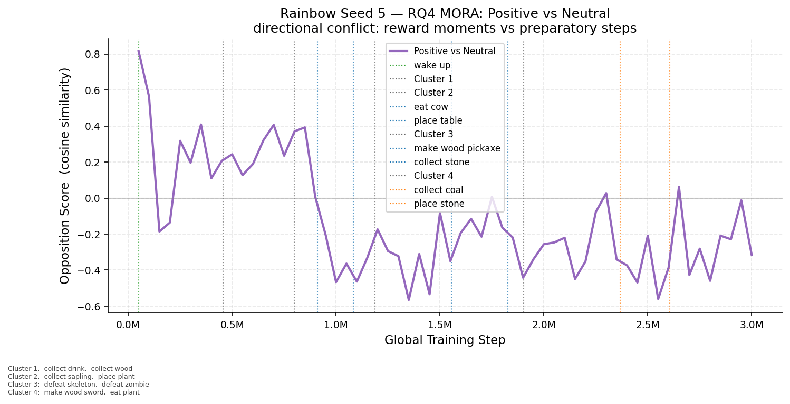
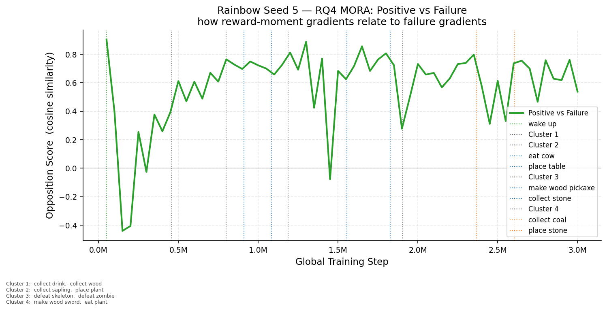
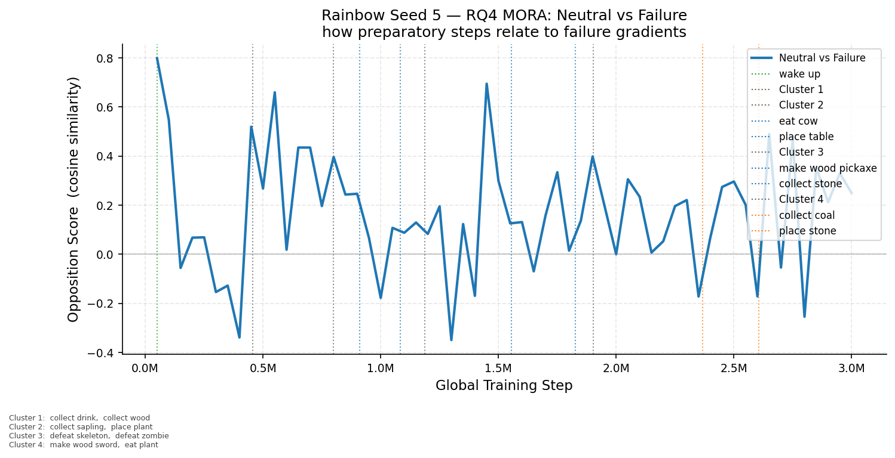

# Training & Analysis Report

**Environment:** `Crafter`  
**Seed:** 5  
**Total episodes:** 15,007  
**Experiment root:** `rainbow_experiment_root\seed_5`  
**Generated:** 2026-04-13 06:30

## Summary

| Checkpoint | Episodes | Opp. Score | Coh. (S) | Coh. (F) | Grad Mag (S) | Grad Mag (F) | Act. Sep. | Act. Cos. Dist. | RSA (ρ) |
|---|---:|---:|---:|---:|---:|---:|---:|---:|---:|
| wake_up @ ep1 | 1 | 0.9999 | 0.9959 | 0.9968 | 0.0464 | 0.0468 | 0.0076 | 0.0000 | — |
| Step 50,000 | 297 | 0.9984 | 0.9757 | 0.9836 | 0.2382 | 0.2332 | 0.1942 | 0.0003 | — |
| Step 100,000 | 588 | 0.9615 | 0.9827 | 0.8858 | 0.3281 | 0.3832 | 0.1801 | 0.0004 | — |
| Step 150,000 | 874 | 0.9503 | 0.9706 | 0.8822 | 0.1691 | 0.2041 | 0.1923 | 0.0006 | — |
| Step 200,000 | 1,150 | 0.9512 | 0.9762 | 0.8755 | 0.1795 | 0.2217 | 0.1738 | 0.0006 | — |
| Step 250,000 | 1,428 | 0.9093 | 0.9406 | 0.7947 | 0.2027 | 0.1997 | 0.1036 | 0.0002 | — |
| Step 300,000 | 1,703 | 0.7328 | 0.9704 | 0.8248 | 0.2175 | 0.2788 | 0.1350 | 0.0004 | — |
| Step 350,000 | 1,971 | 0.9309 | 0.9557 | 0.8198 | 0.2798 | 0.2800 | 0.1094 | 0.0003 | — |
| Step 400,000 | 2,240 | 0.8159 | 0.9390 | 0.7307 | 0.1698 | 0.1907 | 0.1030 | 0.0003 | — |
| collect_drink @ ep2451 | 2,451 | 0.8732 | 0.9177 | 0.8193 | 0.2361 | 0.2503 | 0.1502 | 0.0005 | — |
| Step 450,000 | 2,512 | 0.9375 | 0.9654 | 0.8344 | 0.3999 | 0.3621 | 0.1124 | 0.0003 | — |
| collect_wood @ ep2649 | 2,649 | 0.8719 | 0.9807 | 0.8471 | 0.3067 | 0.2952 | 0.0846 | 0.0002 | — |
| Step 500,000 | 2,778 | 0.8767 | 0.9483 | 0.7923 | 0.2659 | 0.2478 | 0.1211 | 0.0004 | — |
| Step 550,000 | 3,038 | 0.8318 | 0.9644 | 0.7314 | 0.2475 | 0.2177 | 0.0970 | 0.0003 | — |
| Step 600,000 | 3,304 | 0.7265 | 0.9690 | 0.7588 | 0.1595 | 0.1784 | 0.1122 | 0.0003 | — |
| Step 650,000 | 3,578 | 0.9187 | 0.9814 | 0.8871 | 0.2622 | 0.3511 | 0.1060 | 0.0003 | — |
| Step 700,000 | 3,843 | 0.8819 | 0.9677 | 0.8304 | 0.2215 | 0.2755 | 0.0880 | 0.0002 | — |
| Step 750,000 | 4,121 | 0.8605 | 0.9637 | 0.7640 | 0.1951 | 0.2058 | 0.1307 | 0.0005 | — |
| collect_sapling @ ep4357 | 4,357 | 0.8488 | 0.9754 | 0.8201 | 0.2569 | 0.2800 | 0.1358 | 0.0005 | — |
| Step 800,000 | 4,389 | 0.7887 | 0.9734 | 0.8083 | 0.2454 | 0.3213 | 0.1259 | 0.0004 | — |
| place_plant @ ep4407 | 4,407 | 0.6574 | 0.9496 | 0.7640 | 0.2388 | 0.3088 | 0.1239 | 0.0004 | — |
| Step 850,000 | 4,663 | 0.9486 | 0.9725 | 0.8255 | 0.2785 | 0.2897 | 0.1621 | 0.0007 | — |
| Step 900,000 | 4,931 | 0.9305 | 0.9839 | 0.8467 | 0.4811 | 0.3853 | 0.1827 | 0.0011 | — |
| eat_cow @ ep4991 | 4,991 | 0.8954 | 0.9676 | 0.8239 | 0.4689 | 0.3492 | 0.2079 | 0.0013 | — |
| Step 950,000 | 5,201 | 0.9827 | 0.9672 | 0.8584 | 0.6256 | 0.5088 | 0.1971 | 0.0011 | — |
| Step 1,000,000 | 5,464 | 0.9678 | 0.9701 | 0.8338 | 0.5439 | 0.5102 | 0.1268 | 0.0005 | — |
| Step 1,050,000 | 5,726 | 0.9795 | 0.9710 | 0.8825 | 0.6698 | 0.6439 | 0.1542 | 0.0007 | — |
| place_table @ ep5907 | 5,907 | 0.9551 | 0.9585 | 0.8714 | 0.6982 | 0.6111 | 0.0913 | 0.0002 | — |
| Step 1,100,000 | 5,992 | 0.9657 | 0.9507 | 0.8750 | 0.7303 | 0.6439 | 0.0768 | 0.0002 | — |
| Step 1,150,000 | 6,258 | 0.9584 | 0.9708 | 0.8748 | 0.5960 | 0.5155 | 0.1183 | 0.0004 | — |
| defeat_skeleton @ ep6452 | 6,452 | 0.9674 | 0.9419 | 0.8975 | 0.4849 | 0.4251 | 0.1751 | 0.0010 | — |
| defeat_zombie @ ep6463 | 6,463 | 0.9810 | 0.9582 | 0.9495 | 0.6633 | 0.6074 | 0.1507 | 0.0008 | — |
| Step 1,200,000 | 6,522 | 0.9250 | 0.9302 | 0.8593 | 0.5367 | 0.4350 | 0.2571 | 0.0022 | — |
| Step 1,250,000 | 6,785 | 0.8630 | 0.9720 | 0.9174 | 0.4907 | 0.3897 | 0.3605 | 0.0051 | — |
| Step 1,300,000 | 7,046 | 0.8590 | 0.9707 | 0.9225 | 0.5065 | 0.4561 | 0.3463 | 0.0054 | — |
| Step 1,350,000 | 7,306 | 0.5850 | 0.9269 | 0.8426 | 0.3334 | 0.2831 | 0.9197 | 0.0384 | — |
| Step 1,400,000 | 7,566 | 0.7129 | 0.9523 | 0.8750 | 0.3326 | 0.3657 | 1.5412 | 0.1029 | — |
| Step 1,450,000 | 7,844 | 0.6263 | 0.9376 | 0.8128 | 0.3445 | 0.5015 | 1.2392 | 0.0710 | — |
| Step 1,500,000 | 8,109 | 0.7419 | 0.9349 | 0.8277 | 0.3629 | 0.4614 | 1.4119 | 0.0971 | — |
| Step 1,550,000 | 8,365 | 0.6802 | 0.8713 | 0.8626 | 0.2524 | 0.4122 | 1.1516 | 0.0653 | — |
| make_wood_pickaxe @ ep8391 | 8,391 | 0.7315 | 0.9279 | 0.8592 | 0.3424 | 0.3753 | 1.0937 | 0.0563 | — |
| Step 1,600,000 | 8,635 | 0.6390 | 0.9337 | 0.8086 | 0.3176 | 0.2976 | 0.9499 | 0.0414 | — |
| Step 1,650,000 | 8,901 | 0.8570 | 0.9407 | 0.8268 | 0.3776 | 0.3143 | 0.7122 | 0.0254 | — |
| Step 1,700,000 | 9,147 | 0.8129 | 0.9027 | 0.7576 | 0.3272 | 0.2921 | 0.7325 | 0.0260 | — |
| Step 1,750,000 | 9,398 | 0.9335 | 0.9455 | 0.8460 | 0.4593 | 0.3470 | 0.6326 | 0.0216 | — |
| Step 1,800,000 | 9,648 | 0.8723 | 0.9302 | 0.8192 | 0.3380 | 0.2816 | 0.4367 | 0.0103 | — |
| collect_stone @ ep9776 | 9,776 | 0.9085 | 0.9431 | 0.8122 | 0.4195 | 0.2913 | 0.3589 | 0.0070 | — |
| Step 1,850,000 | 9,896 | 0.8367 | 0.9179 | 0.8448 | 0.3301 | 0.3238 | 0.3256 | 0.0060 | — |
| Step 1,900,000 | 10,143 | 0.6904 | 0.9080 | 0.7873 | 0.2801 | 0.2659 | 0.3568 | 0.0075 | — |
| make_wood_sword @ ep10149 | 10,149 | 0.7162 | 0.8718 | 0.8510 | 0.2430 | 0.3218 | 0.3358 | 0.0064 | — |
| eat_plant @ ep10166 | 10,166 | 0.7512 | 0.9181 | 0.7677 | 0.3424 | 0.2581 | 0.3360 | 0.0063 | — |
| Step 1,950,000 | 10,392 | 0.6241 | 0.8691 | 0.7052 | 0.2453 | 0.2466 | 0.3687 | 0.0081 | — |
| Step 2,000,000 | 10,635 | 0.7928 | 0.9233 | 0.7258 | 0.2650 | 0.2328 | 0.3756 | 0.0084 | — |
| Step 2,050,000 | 10,866 | 0.9097 | 0.9100 | 0.7961 | 0.2595 | 0.3398 | 0.3292 | 0.0064 | — |
| Step 2,100,000 | 11,098 | 0.8872 | 0.9345 | 0.7693 | 0.3136 | 0.2521 | 0.3317 | 0.0071 | — |
| Step 2,150,000 | 11,327 | 0.6932 | 0.8897 | 0.7205 | 0.1983 | 0.2441 | 0.2971 | 0.0054 | — |
| Step 2,200,000 | 11,555 | 0.7513 | 0.9068 | 0.7467 | 0.1927 | 0.2424 | 0.3280 | 0.0070 | — |
| Step 2,250,000 | 11,779 | 0.8807 | 0.9488 | 0.7474 | 0.3092 | 0.2586 | 0.3726 | 0.0084 | — |
| Step 2,300,000 | 12,004 | 0.7760 | 0.9359 | 0.7633 | 0.3784 | 0.2630 | 0.3526 | 0.0077 | — |
| Step 2,350,000 | 12,235 | 0.8923 | 0.9154 | 0.7896 | 0.2511 | 0.2712 | 0.3919 | 0.0096 | — |
| collect_coal @ ep12311 | 12,311 | 0.8335 | 0.8920 | 0.6844 | 0.2135 | 0.1843 | 0.3667 | 0.0085 | — |
| Step 2,400,000 | 12,455 | 0.8258 | 0.9093 | 0.7523 | 0.1880 | 0.1834 | 0.3110 | 0.0064 | — |
| Step 2,450,000 | 12,669 | 0.7562 | 0.7964 | 0.6736 | 0.1340 | 0.1826 | 0.3693 | 0.0081 | — |
| Step 2,500,000 | 12,882 | 0.8657 | 0.9255 | 0.7409 | 0.2846 | 0.2436 | 0.3433 | 0.0071 | — |
| Step 2,550,000 | 13,097 | 0.9281 | 0.8599 | 0.6833 | 0.2272 | 0.1932 | 0.2912 | 0.0050 | — |
| Step 2,600,000 | 13,310 | 0.8216 | 0.8887 | 0.7089 | 0.1952 | 0.1700 | 0.3691 | 0.0079 | — |
| place_stone @ ep13337 | 13,337 | 0.8989 | 0.9170 | 0.7306 | 0.2745 | 0.2358 | 0.3830 | 0.0087 | — |
| Step 2,650,000 | 13,524 | 0.9339 | 0.9110 | 0.8201 | 0.3254 | 0.3953 | 0.3740 | 0.0079 | — |
| Step 2,700,000 | 13,733 | 0.8781 | 0.8725 | 0.6856 | 0.2512 | 0.2058 | 0.4378 | 0.0104 | — |
| Step 2,750,000 | 13,947 | 0.9292 | 0.8568 | 0.7401 | 0.2644 | 0.3175 | 0.3711 | 0.0076 | — |
| Step 2,800,000 | 14,159 | 0.8276 | 0.9024 | 0.7112 | 0.2299 | 0.1906 | 0.4607 | 0.0109 | — |
| Step 2,850,000 | 14,366 | 0.8388 | 0.8969 | 0.7523 | 0.2784 | 0.3533 | 0.4589 | 0.0113 | — |
| Step 2,900,000 | 14,580 | 0.7041 | 0.9054 | 0.6637 | 0.2522 | 0.2055 | 0.4735 | 0.0117 | — |
| Step 2,950,000 | 14,791 | 0.8702 | 0.9342 | 0.7674 | 0.3399 | 0.3298 | 0.5282 | 0.0144 | — |
| Step 3,000,000 | 15,007 | 0.8612 | 0.9140 | 0.7033 | 0.3080 | 0.3637 | 0.7215 | 0.0263 | — |

---

## Longitudinal Analysis

### RQ1 — Directional Stability: cos(G_uniform, G_IS) and Opposition Score

*Top panel: cosine similarity between G_uniform and G_IS for success/failure groups (expected ~0.97–1.0 throughout). Bottom panel: opposition score under both weightings — G_IS tracks G_uniform closely, confirming IS re-weighting does not substantially redirect gradient direction.*

### RQ2 — PER Directional Influence: cos(G_IS, G_reward)

*Alignment between the IS-weighted gradient and the reward-proximal gradient proxy. High values indicate PER tends to up-weight reward-proximal transitions; variance across training reflects inconsistency of this alignment.*

### RQ3 — Coherence vs Representational Structure (Scatter)

*Each point is one periodic checkpoint. Colour encodes training stage (early=dark, late=bright). A positive slope would support the RQ3 prediction that high gradient coherence predicts better semantic structure. Weak/absent correlation is itself informative.*

### RQ4 — MORA: Weighted Gradient Budget by Reward Sign

*Proportional gradient contribution = gradient_magnitude × n_transitions, normalised to sum to 1. Resolves the scale problem: despite ~5–10× higher per-transition magnitude, positive transitions do not overwhelmingly dominate because neutral transitions vastly outnumber them.*

### RQ4 — MORA: Per-Transition Gradient Magnitude (Log Scale)

*Log y-axis makes the 5–10× gap between positive and neutral per-transition magnitudes readable without flattening the neutral baseline. Negative transitions sit in between.*

### RQ4 — MORA: Cross-Group Opposition Scores

*Three pairwise comparisons: Positive vs Neutral (directional conflict — persistently negative means reward moments and exploratory steps push the network in opposite directions); Positive vs Failure; Neutral vs Failure.*

### rq4_mora_opposition_separate_rq4_mora_opp_opp_pos_vs_neutral_seed5

**

### rq4_mora_opposition_separate_rq4_mora_opp_opp_pos_vs_failure_seed5

**

### rq4_mora_opposition_separate_rq4_mora_opp_opp_neutral_vs_failure_seed5

**

---

## wake_up_ep1_lower0.000_upper0.000

### Metrics

| Metric | Value |
|---|---|
| Opposition Score | 0.9999 |
| Coherence (Success) | 0.9959 |
| Coherence (Failure) | 0.9968 |
| Gradient Magnitude (Success) | 0.0464 |
| Gradient Magnitude (Failure) | 0.0468 |
| Activation Separation | 0.0076 |
| Cosine Distance | 0.0000 |
| Clusters | 1,908 |
| Noise Fraction | 0.1032 |
| RSA Alignment (ρ) | — |
| RSA Stimuli (3) | Place Plant, Sapling, Wake Up |

### Gradient Variant Analysis (RQ1 / RQ2)

| Variant | Opp. Score | Coh. (S) | Coh. (F) | Grad Mag (S) | Grad Mag (F) |
|---|---:|---:|---:|---:|---:|
| G_uniform | 0.9999 | 0.9959 | 0.9968 | 0.0464 | 0.0468 |
| G_IS (β=0.400) | 0.9999 | 0.9959 | 0.9968 | 0.0463 | 0.0467 |

| Directional Alignment | Success | Failure |
|---|---:|---:|
| cos(G_uniform, G_IS) | 1.0001 | 1.0000 |
| cos(G_IS, G_reward)  | 0.7835 | 0.7949 |

### Moment of Reward (Rainbow)

| Subgroup | N transitions | Grad Mag | Coherence |
|---|---:|---:|---:|
| Positive (r > 0) | 192 | 0.4471 | 0.9693 |
| Neutral  (r = 0) | 41,304 | 0.0467 | 0.9982 |
| Negative (r < 0) | 1,300 | 0.6814 | 0.9979 |

| Comparison | Opp. Score |
|---|---:|
| Pos vs Neutral   | 0.4430 |
| Pos vs Negative  | 0.2087 |
| Neutral vs Neg.  | 0.2150 |
| Pos vs Failure   | 0.4582 |
| Neutral vs Fail. | 0.9253 |
| Neg. vs Failure  | 0.5183 |

---

## ep297_lower0.000_upper0.000

### Metrics

| Metric | Value |
|---|---|
| Opposition Score | 0.9984 |
| Coherence (Success) | 0.9757 |
| Coherence (Failure) | 0.9836 |
| Gradient Magnitude (Success) | 0.2382 |
| Gradient Magnitude (Failure) | 0.2332 |
| Activation Separation | 0.1942 |
| Cosine Distance | 0.0003 |
| Clusters | 1,558 |
| Noise Fraction | 0.1469 |
| RSA Alignment (ρ) | — |
| RSA Stimuli (2) | Sapling, Wake Up |

### Gradient Variant Analysis (RQ1 / RQ2)

| Variant | Opp. Score | Coh. (S) | Coh. (F) | Grad Mag (S) | Grad Mag (F) |
|---|---:|---:|---:|---:|---:|
| G_uniform | 0.9984 | 0.9757 | 0.9836 | 0.2382 | 0.2332 |
| G_IS (β=0.406) | 0.9976 | 0.9657 | 0.9781 | 0.1578 | 0.1538 |

| Directional Alignment | Success | Failure |
|---|---:|---:|
| cos(G_uniform, G_IS) | 0.9980 | 0.9971 |
| cos(G_IS, G_reward)  | -0.4076 | -0.4160 |

### Moment of Reward (Rainbow)

| Subgroup | N transitions | Grad Mag | Coherence |
|---|---:|---:|---:|
| Positive (r > 0) | 254 | 245.4544 | 0.8316 |
| Neutral  (r = 0) | 41,226 | 0.2413 | 0.9884 |
| Negative (r < 0) | 1,301 | 4.7266 | 0.9942 |

| Comparison | Opp. Score |
|---|---:|
| Pos vs Neutral   | 0.8146 |
| Pos vs Negative  | -0.7825 |
| Neutral vs Neg.  | -0.9378 |
| Pos vs Failure   | 0.9034 |
| Neutral vs Fail. | 0.7984 |
| Neg. vs Failure  | -0.6694 |

---

## ep588_lower1.000_upper1.000

### Metrics

| Metric | Value |
|---|---|
| Opposition Score | 0.9615 |
| Coherence (Success) | 0.9827 |
| Coherence (Failure) | 0.8858 |
| Gradient Magnitude (Success) | 0.3281 |
| Gradient Magnitude (Failure) | 0.3832 |
| Activation Separation | 0.1801 |
| Cosine Distance | 0.0004 |
| Clusters | 1,650 |
| Noise Fraction | 0.1323 |
| RSA Alignment (ρ) | — |
| RSA Stimuli (3) | Place Plant, Sapling, Wake Up |

### Gradient Variant Analysis (RQ1 / RQ2)

| Variant | Opp. Score | Coh. (S) | Coh. (F) | Grad Mag (S) | Grad Mag (F) |
|---|---:|---:|---:|---:|---:|
| G_uniform | 0.9615 | 0.9827 | 0.8858 | 0.3281 | 0.3832 |
| G_IS (β=0.416) | 0.9566 | 0.9793 | 0.8739 | 0.2232 | 0.2602 |

| Directional Alignment | Success | Failure |
|---|---:|---:|
| cos(G_uniform, G_IS) | 0.9972 | 0.9952 |
| cos(G_IS, G_reward)  | -0.3226 | -0.3988 |

| Weight-Delta Alignment | Success | Failure |
|---|---:|---:|
| cos(G_uniform, Δθ) | 0.0391 | 0.0461 |
| cos(G_IS, Δθ)      | 0.0397 | 0.0460 |
| cos(G_reward, Δθ)  | -0.0414 | -0.0246 |

### Moment of Reward (Rainbow)

| Subgroup | N transitions | Grad Mag | Coherence |
|---|---:|---:|---:|
| Positive (r > 0) | 428 | 203.6131 | 0.9997 |
| Neutral  (r = 0) | 41,276 | 0.3209 | 0.9919 |
| Negative (r < 0) | 1,070 | 5.0975 | 0.9674 |

| Comparison | Opp. Score |
|---|---:|
| Pos vs Neutral   | 0.5640 |
| Pos vs Negative  | -0.6123 |
| Neutral vs Neg.  | -0.9414 |
| Pos vs Failure   | 0.3946 |
| Neutral vs Fail. | 0.5471 |
| Neg. vs Failure  | -0.3718 |

---

## ep874_lower1.000_upper1.000

### Metrics

| Metric | Value |
|---|---|
| Opposition Score | 0.9503 |
| Coherence (Success) | 0.9706 |
| Coherence (Failure) | 0.8822 |
| Gradient Magnitude (Success) | 0.1691 |
| Gradient Magnitude (Failure) | 0.2041 |
| Activation Separation | 0.1923 |
| Cosine Distance | 0.0006 |
| Clusters | 1,767 |
| Noise Fraction | 0.1441 |
| RSA Alignment (ρ) | — |
| RSA Stimuli (1) | Wake Up |

### Gradient Variant Analysis (RQ1 / RQ2)

| Variant | Opp. Score | Coh. (S) | Coh. (F) | Grad Mag (S) | Grad Mag (F) |
|---|---:|---:|---:|---:|---:|
| G_uniform | 0.9503 | 0.9706 | 0.8822 | 0.1691 | 0.2041 |
| G_IS (β=0.426) | 0.9487 | 0.9748 | 0.8849 | 0.1365 | 0.1631 |

| Directional Alignment | Success | Failure |
|---|---:|---:|
| cos(G_uniform, G_IS) | 0.9938 | 0.9922 |
| cos(G_IS, G_reward)  | 0.7148 | 0.7002 |

| Weight-Delta Alignment | Success | Failure |
|---|---:|---:|
| cos(G_uniform, Δθ) | -0.0115 | -0.0069 |
| cos(G_IS, Δθ)      | -0.0114 | -0.0076 |
| cos(G_reward, Δθ)  | -0.0251 | -0.0099 |

### Moment of Reward (Rainbow)

| Subgroup | N transitions | Grad Mag | Coherence |
|---|---:|---:|---:|
| Positive (r > 0) | 544 | 241.9843 | 0.9775 |
| Neutral  (r = 0) | 43,670 | 0.1957 | 0.9930 |
| Negative (r < 0) | 1,174 | 3.9691 | 0.5204 |

| Comparison | Opp. Score |
|---|---:|
| Pos vs Neutral   | -0.1858 |
| Pos vs Negative  | 0.5495 |
| Neutral vs Neg.  | -0.6318 |
| Pos vs Failure   | -0.4407 |
| Neutral vs Fail. | -0.0557 |
| Neg. vs Failure  | 0.2055 |

---

## ep1150_lower1.000_upper1.000

### Metrics

| Metric | Value |
|---|---|
| Opposition Score | 0.9512 |
| Coherence (Success) | 0.9762 |
| Coherence (Failure) | 0.8755 |
| Gradient Magnitude (Success) | 0.1795 |
| Gradient Magnitude (Failure) | 0.2217 |
| Activation Separation | 0.1738 |
| Cosine Distance | 0.0006 |
| Clusters | 1,798 |
| Noise Fraction | 0.1354 |
| RSA Alignment (ρ) | — |
| RSA Stimuli (3) | Sapling, Wake Up, Wood |

### Gradient Variant Analysis (RQ1 / RQ2)

| Variant | Opp. Score | Coh. (S) | Coh. (F) | Grad Mag (S) | Grad Mag (F) |
|---|---:|---:|---:|---:|---:|
| G_uniform | 0.9512 | 0.9762 | 0.8755 | 0.1795 | 0.2217 |
| G_IS (β=0.436) | 0.9491 | 0.9802 | 0.8804 | 0.1381 | 0.1723 |

| Directional Alignment | Success | Failure |
|---|---:|---:|
| cos(G_uniform, G_IS) | 0.9888 | 0.9900 |
| cos(G_IS, G_reward)  | 0.6934 | 0.7081 |

| Weight-Delta Alignment | Success | Failure |
|---|---:|---:|
| cos(G_uniform, Δθ) | -0.0370 | -0.0268 |
| cos(G_IS, Δθ)      | -0.0339 | -0.0247 |
| cos(G_reward, Δθ)  | -0.0268 | -0.0100 |

### Moment of Reward (Rainbow)

| Subgroup | N transitions | Grad Mag | Coherence |
|---|---:|---:|---:|
| Positive (r > 0) | 521 | 391.2874 | 0.9997 |
| Neutral  (r = 0) | 44,192 | 0.2736 | 0.9954 |
| Negative (r < 0) | 1,215 | 4.3002 | 0.9864 |

| Comparison | Opp. Score |
|---|---:|
| Pos vs Neutral   | -0.1363 |
| Pos vs Negative  | -0.4017 |
| Neutral vs Neg.  | -0.6148 |
| Pos vs Failure   | -0.4059 |
| Neutral vs Fail. | 0.0675 |
| Neg. vs Failure  | 0.6074 |

---

## ep1428_lower1.000_upper1.000

### Metrics

| Metric | Value |
|---|---|
| Opposition Score | 0.9093 |
| Coherence (Success) | 0.9406 |
| Coherence (Failure) | 0.7947 |
| Gradient Magnitude (Success) | 0.2027 |
| Gradient Magnitude (Failure) | 0.1997 |
| Activation Separation | 0.1036 |
| Cosine Distance | 0.0002 |
| Clusters | 1,935 |
| Noise Fraction | 0.1703 |
| RSA Alignment (ρ) | — |
| RSA Stimuli (5) | Drink, Place Plant, Sapling, Wake Up, Wood |

### Gradient Variant Analysis (RQ1 / RQ2)

| Variant | Opp. Score | Coh. (S) | Coh. (F) | Grad Mag (S) | Grad Mag (F) |
|---|---:|---:|---:|---:|---:|
| G_uniform | 0.9093 | 0.9406 | 0.7947 | 0.2027 | 0.1997 |
| G_IS (β=0.446) | 0.8786 | 0.9333 | 0.7807 | 0.1379 | 0.1380 |

| Directional Alignment | Success | Failure |
|---|---:|---:|
| cos(G_uniform, G_IS) | 0.9917 | 0.9824 |
| cos(G_IS, G_reward)  | 0.5680 | 0.3460 |

| Weight-Delta Alignment | Success | Failure |
|---|---:|---:|
| cos(G_uniform, Δθ) | 0.0081 | 0.0118 |
| cos(G_IS, Δθ)      | 0.0065 | 0.0095 |
| cos(G_reward, Δθ)  | -0.0146 | -0.0037 |

### Moment of Reward (Rainbow)

| Subgroup | N transitions | Grad Mag | Coherence |
|---|---:|---:|---:|
| Positive (r > 0) | 539 | 393.1014 | 0.9996 |
| Neutral  (r = 0) | 45,106 | 0.3083 | 0.9886 |
| Negative (r < 0) | 1,270 | 4.1289 | 0.9655 |

| Comparison | Opp. Score |
|---|---:|
| Pos vs Neutral   | 0.3180 |
| Pos vs Negative  | -0.2461 |
| Neutral vs Neg.  | -0.8144 |
| Pos vs Failure   | 0.2541 |
| Neutral vs Fail. | 0.0689 |
| Neg. vs Failure  | 0.4093 |

---

## ep1703_lower1.000_upper1.000

### Metrics

| Metric | Value |
|---|---|
| Opposition Score | 0.7328 |
| Coherence (Success) | 0.9704 |
| Coherence (Failure) | 0.8248 |
| Gradient Magnitude (Success) | 0.2175 |
| Gradient Magnitude (Failure) | 0.2788 |
| Activation Separation | 0.1350 |
| Cosine Distance | 0.0004 |
| Clusters | 1,883 |
| Noise Fraction | 0.1563 |
| RSA Alignment (ρ) | — |
| RSA Stimuli (3) | Place Plant, Sapling, Wake Up |

### Gradient Variant Analysis (RQ1 / RQ2)

| Variant | Opp. Score | Coh. (S) | Coh. (F) | Grad Mag (S) | Grad Mag (F) |
|---|---:|---:|---:|---:|---:|
| G_uniform | 0.7328 | 0.9704 | 0.8248 | 0.2175 | 0.2788 |
| G_IS (β=0.456) | 0.7427 | 0.9726 | 0.8336 | 0.1576 | 0.2058 |

| Directional Alignment | Success | Failure |
|---|---:|---:|
| cos(G_uniform, G_IS) | 0.9850 | 0.9874 |
| cos(G_IS, G_reward)  | 0.7051 | 0.7078 |

| Weight-Delta Alignment | Success | Failure |
|---|---:|---:|
| cos(G_uniform, Δθ) | 0.0093 | 0.0077 |
| cos(G_IS, Δθ)      | 0.0080 | 0.0061 |
| cos(G_reward, Δθ)  | -0.0041 | -0.0029 |

### Moment of Reward (Rainbow)

| Subgroup | N transitions | Grad Mag | Coherence |
|---|---:|---:|---:|
| Positive (r > 0) | 483 | 512.3340 | 0.9999 |
| Neutral  (r = 0) | 44,334 | 0.2718 | 0.9906 |
| Negative (r < 0) | 1,262 | 11.2196 | 0.6182 |

| Comparison | Opp. Score |
|---|---:|
| Pos vs Neutral   | 0.1960 |
| Pos vs Negative  | 0.8507 |
| Neutral vs Neg.  | -0.1766 |
| Pos vs Failure   | -0.0266 |
| Neutral vs Fail. | -0.1540 |
| Neg. vs Failure  | 0.0315 |

---

## ep1971_lower1.000_upper1.000

### Metrics

| Metric | Value |
|---|---|
| Opposition Score | 0.9309 |
| Coherence (Success) | 0.9557 |
| Coherence (Failure) | 0.8198 |
| Gradient Magnitude (Success) | 0.2798 |
| Gradient Magnitude (Failure) | 0.2800 |
| Activation Separation | 0.1094 |
| Cosine Distance | 0.0003 |
| Clusters | 2,309 |
| Noise Fraction | 0.1338 |
| RSA Alignment (ρ) | — |
| RSA Stimuli (4) | Drink, Sapling, Wake Up, Wood |

### Gradient Variant Analysis (RQ1 / RQ2)

| Variant | Opp. Score | Coh. (S) | Coh. (F) | Grad Mag (S) | Grad Mag (F) |
|---|---:|---:|---:|---:|---:|
| G_uniform | 0.9309 | 0.9557 | 0.8198 | 0.2798 | 0.2800 |
| G_IS (β=0.466) | 0.9259 | 0.9524 | 0.8175 | 0.2069 | 0.2115 |

| Directional Alignment | Success | Failure |
|---|---:|---:|
| cos(G_uniform, G_IS) | 0.9873 | 0.9845 |
| cos(G_IS, G_reward)  | 0.7167 | 0.4418 |

| Weight-Delta Alignment | Success | Failure |
|---|---:|---:|
| cos(G_uniform, Δθ) | 0.0231 | 0.0231 |
| cos(G_IS, Δθ)      | 0.0217 | 0.0213 |
| cos(G_reward, Δθ)  | -0.0019 | -0.0064 |

### Moment of Reward (Rainbow)

| Subgroup | N transitions | Grad Mag | Coherence |
|---|---:|---:|---:|
| Positive (r > 0) | 477 | 582.5393 | 0.9998 |
| Neutral  (r = 0) | 45,017 | 0.2669 | 0.9747 |
| Negative (r < 0) | 1,155 | 11.1375 | 0.6869 |

| Comparison | Opp. Score |
|---|---:|
| Pos vs Neutral   | 0.4085 |
| Pos vs Negative  | 0.3877 |
| Neutral vs Neg.  | -0.2421 |
| Pos vs Failure   | 0.3765 |
| Neutral vs Fail. | -0.1277 |
| Neg. vs Failure  | 0.6226 |

---

## ep2240_lower1.000_upper1.000

### Metrics

| Metric | Value |
|---|---|
| Opposition Score | 0.8159 |
| Coherence (Success) | 0.9390 |
| Coherence (Failure) | 0.7307 |
| Gradient Magnitude (Success) | 0.1698 |
| Gradient Magnitude (Failure) | 0.1907 |
| Activation Separation | 0.1030 |
| Cosine Distance | 0.0003 |
| Clusters | 2,180 |
| Noise Fraction | 0.1561 |
| RSA Alignment (ρ) | — |
| RSA Stimuli (3) | Drink, Wake Up, Wood |

### Gradient Variant Analysis (RQ1 / RQ2)

| Variant | Opp. Score | Coh. (S) | Coh. (F) | Grad Mag (S) | Grad Mag (F) |
|---|---:|---:|---:|---:|---:|
| G_uniform | 0.8159 | 0.9390 | 0.7307 | 0.1698 | 0.1907 |
| G_IS (β=0.477) | 0.8108 | 0.9423 | 0.7617 | 0.1228 | 0.1442 |

| Directional Alignment | Success | Failure |
|---|---:|---:|
| cos(G_uniform, G_IS) | 0.9740 | 0.9709 |
| cos(G_IS, G_reward)  | 0.6997 | 0.6314 |

| Weight-Delta Alignment | Success | Failure |
|---|---:|---:|
| cos(G_uniform, Δθ) | -0.0080 | 0.0017 |
| cos(G_IS, Δθ)      | -0.0103 | -0.0008 |
| cos(G_reward, Δθ)  | -0.0093 | 0.0035 |

### Moment of Reward (Rainbow)

| Subgroup | N transitions | Grad Mag | Coherence |
|---|---:|---:|---:|
| Positive (r > 0) | 514 | 512.0001 | 0.9999 |
| Neutral  (r = 0) | 46,998 | 0.3034 | 0.9925 |
| Negative (r < 0) | 1,311 | 7.9437 | 0.7048 |

| Comparison | Opp. Score |
|---|---:|
| Pos vs Neutral   | 0.1097 |
| Pos vs Negative  | 0.8111 |
| Neutral vs Neg.  | -0.4298 |
| Pos vs Failure   | 0.2591 |
| Neutral vs Fail. | -0.3389 |
| Neg. vs Failure  | 0.5176 |

---

## collect_drink_ep2451_lower1.000_upper1.000

### Metrics

| Metric | Value |
|---|---|
| Opposition Score | 0.8732 |
| Coherence (Success) | 0.9177 |
| Coherence (Failure) | 0.8193 |
| Gradient Magnitude (Success) | 0.2361 |
| Gradient Magnitude (Failure) | 0.2503 |
| Activation Separation | 0.1502 |
| Cosine Distance | 0.0005 |
| Clusters | 2,211 |
| Noise Fraction | 0.1608 |
| RSA Alignment (ρ) | — |
| RSA Stimuli (6) | Drink, Place Plant, Sapling, Wake Up, Wood, Zombie |

### Gradient Variant Analysis (RQ1 / RQ2)

| Variant | Opp. Score | Coh. (S) | Coh. (F) | Grad Mag (S) | Grad Mag (F) |
|---|---:|---:|---:|---:|---:|
| G_uniform | 0.8732 | 0.9177 | 0.8193 | 0.2361 | 0.2503 |
| G_IS (β=0.484) | 0.8700 | 0.9214 | 0.8193 | 0.1625 | 0.1805 |

| Directional Alignment | Success | Failure |
|---|---:|---:|
| cos(G_uniform, G_IS) | 0.9832 | 0.9805 |
| cos(G_IS, G_reward)  | 0.7864 | 0.5469 |

| Weight-Delta Alignment | Success | Failure |
|---|---:|---:|
| cos(G_uniform, Δθ) | 0.0167 | 0.0120 |
| cos(G_IS, Δθ)      | 0.0148 | 0.0089 |
| cos(G_reward, Δθ)  | 0.0038 | -0.0120 |

### Moment of Reward (Rainbow)

| Subgroup | N transitions | Grad Mag | Coherence |
|---|---:|---:|---:|
| Positive (r > 0) | 506 | 642.1572 | 0.9998 |
| Neutral  (r = 0) | 47,466 | 0.2861 | 0.9877 |
| Negative (r < 0) | 1,327 | 4.4734 | 0.9756 |

| Comparison | Opp. Score |
|---|---:|
| Pos vs Neutral   | 0.1842 |
| Pos vs Negative  | -0.0269 |
| Neutral vs Neg.  | -0.8066 |
| Pos vs Failure   | 0.4260 |
| Neutral vs Fail. | -0.1811 |
| Neg. vs Failure  | 0.5764 |

---

## ep2512_lower1.000_upper1.000

### Metrics

| Metric | Value |
|---|---|
| Opposition Score | 0.9375 |
| Coherence (Success) | 0.9654 |
| Coherence (Failure) | 0.8344 |
| Gradient Magnitude (Success) | 0.3999 |
| Gradient Magnitude (Failure) | 0.3621 |
| Activation Separation | 0.1124 |
| Cosine Distance | 0.0003 |
| Clusters | 2,128 |
| Noise Fraction | 0.1466 |
| RSA Alignment (ρ) | — |
| RSA Stimuli (6) | Drink, Eat Cow, Place Plant, Sapling, Wake Up, Zombie |

### Gradient Variant Analysis (RQ1 / RQ2)

| Variant | Opp. Score | Coh. (S) | Coh. (F) | Grad Mag (S) | Grad Mag (F) |
|---|---:|---:|---:|---:|---:|
| G_uniform | 0.9375 | 0.9654 | 0.8344 | 0.3999 | 0.3621 |
| G_IS (β=0.487) | 0.9300 | 0.9649 | 0.8264 | 0.2793 | 0.2568 |

| Directional Alignment | Success | Failure |
|---|---:|---:|
| cos(G_uniform, G_IS) | 0.9947 | 0.9910 |
| cos(G_IS, G_reward)  | 0.5380 | 0.2132 |

| Weight-Delta Alignment | Success | Failure |
|---|---:|---:|
| cos(G_uniform, Δθ) | 0.0172 | 0.0183 |
| cos(G_IS, Δθ)      | 0.0159 | 0.0160 |
| cos(G_reward, Δθ)  | 0.0023 | -0.0079 |

### Moment of Reward (Rainbow)

| Subgroup | N transitions | Grad Mag | Coherence |
|---|---:|---:|---:|
| Positive (r > 0) | 549 | 608.3575 | 0.9998 |
| Neutral  (r = 0) | 45,648 | 0.4634 | 0.9923 |
| Negative (r < 0) | 1,240 | 4.6474 | 0.9714 |

| Comparison | Opp. Score |
|---|---:|
| Pos vs Neutral   | 0.2061 |
| Pos vs Negative  | -0.0588 |
| Neutral vs Neg.  | -0.5627 |
| Pos vs Failure   | 0.3935 |
| Neutral vs Fail. | 0.5193 |
| Neg. vs Failure  | 0.3110 |

---

## collect_wood_ep2649_lower1.000_upper1.000

### Metrics

| Metric | Value |
|---|---|
| Opposition Score | 0.8719 |
| Coherence (Success) | 0.9807 |
| Coherence (Failure) | 0.8471 |
| Gradient Magnitude (Success) | 0.3067 |
| Gradient Magnitude (Failure) | 0.2952 |
| Activation Separation | 0.0846 |
| Cosine Distance | 0.0002 |
| Clusters | 2,150 |
| Noise Fraction | 0.1555 |
| RSA Alignment (ρ) | — |
| RSA Stimuli (3) | Sapling, Wake Up, Wood |

### Gradient Variant Analysis (RQ1 / RQ2)

| Variant | Opp. Score | Coh. (S) | Coh. (F) | Grad Mag (S) | Grad Mag (F) |
|---|---:|---:|---:|---:|---:|
| G_uniform | 0.8719 | 0.9807 | 0.8471 | 0.3067 | 0.2952 |
| G_IS (β=0.492) | 0.8612 | 0.9822 | 0.8416 | 0.2134 | 0.2072 |

| Directional Alignment | Success | Failure |
|---|---:|---:|
| cos(G_uniform, G_IS) | 0.9896 | 0.9859 |
| cos(G_IS, G_reward)  | 0.8233 | 0.4105 |

| Weight-Delta Alignment | Success | Failure |
|---|---:|---:|
| cos(G_uniform, Δθ) | 0.0129 | 0.0194 |
| cos(G_IS, Δθ)      | 0.0103 | 0.0163 |
| cos(G_reward, Δθ)  | -0.0066 | -0.0013 |

### Moment of Reward (Rainbow)

| Subgroup | N transitions | Grad Mag | Coherence |
|---|---:|---:|---:|
| Positive (r > 0) | 513 | 561.5365 | 0.9999 |
| Neutral  (r = 0) | 45,219 | 0.3330 | 0.9937 |
| Negative (r < 0) | 1,308 | 4.3873 | 0.9868 |

| Comparison | Opp. Score |
|---|---:|
| Pos vs Neutral   | 0.3671 |
| Pos vs Negative  | -0.0061 |
| Neutral vs Neg.  | -0.6518 |
| Pos vs Failure   | 0.5465 |
| Neutral vs Fail. | 0.1510 |
| Neg. vs Failure  | 0.4562 |

---

## ep2778_lower1.000_upper1.000

### Metrics

| Metric | Value |
|---|---|
| Opposition Score | 0.8767 |
| Coherence (Success) | 0.9483 |
| Coherence (Failure) | 0.7923 |
| Gradient Magnitude (Success) | 0.2659 |
| Gradient Magnitude (Failure) | 0.2478 |
| Activation Separation | 0.1211 |
| Cosine Distance | 0.0004 |
| Clusters | 2,182 |
| Noise Fraction | 0.1487 |
| RSA Alignment (ρ) | — |
| RSA Stimuli (5) | Drink, Sapling, Wake Up, Wood, Zombie |

### Gradient Variant Analysis (RQ1 / RQ2)

| Variant | Opp. Score | Coh. (S) | Coh. (F) | Grad Mag (S) | Grad Mag (F) |
|---|---:|---:|---:|---:|---:|
| G_uniform | 0.8767 | 0.9483 | 0.7923 | 0.2659 | 0.2478 |
| G_IS (β=0.497) | 0.8503 | 0.9475 | 0.7739 | 0.1791 | 0.1677 |

| Directional Alignment | Success | Failure |
|---|---:|---:|
| cos(G_uniform, G_IS) | 0.9885 | 0.9805 |
| cos(G_IS, G_reward)  | 0.4625 | 0.0931 |

| Weight-Delta Alignment | Success | Failure |
|---|---:|---:|
| cos(G_uniform, Δθ) | 0.0160 | 0.0246 |
| cos(G_IS, Δθ)      | 0.0147 | 0.0230 |
| cos(G_reward, Δθ)  | -0.0083 | -0.0007 |

### Moment of Reward (Rainbow)

| Subgroup | N transitions | Grad Mag | Coherence |
|---|---:|---:|---:|
| Positive (r > 0) | 467 | 742.7390 | 0.9999 |
| Neutral  (r = 0) | 46,342 | 0.3837 | 0.9862 |
| Negative (r < 0) | 1,285 | 4.1768 | 0.9733 |

| Comparison | Opp. Score |
|---|---:|
| Pos vs Neutral   | 0.2429 |
| Pos vs Negative  | -0.0174 |
| Neutral vs Neg.  | -0.7756 |
| Pos vs Failure   | 0.6119 |
| Neutral vs Fail. | 0.2677 |
| Neg. vs Failure  | 0.2045 |

---

## ep3038_lower1.000_upper1.000

### Metrics

| Metric | Value |
|---|---|
| Opposition Score | 0.8318 |
| Coherence (Success) | 0.9644 |
| Coherence (Failure) | 0.7314 |
| Gradient Magnitude (Success) | 0.2475 |
| Gradient Magnitude (Failure) | 0.2177 |
| Activation Separation | 0.0970 |
| Cosine Distance | 0.0003 |
| Clusters | 1,951 |
| Noise Fraction | 0.1633 |
| RSA Alignment (ρ) | — |
| RSA Stimuli (2) | Wake Up, Wood |

### Gradient Variant Analysis (RQ1 / RQ2)

| Variant | Opp. Score | Coh. (S) | Coh. (F) | Grad Mag (S) | Grad Mag (F) |
|---|---:|---:|---:|---:|---:|
| G_uniform | 0.8318 | 0.9644 | 0.7314 | 0.2475 | 0.2177 |
| G_IS (β=0.507) | 0.7898 | 0.9560 | 0.7040 | 0.1607 | 0.1448 |

| Directional Alignment | Success | Failure |
|---|---:|---:|
| cos(G_uniform, G_IS) | 0.9892 | 0.9789 |
| cos(G_IS, G_reward)  | -0.2657 | 0.0557 |

| Weight-Delta Alignment | Success | Failure |
|---|---:|---:|
| cos(G_uniform, Δθ) | 0.0059 | 0.0100 |
| cos(G_IS, Δθ)      | 0.0065 | 0.0108 |
| cos(G_reward, Δθ)  | 0.0002 | 0.0044 |

### Moment of Reward (Rainbow)

| Subgroup | N transitions | Grad Mag | Coherence |
|---|---:|---:|---:|
| Positive (r > 0) | 517 | 534.8027 | 0.9996 |
| Neutral  (r = 0) | 44,093 | 0.4830 | 0.9816 |
| Negative (r < 0) | 1,098 | 3.7622 | 0.9557 |

| Comparison | Opp. Score |
|---|---:|
| Pos vs Neutral   | 0.1272 |
| Pos vs Negative  | -0.0897 |
| Neutral vs Neg.  | -0.8546 |
| Pos vs Failure   | 0.4694 |
| Neutral vs Fail. | 0.6594 |
| Neg. vs Failure  | -0.5165 |

---

## ep3304_lower1.000_upper1.000

### Metrics

| Metric | Value |
|---|---|
| Opposition Score | 0.7265 |
| Coherence (Success) | 0.9690 |
| Coherence (Failure) | 0.7588 |
| Gradient Magnitude (Success) | 0.1595 |
| Gradient Magnitude (Failure) | 0.1784 |
| Activation Separation | 0.1122 |
| Cosine Distance | 0.0003 |
| Clusters | 2,212 |
| Noise Fraction | 0.1448 |
| RSA Alignment (ρ) | — |
| RSA Stimuli (5) | Drink, Place Plant, Sapling, Wake Up, Wood |

### Gradient Variant Analysis (RQ1 / RQ2)

| Variant | Opp. Score | Coh. (S) | Coh. (F) | Grad Mag (S) | Grad Mag (F) |
|---|---:|---:|---:|---:|---:|
| G_uniform | 0.7265 | 0.9690 | 0.7588 | 0.1595 | 0.1784 |
| G_IS (β=0.517) | 0.6923 | 0.9559 | 0.7400 | 0.0960 | 0.1172 |

| Directional Alignment | Success | Failure |
|---|---:|---:|
| cos(G_uniform, G_IS) | 0.9565 | 0.9563 |
| cos(G_IS, G_reward)  | 0.4126 | 0.5105 |

| Weight-Delta Alignment | Success | Failure |
|---|---:|---:|
| cos(G_uniform, Δθ) | 0.0289 | 0.0295 |
| cos(G_IS, Δθ)      | 0.0242 | 0.0227 |
| cos(G_reward, Δθ)  | 0.0041 | 0.0068 |

### Moment of Reward (Rainbow)

| Subgroup | N transitions | Grad Mag | Coherence |
|---|---:|---:|---:|
| Positive (r > 0) | 559 | 563.5802 | 0.9994 |
| Neutral  (r = 0) | 47,050 | 0.3148 | 0.9875 |
| Negative (r < 0) | 1,123 | 9.2310 | 0.6222 |

| Comparison | Opp. Score |
|---|---:|
| Pos vs Neutral   | 0.1888 |
| Pos vs Negative  | 0.5661 |
| Neutral vs Neg.  | -0.2235 |
| Pos vs Failure   | 0.6071 |
| Neutral vs Fail. | 0.0185 |
| Neg. vs Failure  | 0.4232 |

---

## ep3578_lower1.000_upper1.000

### Metrics

| Metric | Value |
|---|---|
| Opposition Score | 0.9187 |
| Coherence (Success) | 0.9814 |
| Coherence (Failure) | 0.8871 |
| Gradient Magnitude (Success) | 0.2622 |
| Gradient Magnitude (Failure) | 0.3511 |
| Activation Separation | 0.1060 |
| Cosine Distance | 0.0003 |
| Clusters | 2,164 |
| Noise Fraction | 0.1489 |
| RSA Alignment (ρ) | — |
| RSA Stimuli (2) | Wake Up, Wood |

### Gradient Variant Analysis (RQ1 / RQ2)

| Variant | Opp. Score | Coh. (S) | Coh. (F) | Grad Mag (S) | Grad Mag (F) |
|---|---:|---:|---:|---:|---:|
| G_uniform | 0.9187 | 0.9814 | 0.8871 | 0.2622 | 0.3511 |
| G_IS (β=0.527) | 0.9185 | 0.9788 | 0.8841 | 0.1652 | 0.2307 |

| Directional Alignment | Success | Failure |
|---|---:|---:|
| cos(G_uniform, G_IS) | 0.9811 | 0.9874 |
| cos(G_IS, G_reward)  | 0.5381 | 0.6818 |

| Weight-Delta Alignment | Success | Failure |
|---|---:|---:|
| cos(G_uniform, Δθ) | 0.0284 | 0.0189 |
| cos(G_IS, Δθ)      | 0.0247 | 0.0156 |
| cos(G_reward, Δθ)  | 0.0052 | -0.0046 |

### Moment of Reward (Rainbow)

| Subgroup | N transitions | Grad Mag | Coherence |
|---|---:|---:|---:|
| Positive (r > 0) | 480 | 729.7359 | 0.9994 |
| Neutral  (r = 0) | 46,178 | 0.3304 | 0.9893 |
| Negative (r < 0) | 993 | 4.7329 | 0.9579 |

| Comparison | Opp. Score |
|---|---:|
| Pos vs Neutral   | 0.3198 |
| Pos vs Negative  | -0.0721 |
| Neutral vs Neg.  | -0.4428 |
| Pos vs Failure   | 0.4880 |
| Neutral vs Fail. | 0.4346 |
| Neg. vs Failure  | 0.2056 |

---

## ep3843_lower1.000_upper1.000

### Metrics

| Metric | Value |
|---|---|
| Opposition Score | 0.8819 |
| Coherence (Success) | 0.9677 |
| Coherence (Failure) | 0.8304 |
| Gradient Magnitude (Success) | 0.2215 |
| Gradient Magnitude (Failure) | 0.2755 |
| Activation Separation | 0.0880 |
| Cosine Distance | 0.0002 |
| Clusters | 2,082 |
| Noise Fraction | 0.1538 |
| RSA Alignment (ρ) | — |
| RSA Stimuli (3) | Drink, Wake Up, Wood |

### Gradient Variant Analysis (RQ1 / RQ2)

| Variant | Opp. Score | Coh. (S) | Coh. (F) | Grad Mag (S) | Grad Mag (F) |
|---|---:|---:|---:|---:|---:|
| G_uniform | 0.8819 | 0.9677 | 0.8304 | 0.2215 | 0.2755 |
| G_IS (β=0.537) | 0.8619 | 0.9564 | 0.8183 | 0.1256 | 0.1690 |

| Directional Alignment | Success | Failure |
|---|---:|---:|
| cos(G_uniform, G_IS) | 0.9792 | 0.9804 |
| cos(G_IS, G_reward)  | 0.2571 | 0.5069 |

| Weight-Delta Alignment | Success | Failure |
|---|---:|---:|
| cos(G_uniform, Δθ) | 0.0240 | 0.0134 |
| cos(G_IS, Δθ)      | 0.0222 | 0.0097 |
| cos(G_reward, Δθ)  | 0.0070 | -0.0063 |

### Moment of Reward (Rainbow)

| Subgroup | N transitions | Grad Mag | Coherence |
|---|---:|---:|---:|
| Positive (r > 0) | 507 | 775.0089 | 0.9995 |
| Neutral  (r = 0) | 44,114 | 0.3776 | 0.9911 |
| Negative (r < 0) | 975 | 17.8843 | 0.4266 |

| Comparison | Opp. Score |
|---|---:|
| Pos vs Neutral   | 0.4064 |
| Pos vs Negative  | 0.6582 |
| Neutral vs Neg.  | 0.0604 |
| Pos vs Failure   | 0.6695 |
| Neutral vs Fail. | 0.4346 |
| Neg. vs Failure  | 0.4686 |

---

## ep4121_lower1.000_upper1.000

### Metrics

| Metric | Value |
|---|---|
| Opposition Score | 0.8605 |
| Coherence (Success) | 0.9637 |
| Coherence (Failure) | 0.7640 |
| Gradient Magnitude (Success) | 0.1951 |
| Gradient Magnitude (Failure) | 0.2058 |
| Activation Separation | 0.1307 |
| Cosine Distance | 0.0005 |
| Clusters | 2,204 |
| Noise Fraction | 0.1574 |
| RSA Alignment (ρ) | — |
| RSA Stimuli (5) | Drink, Place Plant, Sapling, Wake Up, Wood |

### Gradient Variant Analysis (RQ1 / RQ2)

| Variant | Opp. Score | Coh. (S) | Coh. (F) | Grad Mag (S) | Grad Mag (F) |
|---|---:|---:|---:|---:|---:|
| G_uniform | 0.8605 | 0.9637 | 0.7640 | 0.1951 | 0.2058 |
| G_IS (β=0.547) | 0.8031 | 0.9506 | 0.7240 | 0.1009 | 0.1153 |

| Directional Alignment | Success | Failure |
|---|---:|---:|
| cos(G_uniform, G_IS) | 0.9717 | 0.9577 |
| cos(G_IS, G_reward)  | 0.5289 | 0.5546 |

| Weight-Delta Alignment | Success | Failure |
|---|---:|---:|
| cos(G_uniform, Δθ) | 0.0034 | 0.0037 |
| cos(G_IS, Δθ)      | 0.0044 | 0.0042 |
| cos(G_reward, Δθ)  | 0.0017 | 0.0000 |

### Moment of Reward (Rainbow)

| Subgroup | N transitions | Grad Mag | Coherence |
|---|---:|---:|---:|
| Positive (r > 0) | 485 | 832.4974 | 0.9997 |
| Neutral  (r = 0) | 47,291 | 0.3196 | 0.9870 |
| Negative (r < 0) | 1,033 | 4.8458 | 0.9714 |

| Comparison | Opp. Score |
|---|---:|
| Pos vs Neutral   | 0.2350 |
| Pos vs Negative  | -0.0176 |
| Neutral vs Neg.  | -0.5869 |
| Pos vs Failure   | 0.6079 |
| Neutral vs Fail. | 0.1964 |
| Neg. vs Failure  | 0.2098 |

---

## collect_sapling_ep4357_lower1.000_upper1.000

### Metrics

| Metric | Value |
|---|---|
| Opposition Score | 0.8488 |
| Coherence (Success) | 0.9754 |
| Coherence (Failure) | 0.8201 |
| Gradient Magnitude (Success) | 0.2569 |
| Gradient Magnitude (Failure) | 0.2800 |
| Activation Separation | 0.1358 |
| Cosine Distance | 0.0005 |
| Clusters | 2,161 |
| Noise Fraction | 0.1603 |
| RSA Alignment (ρ) | — |
| RSA Stimuli (4) | Drink, Sapling, Wake Up, Wood |

### Gradient Variant Analysis (RQ1 / RQ2)

| Variant | Opp. Score | Coh. (S) | Coh. (F) | Grad Mag (S) | Grad Mag (F) |
|---|---:|---:|---:|---:|---:|
| G_uniform | 0.8488 | 0.9754 | 0.8201 | 0.2569 | 0.2800 |
| G_IS (β=0.556) | 0.7708 | 0.9632 | 0.7945 | 0.1299 | 0.1454 |

| Directional Alignment | Success | Failure |
|---|---:|---:|
| cos(G_uniform, G_IS) | 0.9773 | 0.9754 |
| cos(G_IS, G_reward)  | 0.1922 | 0.4182 |

| Weight-Delta Alignment | Success | Failure |
|---|---:|---:|
| cos(G_uniform, Δθ) | 0.0388 | 0.0379 |
| cos(G_IS, Δθ)      | 0.0370 | 0.0362 |
| cos(G_reward, Δθ)  | 0.0149 | 0.0089 |

### Moment of Reward (Rainbow)

| Subgroup | N transitions | Grad Mag | Coherence |
|---|---:|---:|---:|
| Positive (r > 0) | 500 | 805.3225 | 0.9993 |
| Neutral  (r = 0) | 46,828 | 0.3853 | 0.9872 |
| Negative (r < 0) | 1,001 | 14.9381 | 0.4683 |

| Comparison | Opp. Score |
|---|---:|
| Pos vs Neutral   | 0.3007 |
| Pos vs Negative  | 0.5992 |
| Neutral vs Neg.  | -0.0282 |
| Pos vs Failure   | 0.7618 |
| Neutral vs Fail. | 0.4298 |
| Neg. vs Failure  | 0.5194 |

---

## ep4389_lower1.000_upper1.000

### Metrics

| Metric | Value |
|---|---|
| Opposition Score | 0.7887 |
| Coherence (Success) | 0.9734 |
| Coherence (Failure) | 0.8083 |
| Gradient Magnitude (Success) | 0.2454 |
| Gradient Magnitude (Failure) | 0.3213 |
| Activation Separation | 0.1259 |
| Cosine Distance | 0.0004 |
| Clusters | 2,100 |
| Noise Fraction | 0.1644 |
| RSA Alignment (ρ) | — |
| RSA Stimuli (5) | Drink, Place Plant, Sapling, Wake Up, Wood |

### Gradient Variant Analysis (RQ1 / RQ2)

| Variant | Opp. Score | Coh. (S) | Coh. (F) | Grad Mag (S) | Grad Mag (F) |
|---|---:|---:|---:|---:|---:|
| G_uniform | 0.7887 | 0.9734 | 0.8083 | 0.2454 | 0.3213 |
| G_IS (β=0.557) | 0.7035 | 0.9621 | 0.7896 | 0.1201 | 0.1789 |

| Directional Alignment | Success | Failure |
|---|---:|---:|
| cos(G_uniform, G_IS) | 0.9823 | 0.9775 |
| cos(G_IS, G_reward)  | 0.1222 | 0.6339 |

| Weight-Delta Alignment | Success | Failure |
|---|---:|---:|
| cos(G_uniform, Δθ) | 0.0295 | 0.0274 |
| cos(G_IS, Δθ)      | 0.0294 | 0.0261 |
| cos(G_reward, Δθ)  | 0.0092 | 0.0089 |

### Moment of Reward (Rainbow)

| Subgroup | N transitions | Grad Mag | Coherence |
|---|---:|---:|---:|
| Positive (r > 0) | 480 | 1015.3469 | 0.9995 |
| Neutral  (r = 0) | 45,802 | 0.3547 | 0.9891 |
| Negative (r < 0) | 907 | 28.2750 | 0.4724 |

| Comparison | Opp. Score |
|---|---:|
| Pos vs Neutral   | 0.3702 |
| Pos vs Negative  | 0.6393 |
| Neutral vs Neg.  | 0.0894 |
| Pos vs Failure   | 0.7642 |
| Neutral vs Fail. | 0.3962 |
| Neg. vs Failure  | 0.5142 |

---

## place_plant_ep4407_lower1.000_upper1.000

### Metrics

| Metric | Value |
|---|---|
| Opposition Score | 0.6574 |
| Coherence (Success) | 0.9496 |
| Coherence (Failure) | 0.7640 |
| Gradient Magnitude (Success) | 0.2388 |
| Gradient Magnitude (Failure) | 0.3088 |
| Activation Separation | 0.1239 |
| Cosine Distance | 0.0004 |
| Clusters | 1,992 |
| Noise Fraction | 0.1792 |
| RSA Alignment (ρ) | — |
| RSA Stimuli (2) | Wake Up, Wood |

### Gradient Variant Analysis (RQ1 / RQ2)

| Variant | Opp. Score | Coh. (S) | Coh. (F) | Grad Mag (S) | Grad Mag (F) |
|---|---:|---:|---:|---:|---:|
| G_uniform | 0.6574 | 0.9496 | 0.7640 | 0.2388 | 0.3088 |
| G_IS (β=0.558) | 0.5650 | 0.9313 | 0.7251 | 0.1315 | 0.1904 |

| Directional Alignment | Success | Failure |
|---|---:|---:|
| cos(G_uniform, G_IS) | 0.9611 | 0.9654 |
| cos(G_IS, G_reward)  | 0.1347 | 0.6405 |

### Moment of Reward (Rainbow)

| Subgroup | N transitions | Grad Mag | Coherence |
|---|---:|---:|---:|
| Positive (r > 0) | 482 | 869.2267 | 0.9984 |
| Neutral  (r = 0) | 44,659 | 0.3770 | 0.9821 |
| Negative (r < 0) | 942 | 4.5126 | 0.9554 |

| Comparison | Opp. Score |
|---|---:|
| Pos vs Neutral   | 0.3524 |
| Pos vs Negative  | -0.0734 |
| Neutral vs Neg.  | -0.7103 |
| Pos vs Failure   | 0.6508 |
| Neutral vs Fail. | 0.3458 |
| Neg. vs Failure  | -0.0411 |

---

## ep4663_lower1.000_upper1.000

### Metrics

| Metric | Value |
|---|---|
| Opposition Score | 0.9486 |
| Coherence (Success) | 0.9725 |
| Coherence (Failure) | 0.8255 |
| Gradient Magnitude (Success) | 0.2785 |
| Gradient Magnitude (Failure) | 0.2897 |
| Activation Separation | 0.1621 |
| Cosine Distance | 0.0007 |
| Clusters | 1,980 |
| Noise Fraction | 0.1623 |
| RSA Alignment (ρ) | — |
| RSA Stimuli (3) | Drink, Wake Up, Wood |

### Gradient Variant Analysis (RQ1 / RQ2)

| Variant | Opp. Score | Coh. (S) | Coh. (F) | Grad Mag (S) | Grad Mag (F) |
|---|---:|---:|---:|---:|---:|
| G_uniform | 0.9486 | 0.9725 | 0.8255 | 0.2785 | 0.2897 |
| G_IS (β=0.567) | 0.9179 | 0.9628 | 0.7944 | 0.1351 | 0.1489 |

| Directional Alignment | Success | Failure |
|---|---:|---:|
| cos(G_uniform, G_IS) | 0.9590 | 0.9506 |
| cos(G_IS, G_reward)  | 0.4219 | 0.4548 |

| Weight-Delta Alignment | Success | Failure |
|---|---:|---:|
| cos(G_uniform, Δθ) | 0.0335 | 0.0263 |
| cos(G_IS, Δθ)      | 0.0350 | 0.0246 |
| cos(G_reward, Δθ)  | 0.0176 | -0.0000 |

### Moment of Reward (Rainbow)

| Subgroup | N transitions | Grad Mag | Coherence |
|---|---:|---:|---:|
| Positive (r > 0) | 438 | 983.7877 | 0.9997 |
| Neutral  (r = 0) | 44,295 | 0.3273 | 0.9890 |
| Negative (r < 0) | 866 | 9.2558 | 0.6257 |

| Comparison | Opp. Score |
|---|---:|
| Pos vs Neutral   | 0.3926 |
| Pos vs Negative  | 0.3669 |
| Neutral vs Neg.  | -0.3126 |
| Pos vs Failure   | 0.7279 |
| Neutral vs Fail. | 0.2431 |
| Neg. vs Failure  | 0.2958 |

---

## ep4931_lower3.000_upper3.000

### Metrics

| Metric | Value |
|---|---|
| Opposition Score | 0.9305 |
| Coherence (Success) | 0.9839 |
| Coherence (Failure) | 0.8467 |
| Gradient Magnitude (Success) | 0.4811 |
| Gradient Magnitude (Failure) | 0.3853 |
| Activation Separation | 0.1827 |
| Cosine Distance | 0.0011 |
| Clusters | 2,107 |
| Noise Fraction | 0.1649 |
| RSA Alignment (ρ) | — |
| RSA Stimuli (6) | Drink, Eat Cow, Place Plant, Sapling, Wake Up, Wood |

### Gradient Variant Analysis (RQ1 / RQ2)

| Variant | Opp. Score | Coh. (S) | Coh. (F) | Grad Mag (S) | Grad Mag (F) |
|---|---:|---:|---:|---:|---:|
| G_uniform | 0.9305 | 0.9839 | 0.8467 | 0.4811 | 0.3853 |
| G_IS (β=0.577) | 0.8737 | 0.9750 | 0.7870 | 0.2177 | 0.1779 |

| Directional Alignment | Success | Failure |
|---|---:|---:|
| cos(G_uniform, G_IS) | 0.9936 | 0.9760 |
| cos(G_IS, G_reward)  | 0.8345 | 0.6894 |

| Weight-Delta Alignment | Success | Failure |
|---|---:|---:|
| cos(G_uniform, Δθ) | -0.0312 | -0.0223 |
| cos(G_IS, Δθ)      | -0.0308 | -0.0196 |
| cos(G_reward, Δθ)  | -0.0463 | -0.0468 |

### Moment of Reward (Rainbow)

| Subgroup | N transitions | Grad Mag | Coherence |
|---|---:|---:|---:|
| Positive (r > 0) | 964 | 13.7747 | 0.9970 |
| Neutral  (r = 0) | 45,154 | 0.3867 | 0.9884 |
| Negative (r < 0) | 1,033 | 27.6781 | 0.4503 |

| Comparison | Opp. Score |
|---|---:|
| Pos vs Neutral   | 0.0062 |
| Pos vs Negative  | 0.3023 |
| Neutral vs Neg.  | -0.1159 |
| Pos vs Failure   | 0.6966 |
| Neutral vs Fail. | 0.2463 |
| Neg. vs Failure  | 0.4413 |

---

## eat_cow_ep4991_lower3.000_upper3.000

### Metrics

| Metric | Value |
|---|---|
| Opposition Score | 0.8954 |
| Coherence (Success) | 0.9676 |
| Coherence (Failure) | 0.8239 |
| Gradient Magnitude (Success) | 0.4689 |
| Gradient Magnitude (Failure) | 0.3492 |
| Activation Separation | 0.2079 |
| Cosine Distance | 0.0013 |
| Clusters | 2,118 |
| Noise Fraction | 0.1805 |
| RSA Alignment (ρ) | — |
| RSA Stimuli (7) | Drink, Eat Cow, Place Plant, Sapling, Skeleton, Wake Up, Wood |

### Gradient Variant Analysis (RQ1 / RQ2)

| Variant | Opp. Score | Coh. (S) | Coh. (F) | Grad Mag (S) | Grad Mag (F) |
|---|---:|---:|---:|---:|---:|
| G_uniform | 0.8954 | 0.9676 | 0.8239 | 0.4689 | 0.3492 |
| G_IS (β=0.579) | 0.9004 | 0.9588 | 0.7944 | 0.2532 | 0.1881 |

| Directional Alignment | Success | Failure |
|---|---:|---:|
| cos(G_uniform, G_IS) | 0.9773 | 0.9588 |
| cos(G_IS, G_reward)  | 0.5202 | 0.3464 |

| Weight-Delta Alignment | Success | Failure |
|---|---:|---:|
| cos(G_uniform, Δθ) | -0.0230 | -0.0075 |
| cos(G_IS, Δθ)      | -0.0110 | 0.0077 |
| cos(G_reward, Δθ)  | -0.1053 | -0.0943 |

### Moment of Reward (Rainbow)

| Subgroup | N transitions | Grad Mag | Coherence |
|---|---:|---:|---:|
| Positive (r > 0) | 778 | 8.4780 | 0.9866 |
| Neutral  (r = 0) | 45,735 | 0.4314 | 0.9877 |
| Negative (r < 0) | 989 | 27.3185 | 0.4775 |

| Comparison | Opp. Score |
|---|---:|
| Pos vs Neutral   | -0.0009 |
| Pos vs Negative  | 0.4015 |
| Neutral vs Neg.  | -0.0118 |
| Pos vs Failure   | 0.3713 |
| Neutral vs Fail. | 0.4974 |
| Neg. vs Failure  | 0.4098 |

---

## ep5201_lower3.000_upper3.000

### Metrics

| Metric | Value |
|---|---|
| Opposition Score | 0.9827 |
| Coherence (Success) | 0.9672 |
| Coherence (Failure) | 0.8584 |
| Gradient Magnitude (Success) | 0.6256 |
| Gradient Magnitude (Failure) | 0.5088 |
| Activation Separation | 0.1971 |
| Cosine Distance | 0.0011 |
| Clusters | 1,924 |
| Noise Fraction | 0.1870 |
| RSA Alignment (ρ) | — |
| RSA Stimuli (8) | Drink, Eat Cow, Place Plant, Sapling, Skeleton, Wake Up, Wood, Zombie |

### Gradient Variant Analysis (RQ1 / RQ2)

| Variant | Opp. Score | Coh. (S) | Coh. (F) | Grad Mag (S) | Grad Mag (F) |
|---|---:|---:|---:|---:|---:|
| G_uniform | 0.9827 | 0.9672 | 0.8584 | 0.6256 | 0.5088 |
| G_IS (β=0.587) | 0.9735 | 0.9621 | 0.8069 | 0.2695 | 0.2115 |

| Directional Alignment | Success | Failure |
|---|---:|---:|
| cos(G_uniform, G_IS) | 0.9941 | 0.9898 |
| cos(G_IS, G_reward)  | 0.7627 | 0.6187 |

| Weight-Delta Alignment | Success | Failure |
|---|---:|---:|
| cos(G_uniform, Δθ) | -0.0219 | -0.0220 |
| cos(G_IS, Δθ)      | -0.0234 | -0.0236 |
| cos(G_reward, Δθ)  | -0.0334 | -0.0454 |

### Moment of Reward (Rainbow)

| Subgroup | N transitions | Grad Mag | Coherence |
|---|---:|---:|---:|
| Positive (r > 0) | 908 | 16.2003 | 0.9479 |
| Neutral  (r = 0) | 46,148 | 0.4023 | 0.9734 |
| Negative (r < 0) | 1,159 | 23.2742 | 0.3684 |

| Comparison | Opp. Score |
|---|---:|
| Pos vs Neutral   | -0.2051 |
| Pos vs Negative  | 0.3785 |
| Neutral vs Neg.  | 0.1194 |
| Pos vs Failure   | 0.7493 |
| Neutral vs Fail. | 0.0668 |
| Neg. vs Failure  | 0.6890 |

---

## ep5464_lower3.000_upper3.000

### Metrics

| Metric | Value |
|---|---|
| Opposition Score | 0.9678 |
| Coherence (Success) | 0.9701 |
| Coherence (Failure) | 0.8338 |
| Gradient Magnitude (Success) | 0.5439 |
| Gradient Magnitude (Failure) | 0.5102 |
| Activation Separation | 0.1268 |
| Cosine Distance | 0.0005 |
| Clusters | 2,084 |
| Noise Fraction | 0.1790 |
| RSA Alignment (ρ) | — |
| RSA Stimuli (6) | Drink, Eat Cow, Place Plant, Sapling, Wake Up, Wood |

### Gradient Variant Analysis (RQ1 / RQ2)

| Variant | Opp. Score | Coh. (S) | Coh. (F) | Grad Mag (S) | Grad Mag (F) |
|---|---:|---:|---:|---:|---:|
| G_uniform | 0.9678 | 0.9701 | 0.8338 | 0.5439 | 0.5102 |
| G_IS (β=0.597) | 0.9315 | 0.9624 | 0.7720 | 0.2188 | 0.1963 |

| Directional Alignment | Success | Failure |
|---|---:|---:|
| cos(G_uniform, G_IS) | 0.9907 | 0.9773 |
| cos(G_IS, G_reward)  | 0.7574 | 0.6819 |

| Weight-Delta Alignment | Success | Failure |
|---|---:|---:|
| cos(G_uniform, Δθ) | -0.0222 | -0.0209 |
| cos(G_IS, Δθ)      | -0.0247 | -0.0233 |
| cos(G_reward, Δθ)  | -0.0266 | -0.0273 |

### Moment of Reward (Rainbow)

| Subgroup | N transitions | Grad Mag | Coherence |
|---|---:|---:|---:|
| Positive (r > 0) | 1,027 | 17.3511 | 0.9925 |
| Neutral  (r = 0) | 46,151 | 0.4050 | 0.9879 |
| Negative (r < 0) | 1,044 | 3.7491 | 0.9376 |

| Comparison | Opp. Score |
|---|---:|
| Pos vs Neutral   | -0.4667 |
| Pos vs Negative  | 0.0329 |
| Neutral vs Neg.  | -0.5834 |
| Pos vs Failure   | 0.7223 |
| Neutral vs Fail. | -0.1779 |
| Neg. vs Failure  | 0.0252 |

---

## ep5726_lower3.000_upper3.000

### Metrics

| Metric | Value |
|---|---|
| Opposition Score | 0.9795 |
| Coherence (Success) | 0.9710 |
| Coherence (Failure) | 0.8825 |
| Gradient Magnitude (Success) | 0.6698 |
| Gradient Magnitude (Failure) | 0.6439 |
| Activation Separation | 0.1542 |
| Cosine Distance | 0.0007 |
| Clusters | 1,943 |
| Noise Fraction | 0.1983 |
| RSA Alignment (ρ) | — |
| RSA Stimuli (7) | Drink, Eat Cow, Place Plant, Sapling, Skeleton, Wake Up, Wood |

### Gradient Variant Analysis (RQ1 / RQ2)

| Variant | Opp. Score | Coh. (S) | Coh. (F) | Grad Mag (S) | Grad Mag (F) |
|---|---:|---:|---:|---:|---:|
| G_uniform | 0.9795 | 0.9710 | 0.8825 | 0.6698 | 0.6439 |
| G_IS (β=0.607) | 0.9600 | 0.9632 | 0.8388 | 0.3166 | 0.3008 |

| Directional Alignment | Success | Failure |
|---|---:|---:|
| cos(G_uniform, G_IS) | 0.9917 | 0.9821 |
| cos(G_IS, G_reward)  | 0.7853 | 0.7041 |

| Weight-Delta Alignment | Success | Failure |
|---|---:|---:|
| cos(G_uniform, Δθ) | -0.0054 | -0.0057 |
| cos(G_IS, Δθ)      | -0.0047 | -0.0046 |
| cos(G_reward, Δθ)  | -0.0158 | -0.0164 |

### Moment of Reward (Rainbow)

| Subgroup | N transitions | Grad Mag | Coherence |
|---|---:|---:|---:|
| Positive (r > 0) | 1,067 | 16.4629 | 0.9653 |
| Neutral  (r = 0) | 45,982 | 0.4310 | 0.9759 |
| Negative (r < 0) | 1,065 | 18.9860 | 0.5718 |

| Comparison | Opp. Score |
|---|---:|
| Pos vs Neutral   | -0.3639 |
| Pos vs Negative  | 0.1930 |
| Neutral vs Neg.  | 0.2082 |
| Pos vs Failure   | 0.6998 |
| Neutral vs Fail. | 0.1075 |
| Neg. vs Failure  | 0.5881 |

---

## place_table_ep5907_lower3.000_upper3.000

### Metrics

| Metric | Value |
|---|---|
| Opposition Score | 0.9551 |
| Coherence (Success) | 0.9585 |
| Coherence (Failure) | 0.8714 |
| Gradient Magnitude (Success) | 0.6982 |
| Gradient Magnitude (Failure) | 0.6111 |
| Activation Separation | 0.0913 |
| Cosine Distance | 0.0002 |
| Clusters | 1,889 |
| Noise Fraction | 0.1794 |
| RSA Alignment (ρ) | — |
| RSA Stimuli (6) | Drink, Eat Cow, Place Plant, Sapling, Wake Up, Wood |

### Gradient Variant Analysis (RQ1 / RQ2)

| Variant | Opp. Score | Coh. (S) | Coh. (F) | Grad Mag (S) | Grad Mag (F) |
|---|---:|---:|---:|---:|---:|
| G_uniform | 0.9551 | 0.9585 | 0.8714 | 0.6982 | 0.6111 |
| G_IS (β=0.614) | 0.9242 | 0.9511 | 0.8282 | 0.2914 | 0.2459 |

| Directional Alignment | Success | Failure |
|---|---:|---:|
| cos(G_uniform, G_IS) | 0.9895 | 0.9751 |
| cos(G_IS, G_reward)  | 0.7080 | 0.5207 |

| Weight-Delta Alignment | Success | Failure |
|---|---:|---:|
| cos(G_uniform, Δθ) | -0.0022 | -0.0017 |
| cos(G_IS, Δθ)      | -0.0024 | -0.0017 |
| cos(G_reward, Δθ)  | -0.0025 | -0.0026 |

### Moment of Reward (Rainbow)

| Subgroup | N transitions | Grad Mag | Coherence |
|---|---:|---:|---:|
| Positive (r > 0) | 1,060 | 17.2180 | 0.9634 |
| Neutral  (r = 0) | 43,750 | 0.4748 | 0.9839 |
| Negative (r < 0) | 948 | 4.0878 | 0.9438 |

| Comparison | Opp. Score |
|---|---:|
| Pos vs Neutral   | -0.5331 |
| Pos vs Negative  | 0.0645 |
| Neutral vs Neg.  | -0.4612 |
| Pos vs Failure   | 0.5135 |
| Neutral vs Fail. | 0.1699 |
| Neg. vs Failure  | -0.0037 |

---

## ep5992_lower3.000_upper3.000

### Metrics

| Metric | Value |
|---|---|
| Opposition Score | 0.9657 |
| Coherence (Success) | 0.9507 |
| Coherence (Failure) | 0.8750 |
| Gradient Magnitude (Success) | 0.7303 |
| Gradient Magnitude (Failure) | 0.6439 |
| Activation Separation | 0.0768 |
| Cosine Distance | 0.0002 |
| Clusters | 1,839 |
| Noise Fraction | 0.1892 |
| RSA Alignment (ρ) | — |
| RSA Stimuli (8) | Drink, Eat Cow, Place Plant, Sapling, Skeleton, Wake Up, Wood, Zombie |

### Gradient Variant Analysis (RQ1 / RQ2)

| Variant | Opp. Score | Coh. (S) | Coh. (F) | Grad Mag (S) | Grad Mag (F) |
|---|---:|---:|---:|---:|---:|
| G_uniform | 0.9657 | 0.9507 | 0.8750 | 0.7303 | 0.6439 |
| G_IS (β=0.617) | 0.9431 | 0.9460 | 0.8397 | 0.3129 | 0.2710 |

| Directional Alignment | Success | Failure |
|---|---:|---:|
| cos(G_uniform, G_IS) | 0.9845 | 0.9722 |
| cos(G_IS, G_reward)  | 0.7800 | 0.6736 |

| Weight-Delta Alignment | Success | Failure |
|---|---:|---:|
| cos(G_uniform, Δθ) | 0.0054 | 0.0084 |
| cos(G_IS, Δθ)      | 0.0059 | 0.0098 |
| cos(G_reward, Δθ)  | 0.0022 | 0.0025 |

### Moment of Reward (Rainbow)

| Subgroup | N transitions | Grad Mag | Coherence |
|---|---:|---:|---:|
| Positive (r > 0) | 1,060 | 18.6626 | 0.9584 |
| Neutral  (r = 0) | 42,362 | 0.4815 | 0.9799 |
| Negative (r < 0) | 966 | 10.8026 | 0.5925 |

| Comparison | Opp. Score |
|---|---:|
| Pos vs Neutral   | -0.4641 |
| Pos vs Negative  | 0.1628 |
| Neutral vs Neg.  | 0.1859 |
| Pos vs Failure   | 0.6577 |
| Neutral vs Fail. | 0.0875 |
| Neg. vs Failure  | 0.5960 |

---

## ep6258_lower3.000_upper3.000

### Metrics

| Metric | Value |
|---|---|
| Opposition Score | 0.9584 |
| Coherence (Success) | 0.9708 |
| Coherence (Failure) | 0.8748 |
| Gradient Magnitude (Success) | 0.5960 |
| Gradient Magnitude (Failure) | 0.5155 |
| Activation Separation | 0.1183 |
| Cosine Distance | 0.0004 |
| Clusters | 1,970 |
| Noise Fraction | 0.1715 |
| RSA Alignment (ρ) | — |
| RSA Stimuli (7) | Drink, Eat Cow, Place Plant, Sapling, Skeleton, Wake Up, Wood |

### Gradient Variant Analysis (RQ1 / RQ2)

| Variant | Opp. Score | Coh. (S) | Coh. (F) | Grad Mag (S) | Grad Mag (F) |
|---|---:|---:|---:|---:|---:|
| G_uniform | 0.9584 | 0.9708 | 0.8748 | 0.5960 | 0.5155 |
| G_IS (β=0.628) | 0.9337 | 0.9637 | 0.8385 | 0.2369 | 0.2011 |

| Directional Alignment | Success | Failure |
|---|---:|---:|
| cos(G_uniform, G_IS) | 0.9894 | 0.9832 |
| cos(G_IS, G_reward)  | 0.8379 | 0.7193 |

| Weight-Delta Alignment | Success | Failure |
|---|---:|---:|
| cos(G_uniform, Δθ) | -0.0018 | -0.0018 |
| cos(G_IS, Δθ)      | -0.0009 | -0.0007 |
| cos(G_reward, Δθ)  | 0.0045 | 0.0051 |

### Moment of Reward (Rainbow)

| Subgroup | N transitions | Grad Mag | Coherence |
|---|---:|---:|---:|
| Positive (r > 0) | 1,099 | 14.6938 | 0.9407 |
| Neutral  (r = 0) | 44,303 | 0.4036 | 0.9814 |
| Negative (r < 0) | 969 | 9.6293 | 0.5900 |

| Comparison | Opp. Score |
|---|---:|
| Pos vs Neutral   | -0.3323 |
| Pos vs Negative  | 0.1734 |
| Neutral vs Neg.  | 0.1007 |
| Pos vs Failure   | 0.7262 |
| Neutral vs Fail. | 0.1292 |
| Neg. vs Failure  | 0.4288 |

---

## defeat_skeleton_ep6452_lower3.000_upper3.000

### Metrics

| Metric | Value |
|---|---|
| Opposition Score | 0.9674 |
| Coherence (Success) | 0.9419 |
| Coherence (Failure) | 0.8975 |
| Gradient Magnitude (Success) | 0.4849 |
| Gradient Magnitude (Failure) | 0.4251 |
| Activation Separation | 0.1751 |
| Cosine Distance | 0.0010 |
| Clusters | 2,039 |
| Noise Fraction | 0.1884 |
| RSA Alignment (ρ) | — |
| RSA Stimuli (8) | Drink, Eat Cow, Place Plant, Sapling, Skeleton, Wake Up, Wood, Zombie |

### Gradient Variant Analysis (RQ1 / RQ2)

| Variant | Opp. Score | Coh. (S) | Coh. (F) | Grad Mag (S) | Grad Mag (F) |
|---|---:|---:|---:|---:|---:|
| G_uniform | 0.9674 | 0.9419 | 0.8975 | 0.4849 | 0.4251 |
| G_IS (β=0.635) | 0.9462 | 0.9351 | 0.8541 | 0.1599 | 0.1377 |

| Directional Alignment | Success | Failure |
|---|---:|---:|
| cos(G_uniform, G_IS) | 0.9914 | 0.9807 |
| cos(G_IS, G_reward)  | 0.7978 | 0.7391 |

| Weight-Delta Alignment | Success | Failure |
|---|---:|---:|
| cos(G_uniform, Δθ) | -0.0098 | -0.0096 |
| cos(G_IS, Δθ)      | -0.0078 | -0.0082 |
| cos(G_reward, Δθ)  | -0.0090 | -0.0063 |

### Moment of Reward (Rainbow)

| Subgroup | N transitions | Grad Mag | Coherence |
|---|---:|---:|---:|
| Positive (r > 0) | 1,104 | 11.7088 | 0.9012 |
| Neutral  (r = 0) | 46,428 | 0.3663 | 0.9752 |
| Negative (r < 0) | 1,267 | 3.1726 | 0.9415 |

| Comparison | Opp. Score |
|---|---:|
| Pos vs Neutral   | -0.3304 |
| Pos vs Negative  | 0.0909 |
| Neutral vs Neg.  | -0.5955 |
| Pos vs Failure   | 0.7823 |
| Neutral vs Fail. | -0.0016 |
| Neg. vs Failure  | 0.0978 |

---

## defeat_zombie_ep6463_lower3.000_upper3.000

### Metrics

| Metric | Value |
|---|---|
| Opposition Score | 0.9810 |
| Coherence (Success) | 0.9582 |
| Coherence (Failure) | 0.9495 |
| Gradient Magnitude (Success) | 0.6633 |
| Gradient Magnitude (Failure) | 0.6074 |
| Activation Separation | 0.1507 |
| Cosine Distance | 0.0008 |
| Clusters | 2,027 |
| Noise Fraction | 0.1841 |
| RSA Alignment (ρ) | — |
| RSA Stimuli (8) | Drink, Eat Cow, Place Plant, Sapling, Skeleton, Wake Up, Wood, Zombie |

### Gradient Variant Analysis (RQ1 / RQ2)

| Variant | Opp. Score | Coh. (S) | Coh. (F) | Grad Mag (S) | Grad Mag (F) |
|---|---:|---:|---:|---:|---:|
| G_uniform | 0.9810 | 0.9582 | 0.9495 | 0.6633 | 0.6074 |
| G_IS (β=0.635) | 0.9759 | 0.9583 | 0.9373 | 0.2745 | 0.2556 |

| Directional Alignment | Success | Failure |
|---|---:|---:|
| cos(G_uniform, G_IS) | 0.9880 | 0.9831 |
| cos(G_IS, G_reward)  | 0.8909 | 0.8642 |

| Weight-Delta Alignment | Success | Failure |
|---|---:|---:|
| cos(G_uniform, Δθ) | 0.0025 | 0.0038 |
| cos(G_IS, Δθ)      | 0.0038 | 0.0047 |
| cos(G_reward, Δθ)  | -0.0009 | 0.0026 |

### Moment of Reward (Rainbow)

| Subgroup | N transitions | Grad Mag | Coherence |
|---|---:|---:|---:|
| Positive (r > 0) | 1,086 | 12.9571 | 0.9090 |
| Neutral  (r = 0) | 45,745 | 0.3104 | 0.9827 |
| Negative (r < 0) | 1,234 | 3.6438 | 0.9516 |

| Comparison | Opp. Score |
|---|---:|
| Pos vs Neutral   | -0.0252 |
| Pos vs Negative  | 0.1008 |
| Neutral vs Neg.  | -0.4528 |
| Pos vs Failure   | 0.8628 |
| Neutral vs Fail. | 0.1568 |
| Neg. vs Failure  | 0.2565 |

---

## ep6522_lower3.000_upper3.000

### Metrics

| Metric | Value |
|---|---|
| Opposition Score | 0.9250 |
| Coherence (Success) | 0.9302 |
| Coherence (Failure) | 0.8593 |
| Gradient Magnitude (Success) | 0.5367 |
| Gradient Magnitude (Failure) | 0.4350 |
| Activation Separation | 0.2571 |
| Cosine Distance | 0.0022 |
| Clusters | 2,028 |
| Noise Fraction | 0.1836 |
| RSA Alignment (ρ) | — |
| RSA Stimuli (9) | Drink, Eat Cow, Place Plant, Sapling, Skeleton, Table, Wake Up, Wood, Zombie |

### Gradient Variant Analysis (RQ1 / RQ2)

| Variant | Opp. Score | Coh. (S) | Coh. (F) | Grad Mag (S) | Grad Mag (F) |
|---|---:|---:|---:|---:|---:|
| G_uniform | 0.9250 | 0.9302 | 0.8593 | 0.5367 | 0.4350 |
| G_IS (β=0.638) | 0.8659 | 0.9175 | 0.8074 | 0.1944 | 0.1622 |

| Directional Alignment | Success | Failure |
|---|---:|---:|
| cos(G_uniform, G_IS) | 0.9903 | 0.9665 |
| cos(G_IS, G_reward)  | 0.8381 | 0.7270 |

| Weight-Delta Alignment | Success | Failure |
|---|---:|---:|
| cos(G_uniform, Δθ) | -0.0103 | -0.0063 |
| cos(G_IS, Δθ)      | -0.0103 | -0.0066 |
| cos(G_reward, Δθ)  | -0.0135 | -0.0022 |

### Moment of Reward (Rainbow)

| Subgroup | N transitions | Grad Mag | Coherence |
|---|---:|---:|---:|
| Positive (r > 0) | 1,197 | 12.3381 | 0.8524 |
| Neutral  (r = 0) | 44,965 | 0.3853 | 0.9773 |
| Negative (r < 0) | 1,114 | 3.4918 | 0.9174 |

| Comparison | Opp. Score |
|---|---:|
| Pos vs Neutral   | -0.1738 |
| Pos vs Negative  | -0.0075 |
| Neutral vs Neg.  | -0.5740 |
| Pos vs Failure   | 0.8118 |
| Neutral vs Fail. | 0.0828 |
| Neg. vs Failure  | 0.0537 |

---

## ep6785_lower3.000_upper4.000

### Metrics

| Metric | Value |
|---|---|
| Opposition Score | 0.8630 |
| Coherence (Success) | 0.9720 |
| Coherence (Failure) | 0.9174 |
| Gradient Magnitude (Success) | 0.4907 |
| Gradient Magnitude (Failure) | 0.3897 |
| Activation Separation | 0.3605 |
| Cosine Distance | 0.0051 |
| Clusters | 2,025 |
| Noise Fraction | 0.1750 |
| RSA Alignment (ρ) | — |
| RSA Stimuli (8) | Drink, Eat Cow, Place Plant, Sapling, Skeleton, Wake Up, Wood, Zombie |

### Gradient Variant Analysis (RQ1 / RQ2)

| Variant | Opp. Score | Coh. (S) | Coh. (F) | Grad Mag (S) | Grad Mag (F) |
|---|---:|---:|---:|---:|---:|
| G_uniform | 0.8630 | 0.9720 | 0.9174 | 0.4907 | 0.3897 |
| G_IS (β=0.648) | 0.7897 | 0.9612 | 0.8851 | 0.1666 | 0.1339 |

| Directional Alignment | Success | Failure |
|---|---:|---:|
| cos(G_uniform, G_IS) | 0.9826 | 0.9602 |
| cos(G_IS, G_reward)  | 0.6397 | 0.4528 |

| Weight-Delta Alignment | Success | Failure |
|---|---:|---:|
| cos(G_uniform, Δθ) | -0.0360 | -0.0197 |
| cos(G_IS, Δθ)      | -0.0329 | -0.0130 |
| cos(G_reward, Δθ)  | -0.0407 | -0.0069 |

### Moment of Reward (Rainbow)

| Subgroup | N transitions | Grad Mag | Coherence |
|---|---:|---:|---:|
| Positive (r > 0) | 1,397 | 13.9525 | 0.9875 |
| Neutral  (r = 0) | 45,363 | 0.4348 | 0.9906 |
| Negative (r < 0) | 1,301 | 2.7384 | 0.9498 |

| Comparison | Opp. Score |
|---|---:|
| Pos vs Neutral   | -0.2946 |
| Pos vs Negative  | -0.0777 |
| Neutral vs Neg.  | -0.3989 |
| Pos vs Failure   | 0.6916 |
| Neutral vs Fail. | 0.1950 |
| Neg. vs Failure  | 0.1032 |

---

## ep7046_lower3.000_upper4.900

### Metrics

| Metric | Value |
|---|---|
| Opposition Score | 0.8590 |
| Coherence (Success) | 0.9707 |
| Coherence (Failure) | 0.9225 |
| Gradient Magnitude (Success) | 0.5065 |
| Gradient Magnitude (Failure) | 0.4561 |
| Activation Separation | 0.3463 |
| Cosine Distance | 0.0054 |
| Clusters | 2,010 |
| Noise Fraction | 0.1708 |
| RSA Alignment (ρ) | — |
| RSA Stimuli (9) | Drink, Eat Cow, Eat Plant, Place Plant, Sapling, Skeleton, Wake Up, Wood, Zombie |

### Gradient Variant Analysis (RQ1 / RQ2)

| Variant | Opp. Score | Coh. (S) | Coh. (F) | Grad Mag (S) | Grad Mag (F) |
|---|---:|---:|---:|---:|---:|
| G_uniform | 0.8590 | 0.9707 | 0.9225 | 0.5065 | 0.4561 |
| G_IS (β=0.658) | 0.7980 | 0.9643 | 0.8925 | 0.2428 | 0.2248 |

| Directional Alignment | Success | Failure |
|---|---:|---:|
| cos(G_uniform, G_IS) | 0.9973 | 0.9858 |
| cos(G_IS, G_reward)  | 0.8974 | 0.8762 |

| Weight-Delta Alignment | Success | Failure |
|---|---:|---:|
| cos(G_uniform, Δθ) | -0.0201 | -0.0035 |
| cos(G_IS, Δθ)      | -0.0192 | 0.0007 |
| cos(G_reward, Δθ)  | -0.0137 | 0.0051 |

### Moment of Reward (Rainbow)

| Subgroup | N transitions | Grad Mag | Coherence |
|---|---:|---:|---:|
| Positive (r > 0) | 1,469 | 14.0415 | 0.9895 |
| Neutral  (r = 0) | 45,946 | 0.2487 | 0.9879 |
| Negative (r < 0) | 1,286 | 7.9721 | 0.6270 |

| Comparison | Opp. Score |
|---|---:|
| Pos vs Neutral   | -0.3225 |
| Pos vs Negative  | 0.3546 |
| Neutral vs Neg.  | -0.0112 |
| Pos vs Failure   | 0.8887 |
| Neutral vs Fail. | -0.3493 |
| Neg. vs Failure  | 0.4275 |

---

## ep7306_lower4.000_upper5.900

### Metrics

| Metric | Value |
|---|---|
| Opposition Score | 0.5850 |
| Coherence (Success) | 0.9269 |
| Coherence (Failure) | 0.8426 |
| Gradient Magnitude (Success) | 0.3334 |
| Gradient Magnitude (Failure) | 0.2831 |
| Activation Separation | 0.9197 |
| Cosine Distance | 0.0384 |
| Clusters | 2,247 |
| Noise Fraction | 0.1565 |
| RSA Alignment (ρ) | — |
| RSA Stimuli (9) | Drink, Eat Cow, Place Plant, Sapling, Skeleton, Table, Wake Up, Wood, Zombie |

### Gradient Variant Analysis (RQ1 / RQ2)

| Variant | Opp. Score | Coh. (S) | Coh. (F) | Grad Mag (S) | Grad Mag (F) |
|---|---:|---:|---:|---:|---:|
| G_uniform | 0.5850 | 0.9269 | 0.8426 | 0.3334 | 0.2831 |
| G_IS (β=0.668) | 0.5004 | 0.9006 | 0.8151 | 0.1325 | 0.1204 |

| Directional Alignment | Success | Failure |
|---|---:|---:|
| cos(G_uniform, G_IS) | 0.9689 | 0.9322 |
| cos(G_IS, G_reward)  | 0.4194 | 0.1056 |

| Weight-Delta Alignment | Success | Failure |
|---|---:|---:|
| cos(G_uniform, Δθ) | -0.0235 | 0.0038 |
| cos(G_IS, Δθ)      | -0.0202 | 0.0107 |
| cos(G_reward, Δθ)  | -0.0243 | 0.0009 |

### Moment of Reward (Rainbow)

| Subgroup | N transitions | Grad Mag | Coherence |
|---|---:|---:|---:|
| Positive (r > 0) | 1,636 | 11.6908 | 0.9916 |
| Neutral  (r = 0) | 48,720 | 0.4231 | 0.9892 |
| Negative (r < 0) | 1,301 | 2.3763 | 0.9519 |

| Comparison | Opp. Score |
|---|---:|
| Pos vs Neutral   | -0.5655 |
| Pos vs Negative  | -0.0460 |
| Neutral vs Neg.  | -0.3183 |
| Pos vs Failure   | 0.4243 |
| Neutral vs Fail. | 0.1228 |
| Neg. vs Failure  | 0.2655 |

---

## ep7566_lower3.000_upper4.900

### Metrics

| Metric | Value |
|---|---|
| Opposition Score | 0.7129 |
| Coherence (Success) | 0.9523 |
| Coherence (Failure) | 0.8750 |
| Gradient Magnitude (Success) | 0.3326 |
| Gradient Magnitude (Failure) | 0.3657 |
| Activation Separation | 1.5412 |
| Cosine Distance | 0.1029 |
| Clusters | 2,497 |
| Noise Fraction | 0.1310 |
| RSA Alignment (ρ) | — |
| RSA Stimuli (9) | Drink, Eat Cow, Place Plant, Sapling, Skeleton, Table, Wake Up, Wood, Zombie |

### Gradient Variant Analysis (RQ1 / RQ2)

| Variant | Opp. Score | Coh. (S) | Coh. (F) | Grad Mag (S) | Grad Mag (F) |
|---|---:|---:|---:|---:|---:|
| G_uniform | 0.7129 | 0.9523 | 0.8750 | 0.3326 | 0.3657 |
| G_IS (β=0.678) | 0.5805 | 0.9413 | 0.8444 | 0.1307 | 0.1487 |

| Directional Alignment | Success | Failure |
|---|---:|---:|
| cos(G_uniform, G_IS) | 0.9910 | 0.9678 |
| cos(G_IS, G_reward)  | 0.8353 | 0.7158 |

| Weight-Delta Alignment | Success | Failure |
|---|---:|---:|
| cos(G_uniform, Δθ) | -0.0069 | -0.0009 |
| cos(G_IS, Δθ)      | -0.0092 | -0.0041 |
| cos(G_reward, Δθ)  | -0.0073 | -0.0053 |

### Moment of Reward (Rainbow)

| Subgroup | N transitions | Grad Mag | Coherence |
|---|---:|---:|---:|
| Positive (r > 0) | 1,543 | 10.3603 | 0.9894 |
| Neutral  (r = 0) | 48,598 | 0.2421 | 0.9814 |
| Negative (r < 0) | 1,309 | 2.8737 | 0.9477 |

| Comparison | Opp. Score |
|---|---:|
| Pos vs Neutral   | -0.3108 |
| Pos vs Negative  | 0.0738 |
| Neutral vs Neg.  | -0.6437 |
| Pos vs Failure   | 0.7694 |
| Neutral vs Fail. | -0.1693 |
| Neg. vs Failure  | 0.2887 |

---

## ep7844_lower4.000_upper5.900

### Metrics

| Metric | Value |
|---|---|
| Opposition Score | 0.6263 |
| Coherence (Success) | 0.9376 |
| Coherence (Failure) | 0.8128 |
| Gradient Magnitude (Success) | 0.3445 |
| Gradient Magnitude (Failure) | 0.5015 |
| Activation Separation | 1.2392 |
| Cosine Distance | 0.0710 |
| Clusters | 2,483 |
| Noise Fraction | 0.1424 |
| RSA Alignment (ρ) | — |
| RSA Stimuli (10) | Drink, Eat Cow, Place Plant, Sapling, Skeleton, Table, Wake Up, Wood, Wood Pickaxe, Zombie |

### Gradient Variant Analysis (RQ1 / RQ2)

| Variant | Opp. Score | Coh. (S) | Coh. (F) | Grad Mag (S) | Grad Mag (F) |
|---|---:|---:|---:|---:|---:|
| G_uniform | 0.6263 | 0.9376 | 0.8128 | 0.3445 | 0.5015 |
| G_IS (β=0.688) | 0.5669 | 0.9237 | 0.7981 | 0.1247 | 0.2078 |

| Directional Alignment | Success | Failure |
|---|---:|---:|
| cos(G_uniform, G_IS) | 0.9829 | 0.9719 |
| cos(G_IS, G_reward)  | 0.2458 | -0.1114 |

| Weight-Delta Alignment | Success | Failure |
|---|---:|---:|
| cos(G_uniform, Δθ) | -0.0116 | 0.0012 |
| cos(G_IS, Δθ)      | -0.0111 | 0.0025 |
| cos(G_reward, Δθ)  | -0.0221 | -0.0220 |

### Moment of Reward (Rainbow)

| Subgroup | N transitions | Grad Mag | Coherence |
|---|---:|---:|---:|
| Positive (r > 0) | 1,708 | 9.7760 | 0.9768 |
| Neutral  (r = 0) | 49,667 | 0.4670 | 0.9877 |
| Negative (r < 0) | 1,286 | 2.6615 | 0.9392 |

| Comparison | Opp. Score |
|---|---:|
| Pos vs Neutral   | -0.5339 |
| Pos vs Negative  | -0.0330 |
| Neutral vs Neg.  | -0.3667 |
| Pos vs Failure   | -0.0781 |
| Neutral vs Fail. | 0.6945 |
| Neg. vs Failure  | 0.0689 |

---

## ep8109_lower4.000_upper5.900

### Metrics

| Metric | Value |
|---|---|
| Opposition Score | 0.7419 |
| Coherence (Success) | 0.9349 |
| Coherence (Failure) | 0.8277 |
| Gradient Magnitude (Success) | 0.3629 |
| Gradient Magnitude (Failure) | 0.4614 |
| Activation Separation | 1.4119 |
| Cosine Distance | 0.0971 |
| Clusters | 2,149 |
| Noise Fraction | 0.1603 |
| RSA Alignment (ρ) | — |
| RSA Stimuli (9) | Drink, Eat Cow, Place Plant, Sapling, Skeleton, Table, Wake Up, Wood, Zombie |

### Gradient Variant Analysis (RQ1 / RQ2)

| Variant | Opp. Score | Coh. (S) | Coh. (F) | Grad Mag (S) | Grad Mag (F) |
|---|---:|---:|---:|---:|---:|
| G_uniform | 0.7419 | 0.9349 | 0.8277 | 0.3629 | 0.4614 |
| G_IS (β=0.698) | 0.6758 | 0.9075 | 0.8006 | 0.1276 | 0.1782 |

| Directional Alignment | Success | Failure |
|---|---:|---:|
| cos(G_uniform, G_IS) | 0.9875 | 0.9711 |
| cos(G_IS, G_reward)  | 0.8568 | 0.8636 |

| Weight-Delta Alignment | Success | Failure |
|---|---:|---:|
| cos(G_uniform, Δθ) | -0.0170 | -0.0114 |
| cos(G_IS, Δθ)      | -0.0146 | -0.0081 |
| cos(G_reward, Δθ)  | -0.0215 | -0.0091 |

### Moment of Reward (Rainbow)

| Subgroup | N transitions | Grad Mag | Coherence |
|---|---:|---:|---:|
| Positive (r > 0) | 1,760 | 8.7806 | 0.9823 |
| Neutral  (r = 0) | 48,097 | 0.2386 | 0.9730 |
| Negative (r < 0) | 1,299 | 2.7521 | 0.9665 |

| Comparison | Opp. Score |
|---|---:|
| Pos vs Neutral   | -0.0824 |
| Pos vs Negative  | -0.1414 |
| Neutral vs Neg.  | -0.3215 |
| Pos vs Failure   | 0.6829 |
| Neutral vs Fail. | 0.2990 |
| Neg. vs Failure  | 0.1567 |

---

## ep8365_lower4.900_upper5.900

### Metrics

| Metric | Value |
|---|---|
| Opposition Score | 0.6802 |
| Coherence (Success) | 0.8713 |
| Coherence (Failure) | 0.8626 |
| Gradient Magnitude (Success) | 0.2524 |
| Gradient Magnitude (Failure) | 0.4122 |
| Activation Separation | 1.1516 |
| Cosine Distance | 0.0653 |
| Clusters | 2,098 |
| Noise Fraction | 0.1849 |
| RSA Alignment (ρ) | — |
| RSA Stimuli (10) | Drink, Eat Cow, Place Plant, Sapling, Skeleton, Table, Wake Up, Wood, Wood Sword, Zombie |

### Gradient Variant Analysis (RQ1 / RQ2)

| Variant | Opp. Score | Coh. (S) | Coh. (F) | Grad Mag (S) | Grad Mag (F) |
|---|---:|---:|---:|---:|---:|
| G_uniform | 0.6802 | 0.8713 | 0.8626 | 0.2524 | 0.4122 |
| G_IS (β=0.708) | 0.6082 | 0.8233 | 0.8378 | 0.0825 | 0.1678 |

| Directional Alignment | Success | Failure |
|---|---:|---:|
| cos(G_uniform, G_IS) | 0.9621 | 0.9576 |
| cos(G_IS, G_reward)  | 0.6752 | 0.7024 |

| Weight-Delta Alignment | Success | Failure |
|---|---:|---:|
| cos(G_uniform, Δθ) | -0.0095 | -0.0032 |
| cos(G_IS, Δθ)      | -0.0081 | -0.0020 |
| cos(G_reward, Δθ)  | -0.0194 | -0.0143 |

### Moment of Reward (Rainbow)

| Subgroup | N transitions | Grad Mag | Coherence |
|---|---:|---:|---:|
| Positive (r > 0) | 1,805 | 8.0680 | 0.9768 |
| Neutral  (r = 0) | 48,432 | 0.2726 | 0.9777 |
| Negative (r < 0) | 1,278 | 2.5850 | 0.9648 |

| Comparison | Opp. Score |
|---|---:|
| Pos vs Neutral   | -0.3502 |
| Pos vs Negative  | -0.0701 |
| Neutral vs Neg.  | -0.2217 |
| Pos vs Failure   | 0.6247 |
| Neutral vs Fail. | 0.1256 |
| Neg. vs Failure  | 0.2603 |

---

## make_wood_pickaxe_ep8391_lower4.900_upper5.900

### Metrics

| Metric | Value |
|---|---|
| Opposition Score | 0.7315 |
| Coherence (Success) | 0.9279 |
| Coherence (Failure) | 0.8592 |
| Gradient Magnitude (Success) | 0.3424 |
| Gradient Magnitude (Failure) | 0.3753 |
| Activation Separation | 1.0937 |
| Cosine Distance | 0.0563 |
| Clusters | 2,144 |
| Noise Fraction | 0.1683 |
| RSA Alignment (ρ) | — |
| RSA Stimuli (11) | Drink, Eat Cow, Place Plant, Sapling, Skeleton, Table, Wake Up, Wood, Wood Pickaxe, Wood Sword, Zombie |

### Gradient Variant Analysis (RQ1 / RQ2)

| Variant | Opp. Score | Coh. (S) | Coh. (F) | Grad Mag (S) | Grad Mag (F) |
|---|---:|---:|---:|---:|---:|
| G_uniform | 0.7315 | 0.9279 | 0.8592 | 0.3424 | 0.3753 |
| G_IS (β=0.709) | 0.5812 | 0.9068 | 0.8359 | 0.1139 | 0.1377 |

| Directional Alignment | Success | Failure |
|---|---:|---:|
| cos(G_uniform, G_IS) | 0.9906 | 0.9516 |
| cos(G_IS, G_reward)  | 0.8665 | 0.7443 |

### Moment of Reward (Rainbow)

| Subgroup | N transitions | Grad Mag | Coherence |
|---|---:|---:|---:|
| Positive (r > 0) | 1,823 | 8.7935 | 0.9884 |
| Neutral  (r = 0) | 47,751 | 0.2264 | 0.9719 |
| Negative (r < 0) | 1,304 | 2.5702 | 0.9593 |

| Comparison | Opp. Score |
|---|---:|
| Pos vs Neutral   | -0.2061 |
| Pos vs Negative  | -0.0519 |
| Neutral vs Neg.  | -0.3941 |
| Pos vs Failure   | 0.7618 |
| Neutral vs Fail. | 0.0696 |
| Neg. vs Failure  | 0.1615 |

---

## ep8635_lower4.900_upper6.900

### Metrics

| Metric | Value |
|---|---|
| Opposition Score | 0.6390 |
| Coherence (Success) | 0.9337 |
| Coherence (Failure) | 0.8086 |
| Gradient Magnitude (Success) | 0.3176 |
| Gradient Magnitude (Failure) | 0.2976 |
| Activation Separation | 0.9499 |
| Cosine Distance | 0.0414 |
| Clusters | 2,121 |
| Noise Fraction | 0.1857 |
| RSA Alignment (ρ) | — |
| RSA Stimuli (10) | Drink, Eat Cow, Place Plant, Sapling, Skeleton, Table, Wake Up, Wood, Wood Sword, Zombie |

### Gradient Variant Analysis (RQ1 / RQ2)

| Variant | Opp. Score | Coh. (S) | Coh. (F) | Grad Mag (S) | Grad Mag (F) |
|---|---:|---:|---:|---:|---:|
| G_uniform | 0.6390 | 0.9337 | 0.8086 | 0.3176 | 0.2976 |
| G_IS (β=0.718) | 0.4416 | 0.9137 | 0.7664 | 0.0954 | 0.1032 |

| Directional Alignment | Success | Failure |
|---|---:|---:|
| cos(G_uniform, G_IS) | 0.9921 | 0.9491 |
| cos(G_IS, G_reward)  | 0.8703 | 0.7151 |

| Weight-Delta Alignment | Success | Failure |
|---|---:|---:|
| cos(G_uniform, Δθ) | -0.0126 | -0.0036 |
| cos(G_IS, Δθ)      | -0.0143 | -0.0026 |
| cos(G_reward, Δθ)  | -0.0128 | 0.0005 |

### Moment of Reward (Rainbow)

| Subgroup | N transitions | Grad Mag | Coherence |
|---|---:|---:|---:|
| Positive (r > 0) | 1,962 | 7.8764 | 0.9784 |
| Neutral  (r = 0) | 47,881 | 0.2420 | 0.9735 |
| Negative (r < 0) | 1,274 | 2.6828 | 0.9521 |

| Comparison | Opp. Score |
|---|---:|
| Pos vs Neutral   | -0.1931 |
| Pos vs Negative  | -0.0903 |
| Neutral vs Neg.  | -0.4216 |
| Pos vs Failure   | 0.7168 |
| Neutral vs Fail. | 0.1310 |
| Neg. vs Failure  | 0.1670 |

---

## ep8901_lower5.000_upper6.900

### Metrics

| Metric | Value |
|---|---|
| Opposition Score | 0.8570 |
| Coherence (Success) | 0.9407 |
| Coherence (Failure) | 0.8268 |
| Gradient Magnitude (Success) | 0.3776 |
| Gradient Magnitude (Failure) | 0.3143 |
| Activation Separation | 0.7122 |
| Cosine Distance | 0.0254 |
| Clusters | 2,061 |
| Noise Fraction | 0.1892 |
| RSA Alignment (ρ) | — |
| RSA Stimuli (10) | Drink, Eat Cow, Place Plant, Sapling, Skeleton, Table, Wake Up, Wood, Wood Pickaxe, Zombie |

### Gradient Variant Analysis (RQ1 / RQ2)

| Variant | Opp. Score | Coh. (S) | Coh. (F) | Grad Mag (S) | Grad Mag (F) |
|---|---:|---:|---:|---:|---:|
| G_uniform | 0.8570 | 0.9407 | 0.8268 | 0.3776 | 0.3143 |
| G_IS (β=0.728) | 0.7613 | 0.9253 | 0.7728 | 0.1215 | 0.0948 |

| Directional Alignment | Success | Failure |
|---|---:|---:|
| cos(G_uniform, G_IS) | 0.9944 | 0.9643 |
| cos(G_IS, G_reward)  | 0.8946 | 0.7094 |

| Weight-Delta Alignment | Success | Failure |
|---|---:|---:|
| cos(G_uniform, Δθ) | -0.0109 | -0.0086 |
| cos(G_IS, Δθ)      | -0.0113 | -0.0093 |
| cos(G_reward, Δθ)  | -0.0117 | -0.0056 |

### Moment of Reward (Rainbow)

| Subgroup | N transitions | Grad Mag | Coherence |
|---|---:|---:|---:|
| Positive (r > 0) | 1,975 | 7.8650 | 0.9830 |
| Neutral  (r = 0) | 49,075 | 0.2231 | 0.9681 |
| Negative (r < 0) | 1,288 | 2.5803 | 0.9498 |

| Comparison | Opp. Score |
|---|---:|
| Pos vs Neutral   | -0.1151 |
| Pos vs Negative  | -0.0774 |
| Neutral vs Neg.  | -0.6136 |
| Pos vs Failure   | 0.8558 |
| Neutral vs Fail. | -0.0696 |
| Neg. vs Failure  | 0.0896 |

---

## ep9147_lower5.900_upper6.900

### Metrics

| Metric | Value |
|---|---|
| Opposition Score | 0.8129 |
| Coherence (Success) | 0.9027 |
| Coherence (Failure) | 0.7576 |
| Gradient Magnitude (Success) | 0.3272 |
| Gradient Magnitude (Failure) | 0.2921 |
| Activation Separation | 0.7325 |
| Cosine Distance | 0.0260 |
| Clusters | 2,346 |
| Noise Fraction | 0.1999 |
| RSA Alignment (ρ) | — |
| RSA Stimuli (12) | Drink, Eat Cow, Place Plant, Sapling, Skeleton, Stone, Table, Wake Up, Wood, Wood Pickaxe, Wood Sword, Zombie |

### Gradient Variant Analysis (RQ1 / RQ2)

| Variant | Opp. Score | Coh. (S) | Coh. (F) | Grad Mag (S) | Grad Mag (F) |
|---|---:|---:|---:|---:|---:|
| G_uniform | 0.8129 | 0.9027 | 0.7576 | 0.3272 | 0.2921 |
| G_IS (β=0.738) | 0.6320 | 0.8838 | 0.7091 | 0.1010 | 0.0904 |

| Directional Alignment | Success | Failure |
|---|---:|---:|
| cos(G_uniform, G_IS) | 0.9895 | 0.9278 |
| cos(G_IS, G_reward)  | 0.8606 | 0.5602 |

| Weight-Delta Alignment | Success | Failure |
|---|---:|---:|
| cos(G_uniform, Δθ) | -0.0020 | -0.0010 |
| cos(G_IS, Δθ)      | -0.0025 | -0.0016 |
| cos(G_reward, Δθ)  | -0.0073 | -0.0079 |

### Moment of Reward (Rainbow)

| Subgroup | N transitions | Grad Mag | Coherence |
|---|---:|---:|---:|
| Positive (r > 0) | 2,129 | 7.4538 | 0.9777 |
| Neutral  (r = 0) | 53,458 | 0.2537 | 0.9577 |
| Negative (r < 0) | 1,272 | 2.9035 | 0.9354 |

| Comparison | Opp. Score |
|---|---:|
| Pos vs Neutral   | -0.2146 |
| Pos vs Negative  | -0.1059 |
| Neutral vs Neg.  | -0.5670 |
| Pos vs Failure   | 0.6826 |
| Neutral vs Fail. | 0.1580 |
| Neg. vs Failure  | -0.0107 |

---

## ep9398_lower5.900_upper7.000

### Metrics

| Metric | Value |
|---|---|
| Opposition Score | 0.9335 |
| Coherence (Success) | 0.9455 |
| Coherence (Failure) | 0.8460 |
| Gradient Magnitude (Success) | 0.4593 |
| Gradient Magnitude (Failure) | 0.3470 |
| Activation Separation | 0.6326 |
| Cosine Distance | 0.0216 |
| Clusters | 2,127 |
| Noise Fraction | 0.2145 |
| RSA Alignment (ρ) | — |
| RSA Stimuli (11) | Drink, Eat Cow, Place Plant, Sapling, Skeleton, Table, Wake Up, Wood, Wood Pickaxe, Wood Sword, Zombie |

### Gradient Variant Analysis (RQ1 / RQ2)

| Variant | Opp. Score | Coh. (S) | Coh. (F) | Grad Mag (S) | Grad Mag (F) |
|---|---:|---:|---:|---:|---:|
| G_uniform | 0.9335 | 0.9455 | 0.8460 | 0.4593 | 0.3470 |
| G_IS (β=0.748) | 0.9047 | 0.9299 | 0.8067 | 0.1645 | 0.1158 |

| Directional Alignment | Success | Failure |
|---|---:|---:|
| cos(G_uniform, G_IS) | 0.9922 | 0.9686 |
| cos(G_IS, G_reward)  | 0.8965 | 0.5124 |

| Weight-Delta Alignment | Success | Failure |
|---|---:|---:|
| cos(G_uniform, Δθ) | -0.0073 | -0.0025 |
| cos(G_IS, Δθ)      | -0.0065 | -0.0010 |
| cos(G_reward, Δθ)  | -0.0134 | -0.0075 |

### Moment of Reward (Rainbow)

| Subgroup | N transitions | Grad Mag | Coherence |
|---|---:|---:|---:|
| Positive (r > 0) | 2,287 | 7.2630 | 0.9853 |
| Neutral  (r = 0) | 52,936 | 0.2723 | 0.9759 |
| Negative (r < 0) | 1,364 | 2.9556 | 0.9515 |

| Comparison | Opp. Score |
|---|---:|
| Pos vs Neutral   | 0.0070 |
| Pos vs Negative  | -0.1695 |
| Neutral vs Neg.  | -0.4066 |
| Pos vs Failure   | 0.7626 |
| Neutral vs Fail. | 0.3340 |
| Neg. vs Failure  | -0.0594 |

---

## ep9648_lower6.000_upper7.900

### Metrics

| Metric | Value |
|---|---|
| Opposition Score | 0.8723 |
| Coherence (Success) | 0.9302 |
| Coherence (Failure) | 0.8192 |
| Gradient Magnitude (Success) | 0.3380 |
| Gradient Magnitude (Failure) | 0.2816 |
| Activation Separation | 0.4367 |
| Cosine Distance | 0.0103 |
| Clusters | 1,777 |
| Noise Fraction | 0.2385 |
| RSA Alignment (ρ) | — |
| RSA Stimuli (10) | Drink, Eat Cow, Place Plant, Sapling, Skeleton, Table, Wake Up, Wood, Wood Pickaxe, Zombie |

### Gradient Variant Analysis (RQ1 / RQ2)

| Variant | Opp. Score | Coh. (S) | Coh. (F) | Grad Mag (S) | Grad Mag (F) |
|---|---:|---:|---:|---:|---:|
| G_uniform | 0.8723 | 0.9302 | 0.8192 | 0.3380 | 0.2816 |
| G_IS (β=0.758) | 0.7438 | 0.9031 | 0.7705 | 0.0915 | 0.0721 |

| Directional Alignment | Success | Failure |
|---|---:|---:|
| cos(G_uniform, G_IS) | 0.9902 | 0.9414 |
| cos(G_IS, G_reward)  | 0.8332 | 0.5893 |

| Weight-Delta Alignment | Success | Failure |
|---|---:|---:|
| cos(G_uniform, Δθ) | -0.0131 | -0.0117 |
| cos(G_IS, Δθ)      | -0.0165 | -0.0166 |
| cos(G_reward, Δθ)  | -0.0139 | -0.0098 |

### Moment of Reward (Rainbow)

| Subgroup | N transitions | Grad Mag | Coherence |
|---|---:|---:|---:|
| Positive (r > 0) | 2,246 | 7.1169 | 0.9851 |
| Neutral  (r = 0) | 51,587 | 0.2295 | 0.9646 |
| Negative (r < 0) | 1,358 | 3.1028 | 0.9641 |

| Comparison | Opp. Score |
|---|---:|
| Pos vs Neutral   | -0.1644 |
| Pos vs Negative  | -0.2434 |
| Neutral vs Neg.  | -0.3027 |
| Pos vs Failure   | 0.8064 |
| Neutral vs Fail. | 0.0147 |
| Neg. vs Failure  | -0.0008 |

---

## collect_stone_ep9776_lower5.900_upper7.900

### Metrics

| Metric | Value |
|---|---|
| Opposition Score | 0.9085 |
| Coherence (Success) | 0.9431 |
| Coherence (Failure) | 0.8122 |
| Gradient Magnitude (Success) | 0.4195 |
| Gradient Magnitude (Failure) | 0.2913 |
| Activation Separation | 0.3589 |
| Cosine Distance | 0.0070 |
| Clusters | 1,734 |
| Noise Fraction | 0.2373 |
| RSA Alignment (ρ) | — |
| RSA Stimuli (13) | Coal, Drink, Eat Cow, Place Plant, Sapling, Skeleton, Stone, Table, Wake Up, Wood, Wood Pickaxe, Wood Sword, Zombie |

### Gradient Variant Analysis (RQ1 / RQ2)

| Variant | Opp. Score | Coh. (S) | Coh. (F) | Grad Mag (S) | Grad Mag (F) |
|---|---:|---:|---:|---:|---:|
| G_uniform | 0.9085 | 0.9431 | 0.8122 | 0.4195 | 0.2913 |
| G_IS (β=0.764) | 0.8296 | 0.9283 | 0.7544 | 0.1427 | 0.0907 |

| Directional Alignment | Success | Failure |
|---|---:|---:|
| cos(G_uniform, G_IS) | 0.9888 | 0.9483 |
| cos(G_IS, G_reward)  | 0.8596 | 0.4859 |

| Weight-Delta Alignment | Success | Failure |
|---|---:|---:|
| cos(G_uniform, Δθ) | 0.0053 | 0.0081 |
| cos(G_IS, Δθ)      | 0.0048 | 0.0085 |
| cos(G_reward, Δθ)  | 0.0075 | 0.0095 |

### Moment of Reward (Rainbow)

| Subgroup | N transitions | Grad Mag | Coherence |
|---|---:|---:|---:|
| Positive (r > 0) | 2,321 | 6.5979 | 0.9788 |
| Neutral  (r = 0) | 49,343 | 0.2843 | 0.9735 |
| Negative (r < 0) | 1,306 | 3.2293 | 0.9587 |

| Comparison | Opp. Score |
|---|---:|
| Pos vs Neutral   | -0.1492 |
| Pos vs Negative  | -0.2839 |
| Neutral vs Neg.  | -0.3888 |
| Pos vs Failure   | 0.6735 |
| Neutral vs Fail. | 0.2711 |
| Neg. vs Failure  | -0.1280 |

---

## ep9896_lower6.000_upper7.000

### Metrics

| Metric | Value |
|---|---|
| Opposition Score | 0.8367 |
| Coherence (Success) | 0.9179 |
| Coherence (Failure) | 0.8448 |
| Gradient Magnitude (Success) | 0.3301 |
| Gradient Magnitude (Failure) | 0.3238 |
| Activation Separation | 0.3256 |
| Cosine Distance | 0.0060 |
| Clusters | 1,835 |
| Noise Fraction | 0.2330 |
| RSA Alignment (ρ) | — |
| RSA Stimuli (12) | Drink, Eat Cow, Place Plant, Sapling, Skeleton, Stone, Table, Wake Up, Wood, Wood Pickaxe, Wood Sword, Zombie |

### Gradient Variant Analysis (RQ1 / RQ2)

| Variant | Opp. Score | Coh. (S) | Coh. (F) | Grad Mag (S) | Grad Mag (F) |
|---|---:|---:|---:|---:|---:|
| G_uniform | 0.8367 | 0.9179 | 0.8448 | 0.3301 | 0.3238 |
| G_IS (β=0.768) | 0.7397 | 0.8875 | 0.8120 | 0.1023 | 0.1072 |

| Directional Alignment | Success | Failure |
|---|---:|---:|
| cos(G_uniform, G_IS) | 0.9859 | 0.9518 |
| cos(G_IS, G_reward)  | 0.8430 | 0.7304 |

| Weight-Delta Alignment | Success | Failure |
|---|---:|---:|
| cos(G_uniform, Δθ) | -0.0024 | 0.0017 |
| cos(G_IS, Δθ)      | -0.0022 | 0.0026 |
| cos(G_reward, Δθ)  | -0.0027 | 0.0030 |

### Moment of Reward (Rainbow)

| Subgroup | N transitions | Grad Mag | Coherence |
|---|---:|---:|---:|
| Positive (r > 0) | 2,261 | 6.8404 | 0.9851 |
| Neutral  (r = 0) | 50,951 | 0.2837 | 0.9661 |
| Negative (r < 0) | 1,291 | 3.0534 | 0.9482 |

| Comparison | Opp. Score |
|---|---:|
| Pos vs Neutral   | -0.2189 |
| Pos vs Negative  | -0.2392 |
| Neutral vs Neg.  | -0.2973 |
| Pos vs Failure   | 0.7229 |
| Neutral vs Fail. | 0.1365 |
| Neg. vs Failure  | -0.0084 |

---

## ep10143_lower6.000_upper7.900

### Metrics

| Metric | Value |
|---|---|
| Opposition Score | 0.6904 |
| Coherence (Success) | 0.9080 |
| Coherence (Failure) | 0.7873 |
| Gradient Magnitude (Success) | 0.2801 |
| Gradient Magnitude (Failure) | 0.2659 |
| Activation Separation | 0.3568 |
| Cosine Distance | 0.0075 |
| Clusters | 1,797 |
| Noise Fraction | 0.2340 |
| RSA Alignment (ρ) | — |
| RSA Stimuli (12) | Drink, Eat Cow, Place Plant, Sapling, Skeleton, Stone, Table, Wake Up, Wood, Wood Pickaxe, Wood Sword, Zombie |

### Gradient Variant Analysis (RQ1 / RQ2)

| Variant | Opp. Score | Coh. (S) | Coh. (F) | Grad Mag (S) | Grad Mag (F) |
|---|---:|---:|---:|---:|---:|
| G_uniform | 0.6904 | 0.9080 | 0.7873 | 0.2801 | 0.2659 |
| G_IS (β=0.779) | 0.5525 | 0.8741 | 0.7793 | 0.0916 | 0.0985 |

| Directional Alignment | Success | Failure |
|---|---:|---:|
| cos(G_uniform, G_IS) | 0.9628 | 0.9146 |
| cos(G_IS, G_reward)  | 0.6155 | 0.2436 |

| Weight-Delta Alignment | Success | Failure |
|---|---:|---:|
| cos(G_uniform, Δθ) | 0.0027 | 0.0048 |
| cos(G_IS, Δθ)      | 0.0058 | 0.0085 |
| cos(G_reward, Δθ)  | -0.0049 | -0.0116 |

### Moment of Reward (Rainbow)

| Subgroup | N transitions | Grad Mag | Coherence |
|---|---:|---:|---:|
| Positive (r > 0) | 2,464 | 5.5398 | 0.9752 |
| Neutral  (r = 0) | 49,787 | 0.3281 | 0.9781 |
| Negative (r < 0) | 1,326 | 3.4739 | 0.9570 |

| Comparison | Opp. Score |
|---|---:|
| Pos vs Neutral   | -0.4422 |
| Pos vs Negative  | -0.3108 |
| Neutral vs Neg.  | 0.0040 |
| Pos vs Failure   | 0.2773 |
| Neutral vs Fail. | 0.3983 |
| Neg. vs Failure  | 0.2240 |

---

## make_wood_sword_ep10149_lower6.000_upper7.900

### Metrics

| Metric | Value |
|---|---|
| Opposition Score | 0.7162 |
| Coherence (Success) | 0.8718 |
| Coherence (Failure) | 0.8510 |
| Gradient Magnitude (Success) | 0.2430 |
| Gradient Magnitude (Failure) | 0.3218 |
| Activation Separation | 0.3358 |
| Cosine Distance | 0.0064 |
| Clusters | 1,830 |
| Noise Fraction | 0.2360 |
| RSA Alignment (ρ) | — |
| RSA Stimuli (11) | Drink, Eat Cow, Place Plant, Sapling, Skeleton, Stone, Table, Wake Up, Wood, Wood Pickaxe, Zombie |

### Gradient Variant Analysis (RQ1 / RQ2)

| Variant | Opp. Score | Coh. (S) | Coh. (F) | Grad Mag (S) | Grad Mag (F) |
|---|---:|---:|---:|---:|---:|
| G_uniform | 0.7162 | 0.8718 | 0.8510 | 0.2430 | 0.3218 |
| G_IS (β=0.779) | 0.7104 | 0.8492 | 0.8607 | 0.0858 | 0.1365 |

| Directional Alignment | Success | Failure |
|---|---:|---:|
| cos(G_uniform, G_IS) | 0.9360 | 0.9469 |
| cos(G_IS, G_reward)  | 0.1973 | 0.1709 |

### Moment of Reward (Rainbow)

| Subgroup | N transitions | Grad Mag | Coherence |
|---|---:|---:|---:|
| Positive (r > 0) | 2,349 | 5.7652 | 0.9789 |
| Neutral  (r = 0) | 51,019 | 0.3918 | 0.9811 |
| Negative (r < 0) | 1,329 | 3.3287 | 0.9612 |

| Comparison | Opp. Score |
|---|---:|
| Pos vs Neutral   | -0.3846 |
| Pos vs Negative  | -0.2772 |
| Neutral vs Neg.  | 0.0747 |
| Pos vs Failure   | 0.1940 |
| Neutral vs Fail. | 0.5928 |
| Neg. vs Failure  | 0.3801 |

---

## eat_plant_ep10166_lower6.000_upper7.900

### Metrics

| Metric | Value |
|---|---|
| Opposition Score | 0.7512 |
| Coherence (Success) | 0.9181 |
| Coherence (Failure) | 0.7677 |
| Gradient Magnitude (Success) | 0.3424 |
| Gradient Magnitude (Failure) | 0.2581 |
| Activation Separation | 0.3360 |
| Cosine Distance | 0.0063 |
| Clusters | 1,839 |
| Noise Fraction | 0.2335 |
| RSA Alignment (ρ) | — |
| RSA Stimuli (12) | Drink, Eat Cow, Place Plant, Sapling, Skeleton, Stone, Table, Wake Up, Wood, Wood Pickaxe, Wood Sword, Zombie |

### Gradient Variant Analysis (RQ1 / RQ2)

| Variant | Opp. Score | Coh. (S) | Coh. (F) | Grad Mag (S) | Grad Mag (F) |
|---|---:|---:|---:|---:|---:|
| G_uniform | 0.7512 | 0.9181 | 0.7677 | 0.3424 | 0.2581 |
| G_IS (β=0.780) | 0.5551 | 0.8925 | 0.7141 | 0.0972 | 0.0733 |

| Directional Alignment | Success | Failure |
|---|---:|---:|
| cos(G_uniform, G_IS) | 0.9881 | 0.9215 |
| cos(G_IS, G_reward)  | 0.7642 | 0.2989 |

### Moment of Reward (Rainbow)

| Subgroup | N transitions | Grad Mag | Coherence |
|---|---:|---:|---:|
| Positive (r > 0) | 2,356 | 6.6493 | 0.9775 |
| Neutral  (r = 0) | 50,147 | 0.3265 | 0.9743 |
| Negative (r < 0) | 1,325 | 3.0394 | 0.9549 |

| Comparison | Opp. Score |
|---|---:|
| Pos vs Neutral   | -0.3798 |
| Pos vs Negative  | -0.2877 |
| Neutral vs Neg.  | -0.2589 |
| Pos vs Failure   | 0.4223 |
| Neutral vs Fail. | 0.3974 |
| Neg. vs Failure  | -0.0025 |

---

## ep10392_lower6.000_upper7.900

### Metrics

| Metric | Value |
|---|---|
| Opposition Score | 0.6241 |
| Coherence (Success) | 0.8691 |
| Coherence (Failure) | 0.7052 |
| Gradient Magnitude (Success) | 0.2453 |
| Gradient Magnitude (Failure) | 0.2466 |
| Activation Separation | 0.3687 |
| Cosine Distance | 0.0081 |
| Clusters | 1,862 |
| Noise Fraction | 0.2571 |
| RSA Alignment (ρ) | — |
| RSA Stimuli (12) | Drink, Eat Cow, Place Plant, Sapling, Skeleton, Stone, Table, Wake Up, Wood, Wood Pickaxe, Wood Sword, Zombie |

### Gradient Variant Analysis (RQ1 / RQ2)

| Variant | Opp. Score | Coh. (S) | Coh. (F) | Grad Mag (S) | Grad Mag (F) |
|---|---:|---:|---:|---:|---:|
| G_uniform | 0.6241 | 0.8691 | 0.7052 | 0.2453 | 0.2466 |
| G_IS (β=0.789) | 0.3078 | 0.7924 | 0.6924 | 0.0639 | 0.0793 |

| Directional Alignment | Success | Failure |
|---|---:|---:|
| cos(G_uniform, G_IS) | 0.9752 | 0.8713 |
| cos(G_IS, G_reward)  | 0.7015 | 0.3434 |

| Weight-Delta Alignment | Success | Failure |
|---|---:|---:|
| cos(G_uniform, Δθ) | -0.0051 | 0.0025 |
| cos(G_IS, Δθ)      | -0.0048 | 0.0062 |
| cos(G_reward, Δθ)  | -0.0090 | -0.0063 |

### Moment of Reward (Rainbow)

| Subgroup | N transitions | Grad Mag | Coherence |
|---|---:|---:|---:|
| Positive (r > 0) | 2,487 | 5.6726 | 0.9781 |
| Neutral  (r = 0) | 54,053 | 0.2576 | 0.9663 |
| Negative (r < 0) | 1,333 | 9.4231 | 0.5665 |

| Comparison | Opp. Score |
|---|---:|
| Pos vs Neutral   | -0.3395 |
| Pos vs Negative  | 0.3546 |
| Neutral vs Neg.  | -0.0884 |
| Pos vs Failure   | 0.5007 |
| Neutral vs Fail. | 0.1992 |
| Neg. vs Failure  | 0.4029 |

---

## ep10635_lower6.900_upper7.900

### Metrics

| Metric | Value |
|---|---|
| Opposition Score | 0.7928 |
| Coherence (Success) | 0.9233 |
| Coherence (Failure) | 0.7258 |
| Gradient Magnitude (Success) | 0.2650 |
| Gradient Magnitude (Failure) | 0.2328 |
| Activation Separation | 0.3756 |
| Cosine Distance | 0.0084 |
| Clusters | 1,883 |
| Noise Fraction | 0.2253 |
| RSA Alignment (ρ) | — |
| RSA Stimuli (11) | Drink, Eat Cow, Place Plant, Sapling, Skeleton, Stone, Table, Wake Up, Wood, Wood Pickaxe, Zombie |

### Gradient Variant Analysis (RQ1 / RQ2)

| Variant | Opp. Score | Coh. (S) | Coh. (F) | Grad Mag (S) | Grad Mag (F) |
|---|---:|---:|---:|---:|---:|
| G_uniform | 0.7928 | 0.9233 | 0.7258 | 0.2650 | 0.2328 |
| G_IS (β=0.799) | 0.5663 | 0.8974 | 0.6713 | 0.0844 | 0.0807 |

| Directional Alignment | Success | Failure |
|---|---:|---:|
| cos(G_uniform, G_IS) | 0.9905 | 0.9176 |
| cos(G_IS, G_reward)  | 0.7946 | 0.6414 |

| Weight-Delta Alignment | Success | Failure |
|---|---:|---:|
| cos(G_uniform, Δθ) | -0.0086 | -0.0124 |
| cos(G_IS, Δθ)      | -0.0096 | -0.0118 |
| cos(G_reward, Δθ)  | 0.0022 | 0.0005 |

### Moment of Reward (Rainbow)

| Subgroup | N transitions | Grad Mag | Coherence |
|---|---:|---:|---:|
| Positive (r > 0) | 2,483 | 5.5513 | 0.9724 |
| Neutral  (r = 0) | 54,792 | 0.2156 | 0.9754 |
| Negative (r < 0) | 1,440 | 9.5291 | 0.5893 |

| Comparison | Opp. Score |
|---|---:|
| Pos vs Neutral   | -0.2561 |
| Pos vs Negative  | 0.2303 |
| Neutral vs Neg.  | 0.0295 |
| Pos vs Failure   | 0.7318 |
| Neutral vs Fail. | -0.0002 |
| Neg. vs Failure  | 0.2363 |

---

## ep10866_lower6.900_upper8.000

### Metrics

| Metric | Value |
|---|---|
| Opposition Score | 0.9097 |
| Coherence (Success) | 0.9100 |
| Coherence (Failure) | 0.7961 |
| Gradient Magnitude (Success) | 0.2595 |
| Gradient Magnitude (Failure) | 0.3398 |
| Activation Separation | 0.3292 |
| Cosine Distance | 0.0064 |
| Clusters | 1,921 |
| Noise Fraction | 0.2571 |
| RSA Alignment (ρ) | — |
| RSA Stimuli (11) | Drink, Eat Cow, Place Plant, Sapling, Skeleton, Stone, Table, Wake Up, Wood, Wood Pickaxe, Zombie |

### Gradient Variant Analysis (RQ1 / RQ2)

| Variant | Opp. Score | Coh. (S) | Coh. (F) | Grad Mag (S) | Grad Mag (F) |
|---|---:|---:|---:|---:|---:|
| G_uniform | 0.9097 | 0.9100 | 0.7961 | 0.2595 | 0.3398 |
| G_IS (β=0.809) | 0.8511 | 0.8916 | 0.7568 | 0.0973 | 0.1318 |

| Directional Alignment | Success | Failure |
|---|---:|---:|
| cos(G_uniform, G_IS) | 0.9709 | 0.9460 |
| cos(G_IS, G_reward)  | 0.5308 | 0.6877 |

| Weight-Delta Alignment | Success | Failure |
|---|---:|---:|
| cos(G_uniform, Δθ) | -0.0010 | 0.0000 |
| cos(G_IS, Δθ)      | 0.0028 | 0.0034 |
| cos(G_reward, Δθ)  | -0.0065 | 0.0020 |

### Moment of Reward (Rainbow)

| Subgroup | N transitions | Grad Mag | Coherence |
|---|---:|---:|---:|
| Positive (r > 0) | 2,621 | 5.2999 | 0.9776 |
| Neutral  (r = 0) | 56,118 | 0.2862 | 0.9762 |
| Negative (r < 0) | 1,479 | 9.3857 | 0.5885 |

| Comparison | Opp. Score |
|---|---:|
| Pos vs Neutral   | -0.2463 |
| Pos vs Negative  | 0.2227 |
| Neutral vs Neg.  | -0.0092 |
| Pos vs Failure   | 0.6572 |
| Neutral vs Fail. | 0.3053 |
| Neg. vs Failure  | 0.2613 |

---

## ep11098_lower6.900_upper8.000

### Metrics

| Metric | Value |
|---|---|
| Opposition Score | 0.8872 |
| Coherence (Success) | 0.9345 |
| Coherence (Failure) | 0.7693 |
| Gradient Magnitude (Success) | 0.3136 |
| Gradient Magnitude (Failure) | 0.2521 |
| Activation Separation | 0.3317 |
| Cosine Distance | 0.0071 |
| Clusters | 1,959 |
| Noise Fraction | 0.2629 |
| RSA Alignment (ρ) | — |
| RSA Stimuli (12) | Drink, Eat Cow, Place Plant, Sapling, Skeleton, Stone, Table, Wake Up, Wood, Wood Pickaxe, Wood Sword, Zombie |

### Gradient Variant Analysis (RQ1 / RQ2)

| Variant | Opp. Score | Coh. (S) | Coh. (F) | Grad Mag (S) | Grad Mag (F) |
|---|---:|---:|---:|---:|---:|
| G_uniform | 0.8872 | 0.9345 | 0.7693 | 0.3136 | 0.2521 |
| G_IS (β=0.819) | 0.8214 | 0.9185 | 0.6888 | 0.1091 | 0.0780 |

| Directional Alignment | Success | Failure |
|---|---:|---:|
| cos(G_uniform, G_IS) | 0.9885 | 0.9648 |
| cos(G_IS, G_reward)  | 0.7976 | 0.5652 |

| Weight-Delta Alignment | Success | Failure |
|---|---:|---:|
| cos(G_uniform, Δθ) | -0.0037 | -0.0024 |
| cos(G_IS, Δθ)      | -0.0021 | -0.0001 |
| cos(G_reward, Δθ)  | -0.0071 | -0.0075 |

### Moment of Reward (Rainbow)

| Subgroup | N transitions | Grad Mag | Coherence |
|---|---:|---:|---:|
| Positive (r > 0) | 2,640 | 4.8993 | 0.9743 |
| Neutral  (r = 0) | 56,400 | 0.1979 | 0.9712 |
| Negative (r < 0) | 1,505 | 3.1175 | 0.9547 |

| Comparison | Opp. Score |
|---|---:|
| Pos vs Neutral   | -0.2204 |
| Pos vs Negative  | -0.2940 |
| Neutral vs Neg.  | -0.3215 |
| Pos vs Failure   | 0.6690 |
| Neutral vs Fail. | 0.2338 |
| Neg. vs Failure  | -0.1712 |

---

## ep11327_lower7.000_upper8.900

### Metrics

| Metric | Value |
|---|---|
| Opposition Score | 0.6932 |
| Coherence (Success) | 0.8897 |
| Coherence (Failure) | 0.7205 |
| Gradient Magnitude (Success) | 0.1983 |
| Gradient Magnitude (Failure) | 0.2441 |
| Activation Separation | 0.2971 |
| Cosine Distance | 0.0054 |
| Clusters | 1,880 |
| Noise Fraction | 0.2355 |
| RSA Alignment (ρ) | — |
| RSA Stimuli (11) | Drink, Eat Cow, Place Plant, Sapling, Skeleton, Stone, Table, Wake Up, Wood, Wood Pickaxe, Zombie |

### Gradient Variant Analysis (RQ1 / RQ2)

| Variant | Opp. Score | Coh. (S) | Coh. (F) | Grad Mag (S) | Grad Mag (F) |
|---|---:|---:|---:|---:|---:|
| G_uniform | 0.6932 | 0.8897 | 0.7205 | 0.1983 | 0.2441 |
| G_IS (β=0.829) | 0.5035 | 0.8692 | 0.6840 | 0.0738 | 0.0973 |

| Directional Alignment | Success | Failure |
|---|---:|---:|
| cos(G_uniform, G_IS) | 0.9512 | 0.9205 |
| cos(G_IS, G_reward)  | 0.5826 | 0.6333 |

| Weight-Delta Alignment | Success | Failure |
|---|---:|---:|
| cos(G_uniform, Δθ) | -0.0103 | 0.0002 |
| cos(G_IS, Δθ)      | -0.0089 | 0.0041 |
| cos(G_reward, Δθ)  | -0.0133 | -0.0035 |

### Moment of Reward (Rainbow)

| Subgroup | N transitions | Grad Mag | Coherence |
|---|---:|---:|---:|
| Positive (r > 0) | 2,673 | 4.6006 | 0.9812 |
| Neutral  (r = 0) | 57,398 | 0.1860 | 0.9695 |
| Negative (r < 0) | 1,526 | 3.3584 | 0.9585 |

| Comparison | Opp. Score |
|---|---:|
| Pos vs Neutral   | -0.4492 |
| Pos vs Negative  | -0.2336 |
| Neutral vs Neg.  | 0.0417 |
| Pos vs Failure   | 0.5675 |
| Neutral vs Fail. | 0.0070 |
| Neg. vs Failure  | 0.1292 |

---

## ep11555_lower6.900_upper8.900

### Metrics

| Metric | Value |
|---|---|
| Opposition Score | 0.7513 |
| Coherence (Success) | 0.9068 |
| Coherence (Failure) | 0.7467 |
| Gradient Magnitude (Success) | 0.1927 |
| Gradient Magnitude (Failure) | 0.2424 |
| Activation Separation | 0.3280 |
| Cosine Distance | 0.0070 |
| Clusters | 1,972 |
| Noise Fraction | 0.2487 |
| RSA Alignment (ρ) | — |
| RSA Stimuli (12) | Coal, Drink, Eat Cow, Place Plant, Sapling, Skeleton, Stone, Table, Wake Up, Wood, Wood Pickaxe, Zombie |

### Gradient Variant Analysis (RQ1 / RQ2)

| Variant | Opp. Score | Coh. (S) | Coh. (F) | Grad Mag (S) | Grad Mag (F) |
|---|---:|---:|---:|---:|---:|
| G_uniform | 0.7513 | 0.9068 | 0.7467 | 0.1927 | 0.2424 |
| G_IS (β=0.839) | 0.5966 | 0.8715 | 0.7047 | 0.0643 | 0.0910 |

| Directional Alignment | Success | Failure |
|---|---:|---:|
| cos(G_uniform, G_IS) | 0.9777 | 0.9460 |
| cos(G_IS, G_reward)  | 0.7789 | 0.6824 |

| Weight-Delta Alignment | Success | Failure |
|---|---:|---:|
| cos(G_uniform, Δθ) | 0.0083 | 0.0056 |
| cos(G_IS, Δθ)      | 0.0082 | 0.0041 |
| cos(G_reward, Δθ)  | 0.0122 | 0.0089 |

### Moment of Reward (Rainbow)

| Subgroup | N transitions | Grad Mag | Coherence |
|---|---:|---:|---:|
| Positive (r > 0) | 2,736 | 4.5452 | 0.9781 |
| Neutral  (r = 0) | 58,588 | 0.1840 | 0.9697 |
| Negative (r < 0) | 1,549 | 2.9682 | 0.9553 |

| Comparison | Opp. Score |
|---|---:|
| Pos vs Neutral   | -0.3522 |
| Pos vs Negative  | -0.2067 |
| Neutral vs Neg.  | -0.0642 |
| Pos vs Failure   | 0.6308 |
| Neutral vs Fail. | 0.0528 |
| Neg. vs Failure  | 0.0648 |

---

## ep11779_lower6.900_upper8.900

### Metrics

| Metric | Value |
|---|---|
| Opposition Score | 0.8807 |
| Coherence (Success) | 0.9488 |
| Coherence (Failure) | 0.7474 |
| Gradient Magnitude (Success) | 0.3092 |
| Gradient Magnitude (Failure) | 0.2586 |
| Activation Separation | 0.3726 |
| Cosine Distance | 0.0084 |
| Clusters | 1,711 |
| Noise Fraction | 0.2694 |
| RSA Alignment (ρ) | — |
| RSA Stimuli (12) | Coal, Drink, Eat Cow, Place Plant, Sapling, Skeleton, Stone, Table, Wake Up, Wood, Wood Pickaxe, Zombie |

### Gradient Variant Analysis (RQ1 / RQ2)

| Variant | Opp. Score | Coh. (S) | Coh. (F) | Grad Mag (S) | Grad Mag (F) |
|---|---:|---:|---:|---:|---:|
| G_uniform | 0.8807 | 0.9488 | 0.7474 | 0.3092 | 0.2586 |
| G_IS (β=0.849) | 0.7995 | 0.9362 | 0.6518 | 0.1298 | 0.0952 |

| Directional Alignment | Success | Failure |
|---|---:|---:|
| cos(G_uniform, G_IS) | 0.9926 | 0.9726 |
| cos(G_IS, G_reward)  | 0.8340 | 0.6528 |

| Weight-Delta Alignment | Success | Failure |
|---|---:|---:|
| cos(G_uniform, Δθ) | 0.0146 | 0.0114 |
| cos(G_IS, Δθ)      | 0.0151 | 0.0115 |
| cos(G_reward, Δθ)  | 0.0171 | 0.0145 |

### Moment of Reward (Rainbow)

| Subgroup | N transitions | Grad Mag | Coherence |
|---|---:|---:|---:|
| Positive (r > 0) | 2,690 | 4.3060 | 0.9741 |
| Neutral  (r = 0) | 53,532 | 0.1909 | 0.9671 |
| Negative (r < 0) | 1,507 | 23.1917 | 0.3730 |

| Comparison | Opp. Score |
|---|---:|
| Pos vs Neutral   | -0.0772 |
| Pos vs Negative  | 0.2617 |
| Neutral vs Neg.  | 0.0808 |
| Pos vs Failure   | 0.7311 |
| Neutral vs Fail. | 0.1960 |
| Neg. vs Failure  | 0.2799 |

---

## ep12004_lower7.000_upper8.900

### Metrics

| Metric | Value |
|---|---|
| Opposition Score | 0.7760 |
| Coherence (Success) | 0.9359 |
| Coherence (Failure) | 0.7633 |
| Gradient Magnitude (Success) | 0.3784 |
| Gradient Magnitude (Failure) | 0.2630 |
| Activation Separation | 0.3526 |
| Cosine Distance | 0.0077 |
| Clusters | 2,006 |
| Noise Fraction | 0.2567 |
| RSA Alignment (ρ) | — |
| RSA Stimuli (12) | Coal, Drink, Eat Cow, Place Plant, Sapling, Skeleton, Stone, Table, Wake Up, Wood, Wood Pickaxe, Zombie |

### Gradient Variant Analysis (RQ1 / RQ2)

| Variant | Opp. Score | Coh. (S) | Coh. (F) | Grad Mag (S) | Grad Mag (F) |
|---|---:|---:|---:|---:|---:|
| G_uniform | 0.7760 | 0.9359 | 0.7633 | 0.3784 | 0.2630 |
| G_IS (β=0.859) | 0.6406 | 0.9180 | 0.7088 | 0.1376 | 0.0909 |

| Directional Alignment | Success | Failure |
|---|---:|---:|
| cos(G_uniform, G_IS) | 0.9922 | 0.9482 |
| cos(G_IS, G_reward)  | 0.7239 | 0.6760 |

| Weight-Delta Alignment | Success | Failure |
|---|---:|---:|
| cos(G_uniform, Δθ) | 0.0107 | 0.0149 |
| cos(G_IS, Δθ)      | 0.0120 | 0.0182 |
| cos(G_reward, Δθ)  | 0.0081 | 0.0110 |

### Moment of Reward (Rainbow)

| Subgroup | N transitions | Grad Mag | Coherence |
|---|---:|---:|---:|
| Positive (r > 0) | 2,657 | 4.5874 | 0.9769 |
| Neutral  (r = 0) | 57,122 | 0.2223 | 0.9606 |
| Negative (r < 0) | 1,528 | 2.9913 | 0.9678 |

| Comparison | Opp. Score |
|---|---:|
| Pos vs Neutral   | 0.0276 |
| Pos vs Negative  | -0.2132 |
| Neutral vs Neg.  | -0.1338 |
| Pos vs Failure   | 0.7387 |
| Neutral vs Fail. | 0.2208 |
| Neg. vs Failure  | 0.0638 |

---

## ep12235_lower7.000_upper8.900

### Metrics

| Metric | Value |
|---|---|
| Opposition Score | 0.8923 |
| Coherence (Success) | 0.9154 |
| Coherence (Failure) | 0.7896 |
| Gradient Magnitude (Success) | 0.2511 |
| Gradient Magnitude (Failure) | 0.2712 |
| Activation Separation | 0.3919 |
| Cosine Distance | 0.0096 |
| Clusters | 1,963 |
| Noise Fraction | 0.2621 |
| RSA Alignment (ρ) | — |
| RSA Stimuli (13) | Coal, Drink, Eat Cow, Place Plant, Sapling, Skeleton, Stone, Table, Wake Up, Wood, Wood Pickaxe, Wood Sword, Zombie |

### Gradient Variant Analysis (RQ1 / RQ2)

| Variant | Opp. Score | Coh. (S) | Coh. (F) | Grad Mag (S) | Grad Mag (F) |
|---|---:|---:|---:|---:|---:|
| G_uniform | 0.8923 | 0.9154 | 0.7896 | 0.2511 | 0.2712 |
| G_IS (β=0.869) | 0.8190 | 0.8966 | 0.7308 | 0.0943 | 0.0970 |

| Directional Alignment | Success | Failure |
|---|---:|---:|
| cos(G_uniform, G_IS) | 0.9748 | 0.9533 |
| cos(G_IS, G_reward)  | 0.7549 | 0.7525 |

| Weight-Delta Alignment | Success | Failure |
|---|---:|---:|
| cos(G_uniform, Δθ) | 0.0032 | 0.0036 |
| cos(G_IS, Δθ)      | 0.0050 | 0.0060 |
| cos(G_reward, Δθ)  | -0.0026 | -0.0019 |

### Moment of Reward (Rainbow)

| Subgroup | N transitions | Grad Mag | Coherence |
|---|---:|---:|---:|
| Positive (r > 0) | 2,789 | 4.6191 | 0.9718 |
| Neutral  (r = 0) | 56,020 | 0.1242 | 0.9285 |
| Negative (r < 0) | 1,552 | 3.0181 | 0.9666 |

| Comparison | Opp. Score |
|---|---:|
| Pos vs Neutral   | -0.3406 |
| Pos vs Negative  | -0.1349 |
| Neutral vs Neg.  | -0.0886 |
| Pos vs Failure   | 0.7975 |
| Neutral vs Fail. | -0.1721 |
| Neg. vs Failure  | 0.1635 |

---

## collect_coal_ep12311_lower7.000_upper8.900

### Metrics

| Metric | Value |
|---|---|
| Opposition Score | 0.8335 |
| Coherence (Success) | 0.8920 |
| Coherence (Failure) | 0.6844 |
| Gradient Magnitude (Success) | 0.2135 |
| Gradient Magnitude (Failure) | 0.1843 |
| Activation Separation | 0.3667 |
| Cosine Distance | 0.0085 |
| Clusters | 1,863 |
| Noise Fraction | 0.2549 |
| RSA Alignment (ρ) | — |
| RSA Stimuli (11) | Drink, Eat Cow, Place Plant, Sapling, Skeleton, Stone, Table, Wake Up, Wood, Wood Pickaxe, Zombie |

### Gradient Variant Analysis (RQ1 / RQ2)

| Variant | Opp. Score | Coh. (S) | Coh. (F) | Grad Mag (S) | Grad Mag (F) |
|---|---:|---:|---:|---:|---:|
| G_uniform | 0.8335 | 0.8920 | 0.6844 | 0.2135 | 0.1843 |
| G_IS (β=0.873) | 0.6901 | 0.8520 | 0.5792 | 0.0840 | 0.0720 |

| Directional Alignment | Success | Failure |
|---|---:|---:|
| cos(G_uniform, G_IS) | 0.9797 | 0.9206 |
| cos(G_IS, G_reward)  | 0.6844 | 0.4718 |

| Weight-Delta Alignment | Success | Failure |
|---|---:|---:|
| cos(G_uniform, Δθ) | 0.0094 | 0.0113 |
| cos(G_IS, Δθ)      | 0.0109 | 0.0129 |
| cos(G_reward, Δθ)  | -0.0005 | -0.0082 |

### Moment of Reward (Rainbow)

| Subgroup | N transitions | Grad Mag | Coherence |
|---|---:|---:|---:|
| Positive (r > 0) | 2,828 | 3.9533 | 0.9714 |
| Neutral  (r = 0) | 57,185 | 0.2384 | 0.9697 |
| Negative (r < 0) | 1,543 | 2.8950 | 0.9584 |

| Comparison | Opp. Score |
|---|---:|
| Pos vs Neutral   | -0.3265 |
| Pos vs Negative  | -0.2300 |
| Neutral vs Neg.  | -0.2563 |
| Pos vs Failure   | 0.5150 |
| Neutral vs Fail. | 0.2732 |
| Neg. vs Failure  | -0.0085 |

---

## ep12455_lower7.900_upper8.900

### Metrics

| Metric | Value |
|---|---|
| Opposition Score | 0.8258 |
| Coherence (Success) | 0.9093 |
| Coherence (Failure) | 0.7523 |
| Gradient Magnitude (Success) | 0.1880 |
| Gradient Magnitude (Failure) | 0.1834 |
| Activation Separation | 0.3110 |
| Cosine Distance | 0.0064 |
| Clusters | 2,041 |
| Noise Fraction | 0.2538 |
| RSA Alignment (ρ) | — |
| RSA Stimuli (12) | Coal, Drink, Eat Cow, Place Plant, Sapling, Skeleton, Stone, Table, Wake Up, Wood, Wood Pickaxe, Zombie |

### Gradient Variant Analysis (RQ1 / RQ2)

| Variant | Opp. Score | Coh. (S) | Coh. (F) | Grad Mag (S) | Grad Mag (F) |
|---|---:|---:|---:|---:|---:|
| G_uniform | 0.8258 | 0.9093 | 0.7523 | 0.1880 | 0.1834 |
| G_IS (β=0.879) | 0.6488 | 0.8736 | 0.6810 | 0.0644 | 0.0678 |

| Directional Alignment | Success | Failure |
|---|---:|---:|
| cos(G_uniform, G_IS) | 0.9745 | 0.9145 |
| cos(G_IS, G_reward)  | 0.7680 | 0.5765 |

| Weight-Delta Alignment | Success | Failure |
|---|---:|---:|
| cos(G_uniform, Δθ) | -0.0045 | -0.0047 |
| cos(G_IS, Δθ)      | -0.0036 | -0.0030 |
| cos(G_reward, Δθ)  | -0.0051 | -0.0045 |

### Moment of Reward (Rainbow)

| Subgroup | N transitions | Grad Mag | Coherence |
|---|---:|---:|---:|
| Positive (r > 0) | 2,838 | 3.8217 | 0.9740 |
| Neutral  (r = 0) | 56,974 | 0.1771 | 0.9660 |
| Negative (r < 0) | 1,575 | 2.9225 | 0.9652 |

| Comparison | Opp. Score |
|---|---:|
| Pos vs Neutral   | -0.3737 |
| Pos vs Negative  | -0.2417 |
| Neutral vs Neg.  | -0.1318 |
| Pos vs Failure   | 0.5749 |
| Neutral vs Fail. | 0.0682 |
| Neg. vs Failure  | 0.1315 |

---

## ep12669_lower7.000_upper8.900

### Metrics

| Metric | Value |
|---|---|
| Opposition Score | 0.7562 |
| Coherence (Success) | 0.7964 |
| Coherence (Failure) | 0.6736 |
| Gradient Magnitude (Success) | 0.1340 |
| Gradient Magnitude (Failure) | 0.1826 |
| Activation Separation | 0.3693 |
| Cosine Distance | 0.0081 |
| Clusters | 2,292 |
| Noise Fraction | 0.2257 |
| RSA Alignment (ρ) | — |
| RSA Stimuli (14) | Coal, Drink, Eat Cow, Place Plant, Place Stone, Sapling, Skeleton, Stone, Table, Wake Up, Wood, Wood Pickaxe, Wood Sword, Zombie |

### Gradient Variant Analysis (RQ1 / RQ2)

| Variant | Opp. Score | Coh. (S) | Coh. (F) | Grad Mag (S) | Grad Mag (F) |
|---|---:|---:|---:|---:|---:|
| G_uniform | 0.7562 | 0.7964 | 0.6736 | 0.1340 | 0.1826 |
| G_IS (β=0.889) | 0.6809 | 0.7274 | 0.6484 | 0.0416 | 0.0734 |

| Directional Alignment | Success | Failure |
|---|---:|---:|
| cos(G_uniform, G_IS) | 0.9181 | 0.9013 |
| cos(G_IS, G_reward)  | 0.2698 | 0.2400 |

| Weight-Delta Alignment | Success | Failure |
|---|---:|---:|
| cos(G_uniform, Δθ) | 0.0127 | 0.0174 |
| cos(G_IS, Δθ)      | 0.0144 | 0.0160 |
| cos(G_reward, Δθ)  | -0.0010 | 0.0079 |

### Moment of Reward (Rainbow)

| Subgroup | N transitions | Grad Mag | Coherence |
|---|---:|---:|---:|
| Positive (r > 0) | 2,906 | 3.8763 | 0.9705 |
| Neutral  (r = 0) | 61,134 | 0.2545 | 0.9661 |
| Negative (r < 0) | 1,603 | 12.1402 | 0.5971 |

| Comparison | Opp. Score |
|---|---:|
| Pos vs Neutral   | -0.4690 |
| Pos vs Negative  | 0.2649 |
| Neutral vs Neg.  | -0.2480 |
| Pos vs Failure   | 0.3111 |
| Neutral vs Fail. | 0.2740 |
| Neg. vs Failure  | -0.0987 |

---

## ep12882_lower7.900_upper8.900

### Metrics

| Metric | Value |
|---|---|
| Opposition Score | 0.8657 |
| Coherence (Success) | 0.9255 |
| Coherence (Failure) | 0.7409 |
| Gradient Magnitude (Success) | 0.2846 |
| Gradient Magnitude (Failure) | 0.2436 |
| Activation Separation | 0.3433 |
| Cosine Distance | 0.0071 |
| Clusters | 2,242 |
| Noise Fraction | 0.2406 |
| RSA Alignment (ρ) | — |
| RSA Stimuli (13) | Coal, Drink, Eat Cow, Place Plant, Place Stone, Sapling, Skeleton, Stone, Table, Wake Up, Wood, Wood Pickaxe, Zombie |

### Gradient Variant Analysis (RQ1 / RQ2)

| Variant | Opp. Score | Coh. (S) | Coh. (F) | Grad Mag (S) | Grad Mag (F) |
|---|---:|---:|---:|---:|---:|
| G_uniform | 0.8657 | 0.9255 | 0.7409 | 0.2846 | 0.2436 |
| G_IS (β=0.899) | 0.7580 | 0.8967 | 0.6569 | 0.0870 | 0.0720 |

| Directional Alignment | Success | Failure |
|---|---:|---:|
| cos(G_uniform, G_IS) | 0.9894 | 0.9464 |
| cos(G_IS, G_reward)  | 0.8025 | 0.4502 |

| Weight-Delta Alignment | Success | Failure |
|---|---:|---:|
| cos(G_uniform, Δθ) | 0.0103 | 0.0100 |
| cos(G_IS, Δθ)      | 0.0108 | 0.0095 |
| cos(G_reward, Δθ)  | 0.0111 | 0.0145 |

### Moment of Reward (Rainbow)

| Subgroup | N transitions | Grad Mag | Coherence |
|---|---:|---:|---:|
| Positive (r > 0) | 2,882 | 4.4815 | 0.9625 |
| Neutral  (r = 0) | 60,460 | 0.2034 | 0.9612 |
| Negative (r < 0) | 1,583 | 2.8143 | 0.9642 |

| Comparison | Opp. Score |
|---|---:|
| Pos vs Neutral   | -0.2082 |
| Pos vs Negative  | -0.2111 |
| Neutral vs Neg.  | -0.3593 |
| Pos vs Failure   | 0.6135 |
| Neutral vs Fail. | 0.2963 |
| Neg. vs Failure  | -0.0236 |

---

## ep13097_lower7.000_upper8.900

### Metrics

| Metric | Value |
|---|---|
| Opposition Score | 0.9281 |
| Coherence (Success) | 0.8599 |
| Coherence (Failure) | 0.6833 |
| Gradient Magnitude (Success) | 0.2272 |
| Gradient Magnitude (Failure) | 0.1932 |
| Activation Separation | 0.2912 |
| Cosine Distance | 0.0050 |
| Clusters | 2,282 |
| Noise Fraction | 0.2474 |
| RSA Alignment (ρ) | — |
| RSA Stimuli (12) | Coal, Drink, Eat Cow, Place Plant, Sapling, Skeleton, Stone, Table, Wake Up, Wood, Wood Pickaxe, Zombie |

### Gradient Variant Analysis (RQ1 / RQ2)

| Variant | Opp. Score | Coh. (S) | Coh. (F) | Grad Mag (S) | Grad Mag (F) |
|---|---:|---:|---:|---:|---:|
| G_uniform | 0.9281 | 0.8599 | 0.6833 | 0.2272 | 0.1932 |
| G_IS (β=0.909) | 0.9006 | 0.8200 | 0.6439 | 0.0845 | 0.0732 |

| Directional Alignment | Success | Failure |
|---|---:|---:|
| cos(G_uniform, G_IS) | 0.9630 | 0.9262 |
| cos(G_IS, G_reward)  | 0.4511 | 0.1858 |

| Weight-Delta Alignment | Success | Failure |
|---|---:|---:|
| cos(G_uniform, Δθ) | 0.0010 | 0.0040 |
| cos(G_IS, Δθ)      | 0.0022 | 0.0059 |
| cos(G_reward, Δθ)  | -0.0020 | 0.0023 |

### Moment of Reward (Rainbow)

| Subgroup | N transitions | Grad Mag | Coherence |
|---|---:|---:|---:|
| Positive (r > 0) | 2,834 | 4.0680 | 0.9750 |
| Neutral  (r = 0) | 59,098 | 0.3013 | 0.9765 |
| Negative (r < 0) | 1,555 | 11.7675 | 0.6062 |

| Comparison | Opp. Score |
|---|---:|
| Pos vs Neutral   | -0.5605 |
| Pos vs Negative  | 0.4272 |
| Neutral vs Neg.  | -0.5764 |
| Pos vs Failure   | 0.3307 |
| Neutral vs Fail. | 0.2010 |
| Neg. vs Failure  | 0.0771 |

---

## ep13310_lower7.900_upper9.000

### Metrics

| Metric | Value |
|---|---|
| Opposition Score | 0.8216 |
| Coherence (Success) | 0.8887 |
| Coherence (Failure) | 0.7089 |
| Gradient Magnitude (Success) | 0.1952 |
| Gradient Magnitude (Failure) | 0.1700 |
| Activation Separation | 0.3691 |
| Cosine Distance | 0.0079 |
| Clusters | 2,197 |
| Noise Fraction | 0.2574 |
| RSA Alignment (ρ) | — |
| RSA Stimuli (12) | Coal, Drink, Eat Cow, Place Plant, Sapling, Skeleton, Stone, Table, Wake Up, Wood, Wood Pickaxe, Zombie |

### Gradient Variant Analysis (RQ1 / RQ2)

| Variant | Opp. Score | Coh. (S) | Coh. (F) | Grad Mag (S) | Grad Mag (F) |
|---|---:|---:|---:|---:|---:|
| G_uniform | 0.8216 | 0.8887 | 0.7089 | 0.1952 | 0.1700 |
| G_IS (β=0.919) | 0.6236 | 0.8516 | 0.6363 | 0.0596 | 0.0542 |

| Directional Alignment | Success | Failure |
|---|---:|---:|
| cos(G_uniform, G_IS) | 0.9750 | 0.8969 |
| cos(G_IS, G_reward)  | 0.8102 | 0.6298 |

| Weight-Delta Alignment | Success | Failure |
|---|---:|---:|
| cos(G_uniform, Δθ) | -0.0005 | -0.0004 |
| cos(G_IS, Δθ)      | 0.0001 | 0.0009 |
| cos(G_reward, Δθ)  | 0.0037 | 0.0045 |

### Moment of Reward (Rainbow)

| Subgroup | N transitions | Grad Mag | Coherence |
|---|---:|---:|---:|
| Positive (r > 0) | 3,006 | 4.2249 | 0.9755 |
| Neutral  (r = 0) | 60,865 | 0.1713 | 0.9674 |
| Negative (r < 0) | 1,597 | 3.0441 | 0.9639 |

| Comparison | Opp. Score |
|---|---:|
| Pos vs Neutral   | -0.3864 |
| Pos vs Negative  | -0.1899 |
| Neutral vs Neg.  | -0.2154 |
| Pos vs Failure   | 0.7363 |
| Neutral vs Fail. | -0.1717 |
| Neg. vs Failure  | 0.1615 |

---

## place_stone_ep13337_lower7.900_upper8.900

### Metrics

| Metric | Value |
|---|---|
| Opposition Score | 0.8989 |
| Coherence (Success) | 0.9170 |
| Coherence (Failure) | 0.7306 |
| Gradient Magnitude (Success) | 0.2745 |
| Gradient Magnitude (Failure) | 0.2358 |
| Activation Separation | 0.3830 |
| Cosine Distance | 0.0087 |
| Clusters | 2,360 |
| Noise Fraction | 0.2252 |
| RSA Alignment (ρ) | — |
| RSA Stimuli (12) | Coal, Drink, Eat Cow, Place Plant, Sapling, Skeleton, Stone, Table, Wake Up, Wood, Wood Pickaxe, Zombie |

### Gradient Variant Analysis (RQ1 / RQ2)

| Variant | Opp. Score | Coh. (S) | Coh. (F) | Grad Mag (S) | Grad Mag (F) |
|---|---:|---:|---:|---:|---:|
| G_uniform | 0.8989 | 0.9170 | 0.7306 | 0.2745 | 0.2358 |
| G_IS (β=0.921) | 0.8138 | 0.8901 | 0.6594 | 0.0723 | 0.0590 |

| Directional Alignment | Success | Failure |
|---|---:|---:|
| cos(G_uniform, G_IS) | 0.9882 | 0.9484 |
| cos(G_IS, G_reward)  | 0.7204 | 0.6252 |

### Moment of Reward (Rainbow)

| Subgroup | N transitions | Grad Mag | Coherence |
|---|---:|---:|---:|
| Positive (r > 0) | 2,989 | 4.2582 | 0.9781 |
| Neutral  (r = 0) | 62,566 | 0.2081 | 0.9586 |
| Negative (r < 0) | 1,617 | 2.8609 | 0.9559 |

| Comparison | Opp. Score |
|---|---:|
| Pos vs Neutral   | -0.1531 |
| Pos vs Negative  | -0.2007 |
| Neutral vs Neg.  | -0.4685 |
| Pos vs Failure   | 0.7045 |
| Neutral vs Fail. | 0.2637 |
| Neg. vs Failure  | -0.0805 |

---

## ep13524_lower7.900_upper9.000

### Metrics

| Metric | Value |
|---|---|
| Opposition Score | 0.9339 |
| Coherence (Success) | 0.9110 |
| Coherence (Failure) | 0.8201 |
| Gradient Magnitude (Success) | 0.3254 |
| Gradient Magnitude (Failure) | 0.3953 |
| Activation Separation | 0.3740 |
| Cosine Distance | 0.0079 |
| Clusters | 2,287 |
| Noise Fraction | 0.2517 |
| RSA Alignment (ρ) | — |
| RSA Stimuli (14) | Coal, Drink, Eat Cow, Place Plant, Place Stone, Sapling, Skeleton, Stone, Table, Wake Up, Wood, Wood Pickaxe, Wood Sword, Zombie |

### Gradient Variant Analysis (RQ1 / RQ2)

| Variant | Opp. Score | Coh. (S) | Coh. (F) | Grad Mag (S) | Grad Mag (F) |
|---|---:|---:|---:|---:|---:|
| G_uniform | 0.9339 | 0.9110 | 0.8201 | 0.3254 | 0.3953 |
| G_IS (β=0.930) | 0.9173 | 0.8849 | 0.7980 | 0.1186 | 0.1517 |

| Directional Alignment | Success | Failure |
|---|---:|---:|
| cos(G_uniform, G_IS) | 0.9797 | 0.9745 |
| cos(G_IS, G_reward)  | 0.7910 | 0.8124 |

| Weight-Delta Alignment | Success | Failure |
|---|---:|---:|
| cos(G_uniform, Δθ) | 0.0100 | 0.0089 |
| cos(G_IS, Δθ)      | 0.0086 | 0.0069 |
| cos(G_reward, Δθ)  | 0.0100 | 0.0072 |

### Moment of Reward (Rainbow)

| Subgroup | N transitions | Grad Mag | Coherence |
|---|---:|---:|---:|
| Positive (r > 0) | 3,027 | 4.9190 | 0.9790 |
| Neutral  (r = 0) | 62,217 | 0.2114 | 0.9609 |
| Negative (r < 0) | 1,608 | 2.9686 | 0.9558 |

| Comparison | Opp. Score |
|---|---:|
| Pos vs Neutral   | 0.0620 |
| Pos vs Negative  | -0.1281 |
| Neutral vs Neg.  | -0.0725 |
| Pos vs Failure   | 0.7549 |
| Neutral vs Fail. | 0.4894 |
| Neg. vs Failure  | 0.1806 |

---

## ep13733_lower7.900_upper9.000

### Metrics

| Metric | Value |
|---|---|
| Opposition Score | 0.8781 |
| Coherence (Success) | 0.8725 |
| Coherence (Failure) | 0.6856 |
| Gradient Magnitude (Success) | 0.2512 |
| Gradient Magnitude (Failure) | 0.2058 |
| Activation Separation | 0.4378 |
| Cosine Distance | 0.0104 |
| Clusters | 2,263 |
| Noise Fraction | 0.2533 |
| RSA Alignment (ρ) | — |
| RSA Stimuli (14) | Coal, Drink, Eat Cow, Place Plant, Sapling, Skeleton, Stone, Stone Sword, Table, Wake Up, Wood, Wood Pickaxe, Wood Sword, Zombie |

### Gradient Variant Analysis (RQ1 / RQ2)

| Variant | Opp. Score | Coh. (S) | Coh. (F) | Grad Mag (S) | Grad Mag (F) |
|---|---:|---:|---:|---:|---:|
| G_uniform | 0.8781 | 0.8725 | 0.6856 | 0.2512 | 0.2058 |
| G_IS (β=0.940) | 0.7948 | 0.8387 | 0.6282 | 0.0865 | 0.0738 |

| Directional Alignment | Success | Failure |
|---|---:|---:|
| cos(G_uniform, G_IS) | 0.9790 | 0.9277 |
| cos(G_IS, G_reward)  | 0.8310 | 0.5874 |

| Weight-Delta Alignment | Success | Failure |
|---|---:|---:|
| cos(G_uniform, Δθ) | 0.0031 | 0.0053 |
| cos(G_IS, Δθ)      | 0.0051 | 0.0069 |
| cos(G_reward, Δθ)  | -0.0013 | 0.0025 |

### Moment of Reward (Rainbow)

| Subgroup | N transitions | Grad Mag | Coherence |
|---|---:|---:|---:|
| Positive (r > 0) | 3,009 | 4.9043 | 0.9752 |
| Neutral  (r = 0) | 61,321 | 0.1941 | 0.9669 |
| Negative (r < 0) | 1,611 | 3.0816 | 0.9573 |

| Comparison | Opp. Score |
|---|---:|
| Pos vs Neutral   | -0.4274 |
| Pos vs Negative  | -0.2093 |
| Neutral vs Neg.  | -0.0673 |
| Pos vs Failure   | 0.6993 |
| Neutral vs Fail. | -0.0542 |
| Neg. vs Failure  | 0.1648 |

---

## ep13947_lower7.000_upper8.900

### Metrics

| Metric | Value |
|---|---|
| Opposition Score | 0.9292 |
| Coherence (Success) | 0.8568 |
| Coherence (Failure) | 0.7401 |
| Gradient Magnitude (Success) | 0.2644 |
| Gradient Magnitude (Failure) | 0.3175 |
| Activation Separation | 0.3711 |
| Cosine Distance | 0.0076 |
| Clusters | 2,060 |
| Noise Fraction | 0.2567 |
| RSA Alignment (ρ) | — |
| RSA Stimuli (13) | Coal, Drink, Eat Cow, Place Plant, Place Stone, Sapling, Skeleton, Stone, Table, Wake Up, Wood, Wood Pickaxe, Zombie |

### Gradient Variant Analysis (RQ1 / RQ2)

| Variant | Opp. Score | Coh. (S) | Coh. (F) | Grad Mag (S) | Grad Mag (F) |
|---|---:|---:|---:|---:|---:|
| G_uniform | 0.9292 | 0.8568 | 0.7401 | 0.2644 | 0.3175 |
| G_IS (β=0.950) | 0.9249 | 0.8142 | 0.7133 | 0.0784 | 0.0997 |

| Directional Alignment | Success | Failure |
|---|---:|---:|
| cos(G_uniform, G_IS) | 0.9489 | 0.9589 |
| cos(G_IS, G_reward)  | 0.4151 | 0.6155 |

| Weight-Delta Alignment | Success | Failure |
|---|---:|---:|
| cos(G_uniform, Δθ) | 0.0109 | 0.0081 |
| cos(G_IS, Δθ)      | 0.0078 | 0.0045 |
| cos(G_reward, Δθ)  | 0.0175 | 0.0126 |

### Moment of Reward (Rainbow)

| Subgroup | N transitions | Grad Mag | Coherence |
|---|---:|---:|---:|
| Positive (r > 0) | 2,779 | 4.2726 | 0.9737 |
| Neutral  (r = 0) | 57,437 | 0.2721 | 0.9649 |
| Negative (r < 0) | 1,511 | 3.1294 | 0.9574 |

| Comparison | Opp. Score |
|---|---:|
| Pos vs Neutral   | -0.2811 |
| Pos vs Negative  | -0.2266 |
| Neutral vs Neg.  | 0.0661 |
| Pos vs Failure   | 0.4660 |
| Neutral vs Fail. | 0.4641 |
| Neg. vs Failure  | 0.2094 |

---

## ep14159_lower7.900_upper9.000

### Metrics

| Metric | Value |
|---|---|
| Opposition Score | 0.8276 |
| Coherence (Success) | 0.9024 |
| Coherence (Failure) | 0.7112 |
| Gradient Magnitude (Success) | 0.2299 |
| Gradient Magnitude (Failure) | 0.1906 |
| Activation Separation | 0.4607 |
| Cosine Distance | 0.0109 |
| Clusters | 2,081 |
| Noise Fraction | 0.2648 |
| RSA Alignment (ρ) | — |
| RSA Stimuli (13) | Coal, Drink, Eat Cow, Place Plant, Place Stone, Sapling, Skeleton, Stone, Table, Wake Up, Wood, Wood Pickaxe, Zombie |

### Gradient Variant Analysis (RQ1 / RQ2)

| Variant | Opp. Score | Coh. (S) | Coh. (F) | Grad Mag (S) | Grad Mag (F) |
|---|---:|---:|---:|---:|---:|
| G_uniform | 0.8276 | 0.9024 | 0.7112 | 0.2299 | 0.1906 |
| G_IS (β=0.960) | 0.6035 | 0.8661 | 0.6016 | 0.0657 | 0.0523 |

| Directional Alignment | Success | Failure |
|---|---:|---:|
| cos(G_uniform, G_IS) | 0.9790 | 0.8887 |
| cos(G_IS, G_reward)  | 0.8683 | 0.6693 |

| Weight-Delta Alignment | Success | Failure |
|---|---:|---:|
| cos(G_uniform, Δθ) | 0.0119 | 0.0200 |
| cos(G_IS, Δθ)      | 0.0133 | 0.0239 |
| cos(G_reward, Δθ)  | 0.0122 | 0.0213 |

### Moment of Reward (Rainbow)

| Subgroup | N transitions | Grad Mag | Coherence |
|---|---:|---:|---:|
| Positive (r > 0) | 3,076 | 4.7235 | 0.9750 |
| Neutral  (r = 0) | 61,252 | 0.1888 | 0.9675 |
| Negative (r < 0) | 1,645 | 3.0841 | 0.9577 |

| Comparison | Opp. Score |
|---|---:|
| Pos vs Neutral   | -0.4596 |
| Pos vs Negative  | -0.2173 |
| Neutral vs Neg.  | -0.2947 |
| Pos vs Failure   | 0.7582 |
| Neutral vs Fail. | -0.2543 |
| Neg. vs Failure  | 0.0753 |

---

## ep14366_lower8.000_upper9.000

### Metrics

| Metric | Value |
|---|---|
| Opposition Score | 0.8388 |
| Coherence (Success) | 0.8969 |
| Coherence (Failure) | 0.7523 |
| Gradient Magnitude (Success) | 0.2784 |
| Gradient Magnitude (Failure) | 0.3533 |
| Activation Separation | 0.4589 |
| Cosine Distance | 0.0113 |
| Clusters | 2,150 |
| Noise Fraction | 0.2743 |
| RSA Alignment (ρ) | — |
| RSA Stimuli (13) | Coal, Drink, Eat Cow, Place Plant, Place Stone, Sapling, Skeleton, Stone, Table, Wake Up, Wood, Wood Pickaxe, Zombie |

### Gradient Variant Analysis (RQ1 / RQ2)

| Variant | Opp. Score | Coh. (S) | Coh. (F) | Grad Mag (S) | Grad Mag (F) |
|---|---:|---:|---:|---:|---:|
| G_uniform | 0.8388 | 0.8969 | 0.7523 | 0.2784 | 0.3533 |
| G_IS (β=0.970) | 0.7910 | 0.8566 | 0.7124 | 0.0961 | 0.1367 |

| Directional Alignment | Success | Failure |
|---|---:|---:|
| cos(G_uniform, G_IS) | 0.9730 | 0.9581 |
| cos(G_IS, G_reward)  | 0.7158 | 0.7648 |

| Weight-Delta Alignment | Success | Failure |
|---|---:|---:|
| cos(G_uniform, Δθ) | 0.0029 | 0.0081 |
| cos(G_IS, Δθ)      | 0.0048 | 0.0094 |
| cos(G_reward, Δθ)  | -0.0032 | 0.0023 |

### Moment of Reward (Rainbow)

| Subgroup | N transitions | Grad Mag | Coherence |
|---|---:|---:|---:|
| Positive (r > 0) | 3,007 | 4.9850 | 0.9790 |
| Neutral  (r = 0) | 59,571 | 0.2124 | 0.9549 |
| Negative (r < 0) | 1,587 | 3.3703 | 0.9558 |

| Comparison | Opp. Score |
|---|---:|
| Pos vs Neutral   | -0.2088 |
| Pos vs Negative  | -0.2262 |
| Neutral vs Neg.  | -0.1040 |
| Pos vs Failure   | 0.6282 |
| Neutral vs Fail. | 0.3535 |
| Neg. vs Failure  | 0.1411 |

---

## ep14580_lower8.000_upper9.900

### Metrics

| Metric | Value |
|---|---|
| Opposition Score | 0.7041 |
| Coherence (Success) | 0.9054 |
| Coherence (Failure) | 0.6637 |
| Gradient Magnitude (Success) | 0.2522 |
| Gradient Magnitude (Failure) | 0.2055 |
| Activation Separation | 0.4735 |
| Cosine Distance | 0.0117 |
| Clusters | 1,927 |
| Noise Fraction | 0.2820 |
| RSA Alignment (ρ) | — |
| RSA Stimuli (14) | Coal, Drink, Eat Cow, Place Plant, Place Stone, Sapling, Skeleton, Stone, Table, Wake Up, Wood, Wood Pickaxe, Wood Sword, Zombie |

### Gradient Variant Analysis (RQ1 / RQ2)

| Variant | Opp. Score | Coh. (S) | Coh. (F) | Grad Mag (S) | Grad Mag (F) |
|---|---:|---:|---:|---:|---:|
| G_uniform | 0.7041 | 0.9054 | 0.6637 | 0.2522 | 0.2055 |
| G_IS (β=0.980) | 0.4614 | 0.8746 | 0.5151 | 0.0836 | 0.0695 |

| Directional Alignment | Success | Failure |
|---|---:|---:|
| cos(G_uniform, G_IS) | 0.9881 | 0.9273 |
| cos(G_IS, G_reward)  | 0.8597 | 0.4945 |

| Weight-Delta Alignment | Success | Failure |
|---|---:|---:|
| cos(G_uniform, Δθ) | 0.0005 | 0.0005 |
| cos(G_IS, Δθ)      | 0.0017 | 0.0018 |
| cos(G_reward, Δθ)  | 0.0007 | 0.0042 |

### Moment of Reward (Rainbow)

| Subgroup | N transitions | Grad Mag | Coherence |
|---|---:|---:|---:|
| Positive (r > 0) | 3,112 | 4.2631 | 0.9760 |
| Neutral  (r = 0) | 57,590 | 0.2172 | 0.9556 |
| Negative (r < 0) | 1,598 | 2.9838 | 0.9642 |

| Comparison | Opp. Score |
|---|---:|
| Pos vs Neutral   | -0.2288 |
| Pos vs Negative  | -0.2565 |
| Neutral vs Neg.  | -0.4020 |
| Pos vs Failure   | 0.6180 |
| Neutral vs Fail. | 0.2118 |
| Neg. vs Failure  | -0.0156 |

---

## ep14791_lower8.000_upper9.900

### Metrics

| Metric | Value |
|---|---|
| Opposition Score | 0.8702 |
| Coherence (Success) | 0.9342 |
| Coherence (Failure) | 0.7674 |
| Gradient Magnitude (Success) | 0.3399 |
| Gradient Magnitude (Failure) | 0.3298 |
| Activation Separation | 0.5282 |
| Cosine Distance | 0.0144 |
| Clusters | 1,965 |
| Noise Fraction | 0.2687 |
| RSA Alignment (ρ) | — |
| RSA Stimuli (15) | Coal, Drink, Eat Cow, Furnace, Place Plant, Place Stone, Sapling, Skeleton, Stone, Stone Sword, Table, Wake Up, Wood, Wood Pickaxe, Zombie |

### Gradient Variant Analysis (RQ1 / RQ2)

| Variant | Opp. Score | Coh. (S) | Coh. (F) | Grad Mag (S) | Grad Mag (F) |
|---|---:|---:|---:|---:|---:|
| G_uniform | 0.8702 | 0.9342 | 0.7674 | 0.3399 | 0.3298 |
| G_IS (β=0.990) | 0.8007 | 0.9218 | 0.7046 | 0.1072 | 0.1075 |

| Directional Alignment | Success | Failure |
|---|---:|---:|
| cos(G_uniform, G_IS) | 0.9900 | 0.9690 |
| cos(G_IS, G_reward)  | 0.9190 | 0.8253 |

| Weight-Delta Alignment | Success | Failure |
|---|---:|---:|
| cos(G_uniform, Δθ) | 0.0023 | 0.0024 |
| cos(G_IS, Δθ)      | 0.0044 | 0.0049 |
| cos(G_reward, Δθ)  | 0.0005 | 0.0017 |

### Moment of Reward (Rainbow)

| Subgroup | N transitions | Grad Mag | Coherence |
|---|---:|---:|---:|
| Positive (r > 0) | 3,107 | 5.1229 | 0.9728 |
| Neutral  (r = 0) | 60,517 | 0.2287 | 0.9593 |
| Negative (r < 0) | 1,585 | 2.8506 | 0.9593 |

| Comparison | Opp. Score |
|---|---:|
| Pos vs Neutral   | -0.0126 |
| Pos vs Negative  | -0.2816 |
| Neutral vs Neg.  | -0.4638 |
| Pos vs Failure   | 0.7608 |
| Neutral vs Fail. | 0.3296 |
| Neg. vs Failure  | -0.1101 |

---

## ep15007_lower7.900_upper9.900

### Metrics

| Metric | Value |
|---|---|
| Opposition Score | 0.8612 |
| Coherence (Success) | 0.9140 |
| Coherence (Failure) | 0.7033 |
| Gradient Magnitude (Success) | 0.3080 |
| Gradient Magnitude (Failure) | 0.3637 |
| Activation Separation | 0.7215 |
| Cosine Distance | 0.0263 |
| Clusters | 2,195 |
| Noise Fraction | 0.2379 |
| RSA Alignment (ρ) | — |
| RSA Stimuli (15) | Coal, Drink, Eat Cow, Place Plant, Place Stone, Sapling, Skeleton, Stone, Stone Sword, Table, Wake Up, Wood, Wood Pickaxe, Wood Sword, Zombie |

### Gradient Variant Analysis (RQ1 / RQ2)

| Variant | Opp. Score | Coh. (S) | Coh. (F) | Grad Mag (S) | Grad Mag (F) |
|---|---:|---:|---:|---:|---:|
| G_uniform | 0.8612 | 0.9140 | 0.7033 | 0.3080 | 0.3637 |
| G_IS (β=1.000) | 0.7980 | 0.8845 | 0.6525 | 0.0804 | 0.0999 |

| Directional Alignment | Success | Failure |
|---|---:|---:|
| cos(G_uniform, G_IS) | 0.9846 | 0.9641 |
| cos(G_IS, G_reward)  | 0.8133 | 0.7551 |

| Weight-Delta Alignment | Success | Failure |
|---|---:|---:|
| cos(G_uniform, Δθ) | 0.0072 | 0.0132 |
| cos(G_IS, Δθ)      | 0.0083 | 0.0133 |
| cos(G_reward, Δθ)  | 0.0047 | 0.0145 |

### Moment of Reward (Rainbow)

| Subgroup | N transitions | Grad Mag | Coherence |
|---|---:|---:|---:|
| Positive (r > 0) | 3,117 | 4.5306 | 0.9691 |
| Neutral  (r = 0) | 60,609 | 0.1973 | 0.9671 |
| Negative (r < 0) | 1,585 | 6.9821 | 0.6652 |

| Comparison | Opp. Score |
|---|---:|
| Pos vs Neutral   | -0.3160 |
| Pos vs Negative  | 0.2382 |
| Neutral vs Neg.  | -0.1560 |
| Pos vs Failure   | 0.5373 |
| Neutral vs Fail. | 0.2491 |
| Neg. vs Failure  | 0.2290 |

---

## Achievement Checkpoints

| Checkpoint | Episodes | Opp. Score | Coh. (S) | Coh. (F) | Grad Mag (S) | Grad Mag (F) | Act. Sep. | Act. Cos. Dist. | RSA (ρ) |
|---|---:|---:|---:|---:|---:|---:|---:|---:|---:|
| wake_up @ ep1 | 1 | 0.9999 | 0.9959 | 0.9968 | 0.0464 | 0.0468 | 0.0076 | 0.0000 | — |
| collect_drink @ ep2451 | 2,451 | 0.8732 | 0.9177 | 0.8193 | 0.2361 | 0.2503 | 0.1502 | 0.0005 | — |
| collect_wood @ ep2649 | 2,649 | 0.8719 | 0.9807 | 0.8471 | 0.3067 | 0.2952 | 0.0846 | 0.0002 | — |
| collect_sapling @ ep4357 | 4,357 | 0.8488 | 0.9754 | 0.8201 | 0.2569 | 0.2800 | 0.1358 | 0.0005 | — |
| place_plant @ ep4407 | 4,407 | 0.6574 | 0.9496 | 0.7640 | 0.2388 | 0.3088 | 0.1239 | 0.0004 | — |
| eat_cow @ ep4991 | 4,991 | 0.8954 | 0.9676 | 0.8239 | 0.4689 | 0.3492 | 0.2079 | 0.0013 | — |
| place_table @ ep5907 | 5,907 | 0.9551 | 0.9585 | 0.8714 | 0.6982 | 0.6111 | 0.0913 | 0.0002 | — |
| defeat_skeleton @ ep6452 | 6,452 | 0.9674 | 0.9419 | 0.8975 | 0.4849 | 0.4251 | 0.1751 | 0.0010 | — |
| defeat_zombie @ ep6463 | 6,463 | 0.9810 | 0.9582 | 0.9495 | 0.6633 | 0.6074 | 0.1507 | 0.0008 | — |
| make_wood_pickaxe @ ep8391 | 8,391 | 0.7315 | 0.9279 | 0.8592 | 0.3424 | 0.3753 | 1.0937 | 0.0563 | — |
| collect_stone @ ep9776 | 9,776 | 0.9085 | 0.9431 | 0.8122 | 0.4195 | 0.2913 | 0.3589 | 0.0070 | — |
| make_wood_sword @ ep10149 | 10,149 | 0.7162 | 0.8718 | 0.8510 | 0.2430 | 0.3218 | 0.3358 | 0.0064 | — |
| eat_plant @ ep10166 | 10,166 | 0.7512 | 0.9181 | 0.7677 | 0.3424 | 0.2581 | 0.3360 | 0.0063 | — |
| collect_coal @ ep12311 | 12,311 | 0.8335 | 0.8920 | 0.6844 | 0.2135 | 0.1843 | 0.3667 | 0.0085 | — |
| place_stone @ ep13337 | 13,337 | 0.8989 | 0.9170 | 0.7306 | 0.2745 | 0.2358 | 0.3830 | 0.0087 | — |

---

## Periodic Checkpoints

| Checkpoint | Episodes | Opp. Score | Coh. (S) | Coh. (F) | Grad Mag (S) | Grad Mag (F) | Act. Sep. | Act. Cos. Dist. | RSA (ρ) |
|---|---:|---:|---:|---:|---:|---:|---:|---:|---:|
| Step 50,000 | 297 | 0.9984 | 0.9757 | 0.9836 | 0.2382 | 0.2332 | 0.1942 | 0.0003 | — |
| Step 100,000 | 588 | 0.9615 | 0.9827 | 0.8858 | 0.3281 | 0.3832 | 0.1801 | 0.0004 | — |
| Step 150,000 | 874 | 0.9503 | 0.9706 | 0.8822 | 0.1691 | 0.2041 | 0.1923 | 0.0006 | — |
| Step 200,000 | 1,150 | 0.9512 | 0.9762 | 0.8755 | 0.1795 | 0.2217 | 0.1738 | 0.0006 | — |
| Step 250,000 | 1,428 | 0.9093 | 0.9406 | 0.7947 | 0.2027 | 0.1997 | 0.1036 | 0.0002 | — |
| Step 300,000 | 1,703 | 0.7328 | 0.9704 | 0.8248 | 0.2175 | 0.2788 | 0.1350 | 0.0004 | — |
| Step 350,000 | 1,971 | 0.9309 | 0.9557 | 0.8198 | 0.2798 | 0.2800 | 0.1094 | 0.0003 | — |
| Step 400,000 | 2,240 | 0.8159 | 0.9390 | 0.7307 | 0.1698 | 0.1907 | 0.1030 | 0.0003 | — |
| Step 450,000 | 2,512 | 0.9375 | 0.9654 | 0.8344 | 0.3999 | 0.3621 | 0.1124 | 0.0003 | — |
| Step 500,000 | 2,778 | 0.8767 | 0.9483 | 0.7923 | 0.2659 | 0.2478 | 0.1211 | 0.0004 | — |
| Step 550,000 | 3,038 | 0.8318 | 0.9644 | 0.7314 | 0.2475 | 0.2177 | 0.0970 | 0.0003 | — |
| Step 600,000 | 3,304 | 0.7265 | 0.9690 | 0.7588 | 0.1595 | 0.1784 | 0.1122 | 0.0003 | — |
| Step 650,000 | 3,578 | 0.9187 | 0.9814 | 0.8871 | 0.2622 | 0.3511 | 0.1060 | 0.0003 | — |
| Step 700,000 | 3,843 | 0.8819 | 0.9677 | 0.8304 | 0.2215 | 0.2755 | 0.0880 | 0.0002 | — |
| Step 750,000 | 4,121 | 0.8605 | 0.9637 | 0.7640 | 0.1951 | 0.2058 | 0.1307 | 0.0005 | — |
| Step 800,000 | 4,389 | 0.7887 | 0.9734 | 0.8083 | 0.2454 | 0.3213 | 0.1259 | 0.0004 | — |
| Step 850,000 | 4,663 | 0.9486 | 0.9725 | 0.8255 | 0.2785 | 0.2897 | 0.1621 | 0.0007 | — |
| Step 900,000 | 4,931 | 0.9305 | 0.9839 | 0.8467 | 0.4811 | 0.3853 | 0.1827 | 0.0011 | — |
| Step 950,000 | 5,201 | 0.9827 | 0.9672 | 0.8584 | 0.6256 | 0.5088 | 0.1971 | 0.0011 | — |
| Step 1,000,000 | 5,464 | 0.9678 | 0.9701 | 0.8338 | 0.5439 | 0.5102 | 0.1268 | 0.0005 | — |
| Step 1,050,000 | 5,726 | 0.9795 | 0.9710 | 0.8825 | 0.6698 | 0.6439 | 0.1542 | 0.0007 | — |
| Step 1,100,000 | 5,992 | 0.9657 | 0.9507 | 0.8750 | 0.7303 | 0.6439 | 0.0768 | 0.0002 | — |
| Step 1,150,000 | 6,258 | 0.9584 | 0.9708 | 0.8748 | 0.5960 | 0.5155 | 0.1183 | 0.0004 | — |
| Step 1,200,000 | 6,522 | 0.9250 | 0.9302 | 0.8593 | 0.5367 | 0.4350 | 0.2571 | 0.0022 | — |
| Step 1,250,000 | 6,785 | 0.8630 | 0.9720 | 0.9174 | 0.4907 | 0.3897 | 0.3605 | 0.0051 | — |
| Step 1,300,000 | 7,046 | 0.8590 | 0.9707 | 0.9225 | 0.5065 | 0.4561 | 0.3463 | 0.0054 | — |
| Step 1,350,000 | 7,306 | 0.5850 | 0.9269 | 0.8426 | 0.3334 | 0.2831 | 0.9197 | 0.0384 | — |
| Step 1,400,000 | 7,566 | 0.7129 | 0.9523 | 0.8750 | 0.3326 | 0.3657 | 1.5412 | 0.1029 | — |
| Step 1,450,000 | 7,844 | 0.6263 | 0.9376 | 0.8128 | 0.3445 | 0.5015 | 1.2392 | 0.0710 | — |
| Step 1,500,000 | 8,109 | 0.7419 | 0.9349 | 0.8277 | 0.3629 | 0.4614 | 1.4119 | 0.0971 | — |
| Step 1,550,000 | 8,365 | 0.6802 | 0.8713 | 0.8626 | 0.2524 | 0.4122 | 1.1516 | 0.0653 | — |
| Step 1,600,000 | 8,635 | 0.6390 | 0.9337 | 0.8086 | 0.3176 | 0.2976 | 0.9499 | 0.0414 | — |
| Step 1,650,000 | 8,901 | 0.8570 | 0.9407 | 0.8268 | 0.3776 | 0.3143 | 0.7122 | 0.0254 | — |
| Step 1,700,000 | 9,147 | 0.8129 | 0.9027 | 0.7576 | 0.3272 | 0.2921 | 0.7325 | 0.0260 | — |
| Step 1,750,000 | 9,398 | 0.9335 | 0.9455 | 0.8460 | 0.4593 | 0.3470 | 0.6326 | 0.0216 | — |
| Step 1,800,000 | 9,648 | 0.8723 | 0.9302 | 0.8192 | 0.3380 | 0.2816 | 0.4367 | 0.0103 | — |
| Step 1,850,000 | 9,896 | 0.8367 | 0.9179 | 0.8448 | 0.3301 | 0.3238 | 0.3256 | 0.0060 | — |
| Step 1,900,000 | 10,143 | 0.6904 | 0.9080 | 0.7873 | 0.2801 | 0.2659 | 0.3568 | 0.0075 | — |
| Step 1,950,000 | 10,392 | 0.6241 | 0.8691 | 0.7052 | 0.2453 | 0.2466 | 0.3687 | 0.0081 | — |
| Step 2,000,000 | 10,635 | 0.7928 | 0.9233 | 0.7258 | 0.2650 | 0.2328 | 0.3756 | 0.0084 | — |
| Step 2,050,000 | 10,866 | 0.9097 | 0.9100 | 0.7961 | 0.2595 | 0.3398 | 0.3292 | 0.0064 | — |
| Step 2,100,000 | 11,098 | 0.8872 | 0.9345 | 0.7693 | 0.3136 | 0.2521 | 0.3317 | 0.0071 | — |
| Step 2,150,000 | 11,327 | 0.6932 | 0.8897 | 0.7205 | 0.1983 | 0.2441 | 0.2971 | 0.0054 | — |
| Step 2,200,000 | 11,555 | 0.7513 | 0.9068 | 0.7467 | 0.1927 | 0.2424 | 0.3280 | 0.0070 | — |
| Step 2,250,000 | 11,779 | 0.8807 | 0.9488 | 0.7474 | 0.3092 | 0.2586 | 0.3726 | 0.0084 | — |
| Step 2,300,000 | 12,004 | 0.7760 | 0.9359 | 0.7633 | 0.3784 | 0.2630 | 0.3526 | 0.0077 | — |
| Step 2,350,000 | 12,235 | 0.8923 | 0.9154 | 0.7896 | 0.2511 | 0.2712 | 0.3919 | 0.0096 | — |
| Step 2,400,000 | 12,455 | 0.8258 | 0.9093 | 0.7523 | 0.1880 | 0.1834 | 0.3110 | 0.0064 | — |
| Step 2,450,000 | 12,669 | 0.7562 | 0.7964 | 0.6736 | 0.1340 | 0.1826 | 0.3693 | 0.0081 | — |
| Step 2,500,000 | 12,882 | 0.8657 | 0.9255 | 0.7409 | 0.2846 | 0.2436 | 0.3433 | 0.0071 | — |
| Step 2,550,000 | 13,097 | 0.9281 | 0.8599 | 0.6833 | 0.2272 | 0.1932 | 0.2912 | 0.0050 | — |
| Step 2,600,000 | 13,310 | 0.8216 | 0.8887 | 0.7089 | 0.1952 | 0.1700 | 0.3691 | 0.0079 | — |
| Step 2,650,000 | 13,524 | 0.9339 | 0.9110 | 0.8201 | 0.3254 | 0.3953 | 0.3740 | 0.0079 | — |
| Step 2,700,000 | 13,733 | 0.8781 | 0.8725 | 0.6856 | 0.2512 | 0.2058 | 0.4378 | 0.0104 | — |
| Step 2,750,000 | 13,947 | 0.9292 | 0.8568 | 0.7401 | 0.2644 | 0.3175 | 0.3711 | 0.0076 | — |
| Step 2,800,000 | 14,159 | 0.8276 | 0.9024 | 0.7112 | 0.2299 | 0.1906 | 0.4607 | 0.0109 | — |
| Step 2,850,000 | 14,366 | 0.8388 | 0.8969 | 0.7523 | 0.2784 | 0.3533 | 0.4589 | 0.0113 | — |
| Step 2,900,000 | 14,580 | 0.7041 | 0.9054 | 0.6637 | 0.2522 | 0.2055 | 0.4735 | 0.0117 | — |
| Step 2,950,000 | 14,791 | 0.8702 | 0.9342 | 0.7674 | 0.3399 | 0.3298 | 0.5282 | 0.0144 | — |
| Step 3,000,000 | 15,007 | 0.8612 | 0.9140 | 0.7033 | 0.3080 | 0.3637 | 0.7215 | 0.0263 | — |
